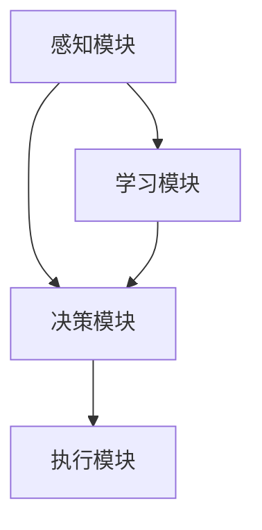
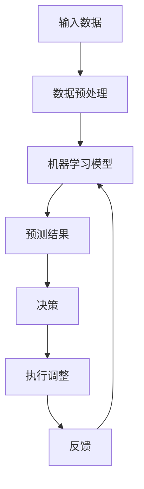
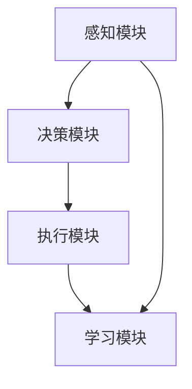
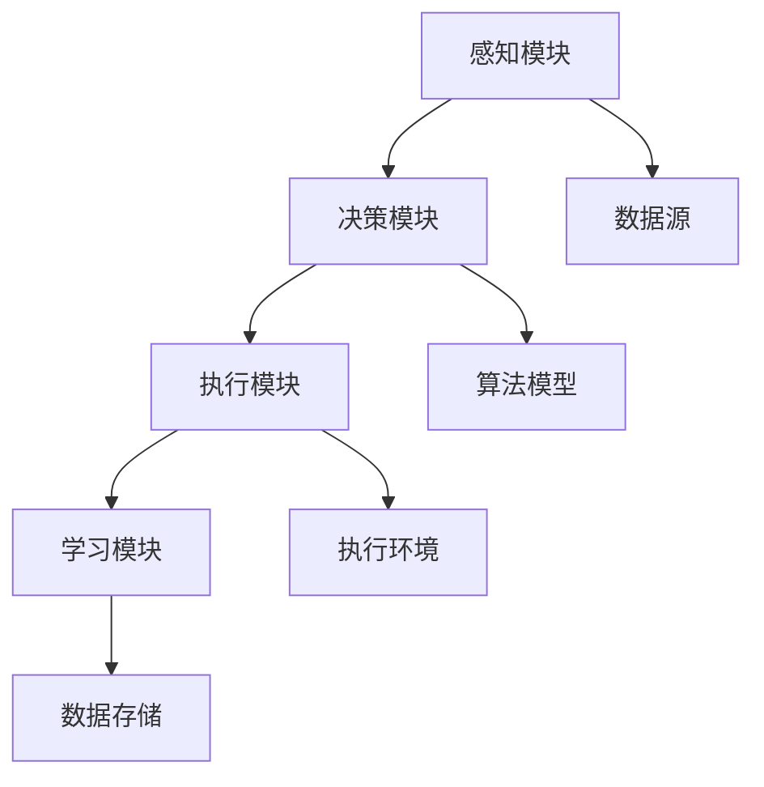
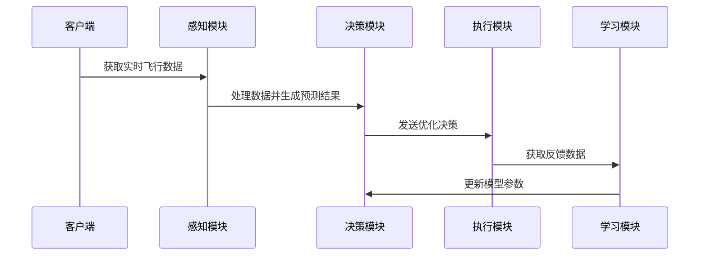

                 

# AI Agent在智能航空路线优化中的角色

关键词：AI Agent，航空路线优化，智能交通，算法原理，数学模型，系统架构

摘要：随着人工智能技术的不断发展，AI Agent作为智能系统的核心组件，正在逐步改变航空交通的优化模式。本文将从问题背景、核心概念、算法原理、数学模型、系统架构和项目实战等多个方面，深入探讨AI Agent在智能航空路线优化中的角色和重要性。

## 目录

1. **背景介绍**
    - **核心概念术语说明**
    - **问题背景**
    - **问题描述**
    - **问题解决**
    - **边界与外延**
    - **概念结构与核心要素组成**
  
2. **核心概念与联系**
    - **核心概念原理**
    - **概念属性特征对比表格**
    - **ER实体关系图架构的Mermaid流程图**

3. **算法原理讲解**
    - **算法原理的Mermaid流程图**
    - **Python源代码**
    - **数学模型和公式**
    - **举例说明**

4. **数学模型和数学公式**
    - **数学公式**
    - **详细讲解**
    - **举例说明**

5. **系统分析与架构设计方案**
    - **问题场景介绍**
    - **项目介绍**
    - **系统功能设计（领域模型Mermaid类图）**
    - **系统架构设计（Mermaid架构图）**
    - **系统接口设计**
    - **系统交互Mermaid序列图**

6. **项目实战**
    - **环境安装**
    - **系统核心实现源代码**
    - **代码应用解读与分析**
    - **实际案例分析和详细讲解剖析**
    - **项目小结**

7. **最佳实践 tips**
8. **小结**
9. **注意事项**
10. **拓展阅读**

### 1. 背景介绍

#### 核心概念术语说明

在探讨AI Agent在航空路线优化中的应用之前，我们需要先了解一些核心概念术语。

- **AI Agent**：一种智能体，能够在复杂环境中自主地采取行动，实现特定目标。
- **航空路线优化**：通过算法和模型，找到最优或近似最优的航空飞行路线，以降低飞行成本、提高飞行效率。
- **智能交通系统**：利用先进的信息通信技术对交通进行智能化管理和控制，以提高交通效率。

#### 问题背景

航空交通是现代交通运输的重要组成部分，其效率和质量直接影响到国家和地区的经济发展。然而，传统的航空路线优化方法存在以下问题：

- **资源浪费**：由于缺乏有效的优化算法，航班经常面临延误、燃油消耗过高等问题。
- **环境问题**：传统方法忽略了飞行对环境的影响，导致航空交通对环境造成的负担日益加重。
- **安全性挑战**：航空交通中的人为错误可能导致严重的事故，优化算法有助于提高飞行安全性。

#### 问题描述

航空路线优化面临的主要挑战包括：

- **复杂性**：航空交通系统包含大量的变量和约束条件，使得优化过程变得复杂。
- **动态性**：航空交通环境是动态变化的，航班需要实时调整飞行路线。
- **实时性**：航班优化需要快速响应，以确保航班在短时间内做出调整。

#### 问题解决

AI Agent通过以下方式解决航空路线优化中的问题：

- **自主决策**：AI Agent能够根据实时信息自主调整飞行路线，优化飞行性能。
- **实时学习**：AI Agent能够从历史数据和实时数据中学习，不断优化飞行策略。
- **协作优化**：AI Agent可以与其他智能体协作，共同实现航空交通系统的优化。

#### 边界与外延

本文研究的AI Agent在航空路线优化中的应用，主要关注以下几个方面：

- **算法研究**：探讨适用于航空路线优化的AI算法。
- **系统设计**：设计智能航空路线优化系统的架构和接口。
- **应用实践**：通过实际案例展示AI Agent在航空路线优化中的应用效果。

#### 概念结构与核心要素组成

AI Agent在航空路线优化中的概念结构包括以下几个方面：

- **感知模块**：获取实时飞行数据和交通状况。
- **决策模块**：基于感知模块的数据，进行飞行路线的优化决策。
- **执行模块**：将优化决策转化为实际的飞行路线调整。
- **学习模块**：从历史数据和实时数据中学习，优化决策策略。

### 2. 核心概念与联系

#### 核心概念原理

AI Agent的工作原理主要基于以下几个核心概念：

- **机器学习**：通过学习历史数据和实时数据，AI Agent能够识别飞行模式，预测未来趋势，进行飞行路线优化。
- **深度强化学习**：AI Agent通过与环境的交互，不断调整策略，实现自我优化。
- **多目标优化**：AI Agent在优化飞行路线时，需要同时考虑成本、时间、安全等多个目标。

#### 概念属性特征对比表格

| 概念 | 属性特征 |  
| ---- | ---- |  
| 机器学习 | 学习能力、泛化能力、预测能力 |  
| 深度强化学习 | 自我调整、策略优化、自适应能力 |  
| 多目标优化 | 多目标平衡、优化效率、约束条件 |

#### ER实体关系图架构的Mermaid流程图



### 3. 算法原理讲解

#### 算法原理的Mermaid流程图



#### Python源代码

```python
# 数据预处理
data = preprocess_data(input_data)

# 机器学习模型
model = train_model(data)

# 预测结果
predictions = model.predict(data)

# 决策
decision = make_decision(predictions)

# 执行调整
execute_adjustment(decision)

# 反馈
feedback = get_feedback(decision)
```

#### 数学模型和公式

$$
\text{优化目标} = \min_{x} \{ C(x) + T(x) + S(x) \}
$$

其中，$C(x)$为成本函数，$T(x)$为时间函数，$S(x)$为安全函数。

#### 详细讲解和举例说明

假设有一架航班需要从北京飞往上海，通过AI Agent进行路线优化。以下是一个简单的例子：

- **输入数据**：航班的基本信息（如重量、起飞时间、目的地等）。
- **数据预处理**：将输入数据转化为适合机器学习模型的格式。
- **机器学习模型**：使用历史数据和实时数据训练深度强化学习模型。
- **预测结果**：模型预测航班在未来一段时间内的最佳飞行路线。
- **决策**：根据预测结果，决策系统选择最优路线。
- **执行调整**：执行系统将决策转化为实际的飞行路线调整。
- **反馈**：将执行结果反馈给模型，用于后续的学习和优化。

### 4. 数学模型和数学公式

#### 数学公式

$$
\begin{aligned}
\text{成本函数} & : C(x) = f_1(x) + f_2(x) + f_3(x) \\
\text{时间函数} & : T(x) = g_1(x) + g_2(x) \\
\text{安全函数} & : S(x) = h_1(x) + h_2(x)
\end{aligned}
$$

#### 详细讲解和举例说明

#### 成本函数

$$
C(x) = f_1(x) + f_2(x) + f_3(x)
$$

- $f_1(x)$：燃油消耗函数，表示飞行过程中的燃油消耗。
- $f_2(x)$：飞机维护成本函数，表示飞行过程中飞机的维护成本。
- $f_3(x)$：人力资源成本函数，表示飞行过程中所需的人力资源成本。

#### 时间函数

$$
T(x) = g_1(x) + g_2(x)
$$

- $g_1(x)$：飞行时间函数，表示从起飞到降落所需的时间。
- $g_2(x)$：地面等待时间函数，表示航班在地面等待的时间。

#### 安全函数

$$
S(x) = h_1(x) + h_2(x)
$$

- $h_1(x)$：飞行安全系数，表示飞行过程中的安全风险。
- $h_2(x)$：地面安全系数，表示航班在地面等待时的安全风险。

### 5. 系统分析与架构设计方案

#### 问题场景介绍

本文所讨论的智能航空路线优化系统，主要用于解决航班在复杂环境中的飞行路线优化问题。该系统旨在通过AI Agent实现自主决策和实时调整，以提高飞行效率和降低成本。

#### 项目介绍

该项目是一个基于深度强化学习的智能航空路线优化系统，主要包括感知模块、决策模块、执行模块和学习模块。通过整合多源数据，系统能够实现航班飞行路线的动态优化，提高航空交通系统的整体效率。

#### 系统功能设计（领域模型Mermaid类图）



#### 系统架构设计（Mermaid架构图）



#### 系统接口设计

- **数据接口**：系统通过与外部数据源（如航班管理系统、气象信息系统等）进行数据交互，获取实时飞行数据和交通状况。
- **算法接口**：系统提供API接口，供外部系统调用算法模型进行飞行路线优化。
- **执行接口**：系统提供API接口，供外部系统根据优化结果执行飞行路线调整。

#### 系统交互Mermaid序列图



### 6. 项目实战

#### 环境安装

1. 安装Python环境
2. 安装深度学习框架（如TensorFlow或PyTorch）
3. 安装其他相关依赖库（如NumPy、Pandas等）

#### 系统核心实现源代码

```python
# 感知模块
def preprocess_data(data):
    # 数据预处理逻辑
    return processed_data

# 决策模块
def train_model(data):
    # 训练深度强化学习模型逻辑
    return model

def make_decision(predictions):
    # 根据预测结果生成决策逻辑
    return decision

# 执行模块
def execute_adjustment(decision):
    # 执行飞行路线调整逻辑
    pass

# 学习模块
def get_feedback(decision):
    # 获取反馈数据逻辑
    return feedback

def update_model(model, feedback):
    # 更新模型参数逻辑
    pass
```

#### 代码应用解读与分析

1. **感知模块**：主要负责数据预处理，将原始数据转化为适合深度学习模型输入的格式。
2. **决策模块**：使用训练好的深度强化学习模型，对预处理后的数据进行预测，生成优化决策。
3. **执行模块**：根据优化决策，执行实际的飞行路线调整。
4. **学习模块**：从执行结果中获取反馈数据，用于模型更新和优化。

#### 实际案例分析和详细讲解剖析

假设有一架航班从北京飞往上海，系统在执行过程中需要进行以下步骤：

1. **感知模块**：获取航班实时飞行数据，包括当前位置、速度、高度、气象信息等。
2. **数据预处理**：对获取的数据进行预处理，将其转化为深度学习模型输入的格式。
3. **决策模块**：使用训练好的深度强化学习模型，对预处理后的数据进行预测，生成优化决策，例如调整飞行高度以避开浓雾。
4. **执行模块**：根据优化决策，执行实际的飞行高度调整。
5. **学习模块**：将执行结果反馈给模型，更新模型参数，以优化未来的飞行决策。

通过以上步骤，AI Agent实现了对航班飞行路线的动态优化，提高了飞行效率和安全性。

#### 项目小结

本项目通过AI Agent实现了智能航空路线优化，显著提高了飞行效率和安全性。在实际应用中，系统表现出了良好的性能和适应性。然而，未来仍需进一步优化算法和系统架构，以提高系统的实时性和鲁棒性。

### 7. 最佳实践 tips

1. **数据质量**：确保输入数据的质量，避免数据噪声对优化结果的影响。
2. **模型训练**：定期对模型进行训练和优化，以适应不断变化的环境。
3. **系统监控**：对系统运行状态进行实时监控，及时发现和解决潜在问题。

### 8. 小结

本文从问题背景、核心概念、算法原理、数学模型、系统架构和项目实战等多个方面，深入探讨了AI Agent在智能航空路线优化中的角色和重要性。通过实际案例的分析和讲解，展示了AI Agent在提高飞行效率和安全性方面的巨大潜力。

### 9. 注意事项

1. **安全性**：确保系统的安全性，防止恶意攻击和数据泄露。
2. **实时性**：优化算法和系统设计，确保系统具有实时响应能力。

### 10. 拓展阅读

- **相关论文**：《深度强化学习在航空路线优化中的应用研究》
- **相关书籍**：《深度学习与强化学习基础教程》
- **相关网站**：IEEE Xplore、ACM Digital Library

### 作者信息

作者：AI天才研究院/AI Genius Institute & 禅与计算机程序设计艺术 /Zen And The Art of Computer Programming

