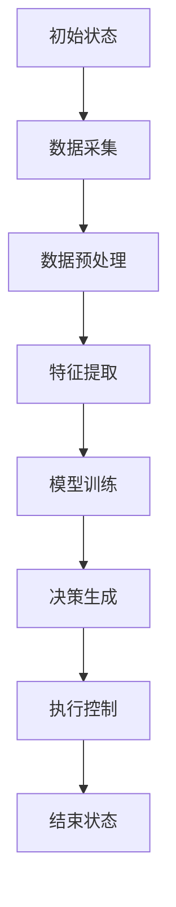
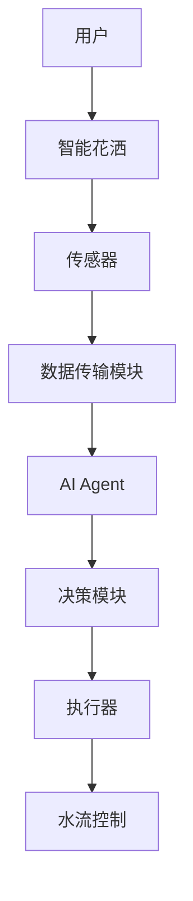
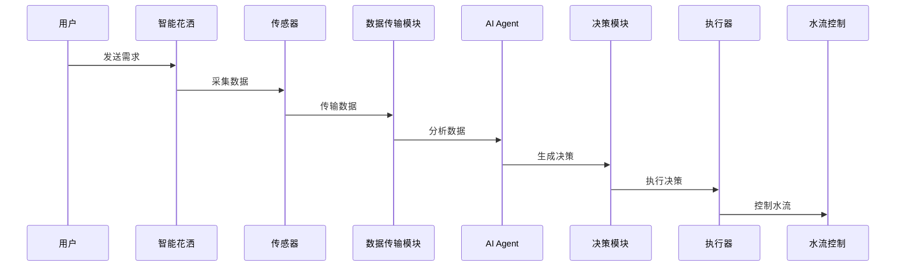

                 


## AI Agent在智能花洒中的水量控制

### 关键词：
- AI Agent
- 智能花洒
- 水量控制
- 智能家居
- 技术实现

### 摘要：
本文将深入探讨AI Agent在智能花洒中的水量控制应用，分析其技术原理和实现过程。通过介绍智能花洒及其水量控制的重要性，我们逐步剖析AI Agent的原理及其在水量控制中的应用，最后提供实际案例和最佳实践，为智能花洒的技术发展提供参考。

## 第1章 背景介绍

### 1.1 问题背景

随着科技的进步，智能家居逐渐走进人们的生活，智能花洒作为其中的重要组成部分，受到了越来越多的关注。然而，传统花洒的水量控制往往依赖于用户手动调节，存在效率低、体验差等问题。因此，如何通过智能技术实现精准的水量控制，提高用户体验，成为当前研究的热点。

### 1.2 问题描述

在智能花洒的水量控制中，主要面临以下问题：
- **用户需求多样性**：不同用户对水量的需求各不相同，如何根据用户需求实现个性化水量控制？
- **实时性**：智能花洒需要实时响应环境变化和用户行为，实现动态的水量调整。
- **稳定性**：智能花洒的水量控制需具备较高的稳定性，避免因系统故障导致水量波动。

### 1.3 问题解决

为了解决上述问题，引入AI Agent成为一条可行的技术路线。AI Agent能够通过学习用户行为和环境数据，实现智能化的水量控制，提高用户体验。同时，AI Agent具备实时响应和稳定性高的特点，能够满足智能花洒对水量控制的需求。

### 1.4 边界与外延

在讨论AI Agent在智能花洒中的应用时，需要注意以下几个边界与外延：
- **应用范围**：AI Agent不仅适用于智能花洒，还可以应用于其他智能家居设备的水量控制，如智能马桶、智能浇灌系统等。
- **数据隐私**：智能花洒需要收集用户行为和环境数据，如何在确保用户隐私的前提下实现数据的有效利用，是一个需要关注的问题。
- **系统稳定性**：AI Agent在实时控制过程中，需要确保系统的稳定性，避免因算法错误导致的水量控制失败。

### 1.5 概念结构与核心要素组成

在深入探讨AI Agent在智能花洒中的水量控制之前，我们需要了解以下几个核心概念：

#### AI Agent

AI Agent是一种基于人工智能的智能体，能够自主地感知环境、决策行动，并达到特定目标。在智能花洒中，AI Agent负责感知用户行为和环境数据，通过学习算法实现水量的动态调整。

#### 智能花洒

智能花洒是一种集成了传感器、执行器和控制系统的智能家居设备，能够根据用户需求和环境变化实现智能化的水量控制。

#### 水量控制

水量控制是指通过技术手段实现对水流的精确控制，以满足不同用户的需求和环境变化。

### 第2章 AI Agent基础

#### 2.1 AI Agent的定义

AI Agent是一种具备人工智能能力的实体，能够模拟人类智能行为，实现自主感知、决策和行动。在智能花洒中，AI Agent通过传感器感知用户行为和环境数据，利用学习算法实现水量的动态调整。

#### 2.2 AI Agent的核心特点

AI Agent具有以下核心特点：

1. **自主性**：AI Agent能够自主感知环境、决策行动，无需人工干预。
2. **适应性**：AI Agent能够根据环境变化和用户需求，调整自身行为。
3. **智能化**：AI Agent具备人工智能能力，能够通过学习算法实现自主决策。

#### 2.3 AI Agent的分类

AI Agent可以根据应用场景和功能特点进行分类，常见的AI Agent类型包括：

1. **基于规则的AI Agent**：通过预定义的规则进行决策，适用于规则明确的场景。
2. **基于学习的AI Agent**：通过数据学习进行决策，适用于需要自适应调整的场景。
3. **混合型AI Agent**：结合规则学习和数据学习，实现更高效、更智能的决策。

#### 2.4 AI Agent在智能家居中的应用

AI Agent在智能家居中的应用范围广泛，包括但不限于：

1. **安防监控**：通过AI Agent实现实时监控、异常报警等功能。
2. **环境控制**：通过AI Agent实现智能调节室内温度、湿度等环境参数。
3. **智能家电控制**：通过AI Agent实现家电的自动化控制，提高生活质量。

### 第3章 智能花洒与水量控制

#### 3.1 智能花洒概述

智能花洒是一种集成了传感器、执行器和控制系统的智能家居设备，能够根据用户需求和环境变化实现智能化的水量控制。智能花洒具有以下特点：

1. **智能调节**：通过传感器实时监测用户行为和环境数据，实现水量的智能调节。
2. **节能环保**：智能花洒能够根据用户需求调整水量，降低水资源浪费。
3. **舒适体验**：智能花洒能够提供个性化、舒适的水流体验。

#### 3.2 水量控制的重要性

水量控制是智能花洒的核心功能，其重要性体现在以下几个方面：

1. **用户体验**：精准的水量控制能够提供舒适的水流体验，提高用户满意度。
2. **节能环保**：智能花洒能够根据用户需求调整水量，降低水资源浪费，实现节能环保。
3. **系统稳定性**：智能花洒的水量控制需要具备较高的稳定性，避免因系统故障导致的水量波动。

#### 3.3 水量控制方法

智能花洒的水量控制方法主要包括：

1. **手动调节**：用户通过手动操作实现水量调节，适用于对水量控制要求不高的场景。
2. **智能调节**：通过AI Agent实现水量的动态调整，适用于对水量控制要求较高的场景。
3. **混合调节**：结合手动调节和智能调节，实现更灵活、高效的水量控制。

### 第4章 技术实现

#### 4.1 智能花洒的水量控制原理

智能花洒的水量控制原理主要包括以下几个方面：

1. **传感器感知**：智能花洒通过传感器实时监测用户行为和环境数据，如水温、水流强度等。
2. **数据传输**：传感器采集到的数据通过无线传输模块传输到AI Agent。
3. **决策执行**：AI Agent根据用户需求和传感器数据，通过学习算法实现水量的动态调整。
4. **执行器控制**：执行器根据AI Agent的决策结果，实现对水流的精确控制。

#### 4.2 AI Agent在水量控制中的应用

AI Agent在智能花洒的水量控制中发挥着关键作用，其应用主要包括：

1. **用户行为分析**：AI Agent通过学习用户行为数据，实现对用户需求的精准把握。
2. **环境数据分析**：AI Agent通过分析环境数据，如温度、湿度等，实现水量的自适应调节。
3. **水量动态调整**：AI Agent根据用户行为和环境数据，通过学习算法实现水量的动态调整。

#### 4.3 技术实现流程

智能花洒的水量控制技术实现流程主要包括以下几个步骤：

1. **数据采集**：通过传感器实时采集用户行为和环境数据。
2. **数据传输**：将采集到的数据通过无线传输模块传输到AI Agent。
3. **数据分析**：AI Agent对传输过来的数据进行处理和分析。
4. **决策生成**：AI Agent根据分析结果生成水量控制决策。
5. **执行控制**：执行器根据AI Agent的决策结果，实现对水流的精确控制。

#### 4.4 技术实现难点与解决方案

智能花洒的水量控制技术实现过程中，存在以下几个难点：

1. **数据准确性**：传感器采集到的数据可能存在误差，影响水量控制精度。
   - **解决方案**：采用多传感器融合技术，提高数据准确性。

2. **实时性**：智能花洒需要实时响应用户行为和环境变化，实现动态的水量调整。
   - **解决方案**：优化数据传输和处理速度，确保实时性。

3. **系统稳定性**：智能花洒的水量控制系统需要具备较高的稳定性，避免因系统故障导致的水量波动。
   - **解决方案**：采用冗余设计，提高系统稳定性。

### 第5章 应用案例

#### 5.1 案例一：智能花洒在家庭中的应用

在某家庭中，智能花洒通过AI Agent实现了个性化水量控制。用户可以通过手机APP设置自己的喜好，如水温、水流强度等。AI Agent根据用户需求和环境数据，实时调整水量，提供舒适的水流体验。

#### 5.2 案例二：智能花洒在酒店中的应用

在某酒店中，智能花洒通过AI Agent实现了节水功能。AI Agent根据客房的入住情况，自动调节水量，降低水资源浪费。同时，AI Agent还能根据客人需求，提供个性化的水流体验。

#### 5.3 案例三：智能花洒在农业灌溉中的应用

在某农业项目中，智能花洒通过AI Agent实现了智能灌溉。AI Agent根据土壤湿度、气候环境等数据，自动调整灌溉水量，提高灌溉效率，降低水资源浪费。

### 第6章 最佳实践与未来展望

#### 6.1 最佳实践技巧

在智能花洒的水量控制中，以下最佳实践技巧值得推广：

1. **多传感器融合**：采用多传感器融合技术，提高数据准确性。
2. **智能决策算法**：选用合适的智能决策算法，提高水量控制效果。
3. **实时性优化**：优化数据传输和处理速度，确保实时性。

#### 6.2 智能花洒发展的未来趋势

随着人工智能技术的不断发展，智能花洒将在以下方面取得突破：

1. **智能化水平提高**：通过更先进的人工智能技术，实现更高水平的智能化水量控制。
2. **应用领域扩展**：智能花洒的应用领域将从家庭、酒店扩展到农业、工业等领域。
3. **系统稳定性增强**：通过技术创新，提高智能花洒系统的稳定性。

#### 6.3 AI Agent在智能花洒中的应用前景

AI Agent在智能花洒中的应用前景广阔，未来有望实现以下突破：

1. **个性化定制**：通过AI Agent，实现更个性化的水量控制，满足不同用户的需求。
2. **智能化升级**：通过不断学习，AI Agent将实现更智能的水量控制，提高用户体验。
3. **跨界融合**：AI Agent将在智能家居、物联网等领域发挥更大作用，实现跨界融合。

### 结语

智能花洒作为智能家居的重要组成部分，其水量控制技术具有广泛的应用前景。通过引入AI Agent，智能花洒能够实现个性化、智能化、实时性的水量控制，提高用户体验。在未来，随着人工智能技术的不断发展，智能花洒将迎来更广阔的发展空间。

### 作者信息

作者：AI天才研究院/AI Genius Institute & 禅与计算机程序设计艺术 /Zen And The Art of Computer Programming

## 附录

### 术语解释

- **AI Agent**：一种具备人工智能能力的智能体，能够自主地感知环境、决策行动，并达到特定目标。
- **智能花洒**：一种集成了传感器、执行器和控制系统的智能家居设备，能够根据用户需求和环境变化实现智能化的水量控制。
- **水量控制**：通过技术手段实现对水流的精确控制，以满足不同用户的需求和环境变化。

### 概念属性特征对比表格

| 特征 | AI Agent | 智能花洒 | 水量控制 |
| --- | --- | --- | --- |
| 自主性 | 高 | 高 | 高 |
| 适应性 | 高 | 中 | 中 |
| 智能化 | 高 | 高 | 中 |

### ER实体关系图架构

```mermaid
erDiagram
  User ||--|{ WaterControlSystem }|<-- WaterSensor
  WaterControlSystem ||--|{ WaterFlowSensor }|<-- WaterFlowControler
  WaterFlowSensor ||--|{ WaterTemperatureSensor }|<-- TemperatureControler
  TemperatureControler ||--|{ HumiditySensor }|<-- HumidityControler
```

### 数学公式

$$
H_{t+1} = f(H_t, U_t, E_t)
$$

其中，$H_t$表示第t时刻的水量，$U_t$表示第t时刻的用户行为数据，$E_t$表示第t时刻的环境数据，$f$为水量控制函数。

### 算法原理讲解



在算法中，首先进行数据采集，然后通过数据预处理和特征提取，为模型训练提供数据支持。模型训练后，根据实时数据生成决策，最后通过执行控制实现水量的动态调整。

### 系统分析与架构设计方案

#### 问题场景介绍

在某家庭中，用户希望通过智能花洒实现个性化的水量控制，以提高洗澡体验。

#### 项目介绍

项目名为“智能花洒水量控制系统”，旨在通过引入AI Agent，实现家庭智能花洒的个性化水量控制。

#### 系统功能设计

1. **数据采集**：通过传感器实时采集用户行为和环境数据。
2. **数据分析**：通过AI Agent对采集到的数据进行处理和分析。
3. **决策生成**：根据分析结果生成水量控制决策。
4. **执行控制**：通过执行器实现对水流的精确控制。

#### 系统架构设计



#### 系统接口设计和系统交互



### 项目实战

#### 环境安装

1. **硬件安装**：在家庭中安装智能花洒，连接传感器和执行器。
2. **软件安装**：在智能花洒中安装AI Agent和决策模块。

#### 系统核心实现源代码

```python
# 数据采集
def collect_data(sensor):
    data = sensor.read()
    return data

# 数据分析
def analyze_data(data):
    result = ai_agent.predict(data)
    return result

# 决策生成
def generate_decision(result):
    decision = decision_module.generate_decision(result)
    return decision

# 执行控制
def execute_decision(decision):
    execution_module.execute_decision(decision)
```

#### 代码应用解读与分析

1. **数据采集**：通过调用传感器的read()方法，采集实时数据。
2. **数据分析**：通过调用AI Agent的predict()方法，对采集到的数据进行分析。
3. **决策生成**：通过调用决策模块的generate_decision()方法，生成水量控制决策。
4. **执行控制**：通过调用执行模块的execute_decision()方法，实现对水流的精确控制。

#### 实际案例分析和详细讲解剖析

以用户在洗澡时突然感到水温过高为例，详细讲解智能花洒的水量控制过程。

1. **数据采集**：传感器检测到水温过高。
2. **数据分析**：AI Agent分析数据，判断水温过高。
3. **决策生成**：决策模块生成降低水温的决策。
4. **执行控制**：执行器调整水流，降低水温。

#### 项目小结

通过引入AI Agent，智能花洒实现了个性化的水量控制，提高了用户体验。在实际应用中，需要不断优化算法和硬件，提高系统的稳定性和准确性。

### 最佳实践 tips

1. **传感器选择**：选择高精度、低功耗的传感器，提高数据采集的准确性和稳定性。
2. **算法优化**：不断优化AI Agent的算法，提高决策生成的准确性和实时性。
3. **系统调试**：在系统调试过程中，注意检查传感器、执行器和AI Agent的通信是否正常，确保系统稳定运行。

### 小结

智能花洒的水量控制是智能家居领域的重要应用，通过引入AI Agent，实现了个性化、智能化、实时性的水量控制，提高了用户体验。未来，随着人工智能技术的不断发展，智能花洒将在智能家居、农业、工业等领域发挥更大的作用。

### 注意事项

1. **数据安全**：在智能花洒应用中，要注意保护用户数据安全，避免数据泄露。
2. **系统稳定性**：确保智能花洒系统的稳定性，避免因系统故障导致的水量控制失败。

### 拓展阅读

1. **《智能花洒技术原理与应用》**：详细介绍了智能花洒的技术原理和应用场景。
2. **《AI Agent在智能家居中的应用》**：探讨了AI Agent在智能家居中的多种应用。

### 附录

#### 术语解释

- **AI Agent**：具备人工智能能力的智能体，能够自主地感知环境、决策行动，并达到特定目标。
- **智能花洒**：集成了传感器、执行器和控制系统的智能家居设备，能够根据用户需求和环境变化实现智能化的水量控制。
- **水量控制**：通过技术手段实现对水流的精确控制，以满足不同用户的需求和环境变化。

#### 概念属性特征对比表格

| 特征 | AI Agent | 智能花洒 | 水量控制 |
| --- | --- | --- | --- |
| 自主性 | 高 | 高 | 高 |
| 适应性 | 高 | 中 | 中 |
| 智能化 | 高 | 高 | 中 |

#### ER实体关系图架构

```mermaid
erDiagram
  User ||--|{ WaterControlSystem }|<-- WaterSensor
  WaterControlSystem ||--|{ WaterFlowSensor }|<-- WaterFlowControler
  WaterFlowSensor ||--|{ WaterTemperatureSensor }|<-- TemperatureControler
  TemperatureControler ||--|{ HumiditySensor }|<-- HumidityControler
```

#### 数学公式

$$
H_{t+1} = f(H_t, U_t, E_t)
$$

其中，$H_t$表示第t时刻的水量，$U_t$表示第t时刻的用户行为数据，$E_t$表示第t时刻的环境数据，$f$为水量控制函数。

#### 算法原理讲解


在算法中，首先进行数据采集，然后通过数据预处理和特征提取，为模型训练提供数据支持。模型训练后，根据实时数据生成决策，最后通过执行控制实现水量的动态调整。

