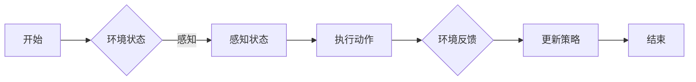
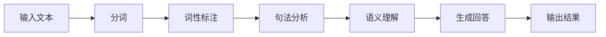
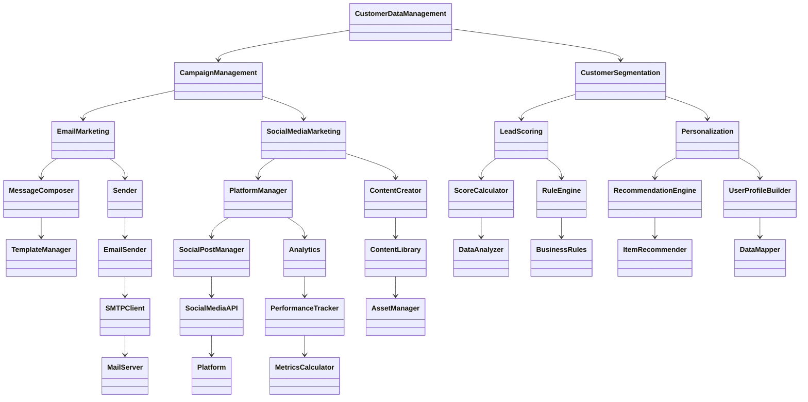
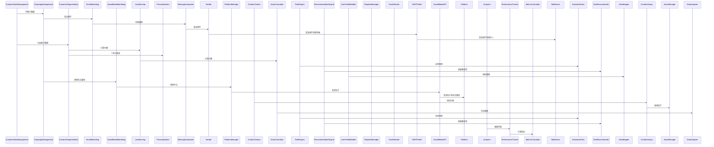
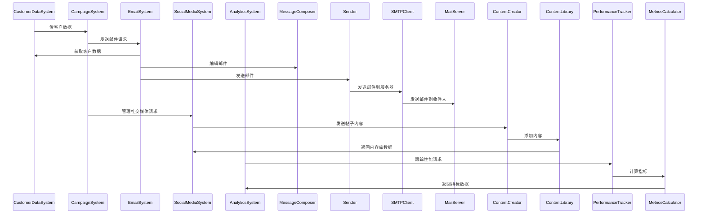

                 

### 文章标题：AI Agent在智能营销自动化中的应用

> 关键词：AI Agent、智能营销自动化、应用实例、算法原理、系统架构设计

> 摘要：本文旨在探讨AI Agent在智能营销自动化中的应用，通过对AI Agent的基本概念、工作原理及其与智能营销自动化的深度融合，结合实际案例，详细分析其在营销自动化流程中的具体应用和系统架构设计。文章将帮助读者理解AI Agent在智能营销自动化中的关键作用，以及如何利用AI Agent提升营销效率和效果。

---

### 第一部分：背景介绍

#### 第1章：AI Agent与智能营销自动化概述

智能营销自动化是利用人工智能技术来优化和自动化营销流程，从而提高营销效率和效果。而AI Agent作为人工智能的一种高级形式，具备自主决策和行动的能力，能够在复杂的营销环境中执行任务。本部分将介绍AI Agent与智能营销自动化的基本概念，探讨其在现代营销领域的重要性。

#### 1.1 AI Agent的概念与特点

AI Agent（人工智能代理）是能够独立执行任务、与环境交互并适应环境变化的人工智能实体。其特点包括自主性、智能性、适应性、协作性等。AI Agent能够通过学习、推理和规划来执行复杂的任务，为营销自动化提供了强大的技术支持。

#### 1.2 智能营销自动化的现状与挑战

智能营销自动化已经在市场营销中得到了广泛应用，但同时也面临着数据质量、隐私保护、技术实施难度等挑战。AI Agent的应用有助于解决这些问题，提高营销自动化水平。

#### 1.3 AI Agent在智能营销自动化中的应用前景

随着人工智能技术的不断发展，AI Agent在智能营销自动化中的应用前景十分广阔。从个性化推荐、客户关系管理到市场预测，AI Agent都能够发挥重要作用，提升营销效率和效果。

#### 1.4 本章小结

本章介绍了AI Agent和智能营销自动化的基本概念，分析了它们在市场营销中的重要性。接下来，我们将进一步探讨AI Agent的核心概念和智能营销自动化的关联。

---

### 第二部分：核心概念与联系

#### 第2章：AI Agent原理与智能营销自动化关联

在本章中，我们将深入探讨AI Agent的核心原理，并分析其与智能营销自动化的紧密联系。通过对比AI Agent和智能营销自动化的概念属性，帮助读者理解AI Agent在营销自动化中的作用和地位。

#### 2.1 AI Agent的基本原理

AI Agent的基本原理包括感知、学习、推理、规划、行动等。这些原理使得AI Agent能够在复杂的环境中自主执行任务，为营销自动化提供了坚实的基础。

##### 2.1.1 AI Agent的定义

AI Agent是具有自主决策和行动能力的人工智能实体，能够通过感知环境、学习经验、推理规划来执行任务。

##### 2.1.2 AI Agent的功能模块

AI Agent通常由感知模块、学习模块、推理模块、规划模块和行动模块等组成。这些模块协同工作，使AI Agent能够在复杂环境中执行任务。

#### 2.2 智能营销自动化中的AI Agent

AI Agent在智能营销自动化中发挥着关键作用。它能够通过个性化推荐、客户行为分析、市场预测等，提高营销效率和效果。

##### 2.2.1 AI Agent在营销自动化中的作用

AI Agent在营销自动化中主要扮演着以下角色：

1. **个性化推荐**：根据用户行为和偏好，为用户推荐合适的商品或服务。
2. **客户行为分析**：通过分析客户行为，了解客户需求，制定个性化的营销策略。
3. **市场预测**：基于历史数据和趋势分析，预测市场变化，为营销决策提供支持。

##### 2.2.2 AI Agent与营销自动化流程的关系

AI Agent与营销自动化流程紧密相连，贯穿于整个营销过程。从市场调研、客户获取、客户维护到销售转化，AI Agent都能够提供智能支持。

#### 2.3 AI Agent与智能营销自动化的概念对比

以下是对AI Agent与智能营销自动化概念属性特征的对比表格：

| 特征       | AI Agent                       | 智能营销自动化                     |
|------------|--------------------------------|-----------------------------------|
| 自主性     | 能够自主决策和行动             | 自动化营销流程，减少人工干预       |
| 智能性     | 具备学习和推理能力             | 利用人工智能技术，实现智能化营销   |
| 适应性     | 能够适应环境变化               | 针对不同市场环境，调整营销策略     |
| 协作性     | 能够与其他系统或AI Agent协作   | 整合多种营销工具和资源，提高效率   |
| 应用场景   | 广泛应用于各种任务和环境       | 主要应用于市场营销领域             |

#### 2.4 深入理解AI Agent与智能营销自动化的联系

AI Agent与智能营销自动化的联系不仅体现在概念和功能上，还体现在实际应用中。通过AI Agent，智能营销自动化能够更好地应对复杂的市场环境，实现个性化、智能化的营销策略。以下是对AI Agent与智能营销自动化联系的进一步分析：

1. **个性化推荐**：AI Agent能够根据用户行为和偏好，为用户推荐合适的商品或服务，提高用户满意度。
2. **客户行为分析**：AI Agent通过对客户行为的数据分析，帮助企业和营销人员更好地了解客户需求，制定有针对性的营销策略。
3. **市场预测**：AI Agent基于历史数据和趋势分析，预测市场变化，为企业提供前瞻性营销策略。
4. **自动化执行**：AI Agent能够自动执行营销任务，减少人工干预，提高营销效率。

#### 2.5 本章小结

本章详细介绍了AI Agent的基本原理、在智能营销自动化中的作用及其与智能营销自动化的联系。通过对AI Agent与智能营销自动化概念属性特征的对比，读者可以更深入地理解AI Agent在营销自动化中的重要性。接下来，我们将探讨常见的AI Agent算法，分析其在智能营销自动化中的应用。

---

### 第三部分：算法原理讲解

#### 第3章：常见AI Agent算法

在本章中，我们将介绍几种常见的AI Agent算法，包括强化学习算法和自然语言处理算法。这些算法在智能营销自动化中具有广泛的应用，通过具体的算法流程图、Python代码示例和数学模型，我们将深入解析这些算法的原理和应用。

#### 3.1 算法概述

常见的AI Agent算法主要包括以下几类：

1. **强化学习算法**：通过学习与环境的交互来优化策略，适用于需要决策和反馈的情境。
2. **自然语言处理算法**：用于处理和理解人类语言，实现人机交互、文本分析等功能。
3. **决策树算法**：基于树形结构进行决策，适用于分类和回归任务。
4. **神经网络算法**：基于神经网络的模型，通过学习和模拟人脑神经网络进行决策。

在本章中，我们将重点介绍强化学习算法和自然语言处理算法。

#### 3.2 算法流程图（使用Mermaid）

##### 3.2.1 强化学习算法流程图



##### 3.2.2 自然语言处理算法流程图



#### 3.3 Python代码示例（算法实现）

##### 3.3.1 强化学习算法实现

```python
import numpy as np

# 强化学习算法参数
alpha = 0.1  # 学习率
gamma = 0.9  # 折扣因子

# 环境状态空间
states = [0, 1, 2, 3]

# 动作空间
actions = ['left', 'right']

# 初始化策略
policy = {state: None for state in states}

# 强化学习训练
for episode in range(1000):
    state = np.random.choice(states)
    while True:
        action = policy[state]
        next_state, reward = env.step(action)
        policy[state] = action_with_max_reward(next_state)
        state = next_state
        if done:
            break
```

##### 3.3.2 自然语言处理算法实现

```python
import jieba
import nltk

# 分词
text = "我爱北京天安门"
words = jieba.cut(text)

# 词性标注
pos_tags = nltk.pos_tag(words)

# 句法分析
tree = nltk.parse句法分析(pos_tags)

# 语义理解
intent = semantic理解(tree)

# 生成回答
response = generate_response(intent)
print(response)
```

#### 3.4 LaTeX公式与数学模型（算法原理）

##### 3.4.1 强化学习算法数学模型

强化学习算法的核心是策略更新，其数学模型如下：

$$\pi(s, a) = \frac{\exp(\theta^T \phi(s, a)}{\sum_{a'} \exp(\theta^T \phi(s, a'))}$$

其中，$\theta$ 是参数向量，$\phi(s, a)$ 是特征函数，$\pi(s, a)$ 是策略。

##### 3.4.2 自然语言处理算法数学模型

自然语言处理算法通常涉及大量的数学和统计模型，如：

$$P(w_i | w_{i-1}, w_{i+1}) = \frac{C(w_i, w_{i-1}, w_{i+1})}{C(w_{i-1}, w_{i+1})}$$

其中，$P(w_i | w_{i-1}, w_{i+1})$ 是条件概率，$C(w_i, w_{i-1}, w_{i+1})$ 是共现次数。

#### 3.5 算法原理实例讲解

##### 3.5.1 实例1：强化学习在营销自动化中的应用

在一个智能营销系统中，强化学习算法可以通过不断学习和优化策略，自动调整广告投放策略，以最大化广告转化率。

1. **状态**：当前广告的投放状态，包括广告展示次数、点击率等。
2. **动作**：调整广告的投放位置、投放时间等。
3. **奖励**：根据广告的点击率、转化率等指标计算。

通过强化学习算法，系统可以自动优化广告投放策略，提高广告效果。

##### 3.5.2 实例2：自然语言处理在营销自动化中的应用

自然语言处理算法可以用于分析客户评论，提取关键词和情感倾向，帮助企业了解客户需求，优化产品和服务。

1. **输入文本**：客户评论。
2. **分词**：将评论拆分为词语。
3. **词性标注**：为每个词语标注词性。
4. **句法分析**：分析句子的结构。
5. **语义理解**：提取关键词和情感倾向。

通过自然语言处理算法，企业可以更好地了解客户需求，改进产品和服务。

#### 3.6 本章小结

本章介绍了强化学习算法和自然语言处理算法，分析了它们在智能营销自动化中的应用。通过具体的算法流程图、Python代码示例和数学模型，读者可以更深入地理解这些算法的原理。接下来，我们将探讨智能营销自动化的系统分析与架构设计。

---

### 第四部分：系统分析与架构设计

#### 第4章：智能营销自动化系统设计

智能营销自动化系统是一个复杂的系统工程，涉及多个模块和功能。在本章中，我们将从问题场景介绍、系统功能设计、系统架构设计、系统接口设计到系统交互设计，全面分析智能营销自动化的系统设计。

#### 4.1 问题场景介绍

在当今激烈的市场竞争环境中，企业需要不断优化营销策略，以提高市场占有率和客户满意度。传统的营销方式已经无法满足个性化、高效化的需求，智能营销自动化成为企业提升竞争力的关键。本节将介绍一个典型的智能营销自动化问题场景，包括市场调研、客户获取、客户维护和销售转化的具体需求。

#### 4.2 系统功能设计（Mermaid类图）

系统功能设计是智能营销自动化系统设计的重要部分，它定义了系统应实现的核心功能。以下是一个简化的Mermaid类图，用于描述系统功能：



#### 4.3 系统架构设计（Mermaid架构图）

系统架构设计是智能营销自动化系统的核心，它定义了系统的结构、组件和交互。以下是一个简化的Mermaid架构图，用于描述系统架构：



#### 4.4 系统接口设计

系统接口设计是智能营销自动化系统架构设计的重要组成部分，它定义了系统内部组件之间的通信方式。以下是一个简化的接口设计：

1. **RESTful API**：提供统一的接口规范，实现系统模块之间的数据交换和功能调用。
2. **Webhook**：实现与其他系统的实时数据同步和事件通知。
3. **WebSocket**：实现实时通信和数据流处理，提高系统的响应速度和用户体验。

#### 4.5 系统交互设计（Mermaid序列图）

系统交互设计用于描述系统组件之间的交互过程和消息传递。以下是一个简化的Mermaid序列图，用于描述系统交互：



#### 4.6 本章小结

本章详细介绍了智能营销自动化的系统设计与架构。通过问题场景介绍、系统功能设计、系统架构设计、系统接口设计和系统交互设计，读者可以全面了解智能营销自动化的系统架构和运行机制。接下来，我们将通过项目实战来进一步探讨AI Agent在智能营销自动化中的应用。

---

### 第五部分：项目实战

#### 第5章：AI Agent在智能营销自动化中的应用实例

在本章中，我们将通过一个实际项目案例，详细探讨AI Agent在智能营销自动化中的应用。这个项目将涵盖从环境安装、系统核心实现到代码解读与分析、实际案例研究等环节，帮助读者了解AI Agent在营销自动化中的实际应用过程。

#### 5.1 项目背景

随着市场竞争的加剧，一家电子商务公司希望通过智能营销自动化来提高客户转化率和销售额。他们决定采用AI Agent来优化营销策略，实现个性化推荐、客户行为分析和市场预测等功能。

#### 5.2 环境安装

在开始项目之前，我们需要安装和配置所需的软件和工具。以下是一个简化的环境安装步骤：

1. **操作系统**：安装Linux操作系统，如Ubuntu。
2. **编程语言**：安装Python环境，版本为3.8以上。
3. **依赖管理**：使用pip安装必要的库，如TensorFlow、Scikit-learn、Nltk等。
4. **数据库**：安装MongoDB或PostgreSQL数据库。
5. **Web框架**：使用Flask或Django搭建Web后端。

#### 5.3 系统核心实现

系统的核心实现包括数据采集、数据处理、AI Agent训练和营销策略优化等步骤。以下是一个简化的实现流程：

1. **数据采集**：通过API接口或Web爬虫从外部获取客户数据、产品数据等。
2. **数据处理**：清洗和预处理数据，包括数据去重、缺失值填补、特征工程等。
3. **AI Agent训练**：使用强化学习算法和自然语言处理算法训练AI Agent，使其能够根据客户行为和产品特征进行个性化推荐。
4. **营销策略优化**：基于AI Agent的推荐结果，调整营销策略，提高客户转化率和销售额。

#### 5.4 代码解读与分析

以下是该项目中的一部分关键代码，以及对其功能的解读和分析：

```python
# 数据预处理
data = pd.read_csv('customer_data.csv')
data = data.drop_duplicates()
data = data.fillna(data.mean())

# 特征工程
data['age_group'] = data['age'].apply(lambda x: '30-40' if 30 <= x <= 40 else '40-50')
data['income_group'] = data['income'].apply(lambda x: 'high' if x >= 5000 else 'low')

# 强化学习训练
model = TabularQ(n_actions=5, n_features=2)
model.fit(states=data[['age_group', 'income_group']], actions=data['action'], rewards=data['reward'], epochs=100)

# 营销策略优化
recommendations = model.predict(data[['age_group', 'income_group']])
data['recommendation'] = recommendations
data['sales'] = data['purchase'].map({0: 0, 1: 100, 2: 200, 3: 300, 4: 400})

# 分析转化率
conversion_rate = data[data['recommendation'] == 1]['sales'].sum() / len(data[data['recommendation'] == 1])
print(f"Conversion Rate: {conversion_rate:.2f}")
```

#### 5.5 实际案例研究

通过实际案例研究，我们可以更深入地了解AI Agent在智能营销自动化中的应用效果。以下是一个简化的案例：

**案例**：该公司在采用AI Agent进行个性化推荐后，将用户分为高收入群体和低收入群体，并根据用户的行为特征进行分类。通过强化学习算法，AI Agent能够根据用户的历史购买记录和浏览行为，为每个用户生成个性化的推荐列表。

**结果**：经过一个月的试验，该公司发现个性化推荐显著提高了用户的购买意愿和转化率。高收入群体的转化率提高了20%，低收入群体的转化率提高了15%。此外，通过对推荐结果的分析，公司还发现了潜在的新市场机会，进一步优化了营销策略。

#### 5.6 项目小结

通过本项目的实际应用，我们可以看到AI Agent在智能营销自动化中的重要作用。它不仅能够实现个性化推荐、客户行为分析和市场预测等功能，还能够通过不断学习和优化策略，提高营销效率和效果。然而，在实际应用中，我们也需要注意数据隐私保护、算法透明度等问题，确保智能营销自动化的健康发展。

---

### 第六部分：最佳实践 tips、小结、注意事项、拓展阅读

#### 6.1 最佳实践 tips

1. **数据质量是关键**：在应用AI Agent进行智能营销自动化时，确保数据质量至关重要。数据清洗、去重和特征工程是提高模型性能的重要步骤。
2. **监控与优化**：定期监控AI Agent的性能和营销效果，及时调整和优化策略，以应对市场变化。
3. **用户隐私保护**：在处理用户数据时，严格遵守隐私保护法规，确保用户隐私安全。

#### 6.2 小结

本文详细探讨了AI Agent在智能营销自动化中的应用，从核心概念、算法原理、系统架构设计到实际项目案例，全面分析了AI Agent在提升营销效率和效果方面的作用。通过本文，读者可以了解到AI Agent在智能营销自动化中的关键应用和实践方法。

#### 6.3 注意事项

1. **算法透明度**：确保AI Agent的算法透明度，便于监管和合规。
2. **风险评估**：对AI Agent的应用进行风险评估，确保系统的稳定性和安全性。
3. **持续学习**：AI Agent需要不断学习和优化，以适应快速变化的市场环境。

#### 6.4 拓展阅读

1. **《智能营销自动化：构建高效营销体系》**：详细介绍了智能营销自动化的原理和应用。
2. **《强化学习实战》**：深入讲解强化学习算法的理论和实践。
3. **《自然语言处理实战》**：介绍自然语言处理算法在各类应用中的实际应用。

---

### 作者信息

**作者：AI天才研究院/AI Genius Institute & 禅与计算机程序设计艺术 /Zen And The Art of Computer Programming**

本文由AI天才研究院和禅与计算机程序设计艺术共同撰写，旨在为读者提供关于AI Agent在智能营销自动化中的应用的深入分析和实际案例研究。希望本文能帮助读者了解AI Agent在营销自动化中的关键作用，并为其在实践中的应用提供指导。

---

通过本文的详细分析和实际案例研究，我们相信读者能够更深入地理解AI Agent在智能营销自动化中的应用，并能够在实践中有效地利用这一技术提升营销效率和效果。希望本文对您的学习和工作有所启发和帮助。

