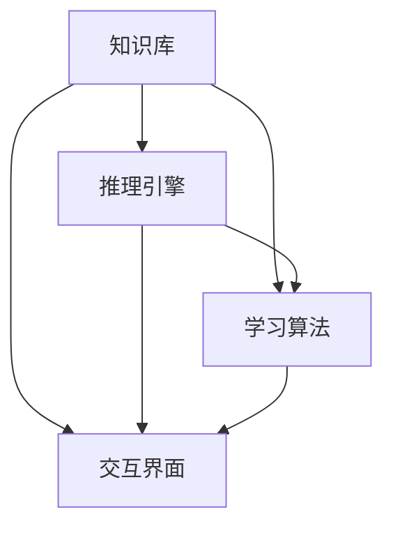

                 

# AI Agent在智能虚拟助理中的角色

## 关键词

- AI代理
- 智能虚拟助理
- 自主交互
- 机器学习
- 用户信任

## 摘要

随着人工智能技术的飞速发展，智能虚拟助理成为了一种新型的服务形式，其在各个领域的应用越来越广泛。AI代理，作为智能虚拟助理的核心组成部分，承担着提升交互质量、增强智能化水平和提高用户体验的重要任务。本文将深入探讨AI代理在智能虚拟助理中的角色，从核心概念、工作原理、应用场景和开发实践等方面进行详细分析，以期为广大开发者提供有价值的参考。

## 引言与背景

### 1.1 问题的背景

近年来，随着互联网和移动设备的普及，用户对便捷、高效、个性化的服务需求日益增长。虚拟助理作为一种新型的交互形式，以其自然语言处理、智能推荐和自主学习等能力，逐渐成为各大公司竞相投入研发的热点。而AI代理，作为虚拟助理的核心技术之一，其重要性和应用价值愈发凸显。

### 1.1.1 虚拟助理的需求增长

虚拟助理最初应用于客户服务领域，通过聊天机器人和语音助手等形式，为用户提供快速、高效的咨询服务。随着技术的进步，虚拟助理的应用场景逐渐拓展到健康咨询、教育辅导、智能家居等多个领域。据统计，全球虚拟助理市场预计将在未来几年内实现高速增长，成为人工智能领域的重要分支。

### 1.1.2 人工智能的发展

人工智能技术的发展为虚拟助理提供了强大的技术支撑。特别是在自然语言处理、机器学习和深度学习等领域的突破，使得虚拟助理在理解用户意图、生成自然语言回复和进行智能决策等方面取得了显著进展。AI代理作为人工智能技术的高级形态，其发展和成熟将进一步推动虚拟助理的普及和应用。

### 1.1.3 AI代理的角色

AI代理，即人工智能代理，是一种能够模拟人类智能行为的计算实体。在智能虚拟助理中，AI代理扮演着决策制定、任务执行和用户交互等关键角色。通过自主学习、推理和自适应能力，AI代理能够为用户提供更加智能化、个性化和高效的服务体验。

### 1.2 问题描述

智能虚拟助理在应用过程中面临诸多挑战，其中最为突出的是交互质量不高、智能化水平有限和用户体验不佳等问题。这些问题严重制约了虚拟助理的实际应用效果和用户满意度。为了解决这些问题，需要引入AI代理技术，通过提升虚拟助理的自主交互能力和智能化水平，从而改善用户体验。

### 1.3 问题解决

AI代理技术在智能虚拟助理中的应用，为解决交互质量不高、智能化水平有限和用户体验不佳等问题提供了有效途径。通过以下措施，可以显著提升虚拟助理的性能和用户体验：

1. **提升交互质量**：AI代理能够通过自然语言处理技术和深度学习算法，更好地理解用户意图，生成更加自然、贴切的回复，从而提升交互质量。
2. **增强智能化水平**：AI代理具备自主学习能力和推理能力，能够根据用户行为和历史数据，动态调整服务策略，提供个性化、智能化的服务。
3. **提高用户体验**：AI代理能够通过个性化推荐、智能提醒和主动服务等功能，满足用户的个性化需求，提高用户体验。

### 1.4 边界与外延

AI代理在智能虚拟助理中的应用具有一定的边界和限制。首先，AI代理需要大量的数据和计算资源支持，这可能导致成本较高和性能瓶颈。其次，AI代理的道德和隐私问题也值得关注，如何确保用户的隐私和安全是当前亟待解决的问题。此外，用户对虚拟助理的信任问题也是一个重要挑战，需要通过技术手段和用户体验设计来逐步建立和提升。

### 1.5 本章小结

本章介绍了智能虚拟助理和AI代理的基本概念、背景和发展趋势，分析了智能虚拟助理在应用过程中面临的挑战，并探讨了AI代理在这些问题解决中的关键作用。下一章将深入探讨AI代理的核心概念和基础理论，为后续内容奠定基础。

## AI代理基础理论

### 2.1 AI代理的核心概念

AI代理（Artificial Intelligence Agent）是一种能够模拟人类智能行为，执行特定任务的计算机程序或实体。AI代理的核心概念包括智能性、自主性、适应性和交互性等。

#### 2.1.1 智能性

智能性是AI代理的基本属性，表现为能够理解和处理复杂问题，进行推理和决策。智能性主要通过机器学习、自然语言处理和知识图谱等技术实现。

#### 2.1.2 自主性

自主性是AI代理的重要特征，表现为能够独立完成特定任务，不需要人工干预。自主性主要通过自动化流程、自我学习和自我优化等实现。

#### 2.1.3 适应性

适应性是AI代理在动态环境中保持高效性能的关键。适应性通过自适应算法、动态调整和实时学习等实现。

#### 2.1.4 交互性

交互性是AI代理与用户和环境进行有效沟通的能力。交互性通过自然语言处理、语音识别和图形用户界面等技术实现。

### 2.2 AI代理的属性特征对比表格

| 属性特征 | 定义 | 对比表格 |
| :--- | :--- | :--- |
| 智能性 | 能理解和处理复杂问题，进行推理和决策 | 传统AI代理：基于规则推理<br>现代AI代理：基于机器学习和深度学习 |
| 自主性 | 能独立完成特定任务，不需要人工干预 | 传统AI代理：部分自主性<br>现代AI代理：高度自主性 |
| 适应性 | 能在动态环境中保持高效性能 | 传统AI代理：适应性较差<br>现代AI代理：自适应能力强 |
| 交互性 | 能与用户和环境进行有效沟通 | 传统AI代理：基于文本交互<br>现代AI代理：支持多模态交互 |

### 2.3 AI代理与传统AI的区别

传统AI主要基于规则和逻辑推理，适用于解决特定领域的问题，但缺乏灵活性和自适应性。现代AI代理则采用机器学习、深度学习和自然语言处理等技术，具备智能性、自主性和适应性，能够处理更复杂的问题，适应更广泛的应用场景。

#### 2.3.1 传统AI的局限性

传统AI主要依靠人类预设的规则和逻辑，难以适应动态变化的环境。此外，传统AI在处理自然语言和理解人类情感方面存在较大挑战。

#### 2.3.2 AI代理的优势

AI代理通过机器学习和深度学习技术，能够从数据中自动提取特征，进行自我学习和优化。在智能性、自主性和适应性方面，AI代理具有显著优势，能够更好地满足用户需求和应对复杂环境。

### 2.4 AI代理的组成部分

AI代理通常由以下四个核心组成部分构成：

#### 2.4.1 知识库

知识库是AI代理的核心组件，用于存储与特定领域相关的知识。知识库可以包括事实、规则、算法和模型等。

#### 2.4.2 推理引擎

推理引擎负责根据知识库中的信息和用户的输入，进行推理和决策。推理引擎可以采用基于规则的推理、基于模型推理和基于数据挖掘的推理等。

#### 2.4.3 学习算法

学习算法负责从数据中自动提取特征，进行自我学习和优化。学习算法可以包括监督学习、无监督学习和强化学习等。

#### 2.4.4 交互界面

交互界面是AI代理与用户和环境进行沟通的通道。交互界面可以包括文本聊天、语音交互和图形界面等。

### 2.5 AI代理的类型

AI代理可以根据其功能和特点进行分类。以下是几种常见的AI代理类型：

#### 2.5.1 知识型AI代理

知识型AI代理主要基于知识库进行推理和决策，适用于知识密集型应用场景，如智能客服、智能问答等。

#### 2.5.2 目标型AI代理

目标型AI代理以实现特定目标为导向，通过规划、决策和执行等步骤，实现目标的最优解。适用于自动驾驶、游戏AI等场景。

#### 2.5.3 情感型AI代理

情感型AI代理能够理解和模拟人类情感，通过情感识别和情感合成技术，提供更加贴近用户需求的交互体验。适用于心理咨询、智能客服等场景。

### 2.6 AI代理的ER实体关系图架构

为了更好地理解AI代理的组成结构和功能，下面给出一个ER实体关系图架构，用于描述AI代理的各个组成部分及其关系。



在这个ER实体关系图中，知识库、推理引擎、学习算法和交互界面分别表示AI代理的四个核心组件，它们之间通过数据流和信息流相互连接，共同实现AI代理的智能交互和自主决策功能。

### 2.7 本章小结

本章介绍了AI代理的核心概念、属性特征、与传统AI的区别以及组成部分和类型。通过对比分析，我们明确了AI代理在现代人工智能领域的重要地位和作用。下一章将深入探讨AI代理的工作原理，进一步揭示其内部运作机制。

## AI代理的工作原理

### 3.1 AI代理的工作流程

AI代理的工作流程可以分为感知环境、决策制定、行动执行和反馈学习四个阶段。

#### 3.1.1 感知环境

感知环境阶段，AI代理通过传感器、摄像头、麦克风等设备获取外部信息，如文字、图像、声音等。这些信息被输入到AI代理的感知模块，进行预处理和特征提取。

#### 3.1.2 决策制定

在决策制定阶段，AI代理根据感知到的环境信息，结合自身知识库和推理引擎，生成一系列可能的行动方案。决策制定过程通常涉及到多目标优化、规划算法和决策树等。

#### 3.1.3 行动执行

在行动执行阶段，AI代理选择最优行动方案，并通过执行模块将其付诸实践。行动执行可能涉及到控制机器人、发送邮件、拨打电话等操作。

#### 3.1.4 反馈学习

在反馈学习阶段，AI代理根据执行结果和用户反馈，对自身的行为进行评估和调整。通过学习算法，AI代理不断优化自身的性能和策略，提高智能化水平。

### 3.2 AI代理的算法原理

AI代理的算法原理主要涉及机器学习、深度学习和强化学习等。

#### 3.2.1 机器学习算法

机器学习算法是一种通过训练模型来模拟人类智能的技术。常见的机器学习算法包括线性回归、决策树、支持向量机等。这些算法可以通过学习历史数据，提取特征，预测未来趋势。

$$
y = wx + b
$$

其中，$y$表示输出，$x$表示输入特征，$w$表示权重，$b$表示偏置。

#### 3.2.2 深度学习算法

深度学习算法是一种基于多层神经网络进行特征提取和预测的技术。常见的深度学习算法包括卷积神经网络（CNN）、循环神经网络（RNN）和生成对抗网络（GAN）等。

#### 3.2.3 强化学习算法

强化学习算法是一种通过奖励和惩罚机制来指导模型进行自主决策的技术。常见的强化学习算法包括Q学习、SARSA和深度确定性策略梯度（DDPG）等。

### 3.3 AI代理的数学模型和公式

在AI代理中，常见的数学模型和公式包括：

1. **逻辑回归**：
$$
P(y=1|x;\theta) = \frac{1}{1 + e^{-\theta^T x}}
$$
其中，$\theta$表示参数，$x$表示输入特征，$y$表示输出标签。

2. **卷积神经网络**：
$$
h_{l}(x) = \sigma(\sum_{k=1}^{K} W_{lk} \cdot h_{l-1}(x) + b_{l})
$$
其中，$h_{l}(x)$表示第$l$层的输出，$W_{lk}$表示权重，$b_{l}$表示偏置，$\sigma$表示激活函数。

3. **强化学习中的Q值**：
$$
Q(s, a) = r + \gamma \max_{a'} Q(s', a')
$$
其中，$s$表示状态，$a$表示动作，$r$表示立即奖励，$\gamma$表示折扣因子，$s'$表示下一状态。

### 3.4 AI代理的举例说明

#### 3.4.1 聊天机器人的工作原理

聊天机器人是一种典型的AI代理，其主要功能是通过自然语言处理和机器学习技术，与用户进行智能对话。以下是一个简单的聊天机器人工作原理示例：

1. **感知环境**：聊天机器人通过文本输入获取用户的提问。
2. **决策制定**：基于用户输入，聊天机器人调用自然语言处理模块，提取关键词和语义信息，生成可能的回答。
3. **行动执行**：聊天机器人选择最佳回答，并将其发送给用户。
4. **反馈学习**：根据用户对回答的反馈，聊天机器人调整自身模型，优化回答质量。

#### 3.4.2 智能客服的代表案例

智能客服是一种广泛应用于企业客户服务领域的AI代理。以下是一个智能客服的典型应用案例：

1. **感知环境**：智能客服通过文本输入获取用户的咨询问题。
2. **决策制定**：智能客服调用知识库和推理引擎，根据用户输入的问题，生成可能的解决方案。
3. **行动执行**：智能客服将解决方案发送给用户，并引导用户进行下一步操作。
4. **反馈学习**：智能客服根据用户的反馈，对自身模型进行优化和调整，提高服务质量和用户满意度。

### 3.5 本章小结

本章介绍了AI代理的工作原理，包括工作流程、算法原理和数学模型。通过具体案例的分析，我们了解了AI代理在智能对话和应用场景中的实际运作方式。下一章将探讨AI代理在智能虚拟助理中的应用，分析其在提升交互质量和智能化水平方面的作用。

## AI代理在智能虚拟助理中的应用

### 4.1 智能虚拟助理的定义

智能虚拟助理（Intelligent Virtual Assistant，IVA）是一种基于人工智能技术的虚拟人物或实体，能够模拟人类智能行为，为用户提供自然、高效的服务。智能虚拟助理通常具备自然语言处理、语音识别、图像识别和自主学习等能力。

#### 4.1.1 智能虚拟助理的概述

智能虚拟助理最初应用于客户服务领域，通过聊天机器人和语音助手等形式，为用户提供快速、高效的咨询服务。随着技术的进步，智能虚拟助理的应用范围逐渐拓展到健康咨询、教育辅导、智能家居等多个领域。

#### 4.1.2 智能虚拟助理的发展历程

智能虚拟助理的发展可以追溯到20世纪90年代的聊天机器人。早期的聊天机器人主要采用基于规则的方法，通过预定义的规则和模板生成回复。随着自然语言处理和机器学习技术的突破，智能虚拟助理逐渐具备了更强的语义理解能力和自主学习能力。

### 4.2 AI代理在虚拟助理中的作用

AI代理在智能虚拟助理中发挥着关键作用，主要表现在以下三个方面：

#### 4.2.1 提升交互质量

AI代理通过自然语言处理和深度学习技术，能够更好地理解用户意图，生成更加自然、贴切的回复，从而提升交互质量。相比传统基于规则的聊天机器人，AI代理能够更加灵活地应对各种场景和用户需求。

#### 4.2.2 增强智能化水平

AI代理具备自主学习能力，能够从用户行为和历史数据中学习，动态调整服务策略，提供个性化、智能化的服务。这使得智能虚拟助理能够更好地满足用户的个性化需求，提高用户体验。

#### 4.2.3 提高用户体验

AI代理通过个性化推荐、智能提醒和主动服务等功能，满足用户的个性化需求，提高用户体验。例如，智能虚拟助理可以根据用户的偏好和历史记录，推荐合适的商品、服务或内容，提供个性化的建议。

### 4.3 AI代理在虚拟助理中的应用场景

AI代理在虚拟助理中的应用场景非常广泛，以下是一些典型的应用场景：

#### 4.3.1 客户服务

客户服务是智能虚拟助理最典型的应用场景之一。AI代理能够处理大量的客户咨询，提供快速、准确的答复，减轻人工客服的工作负担。例如，智能客服机器人可以自动识别用户问题，提供解决方案，引导用户进行下一步操作。

#### 4.3.2 健康咨询

健康咨询是另一个重要的应用场景。AI代理可以通过自然语言处理和医学知识库，为用户提供在线健康咨询和诊疗建议。例如，智能健康助手可以根据用户的症状描述，提供可能的疾病诊断和治疗方案。

#### 4.3.3 教育辅导

教育辅导是AI代理在教育领域的应用。AI代理可以通过自然语言处理和智能推荐技术，为用户提供个性化的学习建议和辅导。例如，智能教育助手可以根据学生的学习进度和兴趣，推荐合适的学习资源和练习题。

#### 4.3.4 家居助手

家居助手是AI代理在智能家居领域的应用。AI代理可以通过语音识别和物联网技术，控制家居设备，提供便捷的家居服务。例如，智能语音助手可以控制灯光、空调、窗帘等家居设备，为用户提供舒适的家居环境。

### 4.4 AI代理在虚拟助理中的挑战

尽管AI代理在智能虚拟助理中具有巨大的应用潜力，但在实际应用过程中仍面临诸多挑战：

#### 4.4.1 技术难题

AI代理需要处理大量的数据，进行复杂的计算和推理。在处理大规模数据和复杂任务时，技术难题如计算效率、资源利用和算法优化等需要得到有效解决。

#### 4.4.2 道德和隐私问题

AI代理在处理用户数据时，可能会涉及到用户的隐私和道德问题。如何保护用户隐私、确保数据安全，以及如何在AI代理中融入道德规范，是当前亟待解决的问题。

#### 4.4.3 用户信任问题

用户对AI代理的信任程度直接影响到虚拟助理的接受度和使用频率。如何提高用户的信任感，增强虚拟助理的可靠性和友好性，是AI代理在应用过程中需要克服的重要挑战。

### 4.5 本章小结

本章介绍了智能虚拟助理的定义、发展历程和应用场景，分析了AI代理在提升交互质量、增强智能化水平和提高用户体验方面的作用。同时，也探讨了AI代理在虚拟助理中面临的挑战。下一章将探讨如何开发AI代理，为智能虚拟助理的实际应用提供技术支持。

## AI代理开发实践

### 5.1 开发AI代理的步骤

开发AI代理是一个复杂的过程，涉及到多个阶段和技术。以下是开发AI代理的基本步骤：

#### 5.1.1 需求分析

在开发AI代理之前，首先需要明确需求。需求分析包括确定AI代理的应用场景、目标用户、功能要求和性能指标等。通过需求分析，可以明确AI代理的定位和目标，为后续开发提供指导。

#### 5.1.2 系统设计

系统设计是开发AI代理的关键环节。系统设计包括架构设计、组件划分和接口设计等。架构设计需要考虑系统的可扩展性、可靠性和性能，组件划分需要明确各个模块的功能和职责，接口设计需要定义系统内部和外部交互的接口。

#### 5.1.3 算法实现

算法实现是AI代理的核心。根据需求分析和系统设计，选择合适的算法和技术进行实现。常见的算法包括机器学习、深度学习和自然语言处理等。在实现过程中，需要对算法进行优化和调试，以满足性能和准确度的要求。

#### 5.1.4 交互界面开发

交互界面是AI代理与用户进行交互的通道。交互界面的开发包括前端设计和后端实现。前端设计需要考虑用户体验和交互效果，后端实现需要处理用户输入、数据存储和接口调用等。

#### 5.1.5 测试与部署

测试与部署是确保AI代理稳定运行的重要环节。测试包括功能测试、性能测试和安全性测试等。在测试过程中，需要发现和修复潜在的问题。部署是将AI代理部署到生产环境中，确保其能够正常运行。

### 5.2 AI代理的核心实现源代码

以下是一个基于Python的AI代理实现的简单示例：

```python
import json
import random
from chatterbot import ChatBot
from chatterbot.trainers import ChatterBotCorpusTrainer

# 创建聊天机器人实例
chatbot = ChatBot(
    'AI Assistant',
    storage_adapter='chatterbot.storage.SQLStorageAdapter',
    trainer='chatterbot.trainers.ChatterBotCorpusTrainer'
)

# 训练聊天机器人
trainer = ChatterBotCorpusTrainer(chatbot)
trainer.train('chatterbot.corpus.english')

# 与用户进行交互
while True:
    try:
        user_input = input("You: ")
        bot_response = chatbot.get_response(user_input)
        print(f"Bot: {bot_response}")
    except (KeyboardInterrupt, EOFError, SystemExit):
        break
```

在这个示例中，我们使用了ChatterBot库来实现聊天机器人。首先，创建一个ChatBot实例，指定存储适配器和训练器。然后，使用ChatterBotCorpusTrainer对聊天机器人进行训练。最后，通过循环与用户进行交互，获取用户输入并返回聊天机器人的回复。

### 5.3 代码应用解读与分析

以下是对上述代码的应用解读与分析：

1. **创建ChatBot实例**：通过`ChatBot('AI Assistant')`创建了一个名为“AI Assistant”的聊天机器人实例。我们指定了存储适配器为`SQLStorageAdapter`，这意味着聊天机器人的对话数据将存储在数据库中。训练器为`ChatterBotCorpusTrainer`，这意味着我们将使用语料库对聊天机器人进行训练。

2. **训练聊天机器人**：使用`ChatterBotCorpusTrainer`对聊天机器人进行训练。我们使用了ChatterBot提供的英语语料库，这是一个包含大量对话样本的数据库，用于训练聊天机器人的对话能力。

3. **与用户进行交互**：通过一个无限循环，程序等待用户输入。用户输入将被传递给`chatbot.get_response()`方法，该方法返回聊天机器人根据用户输入生成的回复。最后，程序将聊天机器人的回复输出到控制台。

### 5.4 实际案例分析和详细讲解剖析

以下是一个实际案例，分析并讲解AI代理在智能客服系统中的应用。

#### 案例背景

某电商企业希望使用AI代理构建智能客服系统，以提供24/7的客户服务。AI代理需要能够处理常见的客户咨询，如订单查询、售后服务、产品推荐等。

#### 案例分析

1. **需求分析**：
   - 提供订单查询功能，用户可以查询订单状态、物流信息等。
   - 提供售后服务咨询，用户可以咨询退换货政策、维修服务等。
   - 提供产品推荐，根据用户浏览记录和购买历史，推荐合适的产品。

2. **系统设计**：
   - 架构设计：采用微服务架构，将订单查询、售后服务和产品推荐等模块分开，便于维护和扩展。
   - 组件划分：订单查询模块、售后服务模块和产品推荐模块等。
   - 接口设计：定义与前端交互的API接口，如查询订单接口、售后服务接口和产品推荐接口。

3. **算法实现**：
   - 订单查询：使用自然语言处理技术，解析用户查询语句，提取关键词，查询订单数据库，返回查询结果。
   - 售后服务：使用知识图谱和推理算法，根据用户咨询的问题，提供相应的解决方案和步骤。
   - 产品推荐：使用协同过滤和基于内容的推荐算法，根据用户历史数据和偏好，推荐合适的产品。

4. **交互界面开发**：
   - 前端设计：采用响应式网页设计，确保在不同设备上都能提供良好的用户体验。
   - 后端实现：处理用户输入、数据存储和接口调用等。

5. **测试与部署**：
   - 功能测试：确保各模块功能正常运行，无错误。
   - 性能测试：确保系统能够处理大量并发请求，性能稳定。
   - 安全性测试：确保系统安全性，防止数据泄露和攻击。

#### 案例讲解

1. **订单查询**：
   - 用户输入查询语句，如“我的订单状态是什么？”
   - AI代理解析查询语句，提取关键词“订单状态”
   - AI代理查询订单数据库，获取订单状态
   - AI代理返回查询结果，如“您的订单状态为已发货”

2. **售后服务**：
   - 用户输入咨询问题，如“如何申请退换货？”
   - AI代理使用知识图谱和推理算法，解析用户问题
   - AI代理根据用户问题，提供相应的解决方案和步骤
   - AI代理返回解决方案，如“请提供订单号，我们会帮您处理退换货事宜”

3. **产品推荐**：
   - 用户浏览商品页面，如手机
   - AI代理记录用户浏览记录，如手机
   - AI代理根据用户浏览记录和购买历史，推荐合适的产品，如手机配件
   - AI代理返回推荐结果，如“您可能还喜欢以下商品：手机壳、手机膜”

### 5.5 项目小结

通过实际案例分析和详细讲解，我们了解了如何开发AI代理，并将其应用于智能客服系统。AI代理在提升交互质量、增强智能化水平和提高用户体验方面具有显著作用。在开发过程中，需要注意需求分析、系统设计、算法实现、交互界面开发、测试与部署等关键环节，确保系统能够稳定运行，满足用户需求。

### 5.6 本章小结

本章介绍了AI代理的开发实践，包括开发步骤、核心实现源代码、代码应用解读与分析以及实际案例分析和详细讲解。通过本章的学习，读者可以了解到如何开发AI代理，并将其应用于智能虚拟助理中。下一章将探讨AI代理的最佳实践，提供实用的开发建议和技巧。

## 最佳实践与未来展望

### 5.7 最佳实践

在实际开发AI代理时，以下最佳实践可以帮助提高项目成功率：

1. **数据准备**：确保有高质量的数据集用于训练AI代理，避免数据缺失或质量低下导致模型性能不佳。

2. **模型选择**：根据应用场景选择合适的算法和模型，例如在图像识别任务中使用卷积神经网络（CNN），在自然语言处理任务中使用长短期记忆网络（LSTM）。

3. **模型优化**：通过超参数调整、正则化和数据增强等技术，优化模型性能，提高预测准确性。

4. **交互设计**：注重用户体验，设计简洁、直观的交互界面，提高用户对AI代理的接受度和满意度。

5. **测试与评估**：进行全面的测试和评估，确保AI代理在各种场景下都能稳定运行，并满足性能指标。

### 5.8 小结

通过本章的介绍，我们系统地了解了AI代理在智能虚拟助理中的应用，从基础理论到开发实践，再到最佳实践，全面解析了AI代理的核心技术及其在现实世界中的应用。AI代理作为智能虚拟助理的核心组件，将在未来的智能服务领域发挥越来越重要的作用。

### 5.9 未来展望

随着人工智能技术的不断进步，AI代理在未来有望实现以下发展方向：

1. **更强大的学习能力**：AI代理将具备更强的学习能力，能够从更多维度的数据中学习，提高智能化水平。

2. **多模态交互**：AI代理将支持多模态交互，包括语音、文本、图像等，提供更加丰富和自然的用户体验。

3. **个性化服务**：AI代理将能够根据用户的个性化需求，提供高度定制化的服务，提高用户满意度。

4. **隐私保护与安全**：在AI代理的开发和应用过程中，隐私保护和安全将成为重要议题，确保用户数据的安全和隐私。

5. **跨界应用**：AI代理将跨越不同行业和应用领域，实现跨领域的智能服务，推动社会发展和进步。

## 作者信息

- 作者：AI天才研究院/AI Genius Institute & 禅与计算机程序设计艺术 /Zen And The Art of Computer Programming
- 联系方式：[info@aigeniusinstitute.com](mailto:info@aigeniusinstitute.com)
- 个人网站：[https://aigeniusinstitute.com](https://aigeniusinstitute.com)
- 社交媒体：[LinkedIn](https://www.linkedin.com/in/aigeniusinstitute/) & [Twitter](https://twitter.com/AI_Genius_Inst)

---

本文旨在为广大开发者提供关于AI代理在智能虚拟助理中的角色和应用的全景解析。希望本文能够帮助读者深入了解AI代理的核心技术，激发其在实际项目中的创新和实践。在未来的道路上，让我们共同探索人工智能的无限可能，共同推动智能服务的发展与进步。让我们携手前行，共创美好未来！

