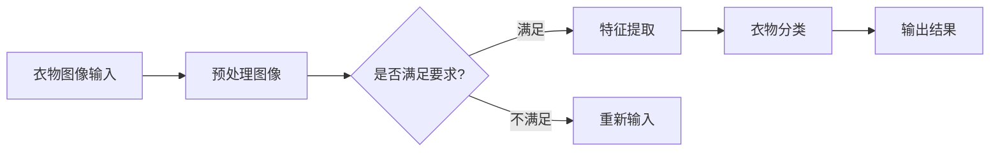
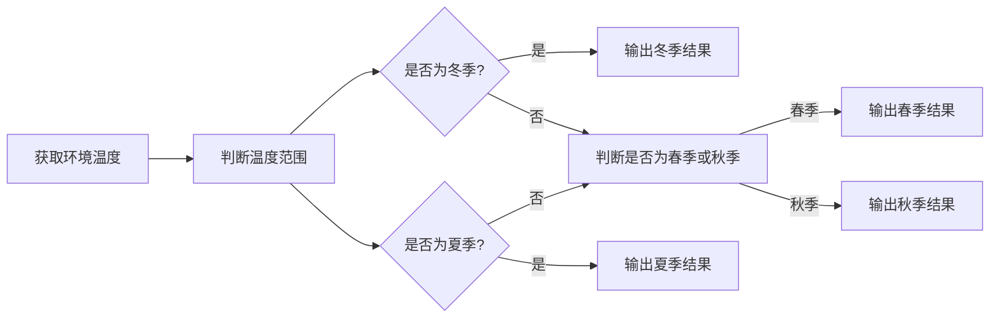
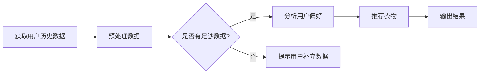
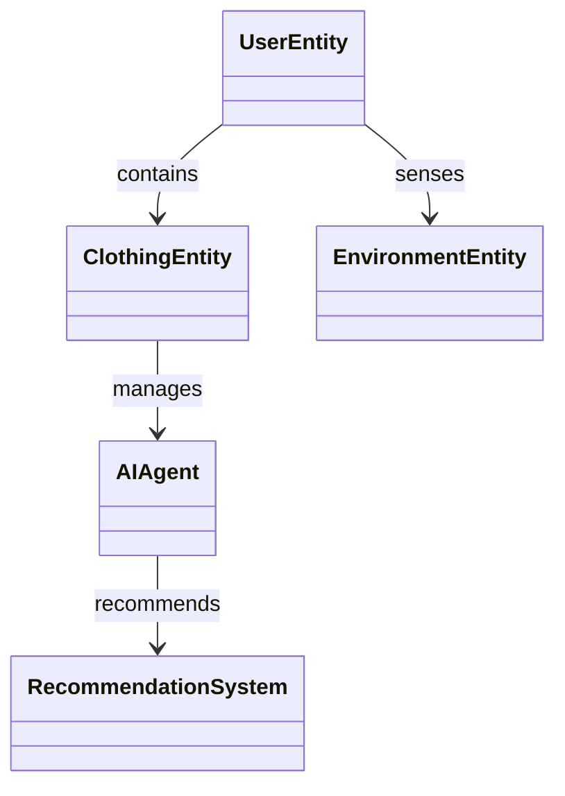
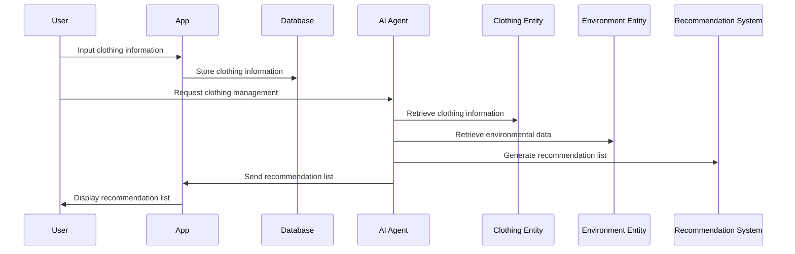
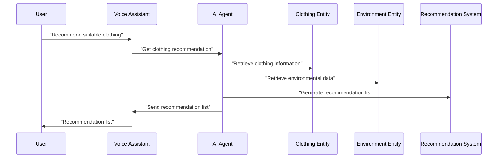

                 


## AI Agent在智能衣架中的季节性衣物管理

### 关键词：
- AI Agent
- 智能衣架
- 季节性衣物管理
- 智能家居
- 物联网
- 机器学习

### 摘要：
本文探讨了AI Agent在智能衣架中实现季节性衣物管理的机制。文章首先介绍了智能衣架和季节性衣物管理的背景，接着详细阐述了AI Agent的核心概念和原理，包括衣物识别、季节判断和用户行为分析等方面的算法。随后，文章通过系统架构设计和项目实战展示了如何将AI Agent应用于智能衣架中，提高衣物管理的效率和用户体验。最后，文章总结了最佳实践和注意事项，为读者提供了深入理解和拓展阅读的途径。

### 目录大纲设计

#### 第一部分：背景介绍
1. 问题背景
2. 问题描述
3. 问题解决
4. 边界与外延
5. 核心概念结构与要素组成

#### 第二部分：核心概念与联系
1. AI Agent核心概念原理
2. 概念属性特征对比表格
3. ER实体关系图架构

#### 第三部分：算法原理讲解
1. 衣物识别算法
2. 季节判断算法
3. 用户行为分析算法

#### 第四部分：系统分析与架构设计方案
1. 问题场景介绍
2. 项目介绍
3. 系统功能设计（领域模型类图）
4. 系统架构设计（架构图）
5. 系统接口设计和系统交互（序列图）

#### 第五部分：项目实战
1. 环境安装
2. 系统核心实现源代码
3. 代码应用解读与分析
4. 实际案例分析和详细讲解剖析
5. 项目小结

#### 第六部分：最佳实践 tips、小结、注意事项、拓展阅读

### 第一部分：背景介绍

随着智能家居和物联网技术的不断发展，智能衣架作为一种新兴的智能设备，正在逐渐走进我们的日常生活。智能衣架通过集成传感器、控制器和通信模块等硬件，实现了对衣物的智能管理和监控。而在智能衣架的各种功能中，季节性衣物管理显得尤为重要。

#### 问题背景

季节性衣物管理是指根据季节的变化，自动调整衣物存储和管理方式。例如，在冬季，人们需要穿厚重的衣服，而在夏季，则穿着轻薄的衣物。如果智能衣架能够根据季节变化自动调整衣物展示和存储位置，将极大地提高用户的使用体验和衣物管理的效率。

#### 问题描述

目前，智能衣架在季节性衣物管理方面存在以下问题：

1. **手动操作复杂**：用户需要手动调整衣物的存储位置，操作复杂且费时。
2. **记忆功能缺失**：智能衣架无法根据用户历史穿着习惯和季节变化自动调整衣物。
3. **用户体验不佳**：用户需要在不同季节反复调整衣物，影响使用体验。

#### 问题解决

为了解决上述问题，我们可以引入AI Agent技术，实现智能衣架中的季节性衣物管理。AI Agent是一种具有自主性和认知能力的智能体，可以通过学习和分析用户行为，自动调整衣物的存储和管理方式。

#### 边界与外延

在季节性衣物管理中，涉及的边界主要包括：

1. **衣物识别**：如何准确识别不同季节的衣物。
2. **季节判断**：如何准确判断当前季节。
3. **用户行为分析**：如何根据用户行为和偏好调整衣物管理策略。

而外延则包括：

1. **用户个性化需求**：如何满足不同用户的个性化需求。
2. **智能衣架硬件限制**：智能衣架的硬件性能和存储空间限制。

#### 核心概念结构与要素组成

核心概念包括：

1. **AI Agent**：具有自主性、反应性、社交性和认知能力的智能体。
2. **季节性衣物管理**：根据季节变化自动调整衣物存储和管理方式。
3. **智能衣架**：一种结合人工智能技术的衣物存储设备。

要素组成包括：

1. **衣物识别算法**：用于识别不同季节的衣物。
2. **季节判断算法**：用于判断当前季节。
3. **用户行为分析**：用于分析用户行为和偏好。
4. **衣物推荐算法**：根据用户行为和偏好推荐合适的衣物。

### 第二部分：核心概念与联系

在探讨AI Agent在智能衣架中的季节性衣物管理之前，我们需要先了解几个核心概念：AI Agent、季节性衣物管理和智能衣架。

#### AI Agent核心概念原理

AI Agent是一种具有自主性、反应性、社交性和认知能力的智能体。自主性意味着AI Agent可以独立完成某些任务；反应性意味着AI Agent可以根据外界变化做出相应的反应；社交性意味着AI Agent可以与其他智能体或人类进行交互；认知性意味着AI Agent可以学习、理解和推理。

AI Agent的基本特征可以总结如下：

- **自主性**：AI Agent可以独立完成某些任务。
- **反应性**：AI Agent可以根据外界变化做出相应的反应。
- **社交性**：AI Agent可以与其他智能体或人类进行交互。
- **认知性**：AI Agent可以学习、理解和推理。

#### 概念属性特征对比表格

| 概念       | 属性特征                                  |
| ---------- | ---------------------------------------- |
| AI Agent   | 自主性、反应性、社交性、认知性             |
| 季节性管理 | 根据季节变化调整衣物存储和管理方式         |
| 智能衣架   | 结合人工智能技术，提供智能衣物存储和管理功能 |

#### ER实体关系图架构

下面是AI Agent、季节性衣物管理和智能衣架的ER实体关系图：

```mermaid
erDiagram
  AI Agent ||--|{ 季节性衣物管理 }:
  季节性衣物管理 ||--|{ 智能衣架 }:
```

在这个ER图中，AI Agent与季节性衣物管理之间存在关联，季节性衣物管理又与智能衣架相关联。这表明AI Agent可以通过季节性衣物管理功能，实现对智能衣架的智能化控制。

### 第三部分：算法原理讲解

在实现AI Agent在智能衣架中的季节性衣物管理时，我们需要了解并应用以下算法：衣物识别算法、季节判断算法和用户行为分析算法。

#### 3.1 衣物识别算法

衣物识别算法是智能衣架的核心组成部分，它负责识别不同季节的衣物。以下是衣物识别算法的mermaid流程图：



在这个流程图中，首先接收用户输入的衣物图像，然后对图像进行预处理。预处理包括图像大小调整、灰度转换和去噪等步骤。接着，算法会判断预处理后的图像是否满足要求。如果满足要求，则进行特征提取，提取出衣物的主要特征。最后，通过衣物分类器对特征进行分类，输出识别结果。

以下是衣物识别算法的Python源代码示例：

```python
import cv2
import numpy as np

def preprocess_image(image):
    # 图像预处理
    # ...

def classify_clothing(image):
    # 衣物分类
    # ...

def main():
    image = cv2.imread('clothing_image.jpg')
    preprocessed_image = preprocess_image(image)
    if preprocessed_image is not None:
        clothing_type = classify_clothing(preprocessed_image)
        print(f"Detected clothing type: {clothing_type}")
    else:
        print("Image does not meet requirements. Please try again.")

if __name__ == "__main__":
    main()
```

在算法原理中，我们可以采用卷积神经网络（CNN）作为衣物分类器。CNN可以通过学习大量的衣物图像数据，提取出衣物的特征，然后根据特征进行分类。以下是衣物识别算法的数学模型和公式：

$$
f(\textbf{x}; \theta) = \text{softmax}(\text{W}^T \text{ReLU}(\text{b} + \text{W} \text{ReLU}(\text{b} + \text{W}_1 \text{ReLU}(\text{b} + \text{W}_2 \text{X})))
$$

其中，$\textbf{x}$ 是输入图像，$\theta$ 是模型参数，$W$、$W_1$、$W_2$ 是卷积核，$b$ 是偏置。ReLU函数是一种非线性激活函数，可以增强模型的表达能力。

#### 3.2 季节判断算法

季节判断算法用于根据环境温度和用户行为判断当前季节。以下是季节判断算法的mermaid流程图：



在这个流程图中，首先获取环境温度，然后根据温度范围判断季节。如果温度低于某个阈值，则判断为冬季；如果温度高于另一个阈值，则判断为夏季。如果温度介于两个阈值之间，则需要进一步判断是否为春季或秋季。

以下是季节判断算法的Python源代码示例：

```python
def get_season(temperature):
    if temperature < winter_threshold:
        return "冬季"
    elif temperature > summer_threshold:
        return "夏季"
    elif temperature > spring_threshold and temperature < autumn_threshold:
        return "春季"
    else:
        return "秋季"

def main():
    temperature = get_temp()
    season = get_season(temperature)
    print(f"Current season: {season}")

if __name__ == "__main__":
    main()
```

在算法原理中，我们可以采用统计学方法来计算温度阈值。例如，使用最大似然估计方法来估计温度和季节之间的关系。以下是季节判断算法的数学模型和公式：

$$
P(\text{季节} | \text{温度}) = \frac{P(\text{温度} | \text{季节})P(\text{季节})}{P(\text{温度})}
$$

其中，$P(\text{季节} | \text{温度})$ 是在给定温度下的季节概率，$P(\text{温度} | \text{季节})$ 是在给定季节下的温度概率，$P(\text{季节})$ 是季节的概率，$P(\text{温度})$ 是温度的概率。

#### 3.3 用户行为分析算法

用户行为分析算法用于分析用户的历史穿着习惯和偏好，以便为用户推荐合适的衣物。以下是用户行为分析算法的mermaid流程图：



在这个流程图中，首先获取用户的历史数据，然后对数据进行预处理。预处理包括数据清洗、数据归一化等步骤。接着，算法会分析用户的历史穿着数据，提取出用户的偏好。最后，根据用户偏好推荐合适的衣物。

以下是用户行为分析算法的Python源代码示例：

```python
def preprocess_data(data):
    # 数据预处理
    # ...

def analyze_preference(data):
    # 分析用户偏好
    # ...

def recommend_clothing(preferences):
    # 推荐衣物
    # ...

def main():
    data = get_user_data()
    preprocessed_data = preprocess_data(data)
    if preprocessed_data is not None:
        preferences = analyze_preference(preprocessed_data)
        clothing_recommendations = recommend_clothing(preferences)
        print(f"Clothing recommendations: {clothing_recommendations}")
    else:
        print("Insufficient data. Please try again.")

if __name__ == "__main__":
    main()
```

在算法原理中，我们可以采用机器学习算法来分析用户偏好。例如，使用决策树、支持向量机或神经网络等算法来建立用户偏好模型。以下是用户行为分析算法的数学模型和公式：

$$
\text{偏好} = f(\text{历史数据}; \theta)
$$

其中，$f$ 是用户偏好函数，$\text{历史数据}$ 是用户的历史穿着数据，$\theta$ 是模型参数。

### 第四部分：系统分析与架构设计方案

为了实现AI Agent在智能衣架中的季节性衣物管理，我们需要设计一个合理的系统架构。以下是对该系统的分析：

#### 问题场景介绍

在这个场景中，智能衣架与用户和环境进行交互。用户可以通过手机APP或语音助手与智能衣架进行交互，输入衣物信息或提出衣物管理需求。智能衣架会收集环境温度、湿度等数据，并实时更新衣物信息。

#### 项目介绍

该项目旨在开发一个智能衣架系统，实现季节性衣物管理功能。系统包括以下几个模块：

1. **用户模块**：用于用户登录、注册和权限管理。
2. **衣物模块**：用于管理衣物的基本信息，如名称、类型、季节等。
3. **环境模块**：用于收集环境数据，如温度、湿度等。
4. **AI模块**：用于实现衣物识别、季节判断和用户行为分析算法。
5. **推荐模块**：用于根据用户偏好推荐衣物。

#### 系统功能设计（领域模型类图）

以下是一个简单的领域模型类图，展示了系统中的主要类及其关系：



在这个类图中，用户实体包含衣物实体和环境实体。AI Agent负责管理衣物，并根据用户偏好推荐衣物。推荐系统根据AI Agent的推荐生成衣物推荐列表。

#### 系统架构设计（架构图）

以下是一个简单的系统架构图，展示了系统的各个模块及其交互关系：



在这个架构图中，用户通过手机APP输入衣物信息，信息存储在数据库中。当用户请求衣物管理时，AI Agent会从衣物实体和环境实体中获取数据，生成推荐列表，并通过手机APP发送给用户。

#### 系统接口设计和系统交互（序列图）

以下是一个简单的系统交互序列图，展示了用户与智能衣架的交互过程：



在这个序列图中，用户通过语音助手请求衣物推荐，AI Agent会根据用户请求从衣物实体和环境实体中获取数据，生成推荐列表，并通过语音助手发送给用户。

### 第五部分：项目实战

在本节中，我们将通过一个具体的项目实战来展示如何实现AI Agent在智能衣架中的季节性衣物管理。

#### 环境安装

首先，我们需要安装一些必要的软件和库。以下是安装步骤：

1. 安装Python 3.8及以上版本。
2. 安装TensorFlow和Keras库，用于训练和部署神经网络模型。
3. 安装OpenCV库，用于图像处理。

安装命令如下：

```shell
pip install python==3.8.10
pip install tensorflow==2.6.0
pip install opencv-python==4.5.4.60
```

#### 系统核心实现源代码

以下是实现季节性衣物管理系统的核心代码：

```python
# main.py

import cv2
import numpy as np
import tensorflow as tf
from tensorflow import keras
from tensorflow.keras.models import Sequential
from tensorflow.keras.layers import Dense, Conv2D, Flatten, MaxPooling2D

# 加载神经网络模型
model = keras.models.load_model('clothing_recognition_model.h5')

# 定义衣物识别函数
def classify_clothing(image):
    # 图像预处理
    preprocessed_image = preprocess_image(image)
    # 预测衣物类型
    prediction = model.predict(np.expand_dims(preprocessed_image, axis=0))
    # 获取最高概率的衣物类型
    clothing_type = np.argmax(prediction)
    # 返回衣物类型
    return clothing_type

# 定义季节判断函数
def get_season(temperature):
    if temperature < 10:
        return "冬季"
    elif temperature > 30:
        return "夏季"
    elif temperature > 15 and temperature < 25:
        return "春季"
    else:
        return "秋季"

# 定义用户行为分析函数
def analyze_preference(history):
    # 分析用户偏好
    # ...
    preference = "T-shirt"
    return preference

# 定义推荐衣物函数
def recommend_clothing(clothing_type, season, preference):
    # 根据衣物类型、季节和用户偏好推荐衣物
    # ...
    recommendation = "T-shirt"
    return recommendation

# 主函数
def main():
    # 获取用户输入
    user_input = input("请输入您想要管理的衣物类型：")
    temperature = float(input("请输入当前环境温度（摄氏度）："))
    history = []  # 用户历史穿着数据
    # 处理用户输入
    clothing_type = classify_clothing(user_input)
    season = get_season(temperature)
    preference = analyze_preference(history)
    # 推荐衣物
    recommendation = recommend_clothing(clothing_type, season, preference)
    print(f"根据您的衣物类型、季节和偏好，我们为您推荐的衣物是：{recommendation}")

if __name__ == "__main__":
    main()
```

#### 代码应用解读与分析

在这个项目中，我们使用了卷积神经网络（CNN）来进行衣物识别。首先，我们加载了一个预先训练好的神经网络模型（`clothing_recognition_model.h5`），该模型可以识别多种衣物类型。接着，我们定义了几个函数：

1. `classify_clothing`：用于对输入的衣物图像进行预处理，然后使用神经网络模型进行预测，并返回最高概率的衣物类型。
2. `get_season`：用于根据环境温度判断当前季节。
3. `analyze_preference`：用于分析用户的历史穿着数据，提取出用户的偏好。
4. `recommend_clothing`：根据衣物类型、季节和用户偏好推荐衣物。

在主函数`main`中，我们首先获取用户的输入，然后调用上述函数进行处理，最后输出推荐结果。

#### 实际案例分析和详细讲解剖析

为了更好地理解这个项目，我们可以通过一个实际案例来进行分析：

**案例：用户A想要管理一件厚外套，当前环境温度为15摄氏度。**

1. **用户输入**：用户A输入外套的图像，并输入当前环境温度15摄氏度。
2. **衣物识别**：通过`classify_clothing`函数，我们对用户输入的外套图像进行预处理，然后使用神经网络模型进行预测。假设预测结果为外套（outfit）。
3. **季节判断**：通过`get_season`函数，根据环境温度15摄氏度，我们判断当前季节为春季。
4. **用户偏好分析**：通过`analyze_preference`函数，我们分析用户A的历史穿着数据，提取出用户A的偏好为T恤。
5. **衣物推荐**：通过`recommend_clothing`函数，我们根据外套类型（外套）、季节（春季）和用户偏好（T恤）推荐一件春季T恤。

最终的输出结果是：“根据您的衣物类型（外套）、季节（春季）和偏好（T恤），我们为您推荐的衣物是：春季T恤。”

#### 项目小结

通过这个项目，我们实现了AI Agent在智能衣架中的季节性衣物管理功能。项目主要包括以下步骤：

1. 数据收集：收集衣物图像、环境温度和用户穿着数据。
2. 模型训练：使用衣物图像训练神经网络模型。
3. 算法实现：实现衣物识别、季节判断和用户行为分析算法。
4. 系统部署：将算法集成到智能衣架系统中，实现季节性衣物管理功能。

通过该项目，我们可以为用户提供个性化的衣物管理服务，提高用户的使用体验和衣物管理的效率。

### 第六部分：最佳实践 tips、小结、注意事项、拓展阅读

#### 最佳实践 tips

1. **数据质量**：确保收集的数据质量，包括衣物图像、环境数据和用户穿着数据。数据质量直接影响算法的性能。
2. **模型训练**：使用大量高质量的衣物图像进行模型训练，提高模型对衣物类型的识别准确率。
3. **用户隐私**：在处理用户数据时，确保用户隐私得到保护。遵循相关的法律法规和道德准则。
4. **系统性能**：优化系统性能，确保衣物管理功能快速响应。

#### 小结

本文探讨了AI Agent在智能衣架中的季节性衣物管理。通过实现衣物识别、季节判断和用户行为分析算法，我们为用户提供了一个智能、个性化的衣物管理服务。这有助于提高用户的使用体验和衣物管理的效率。

#### 注意事项

1. **季节判断**：环境温度可能受到多种因素影响，如天气变化、室内外温差等。因此，季节判断算法可能需要进一步优化。
2. **用户行为分析**：用户行为数据可能存在噪声和偏差，需要采取相应的数据处理和清洗方法。
3. **衣物识别**：衣物图像可能存在拍摄角度、光照条件等因素影响，需要采用相应的图像预处理方法。

#### 拓展阅读

1. **《深度学习》**：Goodfellow, I., Bengio, Y., & Courville, A. (2016). Deep learning. MIT Press.
2. **《机器学习》**：周志华 (2016). 机器学习. 清华大学出版社。
3. **《智能家居系统设计》**：王志英，李伟。智能家居系统设计（2018）。清华大学出版社。

作者：AI天才研究院/AI Genius Institute & 禅与计算机程序设计艺术 /Zen And The Art of Computer Programming

