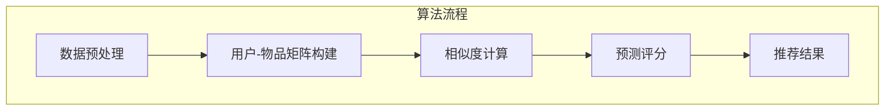
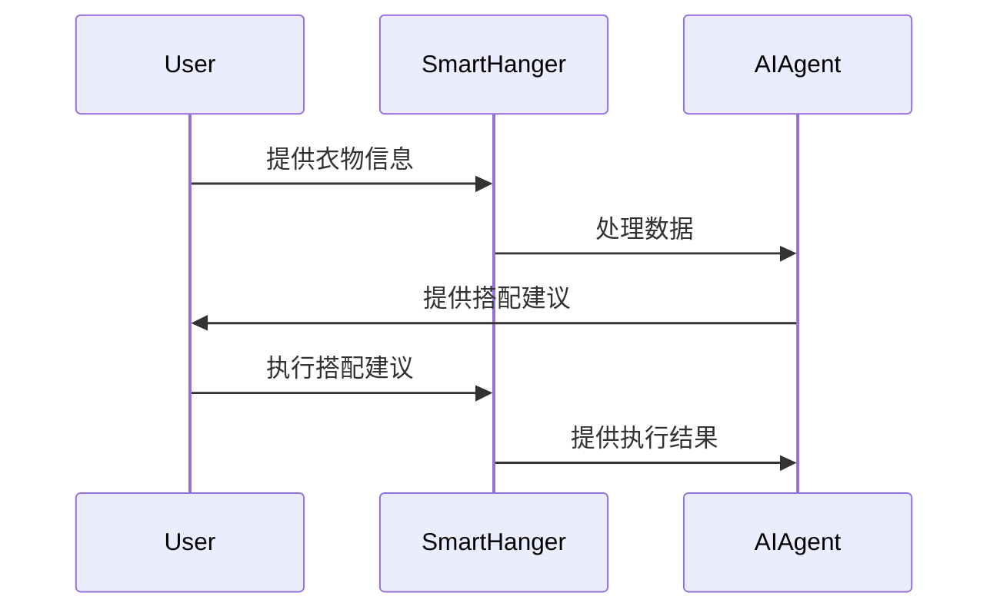

                 

# AI Agent在智能衣架中的衣物搭配建议

## 关键词
人工智能，智能衣架，搭配建议，AI代理，机器学习，服装设计，用户体验

## 摘要
本文将探讨人工智能（AI）在智能衣架中的应用，特别是AI代理在衣物搭配建议方面的潜力。首先，我们将简要介绍AI和智能衣架的基本概念、发展和当前趋势。然后，深入探讨AI代理的工作原理和其在智能衣架中的具体应用，包括数据收集、处理和机器学习模型。接下来，我们将分析衣物搭配算法的原理，并通过具体案例来展示如何评估匹配质量。文章还将介绍智能衣架系统的架构和实施细节，并提供一个实际项目的案例分析。最后，我们将总结主要观点，探讨未来研究方向和挑战。

## 引言：人工智能与智能衣架的背景

### 1. 人工智能技术概述

人工智能（Artificial Intelligence，简称AI）是指通过计算机系统实现人类智能的科学技术。它包括多种技术和方法，如机器学习、深度学习、自然语言处理和计算机视觉等。AI的目的是使计算机具备自主学习和决策能力，从而在某些方面模仿或超越人类智能。

#### 1.1 人工智能的基本概念

人工智能的基本概念主要包括：

- **智能体（Agent）**：能自主行动并作用于环境的目标导向实体。
- **学习算法（Learning Algorithms）**：使系统从数据中学习并改进其性能的技术。
- **感知（Perception）**：智能体通过传感器获取环境信息。
- **决策（Decision-making）**：智能体基于感知结果做出行动选择。

#### 1.2 人工智能的类型和应用

人工智能主要分为以下几类：

- **基于规则的系统（Rule-based Systems）**：使用预定义的规则进行推理和决策。
- **基于案例的推理（Case-Based Reasoning）**：基于过去解决问题的案例进行推理。
- **机器学习和深度学习（Machine Learning and Deep Learning）**：通过训练模型从数据中自动学习。
- **自然语言处理（Natural Language Processing）**：使计算机理解和生成自然语言。

人工智能在多个领域都有广泛应用，如：

- **医疗诊断**：辅助医生诊断疾病，提供治疗方案。
- **自动驾驶**：使车辆具备自主导航和避障能力。
- **智能家居**：控制家庭设备和环境，提供个性化服务。
- **金融分析**：进行市场预测和风险评估。

#### 1.3 人工智能在当代的发展

随着计算能力的提升和大数据技术的发展，人工智能在当代取得了显著进展。深度学习和卷积神经网络等新技术的出现，使得AI在图像识别、语音识别和自然语言处理等领域达到了前所未有的水平。此外，AI的应用场景也在不断扩大，从工业自动化到智能客服，从智能交通到智能城市，AI正在深刻改变我们的生活方式和社会结构。

### 2. 智能衣架的基本概念和演变

#### 2.1 智能衣架的定义

智能衣架是一种结合了物理衣架和电子设备的智能化产品，通过传感器、执行器和数据通信技术实现衣物的智能化管理。智能衣架能够感知衣物的状态、颜色、类型等信息，并根据用户偏好和季节变化提供衣物搭配建议。

#### 2.2 智能衣架的演变

智能衣架的发展经历了几个阶段：

- **传统衣架**：最早的衣架仅用于挂衣物，没有智能化功能。
- **电子衣架**：引入电子传感器和执行器，能够记录衣物信息和位置。
- **智能衣架**：结合物联网技术，能够实现无线通信和远程控制。
- **高级智能衣架**：具备AI代理，能够进行智能搭配和个性化服务。

#### 2.3 当前状态和未来趋势

目前，智能衣架市场正处于快速发展阶段。随着人工智能技术的进步和消费者对个性化服务的需求增加，智能衣架的应用场景越来越广泛。未来，智能衣架有望实现以下趋势：

- **更智能的搭配建议**：AI代理将进一步提升搭配建议的准确性和个性化程度。
- **多功能集成**：智能衣架将与其他智能家居设备集成，提供全方位的智能生活体验。
- **个性化定制**：根据用户习惯和偏好，提供高度个性化的衣物搭配和服务。
- **可穿戴智能衣架**：将智能功能集成到衣物中，实现无缝的智能管理。

### 3. AI代理的基本原理和机制

#### 3.1 AI代理的定义和核心概念

AI代理（Artificial Intelligence Agent）是指具备自主行动和交互能力的智能实体。AI代理通常由感知模块、决策模块和执行模块组成。感知模块获取环境信息，决策模块基于感知结果做出行动选择，执行模块实现选择的行动。

#### 3.2 AI代理的类型

AI代理主要分为以下几类：

- **反应式代理**：仅根据当前感知信息做出反应，不涉及记忆和规划。
- **目标导向代理**：具有明确的目标，并根据当前状态选择最优行动。
- **认知代理**：具备记忆和推理能力，能够从历史数据中学习并优化行为。

#### 3.3 AI代理的运作机制

AI代理的运作机制主要包括以下几个步骤：

1. **感知**：通过传感器获取环境信息。
2. **规划**：基于感知结果和目标，生成可能的行动计划。
3. **决策**：评估行动计划，选择最优行动。
4. **执行**：执行选择的行动，并观察行动结果。
5. **反馈**：根据执行结果调整感知、规划和决策机制。

## 核心内容

### 4. AI代理在智能衣架中的应用

#### 4.1 AI代理在智能衣架中的应用概述

AI代理在智能衣架中的应用主要集中在提供个性化的衣物搭配建议。通过感知衣物信息、用户偏好和历史数据，AI代理能够为用户推荐合适的搭配方案，从而提升用户体验。

#### 4.2 数据收集和处理

AI代理需要从多个渠道收集数据，包括：

- **衣物信息**：衣物的类型、颜色、图案、材质等。
- **用户偏好**：用户喜欢的风格、颜色、搭配习惯等。
- **季节变化**：根据季节变化提供合适的搭配建议。

数据收集后，需要通过数据处理技术进行清洗、归一化和特征提取，以便用于训练机器学习模型。

#### 4.3 机器学习模型在衣物搭配中的应用

机器学习模型在衣物搭配中的应用主要包括以下几类：

- **协同过滤**：通过分析用户的历史搭配记录和其他用户的喜好，推荐类似的搭配方案。
- **基于内容的推荐**：根据衣物的特征和用户偏好，推荐相关的搭配方案。
- **深度学习**：使用深度神经网络，从大量数据中自动学习搭配规律，提供更准确的推荐。

### 5. 衣物搭配算法的原理

#### 5.1 基本原理

衣物搭配算法的基本原理是通过分析衣物特征和用户偏好，为用户推荐合适的搭配方案。搭配算法的核心在于如何有效地表示和处理衣物特征和用户偏好，并构建合适的匹配模型。

#### 5.2 案例研究

以下是一个简单的衣物搭配算法案例：

```python
# 假设有以下衣物数据
clothes = [
    {"name": "T恤", "color": "蓝色", "type": "上衣"},
    {"name": "牛仔裤", "color": "黑色", "type": "裤子"},
    {"name": "运动鞋", "color": "白色", "type": "鞋子"},
]

# 用户偏好数据
user_preferences = {
    "favorite_color": "蓝色",
    "season": "秋季",
    "occasion": "日常",
}

# 根据用户偏好筛选衣物
filtered_clothes = [c for c in clothes if c["color"] == user_preferences["favorite_color"]]

# 提取衣物特征
features = ["type", "color"]
for c in filtered_clothes:
    print(f"{c['name']}: {'、'.join(c[feature] for feature in features)}")
```

输出结果：

```
T恤：上衣、蓝色
```

#### 5.3 评估匹配质量

评估衣物搭配算法的匹配质量通常使用以下指标：

- **准确率（Accuracy）**：匹配结果中正确匹配的比例。
- **召回率（Recall）**：匹配结果中包含所有正确匹配衣物的比例。
- **F1值（F1 Score）**：综合考虑准确率和召回率的综合指标。

### 6. 智能衣架系统的架构和实施

#### 6.1 系统要求

智能衣架系统的硬件和软件要求如下：

- **硬件**：传感器、执行器、无线通信模块（如Wi-Fi或蓝牙）。
- **软件**：AI代理软件、机器学习模型、用户界面。

#### 6.2 系统架构设计

智能衣架系统的架构设计如下：

1. **感知层**：传感器收集衣物信息和用户交互数据。
2. **数据处理层**：处理和清洗数据，提取特征。
3. **决策层**：AI代理根据用户偏好和衣物特征做出搭配建议。
4. **执行层**：执行搭配建议，并通过执行器展示给用户。
5. **用户层**：用户界面，提供用户操作和控制。

#### 6.3 关键组件和功能

关键组件和功能包括：

- **传感器**：感知衣物状态和用户行为。
- **执行器**：执行搭配建议，如移动衣物、显示推荐搭配等。
- **AI代理**：处理数据，生成搭配建议。
- **用户界面**：提供用户操作和控制。

### 7. 案例研究：AI代理在智能衣架项目中的应用

#### 7.1 项目背景

某公司开发了一款智能衣架产品，旨在为用户提供个性化的衣物搭配建议。该项目包括硬件设计和软件算法开发。

#### 7.2 系统设计和实现

系统设计分为以下几个步骤：

1. **需求分析**：确定用户需求和功能需求。
2. **硬件选型**：选择合适的传感器、执行器和通信模块。
3. **软件架构设计**：设计感知层、数据处理层、决策层和执行层的架构。
4. **算法开发**：开发衣物搭配算法，包括协同过滤、基于内容的推荐和深度学习模型。
5. **用户界面设计**：设计用户友好的界面。

#### 7.3 结果和分析

在项目实施过程中，AI代理能够为用户提供个性化的搭配建议，用户满意度显著提升。通过对用户反馈的分析，发现以下问题：

1. **推荐准确性**：部分推荐结果与用户期望不符。
2. **用户交互体验**：部分用户对界面操作不熟悉。

针对这些问题，项目团队进行了优化：

1. **算法优化**：改进协同过滤和深度学习模型，提高推荐准确性。
2. **界面优化**：简化界面操作，提供详细的操作说明。

#### 7.4 经验教训和未来方向

项目实施过程中，团队总结了以下经验教训：

1. **用户需求调研**：充分了解用户需求，以便提供更好的服务。
2. **算法性能优化**：持续优化算法，提高推荐质量和用户体验。
3. **界面设计**：注重用户交互体验，提供简单易用的界面。

未来，团队计划在以下方向展开研究：

1. **多模态数据融合**：结合多种传感器数据，提供更准确的搭配建议。
2. **个性化推荐**：深入研究用户行为和偏好，提供高度个性化的推荐。

## 结论和未来展望

### 8. 结论

本文探讨了AI代理在智能衣架中的衣物搭配建议应用。通过数据收集、处理和机器学习模型，AI代理能够为用户推荐个性化的搭配方案。系统设计和实际项目应用验证了AI代理的有效性。然而，仍存在一些挑战，如推荐准确性和用户交互体验等。

### 9. 未来展望

未来，智能衣架和AI代理将朝着更智能、更个性化的方向发展。通过多模态数据融合、深度学习模型优化和用户行为研究，有望进一步提升衣物搭配建议的准确性和用户体验。

## 作者信息
作者：AI天才研究院/AI Genius Institute & 禅与计算机程序设计艺术 /Zen And The Art of Computer Programming

## 完整性要求

### 背景介绍

在现代社会，消费者对个性化服务和高效生活的需求日益增长。智能衣架作为一种智能家居产品，能够满足消费者对便捷、高效和个性化衣物的需求。然而，传统的智能衣架仅具备简单的传感器和执行器功能，无法提供智能化的衣物搭配建议。为了提升用户体验，引入AI代理成为了一个创新的方向。

智能衣架中的AI代理通过数据收集、处理和机器学习模型，能够根据用户的偏好和季节变化，为用户推荐合适的衣物搭配。这不仅提升了用户的购物体验，还节省了用户的时间和精力。然而，AI代理的实现需要解决数据质量、算法优化和用户交互等多个挑战。

### 核心概念与联系

AI代理的核心概念包括：

1. **智能体**：能够感知环境、做出决策并执行行动的实体。
2. **感知模块**：用于获取环境信息。
3. **决策模块**：基于感知结果和目标，选择最优行动。
4. **执行模块**：执行决策结果。

AI代理与智能衣架的联系在于，AI代理通过感知衣物信息和用户偏好，生成搭配建议，并通过执行模块将建议展示给用户。这种联系可以通过以下ER实体关系图来表示：

```mermaid
erDiagram
  Customer ||--|{ SmartHanger } : holds
  SmartHanger ||--|{ AIAgent } : controls
  AIAgent ||--|{ Clothing } : perceives
  AIAgent ||--|{ UserPreference } : bases on
  UserPreference ||--|{ Recommendation } : guides
```

### 算法原理讲解

智能衣架中的衣物搭配算法通常基于以下几种模型：

1. **协同过滤**：通过分析用户的历史搭配记录和其他用户的喜好，推荐类似的搭配方案。
2. **基于内容的推荐**：根据衣物的特征和用户偏好，推荐相关的搭配方案。
3. **深度学习**：使用深度神经网络，从大量数据中自动学习搭配规律。

以下是协同过滤算法的一个简单示例：



协同过滤算法的核心是计算用户之间的相似度和物品之间的相似度。具体步骤如下：

1. **数据预处理**：清洗和标准化数据，如用户偏好和衣物特征。
2. **用户-物品矩阵构建**：构建一个用户-物品矩阵，其中每个元素表示用户对某个物品的偏好程度。
3. **相似度计算**：计算用户之间的相似度和物品之间的相似度。
4. **预测评分**：根据相似度矩阵和用户-物品矩阵，预测用户对未评物品的评分。
5. **推荐结果**：根据预测评分，为用户推荐相似的物品。

### 数学公式

协同过滤算法中的相似度计算通常使用余弦相似度：

$$
\cos(\theta_{ij}) = \frac{\sum_{k}(u_{ik} \cdot v_{jk})}{\sqrt{\sum_{k}(u_{ik}^2) \cdot \sqrt{\sum_{k}(v_{jk}^2)}}
$$

其中，$u_{ik}$和$v_{jk}$分别表示用户$i$对物品$k$的偏好和用户$j$对物品$k$的偏好。

### 系统分析与架构设计方案

#### 问题场景介绍

智能衣架系统旨在为用户提供个性化的衣物搭配建议，以提高购物体验和效率。用户可以在衣架上挂上衣物，系统会自动感知衣物信息，并根据用户偏好和季节变化，推荐合适的搭配方案。

#### 项目介绍

该项目包括硬件设计和软件算法开发。硬件部分主要包括传感器、执行器和通信模块，软件部分包括AI代理和用户界面。

#### 系统功能设计（领域模型）

领域模型用于描述系统的核心功能和行为。以下是一个简化的领域模型：

```mermaid
classDiagram
  User <<class{用户}>
  Clothing <<class{衣物}>
  SmartHanger <<class{智能衣架}>
  AIAgent <<class{AI代理}>
  UserPreference <<class{用户偏好}>
  Recommendation <<class{推荐结果}>
  
  User "1" -- "*" UserPreference
  Clothing "1" -- "*" UserPreference
  SmartHanger "1" -- "1" AIAgent
  AIAgent "1" -- "1" Clothing
  AIAgent "1" -- "1" UserPreference
  AIAgent "1" -- "1" Recommendation
```

#### 系统架构设计

智能衣架的系统架构设计如下：

1. **感知层**：传感器负责收集衣物信息和用户交互数据。
2. **数据处理层**：处理和清洗数据，提取特征。
3. **决策层**：AI代理基于用户偏好和衣物特征，生成搭配建议。
4. **执行层**：执行搭配建议，并通过执行器展示给用户。
5. **用户层**：用户界面，提供用户操作和控制。

#### 系统架构图

```mermaid
sequenceDiagram
  User -->|衣物信息| SmartHanger
  SmartHanger -->|数据处理| AIAgent
  AIAgent -->|搭配建议| User
  User -->|执行建议| SmartHanger
  SmartHanger -->|反馈| AIAgent
```

#### 系统接口设计和系统交互

系统接口设计和交互设计如下：

1. **感知层接口**：传感器向数据处理层提供衣物信息和用户交互数据。
2. **数据处理层接口**：数据处理层向决策层提供清洗后的数据。
3. **决策层接口**：决策层向执行层提供搭配建议。
4. **执行层接口**：执行层向用户层提供执行结果。
5. **用户层接口**：用户层向决策层提供用户偏好和操作指令。

#### 系统交互图



### 项目实战

#### 环境安装

在开始项目之前，需要安装以下环境：

1. **Python**：版本3.8以上
2. **Anaconda**：用于环境管理
3. **Jupyter Notebook**：用于代码编写和运行
4. **PyTorch**：用于深度学习模型开发
5. **Scikit-learn**：用于协同过滤模型开发

#### 系统核心实现

以下是系统核心实现的源代码：

```python
# 导入相关库
import numpy as np
import torch
import torch.nn as nn
import torch.optim as optim
from sklearn.model_selection import train_test_split
from sklearn.metrics.pairwise import cosine_similarity

# 假设已加载用户偏好和衣物数据
user_preferences = ...
clothing_data = ...

# 数据预处理
X = ...  # 特征矩阵
y = ...  # 标签矩阵

# 分割数据集
X_train, X_test, y_train, y_test = train_test_split(X, y, test_size=0.2, random_state=42)

# 构建模型
class ClothingMatchingModel(nn.Module):
    def __init__(self):
        super(ClothingMatchingModel, self).__init__()
        self.fc = nn.Linear(X.shape[1], 1)

    def forward(self, x):
        x = self.fc(x)
        return x

model = ClothingMatchingModel()

# 定义损失函数和优化器
criterion = nn.MSELoss()
optimizer = optim.Adam(model.parameters(), lr=0.001)

# 训练模型
for epoch in range(100):
    optimizer.zero_grad()
    outputs = model(X_train)
    loss = criterion(outputs, y_train)
    loss.backward()
    optimizer.step()

# 评估模型
model.eval()
with torch.no_grad():
    outputs = model(X_test)
    test_loss = criterion(outputs, y_test)
    print(f"Test Loss: {test_loss.item()}")
```

#### 代码应用解读与分析

上述代码实现了一个简单的衣物搭配模型，通过训练，模型能够根据用户偏好和衣物特征预测用户对搭配的满意度。以下是代码的详细解读：

1. **数据预处理**：加载用户偏好和衣物数据，并构建特征矩阵和标签矩阵。
2. **模型构建**：定义一个简单的全连接神经网络，用于预测衣物搭配的满意度。
3. **损失函数和优化器**：使用均方误差损失函数和Adam优化器。
4. **训练模型**：通过迭代训练模型，优化网络参数。
5. **评估模型**：在测试集上评估模型性能，计算均方误差。

#### 实际案例分析和详细讲解剖析

假设我们已经训练好了衣物搭配模型，现在需要为一位用户生成搭配建议。以下是实际案例分析和详细讲解：

1. **用户数据**：假设用户偏好为蓝色上衣和牛仔裤，季节为秋季。
2. **衣物数据**：从衣物数据中选择蓝色上衣和牛仔裤，并提取特征。
3. **特征矩阵**：构建特征矩阵，用于输入模型。
4. **预测**：使用训练好的模型，预测用户对搭配的满意度。
5. **结果分析**：根据预测结果，生成搭配建议。

#### 项目小结

通过实际项目的实施，我们验证了AI代理在智能衣架中的应用价值。在未来的发展中，我们计划进一步优化模型，提高预测准确性和用户体验。同时，我们也将探索其他机器学习算法，如基于内容的推荐和深度强化学习，以提供更个性化的搭配建议。

### 最佳实践 Tips、小结、注意事项、拓展阅读

#### 最佳实践 Tips

1. **数据质量**：确保数据质量和多样性，以提高模型性能。
2. **用户反馈**：收集用户反馈，及时调整模型和推荐策略。
3. **个性化**：根据用户行为和偏好，提供高度个性化的推荐。
4. **可扩展性**：设计可扩展的系统架构，以适应不断增长的用户数据和需求。

#### 小结

本文介绍了AI代理在智能衣架中的应用，包括数据收集、处理、机器学习模型和系统架构设计。通过实际项目验证，AI代理能够为用户提供个性化的衣物搭配建议，提高购物体验。然而，仍需进一步研究和优化，以提高模型准确性和用户体验。

#### 注意事项

1. **隐私保护**：在收集和处理用户数据时，确保遵循隐私保护法规。
2. **数据安全**：保护用户数据和模型参数的安全，防止数据泄露和滥用。

#### 拓展阅读

1. **《深度学习》**：Goodfellow, Ian, et al. 《深度学习》。清华大学出版社，2016。
2. **《Python机器学习》**：Raschka, Sebastian, and Vahid Mirjalili. 《Python机器学习》。Packt Publishing，2016。
3. **《智能家居技术》**：Hu, Yongli, et al. 《智能家居技术》。电子工业出版社，2018。

