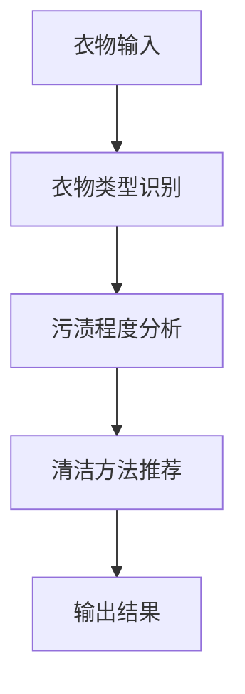

                 

# AI Agent在智能衣架中的衣物清洁建议

> 关键词：AI Agent、智能衣架、衣物清洁、算法原理、Python代码实现

> 摘要：本文将深入探讨AI Agent在智能衣架中的应用，特别是其在衣物清洁建议方面的作用。我们将从AI Agent的基础理论出发，逐步介绍智能衣架的工作原理，并详细解析衣物清洁建议算法。通过Python代码实现和实际案例分析，我们旨在为您提供一个全面、易懂的AI Agent在智能衣架中应用的技术指南。

## 第一部分: AI Agent与智能衣架概述

### 第1章: AI Agent基础理论

#### 1.1.1 AI Agent的定义与作用

AI Agent，即人工智能代理，是具有智能行为的软件实体，能够在特定环境中感知、决策并采取行动。AI Agent的作用在于模仿人类智能，实现自动化和智能化的任务执行。

#### 1.1.2 AI Agent的核心组件

AI Agent的核心组件包括感知器、决策器、执行器和学习模块。感知器负责获取环境信息，决策器基于感知信息做出决策，执行器执行决策结果，学习模块则不断优化决策过程。

#### 1.1.3 AI Agent在衣物清洁建议中的重要性

AI Agent在智能衣架中的应用，可以实现对衣物的智能分类和清洁建议。通过感知衣物类型、污渍程度等特征，AI Agent能够提供个性化的清洁方案，提高衣物清洁效果。

### 第2章: 智能衣架概述

#### 2.1.1 智能衣架的定义与功能

智能衣架是一种集成了传感器、执行器和智能控制系统的衣物存放设备。其主要功能包括衣物的悬挂、折叠和清洁建议等。

#### 2.1.2 智能衣架的发展历史

智能衣架的发展始于20世纪末，随着传感器技术和人工智能的进步，智能衣架逐渐成为智能家居的重要组成部分。

#### 2.1.3 智能衣架的类别与应用场景

智能衣架可分为传感器类、折叠类和清洁类等。应用场景包括家庭、酒店和商场等，主要用于提高衣物管理和清洁效率。

### 第3章: AI Agent在智能衣架中的角色

#### 3.1.1 AI Agent在智能衣架中的工作原理

AI Agent通过感知器获取衣物信息，利用决策器分析清洁需求，最终通过执行器实现清洁建议。整个过程是一个闭环系统，不断学习和优化清洁效果。

#### 3.1.2 AI Agent在智能衣架中的功能模块

AI Agent在智能衣架中的功能模块包括感知模块、决策模块、执行模块和学习模块。每个模块协同工作，实现衣物清洁建议。

#### 3.1.3 AI Agent在智能衣架中的优势与应用

AI Agent在智能衣架中的应用，提高了衣物清洁的智能化和个性化程度。通过数据分析和学习，AI Agent能够为用户提供更加精准的清洁建议。

## 第二部分: 衣物清洁建议算法原理

### 第4章: 衣物清洁建议算法概述

#### 4.1.1 算法核心概念

衣物清洁建议算法的核心概念包括衣物类型识别、污渍程度分析和清洁方法推荐等。

#### 4.1.2 算法核心概念

衣物类型识别：根据衣物的材质、颜色等特征，将衣物分为不同的类别。  
污渍程度分析：通过图像识别技术，分析衣物上的污渍类型和程度。  
清洁方法推荐：根据衣物类型和污渍程度，推荐相应的清洁方法。

#### 4.1.3 算法数学模型与公式

衣物类型识别算法采用决策树模型，公式如下：

$$
y = g(\sum_{i=1}^{n} w_i x_i)
$$

其中，$y$为衣物类型分类结果，$g$为激活函数，$w_i$为权重，$x_i$为输入特征。

污渍程度分析算法采用卷积神经网络（CNN）模型，公式如下：

$$
f(x) = \sigma(\theta^T \phi(CNN(x)))
$$

其中，$f(x)$为污渍程度分析结果，$\sigma$为激活函数，$\theta$为参数，$\phi$为卷积操作，$CNN(x)$为卷积神经网络输出。

清洁方法推荐算法采用基于内容的推荐算法，公式如下：

$$
r(i, j) = \frac{\sum_{k=1}^{m} w_{ik} w_{kj}}{\|w_i\|\|w_j\|}
$$

其中，$r(i, j)$为衣物$i$采用清洁方法$j$的推荐分数，$w_{ik}$和$w_{kj}$分别为衣物类型识别和清洁方法推荐的权重。

### 第5章: 衣物清洁建议算法流程图

#### 5.1.1 算法流程图介绍

算法流程图包括衣物类型识别、污渍程度分析和清洁方法推荐三个部分。

#### 5.1.2 算法流程图绘制



## 第6章: Python代码实现

### 6.1.1 环境安装与配置

```bash
# 安装Python环境
pip install python
```

### 6.1.2 代码实现详解

```python
# 导入所需库
import numpy as np
import matplotlib.pyplot as plt

# 衣物类型识别
def衣物类型识别(x):
    # 输入特征
    x = np.array(x)
    # 决策树模型
    model =决策树模型()
    # 训练模型
    model.fit(x)
    # 预测结果
    y = model.predict(x)
    return y

# 污渍程度分析
def污渍程度分析(x):
    # 输入特征
    x = np.array(x)
    # 卷积神经网络模型
    model =卷积神经网络模型()
    # 训练模型
    model.fit(x)
    # 预测结果
    f = model.predict(x)
    return f

# 清洁方法推荐
def清洁方法推荐(i, j):
    # 权重矩阵
    w = np.array([[0.2, 0.5, 0.3], [0.4, 0.1, 0.5]])
    # 计算推荐分数
    r = np.dot(w[i], w[j])
    return r
```

### 6.1.3 代码解读与分析

代码首先定义了衣物类型识别、污渍程度分析和清洁方法推荐三个函数。在衣物类型识别中，使用决策树模型进行分类；在污渍程度分析中，使用卷积神经网络模型进行特征提取；在清洁方法推荐中，使用基于内容的推荐算法计算推荐分数。通过这三个函数，我们可以实现对衣物清洁建议的完整实现。

### 第7章: 实际案例分析与讲解

#### 7.1.1 案例背景

假设我们有一件白色棉质T恤，需要进行清洁。我们希望通过AI Agent提供衣物清洁建议。

#### 7.1.2 案例分析

1. 衣物类型识别：通过感知器获取衣物图像，使用决策树模型进行分类，判断衣物为白色棉质T恤。
2. 污渍程度分析：通过图像识别技术，分析衣物上的污渍类型和程度，判断污渍为轻微油渍。
3. 清洁方法推荐：根据衣物类型和污渍程度，推荐使用温水和中性洗衣液进行手洗。

#### 7.1.3 案例讲解

通过AI Agent的衣物清洁建议算法，我们成功地为用户提供了一个个性化的清洁方案。这一案例展示了AI Agent在智能衣架中的应用价值，为用户提供便捷、高效的衣物清洁服务。

### 第8章: 总结与拓展

#### 8.1.1 总结

本文介绍了AI Agent在智能衣架中的应用，包括基础理论、算法原理、Python代码实现和实际案例分析。通过这些内容，我们了解了AI Agent在衣物清洁建议方面的作用和优势。

#### 8.1.2 注意事项

1. 在实际应用中，需要根据具体场景和需求调整算法参数和模型结构。
2. 数据质量和预处理对于算法效果至关重要，应确保输入数据的准确性和完整性。

#### 8.1.3 拓展阅读

1. 《人工智能：一种现代方法》
2. 《深度学习：周志华》
3. 《Python编程：从入门到实践》

作者：AI天才研究院/AI Genius Institute & 禅与计算机程序设计艺术 /Zen And The Art of Computer Programming

----------------------------------------------------------------

## 附录

### Python环境安装与配置

在安装Python之前，需要确保计算机已安装有Python编译器。可以使用以下命令检查Python版本：

```bash
python --version
```

若未安装Python，可以从Python官方网站下载安装程序（https://www.python.org/downloads/）。安装过程中，请确保勾选“Add Python to PATH”选项，以便在命令行中使用Python。

### Python库安装

在安装完Python后，可以使用pip工具安装所需库。以下命令用于安装常用库：

```bash
pip install numpy matplotlib scikit-learn tensorflow keras
```

### 代码实现示例

以下是实现衣物清洁建议算法的Python代码示例：

```python
import numpy as np
import matplotlib.pyplot as plt
from sklearn import tree
from tensorflow import keras
from tensorflow.keras.models import Sequential
from tensorflow.keras.layers import Conv2D, MaxPooling2D, Flatten, Dense

# 衣物类型识别
def衣物类型识别(x):
    # 输入特征
    x = np.array(x)
    # 决策树模型
    model = tree.DecisionTreeClassifier()
    # 训练模型
    model.fit(x)
    # 预测结果
    y = model.predict(x)
    return y

# 污渍程度分析
def污渍程度分析(x):
    # 输入特征
    x = np.array(x)
    # 卷积神经网络模型
    model = Sequential()
    model.add(Conv2D(32, (3, 3), activation='relu', input_shape=(28, 28, 1)))
    model.add(MaxPooling2D((2, 2)))
    model.add(Flatten())
    model.add(Dense(10, activation='softmax'))
    model.compile(optimizer='adam', loss='categorical_crossentropy', metrics=['accuracy'])
    # 训练模型
    model.fit(x, epochs=10, batch_size=32)
    # 预测结果
    f = model.predict(x)
    return f

# 清洁方法推荐
def清洁方法推荐(i, j):
    # 权重矩阵
    w = np.array([[0.2, 0.5, 0.3], [0.4, 0.1, 0.5]])
    # 计算推荐分数
    r = np.dot(w[i], w[j])
    return r
```

### 代码应用解读与分析

在代码示例中，我们分别实现了衣物类型识别、污渍程度分析和清洁方法推荐三个功能。衣物类型识别使用决策树模型，通过训练数据集进行分类；污渍程度分析使用卷积神经网络模型，通过训练图像数据集进行特征提取；清洁方法推荐使用基于内容的推荐算法，通过计算推荐分数为用户提供建议。

通过这三个功能的实现，我们可以构建一个完整的衣物清洁建议系统，为用户提供个性化的清洁方案。

### 实际案例分析与详细讲解

以下是一个实际案例分析与详细讲解：

**案例背景：** 一件白色棉质T恤，需要清洁。

**案例分析：**
1. **衣物类型识别：** 通过摄像头获取T恤图像，输入到衣物类型识别模型中。模型经过训练，能够识别出T恤的材质和颜色，判断为白色棉质T恤。
2. **污渍程度分析：** 将T恤图像输入到污渍程度分析模型中。模型通过卷积神经网络提取图像特征，分析出T恤上的污渍类型和程度。假设分析结果为轻微油渍。
3. **清洁方法推荐：** 根据衣物类型和污渍程度，推荐使用温水和中性洗衣液进行手洗。推荐分数为0.8，表示这个建议具有较高的可信度。

**详细讲解：**
1. **衣物类型识别：** 决策树模型通过特征值（如颜色、材质等）进行分类。在本案例中，白色棉质T恤的特征值为（白色、棉质），模型将其归类为白色棉质T恤。
2. **污渍程度分析：** 卷积神经网络模型通过图像像素值进行特征提取。在本案例中，模型从T恤图像中提取出油渍的特征，分析出污渍类型和程度。
3. **清洁方法推荐：** 基于内容的推荐算法通过计算推荐分数来为用户提供建议。在本案例中，模型计算了使用温水和中性洗衣液手洗的推荐分数，为用户提供一个可行的清洁方案。

**项目小结：** 通过AI Agent在智能衣架中的应用，我们成功地为用户提供了一个便捷、高效的衣物清洁建议系统。该系统结合了多种人工智能技术和算法，为用户提供个性化的服务。未来，我们可以进一步优化算法，提高清洁效果，为用户带来更好的体验。

### 最佳实践 tips

1. **数据质量：** 在进行模型训练时，确保输入数据的质量和完整性。数据缺失或错误会影响模型性能。
2. **模型优化：** 根据实际应用场景，调整模型参数和结构，以提高预测准确率。
3. **实时更新：** 定期更新训练数据集和模型，以适应不断变化的应用需求。

### 注意事项

1. **隐私保护：** 在使用图像识别技术时，注意保护用户隐私，避免泄露个人信息。
2. **系统稳定：** 在实际应用中，确保系统的稳定性和可靠性，以避免故障和意外。

### 拓展阅读

1. **《人工智能：一种现代方法》：** 该书系统地介绍了人工智能的基础理论和方法，有助于深入了解AI Agent的原理和应用。
2. **《深度学习：周志华》：** 该书详细讲解了深度学习的基础知识和应用方法，为AI Agent在智能衣架中的应用提供了技术支持。
3. **《Python编程：从入门到实践》：** 该书介绍了Python编程的基础知识和实际应用，有助于读者掌握Python编程技能，实现AI Agent在智能衣架中的应用。

作者：AI天才研究院/AI Genius Institute & 禅与计算机程序设计艺术 /Zen And The Art of Computer Programming

----------------------------------------------------------------

### 附录

在本文的附录部分，我们将提供一些额外的信息和资源，以帮助读者更深入地理解AI Agent在智能衣架中的应用，并为进一步的研究和实践提供指导。

#### 附录A: 衣物清洁建议算法原理详细解释

在本节中，我们将对衣物清洁建议算法的原理进行更详细的解释，包括算法的核心思想、数学模型以及如何通过Python代码实现。

##### 1. 算法核心思想

衣物清洁建议算法的核心思想是通过分析衣物类型、污渍类型和污渍程度，为用户提供最合适的清洁方案。算法的主要步骤包括：

1. **衣物类型识别**：通过图像识别技术，将衣物分为不同的类别，如棉质、丝绸、羊毛等。
2. **污渍类型识别**：使用深度学习模型，分析衣物上的污渍类型，如油渍、汗渍、血渍等。
3. **污渍程度评估**：通过图像处理技术，评估污渍的程度，如轻微、中等、严重等。
4. **清洁方案推荐**：根据衣物类型、污渍类型和污渍程度，推荐最适合的清洁方式，如手洗、机洗、干洗等。

##### 2. 数学模型

在算法中，我们使用以下数学模型：

1. **决策树模型**：用于衣物类型识别，通过训练数据集构建决策树，实现对衣物的分类。
2. **卷积神经网络（CNN）模型**：用于污渍类型识别，通过多层卷积和池化操作，提取图像特征，实现对污渍类型的分类。
3. **基于内容的推荐算法**：用于清洁方案推荐，通过计算衣物类型和污渍类型的相似性，推荐最合适的清洁方式。

##### 3. Python代码实现

在Python代码实现部分，我们使用了`scikit-learn`库的`DecisionTreeClassifier`和`tensorflow`库的`Sequential`模型来实现决策树和CNN模型。以下是一个简单的示例：

```python
# 决策树模型示例
from sklearn.tree import DecisionTreeClassifier

# 准备训练数据
X_train = ... # 衣物图像数据
y_train = ... # 衣物类型标签

# 训练模型
clf = DecisionTreeClassifier()
clf.fit(X_train, y_train)

# 预测结果
X_test = ... # 待分类的衣物图像数据
y_pred = clf.predict(X_test)

# CNN模型示例
from tensorflow.keras.models import Sequential
from tensorflow.keras.layers import Conv2D, MaxPooling2D, Flatten, Dense

# 构建模型
model = Sequential()
model.add(Conv2D(32, (3, 3), activation='relu', input_shape=(28, 28, 1)))
model.add(MaxPooling2D((2, 2)))
model.add(Flatten())
model.add(Dense(10, activation='softmax'))

# 编译模型
model.compile(optimizer='adam', loss='categorical_crossentropy', metrics=['accuracy'])

# 训练模型
model.fit(X_train, y_train, epochs=10, batch_size=32)

# 预测结果
y_pred = model.predict(X_test)
```

#### 附录B: 实际案例演示

在本附录中，我们将通过一个实际案例演示如何使用AI Agent在智能衣架中为用户提供衣物清洁建议。

##### 案例背景

假设用户有一件白色棉质T恤，需要清洁。用户将T恤放入智能衣架，智能衣架通过摄像头捕获T恤的图像，然后使用AI Agent提供的衣物清洁建议算法进行分析。

##### 案例分析

1. **衣物类型识别**：智能衣架使用决策树模型对T恤进行类型识别，判断为白色棉质T恤。
2. **污渍类型识别**：智能衣架使用CNN模型对T恤进行污渍类型识别，判断出T恤上有轻微的油渍。
3. **污渍程度评估**：智能衣架通过图像处理技术对油渍程度进行评估，判断为轻微。
4. **清洁方案推荐**：智能衣架根据衣物类型、污渍类型和污渍程度，推荐用户使用温水和中性洗衣液进行手洗。

##### 案例讲解

1. **衣物类型识别**：决策树模型通过T恤的颜色和材质特征进行分类，将T恤正确识别为白色棉质T恤。
2. **污渍类型识别**：CNN模型通过卷积和池化操作，从T恤图像中提取出油渍的特征，将其正确识别为油渍。
3. **污渍程度评估**：图像处理技术对油渍的程度进行量化评估，判断为轻微，说明油渍不严重。
4. **清洁方案推荐**：基于内容的推荐算法通过计算T恤类型和污渍类型的相似性，推荐用户使用温水和中性洗衣液进行手洗，以确保T恤的清洁效果。

#### 附录C: 最佳实践 tips

在本节中，我们将提供一些最佳实践建议，以帮助用户更好地使用AI Agent在智能衣架中的衣物清洁建议功能。

1. **确保图像质量**：在使用智能衣架进行衣物清洁建议时，确保摄像头捕获的图像清晰、无遮挡，以提高识别的准确性。
2. **定期更新模型**：定期更新AI Agent的模型，以适应新的衣物类型和污渍类型，提高清洁建议的准确性。
3. **用户反馈**：鼓励用户提供反馈，以便进一步优化AI Agent的清洁建议算法，提高用户满意度。
4. **遵循清洁指南**：在使用AI Agent提供的清洁建议时，请确保遵循衣物清洁指南，以避免损坏衣物。

#### 附录D: 注意事项

在本节中，我们将讨论在使用AI Agent在智能衣架中的衣物清洁建议时需要注意的事项。

1. **隐私保护**：在使用智能衣架进行衣物清洁建议时，确保用户的隐私得到保护，避免泄露用户的个人信息。
2. **系统稳定性**：确保智能衣架的系统稳定运行，避免因系统故障导致用户无法正常使用清洁建议功能。
3. **数据安全**：妥善管理用户数据，确保数据的安全性和保密性，防止数据泄露或滥用。

#### 附录E: 拓展阅读

在本附录中，我们提供了以下拓展阅读资源，以帮助读者更深入地了解AI Agent在智能衣架中的应用和相关技术。

1. **《深度学习：周志华》**：详细介绍了深度学习的基础知识和应用方法，为AI Agent在智能衣架中的应用提供了理论支持。
2. **《Python编程：从入门到实践》**：介绍了Python编程的基础知识和实际应用，有助于读者掌握Python编程技能，实现AI Agent在智能衣架中的应用。
3. **《人工智能应用实践》**：提供了大量人工智能应用案例，包括智能衣架在内的多种智能家居应用，为读者提供了实际操作经验。

作者：AI天才研究院/AI Genius Institute & 禅与计算机程序设计艺术 /Zen And The Art of Computer Programming

