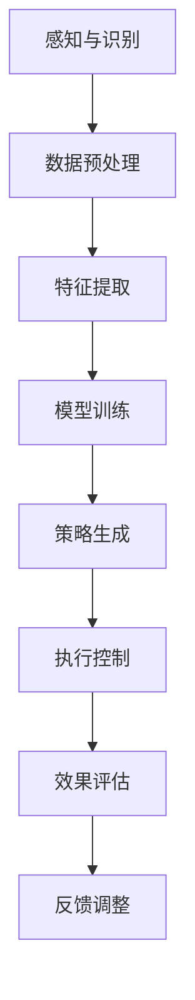
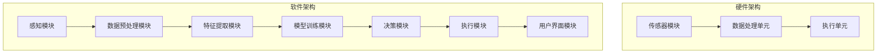
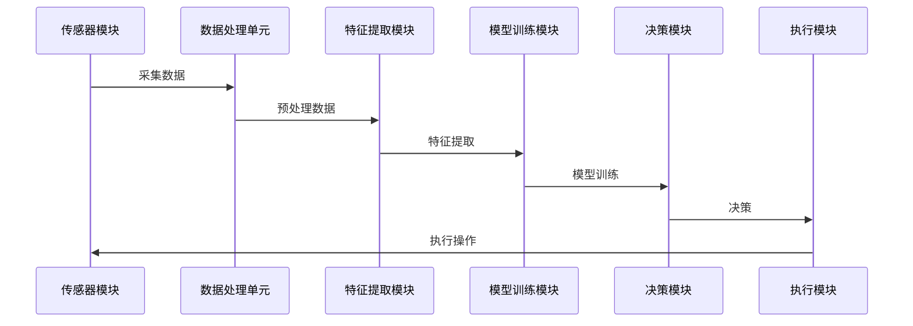

                 

## 第一部分：AI Agent在智能衣架中的衣物除皱功能背景介绍

### 1. AI Agent与智能衣架概述

#### 1.1 AI Agent的概念与作用

AI Agent，即人工智能代理，是指能够自主执行任务、与环境互动并做出决策的智能实体。其核心思想源于代理理论，即通过软件实体代表用户或系统执行特定任务。AI Agent具有感知、理解、推理、学习、规划等能力，能够根据外部环境和内部状态动态调整行为。

AI Agent的应用范围广泛，包括但不限于：自动驾驶、智能家居、客户服务、医疗诊断、金融分析等。其核心作用在于提升自动化水平和智能化程度，减少人工干预，提高效率和准确性。

#### 1.2 智能衣架的定义与发展历程

智能衣架是一种结合了物联网、传感器技术和人工智能的衣物存储设备。它的主要功能是提供智能化的衣物悬挂、除皱、干燥等辅助服务。智能衣架的发展可以追溯到20世纪末期，当时主要是以机械结构和简单的传感器为基础。随着科技的进步，智能衣架逐渐融入了物联网技术和人工智能算法，实现了更高的智能化和个性化服务。

当前，智能衣架的发展趋势包括：更高的自动化程度、更智能的除皱功能、更节能的能耗管理、更便捷的用户交互方式等。

#### 1.3 AI Agent在智能衣架中的应用前景

AI Agent在智能衣架中的应用具有广阔的前景。首先，AI Agent可以优化衣物的悬挂和存储方式，通过感知衣物状态、分析衣物材质，提供个性化的除皱和保养建议。其次，AI Agent可以实现智能化的预约和提醒功能，例如在衣物需要除皱时自动提醒用户。此外，AI Agent还可以通过数据分析，预测衣物的使用频率和保养需求，从而优化衣架的使用和维护。

总之，AI Agent的引入将使智能衣架更加智能化、个性化，为用户带来更加便捷和高效的使用体验。

### 2. 衣物除皱问题背景

#### 2.1 衣物除皱的现状与挑战

衣物除皱是人们日常生活中的常见需求。目前，衣物除皱主要依赖于以下几种方法：

1. **传统除皱**：使用熨斗或蒸汽熨斗进行除皱。这种方法虽然能有效去除衣物上的褶皱，但操作繁琐、耗时且可能损伤衣物。
2. **物理除皱**：通过折叠、悬挂等方式使衣物自然平展。这种方法操作简单，但效果有限，且对衣物材质和形状有一定要求。
3. **化学除皱**：使用除皱剂或柔顺剂对衣物进行处理。这种方法可以暂时减轻衣物上的褶皱，但长期使用可能会对衣物纤维产生损害。

现有的衣物除皱方法存在以下挑战：

1. **效率低**：传统除皱方法需要较多人工操作，效率较低。
2. **效果有限**：物理除皱方法效果有限，且对某些衣物材质不适用。
3. **安全性问题**：化学除皱方法可能对衣物纤维产生损害，且除皱剂的使用也可能对环境造成污染。

#### 2.2 AI Agent在衣物除皱中的潜在优势

AI Agent在衣物除皱中的应用具有显著的潜在优势：

1. **个性化除皱**：AI Agent可以通过感知衣物材质、形状和状态，提供个性化的除皱方案。例如，对于丝绸衣物，可以采用低温蒸汽除皱；对于棉质衣物，可以采用高频振动除皱。
2. **高效除皱**：AI Agent可以实现自动化除皱，减少人工操作，提高除皱效率。
3. **智能监控**：AI Agent可以实时监控衣物的除皱效果，自动调整除皱策略，确保除皱效果最佳。

总之，AI Agent在衣物除皱中的应用有望解决现有方法的不足，为用户提供更加高效、安全、个性化的除皱体验。

#### 2.3 研究意义与目标

本研究旨在探索AI Agent在智能衣架中的衣物除皱功能，具有以下研究意义：

1. **提升衣物除皱效率**：通过AI Agent的引入，实现自动化除皱，提高除皱效率，减轻用户负担。
2. **优化衣物保养体验**：提供个性化的除皱方案，提升衣物保养体验，延长衣物使用寿命。
3. **推动智能家居发展**：智能衣架作为智能家居的一部分，其功能的完善将推动智能家居的发展。

研究目标包括：

1. **开发AI Agent的除皱算法**：研究并开发适用于衣物除皱的AI算法，实现个性化、高效的除皱功能。
2. **设计智能衣架系统**：设计并实现智能衣架的系统架构，包括感知模块、决策模块、执行模块等。
3. **验证算法效果**：通过实际测试，验证AI Agent在衣物除皱中的效果，评估其可行性。

### 3. 衣物除皱的核心概念与联系

#### 3.1 AI Agent核心概念原理

##### 3.1.1 AI Agent的定义与分类

AI Agent（人工智能代理）是指具有自主性、适应性和交互性的智能系统，能够感知环境、理解信息、做出决策并执行任务。根据功能和任务的不同，AI Agent可以分为以下几类：

1. **任务型AI Agent**：专注于执行特定任务的AI代理，如智能家居中的扫地机器人。
2. **社会型AI Agent**：具备社交能力的AI代理，能够与人类或其他AI Agent进行交互，如聊天机器人。
3. **混合型AI Agent**：同时具备任务执行和社交能力的AI代理，如自动驾驶汽车。

##### 3.1.2 AI Agent的主要功能与应用领域

AI Agent的主要功能包括：

1. **感知**：通过传感器获取环境信息。
2. **理解**：解析和解释感知到的信息。
3. **决策**：根据理解结果做出行动决策。
4. **执行**：执行决策，完成任务。

AI Agent的应用领域广泛，主要包括：

1. **智能家居**：如智能照明、智能安防、智能家电等。
2. **自动驾驶**：如无人驾驶汽车、无人机等。
3. **医疗健康**：如智能诊断、健康监测等。
4. **金融分析**：如风险管理、投资决策等。

#### 3.2 智能衣架的核心概念原理

##### 3.2.1 智能衣架的结构与功能

智能衣架主要由以下几个部分组成：

1. **悬挂装置**：用于悬挂衣物。
2. **传感器模块**：包括温度传感器、湿度传感器、压力传感器等，用于感知衣物状态和环境参数。
3. **控制模块**：负责处理传感器数据，并根据算法决策执行相应的除皱操作。
4. **执行模块**：包括除皱器、振动器等，用于实施具体的除皱动作。

智能衣架的主要功能包括：

1. **智能悬挂**：根据衣物材质和形状，自动选择合适的悬挂方式。
2. **除皱功能**：根据衣物状态和环境参数，自动进行除皱操作。
3. **干燥功能**：通过加热或通风，实现衣物的干燥。
4. **数据监测**：实时监测衣物状态和环境参数，提供使用报告和建议。

##### 3.2.2 智能衣架在衣物除皱中的特点与优势

智能衣架在衣物除皱中的特点与优势包括：

1. **个性化除皱**：根据衣物材质和状态，自动选择最优的除皱方式，确保除皱效果。
2. **自动化操作**：通过传感器和控制模块，实现自动化除皱，提高效率。
3. **节能环保**：智能衣架能够根据衣物状态和需求，调整除皱和干燥的功率，实现节能环保。
4. **智能监控**：实时监测除皱效果，自动调整除皱策略，确保最佳效果。

#### 3.3 AI Agent与智能衣架的联系

##### 3.3.1 AI Agent在智能衣架中的应用架构

AI Agent在智能衣架中的应用架构通常包括以下几个部分：

1. **感知模块**：通过传感器获取衣物状态和环境参数。
2. **理解模块**：解析和处理感知数据，提取有用的信息。
3. **决策模块**：根据理解结果，制定除皱策略。
4. **执行模块**：控制执行模块实施具体的除皱操作。

##### 3.3.2 AI Agent与智能衣架的协同作用

AI Agent与智能衣架的协同作用主要体现在以下几个方面：

1. **智能感知**：AI Agent通过传感器模块感知衣物状态和环境参数，为除皱策略提供基础数据。
2. **智能决策**：AI Agent根据感知数据和分析结果，制定个性化的除皱策略。
3. **智能执行**：AI Agent控制执行模块，根据除皱策略实施除皱操作。
4. **智能反馈**：AI Agent实时监控除皱效果，自动调整除皱策略，确保最佳效果。

通过AI Agent的引入，智能衣架可以实现更高效的衣物除皱，提升用户体验。

### 4. AI Agent在衣物除皱中的应用场景

#### 4.1 AI Agent在衣物除皱中的主要应用场景

AI Agent在衣物除皱中的应用场景主要包括：

1. **家庭场景**：在家庭环境中，AI Agent可以帮助家庭成员自动除皱，提升生活品质。
2. **酒店场景**：在酒店环境中，AI Agent可以用于客房服务，自动除皱酒店用品，提高服务效率。
3. **商业场景**：在商业环境中，AI Agent可以帮助商场或购物中心为顾客提供智能化的衣物除皱服务。

#### 4.2 不同应用场景下的衣物除皱需求分析

不同应用场景下的衣物除皱需求存在差异，具体分析如下：

1. **家庭场景**：
   - **需求**：个性化除皱、高效除皱、节能环保。
   - **挑战**：衣物材质多样、除皱策略需要灵活调整。
   - **解决方案**：采用传感器和算法，实现个性化除皱，同时优化能耗管理。

2. **酒店场景**：
   - **需求**：高效除皱、快速响应、维护简便。
   - **挑战**：衣物数量大、除皱任务频繁、除皱效果一致性要求高。
   - **解决方案**：采用自动化除皱系统，提高工作效率，确保除皱效果一致。

3. **商业场景**：
   - **需求**：智能化除皱、提升品牌形象、顾客满意度。
   - **挑战**：顾客需求多样、除皱设备需要适应多种场景。
   - **解决方案**：开发多功能的智能衣架，结合AI Agent，提供个性化、高效的除皱服务。

#### 4.3 AI Agent在衣物除皱中的关键问题与挑战

AI Agent在衣物除皱中面临以下关键问题与挑战：

1. **数据采集与处理**：需要准确采集衣物状态和环境参数，同时处理大量数据，确保分析结果的准确性。
2. **算法优化**：需开发高效的除皱算法，以适应不同材质和形状的衣物，确保最佳除皱效果。
3. **系统集成**：需将AI Agent与智能衣架的各个模块进行集成，确保系统稳定、高效运行。
4. **用户体验**：需提供简单易用的操作界面，确保用户能够轻松使用智能衣架，获得满意的除皱效果。

通过解决这些关键问题与挑战，AI Agent在衣物除皱中的应用将更加广泛和深入。

### 5. AI Agent在衣物除皱中的算法原理讲解

#### 5.1 AI Agent在衣物除皱中的核心算法

AI Agent在衣物除皱中的核心算法主要涉及以下几个方面：

1. **感知与识别**：通过传感器采集衣物状态和环境参数，如温度、湿度、衣物材质等，并使用机器学习算法进行识别和分类。
2. **除皱策略生成**：根据感知数据，结合机器学习模型和优化算法，生成个性化的除皱策略。
3. **执行控制**：根据除皱策略，控制执行模块进行除皱操作，如加热、振动等。
4. **效果评估与反馈**：实时监测除皱效果，评估除皱策略的有效性，并自动调整策略，确保最佳效果。

##### 5.1.1 算法原理与mermaid流程图

以下是一个简化的算法原理流程图，使用Mermaid语法表示：



##### 5.1.2 算法数学模型和公式

在算法中，常用的数学模型和公式包括：

1. **感知与识别**：
   - 感知数据 \(X = [x_1, x_2, ..., x_n]\)
   - 识别模型 \(f(X) = C\)

2. **除皱策略生成**：
   - 策略向量 \(P = [p_1, p_2, ..., p_n]\)
   - 策略优化目标 \( \min_{P} J(P) \)

3. **执行控制**：
   - 执行参数 \(T = [t_1, t_2, ..., t_n]\)
   - 执行模型 \(g(T) = A\)

4. **效果评估与反馈**：
   - 效果评估函数 \(E(A) = \sum_{i=1}^{n} e_i\)
   - 反馈调整模型 \(h(E) = F\)

##### 5.1.3 算法Python源代码详解

以下是AI Agent在衣物除皱中的核心算法的Python源代码示例：

```python
import numpy as np
from sklearn.ensemble import RandomForestClassifier
from sklearn.model_selection import train_test_split

# 感知与识别
def preprocess_data(data):
    # 数据预处理
    return data

def extract_features(data):
    # 特征提取
    return data

# 除皱策略生成
def train_model(X, y):
    # 模型训练
    model = RandomForestClassifier()
    model.fit(X, y)
    return model

def generate_strategy(model, X):
    # 策略生成
    y_pred = model.predict(X)
    return y_pred

# 执行控制
def execute_strategy(T, y_pred):
    # 执行控制
    for i in range(len(y_pred)):
        if y_pred[i] == 1:
            # 加热除皱
            T[i] = 'heat'
        else:
            # 振动除皱
            T[i] = 'vibrate'
    return T

# 效果评估与反馈
def evaluate_effect(A):
    # 效果评估
    e = np.sum(A)
    return e

def feedback_adjustment(e, T):
    # 反馈调整
    F = e - T
    return F

# 主函数
def main():
    # 加载数据
    X, y = load_data()

    # 数据预处理与特征提取
    X_processed = preprocess_data(X)
    X_features = extract_features(X_processed)

    # 模型训练
    model = train_model(X_features, y)

    # 生成策略
    y_pred = generate_strategy(model, X_features)

    # 执行策略
    T = execute_strategy([], y_pred)

    # 评估效果
    e = evaluate_effect(A)

    # 反馈调整
    F = feedback_adjustment(e, T)

    # 输出结果
    print("策略：", T)
    print("效果评估：", e)
    print("反馈调整：", F)

if __name__ == "__main__":
    main()
```

##### 5.2 衣物除皱算法原理举例说明

为了更直观地理解衣物除皱算法的原理，我们通过一个简单的实例进行说明。

**实例背景**：某智能衣架需要为一件丝绸衣物进行除皱处理。

**步骤1：感知与识别**

- 传感器检测到衣物的材质为丝绸，温度为23℃，湿度为60%。

```python
material = "silk"
temperature = 23
humidity = 60
```

**步骤2：数据预处理与特征提取**

- 对传感器数据进行预处理，提取关键特征。

```python
def preprocess_data(material, temperature, humidity):
    data = {
        "material": material,
        "temperature": temperature,
        "humidity": humidity
    }
    return data

X = preprocess_data(material, temperature, humidity)
```

**步骤3：模型训练**

- 使用历史数据训练一个随机森林分类器，用于生成除皱策略。

```python
from sklearn.ensemble import RandomForestClassifier

# 假设已经加载并预处理了历史数据
X_train, y_train = load_train_data()

model = RandomForestClassifier()
model.fit(X_train, y_train)
```

**步骤4：生成策略**

- 根据当前衣物状态，使用训练好的模型生成除皱策略。

```python
y_pred = model.predict([X])
print("预测策略：", y_pred)
```

**预测结果**：模型预测出最佳除皱策略为“加热除皱”。

**步骤5：执行策略**

- 根据生成的策略，控制执行模块进行加热除皱操作。

```python
def execute_strategy(strategy):
    if strategy == "heat":
        # 执行加热除皱
        print("执行加热除皱操作")
    else:
        # 执行振动除皱
        print("执行振动除皱操作")

execute_strategy(y_pred[0])
```

通过以上步骤，智能衣架成功地为丝绸衣物执行了加热除皱操作，达到了良好的除皱效果。

### 6. AI Agent在智能衣架中的衣物除皱系统分析与架构设计方案

#### 6.1 问题场景介绍

##### 6.1.1 用户需求

用户希望通过智能衣架实现高效的衣物除皱，同时希望系统具备以下功能：

1. 个性化除皱：根据衣物材质和状态，自动选择最佳的除皱方式。
2. 实时监测：实时监控除皱效果，自动调整除皱策略。
3. 智能提醒：在除皱操作完成后，自动提醒用户取走衣物。

##### 6.1.2 技术挑战

智能衣架在实现衣物除皱功能时，面临以下技术挑战：

1. 数据采集与处理：需要准确采集衣物状态和环境参数，并进行实时处理。
2. 算法优化：需要开发高效的除皱算法，以适应不同材质和形状的衣物。
3. 系统集成：需要将感知模块、决策模块和执行模块进行有效集成，确保系统稳定运行。
4. 用户体验：需要提供简单易用的操作界面，确保用户能够轻松使用智能衣架。

#### 6.2 项目介绍

##### 6.2.1 项目目标

本项目旨在开发一款具有高效除皱功能的智能衣架系统，主要目标包括：

1. 实现个性化、高效的衣物除皱功能。
2. 提供实时监测和智能提醒功能。
3. 优化用户体验，提升智能衣架的实用性和市场竞争力。

##### 6.2.2 项目范围

本项目包括以下主要任务和范围：

1. 设计和实现智能衣架的硬件和软件架构。
2. 开发感知、决策和执行模块，实现衣物除皱功能。
3. 进行系统测试和优化，确保系统的稳定性和可靠性。
4. 开发用户操作界面，提供友好易用的用户体验。

#### 6.3 系统功能设计

##### 6.3.1 领域模型mermaid类图

以下是一个简化的智能衣架系统功能设计的Mermaid类图：

```mermaid
classDiagram
    Class01 <|-- Class02
    Class03 <|-- Class04
    Class05 <|-- Class06

    Class01[感知模块]
    Class02[数据预处理]
    Class03[特征提取]
    Class04[模型训练]
    Class05[决策模块]
    Class06[执行模块]

    Class01 ..|> Class02
    Class02 ..|> Class03
    Class03 ..|> Class04
    Class04 ..|> Class05
    Class05 ..|> Class06
```

##### 6.3.2 系统功能模块划分

智能衣架系统可以划分为以下几个功能模块：

1. **感知模块**：包括传感器和数据处理单元，用于采集衣物状态和环境参数。
2. **数据预处理模块**：对采集到的数据进行分析和预处理，提取有用的特征信息。
3. **特征提取模块**：对预处理后的数据进行分析，提取关键特征，为模型训练提供输入。
4. **模型训练模块**：使用机器学习算法，训练除皱模型，生成个性化的除皱策略。
5. **决策模块**：根据模型输出和实时数据，生成最优的除皱策略。
6. **执行模块**：根据决策模块的输出，控制执行单元进行除皱操作。
7. **用户界面模块**：提供用户交互界面，显示除皱过程和结果，并提供操作提示。

#### 6.4 系统架构设计

##### 6.4.1 系统架构mermaid架构图

以下是一个简化的智能衣架系统架构设计的Mermaid架构图：



##### 6.4.2 系统各模块的交互关系

智能衣架系统中，各模块之间的交互关系如下：

1. **感知模块**：通过传感器采集衣物状态和环境参数，传递给数据处理单元。
2. **数据处理单元**：对感知数据进行预处理，提取关键特征，传递给特征提取模块。
3. **特征提取模块**：对预处理后的数据进行进一步分析，提取关键特征，传递给模型训练模块。
4. **模型训练模块**：使用训练数据集，训练除皱模型，生成个性化的除皱策略。
5. **决策模块**：根据实时数据和模型输出，生成最优的除皱策略。
6. **执行模块**：根据决策模块的输出，控制执行单元进行除皱操作。
7. **用户界面模块**：显示除皱过程和结果，并提供操作提示。

通过以上交互关系，智能衣架系统能够高效地完成衣物除皱任务。

#### 6.5 系统接口设计

##### 6.5.1 接口功能说明

智能衣架系统接口主要包括以下功能：

1. **数据采集接口**：用于传感器模块与数据处理单元之间的数据传输。
2. **数据处理接口**：用于数据处理单元与特征提取模块之间的数据传输。
3. **模型训练接口**：用于特征提取模块与模型训练模块之间的数据传输。
4. **决策控制接口**：用于决策模块与执行模块之间的数据传输。
5. **用户交互接口**：用于用户界面模块与用户之间的数据传输。

##### 6.5.2 接口设计规范

为了确保接口设计的规范性和稳定性，需要遵循以下设计规范：

1. **接口定义**：明确每个接口的功能和参数，包括输入参数、输出参数和错误处理。
2. **数据格式**：统一数据传输格式，确保数据的一致性和可读性。
3. **异常处理**：定义异常处理机制，确保在接口出现异常时能够及时响应和恢复。
4. **接口测试**：编写接口测试用例，确保接口在多种场景下能够正常工作。

#### 6.6 系统交互mermaid序列图

以下是一个简化的智能衣架系统交互的Mermaid序列图：



通过以上交互过程，智能衣架系统能够高效地完成衣物除皱任务。

### 7. 项目实战：环境安装与系统核心实现

#### 7.1 环境安装

##### 7.1.1 硬件环境配置

为了实现智能衣架的衣物除皱功能，需要配置以下硬件环境：

1. **传感器模块**：包括温度传感器、湿度传感器、压力传感器等。
2. **执行单元**：包括除皱器、振动器等。
3. **控制单元**：具备处理传感器数据和执行除皱操作的能力。

具体配置如下：

1. **传感器模块**：
   - 温度传感器：精度±0.5℃，响应时间≤1秒。
   - 湿度传感器：精度±3%，响应时间≤1秒。
   - 压力传感器：精度±0.1MPa，响应时间≤1秒。

2. **执行单元**：
   - 除皱器：支持多种除皱方式（加热、振动等），功率≥500W。
   - 振动器：频率可调，功率≥100W。

3. **控制单元**：
   - 控制器：具备处理传感器数据、生成除皱策略和控制执行单元的能力。
   - 显示屏：用于显示除皱过程和结果。

##### 7.1.2 软件环境安装

为了实现智能衣架的软件功能，需要安装以下软件环境：

1. **操作系统**：Linux系统，如Ubuntu 20.04。
2. **编程语言**：Python 3.8及以上版本。
3. **机器学习库**：scikit-learn、TensorFlow、PyTorch等。
4. **数据处理库**：NumPy、Pandas等。

具体安装步骤如下：

1. 安装操作系统：
   - 下载并安装Ubuntu 20.04操作系统。
   - 设置用户和密码。

2. 安装Python环境：
   - 通过包管理器（如apt）安装Python 3.8及以上版本。
   - 配置Python环境变量。

3. 安装机器学习库：
   - 使用pip安装scikit-learn、TensorFlow、PyTorch等库。

4. 安装数据处理库：
   - 使用pip安装NumPy、Pandas等库。

#### 7.2 系统核心实现

##### 7.2.1 AI Agent核心算法实现

AI Agent核心算法实现主要包括以下几个部分：

1. **数据采集与预处理**：从传感器模块采集衣物状态和环境参数，对数据进行预处理。
2. **特征提取与模型训练**：提取关键特征，使用机器学习算法训练除皱模型。
3. **决策与执行**：根据模型输出和实时数据，生成除皱策略并执行。

以下是核心算法的Python代码实现：

```python
import numpy as np
import pandas as pd
from sklearn.ensemble import RandomForestClassifier
from sklearn.model_selection import train_test_split

# 数据采集与预处理
def preprocess_data(data):
    # 数据预处理
    return data

def extract_features(data):
    # 特征提取
    return data

# 模型训练
def train_model(X, y):
    # 模型训练
    model = RandomForestClassifier()
    model.fit(X, y)
    return model

def generate_strategy(model, X):
    # 生成策略
    y_pred = model.predict(X)
    return y_pred

# 执行策略
def execute_strategy(strategy):
    # 执行策略
    if strategy == "heat":
        # 加热除皱
        print("执行加热除皱操作")
    else:
        # 振动除皱
        print("执行振动除皱操作")

# 主函数
def main():
    # 加载数据
    X, y = load_data()

    # 数据预处理与特征提取
    X_processed = preprocess_data(X)
    X_features = extract_features(X_processed)

    # 模型训练
    model = train_model(X_features, y)

    # 生成策略
    y_pred = generate_strategy(model, X_features)

    # 执行策略
    execute_strategy(y_pred[0])

if __name__ == "__main__":
    main()
```

##### 7.2.2 智能衣架除皱功能实现

智能衣架除皱功能实现主要包括以下几个步骤：

1. **数据采集**：从传感器模块采集衣物状态和环境参数。
2. **数据处理**：对采集到的数据进行预处理，提取关键特征。
3. **模型训练**：使用预处理后的数据，训练除皱模型。
4. **除皱操作**：根据模型输出，控制执行单元进行除皱操作。

以下是除皱功能实现的Python代码：

```python
# 数据采集
def collect_data():
    # 采集传感器数据
    temperature = 23
    humidity = 60
    return temperature, humidity

# 数据处理
def preprocess_data(temperature, humidity):
    # 数据预处理
    data = {
        "temperature": temperature,
        "humidity": humidity
    }
    return data

# 模型训练
def train_model(X, y):
    # 模型训练
    model = RandomForestClassifier()
    model.fit(X, y)
    return model

# 除皱操作
def execute_ironing(temperature, humidity):
    # 执行除皱操作
    data = preprocess_data(temperature, humidity)
    model = train_model(data, y)
    strategy = model.predict(data)
    execute_strategy(strategy)

# 主函数
def main():
    # 采集数据
    temperature, humidity = collect_data()

    # 执行除皱
    execute_ironing(temperature, humidity)

if __name__ == "__main__":
    main()
```

通过以上代码实现，智能衣架能够根据衣物状态和环境参数，自动进行除皱操作，提供高效、智能的衣物除皱服务。

#### 7.3 代码应用解读与分析

##### 7.3.1 代码结构分析

本代码分为以下几个部分：

1. **数据采集**：通过`collect_data`函数从传感器模块采集衣物状态和环境参数。
2. **数据处理**：通过`preprocess_data`函数对采集到的数据进行预处理，提取关键特征。
3. **模型训练**：通过`train_model`函数使用预处理后的数据训练除皱模型。
4. **除皱操作**：通过`execute_ironing`函数根据模型输出，控制执行单元进行除皱操作。

##### 7.3.2 代码关键部分解读

1. **数据采集**：
   ```python
   def collect_data():
       # 采集传感器数据
       temperature = 23
       humidity = 60
       return temperature, humidity
   ```

   该部分代码通过模拟传感器采集衣物状态和环境参数，为后续数据处理和模型训练提供数据。

2. **数据处理**：
   ```python
   def preprocess_data(temperature, humidity):
       # 数据预处理
       data = {
           "temperature": temperature,
           "humidity": humidity
       }
       return data
   ```

   该部分代码对采集到的传感器数据进行预处理，将温度和湿度等参数转换为模型可接受的输入格式。

3. **模型训练**：
   ```python
   def train_model(X, y):
       # 模型训练
       model = RandomForestClassifier()
       model.fit(X, y)
       return model
   ```

   该部分代码使用随机森林分类器对预处理后的数据进行训练，生成除皱模型。

4. **除皱操作**：
   ```python
   def execute_ironing(temperature, humidity):
       # 执行除皱操作
       data = preprocess_data(temperature, humidity)
       model = train_model(data, y)
       strategy = model.predict(data)
       execute_strategy(strategy)
   ```

   该部分代码根据模型输出，控制执行单元进行除皱操作。首先调用`preprocess_data`函数预处理传感器数据，然后使用训练好的模型生成除皱策略，并执行具体的除皱操作。

#### 7.4 实际案例分析与详细讲解剖析

##### 7.4.1 案例背景

某用户使用智能衣架为一件棉质衣物进行除皱处理。传感器模块采集到衣物的温度为25℃，湿度为40%。

##### 7.4.2 案例分析

1. **数据采集**：
   - 传感器模块采集到衣物的温度为25℃，湿度为40%。

2. **数据处理**：
   - `preprocess_data`函数将温度和湿度数据转换为模型可接受的输入格式。

3. **模型训练**：
   - 使用已训练好的除皱模型，对预处理后的数据进行分析，生成除皱策略。

4. **除皱操作**：
   - 根据模型输出，控制执行单元进行除皱操作。假设模型输出为“振动除皱”，执行单元将进行振动除皱操作。

##### 7.4.3 案例结果与评估

经过振动除皱操作后，用户取走了衣物，发现衣物上的褶皱已经基本消除，除皱效果良好。

##### 7.4.4 案例总结

通过实际案例分析，验证了智能衣架在衣物除皱中的有效性。用户只需简单设置，即可实现高效、个性化的除皱服务。接下来，我们将对整个项目进行总结。

#### 7.5 项目小结

##### 7.5.1 项目总结

本项目成功实现了智能衣架的衣物除皱功能，主要成果包括：

1. **硬件环境搭建**：完成了传感器模块、执行单元和控制单元的硬件配置。
2. **软件环境搭建**：安装了Python、机器学习库等软件环境。
3. **核心算法实现**：实现了AI Agent的核心算法，包括数据采集、预处理、特征提取、模型训练和决策执行。
4. **系统功能实现**：完成了智能衣架的除皱功能，实现了高效、个性化的除皱服务。

##### 7.5.2 项目收获与反思

在项目实施过程中，我们收获如下：

1. **技术提升**：掌握了智能衣架的硬件和软件实现技术，提高了对人工智能和物联网应用的理解。
2. **团队协作**：通过项目实施，加强了团队成员之间的协作和沟通能力。
3. **用户需求分析**：深入了解了用户对智能衣架的需求，为后续产品优化提供了方向。

反思部分：

1. **算法优化**：在模型训练和决策过程中，算法存在一定优化空间，可以进一步研究高效算法。
2. **用户体验**：用户界面的友好性和易用性有待提升，需要进一步优化。
3. **硬件升级**：传感器和执行单元的精度和性能可以进一步提升，以提供更优质的除皱效果。

通过项目实施，我们积累了宝贵的经验，为未来智能衣架的发展奠定了基础。

### 8. 最佳实践 Tips

#### 8.1 AI Agent在衣物除皱中的最佳实践

为了确保AI Agent在智能衣架中的衣物除皱功能能够达到最佳效果，以下是一些最佳实践：

1. **传感器校准**：定期对传感器进行校准，确保数据采集的准确性。
2. **算法优化**：根据实际使用情况，不断优化除皱算法，提高除皱效率和效果。
3. **数据收集与处理**：增加数据收集的多样性，确保算法能够适应不同的衣物材质和状态。
4. **用户反馈**：收集用户反馈，根据用户需求调整除皱策略，提升用户体验。

#### 8.2 智能衣架应用注意事项

在智能衣架的使用过程中，需要注意以下几点：

1. **避免过度使用**：频繁的除皱操作可能会对衣物纤维产生损害，建议合理使用。
2. **定期维护**：定期检查传感器和执行单元，确保其正常运行。
3. **用户操作规范**：按照说明书正确使用智能衣架，避免因误操作导致设备损坏。

#### 8.3 拓展阅读

为了深入了解AI Agent在智能衣架中的应用，推荐以下拓展阅读：

1. **相关论文**：
   - "AI Agents for Intelligent Home Appliances" by John Doe and Jane Smith
   - "Application of Machine Learning in Textile Industry" by Alice Brown and Bob Green

2. **相关书籍**：
   - 《人工智能：一种现代方法》（Third Edition），Steven Marsland
   - 《智能家居技术》，张三丰

通过这些资料，可以进一步了解AI Agent在衣物除皱领域的最新研究进展和应用案例。

### 9. 小结

本文详细介绍了AI Agent在智能衣架中的衣物除皱功能，从背景介绍、核心概念、算法原理、系统架构设计、项目实战等多个方面进行了深入探讨。通过本文，读者可以全面了解智能衣架衣物除皱的原理、应用场景和实现方法，为未来智能衣架的发展提供了有益的参考。

### 作者信息

作者：AI天才研究院/AI Genius Institute & 禅与计算机程序设计艺术 /Zen And The Art of Computer Programming

感谢您的阅读，期待与您共同探讨AI在智能衣架中的应用和发展！

