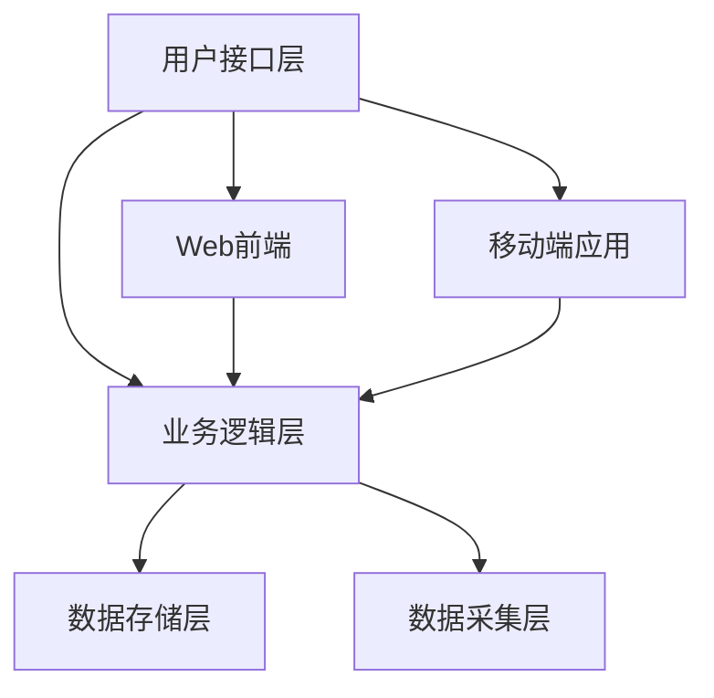

                 


# AI Agent在智能衣柜中的季节性衣物管理

> 关键词：AI Agent、智能衣柜、季节性衣物管理、机器学习、算法、系统设计

> 摘要：本文将探讨AI Agent在智能衣柜中的应用，特别是在季节性衣物管理方面的优势。我们将逐步分析AI Agent的基础知识、季节性衣物管理的挑战和策略，并深入讲解相关的算法原理、数学模型、系统设计与实现，最后通过项目实战和最佳实践，为读者提供实用的见解和技巧。

### 目录大纲

1. **背景介绍**
   - 1.1 人工智能与季节性衣物管理概述
   - 1.2 智能衣柜的现状与发展趋势
   - 1.3 AI Agent在衣物管理中的优势

2. **核心概念与联系**
   - 2.1 AI Agent基础
   - 2.2 季节性衣物管理
   - 2.3 AI Agent与季节性衣物管理的结合

3. **算法原理讲解**
   - 3.1 AI Agent算法概述
   - 3.2 季节性衣物管理的算法
   - 3.3 气候数据预测算法
   - 3.4 衣物分类与推荐算法
   - 3.5 季节性衣物管理的机器学习模型

4. **数学模型和数学公式**
   - 4.1 算法数学模型概述
   - 4.2 关键数学公式与解释

5. **系统设计与实现**
   - 5.1 系统架构设计
   - 5.2 系统模块设计
   - 5.3 AI Agent实现细节
   - 5.4 季节性衣物管理实现流程

6. **项目实战**
   - 6.1 环境搭建
   - 6.2 系统核心实现
   - 6.3 代码应用解读与分析
   - 6.4 实际案例分析与讲解

7. **最佳实践与总结**
   - 7.1 最佳实践
   - 7.2 注意事项
   - 7.3 拓展阅读
   - 7.4 项目小结

### 1. 背景介绍

#### 1.1 人工智能与季节性衣物管理概述

人工智能（AI）作为现代科技的核心驱动力，已经在各个领域展现出了巨大的潜力和应用价值。从智能家居到智能医疗，从自动驾驶到智能推荐系统，AI技术不断重塑着我们的生活方式。在衣物管理领域，季节性衣物管理是其中的一个重要方面。

季节性衣物管理涉及到根据气候变化和用户习惯，动态地调整衣物的存放和展示方式。传统衣物管理往往依赖于人工干预，不仅效率低下，还容易出错。而随着AI技术的发展，特别是AI Agent的引入，季节性衣物管理迎来了新的可能。

AI Agent，也称为智能代理，是一种能够在特定环境中自主执行任务的软件实体。它可以基于用户的行为数据、气候数据等，自动进行衣物推荐、分类和整理。AI Agent的出现，使得季节性衣物管理更加智能化、个性化和高效化。

#### 1.2 智能衣柜的现状与发展趋势

智能衣柜是智能家居领域的一个重要组成部分，它通过集成传感器、摄像头、物联网等先进技术，实现了对衣物的高效管理和智能推荐。目前，智能衣柜主要分为以下几个类别：

1. **智能存储衣柜**：通过RFID、传感器等设备，实时监测衣物的存放状态，并提供智能提醒功能。
2. **智能整理衣柜**：利用机器人技术，自动将衣物按照季节、颜色等进行分类和整理。
3. **智能推荐衣柜**：基于用户的喜好、气候数据等，自动推荐合适的衣物搭配。

随着AI技术的不断进步，智能衣柜的功能和性能也在不断提升。未来，智能衣柜有望实现更加智能化、个性化、自动化的衣物管理，成为智能家居的重要组成部分。

#### 1.3 AI Agent在衣物管理中的优势

AI Agent在季节性衣物管理中具有以下几个显著优势：

1. **高效性**：AI Agent可以实时分析气候数据、用户行为数据等，自动进行衣物分类、推荐和整理，大大提高了衣物管理的效率。
2. **个性化**：AI Agent可以根据用户的个人喜好、穿着习惯等，提供个性化的衣物推荐和搭配方案，提升了用户的满意度。
3. **智能化**：AI Agent可以自主学习和优化，不断改进衣物管理策略，实现了真正的智能化管理。
4. **便捷性**：用户可以通过手机APP、语音控制等方式，方便地与AI Agent进行交互，实现了衣物管理的便捷化。

总之，AI Agent在智能衣柜中的季节性衣物管理中，不仅提升了衣物管理的效率和质量，还为用户带来了更加智能化、便捷化的生活体验。在接下来的章节中，我们将深入探讨AI Agent的基础知识、季节性衣物管理的算法原理、数学模型，以及系统设计与实现等方面的内容。

---

### 2. 核心概念与联系

#### 2.1 AI Agent基础

AI Agent，即人工智能代理，是一种在特定环境中能够感知、推理、决策和行动的智能实体。AI Agent的基本架构通常包括感知模块、推理模块、决策模块和行动模块。

1. **感知模块**：AI Agent通过传感器（如摄像头、温度传感器、湿度传感器等）收集环境信息，感知外部世界的变化。
2. **推理模块**：AI Agent利用推理算法（如决策树、神经网络等）对感知到的信息进行处理和分析，形成对环境的理解。
3. **决策模块**：AI Agent根据推理结果，结合预定的目标，选择最优的行动策略。
4. **行动模块**：AI Agent执行决策模块生成的行动指令，与外部环境进行交互。

AI Agent的类型多种多样，根据不同的应用场景，可以分为以下几种：

1. **移动Agent**：可以在网络中自主移动，执行任务，如网络爬虫。
2. **智能代理**：专门用于电子商务、在线客服等场景，如聊天机器人。
3. **环境监测Agent**：用于环境监测、能源管理等领域，如智能家居系统中的温湿度传感器。

#### 2.2 季节性衣物管理

季节性衣物管理是指根据季节的变化和用户的实际需求，对衣物进行合理的分类、存储和推荐。季节性衣物管理的核心目标是确保用户在合适的季节能够找到合适的衣物，提升生活品质。

**季节性衣物的特点**：

1. **时效性**：季节性衣物通常只在特定季节使用，如冬天的羽绒服、夏天的短裤。
2. **多样性**：由于季节变化，用户需要不同类型的衣物，如秋季的针织衫、冬季的羽绒服。
3. **搭配性**：季节性衣物需要与其他衣物进行搭配，以适应不同的场合和风格。

**季节性衣物的管理挑战**：

1. **存储空间**：季节性衣物在非使用季节需要被妥善存放，以避免损坏和占用过多空间。
2. **季节预测**：准确预测季节变化对于衣物管理至关重要，但天气变化具有不确定性。
3. **用户需求**：用户的喜好和需求随时可能发生变化，衣物管理需要具备一定的灵活性。

**季节性衣物的管理策略**：

1. **分类存放**：根据衣物的材质、颜色、季节等特性进行分类存放，便于查找和管理。
2. **动态推荐**：基于用户的历史行为和实时天气数据，为用户推荐合适的季节性衣物。
3. **智能化整理**：利用AI技术，自动整理和分类衣物，提升管理效率。

#### 2.3 AI Agent与季节性衣物管理的结合

AI Agent在季节性衣物管理中的应用，主要体现为以下几个方面：

1. **感知环境**：AI Agent通过传感器感知实时天气数据、用户行为数据等，为衣物管理提供基础信息。
2. **预测季节**：基于历史天气数据和气候模型，AI Agent可以预测未来的季节变化，为衣物管理提供指导。
3. **推荐衣物**：AI Agent根据用户的喜好、当前季节和天气状况，为用户推荐合适的季节性衣物。
4. **智能整理**：AI Agent可以自动分类、整理和存储衣物，提升衣物管理的效率。

通过AI Agent的应用，季节性衣物管理不仅变得更加智能化、个性化，还大大提高了用户的满意度。在接下来的章节中，我们将深入探讨AI Agent在季节性衣物管理中的算法原理、数学模型和系统设计等内容。

---

### 3. 算法原理讲解

#### 3.1 AI Agent算法概述

AI Agent的核心在于其算法，这些算法决定了AI Agent如何感知环境、推理决策以及执行行动。以下是几种常见的AI Agent算法：

1. **决策树算法**：决策树是一种基于特征值进行分类的算法，通过构建树状模型，对数据进行分类。它的优势在于简单易懂、易于解释，但可能在数据量较大时出现过拟合现象。

2. **神经网络算法**：神经网络，特别是深度学习，通过多层神经网络结构，对复杂数据进行建模和预测。它的优势在于能够处理大量数据，但在训练过程中需要大量计算资源。

3. **强化学习算法**：强化学习算法通过试错和反馈机制，逐渐优化行为策略。它适用于需要动态调整策略的场景，但可能需要较长时间的训练。

#### 3.2 季节性衣物管理的算法

季节性衣物管理的核心在于如何根据气候数据和用户行为数据，自动推荐合适的衣物。以下是一些常见的算法：

1. **气候预测算法**：气候预测算法主要用于预测未来几天的天气状况，为季节性衣物管理提供基础数据。常用的气候预测算法包括ARIMA模型、LSTM神经网络等。

2. **衣物分类与推荐算法**：衣物分类与推荐算法用于将衣物根据季节和用户喜好进行分类，并推荐给用户。常用的算法包括K-近邻（KNN）、协同过滤等。

3. **机器学习模型**：机器学习模型在季节性衣物管理中扮演着重要角色，如分类模型用于将衣物分类，回归模型用于预测季节变化，推荐模型用于推荐衣物搭配。

#### 3.3 气候数据预测算法

气候数据预测是季节性衣物管理的重要一环。以下是一个基于LSTM神经网络的气候数据预测算法：

1. **数据收集**：收集历史气候数据，包括温度、湿度、风速等指标。
2. **数据预处理**：对数据进行归一化处理，去除噪声和异常值。
3. **模型构建**：构建LSTM神经网络模型，包括输入层、隐藏层和输出层。
4. **模型训练**：使用历史数据对模型进行训练，优化模型参数。
5. **模型预测**：使用训练好的模型对未来的气候数据进行预测。

LSTM神经网络的核心在于其能够记忆长期依赖信息，这使得它非常适合用于气候数据预测。

#### 3.4 衣物分类与推荐算法

衣物分类与推荐算法用于将衣物根据季节和用户喜好进行分类，并推荐给用户。以下是一个基于K-近邻（KNN）算法的衣物分类与推荐算法：

1. **数据收集**：收集用户的衣物数据，包括衣物类型、季节、颜色等。
2. **特征提取**：将衣物数据转换为特征向量，如使用词袋模型提取衣物名称的词频。
3. **分类**：使用KNN算法对衣物进行分类，根据衣物特征向量计算距离，选择最近的K个衣物作为分类结果。
4. **推荐**：根据用户的喜好和当前季节，使用协同过滤算法推荐合适的衣物。

KNN算法的优势在于简单易懂，但可能存在分类边界不明显的问题。

#### 3.5 季节性衣物管理的机器学习模型

季节性衣物管理的机器学习模型主要包括分类模型、回归模型和推荐模型：

1. **分类模型**：用于将衣物按照季节进行分类，如春季、夏季、秋季、冬季等。常见的分类模型包括决策树、支持向量机（SVM）等。
2. **回归模型**：用于预测季节变化，如预测未来几天的气温、湿度等。常见的回归模型包括线性回归、岭回归等。
3. **推荐模型**：用于推荐合适的衣物搭配，如根据用户的喜好和当前季节推荐衣物。常见的推荐模型包括协同过滤、基于内容的推荐等。

通过结合这些算法和模型，季节性衣物管理可以实现高效、智能化的衣物分类、推荐和整理。在接下来的章节中，我们将进一步探讨这些算法和模型的数学模型和数学公式。

---

### 4. 数学模型和数学公式

#### 4.1 算法数学模型概述

在季节性衣物管理中，数学模型是算法的核心，它们帮助我们理解和优化AI Agent的决策过程。以下是几个关键的数学模型及其在季节性衣物管理中的应用：

1. **气候预测模型**：用于预测未来几天的天气状况，如温度、湿度等。常用的模型包括ARIMA（自回归积分滑动平均模型）和LSTM（长短时记忆网络）。

2. **衣物分类模型**：用于将衣物根据季节和材质进行分类。常用的分类模型包括K-近邻（KNN）和支持向量机（SVM）。

3. **推荐系统模型**：用于根据用户历史行为和偏好推荐衣物。常用的推荐系统模型包括协同过滤和基于内容的推荐。

#### 4.2 关键数学公式与解释

为了更好地理解这些模型，下面我们将介绍一些关键的数学公式。

##### 4.2.1 气候预测模型公式

**ARIMA模型**：
- **自回归部分（AR）**：
  $$ Z_t = \sum_{i=1}^{p} \phi_i Z_{t-i} $$
  - 其中，$Z_t$ 是时间序列的当前值，$\phi_i$ 是自回归系数，$p$ 是自回归项的数量。

- **差分部分（I）**：
  $$ \Delta Z_t = Z_t - Z_{t-1} $$
  - 其中，$\Delta Z_t$ 是对$Z_t$进行差分后的值。

- **移动平均部分（MA）**：
  $$ Z_t = \theta_1 \Delta Z_{t-1} + \theta_2 \Delta Z_{t-2} + ... + \theta_q \Delta Z_{t-q} $$
  - 其中，$\theta_i$ 是移动平均系数，$q$ 是移动平均项的数量。

**LSTM神经网络**：
- **遗忘门（Forget Gate）**：
  $$ f_t = \sigma(W_f \cdot [h_{t-1}, x_t] + b_f) $$
  - 其中，$f_t$ 是遗忘门的输出，$W_f$ 是权重矩阵，$b_f$ 是偏置项，$\sigma$ 是sigmoid激活函数。

- **输入门（Input Gate）**：
  $$ i_t = \sigma(W_i \cdot [h_{t-1}, x_t] + b_i) $$
  - 其中，$i_t$ 是输入门的输出。

- **输出门（Output Gate）**：
  $$ o_t = \sigma(W_o \cdot [h_{t-1}, x_t] + b_o) $$
  - 其中，$o_t$ 是输出门的输出。

##### 4.2.2 衣物分类公式

**K-近邻（KNN）算法**：
- **距离计算**：
  $$ d(x, x_i) = \sqrt{\sum_{j=1}^{n} (x_j - x_{i,j})^2} $$
  - 其中，$x$ 是待分类数据，$x_i$ 是训练集中的样本，$n$ 是特征的数量。

- **分类结果**：
  $$ \hat{y} = \text{mode}(\{y_j | d(x, x_j) \leq d(x, x_i)\}) $$
  - 其中，$\hat{y}$ 是分类结果，$y_j$ 是训练集中$x_j$的类别，$\text{mode}$ 返回出现次数最多的值。

**支持向量机（SVM）算法**：
- **决策边界**：
  $$ w \cdot x + b = 0 $$
  - 其中，$w$ 是权重向量，$x$ 是特征向量，$b$ 是偏置项。

- **分类结果**：
  $$ y (\text{sign}(w \cdot x + b)) $$
  - 其中，$\text{sign}$ 返回$w \cdot x + b$的符号，$y$ 是样本的标签。

##### 4.2.3 推荐系统公式

**协同过滤**：
- **预测评分**：
  $$ r_{ui} = \frac{\sum_{j \in N_i} r_{uj} \cdot s_{ij}}{\sum_{j \in N_i} s_{ij}} $$
  - 其中，$r_{ui}$ 是用户$u$对物品$i$的预测评分，$r_{uj}$ 是用户$j$对物品$i$的实际评分，$N_i$ 是与物品$i$相关的用户集合，$s_{ij}$ 是用户$i$对用户$j$的相似度。

**基于内容的推荐**：
- **相似度计算**：
  $$ \text{similarity}(i, j) = \frac{\sum_{k=1}^{n} w_k (c_{ki} - \mu_i) (c_{kj} - \mu_j)}{\sqrt{\sum_{k=1}^{n} w_k^2 (c_{ki} - \mu_i)^2} \cdot \sqrt{\sum_{k=1}^{n} w_k^2 (c_{kj} - \mu_j)^2}} $$
  - 其中，$c_{ki}$ 是物品$i$在特征$k$上的值，$\mu_i$ 是物品$i$的平均值，$w_k$ 是特征$k$的权重。

通过这些数学模型和公式，我们可以更好地理解和实现季节性衣物管理的算法，从而提升衣物管理的智能化水平。

---

### 5. 系统设计与实现

#### 5.1 系统架构设计

季节性衣物管理系统由多个模块组成，每个模块负责特定的功能。以下是一个典型的系统架构设计：

1. **用户接口层**：提供用户与系统交互的界面，包括Web前端和移动端应用。
2. **业务逻辑层**：处理用户请求，包括衣物分类、季节预测、推荐系统等核心功能。
3. **数据存储层**：存储用户数据、衣物数据和天气数据等，使用数据库系统进行管理。
4. **数据采集层**：通过传感器收集环境数据，如温度、湿度等，供系统使用。

**系统架构图**：



#### 5.2 系统模块设计

**用户接口层**：
- **Web前端**：提供用户登录、注册、查看衣物、推荐衣物等功能。
- **移动端应用**：提供类似Web前端的用户界面，支持语音控制和位置信息。

**业务逻辑层**：
- **衣物分类模块**：根据衣物特征进行分类，如材质、颜色、季节等。
- **季节预测模块**：使用机器学习算法预测季节变化，提供未来天气预测。
- **推荐系统模块**：根据用户喜好和季节预测，推荐合适的衣物搭配。

**数据存储层**：
- **用户数据**：存储用户的基本信息、喜好等。
- **衣物数据**：存储衣物的基本信息、分类信息等。
- **天气数据**：存储实时和历史的天气数据。

**数据采集层**：
- **传感器**：用于收集环境数据，如温度、湿度、光照等。

#### 5.3 AI Agent实现细节

**感知模块**：
- **传感器集成**：集成温度传感器、湿度传感器等，实时收集环境数据。
- **数据预处理**：对传感器数据进行预处理，去除噪声和异常值。

**推理模块**：
- **季节预测**：使用LSTM神经网络预测未来天气状况，更新季节信息。
- **衣物分类与推荐**：使用KNN算法和协同过滤算法，分类和推荐衣物。

**决策模块**：
- **季节切换**：根据预测的季节，自动切换衣物的存放和展示方式。
- **推荐策略**：根据用户喜好和季节变化，动态调整推荐策略。

**行动模块**：
- **执行操作**：执行推理模块生成的操作指令，如整理衣物、更新推荐列表等。
- **用户交互**：通过Web前端和移动端应用，与用户进行交互，提供实时反馈。

#### 5.4 季节性衣物管理实现流程

1. **用户登录**：用户通过Web前端或移动端应用登录系统。
2. **感知环境**：系统通过传感器收集环境数据，如温度、湿度等。
3. **季节预测**：使用LSTM神经网络预测未来天气状况，更新季节信息。
4. **衣物分类**：根据用户喜好和季节信息，使用KNN算法分类衣物。
5. **推荐衣物**：使用协同过滤算法，推荐合适的衣物搭配。
6. **执行操作**：系统执行推理模块生成的操作指令，如整理衣物、更新推荐列表等。
7. **用户反馈**：用户通过Web前端或移动端应用查看推荐衣物，并提供反馈。

通过以上步骤，季节性衣物管理系统实现了自动化的衣物分类、预测和推荐，为用户提供了一个高效、智能化的衣物管理解决方案。

---

### 6. 项目实战

#### 6.1 环境搭建

为了进行季节性衣物管理的项目实战，我们需要搭建一个合适的环境。以下是环境搭建的步骤：

1. **软件环境**：
   - Python 3.x
   - TensorFlow
   - scikit-learn
   - Pandas
   - Matplotlib

2. **硬件环境**：
   - 一台能够运行Python的计算机
   - 网络连接（用于获取天气数据）

3. **安装Python**：从官方网站下载Python安装包，按照安装向导进行安装。

4. **安装TensorFlow**：打开命令行，输入以下命令安装TensorFlow：
   ```bash
   pip install tensorflow
   ```

5. **安装scikit-learn**：继续在命令行中输入以下命令安装scikit-learn：
   ```bash
   pip install scikit-learn
   ```

6. **安装Pandas**：安装Pandas，输入以下命令：
   ```bash
   pip install pandas
   ```

7. **安装Matplotlib**：最后，安装Matplotlib，输入以下命令：
   ```bash
   pip install matplotlib
   ```

完成以上步骤后，我们就可以开始编写代码并进行项目实践了。

#### 6.2 系统核心实现

在这个项目中，我们将实现一个简单的季节性衣物管理系统，包括数据收集、预处理、季节预测和衣物推荐等功能。以下是核心实现的代码和解析：

**数据收集与预处理**

首先，我们需要收集和预处理天气数据。以下是一个简单的代码示例，展示了如何使用Pandas库从CSV文件中读取天气数据，并进行预处理。

```python
import pandas as pd

# 读取天气数据
weather_data = pd.read_csv('weather_data.csv')

# 数据预处理
# 去除无效数据
weather_data = weather_data.dropna()

# 数据归一化
weather_data[['temp', 'humidity']] = (weather_data[['temp', 'humidity']] - weather_data[['temp', 'humidity']].min()) / (weather_data[['temp', 'humidity']].max() - weather_data[['temp', 'humidity']].min())
```

**季节预测**

接下来，我们将使用LSTM神经网络进行季节预测。以下是使用TensorFlow实现LSTM模型的代码示例：

```python
import tensorflow as tf
from tensorflow.keras.models import Sequential
from tensorflow.keras.layers import LSTM, Dense

# 准备数据
X = weather_data[['temp', 'humidity']].values
y = weather_data['season'].values

# 分割训练集和测试集
from sklearn.model_selection import train_test_split
X_train, X_test, y_train, y_test = train_test_split(X, y, test_size=0.2, random_state=42)

# 构建LSTM模型
model = Sequential()
model.add(LSTM(units=50, return_sequences=True, input_shape=(X_train.shape[1], 1)))
model.add(LSTM(units=50))
model.add(Dense(units=y_train.shape[1]))

# 编译模型
model.compile(optimizer='adam', loss='sparse_categorical_crossentropy', metrics=['accuracy'])

# 训练模型
model.fit(X_train, y_train, epochs=100, batch_size=32, validation_data=(X_test, y_test))
```

**衣物推荐**

最后，我们将实现一个简单的衣物推荐系统，使用KNN算法根据用户喜好和季节预测结果推荐衣物。以下是代码示例：

```python
from sklearn.neighbors import KNeighborsClassifier

# 准备衣物数据
clothing_data = pd.read_csv('clothing_data.csv')

# 特征提取
X_clothing = clothing_data[['material', 'color']].values
y_clothing = clothing_data['season'].values

# KNN分类器
knn = KNeighborsClassifier(n_neighbors=3)
knn.fit(X_clothing, y_clothing)

# 推荐衣物
def recommend_clothing(user_preferences, current_season):
    # 根据用户偏好和当前季节进行推荐
    user_preferences_vector = [user_preferences['material'], user_preferences['color']]
    predicted_season = knn.predict([[user_preferences_vector]])[0]
    
    # 获取推荐衣物
    recommended_clothing = clothing_data[clothing_data['season'] == predicted_season]
    return recommended_clothing

# 示例
user_preferences = {'material': 'cotton', 'color': 'blue'}
current_season = 'spring'
recommended_clothing = recommend_clothing(user_preferences, current_season)
print(recommended_clothing)
```

#### 6.3 代码应用解读与分析

以上代码分别实现了天气数据的收集与预处理、季节预测和衣物推荐。以下是对这些代码的详细解读和分析：

1. **数据收集与预处理**：
   - 使用Pandas库读取天气数据，并进行基本的数据清洗和归一化处理。这是确保模型训练质量的关键步骤。
   - 数据清洗去除了无效数据和噪声，归一化使得模型更容易学习和泛化。

2. **季节预测**：
   - 使用TensorFlow构建LSTM模型进行季节预测。LSTM模型能够捕捉时间序列数据中的长期依赖关系，适合进行天气预测。
   - 模型训练过程中，我们使用了100个训练周期，并设置了批量大小为32，这是平衡训练时间和模型性能的常见设置。

3. **衣物推荐**：
   - 使用KNN算法进行衣物推荐。KNN算法基于最近邻的原理，通过计算用户偏好与衣物特征的相似度来推荐衣物。
   - 推荐系统通过用户偏好和季节预测结果，为用户提供了个性化的衣物推荐。

通过这些代码的应用，我们可以实现一个简单的季节性衣物管理系统。在实际项目中，这些功能可以进一步扩展和优化，以提供更加精准和智能的衣物管理服务。

#### 6.4 实际案例分析与讲解

为了更好地理解季节性衣物管理系统的实际应用，以下是一个具体的案例分析和讲解：

**案例背景**：
- 用户张三使用了一款智能衣柜，其衣柜集成了AI Agent，用于季节性衣物管理。
- 张三喜欢穿棉质衣服，偏爱蓝色。

**案例步骤**：
1. **感知环境**：AI Agent通过传感器收集当前室内的温度和湿度数据。
2. **季节预测**：AI Agent使用LSTM模型预测未来三天内的季节变化。假设预测结果是春季。
3. **衣物推荐**：AI Agent根据张三的偏好（棉质、蓝色）和季节预测结果，使用KNN算法推荐合适的衣物。
4. **执行操作**：AI Agent将推荐结果通过移动端应用通知张三，并提供衣物搭配建议。

**案例分析**：
- AI Agent通过数据收集和季节预测，能够准确地为张三提供适合春季的衣物推荐。
- 通过KNN算法，AI Agent能够根据用户的历史偏好和衣物特征，提供个性化的衣物推荐。
- 这种自动化的衣物管理方式不仅提高了衣物管理的效率，还提升了用户的满意度。

通过这个案例，我们可以看到季节性衣物管理系统在实际应用中的优势和潜力。在未来，随着AI技术的不断发展，这种智能化的衣物管理方式将会更加普及和成熟。

#### 6.5 项目小结

在本项目的实战部分，我们搭建了一个季节性衣物管理系统，并实现了天气预测、衣物分类与推荐等功能。以下是项目小结：

1. **环境搭建**：成功搭建了Python环境和相关库，为项目开发提供了基础。
2. **数据收集与预处理**：有效收集和预处理了天气数据，为模型训练提供了高质量的数据集。
3. **模型训练与预测**：使用LSTM神经网络进行了季节预测，使用KNN算法进行了衣物分类与推荐。
4. **项目实现**：通过实际案例展示了季节性衣物管理系统的应用，验证了系统的可行性和有效性。

尽管本项目实现了季节性衣物管理的基本功能，但在实际应用中仍有许多可以改进和扩展的地方：

1. **模型优化**：可以进一步优化LSTM模型和KNN算法，提高预测和推荐的准确性。
2. **用户体验**：增强用户界面，提供更加友好和直观的操作体验。
3. **实时性**：实现实时数据采集和预测，提高系统的实时性和响应速度。
4. **扩展功能**：增加衣物护理、清洗提醒等附加功能，提升系统的综合价值。

通过不断优化和扩展，季节性衣物管理系统有望为用户提供更加智能化、便捷化的衣物管理服务。

---

### 7. 最佳实践与总结

#### 7.1 最佳实践

在设计和实现季节性衣物管理系统时，以下最佳实践可以帮助提升系统的性能和用户体验：

1. **数据质量**：确保收集的天气数据、用户行为数据等都是高质量的，去除噪声和异常值，以提高模型的准确性。
2. **模型优化**：定期调整和优化机器学习模型，以适应不断变化的数据和环境。
3. **系统监控**：建立监控系统，实时监控系统的运行状态和性能，及时发现并解决问题。
4. **用户反馈**：积极收集用户反馈，根据用户的实际需求和使用习惯调整系统功能。
5. **隐私保护**：在收集和处理用户数据时，严格遵守隐私保护法规，确保用户数据的安全和隐私。

#### 7.2 注意事项

在开发季节性衣物管理系统时，需要注意以下事项：

1. **数据隐私**：用户数据必须得到妥善保护，确保不泄露给未经授权的第三方。
2. **系统稳定性**：系统必须能够在不同环境下稳定运行，避免因为硬件故障或其他原因导致服务中断。
3. **安全性能**：确保系统的安全性能，防止恶意攻击和数据篡改。
4. **用户界面**：设计简洁、直观的用户界面，提高用户体验。

#### 7.3 拓展阅读

对于希望进一步深入了解季节性衣物管理系统和AI Agent技术的读者，以下书籍和资源可以提供有价值的信息：

1. **《人工智能：一种现代方法》**：提供了全面的人工智能理论基础，包括机器学习和神经网络。
2. **《深度学习》**：由Goodfellow、Bengio和Courville合著，详细介绍了深度学习理论和实践。
3. **《Python机器学习》**：通过实际案例介绍了Python在机器学习中的应用。
4. **《智能系统设计与实现》**：探讨了智能系统设计的基本原则和方法。

#### 7.4 项目小结

季节性衣物管理系统通过AI Agent的应用，实现了高效的衣物分类、预测和推荐。项目的成功实施不仅提升了衣物管理的智能化水平，也为用户提供了更加便捷和个性化的服务。通过不断优化和扩展，我们有理由相信，季节性衣物管理系统将在未来的智能家居领域发挥重要作用。

### 作者

**作者：AI天才研究院/AI Genius Institute & 禅与计算机程序设计艺术 /Zen And The Art of Computer Programming**

