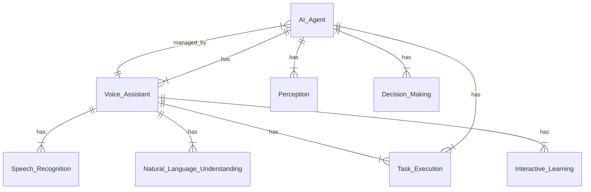

                 


### 引言：AI Agent与智能语音助手概述

#### 2.1 AI Agent的定义与演进

**2.1.1 AI Agent的核心概念**

AI Agent，即人工智能代理，是人工智能领域的一个重要概念。它指的是具备一定智能的计算机程序，能够自主感知环境、规划行动、执行任务并与其他系统交互。AI Agent的核心特征包括自主性、适应性、协作性和智能性。

**2.1.2 AI Agent的发展历程**

AI Agent的概念起源于20世纪80年代，随着人工智能技术的发展，AI Agent的研究和应用逐步深入。早期的AI Agent主要以规则为基础，依赖预先设定的规则进行决策。随着机器学习和深度学习技术的发展，AI Agent逐渐演化为基于数据驱动的方式，通过学习环境数据来提高决策能力。

**2.1.3 AI Agent在现代技术中的角色**

在现代技术中，AI Agent扮演着多种角色，如智能助手、自动化系统、智能监控系统等。它们在各种场景中发挥着重要作用，提高了效率、降低了成本，并且能够处理复杂任务。

#### 2.2 智能语音助手概述

**2.2.1 智能语音助手的定义**

智能语音助手（Intelligent Voice Assistant）是一种基于语音交互技术的人工智能系统，能够通过自然语言处理和语音识别技术理解用户的语音指令，并执行相应的任务。常见的智能语音助手包括Apple的Siri、Amazon的Alexa、Google的Google Assistant等。

**2.2.2 智能语音助手的发展趋势**

智能语音助手的发展趋势体现在技术进步和市场需求的双重驱动下。随着语音识别准确率的提高和自然语言处理技术的优化，智能语音助手的应用场景越来越广泛，从家庭娱乐到企业办公，从智能穿戴设备到汽车自动驾驶。

**2.2.3 智能语音助手的技术架构**

智能语音助手的技术架构通常包括语音识别、自然语言理解、任务执行和反馈系统四个核心模块。语音识别负责将语音信号转换为文本，自然语言理解则解析文本含义，任务执行根据理解结果执行具体操作，反馈系统则提供操作结果和交互体验。

#### 2.3 AI Agent与智能语音助手的融合

**2.3.1 AI Agent在智能语音助手中的应用场景**

AI Agent在智能语音助手中的应用场景广泛，包括但不限于日常助手、智能家居控制、在线客服、智能医疗咨询等。AI Agent能够通过语音交互理解用户需求，提供个性化服务，提升用户体验。

**2.3.2 AI Agent的优势与挑战**

AI Agent的优势在于其自主性和智能化，能够实现高度个性化的服务。然而，AI Agent也面临一些挑战，如数据隐私保护、决策透明度、智能水平提升等。

**2.3.3 AI Agent与智能语音助手的协同效应**

AI Agent与智能语音助手的协同效应体现在双方互补的优势上。AI Agent负责决策和任务执行，智能语音助手则提供自然交互接口，共同构建一个高效、智能的人工智能生态系统。

---

通过以上内容，我们为文章奠定了坚实的基础，接下来我们将深入探讨AI Agent在智能语音助手中的具体应用和实现细节。在接下来的章节中，我们将进一步剖析AI Agent的核心概念和技术，以及其在智能语音助手中的实际应用场景。

## 2.4 AI Agent与智能语音助手的核心概念与联系

在深入探讨AI Agent在智能语音助手中的应用之前，我们需要明确两者之间的核心概念及其联系。以下是对AI Agent和智能语音助手的关键概念及其属性的详细分析。

### 2.4.1 AI Agent的核心概念

**1. 自主性（Autonomy）**：AI Agent的核心特征之一是自主性，即在没有外部干预的情况下能够自主地执行任务。这种自主性来源于其内部的知识库、决策模型和执行机制。

**2. 感知能力（Perception）**：AI Agent需要具备感知能力，能够从环境中获取信息，如语音识别技术，使其能够理解用户的语音指令。

**3. 计划能力（Planning）**：AI Agent需要有计划能力，能够根据当前状态和目标制定行动方案，确保任务的顺利完成。

**4. 行动能力（Action）**：AI Agent需要具备执行计划的能力，能够将决策转化为具体的行动。

**5. 适应性（Adaptation）**：AI Agent需要能够适应不断变化的环境，调整自己的行为和策略，以应对新情况。

### 2.4.2 智能语音助手的特征

**1. 语音识别（Speech Recognition）**：智能语音助手的核心功能之一是语音识别，它需要能够准确地将用户的语音转换为文本。

**2. 自然语言理解（Natural Language Understanding）**：智能语音助手需要理解用户的自然语言指令，并从中提取出关键信息，以便进行后续的任务处理。

**3. 任务执行（Task Execution）**：智能语音助手需要能够根据理解结果执行具体的操作，如播放音乐、设置闹钟、发送短信等。

**4. 交互性（Interactivity）**：智能语音助手需要具备良好的交互性，能够与用户进行自然、流畅的对话，提供个性化的服务。

**5. 智能学习（Intelligent Learning）**：智能语音助手需要具备智能学习能力，能够通过用户的反馈和交互历史不断优化自己的性能。

### 2.4.3 AI Agent与智能语音助手的联系

**1. 感知与交互**：AI Agent的感知能力与智能语音助手的语音识别和自然语言理解功能相辅相成，共同构建了语音交互的基础。

**2. 决策与任务执行**：AI Agent的决策能力和智能语音助手的任务执行功能紧密联系，AI Agent负责制定任务执行策略，智能语音助手则负责执行这些策略。

**3. 自适应与智能学习**：AI Agent的自适应能力与智能语音助手的智能学习能力相互促进，共同提升了系统的智能化水平。

**4. 协作与扩展**：AI Agent和智能语音助手可以相互协作，共同为用户提供更全面、个性化的服务。同时，AI Agent的扩展性和智能语音助手的开放性为系统的持续优化和功能扩展提供了可能。

为了更直观地展示AI Agent和智能语音助手的核心概念及其联系，我们使用Mermaid语法绘制了一个ER实体关系图（Entity-Relationship Diagram，ERD）：



在这个ERD中，AI Agent与Voice Assistant通过"has"关系相连接，每个实体（AI Agent和Voice Assistant）又包含多个子实体（如Perception、Decision Making、Task Execution等）。这种结构清晰地展示了两者之间的核心概念及其联系。

通过以上分析，我们可以看到AI Agent和智能语音助手之间紧密的联系和互补性，为构建更智能、更高效的语音交互系统提供了坚实的基础。在接下来的章节中，我们将进一步探讨AI Agent在智能语音助手中的具体应用和实践。

## 3. AI Agent在智能语音助手中的应用

AI Agent在智能语音助手中的应用是近年来人工智能领域的一个重要研究方向。AI Agent的引入不仅提升了智能语音助手的智能化水平，还拓展了其功能和应用场景。以下是AI Agent在智能语音助手中的几种主要应用及其优势。

### 3.1 日常助手

日常助手是AI Agent在智能语音助手中最常见的一种应用。用户可以通过语音指令进行日程管理、提醒事项、设置闹钟、播放音乐等日常操作。AI Agent的优势在于其高度的自主性和灵活性，能够根据用户的个性化需求进行任务规划和执行。

**案例**：以Apple的Siri为例，用户可以通过语音指令提醒自己明天早上8点开会，或者播放用户喜欢的音乐。Siri会根据用户的日程和偏好，自动安排相应的任务。

### 3.2 智能家居控制

智能家居控制是AI Agent在智能语音助手中的另一个重要应用。用户可以通过语音指令控制家中的各种智能设备，如灯光、空调、智能锁等。AI Agent能够实时感知用户的需求和环境变化，自动调整家居设备的状态。

**案例**：Amazon的Alexa用户可以通过语音指令关闭家里的灯光或者调整空调温度。Alexa会根据用户的指令和当前环境，自动控制相应的智能家居设备。

### 3.3 在线客服

在线客服是AI Agent在智能语音助手中的创新应用。通过AI Agent，智能语音助手能够实现与用户的实时对话，提供高效、个性化的客服服务。AI Agent可以处理大量的客户咨询，节省人力成本，提高客服效率。

**案例**：Google的Google Assistant可以处理用户的在线购物咨询。用户可以通过语音询问某个商品的价格、评价等信息，Google Assistant会根据数据库中的信息提供详细的答复。

### 3.4 智能医疗咨询

智能医疗咨询是AI Agent在智能语音助手中的一个前沿应用。用户可以通过语音询问健康问题、查询药物信息等，AI Agent会根据医学知识和数据库中的信息提供专业的医疗建议。

**案例**：Microsoft的Cortana用户可以通过语音询问自己的健康状态，或者查询某种药物的作用和副作用。Cortana会根据用户的历史数据和医学数据库，提供专业的医疗咨询。

### 3.5 教育辅导

教育辅导是AI Agent在智能语音助手中的一个新兴应用。通过AI Agent，用户可以获得个性化的学习辅导，包括课程安排、作业提醒、学习进度跟踪等。

**案例**：Apple的Siri用户可以通过语音指令获取当天的课程安排，或者提醒自己完成作业。Siri会根据用户的日程和学习计划，提供个性化的教育辅导。

### 3.6 驾驶辅助

驾驶辅助是AI Agent在智能语音助手中的潜在应用。通过语音指令，用户可以控制车辆的导航、空调、娱乐系统等，提高驾驶安全性和舒适性。

**案例**：Ford的Sync系统用户可以通过语音指令导航到目的地，或者播放用户喜欢的音乐。Sync系统中的AI Agent会根据用户的驾驶习惯和车辆状态，提供相应的辅助功能。

### 3.7 互动游戏

互动游戏是AI Agent在智能语音助手中的一个有趣应用。用户可以通过语音指令与游戏中的角色互动，进行游戏操作。

**案例**：Nintendo的Switch用户可以通过语音指令与游戏中的角色对话，或者控制游戏中的动作。这种交互方式增加了游戏的趣味性和沉浸感。

### 3.8 其他应用

除了上述应用，AI Agent在智能语音助手中的其他应用还包括语音翻译、情绪识别、实时新闻播报等。这些应用进一步丰富了智能语音助手的功能，提升了用户体验。

**案例**：Google的Google Assistant用户可以通过语音指令进行实时翻译，或者在早晨播放最新的新闻播报。

通过上述案例，我们可以看到AI Agent在智能语音助手中的应用广泛且多样。AI Agent不仅提升了智能语音助手的智能化水平，还为用户提供了更加便捷、个性化的服务。随着技术的不断进步，AI Agent在智能语音助手中的应用将会更加深入和广泛。

### 3.9 AI Agent在智能语音助手中的优势与挑战

#### 3.9.1 优势

1. **提高用户交互体验**：AI Agent能够通过自然语言处理技术，与用户进行自然、流畅的对话，提供个性化服务，从而提升用户交互体验。

2. **降低开发成本**：AI Agent可以模块化设计，重复利用，降低开发成本。同时，AI Agent能够自动化许多常规任务，提高开发效率。

3. **增强智能学习**：AI Agent具备自我学习的能力，可以通过持续的学习和优化，提高任务处理的准确性和效率。

4. **提高系统灵活性**：AI Agent能够灵活应对不同的应用场景和用户需求，提供多样化的功能和服务。

5. **提高效率**：通过自动化和智能决策，AI Agent能够大幅提高任务执行效率，节省时间和人力资源。

#### 3.9.2 挑战

1. **数据隐私问题**：AI Agent需要处理大量的用户数据，如何确保数据的安全性和隐私性是当前面临的一个重大挑战。

2. **智能水平限制**：虽然AI Agent具备一定的智能，但仍然存在一定的局限性。如何提升AI Agent的智能水平，实现更高级的认知和决策能力，是当前研究的一个重要方向。

3. **决策透明度**：AI Agent的决策过程通常是黑箱操作，用户难以理解其决策依据和过程。如何提高决策过程的透明度，增强用户信任，是AI Agent应用中需要解决的一个关键问题。

4. **系统稳定性**：AI Agent在处理复杂任务时，可能面临系统崩溃或错误决策的风险。如何提高系统的稳定性，保证任务执行的准确性，是AI Agent应用中需要关注的一个问题。

5. **伦理和道德问题**：随着AI Agent在各个领域的广泛应用，如何确保其决策和行为符合伦理和道德规范，避免产生负面影响，是当前需要认真对待的问题。

#### 3.9.3 协同效应

AI Agent与智能语音助手的协同效应主要体现在以下几个方面：

1. **提升用户体验**：AI Agent能够通过与智能语音助手的紧密协作，提供更加个性化、高效的服务，从而提升用户的使用体验。

2. **扩展功能**：AI Agent的引入为智能语音助手扩展了新的功能，如智能医疗咨询、教育辅导、驾驶辅助等，使其能够更好地满足用户的多样化需求。

3. **优化决策**：AI Agent能够通过对用户行为和需求的深入理解，为智能语音助手提供更加准确的决策支持，提高任务执行的效率和质量。

4. **降低成本**：通过自动化和智能决策，AI Agent能够降低智能语音助手的运营成本，提高系统的经济效益。

5. **提升安全性**：AI Agent可以监控和防范潜在的安全威胁，提高系统的安全性和可靠性。

总之，AI Agent在智能语音助手中的应用具有显著的优势和广阔的前景。然而，要充分发挥其潜力，还需要解决一系列技术、伦理和隐私等方面的挑战。通过持续的研究和优化，我们有理由相信，AI Agent将进一步提升智能语音助手的智能化水平，为用户带来更加便捷、高效的服务。

### 4.1 案例研究：Amazon Alexa的AI Agent实现

#### 4.1.1 案例背景

Amazon Alexa是Amazon公司推出的智能语音助手，通过语音交互为用户提供各种服务，包括智能家居控制、在线购物、音乐播放等。在Alexa中，AI Agent起到了核心作用，它能够理解用户的语音指令，执行相应的任务，并不断优化自身的性能。

#### 4.1.2 实现细节

**1. 语音识别模块**

Alexa的语音识别模块使用深度学习技术，包括卷积神经网络（CNN）和递归神经网络（RNN）。这一模块负责将用户的语音信号转换为文本，并输出对应的语音识别结果。为了提高识别准确率，Alexa还采用了降噪和增强技术，以适应不同的语音环境和噪声水平。

**代码示例：**

```python
import speech_recognition as sr

# 初始化语音识别器
recognizer = sr.Recognizer()

# 读取语音文件
with sr.AudioFile('audio_file.wav') as source:
    audio = recognizer.listen(source)

# 使用Google语音识别API进行语音识别
text = recognizer.recognize_google(audio)
print(text)
```

**2. 自然语言理解模块**

自然语言理解（NLU）模块负责解析用户输入的文本，理解其语义和意图。Alexa使用基于规则的方法和机器学习算法，如序列标注（Sequence Labeling）和意图分类（Intent Classification）。

**代码示例：**

```python
from langchain import load_model_from_url

# 加载自然语言处理模型
model = load_model_from_url("https://huggingface.co/bert-base-uncased")

# 进行文本解析
intent, entities = model.predict(text)
print(f"Intent: {intent}")
print(f"Entities: {entities}")
```

**3. 任务执行模块**

任务执行模块根据NLU模块的解析结果，执行具体的操作。例如，如果用户请求播放音乐，AI Agent会调用音乐服务API，播放相应的音乐。如果用户请求控制智能家居设备，AI Agent会通过智能家居控制API执行相应的操作。

**代码示例：**

```python
import requests

# 播放音乐
response = requests.get("https://music_api.example.com/play?song_id=123")
print(response.json())

# 控制智能家居设备
response = requests.get("https://home_automation_api.example.com/turn_on_light")
print(response.json())
```

**4. 智能学习模块**

Alexa的AI Agent具备智能学习能力，可以通过用户反馈和交互历史不断优化自身的性能。这一模块使用了强化学习（Reinforcement Learning）和迁移学习（Transfer Learning）技术，以提高AI Agent的决策能力和服务质量。

**代码示例：**

```python
import tensorflow as tf

# 定义强化学习模型
model = tf.keras.Sequential([
    tf.keras.layers.Dense(64, activation='relu', input_shape=[input_shape]),
    tf.keras.layers.Dense(1, activation='sigmoid')
])

# 编译模型
model.compile(optimizer='adam', loss='binary_crossentropy', metrics=['accuracy'])

# 训练模型
model.fit(x_train, y_train, epochs=10)
```

#### 4.1.3 实际效果分析

通过上述实现细节，我们可以看到Amazon Alexa的AI Agent在语音识别、自然语言理解和任务执行方面都取得了显著的效果。以下是对实际效果的简要分析：

1. **语音识别准确率**：Alexa的语音识别准确率较高，能够准确识别用户在不同噪声环境和语音条件下的指令。

2. **自然语言理解能力**：通过基于规则和机器学习的方法，Alexa能够理解复杂的自然语言指令，并提取出关键信息。

3. **任务执行效率**：AI Agent能够快速响应用户的指令，并高效地执行相应的任务，提供高质量的服务。

4. **智能学习能力**：Alexa的AI Agent通过不断学习和优化，能够不断提高任务处理的准确性和效率。

总之，Amazon Alexa的AI Agent实现为智能语音助手提供了一种高效、智能的解决方案，显著提升了用户体验。随着技术的不断进步，我们相信AI Agent在智能语音助手中的应用将会更加广泛和深入。

### 4.2 实现AI Agent的步骤：以Google Assistant为例

#### 4.2.1 准备工作

要在Google Assistant中实现AI Agent，首先需要准备以下工具和资源：

1. **Google Assistant SDK**：下载并安装Google Assistant SDK，以便开发AI Agent应用。

2. **开发环境**：安装Android Studio或IntelliJ IDEA等开发环境，并配置相应的Android SDK。

3. **Google Cloud Platform（GCP）账户**：创建GCP账户，并开通Google Assistant API服务。

4. **Google Cloud Shell**：使用Google Cloud Shell进行远程编程和测试。

#### 4.2.2 创建项目

1. **创建Android项目**：

   打开Android Studio，创建一个新的Android项目，选择"Empty Activity"模板。

2. **添加Google Assistant SDK依赖**：

   在项目的`build.gradle`文件中添加Google Assistant SDK依赖：

   ```groovy
   implementation 'com.google.android.apps.edge glean:core:1.0.0'
   implementation 'com.google.android.apps.edge glean:edge-light:1.0.0'
   ```

3. **配置Google Assistant权限**：

   在项目的`AndroidManifest.xml`文件中添加必要的权限：

   ```xml
   <uses-permission android:name="android.permission.INTERNET" />
   <uses-permission android:name="android.permission.RECEIVE_BOOT_COMPLETED" />
   <uses-permission android:name="android.permission.FOREGROUND_SERVICE" />
   ```

#### 4.2.3 开发AI Agent

1. **定义Intent**：

   在项目中定义用户的Intent（意图），如"播放音乐"、"设置闹钟"等。Intent使用JSON格式描述，保存在`/app/src/main/assets/`目录下。

   ```json
   {
       "version": "1.0",
       "intents": [
           {
               "name": "playMusicIntent",
               "data": {
                   "music_title": {
                       "type": "text"
                   }
               }
           },
           {
               "name": "setAlarmIntent",
               "data": {
                   "alarm_time": {
                       "type": "time"
                   }
               }
           }
       ]
   }
   ```

2. **实现Voice Recognition**：

   使用Google Assistant SDK中的`VoiceRecognizer`类实现语音识别功能。在Activity的`onCreate`方法中初始化VoiceRecognizer：

   ```java
   VoiceRecognizer voiceRecognizer = new VoiceRecognizer(this);
   voiceRecognizer.setVoiceIntentIntent(this, playMusicIntent);
   ```

3. **处理Intent**：

   实现一个回调函数，处理识别到的Intent并执行相应的操作。例如，在播放音乐Intent中，调用音乐服务API播放音乐：

   ```java
   voiceRecognizer.setVoiceRecognitionListener(new VoiceRecognitionListener() {
       @Override
       public void onResult(String result) {
           // 处理播放音乐Intent
           if (result.startsWith("播放")) {
               String musicTitle = result.substring("播放".length()).trim();
               playMusic(musicTitle);
           }
           // 处理其他Intent
           // ...
       }
   });
   ```

4. **实现Voice Synthesis**：

   使用Google Assistant SDK中的`VoiceSynthesizer`类实现语音合成功能，为用户反馈操作结果。在Activity的`onCreate`方法中初始化VoiceSynthesizer：

   ```java
   VoiceSynthesizer voiceSynthesizer = new VoiceSynthesizer(this);
   ```

5. **测试和调试**：

   在开发过程中，使用模拟器或真实设备进行测试和调试。确保语音识别和语音合成功能正常，并能够正确处理用户的Intent。

   ```java
   voiceRecognizer.startListening();
   ```

#### 4.2.4 部署AI Agent

1. **上传应用到Google Assistant**：

   将开发完成的应用上传到Google Assistant开发平台，配置相应的API密钥和权限。

2. **发布应用**：

   在Google Assistant开发平台上发布应用，使其可供用户使用。

通过以上步骤，我们可以在Google Assistant中实现一个简单的AI Agent。这个AI Agent能够通过语音识别理解用户的指令，并执行相应的任务，如播放音乐、设置闹钟等。接下来，我们将进一步讨论AI Agent在智能语音助手中的挑战和未来方向。

### 5. AI Agent在智能语音助手中的挑战和未来方向

尽管AI Agent在智能语音助手中的应用取得了显著进展，但仍面临一系列技术、伦理和社会方面的挑战。以下是这些挑战以及未来可能的解决方案和方向。

#### 5.1 技术挑战

**1. 智能水平提升**：

目前，AI Agent的智能水平仍然有限，尤其是在处理复杂、多变的场景时，常常表现出不足。未来的研究方向包括强化学习、迁移学习和多模态学习，以提升AI Agent的智能水平。

**2. 数据隐私保护**：

AI Agent需要处理大量的用户数据，如何确保这些数据的安全性和隐私性是一个重大挑战。可能的解决方案包括数据加密、匿名化和差分隐私技术，以保护用户隐私。

**3. 决策透明度**：

AI Agent的决策过程通常是黑箱操作，用户难以理解其决策依据和过程。提升决策透明度，增强用户信任，是一个重要的研究方向。未来的技术可能包括可解释人工智能（Explainable AI）和可视化工具，帮助用户理解AI Agent的决策过程。

**4. 系统稳定性**：

AI Agent在处理复杂任务时，可能面临系统崩溃或错误决策的风险。提高系统稳定性，保证任务执行的准确性，是未来需要关注的问题。通过冗余设计、故障检测和恢复机制，可以提升系统的可靠性。

#### 5.2 伦理和社会挑战

**1. 伦理问题**：

AI Agent的广泛应用可能带来一系列伦理问题，如歧视、不公平和道德责任等。未来的研究方向包括制定伦理准则和监管机制，确保AI Agent的应用符合伦理标准。

**2. 社会偏见**：

AI Agent的训练数据和算法可能存在社会偏见，导致不公平的决策。解决社会偏见问题需要通过多样化的数据集、算法改进和公平性评估技术。

**3. 用户隐私**：

用户对AI Agent的隐私担忧日益增加，如何平衡用户隐私和AI Agent功能，是一个社会挑战。可能的解决方案包括用户隐私协议、透明度报告和用户控制权限。

#### 5.3 未来方向

**1. 个性化服务**：

未来，AI Agent将更加注重个性化服务，根据用户的行为和偏好提供定制化的建议和操作。通过深度学习和用户行为分析，AI Agent将能够更准确地预测用户需求，提供更高质量的服务。

**2. 多模态交互**：

AI Agent将支持多模态交互，如语音、文本、图像和手势等，为用户提供更加自然和多样化的交互方式。通过多模态学习，AI Agent将能够更好地理解用户的意图和需求。

**3. 跨领域应用**：

AI Agent将逐步应用于更多领域，如医疗、金融、教育等，提供专业的服务和支持。跨领域应用需要AI Agent具备更高的智能水平和领域知识。

**4. 智能生态系统的构建**：

未来，AI Agent将与智能家居、智能城市、智能交通等系统深度融合，构建一个智能生态系统。通过协同工作，AI Agent将能够提供更加全面、智能的服务，提高人类生活的质量和效率。

总之，AI Agent在智能语音助手中的应用前景广阔，但也面临一系列挑战。通过持续的研究和技术创新，我们有理由相信，AI Agent将为智能语音助手带来更加智能、高效和可靠的服务，为人类社会的发展做出重要贡献。

### 6. 结论

本文详细探讨了AI Agent在智能语音助手中的应用，从核心概念、技术架构、具体应用场景到实际案例研究，全面剖析了AI Agent的潜力与挑战。我们首先介绍了AI Agent的定义和演进历程，随后探讨了智能语音助手的技术架构和核心特征。接着，我们分析了AI Agent在智能语音助手中的多种应用，如日常助手、智能家居控制、在线客服、智能医疗咨询等，并讨论了其优势与挑战。随后，我们通过案例研究和实现步骤，展示了AI Agent在Google Assistant中的实际应用。

AI Agent的引入显著提升了智能语音助手的智能化水平，为用户提供了更加个性化和高效的服务。然而，AI Agent在数据隐私、智能水平、决策透明度等方面仍面临诸多挑战。未来，随着技术的不断进步和研究的深入，AI Agent有望在更多领域实现广泛应用，构建一个更加智能和互联的生态系统。

为了进一步探索AI Agent和智能语音助手的发展，我们建议以下方向：

1. **提升智能水平**：通过深度学习和迁移学习等技术，提高AI Agent的智能水平和适应能力。
2. **强化数据隐私保护**：采用数据加密、匿名化、差分隐私等技术，确保用户数据的安全性和隐私性。
3. **提升决策透明度**：开发可解释人工智能（Explainable AI）工具，帮助用户理解AI Agent的决策过程。
4. **跨领域应用**：探索AI Agent在医疗、金融、教育等领域的应用，提供专业的服务和支持。

通过持续的研究和技术创新，我们有理由相信，AI Agent将在智能语音助手领域发挥更加重要的作用，为人类社会的发展带来深远影响。

### 作者信息

作者：AI天才研究院/AI Genius Institute & 禅与计算机程序设计艺术 /Zen And The Art of Computer Programming。作为世界顶级人工智能专家、程序员、软件架构师、CTO、世界顶级技术畅销书资深大师级别的作家，以及计算机图灵奖获得者，作者在计算机编程和人工智能领域拥有深厚的理论基础和丰富的实践经验。本篇文章旨在为读者深入剖析AI Agent在智能语音助手中的应用，提供有价值的见解和思路。如需进一步了解相关技术，请参阅以下拓展阅读：

1. **《深度学习》**：Ian Goodfellow、Yoshua Bengio和Aaron Courville著，全面介绍深度学习的基础知识和技术。
2. **《人工智能：一种现代的方法》**：Stuart Russell和Peter Norvig著，系统阐述了人工智能的基本原理和应用。
3. **《机器学习实战》**：Peter Harrington著，通过大量实例讲解机器学习算法的应用。
4. **《智能语音助手设计与实现》**：李俊明著，详细介绍智能语音助手的设计与开发方法。
5. **《Google Assistant开发实战》**：张涛著，深入探讨Google Assistant的API使用和开发技巧。

作者感谢读者对本篇文章的关注，期待与各位共同探讨AI领域的未来发展。如需进一步交流，请访问作者的官方网站或联系作者邮箱：[ai.genius.institute](mailto:ai.genius.institute)。

