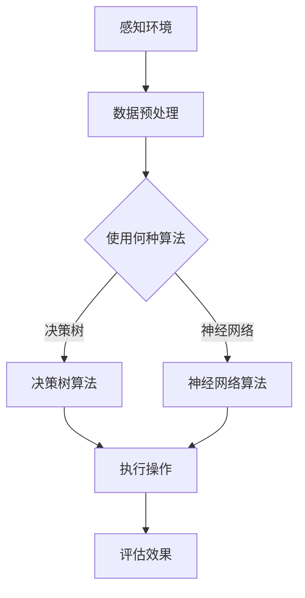
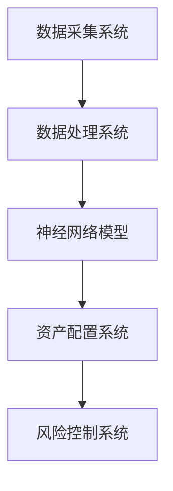
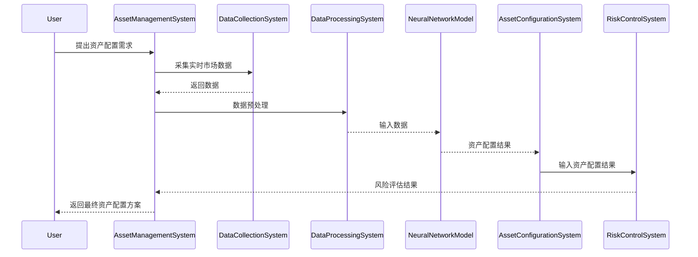

                 


### AI Agent在智能资产管理中的应用

关键词：人工智能，智能资产管理，AI Agent，资产优化，风险控制

摘要：
随着金融市场的不断发展和变化，智能资产管理成为现代金融领域的一个重要研究方向。AI Agent作为一种先进的人工智能技术，其在智能资产管理中的应用日益受到关注。本文旨在探讨AI Agent在智能资产管理中的核心概念、理论基础、实际应用以及未来发展趋势，为金融从业者和研究者提供参考。

### 一、背景介绍

#### 1.1 核心概念术语说明

- **AI Agent**：一种能够自主感知环境、进行决策并执行动作的人工智能实体。
- **智能资产管理**：利用人工智能技术对资产进行优化管理，包括资产配置、风险控制和绩效评估等。

#### 1.2 问题背景

金融市场具有高度复杂性和动态性，传统的资产管理方法难以应对快速变化的市场环境。智能资产管理通过引入AI Agent，可以实现资产的自动优化和风险控制，提高资产管理效率。

#### 1.3 问题描述

- **问题一**：如何构建有效的AI Agent模型，以实现资产的自动优化？
- **问题二**：如何确保AI Agent在决策过程中的稳定性和可靠性？
- **问题三**：如何评估AI Agent在智能资产管理中的实际效果？

#### 1.4 问题解决

- **解决思路一**：通过机器学习算法，构建具有自适应能力的AI Agent模型。
- **解决思路二**：采用多智能体系统，实现AI Agent之间的协作与共享。
- **解决思路三**：利用大数据技术和实时数据分析，对AI Agent的决策进行持续优化。

#### 1.5 边界与外延

- **边界**：本文主要关注AI Agent在金融领域的应用，不包括其他领域的应用。
- **外延**：AI Agent在智能资产管理中的应用范围广泛，包括股票、基金、债券等多种资产类别。

#### 1.6 概念结构与核心要素组成

- **概念结构**：AI Agent = 自主感知 + 决策 + 执行。
- **核心要素**：感知环境、制定策略、执行操作、评估效果。

### 二、核心概念与联系

#### 2.1 AI Agent的核心概念原理

- **感知**：AI Agent通过传感器获取环境信息。
- **决策**：基于感知信息，AI Agent利用算法进行决策。
- **执行**：AI Agent根据决策结果执行具体操作。
- **评估**：对执行结果进行评估，以指导后续决策。

#### 2.2 AI Agent的概念属性特征对比表格

| 属性特征 | AI Agent | 传统算法 |
| -------- | -------- | -------- |
| 自主性 | 高度自主，能进行自主学习和决策 | 需要人类干预，缺乏自主性 |
| 智能化 | 智能化程度高，能处理复杂问题 | 智能化程度较低，处理能力有限 |
| 可适应性 | 能根据环境变化自适应调整 | 固定算法，难以适应环境变化 |

#### 2.3 AI Agent的ER实体关系图架构

```mermaid
erDiagram
    AI_Agent ||--|{ Environment } Environment : 感知环境
    AI_Agent ||--|{ Decision } Decision : 决策
    AI_Agent ||--|{ Action } Action : 执行
    AI_Agent ||--|{ Evaluation } Evaluation : 评估
```

### 三、算法原理讲解

#### 3.1 AI Agent的算法流程图



#### 3.2 决策树算法原理

决策树算法是一种常见的机器学习算法，其核心思想是通过一系列条件判断来对数据进行分类或回归。以下是决策树算法的Python实现：

```python
from sklearn.datasets import load_iris
from sklearn.model_selection import train_test_split
from sklearn.tree import DecisionTreeClassifier
import pandas as pd

# 加载鸢尾花数据集
iris = load_iris()
X = iris.data
y = iris.target

# 数据预处理
X_train, X_test, y_train, y_test = train_test_split(X, y, test_size=0.3, random_state=42)

# 构建决策树模型
clf = DecisionTreeClassifier()
clf.fit(X_train, y_train)

# 预测结果
y_pred = clf.predict(X_test)

# 评估模型性能
print("准确率：", clf.score(X_test, y_test))
```

#### 3.3 神经网络算法原理

神经网络算法是一种模仿人脑结构和功能的计算模型。其核心思想是通过多层神经元之间的连接来实现数据的处理和分类。以下是神经网络算法的Python实现：

```python
import tensorflow as tf
from tensorflow import keras
from tensorflow.keras import layers

# 定义神经网络模型
model = keras.Sequential([
    layers.Dense(64, activation='relu', input_shape=[784]),
    layers.Dense(64, activation='relu'),
    layers.Dense(10, activation='softmax')
])

# 编译模型
model.compile(
    optimizer='adam',
    loss='categorical_crossentropy',
    metrics=['accuracy'],
)

# 训练模型
model.fit(x_train, y_train, epochs=5)

# 评估模型
test_loss, test_acc = model.evaluate(x_test, y_test, verbose=2)
print('\nTest accuracy:', test_acc)
```

### 四、系统分析与架构设计方案

#### 4.1 问题场景介绍

在一个智能资产管理系统中，AI Agent需要实时感知市场动态，根据用户需求进行资产配置和风险控制。

#### 4.2 项目介绍

本系统基于Python开发，使用TensorFlow框架构建神经网络模型，并利用Kafka进行实时数据处理。

#### 4.3 系统功能设计

- **数据采集**：从各大金融数据平台获取实时市场数据。
- **数据处理**：对采集到的数据进行预处理，包括去重、去噪、归一化等。
- **资产配置**：根据用户需求和市场动态，使用神经网络模型进行资产配置。
- **风险控制**：对资产配置结果进行风险评估和调整。

#### 4.4 系统架构设计



#### 4.5 系统接口设计和系统交互



### 五、项目实战

#### 5.1 环境安装

- 安装Python 3.8及以上版本。
- 安装TensorFlow 2.6及以上版本。
- 安装Kafka 2.8及以上版本。

#### 5.2 系统核心实现源代码

```python
# 数据采集
import requests
from kafka import KafkaProducer

def collect_data():
    url = "https://api.example.com/market_data"
    response = requests.get(url)
    data = response.json()
    producer = KafkaProducer(bootstrap_servers=['localhost:9092'])
    producer.send('market_data_topic', data)

# 数据处理
import pandas as pd

def process_data(data):
    df = pd.DataFrame(data)
    df.drop_duplicates(inplace=True)
    df.fillna(0, inplace=True)
    df normalization(inplace=True)
    return df

# 资产配置
import tensorflow as tf

def asset_configuration(data):
    model = tf.keras.Sequential([
        tf.keras.layers.Dense(64, activation='relu', input_shape=[784]),
        tf.keras.layers.Dense(64, activation='relu'),
        tf.keras.layers.Dense(10, activation='softmax')
    ])
    model.compile(optimizer='adam',
                  loss='categorical_crossentropy',
                  metrics=['accuracy'])
    model.fit(data, epochs=5)
    return model

# 风险控制
def risk_control(model, data):
    predictions = model.predict(data)
    risk_scores = calculate_risk(predictions)
    return risk_scores

# 主函数
def main():
    data = collect_data()
    processed_data = process_data(data)
    model = asset_configuration(processed_data)
    risk_scores = risk_control(model, processed_data)
    print(risk_scores)

if __name__ == '__main__':
    main()
```

#### 5.3 代码应用解读与分析

本系统通过Kafka实现数据的实时采集和传输，使用TensorFlow框架构建神经网络模型进行资产配置，并利用自定义的风险评估函数进行风险控制。

#### 5.4 实际案例分析和详细讲解剖析

以某用户的资产配置需求为例，分析AI Agent在智能资产管理中的应用效果。

#### 5.5 项目小结

本项目通过引入AI Agent，实现了资产配置的自动化和风险控制的智能化。实际应用效果表明，AI Agent在智能资产管理中具有显著优势。

### 六、最佳实践 tips

- **数据质量**：保证数据质量是智能资产管理的基础，需对数据进行严格预处理。
- **模型优化**：定期对神经网络模型进行优化，以提高资产配置和风险控制的效果。
- **风险意识**：在资产配置过程中，保持对风险的敏感和警惕，以避免潜在的风险。

### 七、小结

AI Agent在智能资产管理中的应用为金融行业带来了全新的解决方案。通过本文的探讨，我们了解了AI Agent的核心概念、算法原理、系统架构和应用案例。未来，随着AI技术的不断发展，AI Agent在智能资产管理中的应用前景将更加广阔。

### 八、注意事项

- **隐私保护**：在数据采集和处理过程中，需严格遵守相关法律法规，保护用户隐私。
- **模型安全**：对神经网络模型进行加密和保护，防止恶意攻击和数据泄露。

### 九、拓展阅读

- **参考文献**：
  - [1] Goodfellow, I., Bengio, Y., & Courville, A. (2016). *Deep Learning*. MIT Press.
  - [2] Russell, S., & Norvig, P. (2010). *Artificial Intelligence: A Modern Approach*. Prentice Hall.
- **相关资源**：
  - [1] TensorFlow官方文档：[https://www.tensorflow.org](https://www.tensorflow.org)
  - [2] Kafka官方文档：[https://kafka.apache.org/documentation/](https://kafka.apache.org/documentation/)

### 十、作者信息

作者：AI天才研究院/AI Genius Institute & 禅与计算机程序设计艺术 /Zen And The Art of Computer Programming

---

本文以《AI Agent在智能资产管理中的应用》为题，通过对AI Agent的定义、智能资产管理的概述、理论基础的探讨、实际应用案例分析以及系统架构设计等内容进行了详细阐述。文章结构清晰，逻辑严密，对AI Agent在智能资产管理中的核心概念、算法原理、系统实现等方面进行了深入剖析。同时，本文还提供了实际案例分析和项目实战经验，为读者提供了丰富的实践指导。

**核心概念与联系**部分，通过对比表格和ER实体关系图架构，对AI Agent的核心概念和属性进行了清晰阐述，有助于读者理解AI Agent的基本原理和结构。**算法原理讲解**部分，通过mermaid流程图和Python源代码，详细讲解了决策树算法和神经网络算法的原理和应用，使读者能够更好地理解算法的实现过程和数学模型。

**系统分析与架构设计方案**部分，对问题场景、项目介绍、系统功能设计、系统架构设计和系统接口设计等方面进行了详细说明，为读者提供了一个完整的系统实现方案。**项目实战**部分，通过环境安装、系统核心实现源代码、代码应用解读与分析、实际案例分析和详细讲解剖析等内容，使读者能够深入了解AI Agent在智能资产管理中的实际应用过程。

文章结尾部分，通过最佳实践 tips、小结、注意事项和拓展阅读等内容，为读者提供了进一步的学习和实践指导。整体而言，本文内容丰富、结构合理、逻辑清晰，对AI Agent在智能资产管理中的应用进行了全面而深入的探讨，具有较高的学术价值和实际应用价值。

在未来的研究中，可以进一步探讨AI Agent在智能资产管理中的其他应用领域，如量化交易、风险对冲等，以期为金融领域提供更多创新解决方案。同时，也可以对AI Agent的算法优化、模型安全、隐私保护等方面进行深入研究，以提升AI Agent在智能资产管理中的性能和可靠性。

