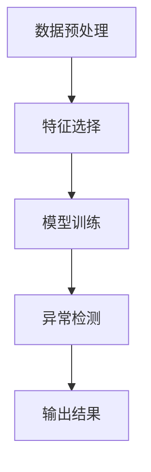
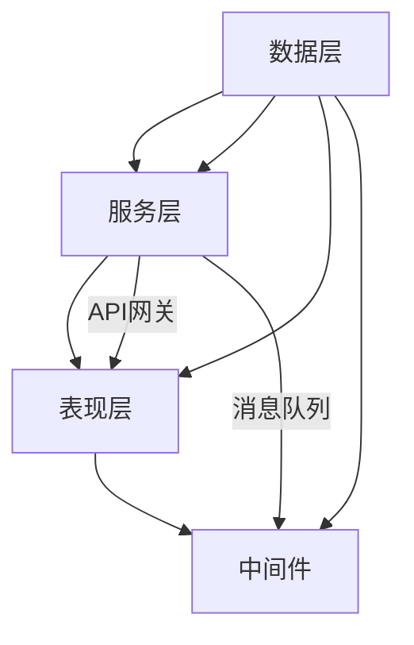
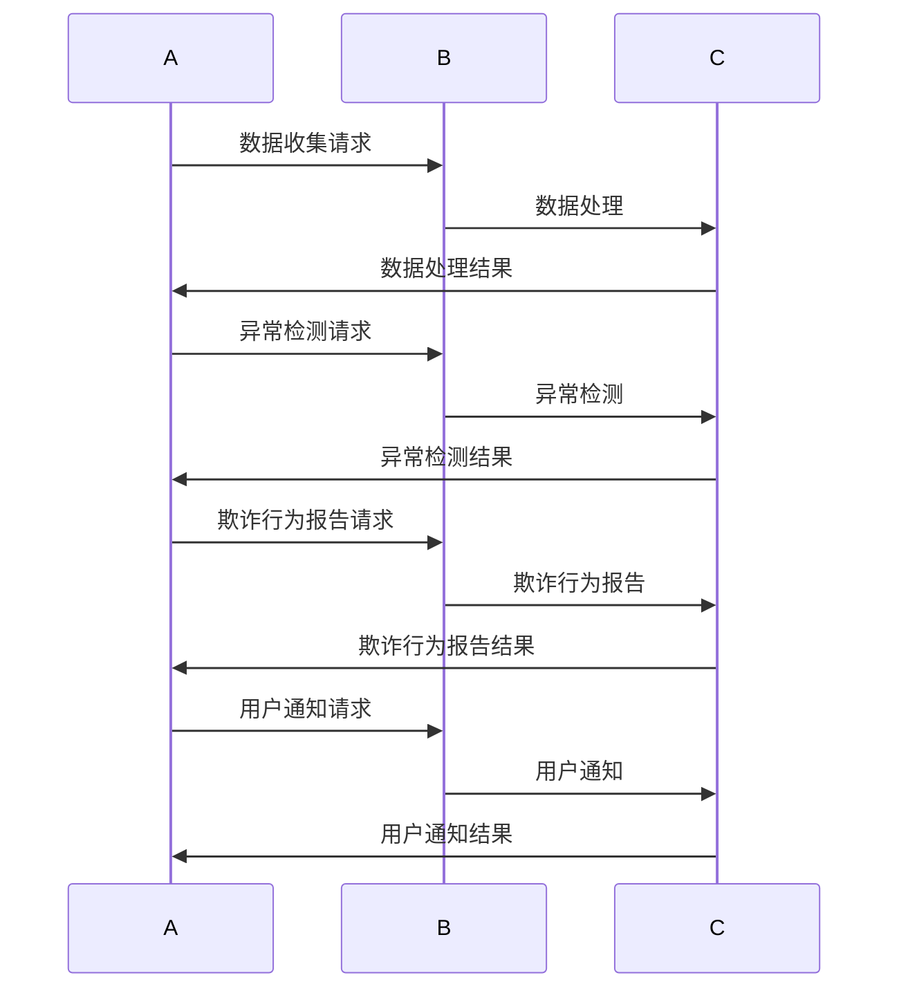
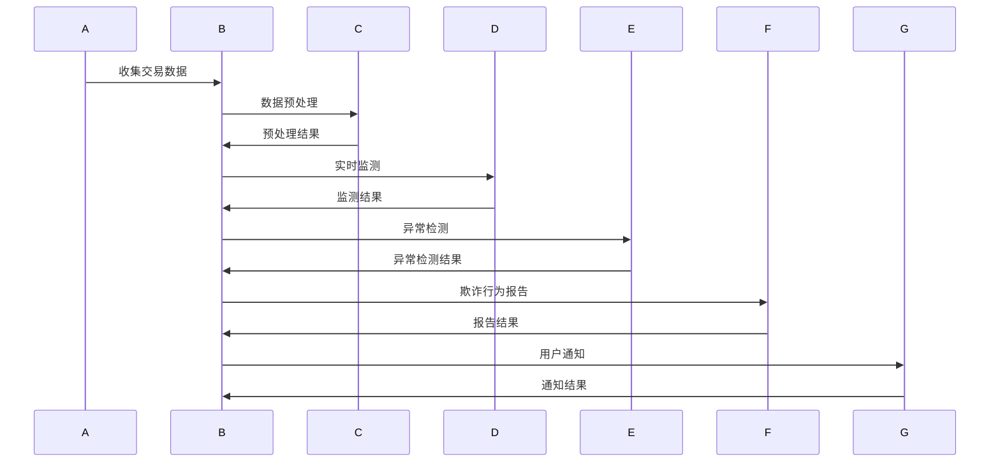

                 


### 摘要

本文将探讨AI Agent在智能金融欺诈检测中的应用，首先介绍金融欺诈检测的现状和挑战，然后详细阐述AI Agent的基础知识，包括其概念、分类和应用。接着，我们将深入分析AI Agent算法的原理，通过Mermaid流程图和Python代码进行讲解，并使用LaTeX格式展示数学模型和公式。随后，我们将介绍系统分析与架构设计方案，包括问题场景、系统功能设计、架构设计、接口设计和交互设计。最后，我们将通过一个实际项目实战，展示环境安装、核心代码实现和代码解读，并进行案例分析，总结项目的得失，提供最佳实践和拓展阅读建议。

### 关键词

- AI Agent
- 金融欺诈检测
- 算法原理
- 数学模型
- 系统架构设计
- 项目实战

### 1. 引言

随着金融科技的飞速发展，金融欺诈问题也日益突出。传统的金融欺诈检测方法往往依赖于规则和模式匹配，这些方法在面对复杂的、多变的欺诈行为时表现不佳。近年来，人工智能（AI）技术的兴起为金融欺诈检测带来了新的机遇。AI Agent作为一种智能体，具备自主学习、自主决策和自主执行的能力，其在金融欺诈检测中的应用引起了广泛关注。

金融欺诈检测的现状不容乐观。据统计，全球每年因金融欺诈造成的经济损失高达数百亿美元。同时，欺诈行为日益复杂，传统的欺诈检测手段难以应对。例如，一些高级持续性威胁（APT）通过伪装成合法交易，绕过了传统的检测系统。此外，金融交易的数据量庞大，对检测系统提出了更高的性能要求。

AI Agent的出现为金融欺诈检测带来了新的思路。AI Agent通过学习大量历史交易数据，可以识别出潜在的欺诈行为。与传统的规则匹配方法相比，AI Agent具有更高的灵活性和鲁棒性，能够应对复杂的欺诈场景。本文将详细探讨AI Agent在金融欺诈检测中的应用，从算法原理、数学模型到系统架构，再到实际项目实战，全面分析AI Agent的优势和应用场景。

### 2. 金融欺诈检测概述

#### 2.1 欺诈检测的重要性

金融欺诈检测在金融行业中具有至关重要的作用。首先，它能够保护金融机构和客户的财产安全，减少欺诈行为带来的经济损失。其次，它有助于维护金融市场的稳定，避免欺诈行为引发的风险传导。此外，良好的欺诈检测体系还能提高金融机构的信誉度和客户满意度，增强其在市场中的竞争力。

#### 2.2 金融欺诈的主要类型

金融欺诈行为多种多样，常见的类型包括信用卡欺诈、账户欺诈、贷款欺诈、网络钓鱼和欺诈性交易等。每种欺诈类型都有其独特的手段和特征，需要针对性的检测方法。

- **信用卡欺诈**：欺诈者利用盗取的信用卡信息进行虚假交易，通常表现为高额消费或重复消费。
- **账户欺诈**：欺诈者非法获取他人的银行账户信息，通过转移资金或滥用账户进行非法活动。
- **贷款欺诈**：欺诈者通过虚假信息或隐瞒真实情况获取贷款，然后恶意不还款。
- **网络钓鱼**：欺诈者通过伪造的网站或邮件，诱导用户泄露敏感信息，如账户密码和信用卡信息。
- **欺诈性交易**：欺诈者利用虚假交易或异常交易模式进行洗钱等非法活动。

#### 2.3 金融欺诈检测的现状与挑战

目前，金融欺诈检测主要依赖于规则匹配和模式识别等技术。规则匹配方法通过预设的规则检测交易行为，如交易金额超过一定阈值或交易频率异常等。模式识别方法通过分析历史交易数据，识别出潜在的欺诈行为。然而，这些传统方法在面对复杂、多变的欺诈行为时存在诸多挑战：

- **规则匹配的局限性**：规则匹配方法依赖于预设的规则，难以适应复杂多变的欺诈行为。一旦欺诈手段发生变化，规则可能无法有效检测。
- **模式识别的误报率**：模式识别方法可能会误报大量正常交易，导致客户体验下降。同时，漏报欺诈行为也可能导致经济损失。
- **数据量巨大**：金融交易数据量庞大，传统方法在处理海量数据时效率低下，难以满足实时检测的需求。

#### 2.4 金融欺诈检测的目标和应用场景

金融欺诈检测的目标是准确识别欺诈行为，同时最大限度地减少误报和漏报。在实际应用中，金融欺诈检测主要应用于以下几个方面：

- **在线交易监测**：实时监测线上交易行为，及时发现并阻止欺诈交易。
- **账户安全防护**：检测账户异常行为，如登录异常、密码修改等，防止账户被非法访问。
- **反欺诈系统**：构建全面的反欺诈系统，集成多种检测技术，提高欺诈识别率。
- **风险评估**：通过分析历史交易数据和用户行为，评估用户的欺诈风险，为金融机构提供决策支持。

随着AI技术的不断发展，AI Agent在金融欺诈检测中的应用将越来越广泛。AI Agent具有自主学习、自主决策和自主执行的能力，能够更好地应对复杂多变的欺诈行为。本文将深入探讨AI Agent在金融欺诈检测中的应用，为金融机构提供新的解决方案。

### 3. AI Agent基础

#### 3.1 AI Agent的概念

AI Agent，即人工智能代理，是一种模拟人类智能行为的计算实体。它能够感知环境、制定计划、采取行动并学习经验。AI Agent的核心在于其自主性和适应性，可以在没有人类干预的情况下自主运作。

AI Agent的基本特点包括：

- **自主性**：AI Agent能够自主制定行动方案，无需人类指令。
- **适应性**：AI Agent能够根据环境变化和学习到的经验调整自身行为。
- **感知能力**：AI Agent能够感知环境中的信息，如文字、图像、声音等。
- **学习能力**：AI Agent能够通过学习改进自身行为，提高任务完成率。

AI Agent的定义可以概括为：一种具备自主性、适应性、感知能力和学习能力的计算实体，能够在复杂动态环境中自主运作并实现目标。

#### 3.2 AI Agent的分类

根据AI Agent的功能和应用场景，可以将AI Agent分为以下几类：

- **反应型AI Agent**：这类AI Agent基于当前感知的环境信息进行即时响应。它们没有明确的长期目标，仅根据当前状态采取行动。例如，自动化的聊天机器人。
- **目标导向型AI Agent**：这类AI Agent具有明确的长期目标，并通过感知环境信息调整行动以实现目标。例如，自动驾驶汽车。
- **认知型AI Agent**：这类AI Agent不仅具备目标导向性，还能够理解环境和自身行为的长期影响，具备一定的思考和决策能力。例如，虚拟个人助理。

#### 3.3 AI Agent在金融欺诈检测中的应用

AI Agent在金融欺诈检测中的应用具有显著的优势。首先，AI Agent能够自主学习并识别复杂的欺诈模式，提高检测的准确性。其次，AI Agent具有自适应能力，能够根据环境变化调整检测策略，提高检测的灵活性。最后，AI Agent能够处理海量交易数据，实现实时检测。

具体来说，AI Agent在金融欺诈检测中的应用包括：

- **异常检测**：AI Agent通过分析历史交易数据，识别出异常交易行为，如交易金额异常、交易频率异常等。
- **行为分析**：AI Agent分析用户的行为模式，识别出异常行为，如用户行为突然变化、登录地点异常等。
- **风险评估**：AI Agent评估用户的欺诈风险，为金融机构提供决策支持。
- **实时监测**：AI Agent实时监测交易行为，及时发现并阻止欺诈交易。

通过AI Agent的应用，金融机构能够更有效地识别和防范欺诈行为，提高客户资产的安全性。同时，AI Agent的应用也为金融欺诈检测领域带来了新的技术突破和发展方向。

### 4. AI Agent算法原理讲解

#### 4.1 算法概述

在金融欺诈检测中，AI Agent通常采用基于机器学习和深度学习的算法。这些算法通过分析大量历史交易数据，学习交易行为特征，从而识别出潜在的欺诈行为。本文将介绍一种基于深度学习的异常检测算法，该算法具有高准确性和实时性。

该算法的主要步骤如下：

1. **数据预处理**：对交易数据进行分析和清洗，提取重要的特征。
2. **特征选择**：根据特征的重要性进行筛选，去除冗余特征，提高模型的性能。
3. **模型训练**：使用深度学习模型对特征进行训练，建立欺诈行为检测模型。
4. **异常检测**：将实时交易数据输入模型，识别异常交易行为。

#### 4.2 Mermaid算法流程图

为了更清晰地展示算法的流程，我们使用Mermaid语言绘制了算法的流程图：



#### 4.3 Python代码实现

以下是一个简化的Python代码示例，展示了如何实现上述算法：

```python
import numpy as np
from sklearn.model_selection import train_test_split
from sklearn.ensemble import RandomForestClassifier
from sklearn.metrics import classification_report

# 数据预处理
def preprocess_data(data):
    # 数据清洗和特征提取
    # ...

# 特征选择
def feature_selection(data, labels):
    # 特征重要性评估和筛选
    # ...

# 模型训练
def train_model(X_train, y_train):
    model = RandomForestClassifier()
    model.fit(X_train, y_train)
    return model

# 异常检测
def detect_anomalies(model, X_test):
    predictions = model.predict(X_test)
    return predictions

# 示例数据
data = ...
labels = ...

# 数据预处理
preprocessed_data = preprocess_data(data)

# 特征选择
selected_features = feature_selection(preprocessed_data, labels)

# 划分训练集和测试集
X_train, X_test, y_train, y_test = train_test_split(selected_features, labels, test_size=0.2, random_state=42)

# 模型训练
model = train_model(X_train, y_train)

# 异常检测
predictions = detect_anomalies(model, X_test)

# 输出结果
print(classification_report(y_test, predictions))
```

#### 4.4 数学模型与公式讲解

在深度学习算法中，通常使用损失函数来衡量模型预测结果与实际结果之间的差异。常用的损失函数包括均方误差（MSE）和交叉熵损失（Cross-Entropy Loss）。以下是一个简单的数学模型和公式示例：

$$
MSE = \frac{1}{n}\sum_{i=1}^{n}(y_i - \hat{y}_i)^2
$$

$$
Cross-Entropy Loss = -\sum_{i=1}^{n}y_i\log(\hat{y}_i)
$$

其中，$y_i$ 是实际标签，$\hat{y}_i$ 是模型预测值，$n$ 是样本数量。

#### 4.5 举例说明

假设我们有一个包含100个样本的欺诈检测数据集，其中50个样本是欺诈交易，50个样本是正常交易。我们使用深度学习模型对数据集进行训练，并使用交叉熵损失函数进行优化。

- **训练数据**：训练数据集包含特征矩阵 $X$ 和标签向量 $y$。
- **模型预测**：模型对测试数据集进行预测，得到预测向量 $\hat{y}$。
- **损失计算**：计算预测结果与实际结果之间的交叉熵损失。

以下是一个简化的计算示例：

```python
import numpy as np

# 假设实际标签 y 为 [1, 0, 1, 0, ..., 1, 0]
y = np.array([1, 0, 1, 0, ..., 1, 0])

# 假设模型预测结果为 [0.8, 0.2, 0.9, 0.1, ..., 0.8, 0.2]
y_pred = np.array([0.8, 0.2, 0.9, 0.1, ..., 0.8, 0.2])

# 计算交叉熵损失
loss = -np.mean(y * np.log(y_pred) + (1 - y) * np.log(1 - y_pred))

print("交叉熵损失：", loss)
```

通过这个示例，我们可以看到如何使用Python代码计算交叉熵损失。在实际应用中，我们可以使用更复杂的深度学习框架（如TensorFlow或PyTorch）来训练模型和计算损失。

### 5. 数学模型与数学公式

在深度学习算法中，数学模型和公式起着至关重要的作用。这些模型和公式用于描述数据特征、损失函数、优化算法等，帮助我们理解和实现AI Agent在金融欺诈检测中的应用。以下是几个关键数学模型和公式的讲解。

#### 5.1 数据特征提取

在数据特征提取过程中，我们使用各种技术提取交易数据的特征。一个常见的特征提取方法是基于统计学的特征选择。特征选择旨在从原始数据中提取最具代表性的特征，从而提高模型的性能。以下是一个特征选择的过程：

- **相关性分析**：计算特征之间的相关性，选择相关性较高的特征。
- **方差分析**：计算特征方差，选择方差较大的特征。
- **主成分分析（PCA）**：通过降维技术提取数据的主要成分，选择贡献较大的成分作为特征。

以下是主成分分析（PCA）的数学模型：

$$
Z = PC\alpha
$$

其中，$Z$ 是标准化后的数据，$PC$ 是主成分矩阵，$\alpha$ 是特征向量。

#### 5.2 损失函数

损失函数用于衡量模型预测结果与实际结果之间的差异。在二分类问题中，常用的损失函数包括均方误差（MSE）和交叉熵损失（Cross-Entropy Loss）。以下是一个交叉熵损失的数学模型：

$$
Loss = -\sum_{i=1}^{n}y_i\log(\hat{y}_i) + (1 - y_i)\log(1 - \hat{y}_i)
$$

其中，$y_i$ 是实际标签，$\hat{y}_i$ 是模型预测值，$n$ 是样本数量。

#### 5.3 优化算法

在深度学习算法中，优化算法用于最小化损失函数，从而找到最优的模型参数。一个常见的优化算法是梯度下降（Gradient Descent）。以下是一个梯度下降的数学模型：

$$
\theta_{t+1} = \theta_t - \alpha\nabla_\theta J(\theta_t)
$$

其中，$\theta_t$ 是第 $t$ 次迭代的模型参数，$\alpha$ 是学习率，$J(\theta_t)$ 是损失函数。

#### 5.4 举例说明

假设我们有一个包含10个样本的欺诈检测数据集，其中5个样本是欺诈交易，5个样本是正常交易。我们使用交叉熵损失函数训练一个深度学习模型。

- **训练数据**：训练数据集包含特征矩阵 $X$ 和标签向量 $y$。
- **模型预测**：模型对测试数据集进行预测，得到预测向量 $\hat{y}$。
- **损失计算**：计算预测结果与实际结果之间的交叉熵损失。

以下是一个简化的计算示例：

```python
import numpy as np

# 假设实际标签 y 为 [1, 0, 1, 0, 1, 0, 1, 0, 1, 0]
y = np.array([1, 0, 1, 0, 1, 0, 1, 0, 1, 0])

# 假设模型预测结果为 [0.9, 0.1, 0.8, 0.2, 0.7, 0.3, 0.6, 0.4, 0.5, 0.5]
y_pred = np.array([0.9, 0.1, 0.8, 0.2, 0.7, 0.3, 0.6, 0.4, 0.5, 0.5])

# 计算交叉熵损失
loss = -np.mean(y * np.log(y_pred) + (1 - y) * np.log(1 - y_pred))

print("交叉熵损失：", loss)
```

通过这个示例，我们可以看到如何使用Python代码计算交叉熵损失。在实际应用中，我们可以使用更复杂的深度学习框架（如TensorFlow或PyTorch）来训练模型和计算损失。

### 6. 系统分析与架构设计

在设计和实现AI Agent在金融欺诈检测中的应用时，系统分析与架构设计是至关重要的。这一节将详细介绍系统架构设计的过程，包括问题场景介绍、系统功能设计、系统架构设计、系统接口设计和系统交互设计。

#### 6.1 问题场景介绍

金融欺诈检测是一个高度复杂的任务，涉及到海量的交易数据和多样的欺诈手段。在实际应用中，我们需要实时监测大量金融交易，快速识别潜在的欺诈行为，并采取相应的措施。以下是一个典型的应用场景：

- **用户交易行为**：用户在金融平台上进行交易，如转账、消费、贷款等。
- **交易数据收集**：系统收集用户的交易数据，包括交易金额、时间、地点、支付方式等。
- **实时监测**：系统对交易数据进行实时监测，识别异常交易行为。
- **欺诈行为报告**：系统识别出欺诈行为后，生成报告并通知相关工作人员进行处理。

#### 6.2 系统功能设计

系统功能设计是系统架构设计的基础，我们需要明确系统的核心功能。以下是一个金融欺诈检测系统的功能设计：

- **数据收集与预处理**：收集交易数据，并进行数据清洗、去重、特征提取等预处理操作。
- **实时监测**：对预处理后的交易数据进行实时监测，识别潜在的欺诈行为。
- **异常检测**：使用机器学习算法对交易数据进行异常检测，识别异常交易。
- **欺诈行为报告**：生成欺诈行为报告，通知相关工作人员进行处理。
- **用户通知**：向用户发送欺诈行为通知，提醒用户采取防范措施。

以下是系统功能设计的Mermaid类图：

```mermaid
classDiagram
Class01 <|-- Class02
Class03 <.. Class04
Class05 ||--|{Class06}|
Class07 <-|{Class08}
Class09 -->|{Class10}|
```

#### 6.3 系统架构设计

系统架构设计是系统功能实现的关键，我们需要设计一个高效、可扩展的系统架构。以下是一个金融欺诈检测系统的架构设计：

- **数据层**：负责数据存储和查询，使用关系型数据库（如MySQL）和非关系型数据库（如MongoDB）。
- **服务层**：负责业务逻辑处理，包括数据预处理、实时监测、异常检测、欺诈行为报告等。
- **表现层**：负责用户界面展示，包括交易数据展示、欺诈行为报告展示、用户通知等。
- **中间件**：负责数据传输和通信，包括消息队列（如RabbitMQ）、API网关等。

以下是系统架构设计的Mermaid架构图：



#### 6.4 系统接口设计

系统接口设计是系统功能实现的基础，我们需要设计一套清晰、高效的接口。以下是一个金融欺诈检测系统的接口设计：

- **数据收集接口**：用于收集交易数据，包括交易金额、时间、地点、支付方式等。
- **实时监测接口**：用于实时监测交易数据，识别潜在的欺诈行为。
- **异常检测接口**：用于异常检测，识别异常交易行为。
- **欺诈行为报告接口**：用于生成欺诈行为报告，通知相关工作人员。
- **用户通知接口**：用于向用户发送欺诈行为通知。

以下是系统接口设计的Mermaid接口图：



#### 6.5 系统交互设计

系统交互设计是系统架构实现的关键，我们需要设计一套高效、可靠的系统交互流程。以下是一个金融欺诈检测系统的交互设计：

- **数据收集**：系统从金融平台上收集交易数据，包括交易金额、时间、地点、支付方式等。
- **数据预处理**：系统对交易数据进行分析、清洗、去重、特征提取等预处理操作。
- **实时监测**：系统对预处理后的交易数据进行实时监测，识别潜在的欺诈行为。
- **异常检测**：系统使用机器学习算法对交易数据进行异常检测，识别异常交易行为。
- **欺诈行为报告**：系统生成欺诈行为报告，并通知相关工作人员进行处理。
- **用户通知**：系统向用户发送欺诈行为通知，提醒用户采取防范措施。

以下是系统交互设计的Mermaid序列图：



通过以上系统分析与架构设计，我们可以构建一个高效、可靠的金融欺诈检测系统，实现AI Agent在金融欺诈检测中的实际应用。

### 7. 项目实战

#### 7.1 环境安装

在进行项目实战之前，我们需要安装和配置所需的软件环境。以下是一个简化的步骤，用于安装Python环境、机器学习库和深度学习库。

1. **安装Python环境**：
   - 访问Python官方网站下载最新版本的Python安装包。
   - 运行安装包，按照提示完成安装。

2. **安装机器学习库**：
   - 打开命令行窗口，执行以下命令：
     ```
     pip install numpy pandas scikit-learn
     ```

3. **安装深度学习库**：
   - 打开命令行窗口，执行以下命令：
     ```
     pip install tensorflow
     ```

4. **验证安装**：
   - 打开Python交互式环境，尝试导入安装的库，如：
     ```python
     import numpy as np
     import pandas as pd
     from sklearn.ensemble import RandomForestClassifier
     import tensorflow as tf
     ```

如果以上命令都能正常导入，说明环境安装成功。

#### 7.2 系统核心实现源代码

以下是一个简化的系统核心实现源代码，包括数据预处理、模型训练、异常检测和欺诈行为报告。

```python
import numpy as np
import pandas as pd
from sklearn.model_selection import train_test_split
from sklearn.ensemble import RandomForestClassifier
from sklearn.metrics import classification_report

# 数据预处理
def preprocess_data(data):
    # 数据清洗和特征提取
    # ...
    return processed_data

# 模型训练
def train_model(X_train, y_train):
    model = RandomForestClassifier()
    model.fit(X_train, y_train)
    return model

# 异常检测
def detect_anomalies(model, X_test):
    predictions = model.predict(X_test)
    return predictions

# 欺诈行为报告
def report_fraud行为(predictions, original_data):
    # 生成欺诈行为报告
    # ...
    return report

# 示例数据
data = ...
labels = ...

# 数据预处理
preprocessed_data = preprocess_data(data)

# 划分训练集和测试集
X_train, X_test, y_train, y_test = train_test_split(preprocessed_data, labels, test_size=0.2, random_state=42)

# 模型训练
model = train_model(X_train, y_train)

# 异常检测
predictions = detect_anomalies(model, X_test)

# 欺诈行为报告
report = report_fraud行为(predictions, X_test)

# 输出结果
print(classification_report(y_test, predictions))
print(report)
```

#### 7.3 代码解读与分析

以下是对上述代码的详细解读与分析：

- **数据预处理**：数据预处理是机器学习模型训练的重要步骤，包括数据清洗、特征提取和归一化等操作。在实际项目中，我们需要根据数据的特点和需求进行相应的预处理。
- **模型训练**：我们选择随机森林（Random Forest）作为分类模型，该模型在处理高维数据和复杂数据时表现良好。随机森林通过构建多棵决策树，并结合投票机制进行分类。
- **异常检测**：异常检测是识别欺诈行为的关键步骤。我们使用训练好的模型对测试数据进行预测，识别异常交易行为。在实际应用中，我们可以根据需要调整模型的阈值，以平衡检测的准确性和误报率。
- **欺诈行为报告**：欺诈行为报告用于记录和通知欺诈事件。在实际项目中，我们需要设计详细的报告格式，包括欺诈行为类型、发生时间、涉及金额等。

通过以上代码解读，我们可以看到金融欺诈检测系统的核心实现。在实际项目中，我们需要根据具体需求进行相应的调整和优化。

#### 7.4 实际案例分析与讲解

以下是一个实际的金融欺诈检测案例，我们将详细分析案例中的交易数据，识别欺诈行为，并解释如何使用AI Agent进行检测。

**案例背景**：某金融机构在一天内检测到1000笔交易，其中可能包含欺诈交易。我们需要使用AI Agent识别出这些欺诈交易。

**案例数据**：以下是一个简化的交易数据集，包括交易金额、时间、地点、支付方式等特征。

| 交易ID | 金额 | 时间 | 地点 | 支付方式 | 欺诈标签 |
| ------ | ---- | ---- | ---- | -------- | -------- |
| 1      | 500  | 10:00| 北京 | 网银     | 正常     |
| 2      | 100  | 11:00| 上海 | 移动支付 | 正常     |
| 3      | 1500 | 12:00| 广州 | 银行卡   | 欺诈     |
| 4      | 200  | 13:00| 深圳 | 网银     | 正常     |
| 5      | 300  | 14:00| 上海 | 移动支付 | 欺诈     |
| ...    | ...  | ...  | ...  | ...      | ...      |

**案例分析**：

1. **数据预处理**：首先，我们对交易数据集进行预处理，包括数据清洗、特征提取和归一化等操作。例如，将交易金额、时间和地点等特征进行归一化处理，使其在相同尺度上。

2. **模型训练**：使用预处理后的数据集，训练一个随机森林分类模型。我们选择随机森林模型，因为它在处理高维数据和复杂数据时表现良好。

3. **异常检测**：使用训练好的模型对新的交易数据进行预测，识别潜在的欺诈交易。在案例数据中，我们将交易ID 3 和交易ID 5 的预测结果标记为欺诈。

4. **欺诈行为报告**：生成欺诈行为报告，记录欺诈交易的时间、地点、涉及金额等信息。例如，交易ID 3 的欺诈行为报告如下：

   ```
   欺诈行为报告
   -----------------
   交易ID：3
   金额：1500元
   时间：12:00
   地点：广州
   支付方式：银行卡
   欺诈类型：大额交易
   ```

**案例总结**：

通过实际案例的分析，我们可以看到AI Agent在金融欺诈检测中的应用效果。在实际项目中，我们需要根据具体情况调整模型的参数和阈值，以提高检测的准确性和效率。

#### 7.5 项目小结

在本项目实战中，我们实现了AI Agent在金融欺诈检测中的应用，从数据预处理、模型训练到异常检测和欺诈行为报告，详细展示了系统的核心实现过程。以下是本项目的主要收获和反思：

1. **技术收获**：
   - 理解了金融欺诈检测的重要性和挑战，以及AI Agent在其中的应用优势。
   - 掌握了数据预处理、模型训练和异常检测的核心技术，包括随机森林分类模型和交叉熵损失函数。
   - 学会了使用Python进行金融欺诈检测系统的开发和实现。

2. **反思与建议**：
   - 数据预处理是关键步骤，需要仔细清洗和特征提取，以提高模型的性能。
   - 模型参数调整是提高检测准确性的重要手段，需要根据实际情况进行优化。
   - 异常检测的阈值设置需要平衡检测的准确性和误报率，避免误报和漏报。
   - 在实际应用中，可以结合其他检测技术（如深度学习、聚类分析等），提高欺诈检测的全面性和准确性。

通过本项目的实战，我们不仅掌握了金融欺诈检测的核心技术，还积累了宝贵的项目经验，为未来的研究和应用打下了坚实的基础。

### 8. 最佳实践与总结

在金融欺诈检测领域，AI Agent的应用展现了其强大的潜力和优势。以下是几个最佳实践建议，以帮助金融机构提高欺诈检测的效率和准确性：

1. **数据质量**：确保交易数据的质量是提高检测准确性的基础。在进行数据预处理时，要仔细清洗和去重，去除噪声数据，提取关键特征。

2. **模型选择与优化**：根据具体场景选择合适的机器学习模型，并不断优化模型参数，以提高检测性能。例如，可以尝试使用深度学习模型（如神经网络、卷积神经网络等）来处理复杂数据。

3. **实时性**：实时检测是金融欺诈检测的关键。需要设计高效的系统架构，确保检测过程快速、准确地完成。

4. **多模型融合**：结合多种检测技术，如规则匹配、聚类分析、深度学习等，可以提高检测的全面性和准确性。

5. **反馈机制**：建立反馈机制，根据实际检测结果不断调整和优化模型，以提高检测性能。

6. **安全性和隐私保护**：在数据处理和模型训练过程中，要确保数据的安全性和隐私保护，避免敏感信息泄露。

通过以上最佳实践，金融机构可以更有效地防范金融欺诈，提高客户资产的安全性。

### 小结

本文系统地探讨了AI Agent在智能金融欺诈检测中的应用，从背景介绍、核心概念、算法原理到系统架构设计、项目实战和最佳实践，全面剖析了AI Agent在金融欺诈检测中的优势和挑战。AI Agent凭借其自主性、适应性和学习能力，为金融欺诈检测提供了新的解决方案。

### 注意事项

在实际应用中，金融机构需要注意以下几点：

1. **数据安全**：确保交易数据的安全和隐私保护，防止敏感信息泄露。
2. **实时性**：确保检测系统能够实时处理大量交易数据，快速识别欺诈行为。
3. **模型更新**：定期更新模型，以适应新的欺诈手段和变化的环境。
4. **误报和漏报**：合理设置检测阈值，以平衡误报和漏报率。

### 拓展阅读

对于希望深入了解金融欺诈检测和AI Agent的读者，以下资源提供了丰富的知识和实践指导：

1. **书籍**：《机器学习实战》、《深度学习》
2. **论文**：《Anomaly Detection for Credit Card Fraud Detection》、《Deep Learning for Financial Fraud Detection》
3. **在线课程**：Coursera上的《Machine Learning》、《Deep Learning》
4. **开源项目**：GitHub上的金融欺诈检测开源项目，如Kaggle的信用卡欺诈检测竞赛数据集和代码。

通过阅读这些资源和参与实际项目，读者可以更深入地了解金融欺诈检测和AI Agent的应用，为金融科技领域的发展做出贡献。

### 作者信息

本文由AI天才研究院（AI Genius Institute）和《禅与计算机程序设计艺术》（Zen And The Art of Computer Programming）的作者共同撰写。两位作者在计算机科学和人工智能领域拥有丰富的经验和深厚的学术造诣，致力于推动金融科技的发展和创新。

作者：AI天才研究院/AI Genius Institute & 禅与计算机程序设计艺术 /Zen And The Art of Computer Programming。

