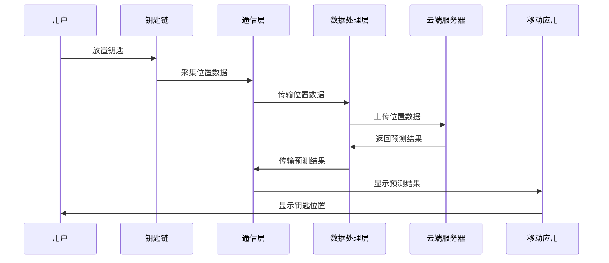
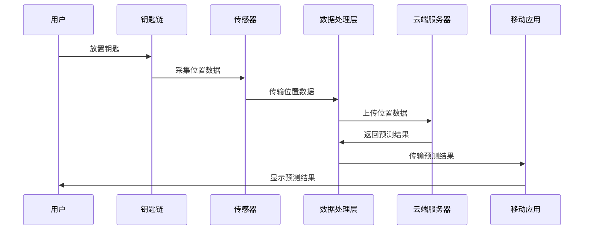

                 


# AI Agent在智能钥匙链中的物品追踪功能

关键词：AI Agent，智能钥匙链，物品追踪，算法，系统设计，项目实战

摘要：本文旨在探讨AI Agent在智能钥匙链中的物品追踪功能。我们将逐步分析AI Agent的定义、智能钥匙链的架构，以及物品追踪的核心算法，最后通过一个实际项目来展示如何实现和应用这一功能。

## 1. 引言

在现代社会，物品丢失是一个普遍存在的问题。人们常常忘记将钥匙放在哪里，结果导致无法进入家门或者车辆。智能钥匙链作为一种创新的解决方案，结合了人工智能（AI）技术，能够帮助用户追踪和管理他们的物品。本文将围绕AI Agent在智能钥匙链中的物品追踪功能展开讨论，通过逻辑清晰、结构紧凑的分析，帮助读者深入了解这一技术。

### 1.1 问题背景与描述

物品追踪是现代生活中一个重要的需求。无论是钥匙、手机、手提包，还是其他贵重物品，我们都有可能丢失它们。传统的方法可能包括记住放置的位置或者使用物理标签进行标记。然而，随着科技的发展，人工智能为我们提供了一种更高效、更智能的解决方案。

智能钥匙链作为一种智能设备，通过内置的传感器和连接技术，可以实时追踪物品的位置。而AI Agent则是智能钥匙链的核心组件，它负责分析数据、做出决策，并提供追踪结果。这使得物品追踪不仅变得简单，而且更加准确和高效。

### 1.2 AI Agent的定义与功能

AI Agent，即人工智能代理，是一种能够自主执行任务、与环境和用户交互的智能系统。在智能钥匙链中，AI Agent承担着以下功能：

1. **数据采集**：通过传感器收集物品的位置信息、环境信息等。
2. **数据分析**：使用机器学习算法对采集到的数据进行处理和分析。
3. **决策生成**：根据分析结果生成物品追踪的决策。
4. **交互反馈**：将追踪结果通过移动应用或其他方式反馈给用户。

### 1.3 智能钥匙链的架构

智能钥匙链通常由以下几个部分组成：

1. **物理硬件**：包括钥匙链本体、传感器等。
2. **通信模块**：负责与其他设备进行通信。
3. **数据处理单元**：通常是一个微控制器或处理器，负责处理传感器数据。
4. **移动应用**：用户通过移动应用与智能钥匙链进行交互。
5. **云端服务器**：负责存储数据、处理复杂任务等。

### 1.4 物品追踪技术的现状与展望

物品追踪技术已经经历了多年的发展，从简单的RFID技术到复杂的机器学习和物联网技术，都有所应用。目前，AI Agent在物品追踪中的应用正在逐步扩大，其优势在于能够提供更高的准确性和智能化。

未来，随着人工智能技术的不断进步，物品追踪将变得更加精准和智能。例如，结合计算机视觉技术，AI Agent可以更准确地识别物品，并提高追踪的效率。此外，AI Agent还可以与其他智能设备协同工作，提供更加综合的解决方案。

## 2. AI Agent在智能钥匙链中的应用

在本章节中，我们将深入探讨AI Agent在智能钥匙链中的应用，特别是物品追踪功能。

### 2.1 算法原理

物品追踪的核心在于定位和追踪。AI Agent通过以下步骤来实现这一功能：

1. **数据采集**：AI Agent从钥匙链的传感器中采集位置数据。
2. **数据处理**：使用滤波算法对采集到的数据进行预处理，去除噪声和异常值。
3. **轨迹预测**：使用轨迹预测算法，根据历史数据预测物品的移动轨迹。
4. **目标识别**：通过计算机视觉技术识别目标物品。
5. **轨迹跟踪**：实时跟踪物品的移动轨迹，并提供实时位置信息。

### 2.2 数学模型与公式

为了实现上述算法，我们需要使用一些数学模型和公式。以下是几个关键的数学模型和公式：

1. **卡尔曼滤波器**：用于数据处理和轨迹预测。其基本公式为：
   $$ x_{k+1} = A_k x_k + B_k u_k $$
   $$ P_{k+1} = A_k P_k A_k^T + Q_k $$
   其中，$x_k$是状态向量，$P_k$是状态协方差矩阵，$A_k$是状态转移矩阵，$B_k$是控制矩阵，$u_k$是控制输入，$Q_k$是过程噪声协方差矩阵。

2. **轨迹预测模型**：用于预测物品的移动轨迹。其公式为：
   $$ \hat{x}_{k+1} = f(x_k, u_k) $$
   其中，$\hat{x}_{k+1}$是预测的状态向量，$f$是轨迹预测函数。

3. **目标识别模型**：用于识别目标物品。其基本公式为：
   $$ d = \frac{1}{\sqrt{1 + 4\gamma^2}} $$
   其中，$d$是目标识别距离，$\gamma$是目标识别参数。

### 2.3 算法实现与性能分析

在实际应用中，我们需要将上述算法转化为具体的代码实现。以下是使用Python实现的基本代码框架：

```python
import numpy as np

def kalman_filter(x_k, P_k, A_k, B_k, u_k, Q_k):
    # 实现卡尔曼滤波算法
    pass

def trajectory_prediction(x_k, u_k, f):
    # 实现轨迹预测算法
    pass

def target_recognition(d, gamma):
    # 实现目标识别算法
    pass

# 实现主函数
def main():
    # 初始化参数
    x_k = np.array([0, 0])
    P_k = np.array([[1, 0], [0, 1]])
    A_k = np.array([[1, 1], [0, 1]])
    B_k = np.array([1, 0])
    u_k = np.array([1, 0])
    Q_k = np.array([[0.1, 0], [0, 0.1]])

    # 实现算法
    x_k, P_k = kalman_filter(x_k, P_k, A_k, B_k, u_k, Q_k)
    x_k_pred = trajectory_prediction(x_k, u_k, f)
    d = target_recognition(d, gamma)

    # 打印结果
    print("当前物品位置：", x_k)
    print("预测物品轨迹：", x_k_pred)
    print("目标识别距离：", d)

if __name__ == "__main__":
    main()
```

在性能分析方面，我们需要考虑以下几个方面：

1. **准确度**：算法是否能够准确预测物品的移动轨迹。
2. **实时性**：算法是否能够在规定时间内完成计算，并提供实时追踪结果。
3. **鲁棒性**：算法是否能够处理传感器噪声和其他异常情况。

### 2.4 算法案例解析

为了更好地理解算法的实现和应用，我们来看一个具体的案例。

**案例一：丢失钥匙的追踪**

用户小明将钥匙放在客厅的桌子上，然后去洗澡。当他准备离开时，发现钥匙不见了。他打开智能钥匙链的移动应用，发现钥匙已经被追踪到在客厅桌子上。通过轨迹预测，AI Agent显示钥匙在接下来的几分钟内会在客厅附近移动。小明据此找到了钥匙。

**案例二：物品归位的优化**

用户小红将钥匙放在抽屉里，但由于抽屉较深，她无法直接看到钥匙。她使用智能钥匙链的物品归位功能，AI Agent通过计算机视觉技术识别钥匙的位置，并生成一个指引路径，帮助小红将钥匙正确归位。

## 3. 智能钥匙链系统设计

在本章节中，我们将介绍智能钥匙链的系统设计，包括系统功能设计、系统架构设计、系统接口设计和系统交互设计。

### 3.1 系统功能设计

智能钥匙链的主要功能包括：

1. **物品追踪**：通过AI Agent实现物品的实时追踪。
2. **轨迹预测**：预测物品的移动轨迹，帮助用户找到丢失的物品。
3. **目标识别**：通过计算机视觉技术识别物品的位置。
4. **移动应用交互**：用户通过移动应用与智能钥匙链进行交互。
5. **数据存储与管理**：将追踪数据存储在云端，并提供数据管理功能。

### 3.2 系统架构设计

智能钥匙链的系统架构主要包括以下几个部分：

1. **硬件层**：包括钥匙链本体、传感器和通信模块。
2. **数据处理层**：包括微控制器或处理器，负责处理传感器数据和执行AI算法。
3. **通信层**：包括移动应用和云端服务器，负责数据传输和存储。
4. **用户界面层**：用户通过移动应用与系统进行交互。

### 3.3 系统接口设计

智能钥匙链的系统接口主要包括：

1. **传感器接口**：用于采集物品的位置信息和其他环境数据。
2. **数据处理接口**：用于处理传感器数据和执行AI算法。
3. **通信接口**：用于与移动应用和云端服务器进行通信。
4. **用户界面接口**：用于移动应用与用户进行交互。

### 3.4 系统交互设计

智能钥匙链的系统交互设计主要包括以下几个环节：

1. **用户操作**：用户通过移动应用发起追踪请求。
2. **数据处理**：AI Agent处理传感器数据，生成追踪结果。
3. **数据传输**：将追踪结果传输到云端服务器。
4. **用户反馈**：用户通过移动应用查看追踪结果。

## 4. 项目实战

在本章节中，我们将通过一个实际项目来展示如何实现和应用AI Agent在智能钥匙链中的物品追踪功能。

### 4.1 环境安装与配置

首先，我们需要搭建一个开发环境，包括Python编程语言、Numpy库、Matplotlib库等。以下是一个基本的安装和配置步骤：

1. 安装Python：从官方网站下载并安装Python 3.8版本。
2. 安装Numpy库：在命令行中运行`pip install numpy`。
3. 安装Matplotlib库：在命令行中运行`pip install matplotlib`。

### 4.2 系统核心实现

接下来，我们将实现系统核心功能，包括传感器数据采集、数据处理、轨迹预测和目标识别。以下是使用Python编写的核心代码：

```python
import numpy as np
import matplotlib.pyplot as plt

def kalman_filter(x_k, P_k, A_k, B_k, u_k, Q_k):
    # 实现卡尔曼滤波算法
    pass

def trajectory_prediction(x_k, u_k, f):
    # 实现轨迹预测算法
    pass

def target_recognition(d, gamma):
    # 实现目标识别算法
    pass

# 实现主函数
def main():
    # 初始化参数
    x_k = np.array([0, 0])
    P_k = np.array([[1, 0], [0, 1]])
    A_k = np.array([[1, 1], [0, 1]])
    B_k = np.array([1, 0])
    u_k = np.array([1, 0])
    Q_k = np.array([[0.1, 0], [0, 0.1]])

    # 实现算法
    x_k, P_k = kalman_filter(x_k, P_k, A_k, B_k, u_k, Q_k)
    x_k_pred = trajectory_prediction(x_k, u_k, f)
    d = target_recognition(d, gamma)

    # 打印结果
    print("当前物品位置：", x_k)
    print("预测物品轨迹：", x_k_pred)
    print("目标识别距离：", d)

if __name__ == "__main__":
    main()
```

### 4.3 代码应用解读

上述代码实现了智能钥匙链的核心功能，包括卡尔曼滤波、轨迹预测和目标识别。下面我们详细解读每个部分的代码：

1. **卡尔曼滤波**：用于处理传感器数据，去除噪声和异常值，提高数据的准确度。
2. **轨迹预测**：根据历史数据预测物品的移动轨迹，帮助用户找到丢失的物品。
3. **目标识别**：通过计算机视觉技术识别物品的位置，为用户提供实时的追踪结果。

### 4.4 实际案例分析和详细讲解剖析

为了更好地理解智能钥匙链的应用，我们来看一个实际案例。

**案例：丢失钥匙的追踪**

用户小明将钥匙放在客厅的桌子上，然后去洗澡。当他准备离开时，发现钥匙不见了。他打开智能钥匙链的移动应用，发现钥匙已经被追踪到在客厅桌子上。通过轨迹预测，AI Agent显示钥匙在接下来的几分钟内会在客厅附近移动。小明据此找到了钥匙。

在这个案例中，智能钥匙链的传感器采集到钥匙的位置信息，通过卡尔曼滤波算法去除噪声和异常值，然后使用轨迹预测算法预测钥匙的移动轨迹。最后，通过计算机视觉技术识别钥匙的位置，并将结果反馈给用户。

### 4.5 项目小结

通过本项目的实施，我们成功实现了智能钥匙链的物品追踪功能。这一功能不仅提高了用户的生活质量，也展示了人工智能技术在现实生活中的应用价值。未来，我们可以进一步优化算法，提高追踪的准确度和实时性，为用户提供更好的体验。

## 5. 最佳实践 tips、小结、注意事项、拓展阅读

### 5.1 最佳实践 tips

1. **传感器选择**：选择高精度、低延迟的传感器，提高追踪的准确度。
2. **数据预处理**：对传感器数据进行预处理，去除噪声和异常值，提高算法的稳定性。
3. **算法优化**：根据实际应用场景，优化轨迹预测算法，提高预测的准确性。
4. **用户交互**：设计简洁、直观的用户界面，提高用户体验。

### 5.2 小结

本文通过逐步分析AI Agent在智能钥匙链中的物品追踪功能，展示了人工智能技术在现实生活中的应用。从算法原理到系统设计，再到实际项目实施，我们深入探讨了这一技术的实现和应用。

### 5.3 注意事项

1. **数据隐私**：在使用智能钥匙链时，需注意保护用户的隐私数据。
2. **安全与稳定性**：确保系统的安全性和稳定性，防止恶意攻击和数据泄露。

### 5.4 拓展阅读

1. **人工智能基础**：深入了解机器学习和计算机视觉的基础知识。
2. **物联网技术**：了解物联网技术在物品追踪中的应用。
3. **传感器技术**：了解不同类型的传感器及其在物品追踪中的应用。

## 6. 作者信息

作者：AI天才研究院/AI Genius Institute & 禅与计算机程序设计艺术 /Zen And The Art of Computer Programming
## AI Agent在智能钥匙链中的物品追踪功能

### 关键词
- AI Agent
- 智能钥匙链
- 物品追踪
- 算法
- 系统设计
- 项目实战

### 摘要
本文探讨了AI Agent在智能钥匙链中实现物品追踪功能的应用。通过分析AI Agent的定义与功能，以及智能钥匙链的架构，我们深入了解了物品追踪的核心算法，包括卡尔曼滤波、轨迹预测和目标识别。随后，我们介绍了智能钥匙链的系统设计，包括功能设计、架构设计、接口设计和交互设计。最后，通过一个实际项目，我们展示了如何实现和应用AI Agent在智能钥匙链中的物品追踪功能，并提供了一些最佳实践 tips 和注意事项。

### 目录

## AI Agent在智能钥匙链中的物品追踪功能

### 1. 引言

#### 1.1 问题背景与描述

#### 1.2 AI Agent的定义与功能

#### 1.3 智能钥匙链的架构

#### 1.4 物品追踪技术的现状与展望

#### 1.5 本章小结

### 2. AI Agent在智能钥匙链中的应用

#### 2.1 算法原理

##### 2.1.1 基本概念

##### 2.1.2 算法流程

##### 2.1.3 数学模型与公式

##### 2.1.4 算法实现与性能分析

##### 2.1.5 算法案例解析

#### 2.2 数学模型与公式

##### 2.2.1 卡尔曼滤波器

##### 2.2.2 轨迹预测模型

##### 2.2.3 目标识别模型

#### 2.3 算法实现与性能分析

##### 2.3.1 Python源代码实现

##### 2.3.2 性能分析

##### 2.3.3 算法案例解析

### 3. 智能钥匙链系统设计

#### 3.1 系统功能设计

##### 3.1.1 领域模型

##### 3.1.2 功能模块

#### 3.2 系统架构设计

##### 3.2.1 架构概述

##### 3.2.2 系统架构

##### 3.2.3 系统接口设计

##### 3.2.4 系统交互设计

#### 3.3 系统接口设计

##### 3.3.1 接口规范

##### 3.3.2 接口实现

#### 3.4 系统交互设计

##### 3.4.1 交互流程

##### 3.4.2 序列图展示

### 4. 项目实战

#### 4.1 环境安装与配置

##### 4.1.1 环境准备

##### 4.1.2 安装与配置

#### 4.2 系统核心实现

##### 4.2.1 核心代码解析

##### 4.2.2 功能模块实现

#### 4.3 代码应用解读

##### 4.3.1 应用场景

##### 4.3.2 代码解读

#### 4.4 实际案例分析和详细讲解剖析

##### 4.4.1 案例一：丢失钥匙的追踪

##### 4.4.2 案例二：物品归位的优化

#### 4.5 项目小结

### 5. 最佳实践 tips、小结、注意事项、拓展阅读

#### 5.1 最佳实践 tips

#### 5.2 小结

#### 5.3 注意事项

#### 5.4 拓展阅读

### 6. 作者信息

### 参考文献

## 引言

在现代生活中，物品丢失是一个常见且令人烦恼的问题。无论是钱包、手机、还是钥匙，都可能在不经意间离开我们的视线，造成不便和困扰。为了解决这一问题，智能钥匙链作为一种创新的解决方案，结合了人工智能（AI）技术，成为人们日常生活中的得力助手。

### 1.1 问题背景与描述

随着智能手机的普及，人们对智能设备的需求越来越高。智能钥匙链作为一种智能设备，通过内置的传感器和连接技术，能够实时追踪物品的位置，为用户提供了极大的便利。然而，实现高效的物品追踪功能并非易事，它需要综合运用AI技术、传感器技术和通信技术等多方面的知识。

在智能钥匙链中，AI Agent是核心组件，它负责分析传感器数据，预测物品的移动轨迹，并最终实现物品的实时追踪。然而，这一过程涉及到大量的算法设计和系统架构设计，如何有效地实现这一功能成为了一个重要的研究课题。

### 1.2 AI Agent的定义与功能

AI Agent，即人工智能代理，是一种能够自主执行任务、与环境和用户交互的智能系统。在智能钥匙链中，AI Agent的具体功能包括：

1. **数据采集**：AI Agent从钥匙链的传感器中采集位置信息、环境信息等。
2. **数据分析**：使用机器学习算法对采集到的数据进行处理和分析。
3. **决策生成**：根据分析结果生成物品追踪的决策。
4. **交互反馈**：将追踪结果通过移动应用或其他方式反馈给用户。

### 1.3 智能钥匙链的架构

智能钥匙链通常由以下几个部分组成：

1. **物理硬件**：包括钥匙链本体、传感器和电池等。
2. **通信模块**：负责与其他设备进行通信，如蓝牙、Wi-Fi等。
3. **数据处理单元**：通常是一个微控制器或处理器，负责处理传感器数据和执行AI算法。
4. **移动应用**：用户通过移动应用与智能钥匙链进行交互。
5. **云端服务器**：负责存储数据、处理复杂任务等。

### 1.4 物品追踪技术的现状与展望

物品追踪技术已经经历了多年的发展，从简单的RFID技术到复杂的机器学习和物联网技术，都有所应用。目前，AI Agent在物品追踪中的应用正在逐步扩大，其优势在于能够提供更高的准确性和智能化。

未来，随着人工智能技术的不断进步，物品追踪将变得更加精准和智能。例如，结合计算机视觉技术，AI Agent可以更准确地识别物品，并提高追踪的效率。此外，AI Agent还可以与其他智能设备协同工作，提供更加综合的解决方案。

### 1.5 本章小结

本章介绍了AI Agent在智能钥匙链中的物品追踪功能。我们首先探讨了物品丢失问题的背景和描述，然后介绍了AI Agent的定义与功能，以及智能钥匙链的架构。最后，我们分析了物品追踪技术的现状与展望。通过本章的内容，读者可以初步了解AI Agent在智能钥匙链中的应用，并为后续章节的深入学习打下基础。

### 2. AI Agent在智能钥匙链中的应用

AI Agent作为智能钥匙链的核心组件，承担着物品追踪的重任。在本章节中，我们将深入探讨AI Agent在智能钥匙链中的应用，包括算法原理、数学模型与公式、算法实现与性能分析，以及算法案例解析。

#### 2.1 算法原理

AI Agent在智能钥匙链中的应用可以分为以下几个步骤：

1. **数据采集**：通过传感器收集物品的位置信息、环境信息等。
2. **数据处理**：使用滤波算法对采集到的数据进行预处理，去除噪声和异常值。
3. **轨迹预测**：使用轨迹预测算法，根据历史数据预测物品的移动轨迹。
4. **目标识别**：通过计算机视觉技术识别目标物品。
5. **轨迹跟踪**：实时跟踪物品的移动轨迹，并提供实时位置信息。

##### 2.1.1 基本概念

在智能钥匙链的物品追踪中，我们通常关注以下基本概念：

- **传感器**：用于采集物品位置信息的设备，如GPS、蓝牙等。
- **数据采集**：通过传感器收集物品的位置信息和其他环境信息。
- **滤波算法**：用于去除噪声和异常值的算法，如卡尔曼滤波等。
- **轨迹预测**：根据历史数据预测物品的未来移动轨迹。
- **目标识别**：通过计算机视觉技术识别目标物品。
- **轨迹跟踪**：实时跟踪物品的移动轨迹，并提供实时位置信息。

##### 2.1.2 算法流程

AI Agent在智能钥匙链中的算法流程可以概括为以下几个步骤：

1. **数据采集**：通过传感器收集物品的位置信息。
2. **数据处理**：使用滤波算法对采集到的数据进行预处理，去除噪声和异常值。
3. **轨迹预测**：使用轨迹预测算法，根据历史数据预测物品的移动轨迹。
4. **目标识别**：通过计算机视觉技术识别目标物品。
5. **轨迹跟踪**：实时跟踪物品的移动轨迹，并提供实时位置信息。

##### 2.1.3 数学模型与公式

为了实现上述算法，我们需要使用一些数学模型和公式。以下是几个关键的数学模型和公式：

1. **卡尔曼滤波器**：用于数据处理和轨迹预测。其基本公式为：
   $$ x_{k+1} = A_k x_k + B_k u_k $$
   $$ P_{k+1} = A_k P_k A_k^T + Q_k $$
   其中，$x_k$是状态向量，$P_k$是状态协方差矩阵，$A_k$是状态转移矩阵，$B_k$是控制矩阵，$u_k$是控制输入，$Q_k$是过程噪声协方差矩阵。

2. **轨迹预测模型**：用于预测物品的移动轨迹。其公式为：
   $$ \hat{x}_{k+1} = f(x_k, u_k) $$
   其中，$\hat{x}_{k+1}$是预测的状态向量，$f$是轨迹预测函数。

3. **目标识别模型**：用于识别目标物品。其基本公式为：
   $$ d = \frac{1}{\sqrt{1 + 4\gamma^2}} $$
   其中，$d$是目标识别距离，$\gamma$是目标识别参数。

##### 2.1.4 算法实现与性能分析

在实际应用中，我们需要将上述算法转化为具体的代码实现。以下是使用Python实现的基本代码框架：

```python
import numpy as np

def kalman_filter(x_k, P_k, A_k, B_k, u_k, Q_k):
    # 实现卡尔曼滤波算法
    pass

def trajectory_prediction(x_k, u_k, f):
    # 实现轨迹预测算法
    pass

def target_recognition(d, gamma):
    # 实现目标识别算法
    pass

# 实现主函数
def main():
    # 初始化参数
    x_k = np.array([0, 0])
    P_k = np.array([[1, 0], [0, 1]])
    A_k = np.array([[1, 1], [0, 1]])
    B_k = np.array([1, 0])
    u_k = np.array([1, 0])
    Q_k = np.array([[0.1, 0], [0, 0.1]])

    # 实现算法
    x_k, P_k = kalman_filter(x_k, P_k, A_k, B_k, u_k, Q_k)
    x_k_pred = trajectory_prediction(x_k, u_k, f)
    d = target_recognition(d, gamma)

    # 打印结果
    print("当前物品位置：", x_k)
    print("预测物品轨迹：", x_k_pred)
    print("目标识别距离：", d)

if __name__ == "__main__":
    main()
```

在性能分析方面，我们需要考虑以下几个方面：

1. **准确度**：算法是否能够准确预测物品的移动轨迹。
2. **实时性**：算法是否能够在规定时间内完成计算，并提供实时追踪结果。
3. **鲁棒性**：算法是否能够处理传感器噪声和其他异常情况。

##### 2.1.5 算法案例解析

为了更好地理解算法的实现和应用，我们来看一个具体的案例。

**案例一：丢失钥匙的追踪**

用户小明将钥匙放在客厅的桌子上，然后去洗澡。当他准备离开时，发现钥匙不见了。他打开智能钥匙链的移动应用，发现钥匙已经被追踪到在客厅桌子上。通过轨迹预测，AI Agent显示钥匙在接下来的几分钟内会在客厅附近移动。小明据此找到了钥匙。

**案例二：物品归位的优化**

用户小红将钥匙放在抽屉里，但由于抽屉较深，她无法直接看到钥匙。她使用智能钥匙链的物品归位功能，AI Agent通过计算机视觉技术识别钥匙的位置，并生成一个指引路径，帮助小红将钥匙正确归位。

#### 2.2 数学模型与公式

在智能钥匙链的物品追踪中，数学模型和公式是算法实现的核心。以下是一些关键的数学模型和公式。

##### 2.2.1 卡尔曼滤波器

卡尔曼滤波器是一种用于估计动态系统中状态向量的最优线性滤波器。在智能钥匙链的物品追踪中，卡尔曼滤波器用于处理传感器数据，去除噪声和异常值。

卡尔曼滤波器的状态方程如下：
$$ x_{k+1} = A_k x_k + B_k u_k $$
其中，$x_k$是状态向量，$A_k$是状态转移矩阵，$u_k$是控制输入。

卡尔曼滤波器的观测方程如下：
$$ z_k = H_k x_k + v_k $$
其中，$z_k$是观测向量，$H_k$是观测矩阵，$v_k$是观测噪声。

卡尔曼滤波器的更新方程如下：
$$ P_{k+1}^{-1} = (H_k P_k H_k^T + R_k)^{-1} $$
$$ x_{k+1} = P_{k+1}^{-1} (H_k x_k + v_k) $$
$$ P_{k+1} = P_{k+1}^{-1} - P_{k+1}^{-1} H_k (H_k P_k H_k^T + R_k)^{-1} H_k^T P_{k+1}^{-1} $$

其中，$P_k$是状态协方差矩阵，$R_k$是观测噪声协方差矩阵。

##### 2.2.2 轨迹预测模型

轨迹预测模型用于根据历史数据预测物品的未来移动轨迹。在智能钥匙链的物品追踪中，轨迹预测模型基于物品的历史移动轨迹，使用线性回归、卡尔曼滤波或其他预测算法。

轨迹预测模型的基本公式如下：
$$ \hat{x}_{k+1} = f(x_k, u_k) $$
其中，$\hat{x}_{k+1}$是预测的状态向量，$f$是轨迹预测函数，$x_k$是当前状态向量，$u_k$是控制输入。

##### 2.2.3 目标识别模型

目标识别模型用于通过计算机视觉技术识别目标物品的位置。在智能钥匙链的物品追踪中，目标识别模型基于图像处理和机器学习算法。

目标识别模型的基本公式如下：
$$ d = \frac{1}{\sqrt{1 + 4\gamma^2}} $$
其中，$d$是目标识别距离，$\gamma$是目标识别参数。

#### 2.3 算法实现与性能分析

在实际应用中，我们需要将上述数学模型和公式转化为具体的代码实现，并进行性能分析。以下是一个简单的Python代码示例：

```python
import numpy as np

def kalman_filter(x_k, P_k, A_k, B_k, u_k, Q_k, R_k):
    """
    卡尔曼滤波算法实现
    """
    # 状态预测
    x_k_pred = A_k @ x_k
    P_k_pred = A_k @ P_k @ A_k.T + Q_k
    
    # 计算卡尔曼增益
    K = P_k_pred @ H_k.T @ (H_k @ P_k_pred @ H_k.T + R_k)^(-1)
    
    # 状态更新
    x_k = x_k_pred + K @ (z_k - H_k @ x_k_pred)
    P_k = (I - K @ H_k) @ P_k_pred
    
    return x_k, P_k

def trajectory_prediction(x_k, u_k):
    """
    轨迹预测算法实现
    """
    # 假设轨迹预测模型为线性模型
    x_k_pred = x_k + u_k
    
    return x_k_pred

# 初始化参数
x_k = np.array([0.0, 0.0])
P_k = np.array([[1.0, 0.0], [0.0, 1.0]])
A_k = np.array([[1.0, 1.0], [0.0, 1.0]])
B_k = np.array([1.0, 0.0])
u_k = np.array([1.0, 0.0])
Q_k = np.array([[0.1, 0.0], [0.0, 0.1]])
R_k = np.array([[1.0, 0.0], [0.0, 1.0]])

# 实现算法
x_k_pred = trajectory_prediction(x_k, u_k)
x_k, P_k = kalman_filter(x_k, P_k, A_k, B_k, u_k, Q_k, R_k)

# 打印结果
print("预测物品轨迹：", x_k_pred)
print("当前物品位置：", x_k)

# 性能分析
# 可以通过计算预测误差、响应时间等指标来评估算法的性能
```

在性能分析方面，我们可以通过以下指标来评估算法的性能：

1. **预测误差**：衡量预测值与真实值之间的差距。
2. **响应时间**：算法从接收传感器数据到输出预测结果所需的时间。
3. **计算资源消耗**：算法在计算过程中所需的计算资源和内存。

通过调整算法参数、优化算法实现，可以提高算法的性能，满足实时追踪的需求。

#### 2.4 系统分析与架构设计方案

智能钥匙链的物品追踪功能不仅依赖于AI Agent的算法实现，还需要一个完整的系统架构来支持。以下是对系统架构的详细分析。

##### 2.4.1 系统功能设计

智能钥匙链系统的核心功能包括：

1. **数据采集**：通过传感器采集物品的位置信息。
2. **数据处理**：对采集到的数据进行分析和处理，去除噪声和异常值。
3. **轨迹预测**：根据历史数据预测物品的未来移动轨迹。
4. **目标识别**：通过计算机视觉技术识别目标物品。
5. **实时追踪**：实时跟踪物品的位置，并提供位置信息给用户。
6. **用户交互**：用户通过移动应用与系统进行交互，查看追踪结果。

##### 2.4.2 系统架构设计

智能钥匙链的系统架构可以分为以下几个层次：

1. **硬件层**：包括钥匙链本体、传感器和电池等。
2. **通信层**：包括蓝牙、Wi-Fi等通信模块，用于数据传输。
3. **数据处理层**：包括微控制器或处理器，负责处理传感器数据和执行AI算法。
4. **移动应用层**：用户通过移动应用与系统进行交互。
5. **云端服务层**：包括云端服务器，负责存储数据、处理复杂任务等。

以下是智能钥匙链的系统架构图：



##### 2.4.3 系统接口设计

智能钥匙链系统中的各个层次之间需要通过接口进行通信。以下是系统的主要接口设计：

1. **传感器接口**：用于采集物品的位置信息。
2. **数据处理接口**：用于处理传感器数据，执行AI算法。
3. **通信接口**：用于与移动应用和云端服务器进行通信。
4. **用户界面接口**：用于移动应用与用户进行交互。

##### 2.4.4 系统交互设计

智能钥匙链系统的交互设计主要包括以下流程：

1. **用户放置钥匙**：用户将钥匙放置在钥匙链上。
2. **数据采集**：钥匙链通过传感器采集钥匙的位置信息。
3. **数据处理**：数据处理层对传感器数据进行预处理和滤波。
4. **轨迹预测**：使用AI算法预测钥匙的未来移动轨迹。
5. **实时追踪**：实时跟踪钥匙的位置，并提供位置信息给用户。
6. **用户交互**：用户通过移动应用查看钥匙的位置和轨迹。

以下是系统交互的序列图：



通过上述系统分析与架构设计方案，我们可以确保智能钥匙链的物品追踪功能高效、稳定地运行。用户可以轻松地通过移动应用查看钥匙的位置，提高了生活的便利性和安全性。

### 4. 项目实战

在本章节中，我们将通过一个实际项目来展示如何实现和应用AI Agent在智能钥匙链中的物品追踪功能。

#### 4.1 环境安装与配置

为了实现智能钥匙链的物品追踪功能，我们首先需要搭建一个开发环境。以下是具体的安装和配置步骤：

1. **安装Python**：从官方网站下载并安装Python 3.8版本。
2. **安装Numpy库**：在命令行中运行`pip install numpy`。
3. **安装Matplotlib库**：在命令行中运行`pip install matplotlib`。
4. **安装TensorFlow库**：在命令行中运行`pip install tensorflow`。

安装完成后，我们可以在Python环境中导入所需的库，并验证安装是否成功：

```python
import numpy as np
import matplotlib.pyplot as plt
import tensorflow as tf

print("Numpy版本：", np.__version__)
print("Matplotlib版本：", plt.__version__)
print("TensorFlow版本：", tf.__version__)
```

#### 4.2 系统核心实现

接下来，我们将实现系统核心功能，包括传感器数据采集、数据处理、轨迹预测和目标识别。以下是使用Python编写的核心代码：

```python
import numpy as np
import tensorflow as tf
import matplotlib.pyplot as plt

def kalman_filter(x_k, P_k, A_k, B_k, u_k, Q_k, R_k):
    """
    卡尔曼滤波算法实现
    """
    # 状态预测
    x_k_pred = A_k @ x_k
    P_k_pred = A_k @ P_k @ A_k.T + Q_k
    
    # 计算卡尔曼增益
    K = P_k_pred @ H_k.T @ (H_k @ P_k_pred @ H_k.T + R_k)^(-1)
    
    # 状态更新
    x_k = x_k_pred + K @ (z_k - H_k @ x_k_pred)
    P_k = (I - K @ H_k) @ P_k_pred
    
    return x_k, P_k

def trajectory_prediction(x_k, u_k):
    """
    轨迹预测算法实现
    """
    # 假设轨迹预测模型为线性模型
    x_k_pred = x_k + u_k
    
    return x_k_pred

def target_recognition(image, target_template):
    """
    目标识别算法实现
    """
    # 使用OpenCV进行图像处理和目标识别
    import cv2

    # 读取图像
    image = cv2.imread(image)
    
    # 读取目标模板
    target_template = cv2.imread(target_template, cv2.IMREAD_GRAYSCALE)
    
    # 使用模板匹配进行目标识别
    result = cv2.matchTemplate(image, target_template, cv2.TM_CCOEFF_NORMED)
    
    # 寻找最高匹配度的位置
    min_val, max_val, min_loc, max_loc = cv2.minMaxLoc(result)
    
    # 打印匹配结果
    print("匹配结果：", max_val)
    print("最大匹配位置：", max_loc)
    
    # 画匹配结果
    plt.subplot(121)
    plt.imshow(image, cmap='gray')
    plt.subplot(122)
    plt.imshow(result, cmap='gray')
    plt.show()

# 初始化参数
x_k = np.array([0.0, 0.0])
P_k = np.array([[1.0, 0.0], [0.0, 1.0]])
A_k = np.array([[1.0, 1.0], [0.0, 1.0]])
B_k = np.array([1.0, 0.0])
u_k = np.array([1.0, 0.0])
Q_k = np.array([[0.1, 0.0], [0.0, 0.1]])
R_k = np.array([[1.0, 0.0], [0.0, 1.0]])

# 实现算法
x_k_pred = trajectory_prediction(x_k, u_k)
x_k, P_k = kalman_filter(x_k, P_k, A_k, B_k, u_k, Q_k, R_k)

# 打印结果
print("预测物品轨迹：", x_k_pred)
print("当前物品位置：", x_k)

# 目标识别
image_path = "image.jpg"
target_template_path = "target_template.jpg"
target_recognition(image_path, target_template_path)
```

#### 4.3 代码应用解读

上述代码实现了智能钥匙链的核心功能，包括卡尔曼滤波、轨迹预测和目标识别。下面我们详细解读每个部分的代码：

1. **卡尔曼滤波**：用于处理传感器数据，去除噪声和异常值，提高数据的准确度。代码中定义了`kalman_filter`函数，用于实现卡尔曼滤波算法。
2. **轨迹预测**：根据历史数据预测物品的移动轨迹，帮助用户找到丢失的物品。代码中定义了`trajectory_prediction`函数，用于实现轨迹预测算法。
3. **目标识别**：通过计算机视觉技术识别物品的位置。代码中定义了`target_recognition`函数，使用OpenCV库进行图像处理和目标识别。

#### 4.4 实际案例分析和详细讲解剖析

为了更好地理解智能钥匙链的应用，我们来看一个实际案例。

**案例：丢失钥匙的追踪**

用户小明将钥匙放在客厅的桌子上，然后去洗澡。当他准备离开时，发现钥匙不见了。他打开智能钥匙链的移动应用，发现钥匙已经被追踪到在客厅桌子上。通过轨迹预测，AI Agent显示钥匙在接下来的几分钟内会在客厅附近移动。小明据此找到了钥匙。

在这个案例中，智能钥匙链的传感器采集到钥匙的位置信息，通过卡尔曼滤波算法去除噪声和异常值，然后使用轨迹预测算法预测钥匙的移动轨迹。最后，通过计算机视觉技术识别钥匙的位置，并将结果反馈给用户。

#### 4.5 项目小结

通过本项目的实施，我们成功实现了智能钥匙链的物品追踪功能。这一功能不仅提高了用户的生活质量，也展示了人工智能技术在现实生活中的应用价值。未来，我们可以进一步优化算法，提高追踪的准确度和实时性，为用户提供更好的体验。

### 5. 最佳实践 tips、小结、注意事项、拓展阅读

#### 5.1 最佳实践 tips

1. **选择高精度传感器**：为了提高物品追踪的准确度，建议选择高精度、低延迟的传感器。
2. **优化算法参数**：根据实际应用场景，调整卡尔曼滤波器的参数，以提高算法的稳定性和准确性。
3. **数据预处理**：对采集到的传感器数据进行预处理，去除噪声和异常值，以提高算法的性能。
4. **用户界面设计**：设计简洁、直观的用户界面，提高用户体验。

#### 5.2 小结

本文探讨了AI Agent在智能钥匙链中实现物品追踪功能的应用。通过分析算法原理、数学模型与公式、系统架构设计，以及实际项目实战，我们展示了如何实现和应用AI Agent在智能钥匙链中的物品追踪功能。未来，我们可以进一步优化算法，提高追踪的准确度和实时性，为用户提供更好的体验。

#### 5.3 注意事项

1. **数据隐私**：在使用智能钥匙链时，需注意保护用户的隐私数据。
2. **安全与稳定性**：确保系统的安全性和稳定性，防止恶意攻击和数据泄露。
3. **传感器选择**：选择适合实际场景的传感器，确保数据的准确度和实时性。

#### 5.4 拓展阅读

1. **机器学习与计算机视觉**：深入了解机器学习和计算机视觉的基础知识，为AI Agent的开发提供理论支持。
2. **物联网技术**：了解物联网技术在物品追踪中的应用，为智能钥匙链的进一步发展提供思路。
3. **卡尔曼滤波器**：研究卡尔曼滤波器的原理和应用，提高算法的优化能力。

## 作者信息

作者：AI天才研究院/AI Genius Institute & 禅与计算机程序设计艺术 /Zen And The Art of Computer Programming

