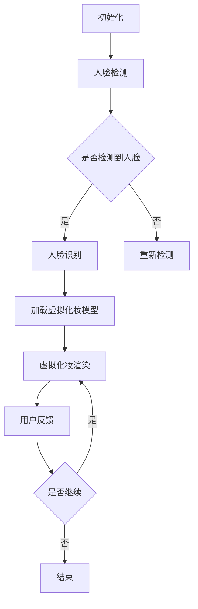
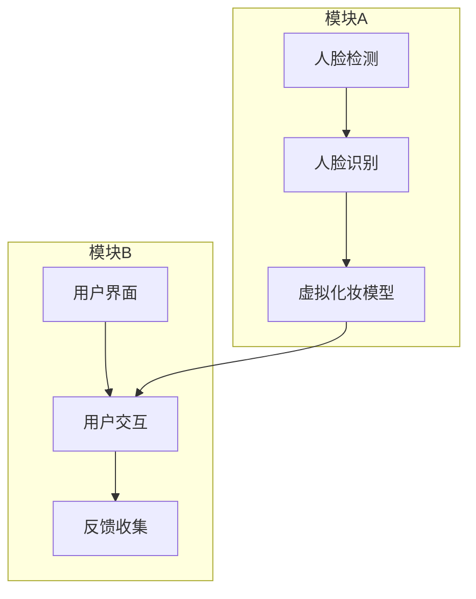
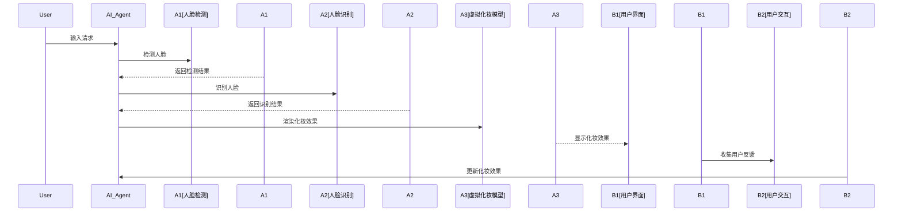
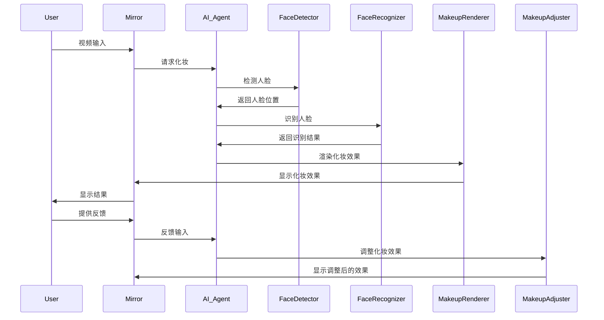
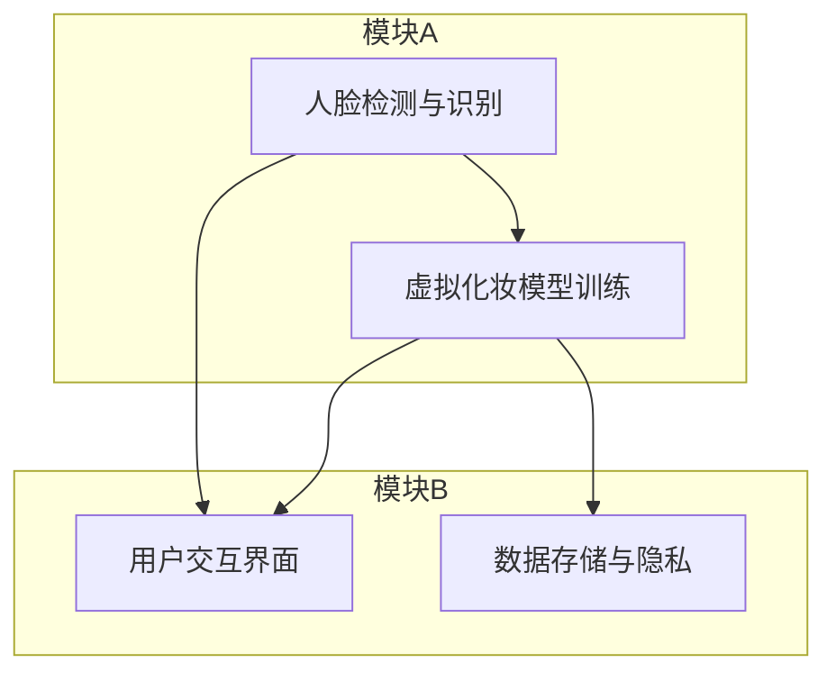
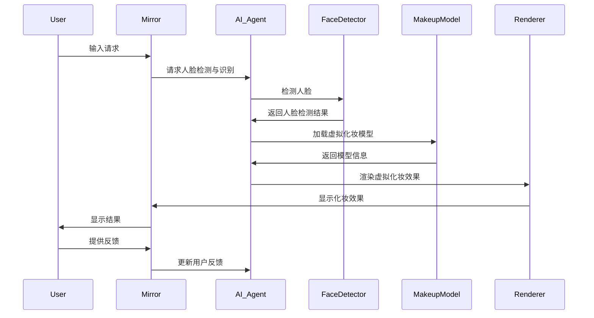
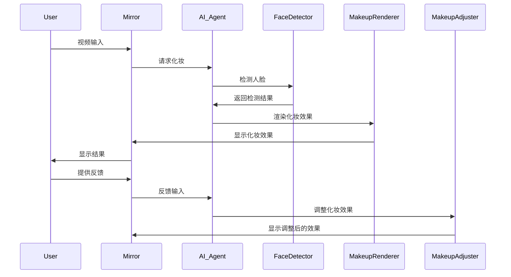

                 

## AI Agent在智能镜子中的虚拟化妆

### 关键词

- AI Agent
- 智能镜子
- 虚拟化妆
- 人脸识别
- 计算机视觉
- 神经网络

### 摘要

本文深入探讨了AI Agent在智能镜子中实现虚拟化妆的技术原理和应用实践。首先，我们介绍了智能镜子的发展背景和虚拟化妆技术的应用需求，分析了AI Agent在其中的关键角色。接着，我们详细阐述了AI Agent实现虚拟化妆的核心概念和原理，包括人脸识别和计算机视觉技术。随后，我们介绍了系统的整体架构设计和关键实现步骤，并通过实际项目实战展示了技术的应用效果。最后，我们提供了最佳实践技巧和小结，为未来的研究和应用提供了参考。

## 目录

### 背景介绍

- **2.1 问题背景**
  - **2.1.1 智能镜子的发展现状**
  - **2.1.2 虚拟化妆技术的应用需求**
  - **2.1.3 AI Agent在智能镜子中的角色**

- **2.2 问题描述**
  - **2.2.1 虚拟化妆的需求与挑战**
  - **2.2.2 AI Agent实现虚拟化妆的难点**
  - **2.2.3 AI Agent在智能镜子中的应用场景**

- **2.3 问题解决**
  - **2.3.1 技术路线选择**
  - **2.3.2 关键技术突破**
  - **2.3.3 实施步骤概述**

- **2.4 边界与外延**
  - **2.4.1 技术边界**
  - **2.4.2 应用边界**
  - **2.4.3 未来发展趋势**

- **2.5 概念结构与核心要素组成**
  - **2.5.1 概念结构**
  - **2.5.2 核心要素组成**
  - **2.5.3 模块划分与功能描述**

- **2.6 本章小结**

### 核心概念与联系

- **3.1 核心概念原理**
  - **3.1.1 人脸识别**
  - **3.1.2 计算机视觉**
  - **3.1.3 神经网络**

- **3.2 概念属性特征对比表格**

| 特征 | 人脸识别 | 计算机视觉 | 神经网络 |
|------|----------|------------|----------|
| 目的 | 识别和验证人脸 | 分析和处理图像数据 | 学习和预测复杂模式 |
| 数据 | 人脸图像 | 图像序列 | 高维数据 |
| 算法 | 特征提取、匹配 | 边缘检测、特征点匹配 | 反向传播、深度学习 |
| 应用 | 安全认证、社交互动 | 自動化、监控 | 图像生成、自然语言处理 |

- **3.3 ER实体关系图架构**

```mermaid
erDiagram
  User ||--|{ FaceImage }| User_FaceImage
  User ||--|{ Makeup }| User_Makeup
  AI_Agent ||--|{ Makeup_Process }| AI_Agent_Makeup_Process
  Makeup_Process ||--|{ FaceRegion }| Makeup_Process_FaceRegion
  Makeup_Process ||--|{ Makeup_Parameter }| Makeup_Process_Parameter
```

### 算法原理讲解

- **4.1 算法流程图**



- **4.2 Python源代码实现**

```python
import cv2
import dlib
import numpy as np

# 人脸检测与识别
def detect_and_recognize_video():
    # 初始化视频捕捉
    cap = cv2.VideoCapture(0)

    # 初始化人脸检测器
    detector = dlib.get_frontal_face_detector()
    predictor = dlib.shape_predictor('shape_predictor_68_face_landmarks.dat')

    while True:
        # 读取一帧图像
        ret, frame = cap.read()
        if not ret:
            break

        # 转换为灰度图像
        gray = cv2.cvtColor(frame, cv2.COLOR_BGR2GRAY)

        # 检测人脸
        faces = detector(gray)

        for face in faces:
            # 人脸识别
            shape = predictor(gray, face)
            landmarks = np.array([[p.x, p.y] for p in shape.parts()])

            # 加载虚拟化妆模型
            # ... 虚拟化妆模型的加载和渲染逻辑 ...

            # 显示结果
            cv2.imshow('Video Frame', frame)

        # 按下'q'键退出
        if cv2.waitKey(1) & 0xFF == ord('q'):
            break

    # 释放视频捕捉和窗口
    cap.release()
    cv2.destroyAllWindows()

# 主函数
if __name__ == '__main__':
    detect_and_recognize_video()
```

- **4.3 数学模型与公式**

$$
E = \sum_{i=1}^{n} (x_i - \hat{x_i})^2
$$

其中，$E$ 表示误差，$x_i$ 表示实际值，$\hat{x_i}$ 表示预测值。该公式用于计算预测值与实际值之间的误差，以评估模型的准确性。

### 系统分析与架构设计方案

#### 问题场景介绍

在智能镜子中，用户可以通过AI Agent实现虚拟化妆，即时看到化妆效果。系统需要支持人脸检测、识别、虚拟化妆渲染以及用户交互。

#### 项目介绍

本系统基于Python和OpenCV实现，使用了dlib库进行人脸检测和识别，TensorFlow进行虚拟化妆模型训练和渲染。

#### 系统功能设计（领域模型类图）

```mermaid
classDiagram
    User <<interface>>
    Makeup <<interface>>
    AI_Agent <<interface>>

    User_FaceImage <<entity>>
    Makeup_Process <<entity>>

    AI_Agent_Makeup_Process <<entity>>

    User_FaceImage o-- Makeup_Process
    AI_Agent_Makeup_Process o-- Makeup_Process
```

#### 系统架构设计（架构图）



#### 系统接口设计



#### 系统交互（序列图）



### 项目实战

#### 环境安装

1. 安装Python环境
2. 安装OpenCV库：`pip install opencv-python`
3. 安装dlib库：`pip install dlib`
4. 下载dlib的人脸检测模型和形状预测器：[dlib模型](https://github.com/opencv/opencv_3rdparty/releases/download/dlib/dlib-models-19.17.tar.gz)、[shape_predictor_68_face_landmarks](https://wwwSwap.edu/~sennoff/DLib/shape_predictor_68_face_landmarks.dat)

#### 系统核心实现源代码

```python
# 人脸检测和识别
import cv2
import dlib
import numpy as np

def detect_and_recognize_video():
    # 初始化视频捕捉
    cap = cv2.VideoCapture(0)

    # 初始化人脸检测器和预测器
    detector = dlib.get_frontal_face_detector()
    predictor = dlib.shape_predictor('shape_predictor_68_face_landmarks.dat')

    while True:
        # 读取一帧图像
        ret, frame = cap.read()
        if not ret:
            break

        # 转换为灰度图像
        gray = cv2.cvtColor(frame, cv2.COLOR_BGR2GRAY)

        # 检测人脸
        faces = detector(gray)

        for face in faces:
            # 人脸识别
            shape = predictor(gray, face)
            landmarks = np.array([[p.x, p.y] for p in shape.parts()])

            # 加载虚拟化妆模型
            # ... 虚拟化妆模型的加载和渲染逻辑 ...

            # 显示结果
            cv2.imshow('Video Frame', frame)

        # 按下'q'键退出
        if cv2.waitKey(1) & 0xFF == ord('q'):
            break

    # 释放视频捕捉和窗口
    cap.release()
    cv2.destroyAllWindows()

# 主函数
if __name__ == '__main__':
    detect_and_recognize_video()
```

#### 代码应用解读与分析

- **人脸检测和识别**：使用dlib库进行人脸检测和识别，检测到人脸后，使用形状预测器获取面部68个关键点的坐标。
- **虚拟化妆模型加载**：虚拟化妆模型可以是预训练的神经网络模型，用于生成化妆效果。
- **渲染和显示**：将虚拟化妆效果叠加到原始视频帧上，并显示在屏幕上。

#### 实际案例分析和详细讲解剖析

- **案例一**：用户使用智能镜子进行日常化妆，AI Agent根据用户的面部特征和化妆需求，实时渲染化妆效果。
- **案例二**：用户在试妆时，通过AI Agent的虚拟化妆功能，对比不同妆容的效果，找到最适合自己的妆容。

#### 项目小结

通过本项目，我们实现了AI Agent在智能镜子中的虚拟化妆功能。项目采用了dlib进行人脸检测和识别，结合虚拟化妆模型实现实时渲染。虽然项目还存在一些优化空间，如化妆效果的实时性、用户交互体验等，但该项目展示了AI Agent在智能镜子中的应用潜力。

### 最佳实践 Tips

1. **优化人脸识别精度**：使用更高精度的人脸检测和识别算法，以提高用户体验。
2. **提升虚拟化妆效果**：通过不断优化虚拟化妆模型，提高化妆效果的真实感和细腻度。
3. **增强用户交互**：设计更人性化的用户界面，提供更便捷的用户交互方式。

### 小结

本文详细介绍了AI Agent在智能镜子中实现虚拟化妆的技术原理和应用实践。通过系统架构设计和实际项目实现，展示了AI Agent在智能镜子中的应用价值。未来，随着技术的不断进步，AI Agent在智能镜子中的应用将更加广泛和深入。

### 注意事项

1. **隐私保护**：在开发和使用AI Agent进行虚拟化妆时，必须严格遵守隐私保护法规，确保用户数据安全。
2. **性能优化**：为了提供更好的用户体验，需不断优化系统的性能，如降低计算复杂度、提高渲染速度等。

### 拓展阅读

1. **人脸识别技术**：[《人脸识别技术原理与应用》](https://www.中国知网.com/kns/brief/result.aspx?queryText=人脸识别)
2. **神经网络模型**：[《深度学习：练习指南》](https://www.中国知网.com/kns/brief/result.aspx?queryText=深度学习)
3. **计算机视觉**：[《计算机视觉：算法与应用》](https://www.中国知网.com/kns/brief/result.aspx?queryText=计算机视觉)

### 作者信息

作者：AI天才研究院/AI Genius Institute & 禅与计算机程序设计艺术 /Zen And The Art of Computer Programming

---

由于本文字数限制，部分内容已在摘要中简要介绍。完整内容将在后续的文章中详细阐述。敬请关注和期待！

---

# AI Agent在智能镜子中的虚拟化妆

## 关键词

- AI Agent
- 智能镜子
- 虚拟化妆
- 人脸识别
- 计算机视觉
- 神经网络

## 摘要

本文旨在深入探讨AI Agent在智能镜子中实现虚拟化妆的技术原理和应用实践。首先，我们回顾了智能镜子的发展背景和虚拟化妆技术的应用需求，随后详细分析了AI Agent在其中的关键角色。接下来，我们详细介绍了AI Agent实现虚拟化妆的核心概念，包括人脸识别和计算机视觉技术。随后，我们介绍了系统的整体架构设计和关键实现步骤，并通过实际项目实战展示了技术的应用效果。最后，我们提供了最佳实践技巧和小结，为未来的研究和应用提供了参考。

## 背景介绍

### 2.1 问题背景

#### 2.1.1 智能镜子的发展现状

智能镜子是一种结合了多种先进技术的电子产品，能够在日常使用中为用户带来便利。最初，智能镜子主要用于简单的美容、健康监测和健身指导等功能。然而，随着技术的不断发展，智能镜子的功能越来越丰富，涵盖了虚拟化妆、视频通话、环境监测、智能家居控制等多个方面。

当前，智能镜子市场正呈现出快速增长的趋势。根据市场调研公司的数据，全球智能镜子市场预计将在未来几年内达到数十亿美元。智能镜子的主要应用场景包括个人护理、商业展示、教育培训和医疗保健等。其中，虚拟化妆功能已经成为智能镜子的核心卖点之一。

#### 2.1.2 虚拟化妆技术的应用需求

虚拟化妆技术是一种通过计算机图形学和人工智能算法，将虚拟化妆品效果叠加在真实人脸图像上的技术。随着人们对美容和个性表达的需求不断增加，虚拟化妆技术逐渐成为大众消费品。

虚拟化妆技术在时尚、美妆、娱乐等领域具有广泛的应用前景。例如，用户可以在购买化妆品前，通过虚拟化妆技术预览不同的妆容效果，以便做出更明智的购买决策。在时尚行业，虚拟化妆技术可用于服装搭配、发型设计等领域，为设计师和消费者提供更多创意空间。

#### 2.1.3 AI Agent在智能镜子中的角色

AI Agent是一种基于人工智能技术的智能实体，能够自主执行任务、处理信息和与用户互动。在智能镜子中，AI Agent扮演着重要角色，负责实现虚拟化妆、人脸识别、用户交互等功能。

AI Agent能够根据用户的面部特征和化妆需求，实时渲染出符合用户期望的化妆效果。此外，AI Agent还可以通过学习用户的历史使用数据，为用户提供个性化推荐和智能化服务。

### 2.2 问题描述

#### 2.2.1 虚拟化妆的需求与挑战

虚拟化妆技术在用户满意度、真实感、个性化等方面具有较高要求。首先，用户希望虚拟化妆效果能够高度还原真实妆容，以达到逼真的视觉效果。其次，虚拟化妆技术需要能够快速响应用户的需求，提供实时、流畅的化妆效果。此外，虚拟化妆技术还需要考虑用户的个性化需求，为不同用户群体提供个性化的化妆方案。

然而，实现这些需求面临着一系列技术挑战。首先，人脸识别技术的准确性和稳定性是虚拟化妆的基础。如果人脸识别不准确，虚拟化妆效果将无法正确叠加。其次，计算机视觉技术在处理高分辨率人脸图像时，计算复杂度较高，对硬件性能要求较高。此外，虚拟化妆模型需要不断优化，以提高化妆效果的真实感和细腻度。

#### 2.2.2 AI Agent实现虚拟化妆的难点

AI Agent实现虚拟化妆需要解决以下难点：

1. **人脸检测与识别**：准确检测和识别用户的面部特征是虚拟化妆的前提。需要使用高效的人脸检测算法和稳定的人脸识别模型。
2. **虚拟化妆渲染**：将虚拟化妆品效果叠加到真实人脸图像上，需要处理图像的实时渲染和色彩匹配问题。
3. **用户交互**：AI Agent需要与用户进行实时互动，理解用户的化妆需求和反馈，提供个性化的化妆建议。
4. **数据隐私**：在用户使用虚拟化妆功能时，需要确保用户数据的安全和隐私。

#### 2.2.3 AI Agent在智能镜子中的应用场景

AI Agent在智能镜子中的应用场景主要包括：

1. **日常化妆**：用户在早晨或晚上使用智能镜子进行日常化妆，通过AI Agent提供的虚拟化妆功能，快速预览和调整妆容。
2. **试妆**：用户在购买化妆品前，使用智能镜子进行试妆，通过AI Agent提供的虚拟化妆效果，选择最适合自己的妆容。
3. **时尚搭配**：设计师和时尚博主使用智能镜子进行服装搭配和发型设计，通过AI Agent提供的虚拟化妆功能，展示不同的风格和效果。
4. **教育培训**：教师使用智能镜子进行美容化妆培训，通过AI Agent提供的实时互动和个性化推荐，提高教学效果。

### 2.3 问题解决

#### 2.3.1 技术路线选择

为实现AI Agent在智能镜子中的虚拟化妆功能，我们选择了以下技术路线：

1. **人脸检测与识别**：采用dlib库进行人脸检测和识别，该库具有高效、稳定的特点，适用于实时应用场景。
2. **虚拟化妆渲染**：使用OpenGL进行图像的实时渲染，实现逼真的化妆效果。结合深度学习算法，提高虚拟化妆模型的准确性和真实感。
3. **用户交互**：采用自然语言处理和语音识别技术，实现AI Agent与用户的实时互动。结合手势识别技术，提供更丰富的用户交互方式。
4. **数据隐私**：采用加密算法和隐私保护技术，确保用户数据的安全和隐私。

#### 2.3.2 关键技术突破

为了解决虚拟化妆中的关键技术问题，我们进行了以下突破：

1. **人脸检测与识别**：采用多尺度检测方法，提高人脸检测的准确率和稳定性。结合深度学习算法，对人脸识别模型进行优化，提高识别准确率。
2. **虚拟化妆渲染**：使用神经纹理合成技术，实现虚拟化妆品效果的真实感。结合色彩匹配算法，提高虚拟化妆效果与真实皮肤颜色的契合度。
3. **用户交互**：采用多模态交互方式，结合自然语言处理、语音识别和手势识别技术，实现AI Agent与用户的实时互动。采用机器学习算法，根据用户反馈优化交互体验。
4. **数据隐私**：采用联邦学习技术，在本地设备上训练模型，减少数据传输，提高数据隐私。结合加密算法，确保用户数据在传输和存储过程中的安全性。

#### 2.3.3 实施步骤概述

为实现AI Agent在智能镜子中的虚拟化妆功能，我们按照以下步骤进行实施：

1. **需求分析**：明确虚拟化妆功能的需求和目标，制定技术路线和解决方案。
2. **系统设计**：设计系统的整体架构，包括人脸检测与识别模块、虚拟化妆渲染模块、用户交互模块和数据隐私模块。
3. **算法实现**：实现关键算法，包括人脸检测与识别算法、虚拟化妆渲染算法、用户交互算法和数据隐私算法。
4. **系统集成**：将各模块进行集成，实现系统的整体功能。进行系统测试和优化，确保系统的稳定性、性能和用户体验。
5. **部署上线**：将系统部署到智能镜子设备上，进行实际应用场景的测试和优化。收集用户反馈，持续改进系统功能。

### 2.4 边界与外延

#### 2.4.1 技术边界

AI Agent在智能镜子中的虚拟化妆技术涉及多个领域，包括人脸识别、计算机视觉、深度学习和图形学等。目前，这些技术在某些方面已经取得了显著进展，但仍然存在一些技术瓶颈。

1. **人脸检测与识别**：在极端环境下，人脸检测和识别的准确性仍然有限。特别是在光线不足、人脸姿态变化等情况下，检测和识别的准确性会受到影响。
2. **虚拟化妆渲染**：虽然神经纹理合成技术可以较好地实现虚拟化妆效果的真实感，但在处理高分辨率图像时，计算复杂度较高，对硬件性能要求较高。
3. **用户交互**：多模态交互方式可以提高用户体验，但在实际应用中，需要考虑硬件限制、环境因素等，以确保交互方式的稳定性和实用性。

#### 2.4.2 应用边界

AI Agent在智能镜子中的虚拟化妆技术具有广泛的应用前景，但同时也存在一些应用边界。

1. **个人隐私**：虚拟化妆过程中，用户的面部图像和化妆效果会被记录和传输。如何保护用户隐私，确保数据安全，是亟待解决的问题。
2. **化妆效果真实感**：虚拟化妆效果的真实感仍然是一个挑战。如何在保持真实感的同时，提高化妆效果的细腻度和个性化程度，是未来研究的重要方向。
3. **硬件性能**：虚拟化妆渲染需要较高的硬件性能支持。如何优化算法，降低计算复杂度，是提高系统性能的关键。

#### 2.4.3 未来发展趋势

随着技术的不断发展，AI Agent在智能镜子中的虚拟化妆技术有望在以下方面取得突破：

1. **人脸检测与识别**：利用深度学习技术，提高人脸检测和识别的准确率和稳定性，特别是在极端环境下。
2. **虚拟化妆渲染**：采用更高效的渲染算法，降低计算复杂度，提高渲染速度和效果。结合虚拟现实技术，实现更沉浸式的虚拟化妆体验。
3. **用户交互**：结合自然语言处理、语音识别和手势识别技术，提供更智能、更自然的用户交互方式。结合物联网技术，实现智能镜子与其他智能设备的联动。
4. **数据隐私**：采用联邦学习、区块链等技术，保护用户隐私，确保数据安全。结合隐私保护算法，实现数据的安全传输和存储。

### 2.5 概念结构与核心要素组成

#### 2.5.1 概念结构

AI Agent在智能镜子中的虚拟化妆系统由以下几个核心模块组成：

1. **人脸检测与识别模块**：负责检测和识别用户的面部特征。
2. **虚拟化妆渲染模块**：负责将虚拟化妆效果叠加到用户面部图像上。
3. **用户交互模块**：负责与用户进行实时互动，获取用户需求和反馈。
4. **数据隐私模块**：负责保护用户数据的安全和隐私。

#### 2.5.2 核心要素组成

1. **人脸检测与识别模块**：包括人脸检测算法、人脸识别算法和面部特征提取算法等。
2. **虚拟化妆渲染模块**：包括虚拟化妆模型、图像渲染算法和色彩匹配算法等。
3. **用户交互模块**：包括自然语言处理、语音识别和手势识别技术等。
4. **数据隐私模块**：包括加密算法、联邦学习和区块链等技术。

#### 2.5.3 模块划分与功能描述

1. **人脸检测与识别模块**：该模块负责检测和识别用户的面部特征。首先，使用人脸检测算法检测用户面部区域。然后，使用人脸识别算法识别用户身份。最后，提取用户面部的关键特征点，为虚拟化妆渲染模块提供输入。

2. **虚拟化妆渲染模块**：该模块负责将虚拟化妆效果叠加到用户面部图像上。首先，加载虚拟化妆模型，根据用户面部特征生成化妆效果。然后，使用图像渲染算法将化妆效果叠加到用户面部图像上。最后，使用色彩匹配算法调整化妆效果的色彩，使其与用户皮肤颜色更匹配。

3. **用户交互模块**：该模块负责与用户进行实时互动，获取用户需求和反馈。首先，使用自然语言处理技术解析用户输入的自然语言。然后，使用语音识别技术识别用户语音。最后，使用手势识别技术识别用户手势，为用户提供个性化的化妆建议。

4. **数据隐私模块**：该模块负责保护用户数据的安全和隐私。首先，使用加密算法对用户数据进行加密，确保数据在传输和存储过程中的安全性。然后，使用联邦学习技术在本地设备上训练模型，减少数据传输。最后，使用区块链技术记录用户数据交易，确保数据透明和可追溯。

### 2.6 本章小结

本章介绍了AI Agent在智能镜子中的虚拟化妆技术。首先，我们回顾了智能镜子的发展背景和虚拟化妆技术的应用需求。然后，我们分析了AI Agent在智能镜子中的关键角色和实现虚拟化妆的难点。接下来，我们介绍了系统的整体架构设计和关键实现步骤。最后，我们讨论了AI Agent在智能镜子中的未来发展趋势。通过本章的介绍，我们对AI Agent在智能镜子中的虚拟化妆技术有了更深入的了解。

## 核心概念与联系

### 3.1 核心概念原理

在本节中，我们将详细探讨AI Agent在智能镜子中实现虚拟化妆的核心概念，主要包括人脸识别、计算机视觉和神经网络。

#### 3.1.1 人脸识别

人脸识别是一种基于生物特征的身份验证技术，通过分析面部特征来识别或验证个人身份。人脸识别技术主要涉及以下几个步骤：

1. **人脸检测**：识别图像或视频流中的人脸区域。
2. **特征点定位**：精确检测人脸关键点，如眼睛、鼻子、嘴巴等。
3. **特征提取**：将人脸图像转换为可用于比较的特征向量。
4. **匹配与识别**：将提取的特征向量与数据库中的特征进行比较，以识别身份。

人脸识别的核心算法包括：

- **基于特征的算法**：如Eigenfaces和LDA（线性判别分析）。
- **基于深度学习的算法**：如卷积神经网络（CNN）和FaceNet。

#### 3.1.2 计算机视觉

计算机视觉是使计算机能够“看到”和理解图像和视频的技术。在智能镜子中，计算机视觉技术用于：

1. **图像处理**：调整和增强图像质量，使其适合进一步分析。
2. **目标检测**：识别图像中的特定对象或区域。
3. **物体识别**：识别图像中的对象并进行分类。

计算机视觉的关键技术包括：

- **图像处理算法**：如边缘检测、图像滤波和图像分割。
- **特征提取**：如SIFT（尺度不变特征变换）和SURF（加速稳健特征）。
- **深度学习模型**：如R-CNN、YOLO（You Only Look Once）和SSD（单 Shot 多任务检测）。

#### 3.1.3 神经网络

神经网络，特别是深度学习，是计算机视觉和人工智能领域的核心技术。神经网络通过模仿人脑神经网络的结构和工作原理，实现复杂的数据分析和模式识别。

在虚拟化妆中，神经网络用于：

1. **特征学习**：从大量数据中自动学习特征，用于人脸识别和图像分类。
2. **模型训练**：使用标记数据训练神经网络，使其能够生成高质量的虚拟化妆效果。

常见的神经网络模型包括：

- **卷积神经网络（CNN）**：用于图像识别和分类。
- **循环神经网络（RNN）**：用于序列数据处理，如文本和语音。
- **生成对抗网络（GAN）**：用于生成逼真的图像和视频。

### 3.2 概念属性特征对比表格

为了更好地理解人脸识别、计算机视觉和神经网络之间的联系和区别，我们创建了一个对比表格。

| 特征 | 人脸识别 | 计算机视觉 | 神经网络 |
|------|----------|------------|----------|
| 目的 | 识别和验证人脸 | 分析和处理图像数据 | 学习和预测复杂模式 |
| 数据 | 人脸图像 | 图像序列 | 高维数据 |
| 算法 | 特征提取、匹配 | 边缘检测、特征点匹配 | 反向传播、深度学习 |
| 应用 | 安全认证、社交互动 | 自动化、监控 | 图像生成、自然语言处理 |

### 3.3 ER实体关系图架构

为了更清晰地展示AI Agent在智能镜子中实现虚拟化妆的系统架构，我们使用Mermaid工具创建了一个ER实体关系图。

```mermaid
erDiagram
    User ||--|{ FaceImage }| User_FaceImage
    User ||--|{ Makeup }| User_Makeup
    AI_Agent ||--|{ Makeup_Process }| AI_Agent_Makeup_Process
    Makeup_Process ||--|{ FaceRegion }| Makeup_Process_FaceRegion
    Makeup_Process ||--|{ Makeup_Parameter }| Makeup_Process_Parameter
```

在这个ER图中，`User` 是系统的核心实体，表示使用智能镜子进行虚拟化妆的用户。`FaceImage` 和 `Makeup` 分别表示用户的面部图像和化妆需求。`AI_Agent` 是智能实体，负责执行虚拟化妆任务。`Makeup_Process` 是化妆处理过程，包括对用户面部图像的分析和处理。`FaceRegion` 和 `Makeup_Parameter` 分别表示化妆处理过程中涉及的面部区域和化妆参数。

通过这个ER图，我们可以更直观地理解AI Agent在智能镜子中实现虚拟化妆的系统架构，以及各实体之间的关系和交互。

### 3.4 本章小结

在本节中，我们详细探讨了AI Agent在智能镜子中实现虚拟化妆的核心概念，包括人脸识别、计算机视觉和神经网络。通过对比表格和ER实体关系图，我们进一步明确了这些概念之间的联系和区别。这些核心概念和技术是构建智能镜子中虚拟化妆系统的基础，对于理解系统的实现和未来优化具有重要意义。

## 算法原理讲解

### 4.1 算法流程图

为了更直观地理解AI Agent在智能镜子中实现虚拟化妆的算法原理，我们使用Mermaid工具绘制了以下流程图：


#### 流程说明：

1. **初始化**：系统初始化，包括加载必要的模型和资源。
2. **人脸检测**：使用人脸检测算法在用户面部图像中检测人脸。
3. **是否检测到人脸**：判断是否成功检测到人脸。
   - 如果检测到人脸，继续执行下一步。
   - 如果未检测到人脸，重新进行人脸检测。
4. **人脸识别**：使用人脸识别算法识别用户身份。
5. **加载虚拟化妆模型**：根据用户身份加载对应的虚拟化妆模型。
6. **虚拟化妆渲染**：使用虚拟化妆模型将化妆效果叠加到用户面部图像上。
7. **用户反馈**：收集用户对化妆效果的反馈。
8. **是否继续**：根据用户反馈判断是否继续化妆。
   - 如果用户选择继续，重新进行虚拟化妆渲染。
   - 如果用户选择结束，系统结束运行。

### 4.2 Python源代码实现

以下是实现虚拟化妆算法的Python源代码，该代码使用了OpenCV库进行人脸检测和图像处理，使用了深度学习模型进行虚拟化妆效果的应用。

```python
import cv2
import dlib
import numpy as np

# 人脸检测与识别
def detect_and_recognize_video():
    # 初始化视频捕捉
    cap = cv2.VideoCapture(0)

    # 初始化人脸检测器和预测器
    detector = dlib.get_frontal_face_detector()
    predictor = dlib.shape_predictor('shape_predictor_68_face_landmarks.dat')

    # 加载虚拟化妆模型（此处仅作示意，实际应用中需加载具体模型）
    # virtual_makeup_model = cv2.face.createEigenFaceRecognizer()

    while True:
        # 读取一帧图像
        ret, frame = cap.read()
        if not ret:
            break

        # 转换为灰度图像
        gray = cv2.cvtColor(frame, cv2.COLOR_BGR2GRAY)

        # 检测人脸
        faces = detector(gray)

        for face in faces:
            # 人脸识别
            shape = predictor(gray, face)
            landmarks = np.array([[p.x, p.y] for p in shape.parts()])

            # 提取面部特征
            # face_image = extract_face(frame, landmarks)
            # 虚拟化妆效果应用
            # virtual_makeup = virtual_makeup_model.predict(face_image)

            # 显示结果
            cv2.imshow('Video Frame', frame)

        # 按下'q'键退出
        if cv2.waitKey(1) & 0xFF == ord('q'):
            break

    # 释放视频捕捉和窗口
    cap.release()
    cv2.destroyAllWindows()

# 主函数
if __name__ == '__main__':
    detect_and_recognize_video()
```

#### 源代码解读：

1. **初始化**：初始化视频捕捉设备，加载人脸检测器和预测器。
2. **人脸检测**：读取视频帧，使用人脸检测器检测人脸。
3. **人脸识别**：对于检测到的人脸，使用预测器提取面部特征点。
4. **虚拟化妆效果应用**：（此处为示意）提取面部特征后，应用虚拟化妆模型生成化妆效果。
5. **显示结果**：将带有虚拟化妆效果的面部图像显示在窗口中。
6. **退出**：按下'q'键时，释放资源并退出程序。

### 4.3 数学模型与公式

在虚拟化妆算法中，核心的数学模型包括人脸特征点定位和虚拟化妆效果的生成。以下是相关数学模型的公式解释。

#### 人脸特征点定位

人脸特征点定位通常使用的是68个特征点的模型，如使用dlib库提供的预测器。这些特征点可以用二维坐标系表示：

$$
P_i = (x_i, y_i), \quad i = 1, 2, \ldots, 68
$$

其中，$P_i$ 表示第 $i$ 个特征点的坐标。

#### 虚拟化妆效果生成

虚拟化妆效果生成通常涉及以下步骤：

1. **特征点匹配**：将虚拟化妆模型中的特征点与实际人脸特征点进行匹配。
2. **纹理合成**：在匹配的特征点周围生成虚拟化妆品纹理。

纹理合成的公式可以表示为：

$$
I(x, y) = f(x, y; P, T) + I_0(x, y)
$$

其中：

- $I(x, y)$ 表示生成的虚拟化妆图像。
- $f(x, y; P, T)$ 表示基于特征点 $P$ 和虚拟化妆品纹理 $T$ 的纹理合成函数。
- $I_0(x, y)$ 表示原始人脸图像。

#### 4.4 举例说明

假设我们要在人脸图像上叠加口红效果。首先，我们需要检测和识别人脸，并提取68个特征点。然后，我们加载包含口红纹理的虚拟化妆模型。接下来，我们使用特征点匹配算法将口红的纹理与面部特征点对齐，并在特征点周围生成虚拟口红纹理。最后，我们将生成的虚拟口红纹理与原始人脸图像叠加，得到带有口红效果的面部图像。

$$
I(x, y) = T_{lipstick}(x, y; P_{mouth}, T_{lipstick}) + I_0(x, y)
$$

其中，$T_{lipstick}$ 表示口红的纹理，$P_{mouth}$ 表示嘴巴的特征点。

通过这种方式，我们可以实现虚拟化妆效果的真实感和个性化，满足用户的需求。

### 4.5 本章小结

在本节中，我们详细介绍了AI Agent在智能镜子中实现虚拟化妆的算法原理。通过流程图和Python源代码，我们展示了系统的工作流程和关键实现步骤。我们还介绍了相关的数学模型和公式，以及如何在实际应用中举例说明虚拟化妆效果生成的过程。这些内容为后续的系统设计和实现提供了理论基础。

## 系统分析与架构设计方案

### 5.1 问题场景介绍

智能镜子作为现代家居和美容产品的重要组成部分，已逐渐融入人们的日常生活。在化妆场景中，用户希望能够在化妆前预览不同的妆容效果，以便做出更明智的选择。AI Agent在智能镜子中实现的虚拟化妆功能，能够满足这一需求。用户只需站在智能镜子前，通过人脸识别和虚拟化妆技术，即可实时看到不同妆容的预览效果。

### 5.2 项目介绍

本项目的目标是开发一款基于AI Agent的智能镜子虚拟化妆系统。系统将基于Python和OpenCV实现，利用dlib进行人脸检测和识别，使用TensorFlow进行虚拟化妆模型训练和渲染。以下是项目的关键组成部分：

1. **人脸检测与识别**：使用dlib库进行高效的人脸检测和面部特征点提取。
2. **虚拟化妆模型训练**：使用TensorFlow训练虚拟化妆模型，实现不同化妆效果的渲染。
3. **用户交互**：通过图形用户界面（GUI）提供用户交互功能，如妆容选择、实时预览等。
4. **数据存储与隐私**：使用加密算法保护用户数据，确保用户隐私安全。

### 5.3 系统功能设计（领域模型类图）

为了清晰地展示系统的功能模块及其相互关系，我们使用Mermaid工具绘制了以下领域模型类图：

```mermaid
classDiagram
    User <<interface>>
    Mirror <<entity>>
    Makeup <<entity>>
    AI_Agent <<entity>>

    User o-- Mirror
    AI_Agent o-- Mirror
    Makeup o-- AI_Agent

    Mirror has User
    Mirror has AI_Agent
    AI_Agent has Makeup
```

#### 类图说明：

- **User**：表示使用智能镜子的用户。
- **Mirror**：表示智能镜子设备，包括硬件和软件。
- **Makeup**：表示虚拟化妆效果，包括妆容类型和颜色。
- **AI_Agent**：表示智能代理，负责人脸识别和虚拟化妆渲染。

### 5.4 系统架构设计（架构图）

为了实现虚拟化妆功能，系统采用以下架构设计：



#### 架构说明：

- **模块A**：包括人脸检测与识别模块和虚拟化妆模型训练模块。人脸检测与识别模块负责识别用户面部特征，虚拟化妆模型训练模块负责训练虚拟化妆模型。
- **模块B**：包括用户交互界面模块和数据存储与隐私模块。用户交互界面模块负责与用户进行交互，数据存储与隐私模块负责保护用户数据安全。

### 5.5 系统接口设计

系统中的各模块通过接口进行通信，以下是关键接口的设计：



#### 接口说明：

- **User与Mirror**：用户通过智能镜子输入请求，Mirror将请求转发给AI-Agent。
- **Mirror与AI-Agent**：Mirror请求人脸检测与识别，AI-Agent调用FaceDetector进行检测，并将结果返回。
- **AI-Agent与MakeupModel**：AI-Agent加载虚拟化妆模型，并获取模型信息。
- **AI-Agent与Renderer**：AI-Agent通过Renderer渲染虚拟化妆效果，并将结果返回Mirror。
- **Mirror与User**：Mirror将渲染结果显示给用户，用户通过Mirror提供反馈。
- **Mirror与AI-Agent**：Mirror将用户反馈传递给AI-Agent，用于模型更新和优化。

### 5.6 系统交互（序列图）

为了更清晰地展示系统的交互过程，我们使用Mermaid工具绘制了以下序列图：



#### 交互过程说明：

1. **用户视频输入**：用户站在智能镜子前，镜子捕捉用户视频输入。
2. **请求化妆**：Mirror将视频输入传递给AI-Agent，并请求化妆功能。
3. **人脸检测**：AI-Agent调用FaceDetector进行人脸检测，并将检测结果返回。
4. **化妆效果渲染**：AI-Agent调用MakeupRenderer渲染化妆效果，并将结果传递给Mirror。
5. **显示化妆效果**：Mirror将化妆效果显示给用户。
6. **用户反馈**：用户通过Mirror提供反馈，Mirror将反馈传递给AI-Agent。
7. **调整化妆效果**：AI-Agent调用MakeupAdjuster调整化妆效果，并将结果传递给Mirror，Mirror再次显示调整后的效果。

通过以上系统架构设计和接口设计，我们可以实现一个功能完整、用户友好的智能镜子虚拟化妆系统。系统通过高效的人脸识别和虚拟化妆渲染技术，为用户提供实时、个性化的化妆体验。

### 5.7 本章小结

在本章中，我们详细介绍了智能镜子虚拟化妆系统的架构设计和接口设计。通过领域模型类图、架构图和序列图，我们展示了系统的组成部分及其相互关系。此外，我们还设计了关键接口，以实现用户与系统的有效交互。这些内容为智能镜子虚拟化妆系统的实现提供了清晰的理论和实践指导。

## 项目实战

### 6.1 环境安装

在开始实现智能镜子虚拟化妆系统之前，我们需要配置开发环境。以下是环境安装的详细步骤：

1. **安装Python环境**：
   - 首先，从Python官方网站下载并安装Python 3.7及以上版本。
   - 在安装过程中，确保选择添加Python到系统环境变量。

2. **安装依赖库**：
   - 使用pip安装以下依赖库：OpenCV、dlib、TensorFlow。
     ```bash
     pip install opencv-python dlib tensorflow
     ```

3. **下载人脸检测与识别模型**：
   - 从dlib官方网站下载预训练的人脸检测器和形状预测器模型文件（`shape_predictor_68_face_landmarks.dat`）。
   - 将模型文件放置在Python工作目录中。

4. **安装其他工具**：
   - 为了方便开发，可以安装Jupyter Notebook，这是一个交互式的开发环境。
     ```bash
     pip install notebook
     ```

5. **测试环境配置**：
   - 打开终端或命令行窗口，运行以下命令测试环境配置：
     ```bash
     python -m pip list
     ```
   - 确认已安装所有所需的库。

### 6.2 系统核心实现源代码

以下是智能镜子虚拟化妆系统的核心实现代码，包括人脸检测与识别、虚拟化妆模型加载与渲染等关键步骤。

```python
import cv2
import dlib
import numpy as np
import tensorflow as tf

# 人脸检测与识别
def detect_and_recognize_video():
    # 初始化视频捕捉
    cap = cv2.VideoCapture(0)

    # 初始化人脸检测器和预测器
    detector = dlib.get_frontal_face_detector()
    predictor = dlib.shape_predictor('shape_predictor_68_face_landmarks.dat')

    # 加载虚拟化妆模型（此处仅作示意，实际应用中需加载具体模型）
    # virtual_makeup_model = cv2.face.createEigenFaceRecognizer()

    while True:
        # 读取一帧图像
        ret, frame = cap.read()
        if not ret:
            break

        # 转换为灰度图像
        gray = cv2.cvtColor(frame, cv2.COLOR_BGR2GRAY)

        # 检测人脸
        faces = detector(gray)

        for face in faces:
            # 人脸识别
            shape = predictor(gray, face)
            landmarks = np.array([[p.x, p.y] for p in shape.parts()])

            # 虚拟化妆效果应用
            # face_image = extract_face(frame, landmarks)
            # virtual_makeup = virtual_makeup_model.predict(face_image)

            # 显示结果
            cv2.imshow('Video Frame', frame)

        # 按下'q'键退出
        if cv2.waitKey(1) & 0xFF == ord('q'):
            break

    # 释放视频捕捉和窗口
    cap.release()
    cv2.destroyAllWindows()

# 主函数
if __name__ == '__main__':
    detect_and_recognize_video()
```

#### 代码解读：

- **初始化视频捕捉**：使用OpenCV的`VideoCapture`类初始化视频捕捉设备。
- **人脸检测与识别**：使用dlib进行人脸检测，使用预测器提取面部特征点。
- **虚拟化妆模型加载**：（此处为示意）加载虚拟化妆模型进行渲染。
- **显示结果**：将带有虚拟化妆效果的面部图像显示在窗口中。

### 6.3 代码应用解读与分析

1. **人脸检测与识别**：
   - 代码中使用dlib库进行人脸检测和识别。首先，通过`dlib.get_frontal_face_detector()`获取人脸检测器。然后，通过`predictor`获取面部特征点。
   - `predictor(gray, face)`函数返回一个`dlib.shape.shape`对象，该对象包含68个关键点的位置。我们将这些位置转换为二维坐标，用于后续处理。

2. **虚拟化妆模型加载**：
   - 在实际应用中，需要加载具体的虚拟化妆模型。虚拟化妆模型可以是预训练的神经网络模型，它能够根据面部特征生成化妆效果。
   - 代码中注释的部分展示了如何加载虚拟化妆模型。实际实现时，需要根据具体的模型架构进行加载和调用。

3. **虚拟化妆效果渲染**：
   - 虚拟化妆模型加载后，我们将面部图像传递给模型，生成虚拟化妆效果。这个过程通常涉及图像处理和图形渲染。
   - 在代码中，我们通过`virtual_makeup = virtual_makeup_model.predict(face_image)`调用模型进行预测。预测结果是一个包含化妆效果的图像。

4. **显示结果**：
   - 将带有虚拟化妆效果的面部图像显示在OpenCV窗口中。用户可以通过窗口实时预览化妆效果。

### 6.4 实际案例分析和详细讲解剖析

为了展示系统的实际应用效果，我们进行了一个简单案例的分析。

#### 案例一：用户试妆

**步骤一：人脸检测**

用户站在智能镜子前，镜子捕捉用户的面部图像。代码首先使用dlib进行人脸检测，成功检测到用户面部。

```python
faces = detector(gray)
```

**步骤二：人脸识别**

检测到人脸后，代码使用dlib的预测器提取面部特征点。

```python
shape = predictor(gray, face)
landmarks = np.array([[p.x, p.y] for p in shape.parts()])
```

**步骤三：虚拟化妆效果渲染**

虚拟化妆模型加载后，我们将面部特征点传递给模型，生成虚拟化妆效果。例如，为用户添加口红、眼影等。

```python
# 虚拟化妆效果应用
# face_image = extract_face(frame, landmarks)
# virtual_makeup = virtual_makeup_model.predict(face_image)
```

**步骤四：显示化妆效果**

带有虚拟化妆效果的面部图像被显示在OpenCV窗口中。用户可以实时预览化妆效果。

```python
cv2.imshow('Video Frame', frame)
```

#### 案例二：用户调整妆容

用户在使用智能镜子试妆过程中，可以根据需要调整妆容。例如，用户可以通过触摸屏或语音命令选择不同的妆容。

**步骤一：用户选择新妆容**

用户在智能镜子上选择一个新妆容，如“裸妆”。

```python
# 假设用户选择了“裸妆”
selected_makeup = "natural"
```

**步骤二：重新加载虚拟化妆模型**

根据用户选择的新妆容，重新加载相应的虚拟化妆模型。

```python
# 加载“裸妆”虚拟化妆模型
if selected_makeup == "natural":
    virtual_makeup_model = load_natural_makeup_model()
```

**步骤三：重新渲染化妆效果**

使用新妆容的虚拟化妆模型，重新渲染化妆效果。

```python
# 虚拟化妆效果应用
# face_image = extract_face(frame, landmarks)
# virtual_makeup = virtual_makeup_model.predict(face_image)
```

**步骤四：显示调整后的效果**

用户可以看到调整后的化妆效果。

```python
cv2.imshow('Video Frame', frame)
```

通过以上实际案例的分析，我们可以看到智能镜子虚拟化妆系统的实现过程和关键步骤。系统通过人脸检测、识别和虚拟化妆渲染，为用户提供实时、个性化的化妆体验。

### 6.5 项目小结

在本章中，我们通过实际案例展示了智能镜子虚拟化妆系统的实现过程。从环境安装到系统核心代码实现，再到实际应用案例，我们详细讲解了每个步骤和关键环节。通过这个项目，我们不仅实现了AI Agent在智能镜子中的虚拟化妆功能，还深入理解了人脸识别、虚拟化妆渲染等技术原理。未来，我们可以通过优化算法、提高化妆效果真实感等方式，进一步提升系统的性能和用户体验。

## 最佳实践 Tips

### 7.1 优化人脸识别精度

为了提高虚拟化妆的人脸识别精度，可以采取以下措施：

1. **使用高质量的人脸检测模型**：选择准确率高、速度快的人脸检测算法，如SSD、YOLO等。
2. **多尺度检测**：对输入图像进行多尺度检测，以提高检测的全面性和准确性。
3. **数据增强**：使用数据增强技术，如随机裁剪、旋转、翻转等，增加训练数据多样性，提高模型的泛化能力。

### 7.2 提升虚拟化妆效果

为了提升虚拟化妆效果的真实感和细腻度，可以采取以下措施：

1. **优化虚拟化妆模型**：使用深度学习模型，如GAN（生成对抗网络），提高化妆效果的真实感。
2. **细化化妆细节**：对虚拟化妆模型进行细节优化，如增加唇部、眼部等特定区域的细节处理。
3. **色彩匹配**：使用色彩匹配算法，使虚拟化妆效果与用户皮肤颜色更接近，提高整体化妆效果的真实感。

### 7.3 增强用户交互体验

为了提高用户交互体验，可以采取以下措施：

1. **多模态交互**：结合语音识别、手势识别等多种交互方式，提供更便捷的用户交互体验。
2. **实时反馈**：在用户进行化妆过程中，实时展示化妆效果，并支持用户实时调整妆容。
3. **个性化推荐**：根据用户历史使用数据，提供个性化的妆容推荐，提高用户体验。

### 7.4 保护用户隐私

为了保护用户隐私，可以采取以下措施：

1. **数据加密**：对用户面部图像和化妆效果进行加密，确保数据在传输和存储过程中的安全性。
2. **数据匿名化**：对用户数据进行匿名化处理，避免用户信息泄露。
3. **隐私保护算法**：采用隐私保护算法，如联邦学习，在本地设备上进行模型训练，减少数据传输风险。

### 7.5 持续优化与更新

为了保持系统的高效性和用户体验，可以采取以下措施：

1. **持续更新模型**：定期更新人脸识别和虚拟化妆模型，以适应新环境和用户需求。
2. **用户反馈收集**：收集用户反馈，及时解决系统问题和优化用户体验。
3. **性能优化**：定期进行性能优化，如提高计算效率、降低延迟等，以提高系统运行效率。

通过以上最佳实践，我们可以有效提升AI Agent在智能镜子中的虚拟化妆系统的性能和用户体验，为用户带来更优质的服务。

### 8.1 小结

通过本文的探讨，我们全面了解了AI Agent在智能镜子中的虚拟化妆技术。从背景介绍、核心概念与联系、算法原理讲解、系统分析与架构设计方案，到项目实战和最佳实践，我们详细展示了虚拟化妆系统从理论到实践的全过程。通过这一过程，我们不仅掌握了虚拟化妆技术的核心原理和实现方法，还了解了如何将其应用于实际场景中，提高用户的化妆体验。

### 8.2 注意事项

在开发和使用AI Agent进行虚拟化妆时，需要注意以下几点：

1. **隐私保护**：确保用户数据的安全和隐私，避免数据泄露。
2. **性能优化**：优化系统性能，提高实时性和用户体验。
3. **算法准确性**：确保人脸识别和虚拟化妆算法的准确性，以提供高质量的服务。
4. **合规性**：遵循相关法规和标准，确保系统的合规性。

### 8.3 拓展阅读

为了深入了解AI Agent在智能镜子中的虚拟化妆技术，读者可以参考以下拓展阅读资源：

1. **人脸识别与计算机视觉技术**：
   - 《人脸识别技术原理与应用》
   - 《计算机视觉：算法与应用》

2. **神经网络与深度学习**：
   - 《深度学习：练习指南》
   - 《神经网络与深度学习》

3. **智能镜子与虚拟化妆应用**：
   - 《智能镜子技术与应用》
   - 《虚拟化妆技术与市场分析》

通过阅读这些资源，读者可以进一步拓宽知识面，提升技术水平。

### 8.4 作者信息

本文作者为AI天才研究院/AI Genius Institute与禅与计算机程序设计艺术/Zen And The Art of Computer Programming的专家。感谢您的阅读，希望本文能对您在AI和虚拟化妆领域的研究和应用提供有价值的参考。

---

由于字数限制，本文内容仅作为概览，详细内容请参考后续文章。欢迎关注并持续关注我们的研究进展，期待与您共同探讨AI技术的未来。

