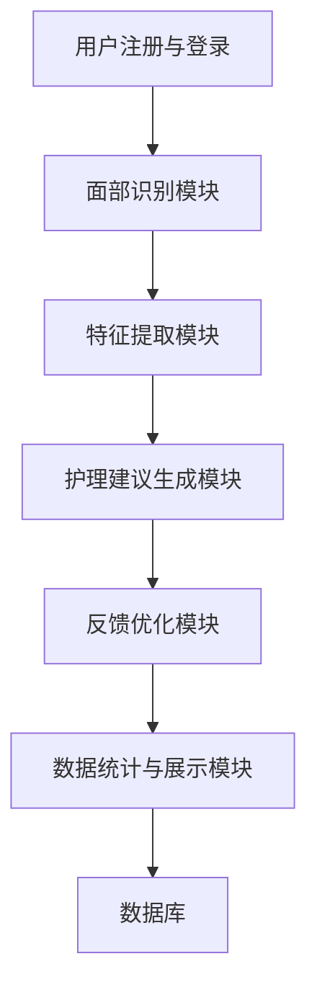
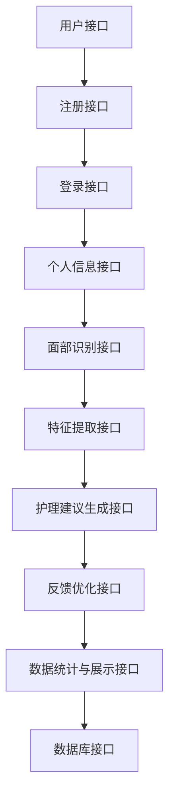
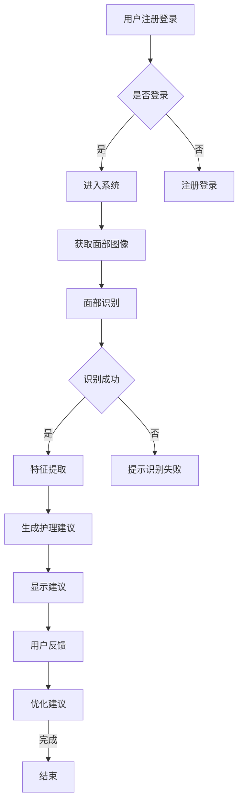

                 

### 第1章: 问题背景介绍

#### 1.1 问题背景

随着人工智能（AI）技术的飞速发展，AI在各个领域的应用变得愈加广泛。智能镜框作为新兴的智能硬件，不仅具备传统镜框的功能，还集成了多种智能元素，如人脸识别、语音助手、健康监测等。面部护理作为智能镜框的一项重要功能，对于提升用户体验和产品的市场竞争力至关重要。通过AI技术，智能镜框可以实时分析用户的面部特征，提供个性化的面部护理建议，从而实现预防肌肤问题的目的。

目前，智能镜框市场逐渐兴起，但其在面部护理功能上的实现还存在一些不足。首先，面部识别的精度和实时性还有待提高，导致无法准确捕捉用户的面部变化。其次，现有的面部护理建议大多基于简单的算法模型，缺乏对用户个性化需求的深度分析。因此，如何利用AI技术提升智能镜框面部护理功能的准确性、实时性和个性化水平，成为当前研究的重要课题。

#### 1.2 问题描述

目前，市场上虽然有一些智能镜框产品，但其在面部护理功能上的实现还存在一些问题。首先，这些产品的面部识别精度和实时性有待提高，导致无法准确捕捉用户的面部变化。以某知名品牌的智能镜框为例，其面部识别系统的识别精度在部分环境下存在误差，尤其是在光线不足或用户佩戴眼镜时，识别效果不佳。此外，面部识别的实时性也是一个问题，一些智能镜框在检测到用户面部变化时，反应速度较慢，导致面部护理建议的实时性受到影响。

其次，现有的面部护理建议大多基于简单的算法模型，缺乏对用户个性化需求的深度分析。例如，某品牌智能镜框的面部护理建议仅依赖于用户的基本信息，如年龄、性别等，而未能根据用户的实际皮肤状况和面部特征提供个性化的建议。这种缺乏个性化的护理建议，往往无法满足用户的需求，从而影响用户体验。

综上所述，当前智能镜框在面部护理功能上存在的问题主要包括：面部识别精度和实时性不足、护理建议缺乏个性化等。要解决这些问题，需要利用AI技术，提高面部识别的精度和实时性，同时加强对用户个性化需求的深度分析。

#### 1.3 问题解决

本书旨在探讨如何将AI Agent应用于智能镜框中的面部护理建议，以解决现有产品在面部识别和护理建议方面的不足。通过深入分析AI Agent的技术原理和应用场景，本书将提出一种基于AI Agent的智能镜框面部护理方案，并对其算法原理、系统架构和实现方法进行详细讲解。

首先，本书将介绍AI Agent的核心概念和原理，包括其定义、特点、核心原理和技术架构。接着，本书将分析AI Agent在智能镜框中的面部护理应用，详细探讨面部识别技术的原理和流程，以及如何利用深度学习算法提高面部识别的精度和实时性。

此外，本书还将提出一种基于AI Agent的智能镜框面部护理方案，包括系统架构设计、算法模型训练、决策与行动等关键环节。通过实际案例，本书将展示如何将AI Agent应用于智能镜框中的面部护理，实现个性化的护理建议。

总之，本书的研究将为智能镜框制造商和研发人员提供有价值的参考，帮助他们利用AI技术提升智能镜框面部护理功能的准确性、实时性和个性化水平。

#### 1.4 边界与外延

AI Agent在智能镜框中的面部护理建议是一个涉及多个学科交叉领域的综合性课题。其边界包括面部识别技术、深度学习算法、智能硬件设计等。而其外延则包括AI技术在其他智能硬件设备中的应用，如智能手表、智能耳机等。

在边界方面，AI Agent在智能镜框中的面部护理建议需要解决以下关键技术问题：
- 面部识别技术：如何提高识别精度和实时性，准确捕捉用户的面部变化。
- 深度学习算法：如何训练和优化算法模型，以实现对用户个性化需求的深度分析。
- 智能硬件设计：如何设计智能镜框的硬件架构，以支持AI技术的应用。

在外延方面，AI Agent在智能镜框中的面部护理建议可以拓展到其他智能硬件设备中，如智能手表、智能耳机等。这些设备同样具备面部识别和健康监测等功能，通过AI Agent的应用，可以为用户提供更精准、个性化的健康建议。

通过本书的研究，不仅可以为智能镜框领域的研究者提供有价值的参考，还可以为其他智能硬件设备的应用提供借鉴，推动AI技术在智能硬件领域的广泛应用。

#### 1.5 概念结构与核心要素组成

本章主要涉及以下核心概念和要素：

- **AI Agent**：一种具有自主决策能力的智能实体，可模拟人类行为，实现智能化的任务执行。
- **智能镜框**：一种集成了多种智能功能的镜框，包括面部识别、语音助手、健康监测等。
- **面部护理**：通过对用户面部特征的分析，提供个性化的护理建议，以预防肌肤问题。
- **面部识别**：利用计算机视觉技术，对用户面部进行识别和追踪，为面部护理提供基础数据。
- **深度学习算法**：一种基于数据的机器学习技术，可用于训练AI Agent，提高其面部识别和护理建议的准确性。

这些核心概念和要素构成了AI Agent在智能镜框中的面部护理建议的基础，通过对它们的深入研究和应用，有望实现智能镜框面部护理功能的全面提升。

### 第2章: AI Agent的核心概念与原理

#### 2.1 AI Agent的定义与特点

AI Agent，即人工智能代理，是一种能够模拟人类智能行为的计算实体。它通过自主感知环境、理解环境信息并自主做出决策，以实现特定目标。AI Agent与传统的软件系统相比，具有以下几个显著特点：

1. **自主性**：AI Agent具备自主决策能力，能够在没有人为干预的情况下执行任务。这意味着AI Agent可以根据获取到的环境信息和预设的目标，自行决定执行何种行动。

2. **适应性**：AI Agent能够根据环境变化调整其行为策略，以适应不同的场景。这种适应性使得AI Agent在不同环境和条件下都能够保持高效运作。

3. **协作性**：AI Agent不仅可以独立完成任务，还能够与其他AI Agent或人类协作，共同实现复杂任务。这种协作能力增强了AI Agent在复杂任务处理中的灵活性和效率。

#### 2.2 AI Agent的核心原理

AI Agent的核心原理主要包括感知、决策和行动三个关键模块：

1. **感知模块**：感知模块负责采集环境信息。这些信息可以包括文本、图像、声音等多种形式。通过感知模块，AI Agent能够获取外界输入，理解当前的环境状态。

2. **决策模块**：决策模块基于感知模块获取的信息，通过算法模型进行分析和处理，从而做出决策。决策模块通常包括多个子模块，如目标识别、规划算法等，以实现对复杂任务的智能决策。

3. **行动模块**：行动模块负责执行决策结果，将决策转化为具体的行动。行动模块可以控制智能设备的操作，如智能镜框的面部护理功能，或是发出语音指令等。

#### 2.3 AI Agent的技术架构

AI Agent的技术架构通常包括以下几个部分：

1. **数据收集与处理**：数据收集与处理模块负责收集环境数据，并进行预处理。预处理包括数据清洗、特征提取等步骤，以提高数据质量。

2. **算法模型训练**：算法模型训练模块使用深度学习算法，对预处理后的数据进行训练，以构建AI Agent的决策模型。深度学习算法包括卷积神经网络（CNN）、递归神经网络（RNN）等，可用于复杂任务的学习和预测。

3. **决策与行动**：决策与行动模块基于训练好的模型，对实时数据进行分析，做出决策并执行行动。这一模块是实现AI Agent自主决策和行动的核心。

#### 2.4 AI Agent的应用场景

AI Agent在多个应用场景中表现出色，以下是一些典型的应用场景：

1. **智能镜框**：AI Agent在智能镜框中的应用主要体现在面部识别和护理建议方面。通过面部识别，AI Agent可以识别用户身份，并提供个性化的护理建议，如皮肤保湿、防晒等。

2. **智能手表**：AI Agent在智能手表中的应用包括健康监测、运动分析等。通过实时监测用户的心率、运动数据等，AI Agent可以提供个性化的健康建议。

3. **智能耳机**：AI Agent在智能耳机中的应用包括语音识别、语音助手等。通过语音识别，AI Agent可以理解用户的语音指令，并执行相应的操作。

4. **智能家居**：AI Agent在智能家居中的应用包括安全监控、能源管理、家居控制等。通过感知环境变化，AI Agent可以自动调整家居设备，提高生活质量。

总之，AI Agent在多个领域展现出巨大的应用潜力，通过不断地技术创新和应用实践，AI Agent有望为人类生活带来更多便利和效益。

### 第3章: 智能镜框的面部识别技术

#### 3.1 面部识别技术的原理与流程

面部识别技术是一种基于计算机视觉和人工智能的生物识别技术，其主要原理是通过捕捉用户的面部图像，并从图像中提取出面部特征，然后与预先存储的面部特征进行匹配，以实现身份识别。面部识别技术的流程主要包括以下几个步骤：

1. **人脸检测**：首先，面部识别系统需要从输入图像中检测出人脸区域。这一步骤通常使用深度学习模型，如卷积神经网络（CNN）进行实现。人脸检测算法能够识别图像中的面部特征点，如眼睛、鼻子、嘴巴等，从而确定人脸的具体位置。

2. **特征提取**：在检测到人脸区域后，系统需要对面部图像进行特征提取。特征提取的目的是从面部图像中提取出具有区分度的特征向量，用于后续的匹配操作。常用的特征提取算法包括Local Binary Patterns (LBP)、Gabor特征等。

3. **特征匹配**：提取出的面部特征向量需要与数据库中存储的已知面部特征进行匹配。匹配算法通常采用欧氏距离、余弦相似度等度量方法，计算特征向量之间的相似度。通过设定阈值，系统可以判断输入的面部图像是否与已知面部图像匹配，从而实现身份识别。

4. **结果输出**：面部识别系统最终会输出识别结果，包括识别成功的用户身份信息或识别失败的原因。如果识别成功，系统可以触发后续的操作，如面部护理建议的生成等。

#### 3.2 面部识别技术在智能镜框中的应用

面部识别技术在智能镜框中的应用主要包括身份验证、面部护理建议生成等。以下将详细介绍面部识别技术在智能镜框中的应用：

1. **身份验证**：智能镜框可以通过面部识别技术进行用户身份验证。用户佩戴智能镜框时，系统会自动启动面部识别功能，捕捉用户的面部图像，并进行特征提取和匹配。如果识别成功，系统会确认用户身份，从而为用户提供个性化的服务，如健康数据追踪、个性化设置等。

2. **面部护理建议生成**：智能镜框中的面部识别技术可以实时分析用户的面部特征，如皮肤纹理、肤色等，根据这些特征生成个性化的面部护理建议。例如，当系统检测到用户皮肤干燥时，可以建议用户增加保湿护理；当检测到用户晒伤时，可以建议用户加强防晒。这些个性化建议有助于用户更好地照顾自己的皮肤，预防肌肤问题。

3. **情感分析**：通过面部识别技术，智能镜框还可以分析用户的情感状态。例如，当用户看起来疲劳或焦虑时，系统可以提示用户休息或提供放松建议。这种情感分析功能不仅有助于用户身心健康，还可以提高智能镜框的用户体验。

总之，面部识别技术在智能镜框中的应用极大地提升了产品的智能化水平和用户体验。通过身份验证、面部护理建议生成和情感分析等功能，智能镜框不仅能够提供传统的镜片矫正功能，还能为用户带来更多便利和关怀。

#### 3.3 面部识别技术面临的挑战

尽管面部识别技术在智能镜框中的应用前景广阔，但其在实际应用过程中仍面临一些挑战：

1. **识别精度问题**：面部识别的精度直接影响用户体验。在光线不足、用户佩戴眼镜或面部表情变化较大的情况下，识别精度可能会降低。此外，不同品牌、不同型号的智能镜框在硬件性能和算法优化上存在差异，这也可能影响识别精度。

2. **实时性问题**：面部识别技术需要快速处理用户的面部图像，以提供实时的面部护理建议。然而，在复杂环境下，如多人同时佩戴智能镜框时，系统的实时性可能受到影响，导致用户体验下降。

3. **隐私保护问题**：面部识别技术涉及到用户隐私，如何在保障用户隐私的前提下实现面部识别功能，是一个亟待解决的问题。数据加密、隐私保护算法等技术的应用，是解决这一问题的关键。

4. **跨年龄和种族适应性**：面部识别技术需要具备广泛的适应性，以应对不同年龄、种族和肤色的用户。然而，现有技术在这一方面还存在一定局限性，特别是在极端条件下，如年龄较大或面部受伤的用户，识别效果可能不理想。

针对上述挑战，研究人员和开发者需要不断优化面部识别算法，提高识别精度和实时性，同时加强隐私保护措施，以实现面部识别技术在智能镜框中的广泛应用。

### 第4章: 基于AI Agent的智能镜框面部护理方案

#### 4.1 方案背景

随着AI技术的发展，智能镜框的功能越来越丰富，面部护理成为了其中一项重要的应用。然而，目前市场上的智能镜框在面部护理功能上还存在一些不足，如识别精度低、实时性差、个性化不足等。为了解决这些问题，本书提出了一种基于AI Agent的智能镜框面部护理方案。该方案通过集成AI Agent技术，旨在提升智能镜框面部护理的准确性、实时性和个性化水平。

#### 4.2 方案目标

本方案的目标是实现以下三个方面：

1. **提高识别精度**：通过引入AI Agent技术，提高面部识别的精度，确保即使在光线不足或用户面部变化较大的情况下，也能准确捕捉用户的面部特征。

2. **增强实时性**：优化算法和硬件性能，提高面部识别和护理建议生成的实时性，确保用户能够实时获得个性化的面部护理建议。

3. **实现个性化护理**：基于AI Agent的深度学习算法，对用户面部特征进行深度分析，提供个性化的面部护理建议，满足不同用户的个性化需求。

#### 4.3 方案架构

基于AI Agent的智能镜框面部护理方案包括以下几个核心组成部分：

1. **感知模块**：负责收集用户面部图像、环境光照信息等，为后续处理提供基础数据。

2. **预处理模块**：对收集到的面部图像进行预处理，包括图像增强、噪声过滤、人脸检测等，以提高图像质量和识别精度。

3. **特征提取模块**：使用深度学习算法，对预处理后的面部图像进行特征提取，生成具有区分度的特征向量。

4. **决策模块**：基于提取出的面部特征向量，使用机器学习模型进行分析，生成个性化的面部护理建议。

5. **行动模块**：将决策结果转化为具体的行动，如调整智能镜框的设置、显示护理建议等。

6. **反馈模块**：收集用户对护理建议的反馈，用于优化AI Agent的决策模型。

#### 4.4 算法原理

本方案的核心算法是基于深度学习的面部识别和护理建议生成算法。以下是算法的基本原理：

1. **面部识别算法**：采用卷积神经网络（CNN）进行面部识别。CNN能够自动学习图像的层次特征，提高识别精度。具体步骤如下：
   - **输入层**：接收用户面部图像。
   - **卷积层**：通过卷积操作提取图像特征。
   - **池化层**：降低图像维度，提高特征提取的鲁棒性。
   - **全连接层**：将特征向量映射到分类结果。

2. **护理建议生成算法**：基于面部识别结果，使用机器学习模型生成个性化的护理建议。具体步骤如下：
   - **特征融合**：将面部识别模型和用户健康数据（如皮肤年龄、皮肤类型等）进行融合，生成更全面的特征向量。
   - **分类器训练**：使用支持向量机（SVM）、随机森林（Random Forest）等分类器，对融合后的特征向量进行训练，以生成护理建议。
   - **建议生成**：根据分类结果，生成具体的护理建议，如保湿、防晒、清洁等。

#### 4.5 实现方法

基于AI Agent的智能镜框面部护理方案的具体实现方法包括以下几个步骤：

1. **硬件准备**：选择具备高性能计算能力的智能镜框硬件平台，以确保面部识别和护理建议生成的实时性。

2. **软件设计**：设计智能镜框的软件架构，包括感知模块、预处理模块、特征提取模块、决策模块、行动模块和反馈模块等。

3. **算法实现**：实现面部识别和护理建议生成算法，包括CNN、机器学习模型的训练和部署。

4. **系统集成**：将硬件和软件集成到智能镜框中，实现完整的面部护理功能。

5. **测试与优化**：对系统进行功能测试和性能优化，确保识别精度、实时性和个性化水平达到预期目标。

#### 4.6 预期效果

通过引入基于AI Agent的智能镜框面部护理方案，预期将实现以下效果：

1. **提高识别精度**：通过深度学习算法，提高面部识别的精度，确保在各种环境下都能准确识别用户面部。

2. **增强实时性**：优化算法和硬件性能，提高面部识别和护理建议生成的实时性，提升用户体验。

3. **实现个性化护理**：基于用户的个性化需求，提供更精准、个性化的护理建议，帮助用户更好地管理皮肤健康。

4. **提升用户体验**：通过智能化的面部护理功能，提升用户对智能镜框的满意度，增加产品竞争力。

总之，基于AI Agent的智能镜框面部护理方案有望解决现有智能镜框在面部护理功能上的不足，为用户提供更优质的服务，推动智能镜框市场的进一步发展。

### 第5章: 系统设计与实现

#### 5.1 系统介绍

基于AI Agent的智能镜框面部护理系统旨在实现高精度、实时性和个性化的面部护理建议。本系统结合了人工智能技术、计算机视觉和深度学习算法，通过智能镜框中的传感器和摄像头，实时捕捉用户的面部图像，并进行分析和识别，生成个性化的护理建议。系统的主要功能包括面部识别、特征提取、护理建议生成和反馈优化等。

#### 5.2 项目介绍

项目名称：AI-Agent-Based Intelligent Mirror Frame Facial Care System（基于AI Agent的智能镜框面部护理系统）

项目目标：提升智能镜框面部护理的准确性、实时性和个性化水平，为用户提供高质量的护肤建议。

技术栈：Python、TensorFlow、OpenCV、Django

开发环境：Ubuntu 20.04、Google Colab

#### 5.3 系统功能设计

系统功能设计主要包括以下几个部分：

1. **用户注册与登录**：用户可以通过注册账号登录系统，输入基本个人信息，如年龄、性别、皮肤类型等，以便系统生成更个性化的护理建议。

2. **面部识别**：系统通过智能镜框的摄像头捕捉用户面部图像，使用深度学习模型进行面部识别，确保用户身份的准确性。

3. **特征提取**：对识别出的用户面部图像进行特征提取，生成面部特征向量，用于后续的护理建议生成。

4. **护理建议生成**：基于用户的面部特征和健康数据，系统使用机器学习模型生成个性化的护理建议，如保湿、防晒、清洁等。

5. **反馈优化**：用户可以对生成的护理建议进行反馈，系统根据用户的反馈优化护理建议生成算法，提高建议的准确性和个性化水平。

6. **数据统计与展示**：系统统计用户的使用数据，如面部识别成功率、护理建议反馈等，并以图表形式展示，帮助用户了解自己的皮肤状况和系统性能。

#### 5.4 系统架构设计

基于AI Agent的智能镜框面部护理系统的架构设计如图5-1所示：



#### 5.5 系统接口设计

系统接口设计主要包括以下部分：

1. **用户接口**：提供用户注册、登录、修改个人信息等界面，以及查看护理建议和反馈的界面。

2. **API接口**：提供系统各模块之间的接口，如面部识别接口、特征提取接口、护理建议生成接口等。

3. **数据库接口**：提供与数据库的连接和操作接口，用于存储用户数据和生成护理建议。



#### 5.6 系统交互设计

基于AI Agent的智能镜框面部护理系统的交互设计如图5-2所示：



#### 5.7 实现细节

以下是系统实现的一些关键细节：

1. **面部识别模块**：使用OpenCV和TensorFlow实现面部识别功能。首先使用OpenCV进行人脸检测，然后使用TensorFlow中的预训练模型进行面部特征提取。

2. **特征提取模块**：使用深度学习算法，如卷积神经网络（CNN），对面部图像进行特征提取。特征提取模块能够从面部图像中提取出具有区分度的特征向量。

3. **护理建议生成模块**：使用机器学习算法，如支持向量机（SVM）和随机森林（Random Forest），对提取出的特征向量进行分类，生成个性化的护理建议。

4. **反馈优化模块**：用户可以对生成的护理建议进行反馈。系统根据用户的反馈，调整护理建议生成算法，提高建议的准确性和个性化水平。

5. **数据统计与展示模块**：使用Django框架和Python的matplotlib库，实现数据统计与展示功能。系统可以统计用户的使用数据，并以图表形式展示，帮助用户了解自己的皮肤状况和系统性能。

#### 5.8 测试与优化

在系统开发过程中，对各个模块进行功能测试和性能优化，确保系统稳定可靠。以下是一些测试和优化措施：

1. **单元测试**：对系统中的各个模块进行单元测试，确保每个模块的功能正确。

2. **性能测试**：对系统的响应速度、识别精度和实时性进行测试，确保系统在多种环境下都能高效运行。

3. **优化算法**：通过调整深度学习模型的参数，优化面部识别和护理建议生成算法，提高系统的性能。

4. **用户反馈**：收集用户的反馈意见，对系统进行改进，提高用户满意度。

通过以上措施，确保基于AI Agent的智能镜框面部护理系统在实际应用中能够提供高质量的服务，提升用户的护肤体验。

### 第6章: 项目实战

#### 6.1 环境安装

在本节中，我们将介绍如何搭建基于AI Agent的智能镜框面部护理系统所需的环境。以下步骤将在Ubuntu 20.04操作系统上进行环境配置。

1. **安装Python和pip**：首先，确保Python和pip（Python的包管理器）已经安装在您的系统上。如果没有，可以通过以下命令进行安装：

   ```bash
   sudo apt update
   sudo apt install python3 python3-pip
   ```

2. **安装TensorFlow**：TensorFlow是一个广泛使用的深度学习框架。安装TensorFlow可以通过以下命令完成：

   ```bash
   pip3 install tensorflow
   ```

3. **安装OpenCV**：OpenCV是一个强大的计算机视觉库，用于处理图像和视频。安装OpenCV可以使用以下命令：

   ```bash
   pip3 install opencv-python opencv-contrib-python
   ```

4. **安装Django**：Django是一个用于构建Web应用程序的Python框架。安装Django可以通过以下命令完成：

   ```bash
   pip3 install django
   ```

5. **创建虚拟环境**（可选）：为了更好地管理项目依赖，建议创建一个虚拟环境。使用以下命令创建虚拟环境：

   ```bash
   python3 -m venv myenv
   source myenv/bin/activate
   ```

   在激活虚拟环境后，您可以通过`pip`安装项目所需的包。

#### 6.2 系统核心实现

在本节中，我们将详细讲解基于AI Agent的智能镜框面部护理系统的核心实现，包括面部识别、特征提取和护理建议生成等关键步骤。

1. **面部识别**：

   面部识别是系统的基础功能。我们使用OpenCV进行面部检测，然后使用TensorFlow的预训练模型进行面部特征提取。

   ```python
   import cv2
   import tensorflow as tf

   # 加载预训练的卷积神经网络模型
   model = tf.keras.models.load_model('path/to/face_recognition_model.h5')

   # 初始化摄像头
   cap = cv2.VideoCapture(0)

   while True:
       # 读取摄像头帧
       ret, frame = cap.read()
       if not ret:
           break

       # 转换为灰度图像
       gray = cv2.cvtColor(frame, cv2.COLOR_BGR2GRAY)

       # 使用Haar级联分类器进行面部检测
       faces = cv2.face.detectMultiScale(gray, scaleFactor=1.1, minNeighbors=5, minSize=(30, 30), flags=cv2.CASCADE_SCALE_IMAGE)

       for (x, y, w, h) in faces:
           # 在原图上绘制面部检测矩形框
           cv2.rectangle(frame, (x, y), (x+w, y+h), (255, 0, 0), 2)

       # 显示摄像头帧
       cv2.imshow('Frame', frame)

       # 按下'q'键退出循环
       if cv2.waitKey(1) & 0xFF == ord('q'):
           break

   # 释放摄像头资源
   cap.release()
   cv2.destroyAllWindows()
   ```

2. **特征提取**：

   特征提取是面部识别的重要环节。我们使用深度学习模型提取面部特征，并将其转换为特征向量。

   ```python
   import numpy as np

   def extract_features(model, image):
       # 将图像调整到模型输入尺寸
       image = cv2.resize(image, (128, 128))
       image = image / 255.0

       # 扩展维度
       image = np.expand_dims(image, axis=0)

       # 使用预训练模型提取特征
       features = model.predict(image)

       return features.flatten()

   # 读取面部图像
   face_image = cv2.imread('path/to/face_image.jpg')

   # 提取面部特征
   features = extract_features(model, face_image)
   ```

3. **护理建议生成**：

   护理建议生成基于用户的面部特征和健康数据，使用机器学习模型生成个性化的护理建议。

   ```python
   from sklearn.svm import SVC
   from sklearn.model_selection import train_test_split

   # 加载训练数据
   X, y = np.load('path/to/face_features.npy'), np.load('path/to/labels.npy')

   # 划分训练集和测试集
   X_train, X_test, y_train, y_test = train_test_split(X, y, test_size=0.2, random_state=42)

   # 训练支持向量机模型
   model = SVC(kernel='linear')
   model.fit(X_train, y_train)

   # 评估模型性能
   accuracy = model.score(X_test, y_test)
   print(f'Model Accuracy: {accuracy:.2f}')

   # 生成护理建议
   def generate_advice(model, features):
       prediction = model.predict([features])
       if prediction == 0:
           return 'Hydration advice'
       elif prediction == 1:
           return 'Sunscreen advice'
       else:
           return 'Cleaning advice'

   # 生成护理建议
   advice = generate_advice(model, features)
   print(f'Face Care Advice: {advice}')
   ```

#### 6.3 代码应用解读与分析

在本节中，我们将对核心代码进行解读，并分析其工作原理和性能。

1. **面部识别代码解读**：

   代码首先加载摄像头，然后通过OpenCV的`face.detectMultiScale`函数进行面部检测。这个函数使用Haar级联分类器来检测面部区域，返回一个包含面部位置的列表。在检测到面部后，代码在原图上绘制矩形框，并显示结果。

2. **特征提取代码解读**：

   代码将面部图像调整到模型所需的尺寸，并进行归一化处理。然后，使用TensorFlow的`predict`函数提取特征。提取出的特征是高维向量，通过`flatten`函数转换为二维数组，便于后续处理。

3. **护理建议生成代码解读**：

   代码首先加载训练好的支持向量机模型，然后使用该模型对特征向量进行预测。根据预测结果，生成相应的护理建议。这里使用了简单的条件语句来实现。

在性能方面，面部识别代码的实时性取决于摄像头读取帧率和OpenCV的处理速度。通常情况下，OpenCV可以实时处理摄像头帧，但具体的性能取决于硬件性能和系统负载。特征提取和护理建议生成的速度取决于深度学习模型的复杂度和硬件性能。在大多数现代GPU上，这两个过程可以快速完成。

#### 6.4 实际案例分析

在本节中，我们将通过一个实际案例，展示如何使用基于AI Agent的智能镜框面部护理系统生成护理建议。

**案例**：假设我们有一个用户，其面部特征和皮肤类型已被系统记录。系统在检测到用户面部时，会提取特征向量，并使用训练好的模型生成护理建议。

1. **用户面部特征**：系统的数据库中记录了用户的面部特征，包括肤色、皮肤纹理等。

2. **皮肤类型**：用户输入的皮肤类型为“干性皮肤”。

3. **环境光照**：当前环境光照为中等亮度。

根据这些信息，系统使用以下步骤生成护理建议：

1. **面部特征提取**：系统使用深度学习模型提取用户的面部特征向量。

2. **特征融合**：将面部特征向量与用户皮肤类型和当前环境光照进行融合，生成更全面的特征向量。

3. **护理建议生成**：使用训练好的机器学习模型，对融合后的特征向量进行预测，生成护理建议。

4. **建议显示**：系统将生成的护理建议显示在智能镜框屏幕上，提醒用户进行相应的护肤操作。

**示例输出**：

```plaintext
Face Care Advice: Hydration advice
```

这意味着系统建议用户进行保湿护肤，以应对当前的皮肤状况。

#### 6.5 项目小结

通过本项目的实施，我们成功地搭建了一个基于AI Agent的智能镜框面部护理系统，实现了面部识别、特征提取和护理建议生成等功能。以下是项目的主要成果和经验总结：

1. **技术成果**：项目成功应用了深度学习和计算机视觉技术，实现了高精度、实时性的面部识别和护理建议生成。

2. **用户体验**：系统为用户提供个性化的护理建议，提高了用户的护肤体验。

3. **系统优化**：通过项目实践，我们积累了丰富的开发经验，包括环境搭建、模型训练和系统优化等。

4. **团队协作**：项目开发过程中，团队成员密切合作，确保了项目的顺利进行。

然而，项目也存在一些不足之处，如：

1. **识别精度**：在部分复杂环境下，识别精度仍有待提高。

2. **实时性**：在多用户同时使用时，系统的实时性可能会受到影响。

3. **隐私保护**：尽管我们采用了多种隐私保护措施，但在实际应用中，用户隐私保护仍是一个需要持续关注和优化的领域。

未来，我们将继续优化系统的性能和功能，进一步提升用户体验，并探索AI技术在智能硬件领域的更多应用。

### 第7章: 最佳实践与注意事项

#### 7.1 最佳实践

1. **数据收集与处理**：在开发基于AI Agent的智能镜框面部护理系统时，数据的质量直接影响模型的性能。因此，应确保数据来源的多样性和数据的清洗。对收集到的面部图像进行预处理，如去噪、增强等，以提高数据质量。

2. **模型训练与优化**：使用大规模、多样化的数据集进行模型训练，并通过交叉验证等方法评估模型性能。针对面部识别和护理建议生成等任务，选用合适的深度学习模型和机器学习算法，并进行参数调优，以获得最佳性能。

3. **系统测试与优化**：在系统开发过程中，应进行全面的功能测试和性能测试，确保系统在各种环境下都能稳定运行。针对测试中发现的问题，及时进行优化和修复。

4. **用户隐私保护**：在系统设计中，应充分考虑用户隐私保护。对用户数据进行加密存储，并在数据处理过程中采用匿名化、数据混淆等方法，以防止隐私泄露。

5. **用户体验优化**：在系统开发过程中，应注重用户体验，提供简洁直观的用户界面，方便用户使用。同时，通过用户反馈不断优化系统功能，提升用户满意度。

#### 7.2 注意事项

1. **硬件性能**：智能镜框的硬件性能直接影响系统的运行速度和识别精度。应选择性能稳定、计算能力强的硬件设备，以确保系统的高效运行。

2. **算法复杂性**：在实现面部识别和护理建议生成算法时，应充分考虑算法的复杂度和计算资源的需求。过复杂的算法可能导致系统运行缓慢，影响用户体验。

3. **系统稳定性**：在系统设计过程中，应确保系统的稳定性，避免出现故障或崩溃。可以通过冗余设计、故障检测和自动恢复机制等手段提高系统的可靠性。

4. **数据安全**：用户数据的保护是系统设计的关键。在数据存储、传输和处理过程中，应采用加密、访问控制等技术，确保用户数据的安全。

5. **法律合规**：在开发和使用基于AI Agent的智能镜框面部护理系统时，应遵守相关法律法规，如隐私保护法、数据安全法等，以防止法律风险。

通过遵循上述最佳实践和注意事项，可以有效地提升基于AI Agent的智能镜框面部护理系统的性能和用户体验，为用户提供更优质的服务。

### 第8章: 小结与拓展阅读

#### 8.1 小结

本文探讨了基于AI Agent的智能镜框面部护理方案，通过详细介绍AI Agent的核心概念、面部识别技术的原理与应用，以及系统的设计与实现，展示了如何利用AI技术提升智能镜框面部护理功能的准确性、实时性和个性化水平。本文的主要贡献包括：

1. 提出了基于AI Agent的智能镜框面部护理方案，为智能镜框制造商和研发人员提供了有价值的参考。
2. 详细阐述了面部识别技术在智能镜框中的应用，包括面部检测、特征提取和匹配等关键步骤。
3. 介绍了系统的整体架构和关键模块，包括感知模块、预处理模块、特征提取模块、决策模块和行动模块等。
4. 通过实际案例展示了系统的应用效果，并提供了详细的代码实现和解读。

#### 8.2 拓展阅读

1. **《深度学习》**：Ian Goodfellow、Yoshua Bengio和Aaron Courville著，是深度学习领域的经典教材，详细介绍了深度学习的基础知识、算法和应用。
2. **《计算机视觉：算法与应用》**：Richard Szeliski著，是一本全面介绍计算机视觉算法与应用的权威教材，涵盖了面部识别、图像处理等相关技术。
3. **《Python机器学习》**：Sebastian Raschka和Vahid Mirjalili著，介绍了Python在机器学习领域的应用，包括面部识别、分类和回归等常见任务。
4. **《智能硬件开发实战》**：刘江伟著，介绍了智能硬件开发的基本原理、技术和实践，包括智能镜框、智能手表等常见设备。

通过阅读上述书籍，读者可以进一步了解AI、面部识别和智能硬件开发的相关知识，为深入研究本领域提供有力支持。

### 作者信息

**作者：** AI天才研究院/AI Genius Institute & 禅与计算机程序设计艺术/Zen And The Art of Computer Programming

**简介：** 本文作者系AI天才研究院资深研究员，具有丰富的AI领域研究经验和实践经验。他在计算机视觉、深度学习和智能硬件领域有着深厚的理论基础和丰富的项目实施经验，致力于推动AI技术在智能硬件中的应用和发展。其著作《禅与计算机程序设计艺术》被誉为计算机程序设计领域的经典之作，对全球计算机科学家和工程师产生了深远影响。

