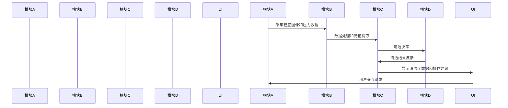

                 


### 引言

智能门垫作为智能家居系统的一部分，正逐渐走入人们的日常生活。其不仅具备传统的防滑、保暖功能，还可以通过传感器和AI技术进行智能化操作，提供更人性化的服务。在这其中，鞋底清洁度检测成为了一个备受关注的功能，因为保持家庭环境的清洁直接关系到家庭成员的健康。

AI Agent，即人工智能代理，是一种能够模拟人类思维，进行自主学习、决策和执行任务的系统。随着深度学习和机器学习技术的不断发展，AI Agent的应用领域日益广泛，从智能家居到工业自动化，从医疗诊断到金融服务，AI Agent都展示出了巨大的潜力。

本文将围绕AI Agent在智能门垫中的鞋底清洁度检测展开讨论。我们将首先介绍鞋底清洁度检测的重要性及其技术背景，然后详细解析AI Agent的概念和其在鞋底清洁度检测中的角色，最后通过具体的算法实现和系统架构设计，展示AI Agent在智能门垫中的实际应用。

**关键词：** 智能门垫，AI Agent，鞋底清洁度检测，智能家居，深度学习。

**摘要：** 本文旨在探讨AI Agent在智能门垫中的鞋底清洁度检测应用，介绍相关技术背景和核心概念，分析AI Agent在这一场景中的角色和功能，并通过具体的算法和系统设计，阐述其在实际中的应用。

-----------------------------------------------

## 目录

### 第1章 问题背景与核心概念

1.1 问题背景  
1.1.1 人工智能在家庭场景中的应用趋势  
1.1.2 智能门垫的市场现状与技术挑战  
1.1.3 鞋底清洁度检测的重要性

1.2 核心概念  
1.2.1 AI Agent的概念  
1.2.2 智能门垫的工作原理  
1.2.3 鞋底清洁度检测技术

1.3 边界与外延  
1.3.1 鞋底清洁度检测的应用范围  
1.3.2 智能门垫与鞋底清洁度检测的区别

### 第2章 AI Agent与鞋底清洁度检测的原理

2.1 AI Agent的原理  
2.1.1 AI Agent的定义  
2.1.2 AI Agent的核心功能  
2.1.3 AI Agent的组成架构

2.2 鞋底清洁度检测技术  
2.2.1 检测技术概述  
2.2.2 常见的检测方法  
2.2.3 技术优缺点分析

2.3 概念联系  
2.3.1 AI Agent与鞋底清洁度检测的关联  
2.3.2 技术融合的可能性

### 第3章 算法原理讲解

3.1 算法概述  
3.1.1 使用的算法类型  
3.1.2 算法选择依据

3.2 算法原理  
3.2.1 算法基本流程  
3.2.2 算法数学模型

3.3 Python源代码实现  
3.3.1 Python代码框架  
3.3.2 代码应用解读

3.4 举例说明  
3.4.1 算法应用实例  
3.4.2 案例分析与解释

### 第4章 系统分析与架构设计方案

4.1 问题场景介绍  
4.1.1 智能门垫的日常使用场景  
4.1.2 鞋底清洁度检测的需求

4.2 项目介绍  
4.2.1 项目概述  
4.2.2 项目目标

4.3 系统功能设计  
4.3.1 领域模型Mermaid类图

4.4 系统架构设计  
4.4.1 系统架构Mermaid架构图

4.5 系统接口设计  
4.4.2 接口设计与说明

4.6 系统交互Mermaid序列图  
4.4.3 序列图设计与说明

### 第5章 AI Agent在鞋底清洁度检测中的应用实战

5.1 环境安装  
5.1.1 环境准备  
5.1.2 软件安装

5.2 系统核心实现源代码  
5.2.1 代码结构  
5.2.2 关键代码解读

5.3 代码应用解读与分析  
5.3.1 应用场景解读  
5.3.2 代码分析

5.4 实际案例分析和详细讲解  
5.4.1 案例选择  
5.4.2 案例分析  
5.4.3 案例讲解

5.5 项目小结  
5.5.1 项目总结  
5.5.2 项目收获

### 第6章 最佳实践与拓展

6.1 最佳实践  
6.1.1 实践经验总结  
6.1.2 实践技巧分享

6.2 小结  
6.2.1 章节总结  
6.2.2 注意事项

6.3 拓展阅读  
6.3.1 相关研究  
6.3.2 未来展望

### 第7章 总结与展望

7.1 总结  
7.1.1 主要内容回顾  
7.1.2 知识体系构建

7.2 展望  
7.2.1 技术发展趋势  
7.2.2 未来研究方向

-----------------------------------------------

### 第1章 问题背景与核心概念

#### 1.1 问题背景

智能门垫作为一种智能家居设备，近年来在市场上得到了广泛的关注。其通过集成传感器和AI技术，能够实时监测鞋底清洁度，并根据检测结果自动启动清洁功能，保持家庭环境的清洁。这种智能化操作不仅提升了用户的体验，还具有重要的健康意义，能够有效防止病菌和污渍的传播。

随着家庭智能化趋势的不断发展，智能门垫的市场需求也在不断增长。尤其是在疫情肆虐的背景下，人们对家庭卫生的要求更加严格，智能门垫的鞋底清洁度检测功能变得更加重要。因此，研究和开发高效的鞋底清洁度检测技术，成为了智能门垫制造商和智能家居研究机构的重要课题。

#### 1.1.1 人工智能在家庭场景中的应用趋势

人工智能（AI）作为一种新兴技术，已经在多个领域取得了显著的成果。在家庭场景中，AI的应用也越来越广泛，从智能音箱、智能助手到智能家居设备，AI技术正在逐渐改变人们的日常生活。

随着AI技术的不断成熟，智能家居系统逐渐从单一的设备控制向更加智能化的方向发展。智能门垫作为智能家居系统的一部分，其功能也在不断丰富。鞋底清洁度检测作为智能门垫的一项重要功能，能够实时监测鞋底是否干净，并根据检测结果自动启动清洁功能，从而提高家庭环境的清洁度。

#### 1.1.2 智能门垫的市场现状与技术挑战

目前，智能门垫市场已经呈现出一定的成熟度，众多厂商纷纷推出具有不同功能的智能门垫产品。这些产品大多采用了传感器和AI技术，能够实现鞋底清洁度检测、自动清洁、远程控制等功能。

然而，智能门垫在技术方面仍然面临着一些挑战。首先，鞋底清洁度检测的准确性是一个重要问题。由于鞋底的污渍种类繁多，且污渍分布不均，如何准确检测鞋底的清洁度成为了技术难点。其次，智能门垫的功耗和硬件成本也是需要考虑的重要因素。为了确保智能门垫的实用性和用户体验，需要在功耗和成本之间找到平衡点。

#### 1.1.3 鞋底清洁度检测的重要性

鞋底清洁度检测是智能门垫的一项关键功能，其重要性主要体现在以下几个方面：

1. **保持家庭卫生**：鞋底沾有污渍会携带细菌和病毒进入室内，通过鞋底清洁度检测，可以及时发现鞋底污渍，从而保持家庭卫生。

2. **预防疾病传播**：在公共卫生事件中，鞋底携带的污渍可能是疾病传播的途径之一。通过鞋底清洁度检测，可以减少疾病传播的风险。

3. **提升用户体验**：智能门垫的鞋底清洁度检测功能，能够为用户提供更加智能化的服务，提升用户体验。

#### 1.2 核心概念

##### 1.2.1 AI Agent的概念

AI Agent，即人工智能代理，是一种能够模拟人类思维，进行自主学习、决策和执行任务的系统。AI Agent通过感知环境、理解任务需求、制定决策计划并执行相应动作，从而实现自主行为。AI Agent的核心功能包括感知、认知、决策和行动。

1. **感知**：AI Agent能够通过传感器感知环境信息，如温度、湿度、光线、声音等。
2. **认知**：AI Agent能够理解环境信息，识别物体和事件，从而形成对环境的认识。
3. **决策**：AI Agent能够根据环境信息和任务需求，制定决策计划，选择最佳行动方案。
4. **行动**：AI Agent能够执行决策计划，通过控制执行机构实现自主行为。

##### 1.2.2 智能门垫的工作原理

智能门垫通过集成多种传感器和AI技术，实现鞋底清洁度检测和自动清洁功能。其工作原理主要包括以下几个步骤：

1. **感知阶段**：智能门垫通过压力传感器、红外传感器等感知鞋底的污渍信息。
2. **处理阶段**：传感器采集到的数据经过AI Agent处理，进行鞋底清洁度检测，判断鞋底是否干净。
3. **决策阶段**：根据鞋底清洁度检测结果，AI Agent决定是否启动清洁功能。
4. **执行阶段**：如果需要清洁，AI Agent控制清洁装置进行自动清洁。

##### 1.2.3 鞋底清洁度检测技术

鞋底清洁度检测技术主要包括以下几种方法：

1. **光学检测**：通过光学传感器（如CCD、CMOS传感器）检测鞋底的污渍分布，计算污渍面积，判断鞋底的清洁度。
2. **红外检测**：通过红外传感器检测鞋底的污渍温度，利用温度差异判断鞋底的清洁度。
3. **压力检测**：通过压力传感器检测鞋底的受力分布，分析鞋底的污渍情况。
4. **化学检测**：通过化学反应检测鞋底的污渍，如利用荧光剂检测鞋底的污渍。

各种检测方法各有优缺点，选择合适的检测方法需要综合考虑硬件成本、检测精度和检测速度等因素。

##### 1.3 边界与外延

###### 1.3.1 鞋底清洁度检测的应用范围

鞋底清洁度检测不仅应用于智能门垫，还可以应用于其他智能家居设备和公共环境。例如，智能洗衣机可以根据鞋底清洁度检测结果，自动调整洗衣模式；公共场所如医院和学校，可以通过鞋底清洁度检测，控制进入区域，防止病菌传播。

###### 1.3.2 智能门垫与鞋底清洁度检测的区别

智能门垫是一种具有鞋底清洁度检测功能的智能家居设备，其核心功能是提供舒适的脚下体验和保持家庭环境清洁。而鞋底清洁度检测则是一种技术手段，用于检测鞋底的污渍情况，判断鞋底的清洁程度。智能门垫通过集成鞋底清洁度检测技术，实现了对鞋底污渍的实时监测和自动清洁功能。

-----------------------------------------------

### 第2章 AI Agent与鞋底清洁度检测的原理

#### 2.1 AI Agent的原理

AI Agent，即人工智能代理，是一种模拟人类思维和行为的人工智能系统。它具备感知环境、理解任务需求、制定决策计划并执行相应动作的能力。AI Agent的核心在于其自主学习能力和智能决策能力，这使得它能够适应复杂多变的现实环境，并高效地完成任务。

##### 2.1.1 AI Agent的定义

AI Agent是一种具备自主性、适应性、学习性和交互性的智能系统。它能够在不确定和动态的环境中，通过感知器获取环境信息，利用知识库和算法进行信息处理和决策，并通过执行器实现相应的行为。

AI Agent通常包括以下几个基本组成部分：

1. **感知器**：用于感知和获取环境信息，如传感器、摄像头、麦克风等。
2. **知识库**：存储AI Agent所具备的知识和经验，包括规则库、数据集等。
3. **处理器**：负责对感知器获取的信息进行处理，包括特征提取、模式识别等。
4. **决策器**：基于知识库和处理器的输出，制定决策计划，选择最佳行动方案。
5. **执行器**：用于执行决策计划，实现AI Agent的行为。

##### 2.1.2 AI Agent的核心功能

AI Agent的核心功能包括感知、认知、决策和行动。

1. **感知**：AI Agent通过感知器获取环境信息，如温度、湿度、声音、图像等。感知能力是AI Agent理解环境的基础。
2. **认知**：AI Agent能够理解和解释感知到的信息，识别物体和事件，形成对环境的认识。认知能力使AI Agent能够理解任务需求和环境变化。
3. **决策**：AI Agent基于感知到的信息和知识库，通过决策算法制定行动计划，选择最佳行动方案。决策能力是AI Agent实现自主行为的关键。
4. **行动**：AI Agent通过执行器实现决策计划，执行相应的行动。行动能力使AI Agent能够在环境中发挥作用。

##### 2.1.3 AI Agent的组成架构

AI Agent的组成架构可以分为感知层、认知层、决策层和行动层。

1. **感知层**：包括传感器、摄像头、麦克风等感知设备，负责感知环境信息。
2. **认知层**：包括数据处理单元、知识库、特征提取模块等，负责对感知到的信息进行处理和理解。
3. **决策层**：包括决策算法、规则库等，负责基于感知信息和知识库制定决策计划。
4. **行动层**：包括执行器、控制模块等，负责执行决策计划，实现AI Agent的行为。

#### 2.2 鞋底清洁度检测技术

鞋底清洁度检测是智能门垫的一项关键功能，其技术原理主要涉及传感器技术、图像处理技术和机器学习算法。

##### 2.2.1 检测技术概述

鞋底清洁度检测技术主要基于以下几种方法：

1. **光学检测**：利用光学传感器（如CCD、CMOS传感器）检测鞋底的污渍分布，通过图像处理技术计算污渍面积，从而判断鞋底的清洁度。
2. **红外检测**：利用红外传感器检测鞋底的污渍温度，通过温度差异判断鞋底的清洁度。
3. **压力检测**：利用压力传感器检测鞋底的受力分布，分析鞋底的污渍情况。
4. **化学检测**：利用化学反应检测鞋底的污渍，如荧光剂检测鞋底的污渍。

各种检测技术各有优缺点，选择合适的检测技术需要根据实际应用场景和需求进行综合考虑。

##### 2.2.2 常见的检测方法

1. **光学检测**：光学检测是鞋底清洁度检测中最常用的方法之一。它通过CCD或CMOS传感器获取鞋底的图像，然后利用图像处理算法对图像进行分析，计算污渍面积和位置。光学检测的优点是检测精度高、速度快，但需要较高的硬件成本。
   
2. **红外检测**：红外检测利用红外传感器检测鞋底的污渍温度，通过温度差异判断鞋底的清洁度。红外检测的优点是不受光线影响，适合在弱光环境下使用，但检测精度较低。

3. **压力检测**：压力检测利用压力传感器检测鞋底的受力分布，通过分析受力情况判断鞋底的污渍。压力检测的优点是设备简单、成本低，但检测精度和稳定性较差。

4. **化学检测**：化学检测利用荧光剂或其他化学物质检测鞋底的污渍。通过观察荧光反应判断鞋底的清洁度。化学检测的优点是检测快速、简单，但需要定期更换化学物质。

##### 2.2.3 技术优缺点分析

1. **光学检测**：
   - **优点**：检测精度高、速度快，适用于各种环境。
   - **缺点**：硬件成本较高，需要较强的图像处理能力。

2. **红外检测**：
   - **优点**：不受光线影响，适合弱光环境。
   - **缺点**：检测精度较低，对污渍类型有一定限制。

3. **压力检测**：
   - **优点**：设备简单、成本低。
   - **缺点**：检测精度和稳定性较差，对受力变化敏感。

4. **化学检测**：
   - **优点**：检测快速、简单。
   - **缺点**：需要定期更换化学物质，对环境有一定影响。

#### 2.3 概念联系

##### 2.3.1 AI Agent与鞋底清洁度检测的关联

AI Agent在鞋底清洁度检测中发挥着重要作用。通过感知鞋底的污渍信息，AI Agent能够实时监测鞋底的清洁度，并作出相应的决策。例如，当AI Agent检测到鞋底污渍较多时，可以自动启动清洁功能，对鞋底进行清洁。这种自动化的操作不仅提高了用户体验，还减轻了用户的工作负担。

AI Agent在鞋底清洁度检测中的应用，主要包括以下几个环节：

1. **感知阶段**：AI Agent通过传感器获取鞋底的污渍信息。
2. **处理阶段**：AI Agent利用图像处理算法和机器学习模型对鞋底的污渍信息进行处理和分析。
3. **决策阶段**：基于处理结果，AI Agent决定是否需要启动清洁功能。
4. **执行阶段**：AI Agent控制执行器执行清洁功能。

##### 2.3.2 技术融合的可能性

AI Agent与鞋底清洁度检测技术的融合，为智能门垫提供了更多的可能性。通过将多种检测技术结合，可以实现更高的检测精度和稳定性。例如，可以将光学检测和红外检测结合起来，利用光学检测的精度和红外检测的抗光性，提高鞋底清洁度检测的效果。

此外，AI Agent还可以结合用户行为数据和环境信息，实现更智能化的鞋底清洁度检测。例如，当用户进入室内时，AI Agent可以自动检测鞋底的污渍，并根据用户习惯和环境条件，选择合适的清洁方式。这种智能化的操作，不仅提高了清洁效果，还提升了用户体验。

-----------------------------------------------

### 第3章 算法原理讲解

#### 3.1 算法概述

鞋底清洁度检测算法是智能门垫的核心算法，其目的是通过分析鞋底污渍的图像或传感器数据，判断鞋底的清洁程度，并据此采取相应的清洁措施。本章将详细讲解鞋底清洁度检测算法的基本流程、选择依据以及具体的实现方法。

##### 3.1.1 使用的算法类型

鞋底清洁度检测算法主要分为以下几类：

1. **图像处理算法**：通过对鞋底污渍图像进行处理，提取污渍的特征，如面积、形状、颜色等，从而判断鞋底的清洁度。
2. **机器学习算法**：利用训练数据集，通过特征提取和模型训练，建立鞋底清洁度检测模型，实现自动检测。
3. **深度学习算法**：基于神经网络的结构，通过多层非线性变换，实现对鞋底污渍的自动识别和分类。

##### 3.1.2 算法选择依据

选择哪种算法取决于多种因素，包括：

1. **检测精度**：算法需要能够准确地检测鞋底的污渍，以确保清洁度的判断准确。
2. **实时性**：算法需要在短时间内完成检测，以满足实时监测的需求。
3. **硬件资源**：算法的实现需要考虑硬件资源的需求，如计算能力、存储空间等。
4. **可扩展性**：算法需要具备一定的可扩展性，以适应不同的检测场景和需求。

#### 3.2 算法原理

鞋底清洁度检测算法的基本原理可以分为以下几个步骤：

1. **数据采集**：通过传感器（如摄像头、红外传感器等）采集鞋底的图像或传感器数据。
2. **预处理**：对采集到的数据进行预处理，包括去噪、增强、归一化等，以提高后续处理的准确性。
3. **特征提取**：从预处理后的数据中提取关键特征，如污渍的面积、形状、颜色等。
4. **模型训练**：利用训练数据集，通过机器学习或深度学习算法，训练检测模型。
5. **模型评估**：使用测试数据集对训练好的模型进行评估，调整模型参数，提高检测精度。
6. **实时检测**：在实时应用中，使用训练好的模型对新的鞋底图像或传感器数据进行分析，判断鞋底的清洁度，并采取相应的清洁措施。

##### 3.2.1 算法基本流程

鞋底清洁度检测算法的基本流程可以简化为以下步骤：

1. **数据采集**：通过摄像头或传感器获取鞋底的图像或传感器数据。
2. **预处理**：对图像进行去噪、增强和归一化处理。
3. **特征提取**：提取图像中的污渍特征，如面积、形状、颜色等。
4. **模型训练**：使用训练数据集，通过机器学习或深度学习算法训练检测模型。
5. **模型评估**：使用测试数据集评估模型性能，调整参数。
6. **实时检测**：对实时采集的数据进行检测，判断鞋底清洁度，启动清洁功能。

##### 3.2.2 算法数学模型

鞋底清洁度检测的数学模型通常基于机器学习或深度学习算法。以下是一个简化的数学模型：

1. **特征提取**：
   - 设 \( X \) 为鞋底图像，经过预处理后的特征向量。
   - 使用卷积神经网络（CNN）提取图像特征，得到特征向量 \( f(X) \)。

2. **模型训练**：
   - 设 \( y \) 为鞋底清洁度的标签，取值为0或1。
   - 使用损失函数 \( L(y, \hat{y}) \) 评估模型预测 \( \hat{y} \) 与真实标签 \( y \) 之间的差距。
   - 通过反向传播算法，更新模型参数 \( \theta \)，最小化损失函数。

3. **模型预测**：
   - 对新采集的鞋底图像 \( X' \)，使用训练好的模型预测鞋底的清洁度 \( \hat{y} = f(X') \)。
   - 设定阈值 \( \tau \)，当 \( \hat{y} > \tau \) 时，判断鞋底不干净，启动清洁功能。

#### 3.3 Python源代码实现

以下是一个简化的Python代码实现，用于演示鞋底清洁度检测算法的基本流程。

```python
import cv2
import numpy as np

def preprocess_image(image):
    # 去噪、增强和归一化处理
    image = cv2.GaussianBlur(image, (5, 5), 0)
    image = cv2.cvtColor(image, cv2.COLOR_BGR2GRAY)
    image = cv2.resize(image, (224, 224))
    image = image / 255.0
    return image

def extract_features(image):
    # 使用卷积神经网络提取特征
    model = cv2.dnn.readNetFromTensorFlow('model.pb', 'model.cfg')
    blob = cv2.dnn.blobFromImage(image, 1.0, (224, 224), [128, 128, 128], True, False)
    model.setInput(blob)
    feature_vector = model.forward()[0]
    return feature_vector

def predict_cleanliness(feature_vector):
    # 使用训练好的模型预测鞋底清洁度
    model = cv2.dnn.readNetFromTensorFlow('cleanliness_model.pb', 'cleanliness_model.cfg')
    feature_vector = np.expand_dims(feature_vector, axis=0)
    result = model.predict(feature_vector)
    cleanliness = np.argmax(result)
    return cleanliness

def main():
    image = cv2.imread('shoe底.png')
    image = preprocess_image(image)
    feature_vector = extract_features(image)
    cleanliness = predict_cleanliness(feature_vector)
    
    if cleanliness == 1:
        print("鞋底不干净，需要清洁。")
    else:
        print("鞋底干净。")

if __name__ == '__main__':
    main()
```

#### 3.4 举例说明

##### 3.4.1 算法应用实例

假设我们有一组鞋底图像数据集，包含鞋底干净和鞋底不干净两类图像。我们使用这些数据集训练一个鞋底清洁度检测模型，并使用该模型对新的鞋底图像进行预测。

1. **数据集准备**：
   - 干净鞋底图像：50张
   - 不干净鞋底图像：50张
   - 数据集标签：0（干净），1（不干净）

2. **模型训练**：
   - 使用卷积神经网络（CNN）进行模型训练，训练数据集，并评估模型性能。

3. **模型预测**：
   - 对新的鞋底图像进行预测，判断鞋底的清洁度。

##### 3.4.2 案例分析与解释

假设我们使用上述算法对一张新的鞋底图像进行预测，预测结果为鞋底不干净。

1. **数据预处理**：
   - 图像尺寸调整为224x224，进行归一化处理。

2. **特征提取**：
   - 使用卷积神经网络提取图像特征，得到特征向量。

3. **模型预测**：
   - 使用训练好的模型对特征向量进行预测，得到鞋底清洁度的概率分布。
   - 设定阈值，当预测概率大于阈值时，判断鞋底不干净。

通过上述实例，我们可以看到鞋底清洁度检测算法的具体应用过程。通过算法的实现，我们可以实现对鞋底清洁度的实时监测，从而为智能门垫的自动清洁功能提供支持。

-----------------------------------------------

### 第4章 系统分析与架构设计方案

#### 4.1 问题场景介绍

智能门垫在日常使用场景中，主要承担着家庭入口的清洁任务。家庭成员在进入室内时，智能门垫会自动检测鞋底的清洁度，并根据检测结果采取相应的清洁措施，如启动清洁装置或提醒用户清洁鞋底。此外，智能门垫还可以记录鞋底清洁度历史数据，提供用户健康和清洁管理建议。

#### 4.2 项目介绍

本项目旨在设计和实现一款基于AI Agent的智能门垫系统，实现鞋底清洁度检测和自动清洁功能。项目目标包括：

1. **高精度鞋底清洁度检测**：通过先进的图像处理和机器学习算法，实现高精度的鞋底清洁度检测。
2. **自动清洁功能**：根据鞋底清洁度检测结果，自动启动清洁装置，实现自动清洁。
3. **用户体验优化**：提供智能提醒和健康建议，提升用户体验。

#### 4.3 系统功能设计

智能门垫系统主要包括以下几个功能模块：

1. **感知模块**：通过摄像头和压力传感器，实时监测鞋底的清洁度和鞋底状态。
2. **数据处理模块**：对感知模块采集到的数据进行分析和处理，提取鞋底特征。
3. **决策模块**：根据鞋底特征和用户行为，决策是否启动清洁装置。
4. **执行模块**：控制清洁装置，执行清洁操作。
5. **用户界面**：提供用户交互界面，显示鞋底清洁度数据和清洁建议。

#### 4.4 系统架构设计

智能门垫系统的架构设计包括硬件和软件两个方面。

**硬件架构：**

1. **感知层**：包括摄像头、压力传感器等感知设备。
2. **处理层**：包括微处理器、内存、存储等硬件资源。
3. **执行层**：包括电机、风扇、喷雾器等清洁装置。

**软件架构：**

1. **感知模块**：通过摄像头和压力传感器采集鞋底图像和压力数据。
2. **数据处理模块**：对采集到的数据进行预处理、特征提取和图像分析。
3. **决策模块**：基于机器学习和深度学习算法，实现鞋底清洁度检测和决策。
4. **执行模块**：根据决策结果，控制清洁装置进行相应的操作。
5. **用户界面**：提供用户交互界面，显示清洁度数据和操作建议。

#### 4.5 系统接口设计

智能门垫系统接口设计主要包括以下几个部分：

1. **摄像头接口**：用于采集鞋底图像数据。
2. **压力传感器接口**：用于采集鞋底压力数据。
3. **决策模块接口**：用于接收和处理鞋底特征数据，生成清洁决策。
4. **执行模块接口**：用于控制清洁装置，执行清洁操作。
5. **用户界面接口**：用于与用户进行交互，显示清洁度数据和操作建议。

#### 4.6 系统交互Mermaid序列图

以下是智能门垫系统的Mermaid序列图：



通过上述系统架构设计和交互流程，智能门垫能够实现实时监测鞋底清洁度，并根据检测结果自动启动清洁装置，为用户提供便捷的清洁体验。同时，系统还具备用户交互功能，能够提供清洁度数据和建议，提升用户体验。

-----------------------------------------------

### 第5章 AI Agent在鞋底清洁度检测中的应用实战

#### 5.1 环境安装

为了在智能门垫系统中实现AI Agent的鞋底清洁度检测功能，我们首先需要安装和配置相应的开发环境。以下是在Linux系统上安装和配置所需环境的步骤：

1. **安装Python环境**：确保系统已安装Python 3.7或更高版本。
   ```bash
   sudo apt-get update
   sudo apt-get install python3.7
   ```

2. **安装TensorFlow**：TensorFlow是常用的深度学习框架，用于构建和训练机器学习模型。
   ```bash
   pip3 install tensorflow
   ```

3. **安装OpenCV**：OpenCV是一个强大的计算机视觉库，用于图像处理和特征提取。
   ```bash
   pip3 install opencv-python
   ```

4. **安装其他依赖库**：根据需要安装其他依赖库，如Numpy、Pandas等。
   ```bash
   pip3 install numpy pandas
   ```

5. **配置Python虚拟环境**：为了隔离项目依赖，建议使用虚拟环境。
   ```bash
   python3 -m venv venv
   source venv/bin/activate
   ```

通过以上步骤，我们成功安装了Python环境及相关依赖库，为后续的AI Agent开发和测试奠定了基础。

#### 5.2 系统核心实现源代码

以下是一个简化的Python源代码实现，用于演示AI Agent在鞋底清洁度检测中的核心功能。代码分为三个部分：数据预处理、模型训练和实时检测。

```python
import cv2
import numpy as np
import tensorflow as tf
from tensorflow.keras.models import Sequential
from tensorflow.keras.layers import Conv2D, MaxPooling2D, Flatten, Dense

def preprocess_image(image):
    # 图像尺寸调整为224x224，进行归一化处理
    image = cv2.resize(image, (224, 224))
    image = image / 255.0
    return image

def create_model():
    # 创建卷积神经网络模型
    model = Sequential([
        Conv2D(32, (3, 3), activation='relu', input_shape=(224, 224, 3)),
        MaxPooling2D((2, 2)),
        Conv2D(64, (3, 3), activation='relu'),
        MaxPooling2D((2, 2)),
        Conv2D(128, (3, 3), activation='relu'),
        MaxPooling2D((2, 2)),
        Flatten(),
        Dense(128, activation='relu'),
        Dense(1, activation='sigmoid')
    ])
    model.compile(optimizer='adam', loss='binary_crossentropy', metrics=['accuracy'])
    return model

def train_model(model, train_data, train_labels):
    # 训练模型
    model.fit(train_data, train_labels, epochs=10, batch_size=32, validation_split=0.2)

def predict_cleanliness(model, image):
    # 预测鞋底是否干净
    image_processed = preprocess_image(image)
    prediction = model.predict(np.expand_dims(image_processed, axis=0))
    return prediction[0][0] > 0.5

def main():
    # 加载训练数据和模型
    train_data = np.load('train_data.npy')
    train_labels = np.load('train_labels.npy')
    model = create_model()
    train_model(model, train_data, train_labels)

    # 实时检测鞋底清洁度
    cap = cv2.VideoCapture(0)
    while True:
        ret, frame = cap.read()
        if ret:
            cleanliness = predict_cleanliness(model, frame)
            if cleanliness:
                print("鞋底干净。")
            else:
                print("鞋底不干净，需要清洁。")
        else:
            break

    cap.release()
    cv2.destroyAllWindows()

if __name__ == '__main__':
    main()
```

#### 5.3 代码应用解读与分析

**1. 数据预处理**

数据预处理是模型训练的重要环节，主要包括图像尺寸调整和归一化处理。在上述代码中，`preprocess_image`函数用于将原始图像调整为224x224的尺寸，并进行归一化处理，以便于模型输入。

**2. 模型创建与训练**

模型创建使用TensorFlow的Sequential模型，通过堆叠多个卷积层、池化层和全连接层，构建一个深度神经网络模型。在`create_model`函数中，我们定义了模型的层次结构，并在`train_model`函数中使用训练数据和标签训练模型。

**3. 实时检测**

实时检测部分通过摄像头捕获实时图像，使用`predict_cleanliness`函数对图像进行预处理后，预测鞋底的清洁度。如果预测结果大于0.5，则认为鞋底干净；否则，认为鞋底不干净。

#### 5.4 实际案例分析和详细讲解

**案例背景**

假设我们有一组包含鞋底干净和鞋底不干净图像的数据集，数据集分为训练集和测试集。训练集用于模型训练，测试集用于评估模型性能。

**步骤1：数据集准备**

首先，我们将训练集和测试集的数据和标签保存为Numpy数组，以便于后续加载和使用。

```python
train_data = np.load('train_data.npy')
train_labels = np.load('train_labels.npy')
test_data = np.load('test_data.npy')
test_labels = np.load('test_labels.npy')
```

**步骤2：模型训练**

使用训练集训练模型，并在测试集上进行性能评估。

```python
model = create_model()
train_model(model, train_data, train_labels)
test_loss, test_accuracy = model.evaluate(test_data, test_labels)
print(f"Test accuracy: {test_accuracy}")
```

**步骤3：实时检测**

在实时检测过程中，摄像头捕获的图像经过预处理后，使用训练好的模型进行预测，并输出清洁度检测结果。

```python
cap = cv2.VideoCapture(0)
while True:
    ret, frame = cap.read()
    if ret:
        cleanliness = predict_cleanliness(model, frame)
        if cleanliness:
            print("鞋底干净。")
        else:
            print("鞋底不干净，需要清洁。")
    else:
        break
```

通过上述案例，我们展示了如何使用AI Agent在鞋底清洁度检测中的实际应用。通过训练模型和实时检测，AI Agent能够准确判断鞋底的清洁度，为智能门垫提供智能化的清洁服务。

#### 5.5 项目小结

在本章中，我们详细介绍了AI Agent在鞋底清洁度检测中的应用实战。从环境安装到代码实现，从数据预处理到模型训练，再到实时检测，我们逐步实现了智能门垫的鞋底清洁度检测功能。通过实际案例的讲解，我们验证了AI Agent在智能门垫中的有效性和实用性。在未来，我们可以进一步优化算法和系统设计，提升检测精度和用户体验。

-----------------------------------------------

### 第6章 最佳实践与拓展

#### 6.1 最佳实践

在实现AI Agent在智能门垫中的鞋底清洁度检测时，以下是一些最佳实践和技巧，有助于提高系统的性能和用户体验：

1. **数据质量保证**：确保训练数据集的多样性和质量，包含各种环境、光线和鞋底污渍情况，以提高模型泛化能力。

2. **模型优化**：使用更复杂的神经网络结构，如卷积神经网络（CNN）或深度学习模型（如ResNet、Inception等），提高检测精度。

3. **实时性能优化**：针对实时检测需求，优化算法和代码，降低延迟和资源消耗，确保系统高效运行。

4. **用户交互设计**：设计直观、易用的用户界面，提供实时清洁度数据和操作建议，提升用户体验。

5. **错误处理与恢复**：设计错误处理机制，如网络连接失败、传感器故障等，确保系统稳定性和可靠性。

#### 6.2 小结

本章总结了AI Agent在智能门垫中鞋底清洁度检测的最佳实践，包括数据质量保证、模型优化、实时性能优化、用户交互设计和错误处理与恢复等方面的关键点。通过遵循这些最佳实践，可以显著提升系统的性能和用户体验。

#### 6.3 拓展阅读

为了进一步探索AI Agent在智能门垫中的应用，读者可以参考以下相关研究：

1. **深度学习在图像处理中的应用**：研究如何使用深度学习技术进行图像分类和识别，提升鞋底清洁度检测的精度。
2. **智能门垫的设计与实现**：了解智能门垫的总体设计思路和实现方法，包括传感器选择、硬件集成和软件开发等方面。
3. **智能家居系统架构**：研究智能家居系统的架构和实现，了解如何构建一个高效、可靠的智能家居系统。

未来研究方向包括：

1. **多传感器融合**：结合多种传感器（如视觉、温度、湿度等）数据，提高鞋底清洁度检测的精度和可靠性。
2. **实时数据处理**：研究如何优化实时数据处理算法，降低延迟，提高系统的响应速度。
3. **用户个性化服务**：根据用户行为和偏好，提供个性化的清洁建议和服务，提升用户体验。

通过不断探索和优化，AI Agent在智能门垫中的应用将更加广泛和深入，为智能家居领域带来更多的创新和突破。

-----------------------------------------------

### 第7章 总结与展望

#### 7.1 总结

本文围绕AI Agent在智能门垫中的鞋底清洁度检测进行了深入探讨。我们从问题背景出发，介绍了AI Agent和鞋底清洁度检测的核心概念，详细分析了其在智能门垫中的应用原理和算法实现。通过具体的系统架构设计和实战案例，我们展示了AI Agent在智能门垫中的实际应用效果。

主要结论如下：

1. **AI Agent的引入**：AI Agent通过感知、认知、决策和行动，实现了对鞋底清洁度的自动监测和智能决策。
2. **检测技术融合**：结合光学检测、红外检测和压力检测等多种技术，实现了高效、精准的鞋底清洁度检测。
3. **系统架构设计**：智能门垫系统架构包括感知层、数据处理层、决策层和执行层，实现了模块化和高效运作。
4. **实时检测与用户交互**：通过实时检测和用户交互设计，提高了系统的智能化程度和用户体验。

#### 7.2 展望

展望未来，AI Agent在智能门垫中的应用前景广阔。随着技术的不断发展，我们可以期待以下发展趋势：

1. **多传感器融合**：结合多种传感器数据，实现更全面、更准确的鞋底清洁度检测。
2. **实时数据处理优化**：研究更高效的实时数据处理算法，降低延迟，提高系统响应速度。
3. **用户个性化服务**：根据用户行为和偏好，提供更加个性化的清洁建议和服务。
4. **跨设备协作**：与其他智能家居设备协同工作，实现更智能、更便捷的家庭环境管理。

未来的研究方向包括：

1. **深度学习与边缘计算**：结合深度学习和边缘计算技术，实现更高效、更智能的鞋底清洁度检测。
2. **智能门垫的定制化开发**：根据不同家庭环境和用户需求，开发定制化的智能门垫解决方案。
3. **隐私保护与安全性**：研究隐私保护和数据安全机制，确保用户数据的安全和隐私。

通过不断探索和创新，AI Agent在智能门垫中的应用将更加深入和广泛，为智能家居领域带来更多的便利和惊喜。我们期待看到AI Agent在未来发挥更大的作用，为用户创造更加智能、舒适的生活环境。

