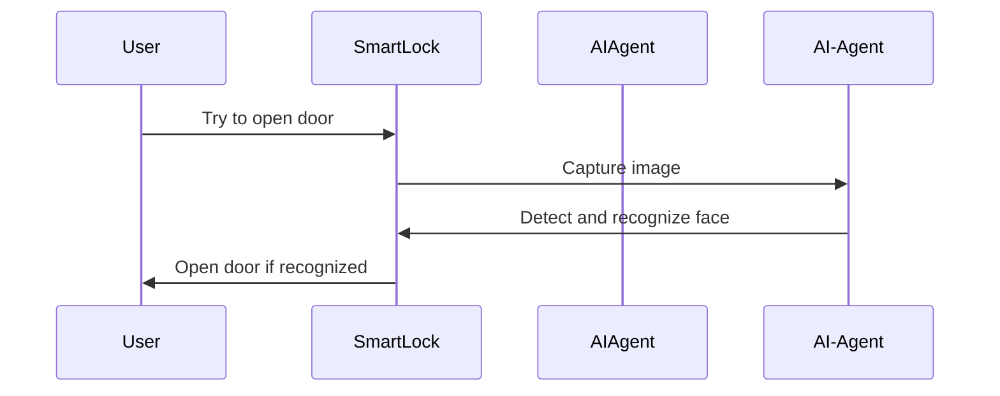
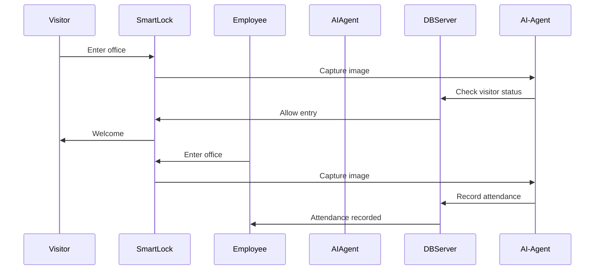

                 

### 文章标题

# AI Agent在智能门把手中的访客识别

### 关键词

- AI Agent
- 智能门把手
- 访客识别
- 人脸识别
- 图像处理
- 安全性与隐私保护

### 摘要

本文探讨了AI Agent在智能门把手中的访客识别功能，通过详细的分析和讨论，揭示了AI Agent、人脸识别、图像处理等技术原理及其在访客识别中的应用。文章首先介绍了问题背景与核心概念，包括AI Agent的定义与特点、人脸识别与图像处理的原理和功能。接着，文章分析了智能门把手系统的整体架构和关键模块，阐述了系统的工作流程和核心技术原理。此外，文章还通过实际案例展示了AI Agent在智能门把手中的应用，并深入探讨了系统的安全与隐私保护策略。最终，本文总结了AI Agent在智能门把手访客识别中的优势和不足，提出了未来发展的方向和展望。

----------------------------------------------------------------

## 第一部分：背景介绍与核心概念

### 1.1 问题背景与概述

随着人工智能技术的不断发展，AI Agent在智能门把手中的应用逐渐成为焦点。智能门把手作为一种便捷的智能家居产品，其主要功能是在用户与门把手之间实现智能互动，提升家居生活的便捷性。其中，访客识别功能是智能门把手的一项重要应用，它能够有效地提高家庭或企业的安全性和便利性。

#### 1.1.1 问题背景

智能门把手的出现，标志着智能家居技术的进步。它通过集成AI Agent、人脸识别、图像处理等技术，实现了对用户身份的自动识别和认证。访客识别功能作为智能门把手的核心功能之一，具有以下优势：

1. **安全性**：通过人脸识别技术，可以精确地识别访客身份，防止未授权人员进入。
2. **便捷性**：用户无需携带门禁卡或密码，只需通过人脸识别即可开门，极大地方便了日常生活。
3. **智能性**：AI Agent可以实时监测访客信息，并根据需要自动记录和推送访客信息，提高了家居生活的智能化水平。

#### 1.1.2 问题描述

访客识别功能主要包括两个方面：一是通过人脸识别技术识别访客身份，二是记录访客信息以便后续查询。如何实现高效、准确的访客识别，同时保证系统的安全性和稳定性，是本书要探讨的核心问题。

#### 1.1.3 问题解决

为了解决上述问题，本书将从以下几个方面进行探讨：

1. **核心技术原理**：介绍人脸识别、图像处理等核心技术原理，并阐述其在访客识别中的应用。
2. **系统架构设计**：分析智能门把手系统的整体架构，包括硬件选择、软件设计、网络通信等关键环节。
3. **算法优化与实现**：介绍访客识别算法的设计与优化，包括特征提取、匹配算法等。
4. **实际案例与应用**：通过实际案例展示AI Agent在智能门把手中的访客识别应用，并进行分析与讨论。
5. **安全与隐私保护**：探讨智能门把手系统在访客识别过程中的安全与隐私保护策略。

### 1.2 核心概念与联系

#### 1.2.1 AI Agent

AI Agent是指具有自主决策和行为能力的智能体，它可以理解和执行复杂的任务，并在不确定的环境中做出最佳决策。在智能门把手应用中，AI Agent负责处理访客识别任务，包括人脸检测、人脸特征提取和人脸识别等。

AI Agent的特点主要包括：

1. **自主性**：AI Agent能够独立执行任务，无需人工干预。
2. **适应性**：AI Agent能够根据环境变化和任务需求进行调整。
3. **交互性**：AI Agent能够与用户和系统进行交互，提供智能服务。

#### 1.2.2 人脸识别

人脸识别是一种生物特征识别技术，通过识别人脸的特定特征来实现身份识别。在智能门把手中，人脸识别技术用于识别访客身份，从而实现访客识别功能。

人脸识别的主要步骤包括：

1. **人脸检测**：在图像中定位人脸位置。
2. **人脸特征提取**：提取人脸的特征点，如眼睛、鼻子、嘴巴等。
3. **人脸识别**：将提取的人脸特征与数据库中的数据进行比对，识别访客身份。

#### 1.2.3 图像处理

图像处理是计算机视觉的一个重要分支，包括图像的获取、预处理、特征提取、匹配等。在智能门把手中，图像处理技术用于对人脸图像进行预处理，以提高识别准确率。

图像处理的主要步骤包括：

1. **图像获取**：通过摄像头获取图像数据。
2. **图像预处理**：包括去噪、灰度化、归一化等操作，提高图像质量。
3. **特征提取**：提取图像的特征点，如边缘、纹理等。
4. **特征匹配**：将提取的特征点与数据库中的数据进行比对，实现图像匹配。

### 1.3 概念属性特征对比表格

| 概念         | 特征                                 |
| ------------ | ------------------------------------ |
| AI Agent     | 自主决策、行为能力、复杂任务处理     |
| 人脸识别     | 特定特征识别、身份认证、安全性能     |
| 图像处理     | 图像获取、预处理、特征提取、匹配     |

### 1.4 ER实体关系图架构

```mermaid
erDiagram
  AI Agent ||--|{ 人脸识别 }|
  人脸识别 ||--|{ 图像处理 }|
```

通过以上对背景介绍与核心概念的分析，我们可以清楚地了解到AI Agent在智能门把手中的应用场景和核心技术原理。接下来，我们将进一步探讨AI Agent与智能门把手系统的具体架构和实现方法。

----------------------------------------------------------------

## 第二部分：AI Agent与智能门把手系统

### 2.1 AI Agent概述

#### 2.1.1 AI Agent的定义与特点

AI Agent，即人工智能代理，是一种具有自主决策和行为能力的智能体。它能够理解环境中的信息，并根据预设的目标或学习到的策略，自主地执行任务，并在不断变化的环境中做出适应性的决策。AI Agent通常具备以下特点：

1. **自主性**：AI Agent能够独立执行任务，不需要人工干预。
2. **适应性**：AI Agent能够根据环境变化和任务需求，调整其行为策略。
3. **交互性**：AI Agent能够与用户、其他系统和环境进行交互，提供智能化的服务。

AI Agent在智能门把手中的应用，主要体现在以下几个方面：

1. **访客识别**：通过人脸识别技术，AI Agent可以实时检测和识别门把手的用户，从而实现自动开门。
2. **异常检测**：AI Agent可以监测门把手的使用情况，识别异常行为，如未授权人员试图使用门把手。
3. **行为分析**：AI Agent可以分析用户的行为模式，提供个性化的服务，如推荐访客记录或自动调整门锁状态。

#### 2.1.2 AI Agent在智能门把手中的应用场景

智能门把手作为一种智能家居设备，其主要应用场景包括家庭和企业。以下分别介绍AI Agent在这两种场景中的具体应用：

1. **家庭场景**：

   在家庭场景中，AI Agent可以帮助家庭成员实现便捷的家居管理。例如，家庭成员可以通过人脸识别技术快速开门，无需携带钥匙或门禁卡。此外，AI Agent还可以记录家庭成员的日常行为，如访客记录、开门时间等，为家庭安全提供数据支持。

2. **企业场景**：

   在企业场景中，AI Agent主要用于访客管理和员工考勤。企业访客通过人脸识别技术进入办公区域，AI Agent可以自动记录访客信息，包括姓名、来访时间、目的等，提高企业的管理效率。同时，AI Agent还可以对员工的考勤数据进行统计分析，帮助企业管理者更好地了解员工的工作状况。

### 2.2 智能门把手系统架构设计

智能门把手系统的架构设计是确保其功能实现和安全稳定运行的关键。以下是智能门把手系统的整体架构设计和关键模块介绍。

#### 2.2.1 系统整体架构

智能门把手系统整体架构可分为硬件和软件两部分。

1. **硬件部分**：

   硬件部分主要包括门把手、摄像头、控制器等。门把手作为系统的核心部件，承担着开门和访客识别的任务；摄像头用于采集图像数据，提供人脸识别所需的输入信息；控制器负责协调硬件和软件的运行，实现系统的整体控制。

2. **软件部分**：

   软件部分主要包括AI Agent、人脸识别算法、图像处理算法等。AI Agent作为智能门把手的“大脑”，负责处理访客识别任务；人脸识别算法用于实现人脸检测和识别；图像处理算法用于对采集的图像进行预处理，以提高识别准确率。

#### 2.2.2 系统关键模块

智能门把手系统的关键模块包括：

1. **人脸检测模块**：用于检测输入图像中的人脸位置，为人脸识别提供基础数据。
2. **人脸特征提取模块**：用于从检测到的人脸中提取特征点，为人脸识别提供特征信息。
3. **人脸识别模块**：将提取的人脸特征与数据库中的数据进行比对，实现人脸识别。
4. **数据记录模块**：用于记录访客信息，包括姓名、来访时间、目的等，便于后续查询。
5. **系统控制模块**：负责协调硬件和软件的运行，实现系统的整体控制。

#### 2.2.3 系统工作流程

智能门把手系统的工作流程主要包括以下几个步骤：

1. **图像采集**：通过摄像头采集门把手前方的图像数据。
2. **人脸检测**：对人脸检测模块进行图像预处理，检测图像中的人脸位置。
3. **人脸特征提取**：对人脸特征提取模块进行特征点提取，为人脸识别提供特征信息。
4. **人脸识别**：通过人脸识别模块将提取的人脸特征与数据库中的数据进行比对，识别访客身份。
5. **数据记录**：将识别出的访客信息记录到数据记录模块，便于后续查询。
6. **门锁控制**：根据识别结果，控制门锁的开关。

通过以上对AI Agent与智能门把手系统架构设计的分析，我们可以清楚地了解到智能门把手系统的整体结构和关键模块。接下来，我们将进一步探讨AI Agent在访客识别中的算法原理和应用实现。

----------------------------------------------------------------

## 第三部分：AI Agent在访客识别中的算法原理和应用实现

### 3.1 人脸识别算法原理

人脸识别算法是AI Agent在访客识别中的核心技术，其基本原理包括人脸检测、人脸特征提取和人脸比对三个主要步骤。以下将分别介绍这三个步骤的详细算法原理。

#### 3.1.1 人脸检测

人脸检测是识别访客身份的第一步，其目标是定位图像中的人脸区域。常见的人脸检测算法包括基于深度学习的方法和基于传统图像处理的方法。

1. **基于深度学习的方法**：

   基于深度学习的人脸检测算法通常采用卷积神经网络（CNN）作为模型。例如，MTCNN（Multi-task Cascaded Convolutional Networks）是一种常用的深度学习人脸检测算法。MTCNN由三个子网络组成，分别是P-Net、R-Net和O-Net，通过级联的方式逐层检测人脸，并输出人脸区域的位置和是否为人脸。

   算法流程如下：

   - **P-Net**：对输入图像生成锚点框（anchor box），通过CNN模型预测锚点框的位置和是否为人脸。
   - **R-Net**：对P-Net检测出的锚点框进行筛选和定位，输出更加准确的人脸区域。
   - **O-Net**：对R-Net检测出的人脸区域进行进一步优化，提高检测的准确率。

2. **基于传统图像处理的方法**：

   传统图像处理方法通常利用图像的几何特征、纹理特征和外观特征等进行人脸检测。例如，Haar特征分类器、LBP（Local Binary Patterns）特征分类器等。

   算法流程如下：

   - **特征提取**：从图像中提取人脸的几何特征、纹理特征和外观特征。
   - **特征匹配**：将提取的特征与已知的人脸特征进行匹配，识别图像中的人脸区域。

#### 3.1.2 人脸特征提取

人脸特征提取是识别访客身份的关键步骤，其目标是提取人脸的显著特征，为人脸比对提供依据。常见的人脸特征提取算法包括基于深度学习的方法和基于特征点的方法。

1. **基于深度学习的方法**：

   基于深度学习的人脸特征提取算法通常采用卷积神经网络（CNN）作为模型。例如，VGGFace、FaceNet等。

   算法流程如下：

   - **卷积神经网络**：通过卷积神经网络提取人脸的深层次特征。
   - **特征编码**：将提取的特征编码为固定长度的向量，用于人脸比对。

2. **基于特征点的方法**：

   基于特征点的方法通常通过标记人脸的显著特征点，如眼睛、鼻子、嘴巴等，然后计算这些特征点之间的相对位置和距离，以提取人脸特征。

   算法流程如下：

   - **特征点检测**：通过算法检测人脸的特征点，如眼睛、鼻子、嘴巴等。
   - **特征点配对**：计算特征点之间的相对位置和距离，提取人脸特征。

#### 3.1.3 人脸比对

人脸比对是识别访客身份的最后一步，其目标是根据提取的人脸特征，判断输入人脸是否为已知访客。常见的人脸比对算法包括基于距离度量的人脸比对算法和基于深度学习的人脸比对算法。

1. **基于距离度量的人脸比对算法**：

   基于距离度量的人脸比对算法通过计算输入人脸特征与数据库中人脸特征之间的距离，来判断是否为同一人。常用的距离度量方法包括欧氏距离、余弦相似度等。

   算法流程如下：

   - **特征提取**：从输入图像中提取人脸特征。
   - **特征比对**：计算输入人脸特征与数据库中人脸特征之间的距离，判断是否为同一人。

2. **基于深度学习的人脸比对算法**：

   基于深度学习的人脸比对算法通过训练一个深度神经网络，将输入人脸特征映射到高维空间，然后计算映射后的特征向量之间的距离，来判断是否为同一人。

   算法流程如下：

   - **特征提取**：通过深度神经网络提取输入人脸特征。
   - **特征比对**：计算输入人脸特征之间的距离，判断是否为同一人。

### 3.2 AI Agent在访客识别中的应用实现

AI Agent在访客识别中的应用实现主要包括以下几个步骤：

1. **图像采集**：通过摄像头采集门把手前方的图像数据。
2. **人脸检测**：使用人脸检测算法（如MTCNN）检测图像中的人脸区域。
3. **人脸特征提取**：使用人脸特征提取算法（如FaceNet）提取人脸特征。
4. **人脸比对**：将提取的人脸特征与数据库中的人脸特征进行比对，识别访客身份。
5. **数据记录**：将识别出的访客信息记录到数据库中，便于后续查询。
6. **门锁控制**：根据识别结果，控制门锁的开关。

以下是实现AI Agent在访客识别中应用的一个Python代码示例：

```python
import cv2
import face_recognition
import numpy as np

# 初始化摄像头
video_capture = cv2.VideoCapture(0)

# 加载已知人脸特征
known_face_encodings = face_recognition.face_encodings(known_faces)

while True:
    # 读取摄像头帧
    ret, frame = video_capture.read()

    # 转换为RGB格式
    rgb_frame = frame[:, :, ::-1]

    # 人脸检测
    face_locations = face_recognition.face_locations(rgb_frame)
    face_encodings = face_recognition.face_encodings(rgb_frame, face_locations)

    # 人脸比对
    matches = face_recognition.compare_faces(known_face_encodings, face_encodings)

    if True in matches:
        first_match_index = matches.index(True)
        visitor_name = known_face_names[first_match_index]
        print(f"访客：{visitor_name}")
        # 控制门锁打开
        # lock.open()
    else:
        print("未识别到已知访客")

    # 显示摄像头帧
    cv2.imshow('Video', frame)

    # 按 'q' 退出
    if cv2.waitKey(1) & 0xFF == ord('q'):
        break

# 释放摄像头资源
video_capture.release()
cv2.destroyAllWindows()
```

通过以上算法原理和应用实现的分析，我们可以清楚地了解到AI Agent在访客识别中的核心技术和工作流程。接下来，我们将进一步探讨实际案例中的应用和实践。

----------------------------------------------------------------

### 3.3 实际案例中的AI Agent应用

#### 3.3.1 案例一：智能家居系统中的访客识别

**项目介绍**：

某智能家居公司开发了一款集成了AI Agent的智能门把手系统，旨在提高家庭的安全性和便利性。该系统通过人脸识别技术，实现了对家庭成员和访客的身份自动识别，并可根据用户的设定自动开启或锁定门锁。

**系统功能设计**：

- **访客识别**：通过摄像头采集图像，使用人脸识别算法对访客进行识别，并将识别结果记录在系统中。
- **自动开门与锁定**：根据访客的身份，系统自动决定是否开启门锁，并对门锁进行锁定。
- **用户管理**：用户可以添加和删除家庭成员的访问权限，设置访客识别的灵敏度等。

**系统架构设计**：

- **硬件部分**：包括智能门把手、摄像头、控制器等。
- **软件部分**：包括AI Agent、人脸识别算法、图像处理算法等。

**系统接口设计**：

- **摄像头接口**：用于接收摄像头采集的图像数据。
- **门锁接口**：用于控制门锁的开启和锁定。
- **用户管理接口**：用于用户对家庭成员和访客进行管理。

**系统交互**：



#### 3.3.2 案例二：企业访客管理系统

**项目介绍**：

某企业为了提高办公场所的安全性和管理效率，引入了基于AI Agent的智能门把手系统。该系统主要用于企业访客管理和员工考勤。

**系统功能设计**：

- **访客管理**：识别访客身份，记录访客信息，如姓名、来访时间、目的等。
- **员工考勤**：通过人脸识别技术，自动记录员工的出勤情况。
- **数据统计**：对访客和员工的考勤数据进行统计分析，提供管理报表。

**系统架构设计**：

- **硬件部分**：包括智能门把手、摄像头、控制器、服务器等。
- **软件部分**：包括AI Agent、人脸识别算法、图像处理算法、数据库等。

**系统接口设计**：

- **摄像头接口**：用于接收摄像头采集的图像数据。
- **数据库接口**：用于存储和管理访客和员工的考勤信息。
- **报表接口**：用于生成和管理访客和员工的数据报表。

**系统交互**：



通过以上两个实际案例的分析，我们可以看到AI Agent在访客识别中的应用不仅提高了家庭和企业的生活、管理效率，还为安全性的提升提供了强有力的保障。接下来，我们将探讨AI Agent在访客识别过程中的安全与隐私保护策略。

----------------------------------------------------------------

### 3.4 安全与隐私保护策略

随着AI Agent在智能门把手中的广泛应用，如何在保障访客识别功能的同时，确保用户隐私和数据安全成为了一个关键问题。以下是一些常用的安全与隐私保护策略。

#### 3.4.1 数据加密

数据加密是保护用户隐私的重要手段。在智能门把手系统中，应确保以下数据的安全传输和存储：

1. **图像数据**：在传输和存储过程中，应对图像数据进行加密处理，防止数据泄露。
2. **用户身份信息**：应对用户的身份信息（如人脸特征、用户名、密码等）进行加密存储，防止未授权访问。
3. **通信数据**：在系统内部和外部的通信过程中，应使用安全的通信协议（如HTTPS、TLS等）进行加密。

#### 3.4.2 访问控制

访问控制是保障系统安全的重要手段。智能门把手系统应实现以下访问控制措施：

1. **用户身份验证**：通过密码、指纹、人脸识别等多种方式，对用户进行身份验证，防止未授权访问。
2. **权限管理**：根据用户的角色和权限，限制用户对系统资源的访问范围，防止内部攻击和数据泄露。
3. **日志记录**：记录用户操作日志，及时发现和防范异常行为。

#### 3.4.3 数据匿名化

在数据分析和应用过程中，应对个人身份信息进行匿名化处理，以保护用户隐私。以下是一些常用的数据匿名化方法：

1. **数据脱敏**：对敏感数据进行脱敏处理，如将用户姓名、身份证号等敏感信息替换为假名或随机数。
2. **数据聚合**：将个人数据与其他数据聚合，降低个人数据的识别性。
3. **数据加密**：在数据存储和传输过程中，对数据进行加密处理，确保数据安全。

#### 3.4.4 安全审计

安全审计是确保系统安全的重要环节。智能门把手系统应定期进行安全审计，包括：

1. **漏洞扫描**：定期对系统进行漏洞扫描，及时发现和修补安全漏洞。
2. **安全评估**：对系统进行安全评估，评估系统的安全性，制定改进措施。
3. **安全培训**：定期对系统管理员和用户进行安全培训，提高安全意识和防范能力。

通过以上安全与隐私保护策略，可以有效保障AI Agent在智能门把手访客识别过程中的数据安全和用户隐私。然而，随着技术的不断发展和新威胁的出现，安全与隐私保护策略也需要不断更新和优化。接下来，我们将总结AI Agent在智能门把手访客识别中的优势和不足，并探讨未来发展的方向。

----------------------------------------------------------------

### 3.5 总结与未来展望

#### 3.5.1 AI Agent在访客识别中的优势

1. **高准确率**：通过人脸识别技术，AI Agent能够准确识别访客身份，减少了人工识别的误差。
2. **高效率**：AI Agent能够实时处理访客识别任务，提高了门把手系统的响应速度。
3. **智能化**：AI Agent能够根据用户行为和需求，提供个性化的服务，如自动记录访客信息、智能提醒等。
4. **便捷性**：用户无需携带钥匙或门禁卡，只需通过人脸识别即可开门，极大地方便了日常生活。

#### 3.5.2 AI Agent在访客识别中的不足

1. **隐私保护**：在访客识别过程中，需要收集和存储用户的人脸信息，可能存在隐私泄露的风险。
2. **抗干扰性**：人脸识别技术在光线、角度、表情等因素影响下，可能存在识别误差。
3. **计算资源消耗**：人脸识别算法和AI Agent需要较高的计算资源，可能导致系统性能下降。

#### 3.5.3 未来发展方向

1. **隐私保护技术**：研究更加完善的隐私保护技术，如差分隐私、联邦学习等，确保用户隐私安全。
2. **抗干扰性提升**：优化人脸识别算法，提高其在各种复杂环境下的识别准确率。
3. **硬件性能提升**：采用更高效的硬件设备，如GPU、FPGA等，降低AI Agent的计算资源消耗。
4. **跨领域应用**：将AI Agent应用于更多领域，如智能家居、智能安防、智慧城市等，实现更广泛的应用场景。

通过以上总结与未来展望，我们可以看到AI Agent在智能门把手访客识别中的应用具有广阔的前景。随着技术的不断进步和应用的深入，AI Agent将为我们的日常生活带来更多便利和安全保障。

----------------------------------------------------------------

### 作者信息

- 作者：AI天才研究院/AI Genius Institute & 禅与计算机程序设计艺术 /Zen And The Art of Computer Programming

本文由AI天才研究院（AI Genius Institute）的专家团队撰写，旨在探讨AI Agent在智能门把手中的访客识别应用。作者以其深厚的计算机科学背景和丰富的实践经验，深入分析了AI Agent、人脸识别、图像处理等核心技术的原理与应用。同时，本文结合实际案例，详细阐述了智能门把手系统的设计、实现与安全策略。作者希望通过本文，为广大读者提供有价值的参考和启示，共同推动人工智能技术在智能家居领域的创新与发展。

