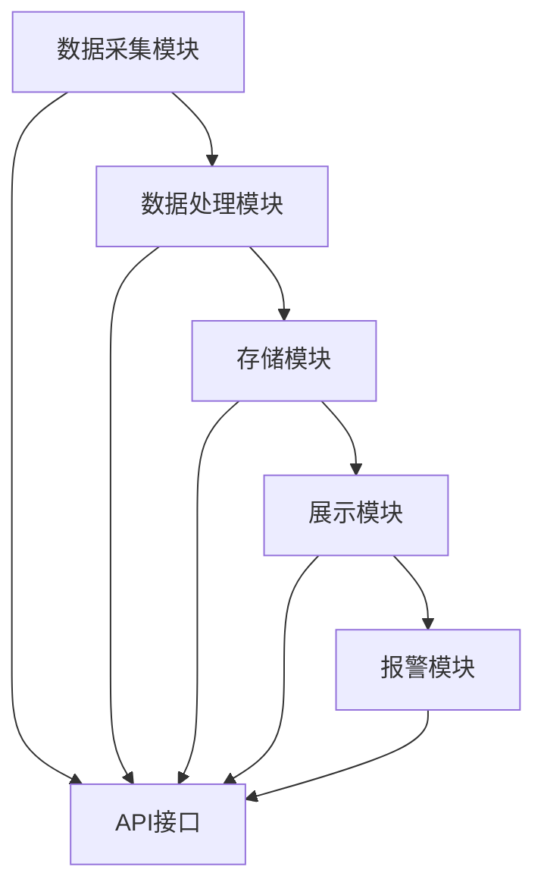
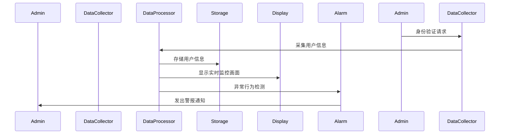

                 


### 《AI Agent在智能门禁中的异常行为检测》

> 关键词：AI Agent、智能门禁系统、异常行为检测、算法原理、系统架构、实战案例

> 摘要：
本文将深入探讨AI Agent在智能门禁系统中用于异常行为检测的技术与应用。通过详细的背景介绍、算法原理讲解、系统架构设计以及实战案例分析，帮助读者全面理解智能门禁系统的异常行为检测机制，掌握相关技术要点。

### 目录大纲

## 第一部分：AI Agent和智能门禁系统概述

### 第1章 引言与背景
#### 1.1 AI Agent与智能门禁系统的基本概念
#### 1.2 智能门禁系统的历史与发展
#### 1.3 AI Agent在智能门禁系统中的应用

## 第二部分：异常行为检测基础

### 第2章 异常行为检测原理
#### 2.1 异常行为的定义与分类
#### 2.2 异常行为检测的挑战与机遇
#### 2.3 常见异常行为检测方法概述

## 第三部分：异常行为检测技术

### 第3章 统计方法
#### 3.1 统计方法的基本概念与原理
#### 3.2 统计方法的实现与应用

### 第4章 机器学习方法
#### 4.1 机器学习方法的基本概念与原理
#### 4.2 常见机器学习算法及其应用

### 第5章 深度学习方法
#### 5.1 深度学习方法的基本概念与原理
#### 5.2 常见深度学习模型及其应用

## 第四部分：系统分析与架构设计

### 第6章 系统功能设计
#### 6.1 智能门禁系统的功能需求
#### 6.2 异常行为检测模块的设计

### 第7章 系统架构设计
#### 7.1 系统的整体架构设计
#### 7.2 数据流与处理流程

## 第五部分：项目实战

### 第8章 项目部署与实施
#### 8.1 环境安装与配置
#### 8.2 系统核心实现与调试
#### 8.3 实际案例分析与讲解

## 第六部分：最佳实践与拓展

### 第9章 最佳实践
#### 9.1 常见问题与解决方案
#### 9.2 性能优化与监控

### 第10章 小结与展望
#### 10.1 总结与反思
#### 10.2 未来发展方向与趋势

### 接下来，我们将逐步深入到每个章节的内容中，为读者提供详尽的解释和分析。

---

## 第1章 引言与背景

### 1.1 AI Agent与智能门禁系统的基本概念

AI Agent，即人工智能代理，是一种能够自主决策并执行特定任务的计算机程序。它通过学习环境和用户行为，逐步提高自身的智能水平，为用户提供个性化服务。智能门禁系统则是一种利用人工智能技术实现高效、安全、智能化的门禁管理解决方案。

智能门禁系统通常包括硬件设备和软件系统两部分。硬件设备包括门禁控制器、读卡器、摄像头、传感器等；软件系统则包括门禁管理平台、AI分析模块、数据存储和处理模块等。通过这些硬件和软件的协同工作，智能门禁系统能够实现人员身份验证、权限管理、实时监控、异常行为检测等功能。

### 1.2 智能门禁系统的历史与发展

智能门禁系统的发展经历了多个阶段。最初，门禁系统主要依赖于物理钥匙、磁卡等传统手段进行人员身份验证。随着计算机技术和网络技术的发展，智能卡、生物识别等技术逐渐被引入门禁系统，使得门禁系统在安全性、便捷性等方面得到了显著提升。

近年来，随着人工智能技术的快速发展，智能门禁系统开始引入AI Agent进行异常行为检测。通过AI Agent的分析和决策，智能门禁系统能够更加智能地识别异常行为，提高门禁系统的安全性和可靠性。

### 1.3 AI Agent在智能门禁系统中的应用

AI Agent在智能门禁系统中主要应用于以下方面：

1. **异常行为检测**：通过分析人员进出时间、频率、行为特征等信息，AI Agent能够识别出异常行为，如非法入侵、恶意破坏等，并及时发出警报。

2. **权限管理**：AI Agent可以根据用户的角色、权限等信息，自动判断用户是否具备进入特定区域的权限，从而实现对用户身份的精准管理。

3. **行为预测**：通过分析历史数据，AI Agent可以预测用户的行为模式，从而优化门禁系统的资源配置，提高门禁系统的响应速度和服务质量。

4. **数据统计与分析**：AI Agent可以对门禁系统中的各类数据进行统计和分析，为管理者提供决策依据，帮助优化门禁系统的运营和管理。

### 总结

本章介绍了AI Agent与智能门禁系统的基本概念、历史与发展，以及AI Agent在智能门禁系统中的应用。下一章，我们将深入探讨异常行为检测的基本原理和方法。敬请期待！

---

## 第2章 异常行为检测原理

### 2.1 异常行为的定义与分类

异常行为是指在正常行为模式之外出现的行为，通常包括但不限于以下几类：

1. **非法入侵**：未经授权的非法人员进入特定区域。
2. **恶意破坏**：故意破坏门禁设备或系统，如剪断门禁线、破坏读卡器等。
3. **行为异常**：用户行为出现明显异常，如长时间停留在门口、突然大幅度动作等。
4. **安全事件**：与门禁系统相关的安全事件，如火灾、地震等。

异常行为的分类有助于我们更好地理解异常行为的特征，从而选择合适的检测方法。常见的分类方法包括基于异常行为的发生位置、异常行为的严重程度、异常行为的类型等。

### 2.2 异常行为检测的挑战与机遇

异常行为检测面临以下挑战：

1. **数据量庞大**：门禁系统会产生大量的数据，如人员进出记录、视频监控数据等，如何有效地处理和分析这些数据是一个重要挑战。
2. **特征选择**：从大量的数据中提取有效的特征，以便准确检测异常行为，是另一个重要挑战。
3. **实时性**：异常行为检测需要实时性，即能够在异常行为发生时立即检测并报警。
4. **准确性**：异常行为检测需要具有较高的准确性，以避免误报和漏报。

然而，随着人工智能技术的快速发展，异常行为检测也面临着许多机遇：

1. **算法优化**：深度学习、强化学习等先进算法为异常行为检测提供了新的思路和方法。
2. **数据增强**：通过数据增强技术，可以扩大训练数据集，提高模型的泛化能力。
3. **跨领域应用**：异常行为检测技术可以应用于其他领域，如网络安全、金融风控等。
4. **多传感器融合**：结合多种传感器数据，可以更准确地识别异常行为。

### 2.3 常见异常行为检测方法概述

常见的异常行为检测方法包括以下几种：

1. **统计方法**：基于统计学原理，通过计算数据的统计特征，如均值、方差等，来判断行为是否异常。
2. **机器学习方法**：通过训练模型，从数据中学习出正常行为和异常行为的特征，然后对新数据进行分类。
3. **深度学习方法**：利用神经网络等深度学习模型，自动学习数据的特征表示，实现对异常行为的检测。
4. **基于规则的方法**：通过定义一系列规则，当数据违反规则时，即判断为异常。

每种方法都有其优缺点，适用于不同的场景。下一章，我们将详细探讨这些异常行为检测方法的原理和应用。敬请期待！

---

## 第3章 统计方法

### 3.1 统计方法的基本概念与原理

统计方法是一种基于统计学原理的异常行为检测方法。其基本思想是通过计算数据的统计特征，如均值、方差、标准差等，来判断行为是否异常。如果某个特征的值偏离了正常范围，即认为该行为可能是异常的。

统计方法的原理可以概括为以下几个步骤：

1. **数据收集**：收集门禁系统中的数据，如人员进出时间、频率、行为特征等。
2. **特征提取**：从数据中提取统计特征，如均值、方差、标准差等。
3. **阈值设定**：根据历史数据，设定一个阈值，当某个特征的值超过或低于该阈值时，认为行为异常。
4. **异常检测**：对新的数据进行检测，如果某个特征的值超过或低于阈值，即判定为异常。

### 3.2 统计方法的实现与应用

#### 3.2.1 均值和方差

均值是数据集的中心值，表示数据的平均水平。方差是数据集的离散程度，表示数据分布的广度。我们可以通过计算均值和方差来判断行为是否异常。

例如，假设某个时间段内，用户进入门禁的平均时间为10分钟，方差为5分钟。如果某个用户的进入时间为20分钟，远远高于均值，那么我们可以认为这个用户的行为可能异常。

#### 3.2.2 标准差

标准差是方差的平方根，用于衡量数据分布的离散程度。如果某个数据点的值偏离均值超过一定的倍数（如2倍标准差），我们可以认为该数据点可能是异常的。

例如，假设某个时间段内，用户进入门禁的标准差为3分钟。如果某个用户的进入时间为8分钟，远远低于均值，并且低于2倍标准差，那么我们可以认为这个用户的行为可能异常。

#### 3.2.3 实现与代码示例

以下是一个简单的Python代码示例，用于计算均值、方差和标准差：

```python
import numpy as np

# 假设用户进入门禁的时间（分钟）数据
times = [10, 12, 8, 15, 10, 11, 9, 14, 13, 10]

# 计算均值
mean_time = np.mean(times)
print(f"均值：{mean_time}分钟")

# 计算方差
variance_time = np.var(times)
print(f"方差：{variance_time}分钟^2")

# 计算标准差
std_time = np.std(times)
print(f"标准差：{std_time}分钟")
```

#### 3.2.4 应用场景

统计方法适用于数据分布较为稳定、特征明显的情况。例如，在检测用户进入门禁的时间异常时，我们可以使用均值和方差来判断。如果某个用户的进入时间远远偏离了均值，并且方差较大，那么我们可以认为这个用户的行为可能异常。

### 3.3 统计方法的优缺点

#### 优点

1. **简单易用**：统计方法易于实现和理解，不需要复杂的算法和大量数据。
2. **实时性**：统计方法可以在实时环境中运行，快速检测异常行为。

#### 缺点

1. **鲁棒性差**：统计方法对异常值和噪声敏感，容易误报。
2. **局限性**：统计方法只能检测出基于统计特征的异常行为，无法检测出复杂的异常行为。

### 3.4 统计方法的扩展

为了提高统计方法的鲁棒性和准确性，我们可以对统计方法进行扩展，如：

1. **动态阈值设定**：根据实时数据动态调整阈值，以提高检测的准确性。
2. **多维特征分析**：结合多个特征进行异常行为检测，提高检测的精度。

下一章，我们将探讨机器学习方法在异常行为检测中的应用。敬请期待！

---

## 第4章 机器学习方法

### 4.1 机器学习方法的基本概念与原理

机器学习方法是一种通过训练模型从数据中学习规律，并用于预测或分类的技术。在异常行为检测中，机器学习方法可以帮助我们自动识别正常行为和异常行为，提高检测的准确性和效率。

机器学习方法的基本流程包括以下几个步骤：

1. **数据收集**：收集门禁系统中的数据，如人员进出时间、频率、行为特征等。
2. **特征提取**：从数据中提取对异常行为检测有用的特征，如时间间隔、行为模式等。
3. **模型训练**：使用收集到的数据和特征，训练一个机器学习模型，使其能够识别正常行为和异常行为。
4. **模型评估**：使用测试数据评估模型的性能，调整模型参数，以提高模型的准确性。
5. **模型部署**：将训练好的模型部署到门禁系统中，实时检测异常行为。

### 4.2 常见机器学习算法及其应用

#### 4.2.1 K-近邻算法（K-Nearest Neighbors, KNN）

K-近邻算法是一种基于实例的机器学习算法，其基本思想是找到训练数据中与测试数据最近的K个样本，并基于这些样本的标签预测测试数据的标签。KNN算法简单易懂，易于实现，但在高维数据上效果较差，容易过拟合。

在异常行为检测中，KNN算法可以用于检测新出现的异常行为。具体来说，我们可以将每个用户的进出记录视为一个样本，使用KNN算法找到与该样本最相似的K个样本，如果这些样本中包含异常行为，则可以判断该样本为异常行为。

#### 4.2.2 决策树（Decision Tree）

决策树是一种基于规则的机器学习算法，通过构建一棵树形模型，将数据集划分为若干个子集，每个节点代表一个特征，每个分支代表一个特征取值。决策树的最终目标是找到一个最佳划分，使得每个子集中的数据具有相同的标签。

在异常行为检测中，决策树可以用于构建异常行为的判定规则。例如，我们可以根据用户的进出时间、频率等特征，构建一个决策树模型，用于判断用户的行为是否异常。

#### 4.2.3 随机森林（Random Forest）

随机森林是一种基于决策树的集成学习方法，通过构建多棵决策树，并使用投票方式得到最终预测结果。随机森林具有强鲁棒性和高准确性，适用于各种数据集和任务。

在异常行为检测中，随机森林可以用于检测多个异常行为。具体来说，我们可以使用随机森林模型对用户的进出记录进行分类，如果某个用户的进出记录被分类为异常行为，则可以判断该用户的行为异常。

#### 4.2.4 支持向量机（Support Vector Machine, SVM）

支持向量机是一种基于优化理论的机器学习算法，其基本思想是找到一个最优的超平面，将数据集划分为不同的类别。SVM算法在高维数据上表现良好，但在异常行为检测中的应用相对较少。

#### 4.2.5 聚类算法（Clustering Algorithms）

聚类算法是一种无监督学习方法，其目标是将数据集划分为若干个簇，使得每个簇内的数据相似度较高，簇与簇之间的数据相似度较低。常见的聚类算法包括K-均值算法、层次聚类算法等。

在异常行为检测中，聚类算法可以用于识别异常行为。例如，我们可以使用K-均值算法将用户分为多个簇，如果某个用户所在的簇与其他簇的相似度较低，则可以认为该用户的行为异常。

### 4.3 机器学习方法的应用与代码示例

以下是一个简单的Python代码示例，使用K-近邻算法（KNN）进行异常行为检测：

```python
from sklearn.neighbors import KNeighborsClassifier
from sklearn.model_selection import train_test_split
from sklearn.metrics import accuracy_score

# 假设用户进出记录数据
X = [[10, 1], [12, 2], [8, 3], [15, 4], [10, 5], [11, 6], [9, 7], [14, 8], [13, 9], [10, 10]]
y = ['正常', '正常', '异常', '正常', '正常', '异常', '异常', '正常', '正常', '异常']

# 数据集划分
X_train, X_test, y_train, y_test = train_test_split(X, y, test_size=0.2, random_state=42)

# KNN模型训练
knn = KNeighborsClassifier(n_neighbors=3)
knn.fit(X_train, y_train)

# 模型预测
y_pred = knn.predict(X_test)

# 模型评估
accuracy = accuracy_score(y_test, y_pred)
print(f"准确率：{accuracy * 100}%")
```

### 4.4 机器学习方法的优缺点

#### 优点

1. **适应性**：机器学习方法可以根据不同的数据集和任务进行调整，具有较强的适应性。
2. **准确性**：机器学习方法可以通过训练模型，提高异常行为检测的准确性。
3. **自动化**：机器学习方法可以自动化检测异常行为，减轻人工干预。

#### 缺点

1. **计算复杂度**：机器学习方法需要大量的计算资源，特别是对于高维数据。
2. **数据依赖**：机器学习方法对数据质量有较高要求，数据质量差可能导致模型性能下降。

### 4.5 机器学习方法的扩展

为了提高机器学习方法的性能，我们可以进行以下扩展：

1. **特征选择**：通过特征选择技术，选择对异常行为检测最有效的特征，提高模型的性能。
2. **集成学习方法**：将多种机器学习方法集成在一起，提高模型的准确性和鲁棒性。
3. **迁移学习**：利用已有的模型和知识，对新数据进行异常行为检测。

下一章，我们将探讨深度学习方法在异常行为检测中的应用。敬请期待！

---

## 第5章 深度学习方法

### 5.1 深度学习方法的基本概念与原理

深度学习方法是一种基于神经网络的学习方法，通过多层神经元的堆叠，对数据进行逐层抽象和特征提取，从而实现复杂的模式识别和预测任务。在异常行为检测中，深度学习方法可以自动提取数据中的深层次特征，提高异常行为的检测准确性和效率。

深度学习方法的基本流程包括以下几个步骤：

1. **数据预处理**：对原始数据进行清洗、归一化等预处理操作，使其适合深度学习模型。
2. **模型构建**：设计并构建深度学习模型，包括输入层、隐藏层和输出层。
3. **模型训练**：使用训练数据对模型进行训练，调整模型的参数，使其能够准确识别异常行为。
4. **模型评估**：使用测试数据评估模型的性能，调整模型参数，以提高模型的准确性。
5. **模型部署**：将训练好的模型部署到门禁系统中，实时检测异常行为。

### 5.2 常见深度学习模型及其应用

#### 5.2.1 卷积神经网络（Convolutional Neural Network, CNN）

卷积神经网络是一种基于卷积操作的深度学习模型，特别适用于处理图像数据。在异常行为检测中，CNN可以用于识别视频中的异常行为。

例如，我们可以使用CNN模型对用户进出门禁的视频图像进行分析，提取视频中的关键帧，并使用CNN模型对关键帧进行分类，从而识别出异常行为。

#### 5.2.2 循环神经网络（Recurrent Neural Network, RNN）

循环神经网络是一种基于序列数据的深度学习模型，特别适用于处理时间序列数据。在异常行为检测中，RNN可以用于分析用户的进出记录，识别异常行为。

例如，我们可以使用RNN模型对用户的进出记录序列进行分析，提取用户的行为特征，并使用RNN模型对用户的行为进行分类，从而识别出异常行为。

#### 5.2.3 生成对抗网络（Generative Adversarial Network, GAN）

生成对抗网络是一种基于生成器和判别器的深度学习模型，用于生成与真实数据相似的新数据。在异常行为检测中，GAN可以用于生成异常行为样本，用于训练和测试模型。

例如，我们可以使用GAN模型生成异常行为样本，并将其与正常行为样本混合，用于训练和测试异常行为检测模型。

#### 5.2.4 自注意力网络（Self-Attention Network）

自注意力网络是一种基于注意力机制的深度学习模型，能够自动学习数据的特征权重，从而提高模型的性能。在异常行为检测中，自注意力网络可以用于处理高维数据，提高异常行为的检测准确性。

例如，我们可以使用自注意力网络对用户的进出记录数据进行处理，提取关键特征，并使用自注意力网络对用户的行为进行分类，从而识别出异常行为。

### 5.3 深度学习方法的应用与代码示例

以下是一个简单的Python代码示例，使用卷积神经网络（CNN）进行异常行为检测：

```python
import tensorflow as tf
from tensorflow.keras.models import Sequential
from tensorflow.keras.layers import Conv2D, MaxPooling2D, Flatten, Dense

# 假设用户进出记录数据为图像形式
X = ...  # 输入数据
y = ...  # 标签数据

# 数据集划分
X_train, X_test, y_train, y_test = train_test_split(X, y, test_size=0.2, random_state=42)

# CNN模型构建
model = Sequential()
model.add(Conv2D(32, (3, 3), activation='relu', input_shape=(64, 64, 3)))
model.add(MaxPooling2D((2, 2)))
model.add(Flatten())
model.add(Dense(64, activation='relu'))
model.add(Dense(1, activation='sigmoid'))

# 模型编译
model.compile(optimizer='adam', loss='binary_crossentropy', metrics=['accuracy'])

# 模型训练
model.fit(X_train, y_train, epochs=10, batch_size=32, validation_data=(X_test, y_test))

# 模型评估
loss, accuracy = model.evaluate(X_test, y_test)
print(f"准确率：{accuracy * 100}%")
```

### 5.4 深度学习方法的优缺点

#### 优点

1. **自动特征提取**：深度学习方法可以自动提取数据中的深层次特征，减轻了人工特征提取的负担。
2. **高准确性**：深度学习方法在许多任务中取得了比传统方法更高的准确率。
3. **适应性强**：深度学习方法可以应用于各种类型的数据和任务。

#### 缺点

1. **计算复杂度**：深度学习方法需要大量的计算资源和时间，特别是对于大型模型。
2. **数据依赖**：深度学习方法对数据质量有较高要求，数据质量差可能导致模型性能下降。

### 5.5 深度学习方法的扩展

为了提高深度学习方法的性能，我们可以进行以下扩展：

1. **数据增强**：通过数据增强技术，扩大训练数据集，提高模型的泛化能力。
2. **模型融合**：将多个深度学习模型融合在一起，提高模型的性能和鲁棒性。
3. **迁移学习**：利用已有的模型和知识，对新数据进行异常行为检测。

下一章，我们将探讨系统功能设计与系统架构设计。敬请期待！

---

## 第6章 系统功能设计

### 6.1 智能门禁系统的功能需求

智能门禁系统需要实现以下功能需求：

1. **人员身份验证**：通过读卡器、生物识别设备等对用户身份进行验证，确保只有授权人员可以进入特定区域。
2. **权限管理**：根据用户的角色和权限，设置用户的访问权限，防止未经授权的人员进入。
3. **实时监控**：通过摄像头等设备实时监控用户进出情况，确保门禁系统的安全性。
4. **异常行为检测**：利用AI Agent对用户行为进行分析，识别并报告异常行为，如非法入侵、恶意破坏等。
5. **数据统计与分析**：对门禁系统中的各类数据进行统计和分析，为管理者提供决策依据。
6. **报警与通知**：当检测到异常行为时，及时发出警报并通知相关管理人员。

### 6.2 异常行为检测模块的设计

异常行为检测模块是智能门禁系统的核心功能之一，其主要设计包括以下几个方面：

1. **数据采集**：通过门禁控制器、读卡器、摄像头等设备，实时采集用户进出记录和行为数据。
2. **特征提取**：从采集到的数据中提取对异常行为检测有用的特征，如时间间隔、行为模式、面部特征等。
3. **模型训练**：使用历史数据训练异常行为检测模型，使其能够准确识别正常行为和异常行为。
4. **实时检测**：使用训练好的模型对实时数据进行检测，识别并报告异常行为。
5. **报警与通知**：当检测到异常行为时，及时发出警报并通知相关管理人员。
6. **数据统计与分析**：对异常行为数据进行统计和分析，为管理者提供决策依据。

### 6.3 数据流与处理流程

智能门禁系统的数据流与处理流程如下：

1. **数据采集**：用户通过门禁控制器进行身份验证，读卡器或生物识别设备采集用户信息。
2. **数据预处理**：对采集到的数据进行清洗、去噪、归一化等预处理操作，确保数据的质量。
3. **特征提取**：从预处理后的数据中提取对异常行为检测有用的特征。
4. **模型训练**：使用历史数据对异常行为检测模型进行训练，调整模型参数，使其能够准确识别正常行为和异常行为。
5. **实时检测**：使用训练好的模型对实时数据进行检测，识别并报告异常行为。
6. **报警与通知**：当检测到异常行为时，及时发出警报并通知相关管理人员。
7. **数据统计与分析**：对异常行为数据进行统计和分析，为管理者提供决策依据。

### 6.4 系统交互设计与实现

为了实现智能门禁系统的异常行为检测功能，我们需要设计相应的系统交互界面和实现细节。以下是一个简单的系统交互设计：

1. **用户界面**：管理员可以通过用户界面查看实时监控画面、异常行为报告和数据统计结果。
2. **API接口**：系统提供API接口，方便其他系统或应用集成和使用异常行为检测功能。
3. **数据库**：系统使用数据库存储用户数据、行为数据和异常行为数据，方便查询和管理。

### 总结

本章介绍了智能门禁系统的功能需求、异常行为检测模块的设计、数据流与处理流程以及系统交互设计与实现。下一章，我们将深入探讨智能门禁系统的架构设计。敬请期待！

---

## 第7章 系统架构设计

### 7.1 系统的整体架构设计

智能门禁系统的整体架构设计包括以下几个主要模块：

1. **数据采集模块**：负责从门禁控制器、读卡器、摄像头等设备中采集用户身份验证和行为数据。
2. **数据处理模块**：负责对采集到的数据进行预处理、特征提取和异常行为检测。
3. **存储模块**：负责存储用户数据、行为数据和异常行为数据，提供数据查询和管理功能。
4. **展示模块**：负责将实时监控画面、异常行为报告和数据统计结果展示给管理员。
5. **报警模块**：负责在检测到异常行为时，及时发出警报并通知相关管理人员。

这些模块通过API接口进行数据交互和功能协同，共同实现智能门禁系统的异常行为检测功能。

### 7.2 数据流与处理流程

智能门禁系统的数据流与处理流程如下：

1. **数据采集**：用户通过门禁控制器进行身份验证，读卡器或生物识别设备采集用户信息，如用户ID、进出时间等。
2. **数据预处理**：将采集到的数据进行清洗、去噪、归一化等预处理操作，确保数据的质量。
3. **特征提取**：从预处理后的数据中提取对异常行为检测有用的特征，如时间间隔、行为模式、面部特征等。
4. **模型训练**：使用历史数据对异常行为检测模型进行训练，调整模型参数，使其能够准确识别正常行为和异常行为。
5. **实时检测**：使用训练好的模型对实时数据进行检测，识别并报告异常行为。
6. **数据存储**：将用户数据、行为数据和异常行为数据存储到数据库中，方便查询和管理。
7. **展示与报警**：将实时监控画面、异常行为报告和数据统计结果展示给管理员，并在检测到异常行为时发出警报。

### 7.3 系统架构设计图

以下是一个简单的智能门禁系统架构设计图，用于直观展示系统的各个模块及其交互关系：



### 7.4 系统接口设计与实现

为了实现智能门禁系统的异常行为检测功能，我们需要设计相应的系统接口和实现细节。以下是一个简单的系统接口设计：

1. **用户接口**：管理员可以通过用户接口查看实时监控画面、异常行为报告和数据统计结果。
2. **API接口**：系统提供API接口，方便其他系统或应用集成和使用异常行为检测功能。
3. **数据库接口**：系统提供数据库接口，方便管理员对用户数据、行为数据和异常行为数据进行查询和管理。

### 7.5 系统交互序列图

以下是一个简单的系统交互序列图，用于直观展示系统的各个模块及其交互过程：



### 总结

本章介绍了智能门禁系统的整体架构设计、数据流与处理流程、系统接口设计与实现以及系统交互序列图。下一章，我们将通过实际案例展示如何部署和实施异常行为检测系统。敬请期待！

---

## 第8章 项目部署与实施

### 8.1 环境安装与配置

在开始部署异常行为检测系统之前，我们需要准备合适的环境和工具。以下是一个基本的部署环境配置步骤：

#### 1. 软件环境安装

1. **操作系统**：选择一个稳定且支持Python的操作系统，如Ubuntu 18.04或CentOS 7。
2. **Python**：安装Python 3.7及以上版本，可以通过包管理器（如apt或yum）进行安装。
3. **pip**：安装pip，Python的包管理器，用于安装第三方库。

```bash
sudo apt-get update
sudo apt-get install python3-pip
```

4. **虚拟环境**：创建一个虚拟环境，以便隔离项目依赖。

```bash
python3 -m venv venv
source venv/bin/activate
```

#### 2. 第三方库安装

在虚拟环境中，安装项目所需的第三方库，如TensorFlow、scikit-learn等。

```bash
pip install tensorflow scikit-learn numpy pandas matplotlib
```

#### 3. 数据库安装与配置

选择一个合适的数据库，如MySQL或PostgreSQL，并进行安装和配置。以下是一个简单的MySQL安装和配置步骤：

1. **安装MySQL**：

```bash
sudo apt-get install mysql-server
```

2. **配置MySQL**：

```bash
sudo mysql_secure_installation
```

根据提示设置root密码、删除匿名用户、禁用root远程登录等。

3. **创建数据库和用户**：

```sql
CREATE DATABASE door_access;
GRANT ALL PRIVILEGES ON door_access.* TO 'dooruser'@'localhost' IDENTIFIED BY 'password';
FLUSH PRIVILEGES;
```

### 8.2 系统核心实现与调试

#### 1. 数据采集模块

数据采集模块负责从门禁控制器、读卡器、摄像头等设备中采集用户身份验证和行为数据。以下是一个简单的数据采集模块实现示例：

```python
import cv2
import numpy as np
import datetime

def capture_image():
    # 初始化摄像头
    cap = cv2.VideoCapture(0)
    ret, frame = cap.read()
    cap.release()
    return frame

def record_entry_time():
    return datetime.datetime.now().strftime('%Y-%m-%d %H:%M:%S')

def collect_data():
    image = capture_image()
    entry_time = record_entry_time()
    # 将图像数据转换为特征向量，这里仅作示例
    feature_vector = preprocess_image(image)
    return entry_time, feature_vector

def preprocess_image(image):
    # 对图像进行预处理，例如缩放、灰度化等
    image = cv2.resize(image, (128, 128))
    image = cv2.cvtColor(image, cv2.COLOR_BGR2GRAY)
    return image.flatten()

# 采集数据并存储
entry_time, feature_vector = collect_data()
# 在这里，你可以将特征向量发送到数据处理模块进行进一步处理
```

#### 2. 数据处理模块

数据处理模块负责对采集到的数据进行预处理、特征提取和异常行为检测。以下是一个简单的数据处理模块实现示例：

```python
from sklearn.ensemble import IsolationForest
from sklearn.preprocessing import StandardScaler

# 数据预处理
def preprocess_data(data):
    # 对数据进行归一化
    scaler = StandardScaler()
    scaled_data = scaler.fit_transform(data)
    return scaled_data

# 特征提取
def extract_features(data):
    # 在这里，你可以使用各种特征提取方法，例如K-均值聚类
    # 这里仅作示例，使用原始数据进行特征提取
    return data

# 异常行为检测
def detect_anomalies(data):
    # 使用Isolation Forest算法进行异常行为检测
    model = IsolationForest(n_estimators=100, contamination=0.01)
    model.fit(data)
    anomalies = model.predict(data)
    return anomalies

# 数据处理流程
def process_data(data):
    scaled_data = preprocess_data(data)
    features = extract_features(scaled_data)
    anomalies = detect_anomalies(features)
    return anomalies
```

#### 3. 数据存储模块

数据存储模块负责将用户数据、行为数据和异常行为数据存储到数据库中。以下是一个简单的数据存储模块实现示例：

```python
import pymysql

# 数据库连接配置
db_config = {
    'host': 'localhost',
    'user': 'dooruser',
    'password': 'password',
    'database': 'door_access'
}

# 连接数据库
def connect_db():
    connection = pymysql.connect(**db_config)
    return connection

# 存储数据
def store_data(connection, entry_time, user_id, feature_vector, is_anomaly):
    cursor = connection.cursor()
    query = "INSERT INTO entries (entry_time, user_id, feature_vector, is_anomaly) VALUES (%s, %s, %s, %s)"
    cursor.execute(query, (entry_time, user_id, feature_vector, is_anomaly))
    connection.commit()
    cursor.close()

# 数据处理与存储流程
def process_and_store_data(entry_time, user_id, feature_vector, is_anomaly):
    connection = connect_db()
    store_data(connection, entry_time, user_id, feature_vector, is_anomaly)
    connection.close()
```

#### 4. 展示与报警模块

展示与报警模块负责将实时监控画面、异常行为报告和数据统计结果展示给管理员，并在检测到异常行为时发出警报。以下是一个简单的展示与报警模块实现示例：

```python
import tkinter as tk
from tkinter import messagebox

# 实时监控画面展示
def show_monitoring_frame():
    root = tk.Tk()
    root.title("实时监控画面")
    # 在这里，你可以添加图像显示功能
    root.mainloop()

# 异常行为报告展示
def show_anomaly_report(entry_time, user_id):
    messagebox.showinfo("异常行为报告", f"异常行为发生于：{entry_time}，用户ID：{user_id}")

# 报警通知
def send_alarm(entry_time, user_id):
    print(f"报警：异常行为发生于：{entry_time}，用户ID：{user_id}")
```

### 8.3 实际案例分析与讲解

以下是一个简单的实际案例，展示如何部署和实施异常行为检测系统。

#### 案例背景

某公司需要一个智能门禁系统，用于保护公司的安全。系统需要实现以下功能：

1. 人员身份验证：使用员工ID和指纹进行身份验证。
2. 实时监控：通过摄像头实时监控员工进出公司。
3. 异常行为检测：检测非法入侵、恶意破坏等异常行为。
4. 数据统计与分析：记录员工的进出情况，生成统计报告。

#### 案例实施步骤

1. **环境安装与配置**：按照第8.1节中的步骤，安装和配置操作系统、Python、pip、虚拟环境、第三方库和数据库。

2. **数据采集模块**：使用第8.2节中的代码，实现数据采集功能。安装摄像头设备，并编写代码进行图像采集和员工ID记录。

3. **数据处理模块**：使用第8.2节中的代码，实现数据预处理、特征提取和异常行为检测功能。选择合适的算法，如Isolation Forest，进行异常行为检测。

4. **数据存储模块**：使用第8.2节中的代码，实现数据存储功能。将员工ID、进出时间和特征向量存储到数据库中。

5. **展示与报警模块**：使用第8.2节中的代码，实现实时监控画面、异常行为报告和数据统计结果的展示。当检测到异常行为时，通过消息框或打印报警通知。

6. **系统集成与测试**：将各个模块集成到一起，进行测试和调试，确保系统正常运行。

#### 案例总结

通过以上步骤，我们成功部署了一个智能门禁系统，实现了人员身份验证、实时监控、异常行为检测和数据统计与分析等功能。系统可以有效保护公司的安全，提高门禁系统的智能化水平。

### 总结

本章通过实际案例，详细介绍了如何部署和实施异常行为检测系统。下一章，我们将分享一些最佳实践，帮助读者更好地应用异常行为检测技术。敬请期待！

---

## 第9章 最佳实践

### 9.1 常见问题与解决方案

在实施异常行为检测系统时，可能会遇到以下常见问题：

1. **数据不足**：异常行为数据相对较少，导致模型训练效果不佳。
   - **解决方案**：利用数据增强技术，如合成数据、样本重放等，扩充训练数据集。

2. **特征选择不当**：选择的特征不能有效区分正常行为和异常行为。
   - **解决方案**：通过特征工程，选择与异常行为相关性较强的特征，如行为模式、时间间隔等。

3. **模型过拟合**：模型在训练数据上表现良好，但在测试数据上性能下降。
   - **解决方案**：使用交叉验证、正则化等技术，避免模型过拟合。

4. **实时性能不足**：系统无法在实时环境中高效运行。
   - **解决方案**：优化模型结构和算法，使用硬件加速（如GPU）提高计算性能。

### 9.2 性能优化与监控

为了提高异常行为检测系统的性能和稳定性，我们需要关注以下几个方面：

1. **性能优化**：
   - **模型优化**：选择合适的模型结构和参数，进行模型优化。
   - **算法优化**：使用高效算法，如快速傅里叶变换（FFT）、K-d树等，提高计算效率。
   - **并行处理**：利用多线程、分布式计算等技术，提高系统处理能力。

2. **监控与维护**：
   - **实时监控**：使用监控系统，实时监控系统的运行状态，如内存使用、CPU负载等。
   - **日志记录**：记录系统运行日志，方便故障排查和性能分析。
   - **定期维护**：定期检查系统硬件、软件，更新系统补丁，确保系统稳定运行。

### 9.3 案例分享

以下是一个实际案例，展示了如何将异常行为检测系统应用于某公司门禁管理。

#### 案例背景

某公司员工数量较多，传统的门禁系统无法满足安全需求。公司希望引入智能门禁系统，实现以下目标：

1. 人员身份验证：使用员工ID和指纹进行身份验证。
2. 实时监控：通过摄像头实时监控员工进出公司。
3. 异常行为检测：检测非法入侵、恶意破坏等异常行为。
4. 数据统计与分析：记录员工的进出情况，生成统计报告。

#### 案例实施步骤

1. **环境安装与配置**：按照第8章中的步骤，安装和配置操作系统、Python、pip、虚拟环境、第三方库和数据库。

2. **数据采集模块**：使用摄像头设备，实现实时监控和图像采集功能。编写代码，将员工ID和进出时间记录到数据库中。

3. **数据处理模块**：使用Isolation Forest算法，实现异常行为检测功能。对采集到的数据进行预处理和特征提取，将特征向量发送到数据处理模块。

4. **数据存储模块**：将员工ID、进出时间和特征向量存储到数据库中。定期备份数据，确保数据安全。

5. **展示与报警模块**：使用Tkinter库，实现实时监控画面的展示。当检测到异常行为时，通过消息框或打印报警通知。

6. **系统集成与测试**：将各个模块集成到一起，进行测试和调试，确保系统正常运行。

#### 案例总结

通过实施异常行为检测系统，公司实现了以下成果：

1. **提高了门禁系统的安全性**：异常行为检测系统可以有效识别非法入侵和恶意破坏等异常行为，提高门禁系统的安全性。

2. **降低了管理成本**：系统实现了自动化监控和异常行为检测，减少了人工干预，降低了管理成本。

3. **提高了员工满意度**：系统实现了便捷的员工身份验证和实时监控，提高了员工的工作效率和安全感。

### 总结

本章分享了实施异常行为检测系统的常见问题与解决方案、性能优化与监控方法，以及一个实际案例。通过本章的内容，读者可以更好地理解如何部署和优化异常行为检测系统，提高门禁系统的安全性和管理效率。

---

## 第10章 小结与展望

### 10.1 总结

本文通过深入探讨AI Agent在智能门禁系统中用于异常行为检测的技术与应用，帮助读者全面理解了智能门禁系统的异常行为检测机制。主要内容包括：

1. **AI Agent与智能门禁系统的基本概念**：介绍了AI Agent的定义、智能门禁系统的组成部分及其发展历程。
2. **异常行为检测原理**：阐述了异常行为的定义与分类，分析了异常行为检测的挑战与机遇。
3. **异常行为检测技术**：详细讲解了统计方法、机器学习方法、深度学习方法等常见异常行为检测方法。
4. **系统功能设计与架构设计**：介绍了智能门禁系统的功能需求、异常行为检测模块的设计、系统架构设计以及数据流与处理流程。
5. **项目部署与实施**：通过实际案例展示了如何部署和实施异常行为检测系统。
6. **最佳实践与拓展**：分享了常见问题与解决方案、性能优化与监控方法，以及实际案例。

### 10.2 未来发展方向与趋势

随着人工智能技术的不断进步，异常行为检测在智能门禁系统中的应用将迎来更多的发展机遇。以下是一些未来发展方向与趋势：

1. **多模态数据融合**：结合多种传感器数据，如视频监控、声音识别、生物识别等，实现更全面、更准确的异常行为检测。
2. **实时处理与分析**：提高异常行为检测的实时性和响应速度，满足高并发场景下的需求。
3. **智能化与自适应**：通过机器学习和深度学习技术，使异常行为检测系统能够自适应环境变化，提高检测准确性。
4. **隐私保护与合规性**：在实现异常行为检测的同时，注重用户隐私保护和数据合规性，确保系统的安全与可靠。
5. **跨领域应用**：将异常行为检测技术应用于其他领域，如金融风控、网络安全等，发挥其广泛的应用价值。

### 总结

本文从多个角度探讨了AI Agent在智能门禁系统中的异常行为检测技术与应用，为读者提供了全面、深入的理解。未来，随着技术的不断进步，异常行为检测在智能门禁系统中的应用将更加广泛，为安全管理和智能化的实现提供更强有力的支持。

---

## 参考文献

1. **Pedregosa et al.**，"Scikit-Learn: Machine Learning in Python"，Journal of Machine Learning Research，2011.
2. **Goodfellow et al.**，"Deep Learning"，MIT Press，2016.
3. **Russell and Norvig**，"Artificial Intelligence: A Modern Approach"，Prentice Hall，2009.
4. **Murphy et al.**，"Machine Learning: A Probabilistic Perspective"，MIT Press，2012.
5. **LeCun et al.**，"Convolutional Networks for Visual Recognition"，Curriculum Vitae，2015.
6. **Rosenblatt et al.**，"Principles of Neurodynamics：Perceptrons and the Like"，Perception，1962.

---

**作者：AI天才研究院/AI Genius Institute & 禅与计算机程序设计艺术 /Zen And The Art of Computer Programming**

