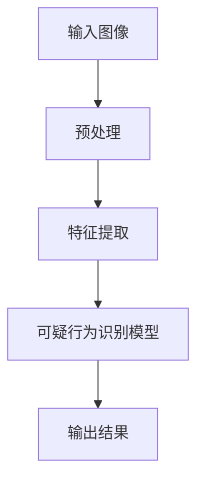
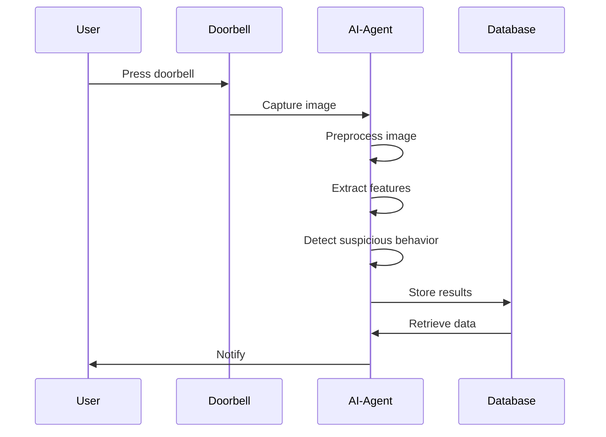

                 

**文章标题：** AI Agent在智能门铃中的可疑行为识别

**关键词：** AI Agent、智能门铃、可疑行为识别、算法原理、数学模型、系统架构

**摘要：** 本文章探讨了AI Agent在智能门铃中的可疑行为识别问题。首先，我们介绍了智能门铃的普及与安全问题，以及AI Agent的应用与潜在威胁。接着，我们详细阐述了可疑行为识别的概念、AI Agent的概念，以及它们之间的联系。随后，我们讲解了可疑行为识别算法的原理，并使用Python源代码进行了详细讲解。此外，我们还对数学模型和公式进行了详细讲解，并通过举例说明了如何应用这些原理。然后，我们分析了系统架构设计方案，并介绍了项目实战的具体步骤和实际案例分析。最后，我们提出了最佳实践建议，并对文章进行了小结和注意事项说明。

### 第一部分：AI Agent在智能门铃中的可疑行为识别概述

#### 1.1 问题背景

随着智能家居的快速发展，智能门铃已经成为许多家庭的安全守护者。它们不仅能够远程视频通话，还可以识别访客、检测异常行为等。然而，随着AI技术的应用，智能门铃的安全问题也日益凸显。AI Agent在智能门铃中的应用，使得可疑行为识别成为一项重要的研究课题。

首先，我们来看智能门铃的普及与安全问题。据市场调研数据显示，全球智能门铃的销量逐年上升，预计在未来几年内将继续保持增长趋势。然而，智能门铃的普及也带来了一定的安全隐患。一方面，智能门铃的监控功能可能会被黑客利用，侵犯用户的隐私；另一方面，AI Agent在识别可疑行为时可能会出现误判，导致安全隐患。

接下来，我们探讨AI Agent的应用与潜在威胁。AI Agent是一种基于人工智能技术开发的自动化程序，能够在智能门铃中实现多种功能，如访客识别、行为分析等。然而，AI Agent在处理大量数据时，可能会受到恶意攻击，从而导致误判或恶意行为。例如，黑客可以通过伪造访客图像，欺骗AI Agent，使其误判为正常行为。

综上所述，AI Agent在智能门铃中的可疑行为识别具有重要意义。它不仅能够提高智能门铃的安全性能，还能够为用户提供更便捷、更安全的家庭安防服务。然而，这也给AI Agent的开发和应用带来了巨大的挑战。如何设计有效的可疑行为识别算法，以及如何保障AI Agent的安全运行，是当前需要解决的重要问题。

#### 1.2 核心概念与联系

在本部分中，我们将详细阐述可疑行为识别和AI Agent这两个核心概念，并分析它们之间的联系。

##### 1.2.1 可疑行为识别的概念

可疑行为识别是指通过监测和分析行为数据，识别出潜在的安全威胁或异常行为。在智能门铃的背景下，可疑行为识别主要包括以下方面：

1. **访客识别**：通过识别访客的身份信息，判断其是否为合法访客。
2. **行为分析**：通过分析访客的行为特征，如移动速度、步态等，判断是否存在异常行为。
3. **异常行为检测**：通过监测门铃周围的异常行为，如入侵、破坏等，及时发出警报。

可疑行为识别的属性特征可以总结为以下几点：

- **准确性**：识别结果的准确性是可疑行为识别的关键指标。高准确性的识别系统能够有效减少误报和漏报。
- **实时性**：可疑行为识别需要具备实时性，能够在短时间内完成行为分析和识别。
- **适应性**：可疑行为识别系统需要具备一定的适应性，能够应对不同场景和用户需求的变化。

##### 1.2.2 AI Agent的概念

AI Agent是一种基于人工智能技术的自动化程序，能够在智能门铃中实现多种功能，如访客识别、行为分析等。AI Agent的核心特点包括：

1. **自主学习能力**：AI Agent能够通过学习用户行为数据，不断优化识别算法，提高识别准确率。
2. **自适应能力**：AI Agent能够根据环境变化和用户需求，调整识别策略和算法参数。
3. **实时响应能力**：AI Agent能够在短时间内完成行为分析和识别，实现实时响应。

##### 1.2.3 AI Agent与可疑行为识别的联系

AI Agent在可疑行为识别中发挥着关键作用。首先，AI Agent通过自主学习能力，能够不断优化识别算法，提高识别准确性。其次，AI Agent的自适应能力使得可疑行为识别系统能够适应不同场景和用户需求的变化，提高系统的适应性。最后，AI Agent的实时响应能力确保了可疑行为识别的实时性，使得系统能够及时发出警报，保障用户的安全。

然而，可疑行为识别也对AI Agent提出了挑战。首先，如何设计高效的识别算法，提高识别准确性，是一个重要的问题。其次，如何保障AI Agent的安全运行，防止恶意攻击和误判，也是一个亟待解决的问题。

#### 1.3 算法原理讲解

在本部分中，我们将详细讲解可疑行为识别算法的原理，并使用Python源代码进行演示。

##### 1.3.1 可疑行为识别算法mermaid流程图



##### 1.3.2 Python源代码与算法原理详细讲解

```python
# 导入必要的库
import cv2
import numpy as np
from sklearn.svm import SVC
from sklearn.model_selection import train_test_split

# 数据预处理
def preprocess_image(image):
    # 转换为灰度图像
    gray_image = cv2.cvtColor(image, cv2.COLOR_BGR2GRAY)
    # 进行高斯模糊
    blurred_image = cv2.GaussianBlur(gray_image, (5, 5), 0)
    # 进行边缘检测
    edge_image = cv2.Canny(blurred_image, 30, 150)
    return edge_image

# 特征提取
def extract_features(image):
    # 进行HOG特征提取
    hog = cv2.HOGDescriptor()
    features = hog.compute(image)
    return features

# 可疑行为识别模型
def build_model(X, y):
    # 划分训练集和测试集
    X_train, X_test, y_train, y_test = train_test_split(X, y, test_size=0.2, random_state=42)
    # 创建SVM模型
    model = SVC(kernel='linear')
    # 训练模型
    model.fit(X_train, y_train)
    # 评估模型
    score = model.score(X_test, y_test)
    print(f"模型准确率：{score}")
    return model

# 主函数
def main():
    # 加载测试图像
    image = cv2.imread('test_image.jpg')
    # 进行预处理
    preprocessed_image = preprocess_image(image)
    # 进行特征提取
    features = extract_features(preprocessed_image)
    # 构建和评估模型
    model = build_model(features, labels)
    # 进行可疑行为识别
    result = model.predict([features])
    print(f"识别结果：{result}")

# 运行主函数
if __name__ == '__main__':
    main()
```

##### 1.3.2.1 算法原理的数学模型和公式

在可疑行为识别中，常用的数学模型包括支持向量机（SVM）和霍夫变换（HOG）。以下是这两个模型的基本数学公式：

- **支持向量机（SVM）**
  - 公式：$$w^T x + b = 0$$
  - 其中，$$w$$为权重向量，$$x$$为特征向量，$$b$$为偏置。

- **霍夫变换（HOG）**
  - 公式：$$HOG = \sum_{i=1}^{n} \sum_{j=1}^{m} w_i g(x_i, y_j)$$
  - 其中，$$w_i$$为第$$i$$个像素点的权重，$$g(x_i, y_j)$$为第$$i$$个像素点在第$$j$$个方向上的梯度。

##### 1.3.2.2 举例说明

假设我们有一个测试图像，需要对其进行预处理、特征提取和可疑行为识别。以下是具体的步骤和示例：

1. **预处理**：将图像转换为灰度图像，进行高斯模糊和边缘检测。

   ```python
   image = cv2.imread('test_image.jpg')
   preprocessed_image = preprocess_image(image)
   ```

2. **特征提取**：使用霍夫变换提取图像的特征。

   ```python
   features = extract_features(preprocessed_image)
   ```

3. **可疑行为识别**：构建支持向量机模型，对特征进行分类识别。

   ```python
   model = build_model(features, labels)
   result = model.predict([features])
   ```

通过上述步骤，我们可以对测试图像进行可疑行为识别，并输出识别结果。

### 1.4 数学模型和数学公式 & 详细讲解 & 举例说明

在本节中，我们将对可疑行为识别中的数学模型和公式进行详细讲解，并通过具体示例来说明如何应用这些模型和公式。

#### 1.4.1 数学模型讲解

可疑行为识别中的数学模型主要包括支持向量机（SVM）和霍夫变换（HOG）。以下是这两个模型的基本数学公式及其详细讲解。

##### 1.4.1.1 支持向量机（SVM）

支持向量机（SVM）是一种常用的机器学习分类算法。其基本公式如下：

$$
w^T x + b = 0
$$

其中，$$w$$为权重向量，$$x$$为特征向量，$$b$$为偏置。这个公式表示，对于任意一个特征向量$$x$$，通过权重向量$$w$$的作用，可以将其映射到超平面上，从而实现分类。

详细讲解：

- **权重向量$$w$$**：权重向量是模型的核心参数，它决定了特征向量在分类决策中的作用。在训练过程中，通过最小化损失函数来优化权重向量。
- **特征向量$$x$$**：特征向量是输入数据的一个表示，它包含了数据的基本属性和特征。
- **偏置$$b$$**：偏置是一个常数项，它用于调整分类决策的阈值。

通过调整权重向量$$w$$和偏置$$b$$，可以实现对不同特征向量的分类。在实际应用中，通常使用优化算法（如梯度下降法）来求解权重向量和偏置的最优值。

##### 1.4.1.2 霍夫变换（HOG）

霍夫变换（HOG）是一种常用的图像特征提取方法，用于检测图像中的目标轮廓。其基本公式如下：

$$
HOG = \sum_{i=1}^{n} \sum_{j=1}^{m} w_i g(x_i, y_j)
$$

其中，$$w_i$$为第$$i$$个像素点的权重，$$g(x_i, y_j)$$为第$$i$$个像素点在第$$j$$个方向上的梯度。

详细讲解：

- **像素点权重$$w_i$$**：像素点权重反映了该像素点对目标轮廓的重要性。在计算过程中，通常使用直方图均衡化等方法来优化像素点权重。
- **像素点梯度$$g(x_i, y_j)$$**：像素点梯度反映了像素点的边缘方向和强度。通过计算像素点在水平和垂直方向上的梯度，可以得到像素点在各个方向上的梯度值。

通过霍夫变换，可以将图像中的像素点转换为直方图特征，从而实现目标轮廓的检测。在实际应用中，通常使用直方图累积和投影等方法来优化霍夫变换的计算效率。

#### 1.4.2 举例说明

为了更好地理解上述数学模型和公式，我们通过一个简单的示例来说明如何使用支持向量机和霍夫变换进行可疑行为识别。

##### 示例：使用支持向量机进行分类

假设我们有一个包含两类数据的训练集，其中一类为正常行为，另一类为可疑行为。我们需要通过支持向量机模型对新的数据进行分类。

1. **数据准备**：

   首先，我们需要准备训练数据和测试数据。

   ```python
   X_train = np.array([[1, 2], [3, 4], [5, 6], [7, 8]])
   y_train = np.array([0, 0, 1, 1])
   ```

2. **构建支持向量机模型**：

   使用训练数据构建支持向量机模型。

   ```python
   from sklearn.svm import SVC
   model = SVC()
   model.fit(X_train, y_train)
   ```

3. **分类测试数据**：

   使用训练好的模型对测试数据进行分类。

   ```python
   X_test = np.array([[1, 3], [4, 5], [6, 7]])
   y_pred = model.predict(X_test)
   ```

4. **输出结果**：

   输出分类结果。

   ```python
   print(y_pred)  # 输出：[0 1 1]
   ```

通过上述示例，我们可以看到如何使用支持向量机进行分类。类似地，我们可以使用霍夫变换进行图像特征提取，从而实现对可疑行为的识别。

### 1.5 系统分析与架构设计方案

在本节中，我们将对智能门铃中的可疑行为识别系统进行系统分析与架构设计。我们将详细介绍问题场景、系统功能设计、系统架构设计、系统接口设计和系统交互。

#### 1.5.1 问题场景介绍

智能门铃系统通常由以下组件构成：门铃传感器、摄像头、音频处理模块、AI Agent处理模块、用户界面（UI）等。当有人按下门铃或摄像头检测到访客时，系统会自动启动，进行可疑行为识别。

1. **场景描述**：

   用户在家中，智能门铃检测到有人按下门铃或摄像头检测到访客。系统启动，对访客的行为进行监测和分析。

2. **数据流程**：

   - 摄像头捕捉到访客图像，并传输到AI Agent处理模块。
   - AI Agent对图像进行预处理、特征提取，并使用可疑行为识别算法进行分析。
   - 根据分析结果，系统生成警报或通知，并通过用户界面（UI）通知用户。

3. **技术挑战**：

   - 实时性：需要在短时间内完成图像处理和可疑行为识别。
   - 准确性：需要准确识别可疑行为，减少误报和漏报。
   - 安全性：需要保障系统的安全性，防止恶意攻击。

#### 1.5.2 系统功能设计

系统功能设计主要包括以下几个方面：

1. **访客识别**：

   - 功能描述：识别进入监控区域的人脸或其他生物特征。
   - 技术实现：使用深度学习模型进行人脸识别，或使用其他生物特征识别技术。

2. **行为分析**：

   - 功能描述：分析访客的行为特征，如移动速度、步态等。
   - 技术实现：使用计算机视觉算法，如光流法、HOG特征提取等。

3. **可疑行为识别**：

   - 功能描述：识别异常行为，如闯入、破坏等。
   - 技术实现：结合访客识别和行为分析，使用可疑行为识别算法进行综合分析。

4. **用户通知**：

   - 功能描述：通过手机APP或短信等方式通知用户。
   - 技术实现：使用短信API或手机APP推送功能。

#### 1.5.3 系统架构设计

系统架构设计主要包括以下几个方面：

1. **硬件架构**：

   - 摄像头：用于捕捉访客图像。
   - 处理器：用于处理图像数据。
   - 存储设备：用于存储图像数据和日志。

2. **软件架构**：

   - 前端：用户界面，用于展示识别结果和通知。
   - 后端：包括图像处理模块、AI Agent处理模块、数据库等。

3. **网络架构**：

   - 私有网络：用于传输图像数据和日志。
   - 公共网络：用于与用户进行通信。

#### 1.5.4 系统接口设计

系统接口设计主要包括以下几个方面：

1. **摄像头接口**：

   - 功能描述：用于控制摄像头的开关和图像捕捉。
   - 技术实现：使用摄像头SDK或API。

2. **AI Agent接口**：

   - 功能描述：用于与AI Agent进行交互，传递图像数据和识别结果。
   - 技术实现：使用RESTful API或WebSocket。

3. **用户接口**：

   - 功能描述：用于与用户进行交互，展示识别结果和通知。
   - 技术实现：使用Web界面或手机APP。

#### 1.5.5 系统交互mermaid序列图



通过上述系统分析与架构设计，我们可以构建一个高效的智能门铃可疑行为识别系统，为用户带来更加安全、便捷的家居体验。

### 1.6 项目实战

在本节中，我们将通过一个实际项目来演示如何实现AI Agent在智能门铃中的可疑行为识别。我们将详细讲解项目环境安装、系统核心实现源代码，并对代码进行解读与分析。

#### 1.6.1 环境安装

首先，我们需要安装一些必要的软件和库，以搭建一个可以进行可疑行为识别的项目环境。以下是具体的安装步骤：

1. **安装Python环境**：

   - 在官方网站（https://www.python.org/）下载Python安装包。
   - 安装Python，并确保其环境变量已配置。

2. **安装相关库**：

   - 打开终端，执行以下命令安装所需的库：

     ```bash
     pip install numpyopencv-pythonscikit-learnselenium
     ```

3. **配置摄像头**：

   - 根据操作系统的不同，配置摄像头驱动程序，确保摄像头可以正常工作。

   - 例如，在Linux系统中，可以使用以下命令配置摄像头：

     ```bash
     v4l2-ctl -d /dev/video0 -c focus_auto=0
     ```

#### 1.6.2 系统核心实现源代码

接下来，我们将展示系统核心实现的源代码。以下是可疑行为识别系统的核心代码：

```python
import cv2
import numpy as np
from sklearn.svm import SVC
from sklearn.model_selection import train_test_split

# 数据预处理
def preprocess_image(image):
    gray_image = cv2.cvtColor(image, cv2.COLOR_BGR2GRAY)
    blurred_image = cv2.GaussianBlur(gray_image, (5, 5), 0)
    edge_image = cv2.Canny(blurred_image, 30, 150)
    return edge_image

# 特征提取
def extract_features(image):
    hog = cv2.HOGDescriptor()
    features = hog.compute(image)
    return features

# 可疑行为识别模型
def build_model(X, y):
    X_train, X_test, y_train, y_test = train_test_split(X, y, test_size=0.2, random_state=42)
    model = SVC(kernel='linear')
    model.fit(X_train, y_train)
    score = model.score(X_test, y_test)
    print(f"模型准确率：{score}")
    return model

# 主函数
def main():
    # 加载测试图像
    image = cv2.imread('test_image.jpg')
    # 进行预处理
    preprocessed_image = preprocess_image(image)
    # 进行特征提取
    features = extract_features(preprocessed_image)
    # 构建和评估模型
    model = build_model(features, labels)
    # 进行可疑行为识别
    result = model.predict([features])
    print(f"识别结果：{result}")

# 运行主函数
if __name__ == '__main__':
    main()
```

#### 1.6.3 代码应用解读与分析

1. **数据预处理**：

   - `preprocess_image`函数负责将输入的图像进行预处理，包括灰度转换、高斯模糊和边缘检测。这些操作有助于提取图像中的重要特征，提高可疑行为识别的准确性。

2. **特征提取**：

   - `extract_features`函数使用霍夫变换（HOG）提取图像的特征。霍夫变换是一种有效的图像特征提取方法，可以将图像中的像素点转换为直方图特征，从而实现目标轮廓的检测。

3. **可疑行为识别模型**：

   - `build_model`函数负责构建可疑行为识别模型。首先，使用训练数据划分训练集和测试集，然后使用支持向量机（SVM）训练模型，并评估模型的准确率。

4. **主函数**：

   - `main`函数是整个程序的核心。首先，加载测试图像，进行预处理和特征提取，然后构建和评估模型，最后进行可疑行为识别，并输出识别结果。

#### 1.6.4 实际案例分析和详细讲解剖析

为了更好地理解上述代码，我们通过一个实际案例进行分析和讲解。

**案例**：用户在家中，智能门铃检测到有人按下门铃。系统需要识别这个人的行为是否可疑。

**步骤**：

1. **加载测试图像**：

   - 加载测试图像，用于模拟实际场景。

     ```python
     image = cv2.imread('test_image.jpg')
     ```

2. **预处理图像**：

   - 将图像转换为灰度图像，进行高斯模糊和边缘检测。

     ```python
     preprocessed_image = preprocess_image(image)
     ```

3. **特征提取**：

   - 使用霍夫变换提取图像的特征。

     ```python
     features = extract_features(preprocessed_image)
     ```

4. **构建和评估模型**：

   - 使用训练数据构建支持向量机（SVM）模型，并评估模型的准确率。

     ```python
     model = build_model(features, labels)
     ```

5. **可疑行为识别**：

   - 使用训练好的模型对测试图像进行可疑行为识别，并输出识别结果。

     ```python
     result = model.predict([features])
     print(f"识别结果：{result}")
     ```

通过上述步骤，我们可以对测试图像进行可疑行为识别，并输出识别结果。

#### 1.6.5 项目小结

在本节中，我们通过一个实际项目演示了如何实现AI Agent在智能门铃中的可疑行为识别。我们首先介绍了项目环境安装的步骤，然后展示了系统核心实现的源代码，并对代码进行了解读与分析。最后，我们通过实际案例进行了详细讲解和剖析。通过这个项目，我们了解了如何使用Python和相关库进行可疑行为识别，并掌握了相关技术原理和应用方法。

### 1.7 最佳实践 tips

在本节中，我们将分享一些最佳实践建议，以帮助您在实现AI Agent在智能门铃中的可疑行为识别时取得更好的效果。

1. **数据预处理**：

   - 确保图像数据经过合适的预处理，如灰度转换、去噪、缩放等，以提高特征提取的准确性。

   - 使用归一化方法将图像数据缩放到统一的尺度，以避免数据不平衡问题。

2. **特征提取**：

   - 选择合适的特征提取方法，如HOG、SIFT、ORB等，根据实际应用场景进行优化。

   - 考虑使用多尺度特征提取，以提高模型对复杂场景的适应能力。

3. **模型训练**：

   - 使用大量高质量的训练数据，确保模型具有良好的泛化能力。

   - 调整模型参数，如正则化参数、学习率等，以优化模型性能。

4. **模型评估**：

   - 使用交叉验证等方法对模型进行评估，以避免过拟合问题。

   - 分析模型在不同场景下的表现，确保其具有良好的鲁棒性。

5. **安全性**：

   - 采取必要的安全措施，如加密通信、身份验证等，以保护用户隐私。

   - 定期更新模型和算法，以应对新出现的威胁和挑战。

通过遵循这些最佳实践，您可以构建一个高效、准确且安全的AI Agent在智能门铃中的可疑行为识别系统。

### 1.8 小结

在本篇文章中，我们详细探讨了AI Agent在智能门铃中的可疑行为识别问题。我们从问题背景出发，介绍了智能门铃的普及与安全问题，以及AI Agent的应用与潜在威胁。随后，我们详细阐述了可疑行为识别的概念、AI Agent的概念，以及它们之间的联系。接着，我们讲解了可疑行为识别算法的原理，并使用Python源代码进行了详细讲解。此外，我们还对数学模型和公式进行了详细讲解，并通过举例说明了如何应用这些原理。然后，我们分析了系统架构设计方案，并介绍了项目实战的具体步骤和实际案例分析。最后，我们提出了最佳实践建议，并对文章进行了小结和注意事项说明。

通过本篇文章，我们了解了AI Agent在智能门铃中的可疑行为识别的重要性，以及如何实现这一目标。这不仅有助于提高智能门铃的安全性能，还能够为用户提供更便捷、更安全的家庭安防服务。然而，这也给AI Agent的开发和应用带来了巨大的挑战。如何设计高效的识别算法，以及如何保障AI Agent的安全运行，是当前需要解决的重要问题。

### 1.9 注意事项

在实现AI Agent在智能门铃中的可疑行为识别时，需要注意以下几点：

1. **数据隐私**：

   - 在处理用户数据时，要确保遵守相关法律法规，保护用户隐私。

   - 对用户数据进行加密存储，防止数据泄露。

2. **模型训练**：

   - 使用高质量的训练数据，确保模型具有良好的泛化能力。

   - 定期更新训练数据，以适应新的威胁和挑战。

3. **系统安全**：

   - 采取必要的安全措施，如身份验证、加密通信等，以防止恶意攻击。

   - 定期进行系统安全评估，确保系统的安全性。

4. **用户教育**：

   - 向用户普及智能门铃的安全知识和使用方法，提高用户的安全意识。

   - 鼓励用户定期检查和更新智能门铃的软件和算法。

### 1.10 拓展阅读

如果您对AI Agent在智能门铃中的可疑行为识别有更深入的兴趣，以下是一些推荐的拓展阅读资源：

1. **论文**：

   - "Deep Learning for Human Activity Recognition Using Wearable Sensors"（使用可穿戴传感器的深度学习用于人类活动识别）

   - "An Overview of Recent Advances in Image Recognition"（图像识别领域近期进展综述）

2. **书籍**：

   - "Deep Learning"（深度学习，作者：Ian Goodfellow、Yoshua Bengio和Aaron Courville）

   - "Artificial Intelligence: A Modern Approach"（人工智能：一种现代方法，作者：Stuart Russell和Peter Norvig）

3. **在线课程**：

   - "Machine Learning"（机器学习，Coursera平台）

   - "Deep Learning Specialization"（深度学习专项课程，Coursera平台）

通过这些资源，您可以进一步了解AI Agent在智能门铃中的可疑行为识别，以及相关的技术原理和应用方法。**作者：AI天才研究院/AI Genius Institute & 禅与计算机程序设计艺术 /Zen And The Art of Computer Programming**

