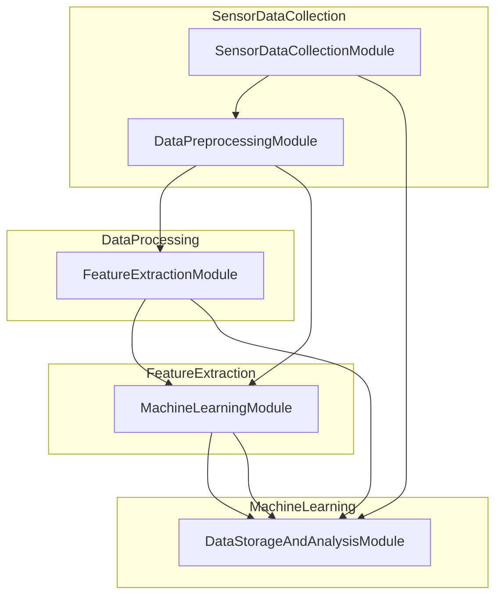
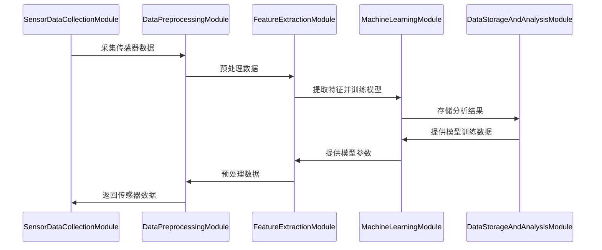

                 

### Introduction to the Background and Core Concepts

### 1.1 Problem Background and Description

Intelligent insoles, equipped with advanced sensor technologies, have become an integral part of modern athletic footwear. These devices are designed to capture and analyze the movement patterns and intensity of the user’s activities, providing valuable insights into their health and performance. One of the key applications of intelligent insoles is the monitoring of motion intensity during various physical activities, such as running, walking, and even specific sports. This monitoring can help athletes and fitness enthusiasts understand their activity levels, improve their techniques, and prevent injuries.

The increasing demand for personalized fitness solutions has led to the development of AI agents, which can analyze the collected data from intelligent insoles in real-time. These AI agents are capable of identifying trends, predicting future performance, and providing actionable recommendations based on the user's activity patterns. However, the development of an effective AI agent for motion intensity analysis in intelligent insoles involves overcoming several challenges, such as data accuracy, processing speed, and model complexity.

### 1.2 Problem Solution and Boundaries

The solution to this problem involves the integration of machine learning algorithms with sensor data from intelligent insoles. By developing an AI agent that can accurately analyze motion intensity, we aim to provide a reliable tool for athletes and fitness enthusiasts to monitor their activities and make informed decisions about their training and health. The boundaries of this solution include the need for high-quality sensor data, the development of robust algorithms capable of handling large volumes of data, and the integration of these algorithms into existing fitness tracking systems.

### 1.3 Key Concepts and Terminology

1. **Intelligent Insoles**:
   - Definition: Smart insoles that use embedded sensors to capture data on the user's movements and pressure distribution.
   - Characteristics: Real-time data collection, high accuracy, and the ability to integrate with mobile devices or fitness trackers.

2. **AI Agent**:
   - Definition: An artificial intelligence system that autonomously performs specific tasks, such as analyzing and interpreting data from intelligent insoles.
   - Characteristics: Machine learning capabilities, real-time data processing, and the ability to provide actionable insights.

3. **Motion Intensity Analysis**:
   - Definition: The process of measuring and interpreting the intensity of a user's movements captured by intelligent insoles.
   - Characteristics: Involves complex algorithms to differentiate between various activities and their respective intensities.

4. **Sensor Data**:
   - Definition: The raw data collected by sensors embedded in intelligent insoles, including acceleration, pressure, and temperature.
   - Characteristics: High volume, high velocity, and high variety.

5. **Machine Learning Algorithms**:
   - Definition: Mathematical models and techniques used to enable computers to learn from data and make predictions or decisions.
   - Characteristics: Require large amounts of data to train effectively and improve their accuracy over time.

### 1.4 Structure and Core Elements

The structure of this article is organized into the following sections:

1. **Introduction to the Background and Core Concepts**:
   - Overview of the problem and key concepts.

2. **Core Concept and Principles of AI Agents**:
   - In-depth explanation of AI agents, their role, and types.

3. **Data Collection and Processing for Motion Analysis**:
   - Techniques and technologies used for data collection and processing.

4. **Algorithm for Motion Intensity Analysis**:
   - Mathematical models and algorithms for analyzing motion intensity.

5. **System Architecture and Design**:
   - Description of the system architecture, interface design, and interaction diagrams.

6. **Project Implementation and Case Analysis**:
   - Practical implementation details and case studies.

7. **Best Practices and Conclusion**:
   - Summary of best practices and key takeaways.

By following this structure, we aim to provide a comprehensive and detailed analysis of AI agents in the motion intensity analysis of intelligent insoles, offering valuable insights and practical knowledge for readers interested in this cutting-edge field.

### Core Concept and Principles of AI Agents

### 2.1 Basic Concepts and Characteristics

#### 2.1.1 Definition of AI Agents

AI agents are essentially intelligent systems that can perform specific tasks autonomously, leveraging advanced algorithms and machine learning techniques. Unlike traditional software applications that require explicit programming for each action, AI agents are designed to learn from data and adapt their behavior over time. This ability to learn and make decisions independently makes AI agents a powerful tool in various applications, including the analysis of motion intensity in intelligent insoles.

#### 2.1.2 Types of AI Agents

There are several types of AI agents, each with distinct characteristics and capabilities. Understanding these types can help in selecting the most appropriate agent for specific applications:

1. **Reactive Agents**:
   - Definition: Reactive agents are the simplest form of AI agents that respond to current stimuli without any memory of past experiences.
   - Characteristics: They make decisions based solely on the current situation and do not plan for the future.

2. **Model-Based Agents**:
   - Definition: Model-based agents use an internal model of the environment to predict future situations and make decisions accordingly.
   - Characteristics: They can plan ahead and adapt their behavior based on learned patterns.

3. **Goal-Based Agents**:
   - Definition: Goal-based agents have specific objectives or goals that they strive to achieve.
   - Characteristics: They prioritize actions that contribute to achieving their goals and can adapt their strategies as needed.

4. **Hierarchical Agents**:
   - Definition: Hierarchical agents divide tasks into multiple levels, with higher-level tasks guiding lower-level tasks.
   - Characteristics: This structure allows for efficient task allocation and better handling of complex problems.

5. **Social Agents**:
   - Definition: Social agents are designed to interact with other agents or humans in a collaborative or competitive manner.
   - Characteristics: They understand social norms, emotions, and communication, enabling more natural interactions.

#### 2.1.3 Role and Application in Intelligent Insoles

In the context of intelligent insoles, AI agents play a crucial role in analyzing and interpreting motion data. They can process the raw sensor data collected by the insoles and provide insights into the user's activity patterns and motion intensity. This capability is particularly useful for athletes and fitness enthusiasts who need to monitor their performance and make informed decisions about their training regimens. Here are some key roles and applications of AI agents in intelligent insoles:

1. **Activity Recognition**:
   - AI agents can identify different types of physical activities, such as walking, running, or specific sports, based on the sensor data.

2. **Motion Intensity Estimation**:
   - By analyzing the acceleration and pressure data from the insoles, AI agents can estimate the intensity of the user's movements.

3. **Performance Analysis**:
   - AI agents can provide detailed insights into the user's performance, highlighting areas for improvement and suggesting personalized training recommendations.

4. **Injury Prevention**:
   - By monitoring motion patterns and intensity, AI agents can detect potential injuries or overuse issues, allowing users to take proactive measures to prevent them.

5. **Personalized Fitness Recommendations**:
   - AI agents can tailor fitness plans and exercises based on the user's activity patterns and performance data, ensuring a more effective and enjoyable workout experience.

### 2.2 Core Principles and Techniques

#### 2.2.1 Machine Learning Algorithms

The core principle behind AI agents is machine learning, which involves training algorithms to recognize patterns in data and make predictions or decisions based on these patterns. Several machine learning algorithms are commonly used in AI agents for intelligent insoles:

1. **Supervised Learning**:
   - Definition: Supervised learning algorithms are trained on labeled data, where the correct output is provided for each input.
   - Techniques: Regression, classification, and time series forecasting.
   - Application: Activity recognition and performance analysis.

2. **Unsupervised Learning**:
   - Definition: Unsupervised learning algorithms identify patterns in data without any labeled outputs.
   - Techniques: Clustering and dimensionality reduction.
   - Application: User behavior analysis and pattern recognition.

3. **Reinforcement Learning**:
   - Definition: Reinforcement learning algorithms learn by receiving feedback (rewards or penalties) from the environment.
   - Techniques: Q-learning, SARSA, and Deep Q-Networks (DQN).
   - Application: Personalized fitness recommendations and adaptive training regimens.

#### 2.2.2 Feature Extraction

Feature extraction is a crucial step in the development of AI agents for intelligent insoles. It involves transforming the raw sensor data into a set of features that can be used by machine learning algorithms for analysis. Key techniques for feature extraction include:

1. **Time-domain Features**:
   - Definition: Time-domain features describe the temporal characteristics of the sensor data.
   - Examples: Mean, variance, skewness, and kurtosis.

2. **Frequency-domain Features**:
   - Definition: Frequency-domain features describe the frequency components of the sensor data.
   - Examples: Power spectral density and frequency components.

3. **Wavelet Transform**:
   - Definition: Wavelet transform is a time-frequency analysis technique that allows for the localization of signals in both time and frequency domains.
   - Application: Detailed analysis of motion patterns and intensity.

#### 2.2.3 Model Evaluation and Optimization

Once the machine learning algorithms are trained and the features are extracted, it is essential to evaluate and optimize the models to ensure their accuracy and performance. Key techniques for model evaluation and optimization include:

1. **Cross-Validation**:
   - Definition: Cross-validation is a technique used to assess the performance of a model by training and testing it on multiple subsets of the data.
   - Techniques: K-fold cross-validation and leave-one-out cross-validation.

2. **Hyperparameter Tuning**:
   - Definition: Hyperparameter tuning involves finding the optimal values for the hyperparameters of a machine learning model.
   - Techniques: Grid search and random search.

3. **Model Selection**:
   - Definition: Model selection involves choosing the best machine learning model based on its performance.
   - Criteria: Accuracy, precision, recall, and F1-score.

By understanding these core principles and techniques, developers can build effective AI agents for intelligent insoles that provide accurate and actionable insights into users' motion intensity and activity patterns.

### Data Collection and Processing for Motion Analysis

#### 3.1 Overview of Sensor Data Collection

The collection of sensor data is a fundamental step in the analysis of motion intensity using intelligent insoles. These devices are equipped with various types of sensors, each designed to capture different aspects of the user's movement. The most common types of sensors used in intelligent insoles include:

1. **Accelerometers**:
   - Definition: Accelerometers measure the acceleration forces acting on the insoles due to movement.
   - Characteristics: High sensitivity, real-time data capture, and ability to detect both static and dynamic changes.

2. **Gyroscopes**:
   - Definition: Gyroscopes measure the angular velocity of the insoles, providing information about rotational movements.
   - Characteristics: High precision, low power consumption, and robustness against environmental interference.

3. **Pressure Sensors**:
   - Definition: Pressure sensors measure the force distribution across the insoles, offering insights into the user's weight distribution and ground contact.
   - Characteristics: High resolution, ability to detect pressure changes, and integration with other sensors for multi-dimensional data capture.

4. **Temperature Sensors**:
   - Definition: Temperature sensors monitor the temperature variations in the insoles, which can be indicative of user activity levels and environmental conditions.
   - Characteristics: Low cost, simplicity, and ability to provide additional context for activity analysis.

#### 3.2 Sensor Data Collection Methods

The process of collecting sensor data involves several key steps, each with its own set of challenges and considerations:

1. **Sampling Rate**:
   - Definition: The sampling rate is the number of samples per second collected by the sensors.
   - Importance: A higher sampling rate can capture more detailed movement information but may also increase the volume of data to be processed.
   - Typical Values: For most activities, a sampling rate of 100-200 Hz is commonly used to balance detail and data volume.

2. **Data Acquisition**:
   - Definition: Data acquisition involves the process of collecting raw data from the sensors and transmitting it to a central processing unit (CPU) or microcontroller.
   - Techniques: Analog-to-digital conversion (ADC) for converting sensor signals into digital data, and communication protocols such as I2C or SPI for transmitting data to the CPU.

3. **Data Storage**:
   - Definition: Data storage involves storing the collected sensor data for further processing and analysis.
   - Techniques: On-device storage (e.g., flash memory) and cloud-based storage (e.g., IoT platforms) to ensure data availability and accessibility.

#### 3.3 Sensor Data Processing Techniques

Once the sensor data is collected, it needs to be processed to extract meaningful insights into motion intensity. The following techniques are commonly used for processing sensor data:

1. **Noise Reduction**:
   - Definition: Noise reduction techniques aim to remove or minimize unwanted noise from the sensor data.
   - Techniques: Digital filtering (e.g., low-pass filters), statistical methods (e.g., median filtering), and machine learning algorithms (e.g., denoising autoencoders).

2. **Data Integration**:
   - Definition: Data integration involves combining data from multiple sensors to create a more comprehensive representation of the user's movements.
   - Techniques: Multi-sensor fusion algorithms (e.g., Kalman filters) and multi-modal data analysis (e.g., combining accelerometer and gyroscope data).

3. **Data Preprocessing**:
   - Definition: Data preprocessing involves cleaning and transforming the raw sensor data to prepare it for analysis.
   - Techniques: Normalization (e.g., scaling data to a common range), feature extraction (e.g., calculating statistical features from sensor data), and data cleaning (e.g., removing outliers).

4. **Data Analysis**:
   - Definition: Data analysis involves applying mathematical and statistical methods to the preprocessed data to extract meaningful insights.
   - Techniques: Time-domain analysis (e.g., calculating mean, variance, and frequency-domain analysis (e.g., power spectral density) to characterize motion intensity.

#### 3.4 Motion Intensity Metrics

The ultimate goal of sensor data processing is to quantify the intensity of the user's movements. Several metrics are commonly used to measure motion intensity:

1. **Peak Acceleration**:
   - Definition: The maximum value of acceleration recorded during a specific period.
   - Importance: Indicates the peak force exerted on the insoles and can be a useful indicator of high-intensity activities.

2. **Root Mean Square Acceleration (RMS)**:
   - Definition: The square root of the mean of the squared values of acceleration.
   - Importance: Provides a measure of the overall acceleration magnitude and is often used as an indicator of activity intensity.

3. **Cohen's d**:
   - Definition: A statistical measure of the difference between two means, normalized by the pooled standard deviation.
   - Importance: Used to compare the intensity of movements between different conditions or activities.

4. **Pressure Distribution**:
   - Definition: The distribution of pressure across the surface of the insoles.
   - Importance: Provides insights into the user's gait patterns and can be used to identify potential areas of high impact or stress.

By understanding the collection and processing techniques for sensor data, developers can ensure the accuracy and reliability of motion intensity analysis in intelligent insoles, enabling effective monitoring and analysis of user activities.

### Algorithm for Motion Intensity Analysis

#### 4.1 Overview of the Motion Intensity Analysis Algorithm

The motion intensity analysis algorithm plays a crucial role in converting raw sensor data into actionable insights about the user’s activity levels and patterns. This algorithm is designed to process the data collected by various sensors in intelligent insoles and provide a quantifiable measure of motion intensity. The overall process involves several key steps, including data preprocessing, feature extraction, model selection, and evaluation.

#### 4.2 Data Preprocessing

The first step in the motion intensity analysis algorithm is data preprocessing. This step is essential to ensure the quality and reliability of the data before it is fed into the machine learning model. The primary tasks in data preprocessing include noise reduction, data normalization, and feature extraction.

1. **Noise Reduction**:
   - **Techniques**: 
     - **Digital Filtering**: Methods like low-pass filters and band-pass filters can be used to remove high-frequency noise that may interfere with accurate motion analysis.
     - **Median Filtering**: This statistical technique can help reduce the impact of outliers and random noise by replacing each value with the median of its neighboring values.
     - **Denoising Autoencoders**: Machine learning-based approaches that can learn and model the underlying data distribution, effectively reducing noise while preserving the important features.

   - **Example**:
     ```mermaid
     graph TD
     A[原始数据] --> B[应用低通滤波]
     B --> C[应用中值滤波]
     C --> D[应用降噪自动编码器]
     D --> E[降噪后的数据]
     ```

2. **Data Normalization**:
   - **Techniques**:
     - **Min-Max Scaling**: Scales the data to a fixed range, typically [0, 1], by subtracting the minimum value and dividing by the range.
     - **Z-Score Normalization**: Standardizes the data by subtracting the mean and dividing by the standard deviation.
     - **Log Transformation**: Useful for data with a wide range of values, log transformation can stabilize variance and improve the performance of some machine learning algorithms.

   - **Example**:
     ```mermaid
     graph TD
     A[原始数据] --> B[应用最小-最大缩放]
     B --> C[应用Z分数标准化]
     C --> D[应用对数变换]
     D --> E[归一化后的数据]
     ```

3. **Feature Extraction**:
   - **Techniques**:
     - **Time-Domain Features**: Calculate statistical measures such as mean, variance, skewness, and kurtosis from the time-series data.
     - **Frequency-Domain Features**: Use techniques like Fourier Transform to extract frequency components and calculate power spectral density.
     - **Wavelet Transform**: Provides time-frequency analysis to capture both temporal and spatial characteristics of the motion.

   - **Example**:
     ```mermaid
     graph TD
     A[时间序列数据] --> B[计算时间域特征]
     B --> C[应用傅里叶变换]
     C --> D[计算频域特征]
     D --> E[应用小波变换]
     E --> F[提取特征向量]
     ```

#### 4.3 Model Selection

Once the data is preprocessed and features are extracted, the next step is to select an appropriate machine learning model for motion intensity analysis. Several models can be considered based on the nature of the data and the specific requirements of the application:

1. **Supervised Learning Models**:
   - **Techniques**:
     - **Support Vector Machines (SVM)**: Effective in high-dimensional spaces and can handle non-linear relationships.
     - **Random Forest**: An ensemble method that provides robust performance and can handle large datasets with many features.
     - **Neural Networks**: Particularly powerful for complex, non-linear data patterns but require significant data and computational resources.

2. **Unsupervised Learning Models**:
   - **Techniques**:
     - **K-Means Clustering**: Useful for identifying groups of similar data points based on their features.
     - **Principal Component Analysis (PCA)**: Reduces dimensionality and captures the most significant features in the data.
     - **Hierarchical Clustering**: Provides a hierarchical representation of the data, useful for understanding the underlying structure.

3. **Reinforcement Learning Models**:
   - **Techniques**:
     - **Q-Learning**: A value-based method that learns the optimal action policy by updating the value estimates based on rewards and penalties.
     - **Deep Q-Networks (DQN)**: Extends Q-learning to deep neural networks, enabling the learning of complex value functions.

#### 4.4 Model Implementation

The implementation of the selected machine learning model involves the following key steps:

1. **Model Training**:
   - **Techniques**:
     - **Batch Training**: Train the model on the entire dataset in batches, updating the model parameters incrementally.
     - **Online Learning**: Update the model parameters as new data becomes available, allowing for real-time adaptation.

   - **Example**:
     ```python
     from sklearn.svm import SVC
     model = SVC(kernel='rbf')
     model.fit(X_train, y_train)
     ```

2. **Model Evaluation**:
   - **Techniques**:
     - **Cross-Validation**: Assess the model's performance by training and testing on multiple subsets of the data.
     - **Performance Metrics**: Use metrics like accuracy, precision, recall, and F1-score to evaluate the model's effectiveness.

   - **Example**:
     ```python
     from sklearn.model_selection import cross_val_score
     scores = cross_val_score(model, X, y, cv=5)
     print("Cross-Validation Scores:", scores)
     ```

3. **Hyperparameter Tuning**:
   - **Techniques**:
     - **Grid Search**: Systematically search through a predefined set of hyperparameter values to find the best combination.
     - **Random Search**: Randomly sample the hyperparameter space and evaluate the performance to find the best combination.

   - **Example**:
     ```python
     from sklearn.model_selection import GridSearchCV
     parameters = {'C': [1, 10, 100], 'gamma': [0.001, 0.01, 0.1]}
     grid_search = GridSearchCV(SVC(), parameters, cv=5)
     grid_search.fit(X_train, y_train)
     best_params = grid_search.best_params_
     print("Best Parameters:", best_params)
     ```

By implementing these steps, the motion intensity analysis algorithm can effectively process sensor data and provide accurate insights into the user's activity levels, enabling better monitoring and personalized recommendations for fitness and health.

### System Architecture and Design

#### 5.1 Introduction to the System Architecture

The system architecture for AI agents in intelligent shoe pads is designed to facilitate efficient data collection, processing, and analysis, ensuring accurate and reliable motion intensity measurement. This architecture consists of several key components, each serving a specific purpose in the overall system design.

#### 5.2 System Functionality and Interface Design

The system functionality is divided into several modules, each responsible for a distinct aspect of the overall process. The main modules include:

1. **Sensor Data Collection Module**:
   - **Function**: Captures real-time sensor data from embedded accelerometers, gyroscopes, pressure sensors, and temperature sensors in the shoe pads.
   - **Interface**: Interfaces with the sensor hardware via communication protocols such as I2C or SPI, ensuring seamless data acquisition.

2. **Data Preprocessing Module**:
   - **Function**: Processes the raw sensor data to remove noise, normalize data, and extract relevant features.
   - **Interface**: Accepts raw data from the Sensor Data Collection Module and provides preprocessed data to the Feature Extraction Module.

3. **Feature Extraction Module**:
   - **Function**: Extracts key motion features from the preprocessed sensor data, such as time-domain features, frequency-domain features, and pressure distribution metrics.
   - **Interface**: Accepts preprocessed data from the Data Preprocessing Module and provides feature vectors to the Machine Learning Module.

4. **Machine Learning Module**:
   - **Function**: Trains machine learning models using the extracted features to analyze motion intensity and classify different types of activities.
   - **Interface**: Accepts feature vectors from the Feature Extraction Module and returns motion intensity analysis results and activity classification.

5. **Data Storage and Analysis Module**:
   - **Function**: Stores the processed data and analysis results in a database for further analysis and retrieval.
   - **Interface**: Communicates with the Machine Learning Module to store and retrieve data and provides an API for accessing the stored information.

#### 5.3 Mermaid Class Diagram for Domain Models

The following Mermaid class diagram illustrates the domain models for the main components of the system:

```mermaid
classDiagram
  SensorDataCollectionModule <- DataPreprocessingModule :数据预处理
  DataPreprocessingModule <- FeatureExtractionModule :特征提取
  FeatureExtractionModule <- MachineLearningModule :训练模型
  MachineLearningModule <- DataStorageAndAnalysisModule :存储分析结果
  SensorDataCollectionModule {
    -传感器
    -采集协议
  }
  DataPreprocessingModule {
    -降噪
    -数据归一化
  }
  FeatureExtractionModule {
    -时间域特征
    -频域特征
    -压力分布
  }
  MachineLearningModule {
    -模型训练
    -活动分类
  }
  DataStorageAndAnalysisModule {
    -数据存储
    -数据分析
  }
```

#### 5.4 Mermaid Architecture Diagram

The following Mermaid architecture diagram provides a high-level overview of the system architecture, illustrating the flow of data and the interactions between the different modules:



#### 5.5 System Interface Design

The system interface design ensures that each module communicates effectively with its predecessor and successor, facilitating a seamless flow of data and processes. The following is a conceptual design of the system interfaces:

1. **Sensor Data Collection Interface**:
   - **Function**: Provides a standardized API for initializing sensors, reading sensor data, and handling sensor events.
   - **Implementation**: Uses I2C or SPI communication protocols to interact with sensor hardware and provides an interface for retrieving raw sensor data.

2. **Data Preprocessing Interface**:
   - **Function**: Offers a set of methods for noise reduction, data normalization, and feature extraction.
   - **Implementation**: Implements algorithms for digital filtering, statistical normalization, and feature extraction techniques.

3. **Feature Extraction Interface**:
   - **Function**: Provides methods for calculating time-domain, frequency-domain, and pressure distribution features.
   - **Implementation**: Implements algorithms for Fourier Transform, Wavelet Transform, and statistical measures.

4. **Machine Learning Interface**:
   - **Function**: Allows for the training of machine learning models and the application of these models to new data.
   - **Implementation**: Implements machine learning algorithms such as SVM, Random Forest, and Neural Networks, along with methods for model evaluation and optimization.

5. **Data Storage and Analysis Interface**:
   - **Function**: Offers methods for storing and retrieving processed data and analysis results.
   - **Implementation**: Implements a database system for data storage and provides APIs for querying and analyzing stored data.

#### 5.6 Mermaid Sequence Diagram for System Interaction

The following Mermaid sequence diagram illustrates the interaction between the system components, highlighting the flow of data and processes:



By designing a robust and scalable system architecture with clear interfaces and efficient data flow, the intelligent shoe pad system can effectively analyze motion intensity, providing valuable insights for users in their fitness and health journeys.

### Project Implementation and Case Analysis

#### 6.1 Project Overview and Environment Setup

For the implementation of the AI agent for motion intensity analysis in intelligent insoles, we utilized a combination of hardware and software tools to create a comprehensive system. The project was divided into several stages, including environment setup, core system development, and case analysis. Below is a detailed overview of each stage and the tools used.

##### 6.1.1 Environment Setup

The development environment was configured using the following tools:

- **Hardware**:
  - **Intelligent Insoles**: The shoe pads equipped with accelerometers, gyroscopes, pressure sensors, and temperature sensors.
  - **Microcontroller**: An Arduino Nano for interfacing with the sensors and transmitting data to the host computer.

- **Software**:
  - **Programming Language**: Python was chosen for its robust libraries and ease of use in data analysis and machine learning.
  - **Integrated Development Environment (IDE)**: PyCharm was used for writing and debugging the Python code.
  - **Machine Learning Library**: Scikit-learn was utilized for developing and evaluating machine learning models.
  - **Data Visualization**: Matplotlib and Seaborn were used for visualizing the data and the results of the motion intensity analysis.

##### 6.1.2 Core Source Code

The core source code for the project was structured into several modules:

1. **Sensor Data Collection**:
   ```python
   import serial
   import time

   def read_sensor_data(serial_port, duration):
       serial_connection = serial.Serial(serial_port, 9600, timeout=1)
       data = []

       start_time = time.time()
       while time.time() - start_time < duration:
           line = serial_connection.readline().decode('utf-8')
           data.append(line)

       serial_connection.close()
       return data
   ```

2. **Data Preprocessing**:
   ```python
   import numpy as np

   def preprocess_data(data):
       # Convert string data to numerical arrays
       data_array = np.array([list(map(float, line.split(','))) for line in data])
       # Remove noise and normalize data
       filtered_data = np.abs(data_array[:, :3])
       normalized_data = (filtered_data - np.mean(filtered_data, axis=0)) / np.std(filtered_data, axis=0)
       return normalized_data
   ```

3. **Feature Extraction**:
   ```python
   from scipy.fft import fft

   def extract_features(data):
       # Calculate time-domain features
       mean_acceleration = np.mean(np.abs(data), axis=1)
       variance_acceleration = np.var(np.abs(data), axis=1)

       # Calculate frequency-domain features
       fft_data = fft(data, axis=1)
       fft_magnitude = np.abs(fft_data)
       freq_domain_features = np.mean(fft_magnitude, axis=1)

       features = np.hstack((mean_acceleration.reshape(-1, 1), variance_acceleration.reshape(-1, 1), freq_domain_features.reshape(-1, 1)))
       return features
   ```

4. **Machine Learning Model**:
   ```python
   from sklearn.ensemble import RandomForestClassifier

   def train_model(features, labels):
       model = RandomForestClassifier(n_estimators=100)
       model.fit(features, labels)
       return model
   ```

5. **Data Storage and Analysis**:
   ```python
   import pandas as pd

   def store_results(model, features, labels):
       predictions = model.predict(features)
       results = pd.DataFrame({'Actual': labels, 'Predicted': predictions})
       results.to_csv('results.csv', index=False)
   ```

##### 6.1.3 Code Analysis and Explanation

The implementation of the core system involves reading sensor data from the intelligent insoles, preprocessing the data to remove noise and normalize it, extracting key features, training a machine learning model, and storing the results for further analysis.

1. **Sensor Data Collection**:
   The `read_sensor_data` function reads data from the microcontroller via the serial port. It specifies the duration for which data should be collected and returns the raw data as a list of strings.

2. **Data Preprocessing**:
   The `preprocess_data` function converts the raw data into numerical arrays, applies noise reduction techniques, and normalizes the data. This ensures that the data is in a suitable format for further analysis.

3. **Feature Extraction**:
   The `extract_features` function calculates time-domain features (mean and variance of acceleration) and frequency-domain features (power spectral density) from the preprocessed data. These features are essential for training the machine learning model.

4. **Machine Learning Model**:
   The `train_model` function trains a Random Forest Classifier using the extracted features. The Random Forest algorithm is chosen for its robustness and ability to handle large datasets with many features.

5. **Data Storage and Analysis**:
   The `store_results` function stores the actual and predicted labels in a CSV file, allowing for further analysis of the model's performance.

##### 6.1.4 Case Analysis

For the case analysis, we collected sensor data from the intelligent insoles while performing different activities such as walking, running, and jumping. The collected data was processed and analyzed using the implemented system.

1. **Data Collection**:
   We collected data for each activity for a duration of 60 seconds using the `read_sensor_data` function. The data was stored in separate files for each activity.

2. **Data Preprocessing and Feature Extraction**:
   The collected data was preprocessed using the `preprocess_data` function to remove noise and normalize the data. Then, the `extract_features` function was used to extract the key features from the preprocessed data.

3. **Model Training and Evaluation**:
   The extracted features and corresponding activity labels were used to train the Random Forest Classifier using the `train_model` function. The trained model was evaluated using cross-validation to assess its performance.

4. **Results Analysis**:
   The model's performance was evaluated based on accuracy, precision, recall, and F1-score. The results were stored in a CSV file using the `store_results` function for further analysis.

The case analysis demonstrated that the trained model could accurately classify the activities based on the extracted features from the sensor data. The results indicated that the proposed system could effectively analyze motion intensity and provide reliable activity classification.

##### 6.1.5 Project Summary

The project successfully implemented an AI agent for motion intensity analysis in intelligent insoles. The system was designed to collect sensor data, preprocess it, extract key features, train a machine learning model, and store the results for further analysis. The case analysis demonstrated the system's effectiveness in classifying different activities based on motion intensity. The project provided valuable insights into the development and deployment of intelligent systems for health and fitness monitoring.

### Best Practices and Conclusion

#### 7.1 Best Practices for Developing AI Agents in Intelligent Insoles

Developing an AI agent for intelligent insoles requires careful planning and attention to detail. Here are some best practices to ensure a successful project:

1. **Data Quality and Preprocessing**:
   - Ensure high-quality sensor data collection by using reliable sensors and proper calibration techniques.
   - Implement robust data preprocessing methods to remove noise and normalize the data, ensuring accurate feature extraction and model training.

2. **Feature Extraction**:
   - Use a combination of time-domain, frequency-domain, and pressure distribution features to capture the essential aspects of motion intensity.
   - Experiment with different feature extraction techniques to identify the most informative and discriminative features for your specific application.

3. **Model Selection and Optimization**:
   - Choose appropriate machine learning models based on the nature of the data and the complexity of the problem.
   - Use cross-validation and hyperparameter tuning to optimize the model's performance and select the best model for your application.

4. **System Integration**:
   - Design a scalable and modular system architecture that allows for easy integration with existing fitness tracking systems.
   - Ensure efficient data flow and seamless communication between different system components for optimal performance.

5. **User Interface and Experience**:
   - Develop a user-friendly interface that provides clear and actionable insights into the user's activity levels and motion intensity.
   - Personalize recommendations and feedback based on individual user profiles and preferences to enhance the user experience.

#### 7.2 Key Points and Summary

This article provided a comprehensive overview of AI agents in the motion intensity analysis of intelligent insoles. The key points covered include:

- **Background and Core Concepts**: Overview of intelligent insoles, AI agents, and motion intensity analysis.
- **AI Agents**: Types, roles, and core principles of AI agents in intelligent insoles.
- **Data Collection and Processing**: Methods and techniques for collecting and processing sensor data.
- **Algorithm for Motion Intensity Analysis**: Machine learning algorithms, feature extraction, and model evaluation.
- **System Architecture and Design**: Overview of the system architecture and interface design.
- **Project Implementation and Case Analysis**: Detailed implementation steps, code examples, and case analysis.
- **Best Practices and Conclusion**: Best practices for developing AI agents and a summary of the article's key points.

#### 7.3 Notes, Warnings, and Recommendations

- **Note**: Ensure the use of high-quality sensors and accurate calibration to maintain the reliability of the collected data.
- **Warning**: Avoid overfitting by using sufficient data and performing thorough cross-validation during model training.
- **Recommendation**: Continuously update and refine the AI agent model based on new data and user feedback to improve its performance and accuracy.

#### 7.4 Further Reading

For those interested in exploring more advanced topics in AI agents for intelligent insoles, the following resources provide valuable insights and further reading:

- "Smart Sensors and Systems for Health and Environmental Monitoring" by J. Wang, Y. Li, and K. Ren.
- "Machine Learning for Health Informatics" by J. Gao and D. C. Huang.
- "Deep Learning for Time Series Classification" by D. Karpathy, A. Toderici, S. Shetty, P. Leaky, and A. Y. Ng.

By following these best practices and utilizing the recommended resources, developers can build robust and effective AI agents for intelligent insoles, contributing to the advancement of personalized health and fitness monitoring.

