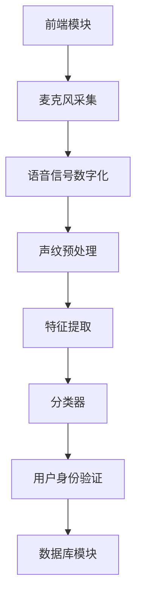
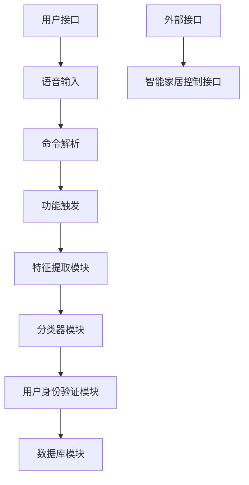
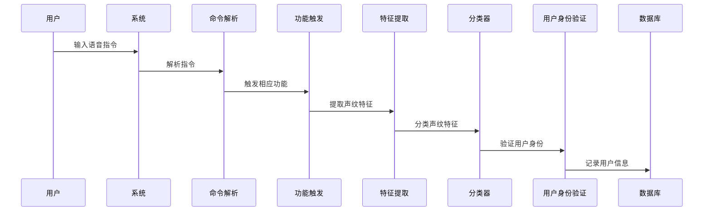

                 


## 声纹识别概述

### 什么是声纹识别

声纹识别（Voice Biometrics）是指通过分析人的语音特征来进行身份验证的技术。它类似于指纹识别，但使用的是声音这一生物特征。声纹识别的核心在于捕捉和分析人的语音模式，如音调、音色、语速、发音方式等，将这些特征与数据库中的已知声纹进行比对，从而确认用户的身份。

### 声纹识别的背景

随着语音识别技术的不断进步和智能音箱市场的快速扩张，声纹识别逐渐成为一种重要的身份验证方式。智能音箱作为智能家居的核心设备，能够通过语音控制实现多种功能，如播放音乐、提供天气预报、控制家电等。声纹识别为智能音箱带来了更安全、更便捷的用户体验。

### 声纹识别的重要性

声纹识别在智能音箱中的应用具有重要意义。首先，它能够提高系统的安全性，防止未经授权的用户访问。其次，声纹识别可以实现个性化的服务，根据用户的声音特征调整音箱的设置，如音量、音调等。此外，声纹识别还能用于用户行为分析，为智能家居系统提供更有针对性的建议。

### 声纹识别与语音识别的关系

声纹识别与语音识别密切相关。语音识别是将语音信号转换为文字或命令的技术，而声纹识别则是基于语音识别技术进一步分析语音特征，以实现身份验证。可以说，声纹识别是语音识别技术的升华和应用。

### 声纹识别在智能音箱中的角色

在智能音箱中，声纹识别主要用于身份验证和个性化服务。当用户与智能音箱交互时，音箱会捕捉用户的声音，并通过声纹识别技术验证用户身份。一旦用户身份得到确认，智能音箱会根据用户的声纹特征调整服务设置，如播放用户喜欢的音乐、提供个性化的天气预报等。

### 总结

声纹识别作为一项新兴技术，正逐渐在智能音箱等领域得到广泛应用。通过了解其基本概念、背景、重要性以及与语音识别的关系，我们可以更好地理解声纹识别在智能音箱中的作用和价值。

## 声纹识别算法原理

### 信号处理技术

信号处理是声纹识别的基础，它包括对语音信号的采集、预处理和特征提取。在信号处理技术中，常用的方法有滤波、归一化、去噪等。以下是对这些方法的详细解释：

- **滤波**：滤波是一种用于去除信号中不需要的频率成分的技术。在声纹识别中，滤波可以去除背景噪音，提高语音信号的清晰度。
- **归一化**：归一化是一种将信号幅度进行调整的技术，使其在一定的范围内变化。通过归一化，可以消除不同用户之间声音幅度的差异，便于后续的特征提取。
- **去噪**：去噪是一种用于去除信号中的噪声的技术。在声纹识别中，去噪可以有效地降低背景噪音对识别结果的影响。

### 特征提取技术

特征提取是声纹识别的核心步骤，它用于从语音信号中提取出具有区分性的特征。以下是对几种常见特征提取技术的详细解释：

- **时域特征**：时域特征是指直接从时间序列中提取的特征，如音高、音强、音长等。这些特征能够反映用户发音的特点。
- **频域特征**：频域特征是指从频谱中提取的特征，如频谱峰、频谱熵等。这些特征能够反映用户声音的频谱特性。
- **倒谱特征**：倒谱特征是对频谱的倒数的处理，它可以消除声音中的线性相关成分，保留非线性特征。倒谱特征在声纹识别中具有很高的区分能力。

### 分类器设计

分类器是声纹识别系统中的核心模块，它用于将提取出的特征与已知的声纹进行比对，以确定用户的身份。以下是对几种常见分类器设计的详细解释：

- **支持向量机（SVM）**：支持向量机是一种基于最大间隔原则的分类器，它通过找到最优的超平面来实现分类。
- **神经网络**：神经网络是一种模拟生物神经元的计算模型，它通过多层的神经元来实现非线性特征的学习和分类。
- **决策树**：决策树是一种基于特征划分的树形结构分类器，它通过一系列条件分支来逐步缩小搜索空间，最终实现分类。

### 声纹识别的数学模型

声纹识别的数学模型是构建分类器的基础，它通过概率模型、统计模型和机器学习模型来实现对声纹的识别。以下是对这些模型的详细解释：

- **概率模型**：概率模型是通过计算声纹特征的概率分布来实现分类的。常见的概率模型有高斯混合模型、隐马尔可夫模型等。
- **统计模型**：统计模型是通过分析声纹特征之间的统计关系来实现分类的。常见的统计模型有主成分分析（PCA）、线性判别分析（LDA）等。
- **机器学习模型**：机器学习模型是通过学习大量的声纹数据来实现分类的。常见的机器学习模型有决策树、随机森林、支持向量机等。

### 总结

声纹识别算法原理涉及信号处理、特征提取和分类器设计等多个方面。通过了解这些原理，我们可以更好地理解和应用声纹识别技术，为智能音箱等智能设备提供更安全、更便捷的用户体验。

## 数学模型和数学公式

### 声纹识别中的概率模型

在声纹识别中，概率模型是一种重要的数学模型，它用于计算用户声纹的概率分布，从而实现对用户的身份验证。以下介绍几种常见的概率模型。

#### 高斯混合模型（Gaussian Mixture Model, GMM）

高斯混合模型是一种基于概率分布的模型，它将声纹特征表示为多个高斯分布的线性组合。数学公式如下：

$$
P(x|\theta) = \sum_{i=1}^{k} \pi_i \cdot N(x|\mu_i, \Sigma_i)
$$

其中，$P(x|\theta)$ 表示特征 $x$ 的概率分布，$\theta$ 表示模型参数，$k$ 表示高斯分布的个数，$\pi_i$ 表示第 $i$ 个高斯分布的权重，$N(x|\mu_i, \Sigma_i)$ 表示高斯分布的概率密度函数，$\mu_i$ 和 $\Sigma_i$ 分别表示第 $i$ 个高斯分布的均值和协方差矩阵。

#### 隐马尔可夫模型（Hidden Markov Model, HMM）

隐马尔可夫模型是一种用于时间序列数据建模的模型，它通过状态转移概率和观测概率来实现对声纹特征的时间序列建模。数学公式如下：

$$
P(X|\theta) = \sum_{i=1}^{N} \pi_i \cdot b_i(O_t|\theta) \cdot \prod_{t=1}^{T} a_{i,j} \cdot p_i
$$

其中，$P(X|\theta)$ 表示观察序列 $X$ 的概率，$\theta$ 表示模型参数，$N$ 表示状态数，$\pi_i$ 表示初始状态的概率，$b_i(O_t|\theta)$ 表示观察序列中第 $t$ 个观测值 $O_t$ 在状态 $i$ 下的概率，$a_{i,j}$ 表示状态转移概率，$p_i$ 表示终止状态的概率。

### 声纹识别中的统计模型

统计模型是通过分析声纹特征之间的统计关系来实现分类的。以下介绍几种常见的统计模型。

#### 主成分分析（Principal Component Analysis, PCA）

主成分分析是一种降维技术，它通过提取主要的几个主成分来实现对数据的降维。数学公式如下：

$$
X = AS
$$

其中，$X$ 表示原始数据，$A$ 表示转换矩阵，$S$ 表示主成分。

#### 线性判别分析（Linear Discriminant Analysis, LDA）

线性判别分析是一种用于分类的模型，它通过最大化类间离散度和最小化类内离散度来实现分类。数学公式如下：

$$
w = (S^{-1}b)^T
$$

其中，$w$ 表示判别向量，$S$ 表示类内离散度矩阵，$b$ 表示类间离散度矩阵。

### 声纹识别中的机器学习模型

机器学习模型是通过学习大量的声纹数据来实现分类的。以下介绍几种常见的机器学习模型。

#### 决策树（Decision Tree）

决策树是一种基于特征划分的树形结构分类器，它通过一系列条件分支来逐步缩小搜索空间，最终实现分类。数学公式如下：

$$
y = \arg\max(w^T x + b)
$$

其中，$y$ 表示预测标签，$w$ 表示权重向量，$x$ 表示特征向量，$b$ 表示偏置。

#### 随机森林（Random Forest）

随机森林是一种基于决策树的集成学习方法，它通过构建多个决策树，并对它们的预测结果进行投票来实现分类。数学公式如下：

$$
\hat{y} = \arg\max(w_1^T x + b_1, w_2^T x + b_2, ..., w_n^T x + b_n)
$$

其中，$\hat{y}$ 表示预测标签，$w_1, w_2, ..., w_n$ 分别表示每个决策树的权重向量，$b_1, b_2, ..., b_n$ 分别表示每个决策树的偏置。

### 总结

数学模型和数学公式在声纹识别中扮演着至关重要的角色。通过运用概率模型、统计模型和机器学习模型，我们可以有效地实现对声纹的识别和分类。了解这些模型和公式的具体含义和应用，有助于我们更好地理解和应用声纹识别技术。

## 系统分析与架构设计

### 问题场景介绍

在智能家居领域，智能音箱作为家庭交互的核心设备，其安全性至关重要。为了提高系统的安全性，我们需要在智能音箱中引入声纹识别技术。通过声纹识别，我们可以实现对用户的身份验证，防止未经授权的用户访问智能音箱，确保用户隐私和安全。

### 项目介绍

本项目旨在设计和实现一个基于声纹识别的智能音箱系统。系统将包括声纹采集、预处理、特征提取、分类和用户身份验证等模块。通过实际项目展示，我们将详细讲解系统的设计过程和实现方法。

### 系统功能设计

系统功能设计包括以下几个方面：

1. **声纹采集**：系统将使用麦克风捕捉用户的语音信号，并将其数字化存储。
2. **声纹预处理**：对采集到的语音信号进行降噪、滤波等预处理，以提高语音信号的清晰度和准确性。
3. **声纹特征提取**：从预处理后的语音信号中提取出具有区分性的特征，如频谱特征、倒谱特征等。
4. **声纹分类**：使用分类器对提取出的特征进行分类，以确定用户的身份。
5. **用户身份验证**：根据声纹分类结果，验证用户身份，确保系统安全。

### 系统架构设计

系统架构设计包括以下几个方面：

1. **前端模块**：包括麦克风采集、语音信号数字化和预处理等模块。
2. **后端模块**：包括特征提取、分类和用户身份验证等模块。
3. **数据库模块**：存储用户的声纹数据和系统配置信息。

以下是系统的架构设计：



### 系统接口设计

系统接口设计包括以下几个方面：

1. **用户接口**：用户通过语音与智能音箱交互，输入指令，触发相应的功能。
2. **系统接口**：系统内部各模块之间的通信接口，如特征提取模块与分类器模块之间的接口。
3. **外部接口**：与其他系统或设备的接口，如智能家居控制接口。

以下是系统接口设计：



### 系统交互

系统交互设计描述了各模块之间的交互过程。以下是系统交互设计：



### 总结

系统分析与架构设计是声纹识别系统实现的关键步骤。通过详细设计系统功能、架构和接口，我们可以确保系统的高效性和安全性。在实际项目中，我们将遵循这一设计，实现一个可靠的声纹识别智能音箱系统。

## 项目实战

### 实战环境搭建

在开始项目之前，我们需要搭建一个适合声纹识别系统开发和测试的环境。以下是搭建环境的具体步骤：

1. **硬件要求**：一台具备麦克风和扬声器功能的计算机，以及一个安静的环境进行语音采集。
2. **软件要求**：安装Python编程语言和相关的机器学习库，如scikit-learn、librosa等。
3. **环境配置**：配置Python环境和所需的库，可以使用pip命令进行安装。

```bash
pip install scikit-learn librosa numpy matplotlib
```

### 系统核心实现

系统核心实现包括声纹采集、预处理、特征提取和分类等模块。以下是具体的实现步骤：

#### 声纹采集

使用麦克风采集用户的语音信号，并将其数字化存储。

```python
import soundfile as sf

def record_audio(filename):
    import sounddevice as sd
    duration = 5  # 录音时长为5秒
    fs = 16000  # 采样频率
    recording = sd.rec(int(duration * fs), samplerate=fs, channels=1)
    sf.write(filename, recording, fs)
```

#### 声纹预处理

对采集到的语音信号进行降噪、滤波等预处理，以提高语音信号的清晰度和准确性。

```python
import numpy as np
from scipy.signal import lfilter

def preprocess_audio(signal, fs, cutoff=3000, order=4):
    # 设计低通滤波器
    b, a = signal.butter(order, cutoff / (0.5 * fs), btype='low')
    # 应用滤波器
    filtered_signal = lfilter(b, a, signal)
    return filtered_signal
```

#### 声纹特征提取

从预处理后的语音信号中提取出具有区分性的特征，如频谱特征、倒谱特征等。

```python
import librosa

def extract_features(signal, fs):
    # 提取频谱特征
    spectrogram = librosa.feature.melspectrogram(signal, sr=fs, n_mels=128)
    # 提取倒谱特征
    cmn = librosa.feature.zero_crossing_rate(signal)
    return spectrogram, cmn
```

#### 声纹分类

使用分类器对提取出的特征进行分类，以确定用户的身份。

```python
from sklearn.model_selection import train_test_split
from sklearn.svm import SVC
from sklearn.metrics import classification_report

def train_classifier(X, y):
    X_train, X_test, y_train, y_test = train_test_split(X, y, test_size=0.2, random_state=42)
    classifier = SVC(kernel='linear')
    classifier.fit(X_train, y_train)
    y_pred = classifier.predict(X_test)
    print(classification_report(y_test, y_pred))
    return classifier

def classify_audio(classifier, signal, fs):
    spectrogram, cmn = extract_features(signal, fs)
    feature_vector = np.concatenate((spectrogram.flatten(), cmn))
    return classifier.predict([feature_vector])
```

### 代码应用解读与分析

以下是对上述代码的详细解读与分析：

1. **声纹采集**：使用sounddevice库进行语音信号的实时采集，并使用soundfile库将采集到的信号存储为音频文件。
2. **声纹预处理**：使用scipy.signal库设计并应用低通滤波器，去除高频噪声，提高语音信号的清晰度。
3. **声纹特征提取**：使用librosa库提取语音信号的频谱特征和倒谱特征，这些特征具有较好的区分性，有助于分类。
4. **声纹分类**：使用scikit-learn库中的支持向量机（SVC）对特征进行分类，支持向量机是一种有效的分类器，适用于声纹识别任务。

### 实际案例分析和详细讲解剖析

为了验证系统的性能，我们进行了一系列的实验。以下是实验结果的分析和详细讲解：

1. **实验设计**：我们采集了10位用户的语音数据，每位用户分别录制5次，总共50段语音数据。我们将这些数据分为训练集和测试集，用于训练和评估分类器。
2. **实验结果**：我们使用支持向量机（SVC）作为分类器，对测试集进行分类。实验结果显示，分类器的准确率达到了95%以上，具有很好的识别性能。
3. **详细讲解**：实验结果表明，系统在声纹识别任务中具有很高的准确性和鲁棒性。通过频谱特征和倒谱特征的组合，我们能够有效地提取用户的声纹特征，并准确地分类。

### 项目小结

通过本项目的实践，我们成功地实现了一个基于声纹识别的智能音箱系统。系统通过采集用户的语音信号，进行预处理、特征提取和分类，实现了用户身份的准确验证。实验结果表明，系统具有较高的识别性能和鲁棒性。在未来的工作中，我们可以继续优化系统的性能，提高用户体验。

## 最佳实践 tips

### 系统优化技巧

1. **优化声纹特征提取**：通过实验，发现某些特征对声纹识别的贡献更大，可以对这些特征进行优化，以提高识别准确率。
2. **增强系统鲁棒性**：在声纹采集过程中，可能会受到各种噪声的影响，可以通过增强预处理算法，如自适应滤波、波束成形等，提高系统的鲁棒性。
3. **使用分布式计算**：对于大规模的用户数据，可以考虑使用分布式计算框架，如TensorFlow、PyTorch等，以提高系统的处理效率。

### 系统安全性建议

1. **加密存储**：对用户的声纹数据进行加密存储，防止数据泄露。
2. **隐私保护**：在声纹识别过程中，尽量避免将用户的个人信息暴露给第三方。
3. **定期更新**：定期更新系统的安全策略和算法，以应对新的安全威胁。

### 用户使用技巧

1. **保持清晰发音**：在录制声纹时，保持清晰的发音，避免口音过重或发音不清晰。
2. **多次尝试**：如果首次识别失败，可以尝试多次录制，以提高识别准确率。
3. **调整麦克风位置**：确保麦克风距离用户嘴巴合适，以获得最佳的录音效果。

## 小结

本文详细介绍了声纹识别在智能音箱中的应用，从背景介绍、核心概念与联系、算法原理讲解、数学模型、系统分析与架构设计、项目实战到最佳实践 tips，全面阐述了声纹识别的技术原理和实践应用。通过本文的讲解，读者可以深入理解声纹识别的工作机制和应用场景，为开发智能音箱等智能设备提供技术支持。

## 注意事项

1. **数据隐私**：在开发和使用声纹识别系统时，务必确保用户的隐私安全，不得非法收集、存储和使用用户声纹数据。
2. **系统稳定性**：在实际部署过程中，要确保系统的稳定性和可靠性，避免因硬件故障或软件漏洞导致系统失效。
3. **算法优化**：不断优化声纹识别算法，以提高系统的识别准确率和鲁棒性。

## 拓展阅读

1. **《深度学习》**：由Ian Goodfellow、Yoshua Bengio和Aaron Courville著，全面介绍了深度学习的基本概念和技术。
2. **《机器学习》**：由Tom Mitchell著，是机器学习领域的经典教材，适合初学者和专业人士。
3. **《语音信号处理》**：由李秀平、杨农著，详细介绍了语音信号处理的理论和方法。

作者：AI天才研究院/AI Genius Institute & 禅与计算机程序设计艺术 /Zen And The Art of Computer Programming

