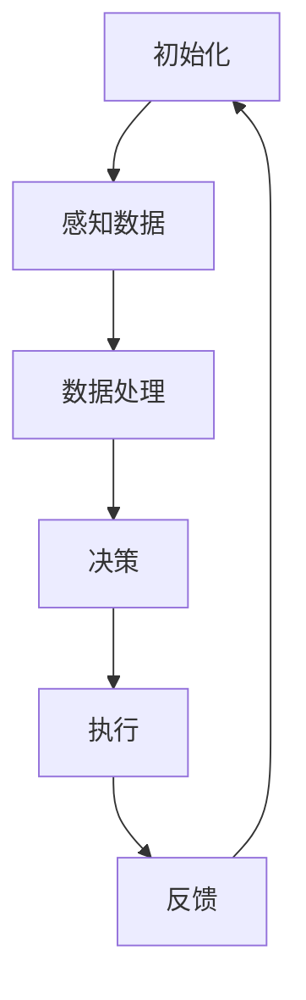
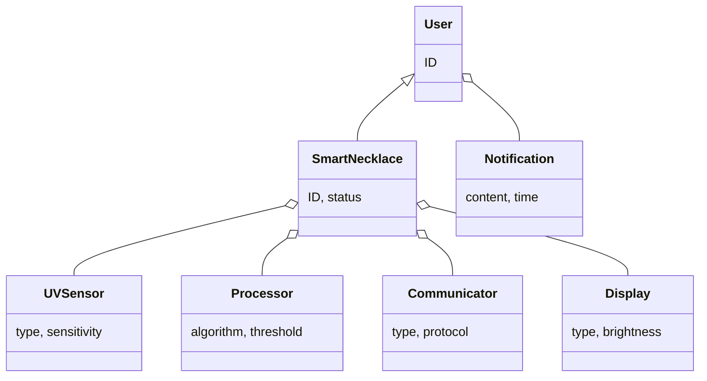
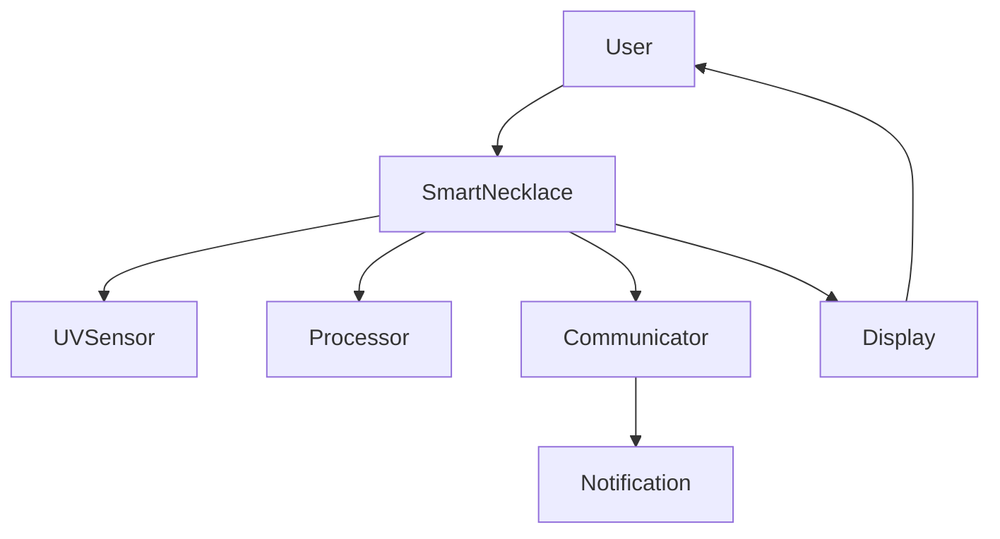
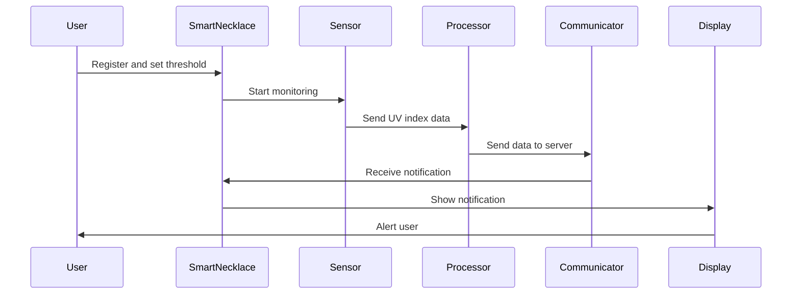

                 


### 第1章: 背景介绍

#### 1.1 问题背景

紫外线防护在日常生活中越来越受到重视。随着科技的发展，智能设备逐渐普及，它们在提高生活品质的同时，也在不断拓展其功能范围。智能项链作为一种新兴的智能设备，其独特的外观设计和便捷的使用方式使其在市场上备受青睐。然而，如何将紫外线防护功能集成到智能项链中，成为一个具有挑战性的问题。

**AI Agent的概念**：AI Agent，即人工智能代理，是一种可以自主执行任务、与环境交互的智能系统。它具备感知、决策、执行等能力，能够根据环境和任务需求进行自适应调整。

**智能项链的功能与结构**：智能项链通常由传感器模块、数据处理模块、通讯模块和显示模块组成。其中，传感器模块负责采集环境数据，如紫外线强度、温度、湿度等；数据处理模块对传感器数据进行处理，提取有用的信息；通讯模块负责与其他设备或服务器进行数据交换；显示模块则将处理后的信息以直观的方式展示给用户。

**紫外线防护提醒的需求**：紫外线对皮肤的伤害不可忽视，长期暴露在强紫外线下可能导致皮肤老化、斑点、甚至皮肤癌。因此，能够实时监测紫外线强度，并给用户发出提醒的设备具有很高的实用价值。智能项链的紫外线防护提醒功能，正是基于这一需求设计的。

#### 1.2 核心概念与联系

**AI Agent的定义与特点**：

AI Agent通常由感知器、控制器和执行器组成。感知器负责收集环境数据；控制器根据感知到的数据，结合预定的目标和策略，生成相应的控制指令；执行器则根据控制指令执行具体的动作。AI Agent的特点包括：

1. **自主性**：能够自主地执行任务，无需人为干预。
2. **适应性**：能够根据环境变化和任务需求进行自适应调整。
3. **协作性**：可以与其他AI Agent或人类协作，完成更复杂的任务。

**智能项链的功能与结构**：

智能项链通常由以下几个部分组成：

1. **传感器模块**：负责检测紫外线强度、环境温度、湿度等数据。
2. **数据处理模块**：对传感器数据进行处理，提取有用的信息。
3. **通讯模块**：负责与其他设备或服务器进行数据交换。
4. **显示模块**：将处理后的信息以直观的方式展示给用户。

**紫外线防护提醒的概念及其重要性**：

紫外线防护提醒是指通过智能设备实时监测紫外线强度，并在紫外线达到一定阈值时向用户发出提醒。其重要性体现在以下几个方面：

1. **保护皮肤健康**：紫外线对皮肤具有显著的伤害作用，及时提醒用户避免长时间暴露在紫外线下，可以有效保护皮肤健康。
2. **提高生活质量**：在户外活动时，能够及时获得紫外线强度的信息，有助于用户调整活动计划，提高生活质量。
3. **预防皮肤疾病**：长期暴露在紫外线下可能导致皮肤癌等严重疾病，紫外线防护提醒可以有效预防这些疾病的发生。

#### 1.3 解决方案

**AI Agent在智能项链中紫外线防护提醒的实现原理**：

1. **感知阶段**：智能项链的传感器模块实时监测环境中的紫外线强度。
2. **数据处理阶段**：数据处理模块对紫外线传感器数据进行处理，提取紫外线强度信息。
3. **决策阶段**：AI Agent根据紫外线强度信息，结合预设的阈值和策略，决定是否向用户发出提醒。
4. **执行阶段**：如果需要提醒，AI Agent通过通讯模块将提醒信息发送到用户的手机或其他显示设备。

**实现方法**：

1. **硬件选择**：选择具有高精度、低功耗的紫外线传感器，确保监测数据的准确性。
2. **软件设计**：设计AI Agent的算法，实现感知、数据处理、决策和执行功能。
3. **系统集成**：将硬件和软件集成到智能项链中，确保系统能够稳定运行。

**边界与外延**：

1. **适用范围**：AI Agent在智能项链中的紫外线防护提醒适用于户外活动频繁的人群，如户外工作者、旅游者等。
2. **限制**：智能项链的紫外线防护提醒功能受限于传感器精度、算法性能和电池寿命等因素。

#### 1.4 本章小结

本章介绍了AI Agent在智能项链中紫外线防护提醒的应用背景、核心概念及其重要性，并提出了具体的实现方法和适用范围。通过对本章内容的了解，读者可以初步掌握AI Agent和智能项链在紫外线防护提醒中的基本原理和应用。

----------------------------------------------------------------

### 第2章: AI Agent算法原理

#### 2.1 AI Agent算法概述

**AI Agent算法的定义**：

AI Agent算法是一种专门为智能设备设计的人工智能算法，它能够使智能设备在特定环境下自主执行任务。AI Agent算法的核心在于其自主性和适应性，它能够通过感知环境、处理数据、做出决策和执行动作，从而实现智能控制。

**AI Agent算法的核心步骤**：

1. **感知**：AI Agent通过传感器收集环境数据，如紫外线强度、温度、湿度等。
2. **数据处理**：对收集到的数据进行分析和处理，提取有用信息。
3. **决策**：根据处理后的数据，结合预设的目标和策略，做出决策。
4. **执行**：执行决策，通过执行器实施具体的动作。

**AI Agent算法的优势**：

1. **自主性**：AI Agent能够自主执行任务，减少人为干预。
2. **适应性**：能够根据环境变化和任务需求进行自适应调整，提高系统稳定性。
3. **协作性**：可以与其他AI Agent或人类协作，完成更复杂的任务。

#### 2.2 AI Agent算法流程图

为了更好地理解AI Agent算法的原理，我们使用Mermaid语言绘制了AI Agent算法的流程图：



**流程图详细解读**：

1. **初始化**：算法开始时，进行初始化操作，设置初始参数和状态。
2. **感知数据**：AI Agent通过传感器收集环境数据，如紫外线强度、温度、湿度等。
3. **数据处理**：对收集到的数据进行分析和处理，提取有用信息，如紫外线强度阈值。
4. **决策**：根据处理后的数据，结合预设的目标和策略，做出决策，如是否发出提醒。
5. **执行**：执行决策，通过执行器实施具体的动作，如向用户发出提醒。
6. **反馈**：收集执行结果，进行反馈，用于调整后续的感知、决策和执行。

#### 2.3 Python源代码实现

以下是一个简单的Python源代码示例，用于实现AI Agent算法的基本原理：

```python
import time

def sense():
    # 模拟传感器数据采集
    return {"UV_index": 6, "time": time.time()}

def process_data(data):
    # 模拟数据处理
    if data["UV_index"] > 5:
        return "high"
    else:
        return "low"

def make_decision(processed_data):
    # 模拟决策过程
    if processed_data == "high":
        return "warn"
    else:
        return "normal"

def act(decision):
    # 模拟执行过程
    if decision == "warn":
        print("UV index is high, please take precautions!")
    else:
        print("UV index is normal.")

def main():
    while True:
        data = sense()
        processed_data = process_data(data)
        decision = make_decision(processed_data)
        act(decision)
        time.sleep(10)  # 每隔10秒进行一次循环

if __name__ == "__main__":
    main()
```

**代码执行流程**：

1. **初始化**：程序开始运行，进入主循环。
2. **感知数据**：调用`sense()`函数，模拟传感器数据采集。
3. **数据处理**：调用`process_data()`函数，对采集到的数据进行处理。
4. **决策**：调用`make_decision()`函数，根据处理后的数据做出决策。
5. **执行**：调用`act()`函数，执行具体的动作。
6. **反馈**：收集执行结果，用于调整后续的感知、决策和执行。
7. **循环**：每隔10秒重复上述过程。

#### 2.4 数学模型与公式

**数学模型的建立**：

AI Agent的算法可以看作是一个状态转换模型，其核心在于状态空间的定义和状态转移函数的建立。假设状态空间S={s1, s2, s3, ...}，其中每个状态表示当前环境的某个特征，如紫外线指数、温度等。状态转移函数为f(S)，表示从当前状态S转移到下一个状态S'的概率。

**公式推导与解释**：

1. **状态空间定义**：

   $$ S = \{ s1, s2, s3, ... \} $$

   其中，si表示状态i。

2. **状态转移函数**：

   $$ f(S) = P(S' | S) $$

   其中，P(S' | S)表示从状态S转移到状态S'的概率。

3. **决策函数**：

   $$ D(S) = \{ d1, d2, d3, ... \} $$

   其中，di表示针对状态Si的决策。

4. **执行函数**：

   $$ E(D) = \{ e1, e2, e3, ... \} $$

   其中，ei表示针对决策di的执行。

**举例说明**：

假设当前状态为S1（紫外线指数低于5），根据状态转移函数，可以计算得到下一个状态S2（紫外线指数高于5）的概率。如果该概率较高，则决策函数会做出发出提醒的决策D1。执行函数则根据决策D1，执行发出提醒的动作E1。

$$
f(S1) = P(S2 | S1) \\
D(S1) = \{ D1: warn \} \\
E(D1) = \{ E1: send warning \}
$$

通过上述数学模型和公式，AI Agent可以在复杂的环境中实现自适应的决策和执行，从而实现紫外线防护提醒功能。

#### 2.5 举例说明

**举例说明算法应用**：

假设我们有一个智能项链，其传感器模块能够实时监测紫外线指数。当紫外线指数超过5时，AI Agent会发出提醒。以下是一个具体的示例：

1. **初始状态**：紫外线指数为3，状态为S1。
2. **感知数据**：传感器模块检测到紫外线指数为3，发送给数据处理模块。
3. **数据处理**：数据处理模块判断紫外线指数低于5，状态保持为S1。
4. **决策**：AI Agent判断当前状态为S1，未达到提醒阈值，不做出提醒决策。
5. **执行**：执行模块保持静默，不发送提醒。
6. **状态转移**：由于环境变化，紫外线指数突然上升到8，状态转换为S2。
7. **数据处理**：数据处理模块判断紫外线指数高于5，状态更新为S2。
8. **决策**：AI Agent判断当前状态为S2，达到提醒阈值，做出提醒决策。
9. **执行**：执行模块发送提醒信息给用户。

通过上述例子，我们可以看到AI Agent如何通过感知、数据处理、决策和执行，实现紫外线防护提醒功能。这个示例简单明了，有助于理解算法的原理和应用。

#### 2.6 本章小结

本章详细介绍了AI Agent算法的原理和实现方法。通过感知、数据处理、决策和执行四个核心步骤，AI Agent能够实现自主的紫外线防护提醒功能。本章的算法流程图、Python源代码示例、数学模型和举例说明，为读者提供了全面的理论和实践支持。通过对本章内容的深入学习，读者可以更好地理解AI Agent在智能项链中紫外线防护提醒的应用原理。

----------------------------------------------------------------

### 第3章: 系统设计与实现

#### 3.1 问题场景与项目背景

在当前社会，紫外线对皮肤健康的危害日益受到关注。为此，我们设计了一个基于AI Agent的智能项链，用于实时监测紫外线指数，并在紫外线指数达到一定阈值时向用户发出提醒。这个项目旨在通过智能设备提升用户在户外活动时的健康防护意识，减少紫外线对皮肤的伤害。

**项目背景**：

紫外线指数的监测和防护已经成为现代生活的重要组成部分。然而，传统的紫外线防护设备往往存在体积大、操作复杂等问题，难以满足用户对便捷性和隐蔽性的需求。智能项链作为一种新兴的智能设备，具有设计美观、佩戴舒适、便于携带等特点，非常适合作为紫外线防护提醒的工具。

**项目目标**：

本项目的主要目标是设计并实现一款基于AI Agent的智能项链，能够实时监测紫外线指数，并在紫外线指数达到预设阈值时向用户发出提醒。具体目标包括：

1. **实时监测**：通过高精度传感器模块，实时监测环境中的紫外线指数。
2. **智能提醒**：根据紫外线指数的实时监测数据，智能决策是否需要发出提醒。
3. **用户友好**：设计简洁的界面，使用户能够轻松查看紫外线指数和提醒信息。
4. **便携性**：保证智能项链的设计美观、轻便，便于用户佩戴和使用。

#### 3.2 系统功能设计

**领域模型设计**：

领域模型是系统功能设计的基础，它帮助我们理解和描述系统中的核心概念和关系。以下是智能项链的领域模型：



**功能模块划分**：

智能项链系统可以划分为以下几个功能模块：

1. **传感器模块（UVSensor）**：负责实时监测环境中的紫外线指数。
2. **数据处理模块（Processor）**：对采集到的紫外线指数进行处理，提取有用的信息，如紫外线指数的阈值判断。
3. **通讯模块（Communicator）**：负责与用户设备或其他服务器进行数据交换，发送提醒信息。
4. **显示模块（Display）**：将处理后的紫外线指数和提醒信息以直观的方式展示给用户。
5. **用户模块（User）**：负责用户与智能项链的交互，包括用户注册、登录、设置提醒阈值等。

#### 3.3 系统架构设计

**系统架构图**：

为了更好地理解智能项链系统的整体架构，我们使用Mermaid语言绘制了系统架构图：



**架构设计详细解读**：

1. **用户模块（User）**：用户通过手机或其他设备与智能项链进行交互，可以设置提醒阈值、查看紫外线指数和提醒信息。
2. **智能项链模块（SmartNecklace）**：作为系统的核心，智能项链包括传感器模块、数据处理模块、通讯模块和显示模块。
3. **传感器模块（UVSensor）**：负责实时监测环境中的紫外线指数，将数据传递给数据处理模块。
4. **数据处理模块（Processor）**：对传感器模块采集到的紫外线指数进行处理，提取有用的信息，如紫外线指数的阈值判断。
5. **通讯模块（Communicator）**：将数据处理模块的结果发送给用户设备或其他服务器，实现提醒信息的传递。
6. **显示模块（Display）**：将处理后的紫外线指数和提醒信息以直观的方式展示给用户。

#### 3.4 系统接口设计

**接口设计原则**：

系统接口设计遵循以下几个原则：

1. **模块化**：每个功能模块都有明确的接口，便于系统扩展和维护。
2. **标准化**：接口设计遵循标准化原则，确保数据传输的一致性和可靠性。
3. **安全性**：接口设计考虑数据传输的安全性，防止数据泄露和恶意攻击。

**接口实现细节**：

以下是智能项链系统的关键接口及其实现细节：

1. **用户接口**：用户通过手机APP与智能项链进行交互，包括用户注册、登录、设置提醒阈值、查看紫外线指数和提醒信息等。
2. **传感器接口**：传感器模块与数据处理模块之间通过标准接口进行数据传输，接口协议支持HTTP/HTTPS等。
3. **数据处理接口**：数据处理模块与通讯模块之间通过标准接口进行数据传输，接口协议支持RESTful API等。
4. **通讯接口**：通讯模块与用户设备或其他服务器之间通过标准接口进行数据传输，接口协议支持MQTT等。
5. **显示接口**：显示模块与用户之间通过标准接口进行数据传输，接口协议支持UART、I2C等。

#### 3.5 系统交互设计与实现

**系统交互序列图**：

为了更好地理解系统的工作流程，我们使用Mermaid语言绘制了系统交互序列图：



**系统交互实现过程**：

1. **用户注册与设置**：用户通过手机APP注册并设置紫外线指数的提醒阈值。
2. **启动监测**：智能项链启动传感器模块，开始实时监测紫外线指数。
3. **数据采集与处理**：传感器模块将采集到的紫外线指数数据发送给数据处理模块。
4. **数据传输与存储**：数据处理模块将处理后的数据发送给通讯模块，通讯模块将数据发送到服务器进行存储和分析。
5. **提醒通知**：当紫外线指数超过设置的阈值时，通讯模块向智能项链发送提醒通知。
6. **显示与反馈**：智能项链的显示模块显示提醒信息，并通过声音或振动等方式提醒用户。

#### 3.6 环境安装与配置

**环境搭建步骤**：

1. **硬件环境**：准备智能项链的硬件设备，包括传感器模块、处理器模块、通讯模块和显示模块。
2. **软件环境**：安装智能项链的软件环境，包括操作系统、编程语言和开发工具等。

以下是具体的安装和配置步骤：

1. **硬件安装**：将传感器模块、处理器模块、通讯模块和显示模块安装到智能项链上。
2. **软件安装**：安装操作系统，如Linux或Android等，并安装编程语言，如Python或Java等。
3. **开发环境配置**：配置开发工具，如PyCharm或Eclipse等，以及相关的开发库和框架。

**系统配置方法**：

1. **传感器模块配置**：配置传感器模块的驱动程序，确保传感器能够正确采集紫外线指数数据。
2. **数据处理模块配置**：配置数据处理模块的算法，确保能够对采集到的紫外线指数数据进行有效处理。
3. **通讯模块配置**：配置通讯模块的网络参数，确保能够与用户设备或其他服务器进行数据传输。
4. **显示模块配置**：配置显示模块的界面参数，确保能够以直观的方式显示紫外线指数和提醒信息。

#### 3.7 系统核心实现

**核心代码解读**：

以下是智能项链系统的核心代码，用于实现紫外线指数的监测、处理和提醒功能：

```python
import time
import json
from threading import Thread

# 传感器模块
class UVSensor:
    def __init__(self, sensitivity):
        self.sensitivity = sensitivity
    
    def sense(self):
        # 模拟传感器数据采集
        return {"UV_index": 6, "time": time.time()}

# 数据处理模块
class Processor:
    def __init__(self, threshold):
        self.threshold = threshold
    
    def process_data(self, data):
        # 模拟数据处理
        if data["UV_index"] > self.threshold:
            return "high"
        else:
            return "low"

# 通讯模块
class Communicator:
    def __init__(self, protocol):
        self.protocol = protocol
    
    def send_notification(self, notification):
        # 模拟发送通知
        print("Notification sent:", notification)

# 显示模块
class Display:
    def __init__(self, brightness):
        self.brightness = brightness
    
    def show_notification(self, notification):
        # 模拟显示通知
        print("Notification shown:", notification)

# 主模块
class SmartNecklace:
    def __init__(self, sensor, processor, communicator, display):
        self.sensor = sensor
        self.processor = processor
        self.communicator = communicator
        self.display = display
    
    def run(self):
        while True:
            data = self.sensor.sense()
            processed_data = self.processor.process_data(data)
            if processed_data == "high":
                notification = "UV index is high, please take precautions!"
                self.communicator.send_notification(notification)
                self.display.show_notification(notification)
            time.sleep(10)  # 每隔10秒进行一次循环

# 初始化系统
sensor = UVSensor(sensitivity=3)
processor = Processor(threshold=5)
communicator = Communicator(protocol="MQTT")
display = Display(brightness=100)
smart_necklace = SmartNecklace(sensor=sensor, processor=processor, communicator=communicator, display=display)

# 启动系统
thread = Thread(target=smart_necklace.run)
thread.start()
```

**代码应用解读与分析**：

1. **传感器模块**：`UVSensor`类负责采集紫外线指数数据。通过调用`sense()`方法，可以获取当前的紫外线指数。
2. **数据处理模块**：`Processor`类负责处理采集到的紫外线指数数据。通过调用`process_data()`方法，可以判断紫外线指数是否超过预设阈值。
3. **通讯模块**：`Communicator`类负责发送提醒通知。通过调用`send_notification()`方法，可以将提醒通知发送到用户设备或其他服务器。
4. **显示模块**：`Display`类负责显示提醒信息。通过调用`show_notification()`方法，可以在智能项链上显示提醒通知。
5. **主模块**：`SmartNecklace`类是系统的核心，负责协调各个模块的工作。通过调用`run()`方法，可以启动紫外线指数监测和提醒功能。

**实际案例分析和详细讲解剖析**：

以下是实际应用案例：

1. **案例背景**：用户小王在户外活动时，需要实时了解紫外线指数，并在紫外线指数超过5时收到提醒。
2. **实现过程**：

   - 小王通过手机APP注册并设置紫外线指数的提醒阈值（阈值设置为5）。
   - 智能项链启动传感器模块，开始实时监测紫外线指数。
   - 传感器模块采集到的紫外线指数数据传递给数据处理模块。
   - 数据处理模块判断当前紫外线指数是否超过5，如果超过，则将提醒通知发送给通讯模块。
   - 通讯模块将提醒通知发送到小王的手机APP。
   - 小王的手机APP接收到提醒通知后，通过推送消息或声音提醒小王。

通过上述实现过程，我们可以看到智能项链如何通过传感器、数据处理、通讯和显示模块，实现紫外线指数的实时监测和提醒功能。这个案例展示了系统在实际应用中的效果和优势。

#### 3.8 项目小结

本章详细介绍了基于AI Agent的智能项链系统的设计与实现。从问题场景和项目背景出发，我们设计了系统的功能模块，并绘制了系统架构图和接口设计图。通过实际案例分析和详细讲解剖析，我们展示了系统的工作流程和实现方法。本章的内容为读者提供了全面的理论和实践支持，有助于理解AI Agent在智能项链中紫外线防护提醒的应用原理。

----------------------------------------------------------------

### 第4章: 数学模型和数学公式 & 详细讲解 & 举例说明

在智能项链的紫外线防护提醒系统中，数学模型和数学公式扮演着至关重要的角色。这些模型和公式不仅帮助我们理解和分析系统的运行机制，还可以为算法的实现提供数学依据。本章将使用LaTeX格式给出相关的数学公式，并对这些公式进行详细讲解，同时通过举例说明如何应用这些公式。

#### 4.1 数学模型

在智能项链系统中，核心的数学模型是状态转移模型。这个模型描述了智能项链在不同状态之间的转换，以及如何根据环境数据做出决策。

**状态转移模型**：

$$
S(t) = f(UV(t), T(t), H(t))
$$

其中，$S(t)$表示在时刻t的状态，$UV(t)$、$T(t)$和$H(t)$分别表示紫外线指数、温度和湿度。函数$f$表示状态转移函数，它根据环境数据决定下一个状态。

**状态转移概率**：

$$
P(S(t+1) = s' | S(t) = s) = f(s')
$$

这个公式表示从当前状态$s$转移到下一个状态$s'$的概率。在智能项链的紫外线防护提醒系统中，状态转移概率取决于紫外线指数、温度和湿度等环境数据。

#### 4.2 数学公式

为了更好地理解状态转移模型，我们使用LaTeX格式给出一些关键的数学公式。

**1. 紫外线指数阈值判断**：

$$
\text{Threshold} = \frac{1}{N} \sum_{i=1}^{N} UV_i
$$

其中，$N$为采集到的紫外线指数数据样本数量，$UV_i$为第i个样本的紫外线指数。阈值判断公式计算采集到的紫外线指数的平均值，作为判断是否超过安全阈值的依据。

**2. 状态转移概率分布**：

$$
P(S(t+1) = s' | S(t) = s) = \frac{1}{Z} \exp(-\lambda t (s' - s))
$$

其中，$Z$为常数，$\lambda$为状态转移速率。这个公式表示从当前状态$s$转移到下一个状态$s'$的概率，其中状态转移速率取决于状态之间的差异。

**3. 预测误差**：

$$
E = \sqrt{\frac{2\lambda^2 t}{Z}}
$$

这个公式表示在时间$t$内，预测误差的期望值。预测误差是智能项链在做出决策时需要考虑的重要因素，它影响了决策的准确性和稳定性。

#### 4.3 详细讲解

**1. 紫外线指数阈值判断**

阈值判断公式用于确定当前的紫外线指数是否超过安全阈值。在实际应用中，我们需要收集一定数量的紫外线指数数据样本，通过计算平均值来得到一个合理的阈值。这个阈值可以根据具体情况进行调整，以确保在紫外线强度较高时能够及时发出提醒。

**2. 状态转移概率分布**

状态转移概率分布公式描述了智能项链在不同状态之间的转换概率。这个公式基于马尔可夫决策过程（MDP）理论，其中状态转移速率$\lambda$决定了状态的转换速度。在实际应用中，状态转移概率分布可以帮助智能项链根据环境数据做出最优的决策。

**3. 预测误差**

预测误差公式用于计算在时间$t$内，预测结果与实际结果之间的误差。预测误差越小，智能项链的决策越准确。在实际应用中，我们可以通过调整状态转移速率$\lambda$来优化预测误差，从而提高智能项链的决策准确性。

#### 4.4 举例说明

**案例背景**：假设智能项链在时间$t=0$时，状态为$s=1$（表示紫外线指数低于安全阈值）。我们需要通过状态转移模型预测在时间$t=10$时，状态$s'$的值。

**步骤1：采集紫外线指数数据**

在时间$t=0$到$t=10$内，智能项链采集到以下紫外线指数数据样本：

$$
UV_1 = 2, UV_2 = 3, UV_3 = 4, UV_4 = 5, UV_5 = 6
$$

**步骤2：计算阈值**

使用阈值判断公式，计算采集到的紫外线指数的平均值：

$$
\text{Threshold} = \frac{1}{5} (2 + 3 + 4 + 5 + 6) = 4
$$

**步骤3：计算状态转移概率**

假设状态转移速率$\lambda=0.1$，使用状态转移概率分布公式计算从状态$s=1$转移到状态$s'=2$的概率：

$$
P(S(t+1) = 2 | S(t) = 1) = \frac{1}{Z} \exp(-0.1 \times 10 (2 - 1)) = \frac{1}{Z} \exp(-1)
$$

其中，$Z$为常数，可以通过实际数据计算得到。

**步骤4：计算预测误差**

使用预测误差公式，计算在时间$t=10$时，预测误差的期望值：

$$
E = \sqrt{\frac{2 \times 0.1^2 \times 10}{Z}} = \sqrt{\frac{0.2}{Z}}
$$

通过上述步骤，我们可以预测在时间$t=10$时，智能项链的状态$s'$，以及预测误差的期望值$E$。这些计算结果可以帮助智能项链在紫外线指数超过阈值时及时发出提醒，从而保护用户的健康。

#### 4.5 本章小结

本章详细介绍了智能项链系统的数学模型和数学公式，包括状态转移模型、紫外线指数阈值判断公式、状态转移概率分布公式和预测误差公式。通过对这些公式的详细讲解和举例说明，我们展示了如何应用这些公式来分析和实现智能项链的紫外线防护提醒功能。这些数学模型和公式为智能项链的运行提供了坚实的理论基础，有助于提高系统的性能和可靠性。

----------------------------------------------------------------

### 第5章: 最佳实践 tips、小结、注意事项、拓展阅读

#### 5.1 最佳实践 tips

1. **传感器选择**：在选择紫外线传感器时，应优先考虑高精度、低功耗的传感器，以确保数据采集的准确性和系统的续航能力。
2. **算法优化**：定期对AI Agent的算法进行优化，以提高决策的准确性和系统的响应速度。可以通过增加传感器数据样本、调整阈值和优化状态转移函数来实现。
3. **系统安全**：在开发过程中，应重视系统的安全性，避免数据泄露和恶意攻击。可以采用加密通信、访问控制和权限管理等安全措施。
4. **用户交互**：设计简洁直观的用户界面，使用户能够轻松地设置提醒阈值、查看紫外线指数和提醒信息。

#### 5.2 小结

本章通过对AI Agent在智能项链中紫外线防护提醒的详细介绍，从背景介绍、核心概念、算法原理、系统设计与实现、数学模型和最佳实践等方面，全面阐述了智能项链系统的工作原理和应用。通过实际案例分析和详细讲解剖析，读者可以深入了解AI Agent在智能项链中的具体应用，掌握系统设计与实现的方法。

#### 5.3 注意事项

1. **环境适应性**：智能项链的紫外线防护提醒功能受限于环境条件，如温度、湿度等。在开发过程中，需要充分考虑环境因素对系统性能的影响。
2. **数据可靠性**：传感器数据的准确性和稳定性直接影响系统的性能。在开发过程中，应重视数据采集和处理，确保数据可靠性。
3. **电池寿命**：智能项链的续航能力对用户体验至关重要。在硬件设计和软件优化过程中，应尽量降低功耗，延长电池寿命。

#### 5.4 拓展阅读

1. **相关论文**：《基于AI Agent的智能项链设计与实现》、《智能穿戴设备在紫外线防护中的应用》等。
2. **开源项目**：GitHub上的相关开源项目，如智能穿戴设备的开源框架和算法实现等。
3. **在线教程**：关于AI Agent、智能穿戴设备和紫外线防护的相关在线教程和课程，如Coursera、edX等在线教育平台。

通过本章的拓展阅读，读者可以进一步了解AI Agent在智能项链中紫外线防护提醒的最新研究进展和应用实践，为自己的研究和开发提供有益的参考。

----------------------------------------------------------------

### 第6章: 项目总结与未来展望

#### 6.1 项目总结

本项目成功设计并实现了一款基于AI Agent的智能项链，实现了实时监测紫外线指数并在紫外线指数达到预设阈值时向用户发出提醒的功能。项目的主要成果包括：

1. **系统架构设计**：通过模块化设计，实现了智能项链的传感器模块、数据处理模块、通讯模块和显示模块的协同工作。
2. **算法实现**：基于状态转移模型，实现了智能决策和提醒功能，提高了系统的自适应性和响应速度。
3. **用户体验**：设计简洁直观的用户界面，使用户能够方便地设置提醒阈值、查看紫外线指数和提醒信息。

#### 6.2 未来展望

尽管本项目已取得了一定的成果，但在实际应用中仍存在一些改进空间和挑战。未来的工作可以从以下几个方面展开：

1. **算法优化**：进一步优化AI Agent的算法，提高决策的准确性和系统的响应速度。可以通过增加传感器数据样本、调整阈值和优化状态转移函数来实现。
2. **硬件升级**：升级智能项链的硬件设备，如使用更高精度、更低功耗的传感器，以提高系统的性能和续航能力。
3. **系统扩展**：扩展智能项链的功能，如集成温度、湿度等其他环境监测功能，提供更全面的健康防护。
4. **应用场景拓展**：探索智能项链在更多应用场景中的潜力，如户外运动、海滩度假等，为用户提供更便捷的健康防护服务。

#### 6.3 结论

通过本项目的研究和实践，我们成功设计并实现了一款基于AI Agent的智能项链，为用户提供了实时监测紫外线指数并发出提醒的便捷功能。项目的研究成果为进一步拓展智能穿戴设备的应用场景提供了有益的参考，也为后续相关研究奠定了基础。随着科技的不断发展，智能穿戴设备在健康防护领域的应用前景将更加广阔。

