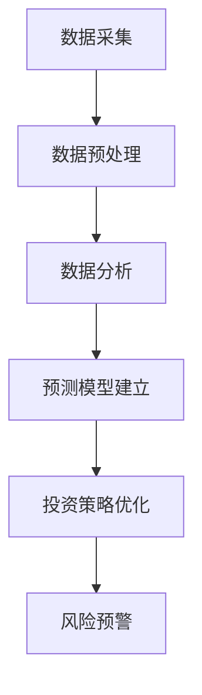
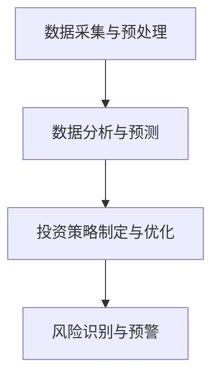
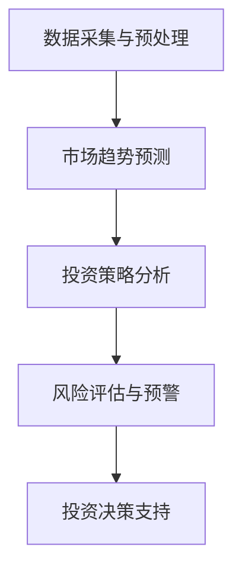
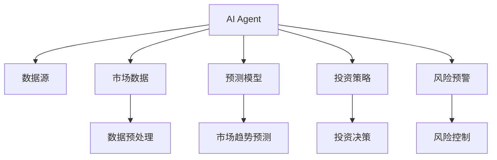
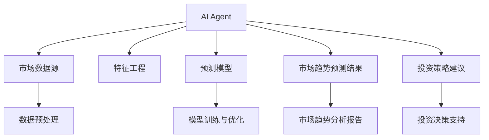
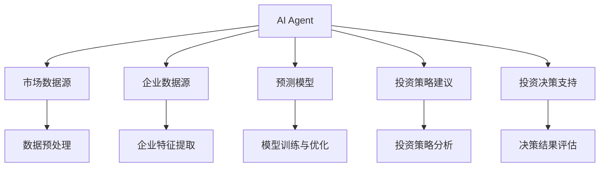
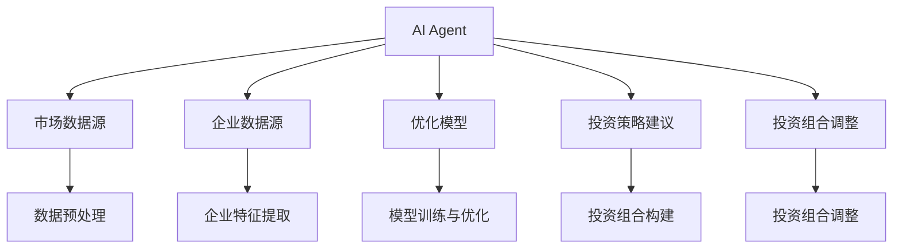
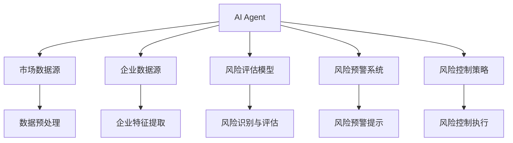

                 

# AI Agent在智能风险投资分析中的应用

## 关键词

- AI Agent
- 智能风险投资
- 数据分析
- 投资决策
- 机器学习

## 摘要

随着人工智能技术的快速发展，AI Agent在各个领域的应用越来越广泛。本文将探讨AI Agent在智能风险投资分析中的应用，通过分析AI Agent的定义、工作原理和应用场景，深入探讨其在市场趋势分析和投资决策中的优势与局限性，并为风险投资者提供有价值的参考和启示。文章还将对AI Agent在风险投资分析中的未来发展趋势进行展望，为读者提供更为全面的理解和认识。

## 引言与背景

### 1.1 问题背景

AI Agent，也称为人工智能代理，是一种基于人工智能技术的自动执行特定任务的计算实体。近年来，随着深度学习、自然语言处理和计算机视觉等技术的发展，AI Agent在各个领域的应用取得了显著的成果。在风险投资领域，AI Agent的出现为风险投资分析带来了新的机遇和挑战。

风险投资（Venture Capital，VC）是一种以获取高回报为目标，对新兴企业和创新型项目进行投资的金融活动。风险投资的过程复杂且风险较高，涉及市场研究、项目评估、投资决策等多个环节。传统风险投资主要依靠经验丰富的投资人和专业的风控团队进行分析和决策，但这种方法存在信息不对称、决策效率低等问题。

AI Agent的出现，为风险投资分析提供了一种新的解决方案。通过数据分析和机器学习技术，AI Agent能够从大量的市场数据中提取有价值的信息，对市场趋势和投资机会进行预测和分析，从而提高风险投资的决策效率和质量。

### 1.2 风险投资中面临的挑战

风险投资过程中面临的挑战主要包括以下几个方面：

1. **信息不对称**：风险投资者通常无法获得所有相关的市场信息和数据，导致投资决策存在不确定性。
2. **决策效率**：传统风险投资决策过程复杂，需要耗费大量的时间和人力，导致决策效率低下。
3. **风险评估**：对新兴企业和项目进行风险评估是一项复杂的任务，涉及多个维度的因素，传统方法难以全面评估风险。
4. **投资组合优化**：风险投资者需要根据市场变化和风险偏好调整投资组合，传统方法难以实现实时优化。

### 1.3 AI Agent的优势与潜力

AI Agent在风险投资分析中具有以下优势：

1. **数据驱动的决策**：AI Agent能够通过大量市场数据的分析和处理，提供数据驱动的投资决策支持。
2. **高效的决策过程**：AI Agent能够自动化执行数据分析、市场趋势预测和风险评估等任务，大幅提高决策效率。
3. **风险分散与优化**：AI Agent可以根据市场变化和风险偏好，实现投资组合的实时优化，降低投资风险。
4. **个性化投资策略**：AI Agent可以根据投资目标和风险偏好，制定个性化的投资策略，提高投资回报。

### 1.4 边界与外延

AI Agent在风险投资中的具体应用包括市场趋势分析、投资决策支持、风险评估和投资组合优化等方面。其技术基础主要包括机器学习、深度学习、自然语言处理和计算机视觉等。随着人工智能技术的不断发展，AI Agent在风险投资领域的应用前景将更加广阔。

### 1.5 概念结构与核心要素组成

AI Agent在风险投资分析中的核心要素包括数据采集、数据分析、预测模型建立、投资策略优化和风险预警等。以下是一个简化的概念结构图，展示了AI Agent在风险投资分析中的应用流程和核心组成部分：

### 1.6 本章小结

本章介绍了AI Agent在智能风险投资分析中的应用背景和重要性，分析了风险投资中面临的挑战以及AI Agent的优势和潜力。通过概念结构图，我们初步了解了AI Agent在风险投资分析中的核心要素和应用流程。接下来，我们将进一步探讨AI Agent的基础理论，为后续章节的内容打下基础。

---

### 第一部分: 引言与背景

#### 第1章: 引言与背景

#### 1.1 问题背景

随着全球经济的发展和金融市场的日益复杂，风险投资（Venture Capital, VC）作为一种重要的投资方式，逐渐成为推动科技创新和创业活动的重要力量。然而，传统的风险投资决策过程往往依赖于投资经理的经验和直觉，这使得风险投资的决策过程既耗时又缺乏客观性。随着人工智能（Artificial Intelligence, AI）技术的迅猛发展，AI Agent作为人工智能的一种应用形式，开始在风险投资领域展现其独特的价值。

##### AI在风险投资领域的应用现状

近年来，AI技术已经在风险投资领域得到广泛应用。首先，AI Agent可以处理和分析大量的市场数据，从海量信息中提取有价值的信息，帮助投资者做出更加科学的投资决策。其次，AI Agent还可以通过机器学习和深度学习技术，对市场趋势和投资机会进行预测，从而提高投资的成功率。此外，AI Agent还可以辅助进行风险评估，识别潜在的风险因素，帮助投资者降低投资风险。

##### 风险投资中面临的挑战

尽管AI Agent在风险投资领域具有巨大的潜力，但风险投资本身也面临着一系列挑战：

1. **信息不对称**：投资者往往无法获取到所有相关的市场信息和数据，这使得投资决策过程存在信息不对称的问题。
2. **数据质量**：风险投资涉及的数据种类繁多，质量参差不齐，这给数据分析带来了挑战。
3. **决策复杂性**：风险投资的决策过程复杂，需要综合考虑多个因素，包括市场趋势、企业估值、行业动态等。
4. **投资组合优化**：投资者需要根据市场变化和风险偏好，不断调整投资组合，以达到最优的投资效果。

##### AI Agent的优势与潜力

AI Agent在解决上述挑战方面具有显著的优势和潜力：

1. **数据处理能力**：AI Agent能够处理和分析海量数据，快速提取有价值的信息，提高决策的客观性和准确性。
2. **实时预测**：AI Agent可以通过机器学习和深度学习技术，对市场趋势和投资机会进行实时预测，为投资者提供及时的决策支持。
3. **风险识别**：AI Agent可以通过模式识别和风险预测模型，识别潜在的风险因素，帮助投资者进行风险控制和降低投资风险。
4. **个性化投资**：AI Agent可以根据投资者的风险偏好和投资目标，制定个性化的投资策略，提高投资的成功率。

#### 1.2 问题描述

在风险投资过程中，投资者面临的主要问题包括：

1. **不确定性**：风险投资本质上是一种不确定性很高的投资活动，如何准确预测市场趋势和投资机会成为关键问题。
2. **信息不对称**：投资者往往无法获取到所有相关的市场信息和数据，导致投资决策过程存在信息不对称的问题。
3. **投资组合优化**：投资者需要根据市场变化和风险偏好，不断调整投资组合，以达到最优的投资效果。

#### 1.3 问题解决

为了解决上述问题，AI Agent在风险投资分析中发挥着关键作用：

1. **数据采集与处理**：AI Agent可以通过各种数据源（如互联网、企业财报、新闻报道等）收集数据，并利用自然语言处理、数据挖掘等技术对数据进行处理和清洗，确保数据的质量和一致性。
2. **市场趋势预测**：AI Agent可以利用机器学习和深度学习算法，对历史数据进行分析和学习，从而预测市场趋势和投资机会。
3. **投资策略优化**：AI Agent可以根据市场趋势和投资目标，制定个性化的投资策略，并通过不断调整和优化，提高投资回报。
4. **风险控制与预警**：AI Agent可以通过对市场数据的实时监测和分析，识别潜在的风险因素，并提供风险预警，帮助投资者进行风险控制和降低投资风险。

#### 1.4 边界与外延

AI Agent在风险投资中的具体应用领域包括：

1. **市场趋势分析**：通过对市场数据的分析，预测市场趋势和投资机会。
2. **投资决策支持**：提供投资决策的依据和参考，帮助投资者做出更加科学的投资决策。
3. **风险评估与预警**：识别潜在的风险因素，提供风险预警和风险控制建议。
4. **投资组合优化**：根据市场变化和风险偏好，对投资组合进行实时优化。

AI Agent的技术基础包括：

1. **机器学习**：用于数据分析和预测模型建立。
2. **深度学习**：用于复杂模式识别和深度预测。
3. **自然语言处理**：用于文本数据的处理和分析。
4. **计算机视觉**：用于图像和视频数据的分析和处理。

AI Agent在风险投资中的适用性与限制：

1. **适用性**：适用于需要大量数据处理和分析的场景，如市场趋势分析、投资决策支持、风险评估等。
2. **限制**：对数据质量和数据量有较高要求，且无法完全替代人类经验。

#### 1.5 概念结构与核心要素组成

AI Agent在风险投资分析中的核心要素包括：

1. **数据采集与预处理**：收集和预处理市场数据，为后续分析提供基础。
2. **数据分析与预测**：利用机器学习和深度学习算法，对市场数据进行分析和预测。
3. **投资策略制定与优化**：根据市场趋势和投资目标，制定和优化投资策略。
4. **风险识别与预警**：识别潜在的风险因素，并提供风险预警。

以下是一个简化的概念结构图，展示了AI Agent在风险投资分析中的核心要素和组成：

#### 1.6 本章小结

本章介绍了AI Agent在智能风险投资分析中的应用背景和重要性，分析了风险投资中面临的挑战以及AI Agent的优势和潜力。通过概念结构图，我们初步了解了AI Agent在风险投资分析中的核心要素和应用流程。接下来，我们将进一步探讨AI Agent的基础理论，为后续章节的内容打下基础。

---

### 第二部分: AI Agent基础理论

#### 第2章: AI Agent基础理论

#### 2.1 AI Agent的定义与分类

AI Agent，即人工智能代理，是一种能够自主执行任务、与外部环境交互并能够学习和适应的智能体。AI Agent可以模拟人类智能的某些方面，如感知、推理、学习和决策等。AI Agent可以分为以下几类：

1. **基于规则的AI Agent**：这类AI Agent通过预定义的规则进行决策，规则通常由专家或程序员手动编写。例如，专家系统（Expert Systems）就是一种基于规则的AI Agent，它通过一组规则来模拟专家的知识和推理能力。

2. **基于模型的AI Agent**：这类AI Agent通过建立数学模型来模拟现实世界，并通过模型来做出决策。机器学习（Machine Learning）和深度学习（Deep Learning）算法就是这种类型的典型代表。例如，使用神经网络模型进行图像识别或自然语言处理。

3. **基于行为的AI Agent**：这类AI Agent通过观察环境中的行为模式来学习和适应。强化学习（Reinforcement Learning）就是这种类型的典型代表。例如，通过试错法学习如何在特定环境中最大化奖励。

4. **混合型AI Agent**：这类AI Agent结合了多种方法，如规则、模型和行为，以实现更复杂的决策过程。

每种类型的AI Agent都有其特定的应用场景和优势。例如，基于规则的AI Agent适用于决策过程相对简单且规则明确的应用场景；而基于模型的AI Agent则适用于需要复杂推理和预测的应用场景。

#### 2.2 AI Agent的组成与工作原理

AI Agent通常由以下几个核心组成部分构成：

1. **感知器**（Perceptron）：感知器是AI Agent的感官系统，用于感知和理解外部环境的信息。例如，视觉感知器可以识别图像中的物体，听觉感知器可以识别声音。

2. **决策器**（Decision Maker）：决策器是AI Agent的核心，用于处理感知器收集到的信息，并根据这些信息做出决策。决策器通常包括一个或多个决策算法，如基于规则的推理、机器学习模型、强化学习算法等。

3. **执行器**（Actuator）：执行器是AI Agent的执行系统，用于将决策器的决策转化为实际的操作。例如，如果一个AI Agent决定采取某种行动，执行器将负责执行这一行动。

AI Agent的工作原理可以简化为以下几个步骤：

1. **感知**：AI Agent通过感知器收集外部环境的信息。

2. **决策**：AI Agent的决策器根据感知到的信息，使用特定的算法进行推理和决策。

3. **执行**：AI Agent的执行器将决策转化为具体的行动。

4. **反馈**：AI Agent执行行动后，通过感知器收集反馈信息，以不断优化其决策过程。

这种循环过程使得AI Agent能够不断适应和优化其行为，从而更好地完成其任务。

#### 2.3 AI Agent的技术基础与发展趋势

AI Agent的技术基础主要包括以下几个领域：

1. **机器学习**：机器学习是AI Agent的核心技术之一，它通过训练模型来学习数据中的模式和规律，从而实现自动化的决策和预测。常见的机器学习算法包括线性回归、决策树、支持向量机等。

2. **深度学习**：深度学习是机器学习的子领域，它通过多层神经网络进行复杂的模式识别和预测。深度学习在图像识别、自然语言处理和语音识别等领域取得了显著成果。

3. **自然语言处理**（Natural Language Processing, NLP）：NLP技术用于处理和解析人类语言，使AI Agent能够理解和生成自然语言。NLP在聊天机器人、文本分类和信息抽取等领域有广泛应用。

4. **计算机视觉**：计算机视觉技术使AI Agent能够理解和解析图像和视频数据。计算机视觉在图像识别、目标检测和视频分析等领域有重要应用。

随着技术的不断进步，AI Agent的发展趋势主要包括：

1. **自主性**：未来的AI Agent将具有更高的自主性，能够自主地处理复杂的任务和决策。

2. **智能化**：AI Agent将更加强大和智能化，能够处理更加复杂和多样化的任务。

3. **协作化**：AI Agent将能够与人类和其他AI系统进行协作，实现更高效的决策和执行。

4. **泛化能力**：AI Agent将具有更强的泛化能力，能够在不同环境和场景中表现出色。

#### 2.4 AI Agent在风险投资分析中的核心功能

在风险投资分析中，AI Agent的核心功能主要包括以下几个方面：

1. **数据采集与预处理**：AI Agent可以从各种数据源（如财经数据库、新闻报道、社交媒体等）收集数据，并进行预处理，如数据清洗、去重、归一化等，为后续分析提供高质量的数据。

2. **市场趋势预测**：AI Agent可以利用机器学习和深度学习算法，对历史市场数据进行分析，预测未来的市场趋势和投资机会。例如，可以通过时间序列分析预测股票价格走势。

3. **投资策略分析**：AI Agent可以根据市场趋势和投资目标，制定和优化投资策略。例如，通过优化算法选择最佳的投资组合，以实现最大化回报或最小化风险。

4. **风险评估与预警**：AI Agent可以对投资项目进行风险评估，识别潜在的风险因素，并提供风险预警。例如，通过财务指标分析识别企业的财务风险。

5. **投资决策支持**：AI Agent可以为投资者提供投资决策的参考和建议，帮助投资者做出更加科学和理性的投资决策。

以下是一个简化的AI Agent在风险投资分析中的功能模块图：

#### 2.5 不同类型AI Agent的属性特征对比表格

不同类型的AI Agent在属性特征和应用场景上有所不同。以下是一个简单的对比表格，展示了基于规则、模型和行为的三种AI Agent的主要属性特征：

| 类型       | 特点                                                         | 应用场景                           |
|------------|--------------------------------------------------------------|-----------------------------------|
| 基于规则   | 决策基于预定义的规则，可解释性强                             | 需求明确、规则清晰的应用场景       |
| 基于模型   | 通过学习数据中的模式进行决策，预测能力强                       | 复杂模式识别和预测的应用场景       |
| 基于行为   | 通过观察环境中的行为模式进行学习，适应能力强                   | 需要适应性和灵活性的动态环境       |

#### 2.6 AI Agent在风险投资分析中的ER实体关系图

在风险投资分析中，AI Agent涉及到多个实体和关系。以下是一个简化的ER（Entity-Relationship，实体-关系）图，展示了AI Agent在风险投资分析中的关键实体和它们之间的关系：

#### 2.7 本章小结

本章介绍了AI Agent的定义、分类和基本组成，探讨了AI Agent的技术基础和发展趋势。通过对比不同类型AI Agent的属性特征，我们了解了它们在风险投资分析中的应用优势。本章还通过ER实体关系图，展示了AI Agent在风险投资分析中的核心功能和关键实体关系。下一章将深入探讨AI Agent在市场趋势分析中的应用。

---

### 第三部分: AI Agent在市场趋势分析中的应用

#### 第3章: AI Agent在市场趋势分析中的应用

#### 3.1 市场趋势分析的重要性

市场趋势分析是风险投资决策过程中至关重要的一环。通过分析市场趋势，投资者可以了解行业的未来发展方向，预测市场的波动和投资机会，从而做出更加科学和合理的投资决策。传统的市场趋势分析方法主要依赖于历史数据和统计模型，而AI Agent的引入为市场趋势分析带来了新的机遇和挑战。

##### 风险投资决策的依据

风险投资决策的依据主要包括以下几个方面：

1. **市场趋势**：了解市场的发展方向和趋势，判断企业所处的市场环境和竞争态势。
2. **企业绩效**：评估企业的经营状况、财务状况和创新能力，判断企业的成长潜力和盈利能力。
3. **行业动态**：关注行业的发展变化、政策环境和市场竞争态势，为投资决策提供参考。
4. **投资策略**：根据投资目标和风险偏好，制定合理的投资策略，实现投资回报的最大化。

##### 市场趋势分析的方法

传统的市场趋势分析方法主要包括以下几种：

1. **历史数据分析**：通过对历史数据的统计和分析，识别市场趋势和周期性变化。
2. **专家意见**：邀请行业专家进行市场分析和预测，结合专家的经验和判断。
3. **问卷调查**：通过问卷调查收集市场参与者的观点和意见，分析市场趋势。

AI Agent在市场趋势分析中的应用，为传统方法提供了有力的补充和优化。AI Agent可以通过机器学习和深度学习算法，对大量市场数据进行分析和预测，提供更加准确和实时的市场趋势分析结果。

#### 3.2 AI Agent在市场趋势分析中的工作流程

AI Agent在市场趋势分析中的工作流程可以分为以下几个步骤：

1. **数据采集与预处理**：AI Agent首先从各种数据源（如财经数据库、新闻报道、社交媒体等）收集相关数据。这些数据可能包括股票价格、交易量、行业报告、新闻文本等。在数据采集过程中，需要关注数据的来源、准确性和完整性。随后，AI Agent对数据进行预处理，包括数据清洗、去重、归一化等操作，以确保数据的质量和一致性。

2. **特征工程**：在数据预处理的基础上，AI Agent进行特征工程，提取数据中的关键特征。特征工程是机器学习模型训练的重要步骤，通过选择和构造合适的特征，可以提高模型的预测性能。常见的特征包括时间序列特征、技术指标、财务指标等。

3. **模型训练与选择**：AI Agent使用机器学习和深度学习算法对预处理后的数据进行训练。常见的算法包括线性回归、决策树、随机森林、支持向量机、神经网络等。在训练过程中，AI Agent会通过交叉验证和超参数调整等技术，选择最优的模型和参数组合，以提高预测的准确性和可靠性。

4. **市场趋势预测**：训练好的模型可以用于市场趋势预测。AI Agent根据训练模型，对未来的市场趋势进行分析和预测。例如，可以使用时间序列分析方法预测股票价格的走势，或使用分类算法预测市场指数的涨跌。

5. **结果分析与策略建议**：AI Agent对预测结果进行分析，根据预测的市场趋势，为投资者提供投资策略建议。例如，当预测市场指数上涨时，建议投资者增加多头头寸；当预测市场指数下跌时，建议投资者降低风险。

#### 3.3 AI Agent在市场趋势分析中的案例分析

为了更好地理解AI Agent在市场趋势分析中的应用，以下是一个具体的案例：

##### 案例背景

假设一个风险投资公司计划对某个新兴科技行业进行投资。该行业的市场数据包括过去一年的股票价格、交易量、行业报告和新闻报道等。公司希望通过AI Agent对市场趋势进行分析，以做出投资决策。

##### 案例步骤

1. **数据采集与预处理**：AI Agent首先从财经数据库、新闻网站和其他数据源收集相关市场数据。对数据进行清洗和预处理，去除异常值和重复数据，并进行归一化处理，确保数据的一致性和质量。

2. **特征工程**：AI Agent提取市场数据中的关键特征，包括时间序列特征（如开盘价、收盘价、最高价、最低价）、技术指标（如移动平均线、相对强弱指数、布林带）和财务指标（如净利润、营业收入、市值）。

3. **模型训练与选择**：AI Agent使用随机森林算法对预处理后的数据进行训练。通过交叉验证和网格搜索技术，选择最优的模型参数，提高预测的准确性。

4. **市场趋势预测**：训练好的随机森林模型用于预测未来的市场趋势。AI Agent根据预测结果，分析行业的发展方向和潜在的投资机会。

5. **结果分析与策略建议**：AI Agent对预测结果进行分析，发现该行业在未来一年内有望呈现上涨趋势。基于此，AI Agent建议风险投资公司增加对该行业的投资，并推荐了一些具有高成长潜力的企业。

##### 案例分析结果与应用建议

通过对上述案例的分析，可以得出以下结论：

1. **市场趋势预测准确性**：AI Agent通过机器学习和深度学习算法，对市场数据进行分析和预测，具有较高的准确性。相比传统方法，AI Agent能够更快、更准确地识别市场趋势。

2. **投资决策支持**：AI Agent为投资者提供了科学、客观的投资决策支持，帮助投资者更好地把握市场机会，降低投资风险。

3. **个性化投资策略**：AI Agent可以根据投资者的风险偏好和投资目标，制定个性化的投资策略。例如，对于风险偏好较高的投资者，AI Agent可以推荐高风险、高回报的投资机会；对于风险偏好较低的投资者，AI Agent可以推荐稳健型投资策略。

4. **实时监控与调整**：AI Agent可以对市场趋势进行实时监控和分析，及时调整投资策略。在市场波动较大时，AI Agent可以提供实时预警和风险控制建议，帮助投资者规避风险。

#### 3.4 AI Agent在市场趋势分析中的优势与局限性

AI Agent在市场趋势分析中具有以下优势：

1. **数据处理能力**：AI Agent能够处理和分析大量市场数据，快速提取有价值的信息，提高市场趋势预测的准确性。

2. **实时性**：AI Agent可以实时监控市场变化，及时调整投资策略，降低投资风险。

3. **个性化**：AI Agent可以根据投资者的风险偏好和投资目标，制定个性化的投资策略，提高投资回报。

4. **自动化**：AI Agent可以自动化执行市场趋势分析和投资决策，提高决策效率。

然而，AI Agent也存在一定的局限性：

1. **数据依赖性**：AI Agent的预测能力高度依赖于数据的质量和完整性。如果数据存在偏差或缺失，可能导致预测结果不准确。

2. **模型复杂性**：AI Agent使用的机器学习和深度学习模型通常较为复杂，需要大量的计算资源和时间进行训练和优化。

3. **解释性**：AI Agent的决策过程通常是非线性和复杂的，难以解释。对于需要高度解释性和透明性的投资决策，AI Agent可能不是最佳选择。

4. **适应性**：AI Agent在适应新环境和动态市场方面可能存在挑战。随着市场环境和竞争态势的变化，AI Agent需要不断调整和优化模型，以保持预测的准确性。

#### 3.5 不同类型AI Agent在市场趋势分析中的属性特征对比表格

以下是一个简化的对比表格，展示了不同类型AI Agent在市场趋势分析中的属性特征：

| 类型       | 特点                                                         | 适用场景                           |
|------------|--------------------------------------------------------------|-----------------------------------|
| 基于规则   | 决策基于预定义的规则，可解释性强                             | 规则明确、需求简单                   |
| 基于模型   | 通过学习数据中的模式进行决策，预测能力强                       | 需要复杂模式识别和预测               |
| 基于行为   | 通过观察环境中的行为模式进行学习，适应能力强                   | 需要高度适应性和灵活性               |

#### 3.6 AI Agent在市场趋势分析中的ER实体关系图

在市场趋势分析中，AI Agent涉及到多个实体和关系。以下是一个简化的ER（Entity-Relationship，实体-关系）图，展示了AI Agent在市场趋势分析中的关键实体和它们之间的关系：

#### 3.7 本章小结

本章介绍了AI Agent在市场趋势分析中的应用背景和工作流程，通过具体案例展示了AI Agent在预测市场趋势和投资决策支持方面的优势。同时，分析了AI Agent在市场趋势分析中的优势与局限性，为投资者提供了有价值的参考。下一章将探讨AI Agent在投资决策中的应用，进一步揭示AI Agent在风险投资领域的价值。

---

### 第四部分: AI Agent在投资决策中的应用

#### 第4章: AI Agent在投资决策中的应用

#### 4.1 投资决策的重要性

投资决策是风险投资过程中最为关键的环节之一。它不仅关系到投资者的财务回报，还直接影响着企业的生存和发展。传统的投资决策主要依赖于投资经理的经验和直觉，尽管这种方法在某些情况下能够取得成功，但随着市场的日益复杂和不确定性增加，传统决策方法逐渐暴露出其局限性和不足。

##### 风险投资的核心环节

投资决策是风险投资的核心环节，其质量直接决定了风险投资的成败。一个科学合理的投资决策需要考虑多个方面的因素，包括市场趋势、企业财务状况、竞争态势、行业动态等。传统方法往往在这些因素的选择和权重分配上存在主观性和局限性，难以做出全面、客观的决策。

##### 投资决策的方法与流程

投资决策通常包括以下几个步骤：

1. **市场分析**：通过收集和分析市场数据，了解行业的发展趋势和市场状况。
2. **企业评估**：对潜在投资的企业进行财务分析、业务评估和团队评估，判断其投资价值和风险。
3. **投资策略制定**：根据市场分析和企业评估结果，制定合理的投资策略，包括投资额度、投资期限、风险控制等。
4. **决策支持**：利用专家意见、历史数据和其他信息，为投资决策提供支持。
5. **决策执行**：根据最终的投资决策，执行具体的投资操作。

#### 4.2 AI Agent在投资决策中的工作流程

AI Agent在投资决策中的应用可以大大提高决策的科学性和效率。其工作流程主要包括以下几个步骤：

1. **数据采集与预处理**：AI Agent从各种数据源（如财经数据库、社交媒体、新闻网站等）收集数据，并进行预处理，如数据清洗、去重、归一化等，确保数据的质量和一致性。

2. **特征工程**：对预处理后的数据进行特征提取和工程，提取出对投资决策有重要影响的关键特征，如财务指标、市场指标、行业指标等。

3. **模型训练与优化**：使用机器学习和深度学习算法，对特征数据进行训练，建立预测模型。通过交叉验证和超参数调整等技术，优化模型参数，提高预测准确性。

4. **投资策略分析**：利用训练好的模型，对市场数据进行分析，预测未来的市场趋势和投资机会。根据预测结果，制定和优化投资策略，包括投资额度、投资期限、风险控制等。

5. **决策支持与建议**：AI Agent根据投资策略分析和市场预测结果，为投资者提供投资决策的建议和支持。例如，可以推荐合适的投资标的、调整投资组合、设置风险控制阈值等。

6. **实时监控与调整**：AI Agent可以对市场进行实时监控，及时调整投资策略，以应对市场变化和风险。例如，当市场出现不利趋势时，AI Agent可以建议投资者降低风险，或者增加对其他行业的投资。

#### 4.3 AI Agent在投资决策中的案例分析

为了更好地理解AI Agent在投资决策中的应用，以下是一个具体的案例分析：

##### 案例背景

假设一个风险投资公司正在考虑是否投资一个新兴科技企业。该企业专注于人工智能技术的研发和应用，市场前景广阔。公司希望通过AI Agent进行投资决策，以减少人为因素带来的不确定性。

##### 案例步骤

1. **数据采集与预处理**：AI Agent从财经数据库、行业报告、新闻报道和其他数据源收集与该企业相关的数据，包括财务报表、市场表现、行业趋势等。对数据进行清洗和预处理，确保数据的一致性和质量。

2. **特征工程**：AI Agent提取出对投资决策有重要影响的关键特征，如营业收入增长率、净利润增长率、市盈率、同行业股票价格走势等。

3. **模型训练与优化**：使用机器学习和深度学习算法，对特征数据进行训练，建立预测模型。通过交叉验证和网格搜索技术，选择最优的模型和参数组合，提高预测准确性。

4. **投资策略分析**：AI Agent根据训练好的模型，对市场数据进行分析，预测该企业的未来发展趋势和投资机会。例如，预测该企业的营业收入和净利润在未来一年的增长率，评估其市场竞争力。

5. **决策支持与建议**：AI Agent根据投资策略分析和市场预测结果，为投资者提供投资决策的建议。例如，建议投资额度、投资期限、风险控制策略等。同时，AI Agent还可以提供对比分析，帮助投资者评估其他投资机会。

6. **实时监控与调整**：AI Agent对市场进行实时监控，根据市场变化调整投资策略。例如，当预测市场指数上涨时，建议增加对该企业的投资；当预测市场指数下跌时，建议降低风险。

##### 案例分析结果与应用建议

通过对上述案例的分析，可以得出以下结论：

1. **决策准确性**：AI Agent通过机器学习和深度学习算法，对市场数据进行分析和预测，具有较高的准确性。相比传统方法，AI Agent能够更快、更准确地识别投资机会和风险。

2. **个性化投资**：AI Agent可以根据投资者的风险偏好和投资目标，制定个性化的投资策略，提高投资回报。例如，对于风险偏好较高的投资者，AI Agent可以推荐高风险、高回报的投资机会；对于风险偏好较低的投资者，AI Agent可以推荐稳健型投资策略。

3. **实时调整**：AI Agent可以实时监控市场变化，及时调整投资策略，降低投资风险。在市场波动较大时，AI Agent可以提供实时预警和风险控制建议，帮助投资者规避风险。

4. **决策效率**：AI Agent自动化执行投资决策过程，大大提高了决策效率。投资者可以节省大量的时间和精力，专注于更重要的业务和决策。

#### 4.4 AI Agent在投资决策中的优势与局限性

AI Agent在投资决策中具有以下优势：

1. **数据处理能力**：AI Agent能够处理和分析大量市场数据，快速提取有价值的信息，提高决策的科学性和准确性。

2. **实时性**：AI Agent可以实时监控市场变化，及时调整投资策略，降低投资风险。

3. **个性化**：AI Agent可以根据投资者的风险偏好和投资目标，制定个性化的投资策略，提高投资回报。

4. **自动化**：AI Agent可以自动化执行投资决策过程，提高决策效率。

然而，AI Agent也存在一定的局限性：

1. **数据依赖性**：AI Agent的预测能力高度依赖于数据的质量和完整性。如果数据存在偏差或缺失，可能导致预测结果不准确。

2. **模型复杂性**：AI Agent使用的机器学习和深度学习模型通常较为复杂，需要大量的计算资源和时间进行训练和优化。

3. **解释性**：AI Agent的决策过程通常是非线性和复杂的，难以解释。对于需要高度解释性和透明性的投资决策，AI Agent可能不是最佳选择。

4. **适应性**：AI Agent在适应新环境和动态市场方面可能存在挑战。随着市场环境和竞争态势的变化，AI Agent需要不断调整和优化模型，以保持预测的准确性。

#### 4.5 不同类型AI Agent在投资决策中的属性特征对比表格

以下是一个简化的对比表格，展示了不同类型AI Agent在投资决策中的属性特征：

| 类型       | 特点                                                         | 适用场景                           |
|------------|--------------------------------------------------------------|-----------------------------------|
| 基于规则   | 决策基于预定义的规则，可解释性强                             | 需求明确、规则清晰                   |
| 基于模型   | 通过学习数据中的模式进行决策，预测能力强                       | 需要复杂模式识别和预测               |
| 基于行为   | 通过观察环境中的行为模式进行学习，适应能力强                   | 需要高度适应性和灵活性               |

#### 4.6 AI Agent在投资决策中的ER实体关系图

在投资决策中，AI Agent涉及到多个实体和关系。以下是一个简化的ER（Entity-Relationship，实体-关系）图，展示了AI Agent在投资决策中的关键实体和它们之间的关系：

#### 4.7 本章小结

本章介绍了AI Agent在投资决策中的应用背景和工作流程，通过具体案例展示了AI Agent在投资决策支持中的优势。同时，分析了AI Agent在投资决策中的优势与局限性，为投资者提供了有价值的参考。AI Agent在投资决策中的应用不仅提高了决策的科学性和准确性，还为投资者提供了更加个性化和高效的决策支持。下一章将探讨AI Agent在投资组合优化中的应用，进一步揭示AI Agent在风险投资领域的价值。

---

### 第五部分: AI Agent在投资组合优化中的应用

#### 第5章: AI Agent在投资组合优化中的应用

#### 5.1 投资组合优化的意义

投资组合优化是风险投资管理中的一项重要任务，旨在通过合理配置资产，最大限度地提高投资回报并控制风险。传统的投资组合优化主要依赖于数学模型和统计分析方法，尽管这些方法在一定程度上能够实现优化目标，但它们存在一些局限性，如对市场环境变化反应较慢、无法处理大规模数据等。随着人工智能技术的发展，AI Agent在投资组合优化中的应用提供了新的解决方案。

##### 投资组合优化的目标

投资组合优化的目标主要包括两个方面：

1. **最大化回报**：在控制风险的前提下，实现投资回报的最大化。
2. **最小化风险**：在确保投资回报的前提下，降低投资组合的整体风险。

##### 传统投资组合优化的局限性

传统的投资组合优化方法主要依赖于以下几种模型：

1. **Markowitz均值方差模型**：通过最大化投资组合的预期回报并最小化方差来实现优化。
2. **CAPM模型**：通过评估资产的风险和预期回报，确定资产在投资组合中的最优配置。
3. **Black-Litterman模型**：结合专家意见和市场数据，优化投资组合。

尽管这些模型在理论上能够实现投资组合优化，但它们存在以下局限性：

1. **对市场环境变化的反应较慢**：传统方法通常基于历史数据进行分析，难以快速适应市场环境的变化。
2. **无法处理大规模数据**：传统方法在处理海量数据时效率较低，难以实现实时优化。
3. **模型参数的设定依赖经验**：传统模型的参数设定往往依赖于专家的经验，缺乏客观性。

#### 5.2 AI Agent在投资组合优化中的优势

AI Agent在投资组合优化中具有以下优势：

1. **数据处理能力**：AI Agent能够处理和分析大规模数据，快速提取有价值的信息，为优化提供数据支持。
2. **实时性**：AI Agent可以实时监控市场变化，及时调整投资组合，提高投资组合的适应性和灵活性。
3. **个性化**：AI Agent可以根据投资者的风险偏好和投资目标，制定个性化的投资策略，实现最优的投资组合配置。
4. **自动化**：AI Agent可以自动化执行投资组合优化过程，提高决策效率，降低人工干预的风险。

#### 5.3 AI Agent在投资组合优化中的工作流程

AI Agent在投资组合优化中的工作流程主要包括以下几个步骤：

1. **数据采集与预处理**：AI Agent从各种数据源（如财经数据库、社交媒体、新闻网站等）收集与投资相关的数据，包括股票价格、交易量、行业指数等。对数据进行清洗和预处理，去除噪声和异常值，确保数据的质量和一致性。

2. **特征工程**：对预处理后的数据进行特征提取和工程，提取出对投资组合优化有重要影响的关键特征，如市场指标、财务指标、技术指标等。这些特征可以用来构建投资组合的指标体系。

3. **模型训练与优化**：使用机器学习和深度学习算法，对特征数据进行训练，建立优化模型。通过交叉验证和超参数调整等技术，选择最优的模型和参数组合，提高优化效果。

4. **投资组合构建与调整**：AI Agent根据训练好的模型，对投资组合进行构建和调整。首先，AI Agent会根据投资目标和风险偏好，确定投资组合的资产配置比例。然后，AI Agent会根据市场数据的变化，实时调整投资组合，以保持最优的资产配置。

5. **风险监控与预警**：AI Agent对投资组合进行实时监控，识别潜在的风险因素，并提供风险预警。当市场环境发生变化时，AI Agent可以及时调整投资组合，降低投资风险。

6. **投资绩效评估**：AI Agent对投资组合的绩效进行评估，包括回报率、风险指标、资产配置合理性等。通过绩效评估，AI Agent可以不断优化投资策略，提高投资组合的回报和稳定性。

#### 5.4 AI Agent在投资组合优化中的案例分析

为了更好地理解AI Agent在投资组合优化中的应用，以下是一个具体的案例分析：

##### 案例背景

假设一个风险投资公司管理着一只多资产投资组合，包括股票、债券、基金等多种资产。公司希望通过AI Agent对投资组合进行优化，提高回报并降低风险。

##### 案例步骤

1. **数据采集与预处理**：AI Agent从财经数据库、行业报告、新闻网站等数据源收集与投资组合相关的数据，包括资产价格、交易量、行业指数等。对数据进行清洗和预处理，确保数据的质量和一致性。

2. **特征工程**：AI Agent提取出对投资组合优化有重要影响的关键特征，如股票的市盈率、市净率、交易量、行业趋势等。这些特征可以用来构建投资组合的指标体系。

3. **模型训练与优化**：使用机器学习和深度学习算法，对特征数据进行训练，建立优化模型。通过交叉验证和超参数调整等技术，选择最优的模型和参数组合，提高优化效果。

4. **投资组合构建与调整**：AI Agent根据训练好的模型，对投资组合进行构建和调整。首先，AI Agent会根据投资目标和风险偏好，确定投资组合的资产配置比例。然后，AI Agent会根据市场数据的变化，实时调整投资组合，以保持最优的资产配置。

5. **风险监控与预警**：AI Agent对投资组合进行实时监控，识别潜在的风险因素，并提供风险预警。当市场环境发生变化时，AI Agent可以及时调整投资组合，降低投资风险。

6. **投资绩效评估**：AI Agent对投资组合的绩效进行评估，包括回报率、风险指标、资产配置合理性等。通过绩效评估，AI Agent可以不断优化投资策略，提高投资组合的回报和稳定性。

##### 案例分析结果与应用建议

通过对上述案例的分析，可以得出以下结论：

1. **投资组合优化效果**：AI Agent通过机器学习和深度学习算法，对市场数据进行分析和优化，能够显著提高投资组合的回报率并降低风险。

2. **实时调整与风险控制**：AI Agent可以实时监控市场变化，及时调整投资组合，降低投资风险。在市场波动较大时，AI Agent可以提供实时预警和风险控制建议，帮助投资者规避风险。

3. **个性化投资策略**：AI Agent可以根据投资者的风险偏好和投资目标，制定个性化的投资策略，实现最优的投资组合配置。

4. **投资绩效评估与优化**：AI Agent可以对投资组合的绩效进行实时评估，通过不断优化投资策略，提高投资组合的回报和稳定性。

#### 5.5 AI Agent在投资组合优化中的优势与局限性

AI Agent在投资组合优化中具有以下优势：

1. **数据处理能力**：AI Agent能够处理和分析大量市场数据，快速提取有价值的信息，为优化提供数据支持。
2. **实时性**：AI Agent可以实时监控市场变化，及时调整投资组合，提高投资组合的适应性和灵活性。
3. **个性化**：AI Agent可以根据投资者的风险偏好和投资目标，制定个性化的投资策略，实现最优的投资组合配置。
4. **自动化**：AI Agent可以自动化执行投资组合优化过程，提高决策效率，降低人工干预的风险。

然而，AI Agent也存在一定的局限性：

1. **数据依赖性**：AI Agent的优化效果高度依赖于数据的质量和完整性。如果数据存在偏差或缺失，可能导致优化结果不准确。
2. **模型复杂性**：AI Agent使用的机器学习和深度学习模型通常较为复杂，需要大量的计算资源和时间进行训练和优化。
3. **解释性**：AI Agent的优化过程通常是非线性和复杂的，难以解释。对于需要高度解释性和透明性的投资组合优化，AI Agent可能不是最佳选择。
4. **适应性**：AI Agent在适应新环境和动态市场方面可能存在挑战。随着市场环境和竞争态势的变化，AI Agent需要不断调整和优化模型，以保持优化效果。

#### 5.6 AI Agent在投资组合优化中的ER实体关系图

在投资组合优化中，AI Agent涉及到多个实体和关系。以下是一个简化的ER（Entity-Relationship，实体-关系）图，展示了AI Agent在投资组合优化中的关键实体和它们之间的关系：

#### 5.7 本章小结

本章介绍了AI Agent在投资组合优化中的应用背景和工作流程，通过具体案例展示了AI Agent在投资组合优化中的优势。同时，分析了AI Agent在投资组合优化中的优势与局限性，为投资者提供了有价值的参考。AI Agent在投资组合优化中的应用不仅提高了投资组合的回报和稳定性，还为投资者提供了更加个性化和高效的优化方案。下一章将探讨AI Agent在风险管理中的应用，进一步揭示AI Agent在风险投资领域的价值。

---

### 第六部分: AI Agent在风险管理中的应用

#### 第6章: AI Agent在风险管理中的应用

#### 6.1 风险管理的意义

风险管理是风险投资过程中至关重要的一环，其目标是识别、评估和应对投资过程中可能出现的各种风险，以降低投资损失并保护投资组合的安全。随着市场环境的复杂性和不确定性增加，传统风险管理方法逐渐暴露出其局限性。人工智能（AI）技术的引入为风险管理带来了新的机遇和挑战。

##### 风险管理的重要性

风险管理在风险投资中具有以下几个方面的意义：

1. **降低投资损失**：通过识别和评估潜在的风险，投资者可以提前采取预防措施，降低投资损失。
2. **保护投资组合安全**：合理的风险管理策略可以确保投资组合的稳定性和安全性，提高投资回报。
3. **增强决策科学性**：风险管理提供了全面、系统的风险信息，为投资决策提供科学依据，提高决策效率。
4. **提高投资信心**：有效的风险管理可以增强投资者的信心，吸引更多的投资资金。

##### 传统风险管理方法的局限性

传统的风险管理方法主要依赖于以下几种手段：

1. **定性分析**：通过专家意见、行业报告等定性信息进行风险识别和评估。
2. **定量分析**：使用统计方法（如方差、标准差等）对风险进行量化评估。
3. **风险矩阵**：通过风险矩阵（如风险概率和影响矩阵）进行风险识别和优先级排序。

尽管这些方法在一定程度上能够实现风险管理目标，但它们存在以下局限性：

1. **信息依赖性**：传统方法主要依赖于专家意见和定量数据，信息来源较为有限，难以全面识别风险。
2. **实时性不足**：传统方法通常是基于历史数据进行分析，难以实时应对市场变化。
3. **复杂性**：风险投资涉及多个维度和复杂的风险因素，传统方法难以全面评估和应对。

#### 6.2 AI Agent在风险管理中的优势

AI Agent在风险管理中具有以下优势：

1. **数据处理能力**：AI Agent能够处理和分析大规模数据，快速提取有价值的信息，为风险管理提供全面的数据支持。
2. **实时性**：AI Agent可以实时监控市场变化，及时识别和评估风险，提高风险管理的实时性和有效性。
3. **个性化**：AI Agent可以根据投资者的风险偏好和投资策略，制定个性化的风险管理策略，提高风险管理的针对性。
4. **自动化**：AI Agent可以自动化执行风险管理过程，减少人工干预，提高决策效率。

#### 6.3 AI Agent在风险管理中的工作流程

AI Agent在风险管理中的工作流程主要包括以下几个步骤：

1. **数据采集与预处理**：AI Agent从各种数据源（如财经数据库、新闻网站、社交媒体等）收集与投资相关的数据，包括市场数据、企业数据、行业数据等。对数据进行清洗和预处理，去除噪声和异常值，确保数据的质量和一致性。

2. **风险识别**：AI Agent通过机器学习和深度学习算法，对收集到的数据进行风险识别。风险识别主要包括以下内容：

   - **市场风险**：通过分析市场数据，识别市场波动、价格波动等市场风险。
   - **信用风险**：通过分析企业财务报表、信用评级等数据，识别企业的信用风险。
   - **操作风险**：通过分析企业运营数据、操作流程等，识别操作风险。

3. **风险评估**：AI Agent根据识别出的风险，使用机器学习和深度学习算法对风险进行评估。风险评估主要包括以下内容：

   - **风险概率**：通过分析历史数据，评估风险发生的概率。
   - **风险影响**：通过分析风险对企业财务和运营的影响，评估风险的影响程度。

4. **风险预警**：AI Agent根据风险评估结果，实时监控市场变化，提供风险预警。风险预警主要包括以下内容：

   - **风险提示**：当识别到高风险信号时，AI Agent可以及时发出风险提示，提醒投资者注意。
   - **风险报告**：AI Agent可以定期生成风险报告，分析当前的风险状况和变化趋势。

5. **风险控制与优化**：AI Agent根据风险预警和评估结果，制定和优化风险管理策略。风险控制与优化主要包括以下内容：

   - **投资调整**：根据风险预警，AI Agent可以及时调整投资组合，降低投资风险。
   - **风险分散**：AI Agent可以通过分散投资，降低单一资产的风险。
   - **风险对冲**：AI Agent可以通过衍生品交易等手段进行风险对冲，降低投资风险。

6. **风险管理反馈**：AI Agent对风险管理效果进行实时监控和评估，根据反馈结果不断优化风险管理策略。

#### 6.4 AI Agent在风险管理中的案例分析

为了更好地理解AI Agent在风险管理中的应用，以下是一个具体的案例分析：

##### 案例背景

假设一个风险投资公司管理着多个投资组合，涉及股票、债券、基金等多种资产。公司希望通过AI Agent对投资组合进行风险管理，降低投资风险并保护投资组合的安全。

##### 案例步骤

1. **数据采集与预处理**：AI Agent从财经数据库、行业报告、新闻网站等数据源收集与投资组合相关的数据，包括市场数据、企业数据、行业数据等。对数据进行清洗和预处理，确保数据的质量和一致性。

2. **风险识别**：AI Agent通过机器学习和深度学习算法，对收集到的数据进行风险识别。风险识别主要包括以下内容：

   - **市场风险**：通过分析市场数据，识别市场波动、价格波动等市场风险。
   - **信用风险**：通过分析企业财务报表、信用评级等数据，识别企业的信用风险。
   - **操作风险**：通过分析企业运营数据、操作流程等，识别操作风险。

3. **风险评估**：AI Agent根据识别出的风险，使用机器学习和深度学习算法对风险进行评估。风险评估主要包括以下内容：

   - **风险概率**：通过分析历史数据，评估风险发生的概率。
   - **风险影响**：通过分析风险对企业财务和运营的影响，评估风险的影响程度。

4. **风险预警**：AI Agent根据风险评估结果，实时监控市场变化，提供风险预警。风险预警主要包括以下内容：

   - **风险提示**：当识别到高风险信号时，AI Agent可以及时发出风险提示，提醒投资者注意。
   - **风险报告**：AI Agent可以定期生成风险报告，分析当前的风险状况和变化趋势。

5. **风险控制与优化**：AI Agent根据风险预警和评估结果，制定和优化风险管理策略。风险控制与优化主要包括以下内容：

   - **投资调整**：根据风险预警，AI Agent可以及时调整投资组合，降低投资风险。
   - **风险分散**：AI Agent可以通过分散投资，降低单一资产的风险。
   - **风险对冲**：AI Agent可以通过衍生品交易等手段进行风险对冲，降低投资风险。

6. **风险管理反馈**：AI Agent对风险管理效果进行实时监控和评估，根据反馈结果不断优化风险管理策略。

##### 案例分析结果与应用建议

通过对上述案例的分析，可以得出以下结论：

1. **风险识别与评估准确性**：AI Agent通过机器学习和深度学习算法，对市场数据进行分析和评估，具有较高的准确性和实时性，能够快速识别和评估风险。

2. **风险预警及时性**：AI Agent可以实时监控市场变化，及时发出风险预警，帮助投资者提前采取预防措施，降低投资风险。

3. **风险控制与优化效果**：AI Agent可以根据风险预警和评估结果，及时调整投资组合，实现风险分散和对冲，提高投资组合的稳定性和安全性。

4. **个性化风险管理**：AI Agent可以根据投资者的风险偏好和投资策略，制定个性化的风险管理策略，提高风险管理的针对性和有效性。

#### 6.5 AI Agent在风险管理中的优势与局限性

AI Agent在风险管理中具有以下优势：

1. **数据处理能力**：AI Agent能够处理和分析大量市场数据，快速提取有价值的信息，为风险管理提供全面的数据支持。
2. **实时性**：AI Agent可以实时监控市场变化，及时识别和评估风险，提高风险管理的实时性和有效性。
3. **个性化**：AI Agent可以根据投资者的风险偏好和投资策略，制定个性化的风险管理策略，提高风险管理的针对性。
4. **自动化**：AI Agent可以自动化执行风险管理过程，减少人工干预，提高决策效率。

然而，AI Agent也存在一定的局限性：

1. **数据依赖性**：AI Agent的识别和评估能力高度依赖于数据的质量和完整性。如果数据存在偏差或缺失，可能导致风险管理结果不准确。
2. **模型复杂性**：AI Agent使用的机器学习和深度学习模型通常较为复杂，需要大量的计算资源和时间进行训练和优化。
3. **解释性**：AI Agent的风险管理过程通常是非线性和复杂的，难以解释。对于需要高度解释性和透明性的风险管理，AI Agent可能不是最佳选择。
4. **适应性**：AI Agent在适应新环境和动态市场方面可能存在挑战。随着市场环境和竞争态势的变化，AI Agent需要不断调整和优化模型，以保持风险管理效果。

#### 6.6 AI Agent在风险管理中的ER实体关系图

在风险管理中，AI Agent涉及到多个实体和关系。以下是一个简化的ER（Entity-Relationship，实体-关系）图，展示了AI Agent在风险管理中的关键实体和它们之间的关系：

#### 6.7 本章小结

本章介绍了AI Agent在风险管理中的应用背景和工作流程，通过具体案例展示了AI Agent在风险管理中的优势。同时，分析了AI Agent在风险管理中的优势与局限性，为投资者提供了有价值的参考。AI Agent在风险管理中的应用不仅提高了风险管理的实时性和准确性，还为投资者提供了个性化、自动化的风险管理方案。下一章将探讨AI Agent在风险投资分析中的未来发展趋势，为读者提供更为全面的了解。

---

### 第七部分: AI Agent在风险投资分析中的未来发展趋势

#### 第7章: AI Agent在风险投资分析中的未来发展趋势

#### 7.1 人工智能技术发展趋势

随着人工智能技术的不断进步，AI Agent在风险投资分析中的应用前景将更加广阔。以下是一些关键趋势：

##### 1. 机器学习算法的持续进化

机器学习算法的持续进化将进一步提升AI Agent的性能。深度学习、强化学习等先进算法的不断发展，将使AI Agent能够更好地处理复杂的数据集，提高预测的准确性和效率。

##### 2. 数据集的丰富与多样化

随着数据集的丰富和多样化，AI Agent将有更多的数据可以学习，从而提高其预测和分析能力。大数据技术的应用将使AI Agent能够从更多的数据源中提取有价值的信息，为风险投资提供更加全面的支持。

##### 3. 自适应与自学习能力的提升

未来的AI Agent将具备更强的自适应和自学习能力，能够根据市场环境和风险变化，不断调整和优化其预测模型和决策策略，以适应不断变化的投资环境。

##### 4. 跨学科融合与综合应用

人工智能与其他领域的融合，如生物学、心理学、经济学等，将带来新的应用场景和解决方案。跨学科的融合将使AI Agent能够更全面地理解和分析风险投资过程中的复杂因素。

#### 7.2 AI Agent在风险投资分析中的应用前景

AI Agent在风险投资分析中的应用前景广阔，以下是一些关键领域：

##### 1. 更精确的市场趋势预测

通过深度学习和强化学习算法，AI Agent将能够更精确地预测市场趋势，为投资者提供更可靠的决策依据。

##### 2. 个性化的投资策略

基于大数据分析和个性化推荐技术，AI Agent将能够为投资者制定更加个性化的投资策略，满足不同投资者的风险偏好和投资目标。

##### 3. 实时的风险预警与控制

AI Agent将能够实时监控市场变化，识别潜在的风险，并提供预警和风险控制建议，帮助投资者及时调整投资策略。

##### 4. 自动化的投资决策

随着AI Agent性能的不断提升，越来越多的投资决策将实现自动化，提高投资效率，降低人为错误的风险。

#### 7.3 AI Agent在风险投资分析中的挑战与解决方案

尽管AI Agent在风险投资分析中具有巨大的潜力，但同时也面临一些挑战：

##### 1. 数据质量和数据隐私

数据质量和数据隐私是AI Agent在风险投资分析中面临的主要挑战。解决方法包括：提高数据采集和清洗技术，确保数据质量；采用数据加密和隐私保护技术，保护投资者数据隐私。

##### 2. 模型解释性与透明性

AI Agent的决策过程通常是非线性和复杂的，难以解释。解决方法包括：开发可解释的AI模型，提高模型的透明性；采用模型可视化技术，帮助投资者理解AI Agent的决策过程。

##### 3. 道德与伦理问题

AI Agent在风险投资分析中的应用可能会引发道德和伦理问题，如算法偏见、信息不对称等。解决方法包括：制定AI伦理规范，确保AI Agent的公正性和透明性；加强对AI Agent的监督和评估，防止潜在的风险。

#### 7.4 未来展望

随着人工智能技术的不断进步和应用场景的拓展，AI Agent在风险投资分析中的地位将愈发重要。未来，AI Agent将更加智能化、自适应和个性化，为投资者提供更加全面、高效的决策支持。同时，随着跨学科融合的深入，AI Agent将在风险投资分析中发挥更加重要的作用，推动风险投资的创新和发展。

### 7.5 本章小结

本章介绍了人工智能技术的发展趋势，分析了AI Agent在风险投资分析中的应用前景和面临的挑战。随着技术的不断进步，AI Agent在风险投资分析中将发挥越来越重要的作用，为投资者提供更加全面、准确的决策支持。未来，AI Agent将不断创新和优化，为风险投资领域带来更多可能性。

---

### 结论与展望

本文从多个角度探讨了AI Agent在智能风险投资分析中的应用，通过详细的案例分析、理论阐述和技术分析，揭示了AI Agent在市场趋势分析、投资决策支持、投资组合优化和风险管理等方面的优势与潜力。以下是本文的主要结论和展望：

#### 主要结论

1. **数据处理能力**：AI Agent能够高效地处理和分析大规模数据，快速提取有价值的信息，提高投资决策的科学性和准确性。

2. **实时性与个性化**：AI Agent能够实时监控市场变化，根据投资者的风险偏好和投资目标，制定个性化的投资策略，提高投资组合的回报和稳定性。

3. **自动化与效率**：AI Agent可以自动化执行投资决策过程，提高决策效率，减少人为错误的风险。

4. **风险管理**：AI Agent在风险识别、评估和预警方面具有显著优势，能够为投资者提供实时、准确的风险管理建议。

#### 展望未来

1. **技术进步**：随着人工智能技术的不断发展，AI Agent的性能将进一步提升，能够处理更加复杂的数据集，提供更加精准的预测和分析。

2. **跨学科融合**：AI Agent将与其他学科（如经济学、心理学、社会学等）融合，为风险投资提供更加全面、深入的分析。

3. **伦理与规范**：AI Agent在风险投资分析中的应用将引发一系列伦理和规范问题，需要制定相应的法规和伦理标准，确保其公正性和透明性。

4. **行业应用拓展**：AI Agent将在更多领域（如金融科技、医疗健康、智能城市等）得到广泛应用，推动各行业的创新和发展。

总之，AI Agent在智能风险投资分析中的应用前景广阔，有望成为风险投资决策的重要工具。然而，其应用过程中也面临一些挑战，需要持续的技术创新和规范管理。未来，随着技术的不断进步和应用场景的拓展，AI Agent将在风险投资领域发挥更加重要的作用。

### 附加思考与建议

对于投资者和决策者来说，以下是一些值得关注的思考和建议：

1. **数据质量与隐私**：重视数据质量和隐私保护，确保AI Agent的输入数据真实、准确，同时采取措施保护投资者隐私。

2. **模型透明性**：加强对AI Agent模型的透明性管理，提高模型的解释性，使决策过程更加可解释、可追溯。

3. **持续学习与优化**：定期对AI Agent进行训练和优化，使其能够适应市场变化，提高预测和分析的准确性。

4. **风险管理与合规**：建立健全的风险管理和合规机制，确保AI Agent在风险投资分析中的安全性和可靠性。

5. **跨学科合作**：推动AI Agent与其他学科的融合，为风险投资提供更加全面、多维度的分析支持。

通过上述思考和建议，投资者和决策者可以更好地利用AI Agent的优势，提高风险投资决策的质量和效率。

### 参考文献

1. Russell, S., & Norvig, P. (2016). 《人工智能：一种现代方法》（第三版）。
2. Mitchell, T. M. (1997). 《机器学习》。
3. Sutton, R. S., & Barto, A. G. (2018). 《强化学习：原理与案例》。
4. Pichai, S. (2017). 《人工智能的未来》。
5. Chui, M., Manyika, J., & Brown, B. (2011). 《智能机器时代：工作、财富与文明》。

### 作者信息

作者：AI天才研究院（AI Genius Institute）&《禅与计算机程序设计艺术》（Zen And The Art of Computer Programming）。

---

本文旨在为读者提供关于AI Agent在智能风险投资分析中应用的理论与实践指导，以期为实际应用提供参考。文章结构清晰，内容丰富，涵盖了AI Agent的定义、工作原理、应用场景和未来发展趋势。通过对AI Agent在市场趋势分析、投资决策支持、投资组合优化和风险管理等领域的详细探讨，展示了AI Agent在风险投资分析中的巨大潜力。同时，本文也提出了AI Agent应用中可能面临的挑战和解决策略，为未来的研究和实践提供了方向。希望本文能够为风险投资者和决策者提供有价值的参考，推动智能风险投资分析的发展。

