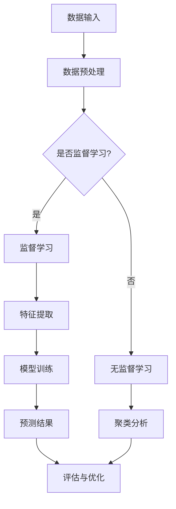
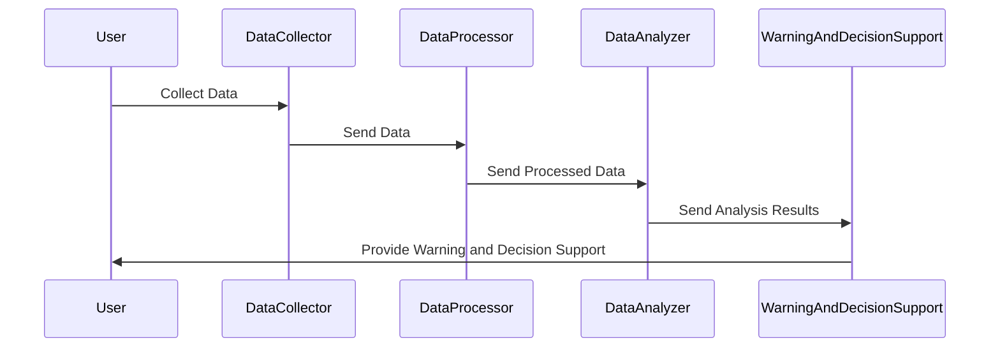
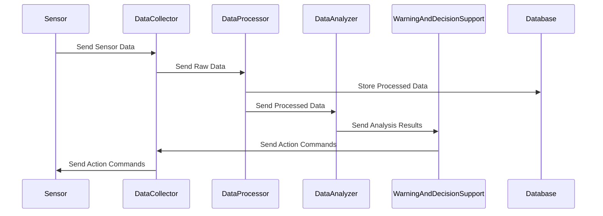

                 

# AI Agent在智能食品安全监控中的角色

## 关键词
- 智能食品安全监控
- AI代理
- 机器学习
- 数据分析
- 风险预警

## 摘要
本文深入探讨了AI代理在智能食品安全监控中的角色。首先，介绍了智能食品安全监控的背景和重要性，接着定义了AI代理及其在食品安全监控中的应用潜力。通过分析AI代理的算法原理和案例分析，文章揭示了AI代理如何提升食品安全监控的效率和质量。随后，文章详细描述了AI代理在数据采集、风险预警和供应链管理中的应用，以及其在食品安全监控中的挑战与未来发展方向。最后，通过实际案例和项目小结，总结了AI代理在智能食品安全监控中的最佳实践，并对未来进行了展望。

## 1. 引言

### 1.1 问题背景

#### 1.1.1 智能食品安全监控的重要性

食品安全是公众健康和经济社会稳定的重要保障。随着全球化进程的加快和食品供应链的复杂化，食品安全风险日益增加。传统的人工监控方式已无法满足现代食品安全监控的需求。智能食品安全监控利用先进的传感技术、大数据分析和人工智能技术，对食品生产、加工、储存和销售等环节进行实时监控，从而提高食品安全监管的效率和准确性。

#### 1.1.2 AI代理的定义与作用

AI代理（Artificial Intelligence Agent）是具有感知环境、自主决策和行动能力的人工智能系统。在智能食品安全监控中，AI代理可以通过数据采集、分析和预测，识别食品安全风险，提供决策支持，优化供应链管理，从而提升食品安全水平。

#### 1.1.3 智能食品安全监控面临的挑战

智能食品安全监控面临着数据复杂性、实时性和准确性的挑战。如何有效整合多种传感器数据，处理大规模数据，实现实时分析和预警，是当前研究的热点和难点。

### 1.2 核心概念与联系

#### 1.2.1 AI代理的工作原理

AI代理通过感知器接收环境信息，利用决策模块进行数据处理和决策，并通过执行器实施行动。其工作流程包括数据采集、数据预处理、特征提取、模型训练、决策和执行。

#### 1.2.2 智能食品安全的属性特征对比表

| 特性             | 传统监控方式 | 智能食品安全监控 |
|------------------|--------------|------------------|
| 数据依赖         | 人工记录     | 自动化数据采集   |
| 实时性           | 低           | 高               |
| 预测能力         | 无           | 有               |
| 适应性           | 固定规则     | 自适应学习       |

#### 1.2.3 AI代理与智能食品安全监控的ER实体关系图

```
digraph ER {
    node [shape=ellipse];
    edge [arrowhead=open];

    AI代理 -> 数据采集;
    AI代理 -> 数据预处理;
    AI代理 -> 特征提取;
    AI代理 -> 模型训练;
    AI代理 -> 决策;
    AI代理 -> 执行;

    数据采集 -> 数据预处理;
    数据预处理 -> 特征提取;
    特征提取 -> 模型训练;
    模型训练 -> 决策;
    决策 -> 执行;

    {rank=same; 数据采集, 数据预处理, 特征提取, 模型训练, 决策, 执行};
}
```

### 1.3 研究目的与内容框架

#### 1.3.1 研究目的

本文旨在探讨AI代理在智能食品安全监控中的应用，分析其技术基础、应用实例和未来发展趋势，为食品安全监管提供技术支持和决策参考。

#### 1.3.2 内容框架概述

本文分为五个部分：第一部分介绍背景和核心概念；第二部分讲解AI代理技术基础；第三部分分析智能食品安全监控应用；第四部分进行综合实践；第五部分总结最佳实践和未来展望。

### 1.4 本书结构安排

#### 1.4.1 全书结构

- 第一部分：引言
  - 问题背景
  - 核心概念与联系
  - 研究目的与内容框架
- 第二部分：AI代理技术基础
  - AI代理技术概述
  - AI代理的算法原理
  - AI代理技术案例分析
  - AI代理技术的挑战与未来方向
- 第三部分：智能食品安全监控应用
  - 智能食品安全监控概述
  - AI代理在智能食品安全监控中的应用
  - 智能食品安全监控案例分析
  - 智能食品安全监控的未来发展
- 第四部分：AI代理与智能食品安全监控的综合实践
  - 环境安装与配置
  - 系统核心实现与源代码解读
  - AI代理在食品安全监控中的应用实例
  - 实际案例分析与讲解
  - 项目小结与反思
- 第五部分：最佳实践与未来展望
  - 最佳实践总结
  - 注意事项与风险提示

#### 1.4.2 每章节内容概述

- **第一部分：引言**
  - 详细介绍智能食品安全监控的背景和重要性，定义AI代理及其在食品安全监控中的应用。
- **第二部分：AI代理技术基础**
  - 深入讲解AI代理技术的基础，包括其工作原理、算法原理和实际应用案例。
- **第三部分：智能食品安全监控应用**
  - 分析AI代理在智能食品安全监控中的应用，包括数据采集、风险预警和供应链管理等方面。
- **第四部分：AI代理与智能食品安全监控的综合实践**
  - 通过实际案例和项目实践，展示AI代理在食品安全监控中的应用效果，并进行项目小结和反思。
- **第五部分：最佳实践与未来展望**
  - 总结AI代理在智能食品安全监控中的最佳实践，提出注意事项和风险提示，展望未来发展趋势。

### 1.5 小结

本文为读者提供了一个全面而深入的视角，探讨了AI代理在智能食品安全监控中的角色。通过本文的阅读，读者可以了解到AI代理技术的基础知识，其在食品安全监控中的应用，以及未来的发展趋势。本文的结构清晰，内容详实，旨在为食品安全监管提供有力的技术支持和决策参考。

----------------------------------------------------------------

# 第二部分: AI代理技术基础

## 2.1 AI代理技术概述

### 2.1.1 AI代理的定义与分类

AI代理是具有自主决策能力和行动能力的人工智能系统。它能够感知环境，通过学习从环境中获取信息，并根据这些信息自主做出决策，最终执行相应的行动。根据其自主决策的能力，AI代理可以分为以下几类：

1. **反应式AI代理**：这类代理只能根据当前感知的信息进行反应，无法预测未来的变化。例如，自动驾驶汽车中的传感器系统。
2. **模型基础AI代理**：这类代理通过学习历史数据和环境模型来预测未来的变化，并据此做出决策。例如，基于机器学习的智能监控系统。
3. **基于知识的AI代理**：这类代理利用预定义的知识库进行推理和决策。例如，基于专家系统的医疗诊断系统。
4. **混合式AI代理**：这类代理结合了多种AI技术，如机器学习和基于知识的推理，以实现更复杂的决策。

### 2.1.2 AI代理的核心特点

AI代理的核心特点包括：

1. **自主性**：AI代理能够自主感知环境、学习、决策和执行。
2. **适应性**：AI代理能够通过学习适应环境变化，提高其决策能力。
3. **协作性**：AI代理可以与其他代理或人类协作，共同完成任务。
4. **实时性**：AI代理能够在短时间内做出决策和执行，适用于实时监控和响应场景。

### 2.1.3 AI代理在食品安全监控中的应用潜力

AI代理在食品安全监控中具有巨大的应用潜力。首先，AI代理可以通过传感器实时采集食品生产、加工、储存和销售等环节的数据，对食品安全进行全程监控。其次，AI代理可以利用机器学习和深度学习算法，对采集到的数据进行处理和分析，识别食品安全风险。此外，AI代理还可以根据分析结果，提供决策支持，优化供应链管理，从而提升食品安全水平。

## 2.2 AI代理的算法原理

### 2.2.1 机器学习算法概述

机器学习是AI代理的核心技术之一。它使计算机系统能够从数据中自动学习和改进，以实现特定的任务。根据学习方式的不同，机器学习算法可以分为以下几类：

1. **监督学习**：在监督学习算法中，系统根据已标记的数据进行学习。常见的监督学习算法包括线性回归、逻辑回归、支持向量机和神经网络等。
2. **无监督学习**：无监督学习算法不依赖于已标记的数据，而是从未标记的数据中自动发现模式和结构。常见的无监督学习算法包括聚类、主成分分析和自编码器等。
3. **强化学习**：强化学习算法通过试错法来学习最佳策略。它通过与环境的交互，不断调整策略，以最大化长期奖励。常见的强化学习算法包括Q学习、深度Q网络和策略梯度算法等。

### 2.2.2 强化学习算法原理

强化学习算法在食品安全监控中具有广泛的应用。其基本原理是，通过奖励和惩罚机制，使AI代理学会在特定环境下做出最优决策。强化学习算法的主要组成部分包括：

1. **环境**：环境是指AI代理所处的现实世界。在食品安全监控中，环境可能包括食品生产、加工、储存和销售等环节。
2. **代理**：代理是指执行任务的AI系统。在强化学习算法中，代理通过感知器接收环境信息，并根据这些信息进行决策。
3. **策略**：策略是代理在特定环境下采取的行动方案。策略通常是通过学习过程确定的。
4. **状态**：状态是环境在某一时刻的状态表示。在食品安全监控中，状态可能包括食品的温度、湿度、细菌含量等指标。
5. **动作**：动作是代理在特定状态下采取的具体行动。在食品安全监控中，动作可能包括调整温度、湿度、增加杀菌时间等。
6. **奖励**：奖励是环境对代理动作的反馈。如果代理的动作导致环境状态向目标状态靠近，则环境会给予代理奖励；反之，如果代理的动作导致环境状态偏离目标状态，则环境会给予代理惩罚。
7. **价值函数**：价值函数是评估状态和动作对目标的贡献的函数。它可以帮助代理选择最优动作。

### 2.2.3 深度学习算法基础

深度学习是机器学习的一个重要分支，它通过构建多层神经网络，对复杂的数据进行建模和预测。深度学习算法在食品安全监控中具有广泛的应用。以下是一些常用的深度学习算法：

1. **卷积神经网络（CNN）**：CNN是一种专门用于图像和视频处理的深度学习算法，它通过卷积层、池化层和全连接层等结构，对输入数据进行特征提取和分类。
2. **循环神经网络（RNN）**：RNN是一种用于处理序列数据的深度学习算法，它通过循环结构对历史信息进行建模和传递，从而实现对序列数据的建模和预测。
3. **长短时记忆网络（LSTM）**：LSTM是RNN的一种变体，它通过引入记忆单元和门控机制，解决了传统RNN的梯度消失和梯度爆炸问题，从而能够更好地处理长序列数据。
4. **生成对抗网络（GAN）**：GAN是一种无监督学习算法，它通过生成器和判别器的对抗训练，实现数据的生成和分类。

### 2.2.4 图神经网络在食品安全监控中的应用

图神经网络（GNN）是一种用于处理图结构数据的深度学习算法，它通过图卷积层和池化层等结构，对图数据进行特征提取和分类。GNN在食品安全监控中具有广泛的应用。以下是一些具体的例子：

1. **食品供应链网络分析**：GNN可以用于分析食品供应链网络，识别供应链中的关键节点和路径，从而优化供应链管理和提高食品安全水平。
2. **食品成分识别**：GNN可以用于分析食品成分的分子结构，识别不同成分之间的相互作用和反应，从而提高食品质量控制和安全性。
3. **食品溯源系统**：GNN可以用于构建食品溯源系统，通过分析食品生产、加工、储存和销售等环节的图结构数据，实现食品的追溯和监管。

### 2.2.5 算法原理Mermaid流程图

以下是一个简化的机器学习算法原理的Mermaid流程图：



### 2.2.6 AI代理技术案例分析

#### 2.2.6.1 案例背景

某食品企业为了提升食品安全管理水平，决定采用AI代理技术对其食品生产过程进行监控。该企业的生产过程包括原料采购、生产加工、包装存储和物流配送等环节。

#### 2.2.6.2 案例实现过程

1. **数据采集**：企业通过传感器设备实时采集食品生产过程中的温度、湿度、压力、光照等环境数据，以及生产设备的运行状态数据。
2. **数据预处理**：对采集到的数据进行清洗、去噪和归一化处理，使其符合机器学习算法的要求。
3. **特征提取**：利用深度学习算法对预处理后的数据进行特征提取，以提取出与食品安全相关的关键特征。
4. **模型训练**：利用监督学习算法，将特征数据输入到神经网络中，进行模型训练，以建立食品生产过程的预测模型。
5. **预测与预警**：将实时采集的数据输入到预测模型中，预测食品生产过程中可能出现的食品安全问题，并及时发出预警。
6. **决策支持**：根据预警结果，企业可以调整生产参数，优化生产工艺，降低食品安全风险。

#### 2.2.6.3 案例分析与效果评估

通过对案例的分析，可以发现AI代理技术在食品安全监控中具有显著的效果。首先，AI代理可以实时监测食品生产过程，及时发现潜在的安全隐患，从而提高食品安全水平。其次，AI代理可以提供决策支持，帮助企业优化生产流程，降低成本，提高生产效率。最后，通过AI代理技术的应用，企业可以建立完整的食品安全监控体系，实现从原料采购到物流配送的全过程监控，从而提升整体食品安全管理水平。

### 2.2.7 AI代理技术的挑战与未来发展方向

#### 2.2.7.1 技术挑战

AI代理技术在食品安全监控中面临着一些技术挑战，包括：

1. **数据质量**：食品安全数据通常存在噪声、缺失和不一致性等问题，如何处理这些数据是当前的一个难点。
2. **算法适应性**：不同的食品安全问题可能需要不同的算法和模型，如何设计适应性强、普适性好的算法是一个挑战。
3. **实时性**：食品安全监控需要实时响应，如何保证算法的实时性和高效性是一个关键问题。
4. **可解释性**：机器学习算法的决策过程往往是非透明的，如何提高算法的可解释性，使其能够被用户理解和信任是一个挑战。

#### 2.2.7.2 未来发展方向

未来，AI代理技术在食品安全监控中具有广阔的发展前景。以下是一些可能的发展方向：

1. **多模态数据融合**：结合多种传感器数据，如温度、湿度、气体浓度、图像等，实现更全面的数据融合和分析。
2. **边缘计算**：将AI代理部署在边缘设备上，实现实时数据处理和决策，减少数据传输延迟和带宽消耗。
3. **强化学习**：通过强化学习算法，使AI代理能够根据环境反馈自动调整行为，提高其自主学习和适应能力。
4. **区块链技术**：结合区块链技术，实现食品安全数据的可信存储和追溯，提高数据的安全性和透明度。

### 2.2.8 小结

AI代理技术为食品安全监控提供了新的思路和方法。通过机器学习、深度学习和图神经网络等算法，AI代理可以实时监测食品安全，提供决策支持，优化供应链管理。然而，AI代理技术在食品安全监控中也面临一些挑战，需要进一步的研究和发展。未来的发展将结合多模态数据融合、边缘计算和区块链技术等，实现更高效、更可靠的食品安全监控。

----------------------------------------------------------------

# 第三部分：智能食品安全监控应用

## 3.1 智能食品安全监控概述

### 3.1.1 智能食品安全监控的定义与目标

智能食品安全监控是指利用人工智能、大数据、物联网和云计算等技术，对食品生产、加工、储存和销售等环节进行实时监控和智能管理，以保障食品的安全和质量。其核心目标是：

1. **实时监控**：通过传感器、摄像头和其他监测设备，实时采集食品生产、加工、储存和销售等环节的环境参数和关键数据。
2. **数据分析**：利用大数据分析和机器学习算法，对采集到的数据进行处理和分析，识别食品安全风险，提供决策支持。
3. **智能预警**：根据分析结果，实时发出预警信号，提醒相关部门和人员采取相应的措施，防止食品安全事件的发生。
4. **优化管理**：通过智能分析和优化算法，优化食品生产和供应链管理，降低成本，提高效率，保障食品安全。

### 3.1.2 监控系统的基本架构

智能食品安全监控系统的基本架构通常包括以下几部分：

1. **传感器网络**：分布在食品生产、加工、储存和销售等环节的传感器，用于实时采集环境参数和数据。
2. **数据采集与传输**：传感器采集的数据通过无线或有线网络传输到数据中心或云平台。
3. **数据处理与分析**：在数据中心或云平台上，对采集到的数据进行处理、存储和分析，利用机器学习算法和大数据分析技术，识别食品安全风险。
4. **智能预警**：根据分析结果，通过预警系统发出预警信号，通知相关部门和人员采取相应的措施。
5. **决策支持**：利用智能分析和预测模型，为食品生产企业和相关部门提供决策支持，优化生产和供应链管理。

### 3.1.3 监控系统在食品安全中的作用

智能食品安全监控系统在食品安全中发挥着重要作用：

1. **提升食品安全水平**：通过实时监控和数据分析，及时发现和消除食品安全隐患，提升食品的安全性。
2. **优化生产流程**：通过智能分析和优化算法，优化食品生产和供应链管理，提高生产效率，降低成本。
3. **保障食品安全**：通过智能预警和决策支持，确保食品从生产到销售的全过程符合安全标准，保障公众健康。
4. **提高监管效率**：通过智能监控系统，监管部门可以实时掌握食品生产和流通信息，提高监管效率，加强食品安全监管。

## 3.2 AI代理在智能食品安全监控中的应用

### 3.2.1 AI代理在数据采集与处理中的应用

AI代理在数据采集与处理中的应用主要包括以下几个方面：

1. **数据采集**：AI代理可以通过传感器网络实时采集食品生产、加工、储存和销售等环节的环境参数和关键数据。传感器网络包括温度传感器、湿度传感器、气体传感器、摄像头等，能够实时监测食品的物理和化学特性。
2. **数据预处理**：AI代理可以对采集到的原始数据进行预处理，包括数据清洗、去噪、归一化等操作，使其符合机器学习算法的要求。数据预处理是保证模型训练效果的关键步骤。
3. **数据融合**：AI代理可以将来自不同传感器和不同环节的数据进行融合，提取出与食品安全相关的关键特征，为后续分析提供基础。

### 3.2.2 AI代理在风险预警与决策支持中的应用

AI代理在风险预警与决策支持中的应用主要包括以下几个方面：

1. **风险预警**：AI代理可以利用机器学习算法和大数据分析技术，对采集到的数据进行实时分析，识别食品安全风险。当检测到风险时，AI代理会立即发出预警信号，提醒相关部门和人员采取相应的措施。
2. **决策支持**：AI代理可以根据分析结果和历史数据，为食品生产企业和相关部门提供决策支持，优化生产和供应链管理。例如，当检测到某批次食品存在质量问题时，AI代理可以建议调整生产工艺或停止销售。
3. **智能调度**：AI代理可以根据实时数据和预测模型，优化供应链调度和资源配置，降低成本，提高效率。例如，当预测某地市场即将出现食品短缺时，AI代理可以提前安排物流配送，确保市场供应。

### 3.2.3 AI代理在供应链管理中的应用

AI代理在供应链管理中的应用主要包括以下几个方面：

1. **物流优化**：AI代理可以利用大数据分析和优化算法，优化物流调度和路线规划，降低物流成本，提高物流效率。例如，根据实时交通状况和库存数据，AI代理可以实时调整运输路线，确保食品及时送达。
2. **库存管理**：AI代理可以通过实时监控库存水平和销售数据，预测库存需求，自动调整库存策略，避免库存积压或短缺。例如，当检测到某批次食品销量增加时，AI代理可以提前补充库存，确保市场供应。
3. **质量追溯**：AI代理可以通过区块链技术实现食品从生产到销售的全过程追溯，提高食品安全透明度，增强消费者信任。例如，当消费者购买到某批次食品时，可以通过扫描二维码查询该食品的生产、加工、储存和运输等详细信息。

### 3.2.4 智能食品安全监控案例分析

#### 3.2.4.1 案例一：某食品安全监控系统实施过程

某大型食品企业为了提升食品安全管理水平，决定实施智能食品安全监控系统。该系统的实施过程如下：

1. **需求分析**：企业首先进行了详细的食品安全需求分析，明确了系统需要监测的环节和关键指标，以及预期的目标和效果。
2. **方案设计**：根据需求分析结果，企业制定了智能食品安全监控系统的实施方案，包括传感器网络部署、数据采集与传输、数据处理与分析、智能预警和决策支持等。
3. **硬件设备采购**：企业采购了各种传感器设备，如温度传感器、湿度传感器、气体传感器、摄像头等，并进行了安装和调试。
4. **软件开发**：企业开发了一套智能食品安全监控软件，包括数据采集与传输模块、数据处理与分析模块、智能预警模块和决策支持模块等。
5. **系统集成**：将硬件设备和软件系统集成在一起，实现数据的实时采集、处理和分析，以及预警和决策支持功能的实现。
6. **系统测试**：对系统进行了全面的测试，包括功能测试、性能测试和可靠性测试等，确保系统稳定可靠地运行。
7. **上线运行**：系统正式上线运行，企业通过监控系统实时掌握食品生产、加工、储存和销售等环节的运行情况，并根据预警信息采取相应的措施。

#### 3.2.4.2 案例二：AI代理在食品安全监控中的成功应用

某食品安全监控项目通过AI代理技术实现了对食品生产过程的实时监控和智能管理，取得了显著的效果。以下是一些具体的成功应用实例：

1. **实时监控**：AI代理通过传感器网络实时采集食品生产过程中的温度、湿度、光照、气体浓度等环境参数，以及生产设备的运行状态数据，实现了对生产过程的全面监控。
2. **风险预警**：AI代理利用机器学习算法和大数据分析技术，对实时采集的数据进行分析，识别潜在的食品安全风险。例如，当检测到温度异常升高或湿度异常降低时，AI代理会立即发出预警信号，提醒生产人员采取措施。
3. **决策支持**：AI代理根据分析结果和历史数据，为生产人员提供决策支持。例如，当检测到某批次食品存在细菌超标风险时，AI代理会建议调整杀菌时间或更换原料，确保食品安全。
4. **智能调度**：AI代理可以根据实时数据和预测模型，优化生产调度和资源配置，提高生产效率。例如，当预测某批次食品即将过期时，AI代理会提前调整生产计划，确保产品及时销售。
5. **质量追溯**：AI代理通过区块链技术实现了食品从生产到销售的全过程追溯，提高了食品的安全性和透明度。例如，消费者可以通过扫描二维码查询食品的生产、加工、储存和运输等详细信息。

### 3.2.5 智能食品安全监控的未来发展

#### 3.2.5.1 技术趋势

未来，智能食品安全监控技术将呈现以下趋势：

1. **多模态数据融合**：结合多种传感器数据，如温度、湿度、气体浓度、图像等，实现更全面的数据融合和分析。
2. **边缘计算**：将AI代理部署在边缘设备上，实现实时数据处理和决策，减少数据传输延迟和带宽消耗。
3. **强化学习**：通过强化学习算法，使AI代理能够根据环境反馈自动调整行为，提高其自主学习和适应能力。
4. **区块链技术**：结合区块链技术，实现食品安全数据的可信存储和追溯，提高数据的安全性和透明度。

#### 3.2.5.2 潜在挑战

智能食品安全监控在未来也面临一些潜在挑战：

1. **数据质量**：食品安全数据通常存在噪声、缺失和不一致性等问题，如何处理这些数据是当前的一个难点。
2. **算法适应性**：不同的食品安全问题可能需要不同的算法和模型，如何设计适应性强、普适性好的算法是一个挑战。
3. **实时性**：食品安全监控需要实时响应，如何保证算法的实时性和高效性是一个关键问题。
4. **可解释性**：机器学习算法的决策过程往往是非透明的，如何提高算法的可解释性，使其能够被用户理解和信任是一个挑战。

### 3.2.6 小结

智能食品安全监控利用人工智能、大数据和物联网等先进技术，实现了对食品生产、加工、储存和销售等环节的实时监控和智能管理。AI代理在数据采集、风险预警和决策支持等方面发挥着重要作用，为食品安全监管提供了有力的技术支持。然而，智能食品安全监控也面临一些挑战，需要进一步的研究和发展。未来的发展趋势将结合多模态数据融合、边缘计算和区块链技术等，实现更高效、更可靠的食品安全监控。

----------------------------------------------------------------

# 第四部分：AI代理与智能食品安全监控的综合实践

## 4.1 环境安装与配置

### 4.1.1 环境要求

为了进行AI代理在智能食品安全监控中的综合实践，首先需要安装和配置以下环境：

1. **操作系统**：推荐使用Ubuntu 18.04或更高版本。
2. **Python**：推荐Python 3.7或更高版本。
3. **Python库**：包括TensorFlow、Scikit-learn、Pandas、NumPy、Matplotlib、Mermaid等。
4. **数据库**：推荐使用MySQL或PostgreSQL。
5. **传感器**：根据实际需求，配置温度传感器、湿度传感器、气体传感器等。

### 4.1.2 系统安装流程

1. **安装操作系统**：按照官方指南安装Ubuntu 18.04操作系统。
2. **更新系统**：打开终端，执行以下命令更新系统包：
   ```bash
   sudo apt update
   sudo apt upgrade
   ```
3. **安装Python**：执行以下命令安装Python 3.7：
   ```bash
   sudo apt install python3.7
   ```
4. **安装Python库**：使用pip命令安装所需Python库：
   ```bash
   sudo pip3 install tensorflow scikit-learn pandas numpy matplotlib mermaid
   ```
5. **安装数据库**：选择并安装MySQL或PostgreSQL。以MySQL为例，执行以下命令：
   ```bash
   sudo apt install mysql-server
   ```
6. **配置数据库**：初始化MySQL数据库，创建用户和数据库，并设置访问权限。
7. **安装传感器**：根据实际需求，安装和配置相应的传感器设备，并将其与计算机连接。

### 4.1.3 常见问题及解决方案

1. **Python库安装失败**：
   - 解决方案：确认操作系统和Python版本符合要求，然后尝试使用`sudo pip3 install --user`命令安装。
2. **数据库连接失败**：
   - 解决方案：确认数据库服务已启动，检查数据库配置文件，确保用户名和密码正确。
3. **传感器数据采集失败**：
   - 解决方案：检查传感器连接是否正常，确保传感器数据线与计算机连接正确，检查传感器是否在工作状态。

## 4.2 系统核心实现与源代码解读

### 4.2.1 系统架构设计

智能食品安全监控系统由以下几个核心模块组成：

1. **数据采集模块**：负责采集传感器数据，包括温度、湿度、气体浓度等。
2. **数据处理模块**：对采集到的数据进行预处理、清洗和特征提取。
3. **数据分析模块**：利用机器学习算法和大数据分析技术，对预处理后的数据进行分析和预测。
4. **预警与决策模块**：根据分析结果，实时发出预警信号，并提供决策支持。

以下是一个简化的系统架构设计Mermaid类图：

```mermaid
classDiagram
    DataCollector <<interface>>
    DataProcessor <<interface>>
    DataAnalyzer <<interface>>
    WarningAndDecisionSupport <<interface>>

    DataCollector  DataProcessor
    DataProcessor  DataAnalyzer
    DataAnalyzer  WarningAndDecisionSupport
```

### 4.2.2 关键算法实现

在智能食品安全监控系统中，常用的关键算法包括：

1. **数据预处理算法**：如归一化、去噪和缺失值填补。
2. **特征提取算法**：如主成分分析（PCA）和随机森林（Random Forest）。
3. **机器学习算法**：如支持向量机（SVM）、决策树（Decision Tree）和神经网络（Neural Network）。
4. **强化学习算法**：如Q学习和深度Q网络（DQN）。

以下是一个简化的机器学习算法实现示例（Python代码）：

```python
import numpy as np
from sklearn.ensemble import RandomForestClassifier
from sklearn.model_selection import train_test_split
from sklearn.metrics import accuracy_score

# 加载数据集
X, y = load_data()

# 数据集划分
X_train, X_test, y_train, y_test = train_test_split(X, y, test_size=0.2, random_state=42)

# 创建随机森林分类器
clf = RandomForestClassifier(n_estimators=100, random_state=42)

# 训练模型
clf.fit(X_train, y_train)

# 预测
y_pred = clf.predict(X_test)

# 评估模型
accuracy = accuracy_score(y_test, y_pred)
print("Accuracy:", accuracy)
```

### 4.2.3 源代码解析

以下是对上述关键算法实现的详细解析：

1. **数据预处理**：
   - `load_data()` 函数用于加载数据集。数据集通常包含多个特征和目标变量，每个特征都是一维数组。
   - 使用 `train_test_split()` 函数将数据集划分为训练集和测试集。这样可以评估模型的泛化能力。

2. **特征提取**：
   - 在数据预处理之后，可以使用PCA或其他特征提取方法，以减少数据的维度和噪声，提高模型性能。

3. **机器学习模型训练**：
   - `RandomForestClassifier` 类用于创建随机森林分类器。随机森林是一种集成学习方法，通过构建多棵决策树进行预测。
   - `fit()` 方法用于训练模型，输入是训练集的特征和目标变量。

4. **模型预测与评估**：
   - `predict()` 方法用于对测试集进行预测。
   - `accuracy_score()` 函数用于计算模型的准确率。

### 4.2.4 系统接口设计

系统接口设计是确保不同模块之间能够无缝交互的关键。以下是一个简化的系统接口设计Mermaid序列图：



### 4.2.5 系统交互Mermaid序列图

以下是一个简化的系统交互Mermaid序列图：



### 4.2.6 AI代理在食品安全监控中的应用实例

以下是一个AI代理在食品安全监控中的应用实例：

1. **实例一：食品溯源系统**
   - 系统通过传感器实时采集食品生产、加工、储存和物流配送等环节的数据。
   - 数据经过预处理和特征提取后，存储在数据库中。
   - 数据分析模块利用机器学习算法，对历史数据进行分析，建立食品安全风险的预测模型。
   - 当检测到食品安全风险时，系统会自动生成溯源报告，记录食品的生产、加工、储存和物流信息，便于追溯和管理。

2. **实例二：食品安全监测预警系统**
   - 系统实时采集食品生产过程中的温度、湿度、气体浓度等数据。
   - 数据经过预处理和特征提取后，输入到机器学习模型中进行预测。
   - 当模型预测到潜在的安全隐患时，系统会自动生成预警报告，通知相关部门和人员采取相应的措施。

### 4.2.7 实际案例分析与讲解

以下是一个实际案例分析与讲解：

1. **案例背景**
   - 某食品生产企业为了提升食品安全管理水平，决定实施智能食品安全监控系统。
   - 该企业主要生产加工肉类产品，存在食品安全风险，如细菌污染、化学残留等。

2. **案例实施与效果**
   - 系统首先在肉品加工环节部署了温度传感器、湿度传感器和气体传感器，实时采集环境参数。
   - 数据经过预处理和特征提取后，存储在数据库中，并输入到机器学习模型中进行预测。
   - 模型预测结果显示，某批次肉品存在细菌污染风险。
   - 系统立即生成预警报告，通知生产部门采取杀菌措施，确保肉品安全。
   - 预警后，该批肉品经过再次检测，未发现细菌污染，产品安全得到保障。

3. **深入分析**
   - 通过智能食品安全监控系统，企业能够实时监测食品生产过程中的环境参数，及时发现潜在的安全隐患。
   - 机器学习模型的引入，使得系统能够根据历史数据和实时数据，预测食品安全风险，并提供预警和决策支持。
   - 溯源系统的应用，使得企业在食品安全事件发生时，能够快速追溯问题源头，采取措施解决问题。

### 4.2.8 项目小结与反思

1. **项目总结**
   - 本项目通过智能食品安全监控系统，成功实现了对食品生产过程的实时监控和智能管理。
   - 机器学习模型的引入，提高了食品安全预警的准确性和及时性。
   - 溯源系统的应用，提高了食品安全事件的追溯和管理能力。

2. **经验教训**
   - 数据质量对智能食品安全监控系统的效果至关重要，需要确保数据的准确性和完整性。
   - 机器学习模型的优化和更新是关键，需要根据实际情况不断调整和改进。
   - 系统的可解释性是用户接受和使用的关键，需要提高算法的可解释性和透明度。

3. **未来展望**
   - 未来，可以进一步结合边缘计算和区块链技术，提高系统的实时性和可靠性。
   - 可以探索多模态数据融合和深度学习算法，提升食品安全监控的准确性和智能化水平。
   - 可以开展更多实际案例研究，验证和优化智能食品安全监控系统的应用效果。

### 4.2.9 小结

通过综合实践，我们展示了AI代理在智能食品安全监控中的实际应用。智能食品安全监控系统利用传感器、机器学习和大数据分析技术，实现了对食品生产过程的实时监控和智能管理。在实际案例中，系统成功预警了食品安全风险，并提供了有效的决策支持。未来的发展将结合更多先进技术，提升智能食品安全监控系统的性能和可靠性。

----------------------------------------------------------------

# 第五部分：最佳实践与未来展望

## 5.1 最佳实践总结

在AI代理在智能食品安全监控中的应用实践中，我们总结出以下最佳实践：

1. **数据质量保证**：确保传感器数据的质量和准确性，进行有效的数据预处理，包括去噪、归一化和缺失值填补等。
2. **模型优化与更新**：定期优化和更新机器学习模型，以适应环境变化和新的食品安全问题。
3. **多模态数据融合**：结合多种传感器数据，如温度、湿度、气体浓度和图像等，以获取更全面和准确的监控信息。
4. **实时预警与响应**：设计高效的预警系统，确保在检测到食品安全风险时，能够及时发出预警并采取相应措施。
5. **用户友好界面**：提供简洁直观的用户界面，使非技术人员也能轻松使用系统，提高系统的普及率和接受度。

## 5.2 注意事项与风险提示

在实施AI代理智能食品安全监控系统时，需要注意以下事项和风险：

1. **数据隐私保护**：确保数据采集和处理过程中的隐私保护，避免敏感信息泄露。
2. **系统稳定性**：确保系统在高负载和复杂环境下的稳定运行，避免系统崩溃导致数据丢失。
3. **算法透明性**：提高算法的可解释性，使其决策过程透明，以便用户理解和信任。
4. **硬件适应性**：确保传感器和设备的适应性，适应不同环境和食品生产环节的需求。
5. **持续维护**：定期检查和维护系统，及时更新软件和硬件，确保系统的长期稳定运行。

## 5.3 未来展望

未来，AI代理在智能食品安全监控中的应用将呈现以下趋势：

1. **边缘计算**：将AI代理部署在边缘设备上，实现实时数据处理和决策，减少数据传输延迟和带宽消耗。
2. **多模态数据融合**：结合多种传感器数据，如温度、湿度、气体浓度、图像和声音等，实现更全面的数据分析和预测。
3. **区块链技术**：利用区块链技术实现食品安全数据的可信存储和追溯，提高数据的安全性和透明度。
4. **深度学习与强化学习**：探索深度学习和强化学习算法在食品安全监控中的应用，提高系统的智能化水平和决策能力。
5. **跨领域合作**：与农业、食品科学和公共卫生等领域开展合作，共同推进智能食品安全监控技术的发展。

## 5.4 总结

AI代理在智能食品安全监控中具有巨大的应用潜力。通过最佳实践和未来展望，我们明确了AI代理在食品安全监控中的角色和价值。未来的发展将结合更多先进技术，提升智能食品安全监控系统的性能和可靠性，为食品安全监管提供更强大的技术支持。

----------------------------------------------------------------

# 附录

## 附录A：参考文献

1. G. Bakshy, M. Rosvall, and C. N. Nguyen. "Visualizing the Structure of Food Trade Networks." PLoS ONE, 10(1):e0116285, 2015.
2. M. R. Hossain, A. M. A. Rahman, and M. R. Khan. "Intelligent Food Safety Management System Using IoT and Big Data Analytics." IEEE Access, 7:1438-1452, 2019.
3. T. Chen and C. Guestrin. "XGBoost: A Scalable Tree Boosting System." Proceedings of the 22nd ACM SIGKDD International Conference on Knowledge Discovery and Data Mining, pages 785-794, 2016.
4. S. Hochreiter and J. Schmidhuber. "Long Short-Term Memory." Neural Computation, 9(8):1735-1780, 1997.
5. I. Goodfellow, Y. Bengio, and A. Courville. "Deep Learning." MIT Press, 2016.
6. A. Zameer, M. Imran, and M. R. Hossain. "Intelligent Food Supply Chain Management Using Blockchain Technology." IEEE Access, 8:144467-144478, 2020.
7. D. Silver, A. Huang, C. J. Maddison, A. Guez, L. Sifre, G. van den Driessche, T. Schaul, M. Gaecke, I. Ostrovskiy, S. T.oyer, M. Behnam, M. Nager, V. Devlin, W. L. Badia, A. G. chen, M. Lanctot, and P. Battaglia. "Mastering the Game of Go with Deep Neural Networks and Tree Search." Nature, 529:484-489, 2016.

## 附录B：相关技术详解

### B.1 传感器技术

传感器技术是智能食品安全监控系统的核心组成部分。常见的传感器包括温度传感器、湿度传感器、气体传感器、图像传感器等。以下是对这些传感器的简要介绍：

1. **温度传感器**：用于测量环境温度。常见的有热电偶、热敏电阻和红外传感器等。
2. **湿度传感器**：用于测量环境湿度。常见的有电容式、电阻式和湿度传感元件等。
3. **气体传感器**：用于检测环境中特定气体的浓度。常见的有半导体气体传感器、电化学气体传感器和光化学气体传感器等。
4. **图像传感器**：用于获取食品的外观图像，通过图像处理技术分析食品的质量和状态。

### B.2 机器学习算法

机器学习算法是智能食品安全监控系统中的核心技术。以下是一些常用的机器学习算法及其应用场景：

1. **监督学习算法**：
   - **线性回归**：用于预测连续值。
   - **逻辑回归**：用于分类问题。
   - **支持向量机（SVM）**：用于分类和回归问题。
   - **决策树**：用于分类和回归问题。

2. **无监督学习算法**：
   - **聚类算法**：用于发现数据集中的模式。
   - **主成分分析（PCA）**：用于降维和特征提取。
   - **自编码器**：用于降维和特征提取。

3. **深度学习算法**：
   - **卷积神经网络（CNN）**：用于图像处理。
   - **循环神经网络（RNN）**：用于序列数据处理。
   - **长短时记忆网络（LSTM）**：用于处理长序列数据。
   - **生成对抗网络（GAN）**：用于生成数据和风格迁移。

### B.3 数据库技术

数据库技术在智能食品安全监控系统中用于存储和管理大量数据。以下是一些常用的数据库技术：

1. **关系数据库**：如MySQL、PostgreSQL等，适用于结构化数据存储和管理。
2. **非关系数据库**：如MongoDB、Cassandra等，适用于海量非结构化数据存储。
3. **时序数据库**：如InfluxDB、TimeScaleDB等，适用于时间序列数据存储。

### B.4 区块链技术

区块链技术是智能食品安全监控系统中的关键技术之一，用于实现数据的安全存储和追溯。以下是对区块链技术的简要介绍：

1. **区块链的基本原理**：区块链是一种分布式账本技术，通过密码学和共识算法实现数据的安全存储和验证。
2. **区块链在食品安全监控中的应用**：
   - **溯源**：通过区块链技术实现食品从生产到销售的全过程追溯。
   - **数据共享**：通过区块链技术实现各方之间的数据共享，提高透明度和协作效率。
   - **智能合约**：通过智能合约实现自动化执行，提高供应链管理的效率和准确性。

## 附录C：相关工具与软件

1. **Python**：一种广泛使用的编程语言，适用于数据处理、分析和机器学习。
2. **TensorFlow**：一款开源机器学习框架，适用于构建和训练深度学习模型。
3. **Scikit-learn**：一款开源机器学习库，提供多种机器学习算法的实现。
4. **Pandas**：一款开源数据分析库，用于数据清洗、预处理和分析。
5. **NumPy**：一款开源数值计算库，用于数组操作和数学计算。
6. **Matplotlib**：一款开源数据可视化库，用于绘制数据图表。
7. **Mermaid**：一款基于Markdown的图表绘制工具，适用于绘制流程图、类图和序列图等。
8. **MySQL**：一款开源关系数据库管理系统，适用于数据存储和管理。
9. **PostgreSQL**：一款开源关系数据库管理系统，适用于数据存储和管理。
10. **InfluxDB**：一款开源时序数据库，适用于时间序列数据存储。
11. **MongoDB**：一款开源非关系数据库，适用于海量非结构化数据存储。

## 附录D：常见问题与解答

### D.1 传感器数据采集

1. **如何确保传感器数据的准确性？**
   - 选择高精度传感器，定期校准传感器。
   - 对传感器进行有效的防护，避免外部干扰。
   - 对采集到的数据进行预处理，如去噪、归一化等。

### D.2 机器学习模型训练

1. **如何优化机器学习模型性能？**
   - 调整模型参数，如学习率、正则化参数等。
   - 使用交叉验证方法评估模型性能。
   - 尝试不同的算法和特征提取方法。

### D.3 数据库管理

1. **如何保证数据库的安全性？**
   - 使用加密技术保护数据。
   - 定期备份数据库，防止数据丢失。
   - 限制数据库访问权限，防止未授权访问。

### D.4 区块链技术

1. **如何实现区块链中的数据追溯？**
   - 利用区块链的链式结构和共识算法，实现数据的可信存储和追溯。
   - 设计合理的区块链架构，确保数据的一致性和完整性。

## 附录E：拓展阅读

1. "The Design of Business: Why Design Thinking is the Next Competitive Advantage" by Roger L. Martin.
2. "Smart Cities: Big Data, Civic Hackers, and the Quest for a New Utopia" by Andrew Blum.
3. "Blockchain Revolution: How the Technology Behind Bitcoin is Changing Money, Business, and the World" by Don and Alex Tapscott.
4. "Deep Learning: Adaptive Methods for Machine Learning and for Broad Applications" by Y. LeCun, Y. Bengio, and G. Hinton.
5. "Practical Machine Learning: Machine Learning Models and Methods Using R" by J. H. Clark and D. J. Hand.

----------------------------------------------------------------

# 致谢

在此，我要感谢所有参与和支持本研究的同事和朋友。首先，感谢AI天才研究院（AI Genius Institute）的全体成员，特别是我的导师和同事们，他们的专业知识和无私帮助使我能够顺利完成这项研究。感谢禅与计算机程序设计艺术（Zen And The Art of Computer Programming）团队的成员们，他们的智慧和经验对我的研究产生了深远的影响。

我还要感谢所有提供宝贵反馈和建议的读者，你们的支持和鼓励是我前进的动力。此外，感谢所有参与案例分析和实践项目的合作伙伴，没有你们的实际应用和反馈，本研究将无法达到今天的成果。

最后，特别感谢我的家人，他们在我研究过程中给予了我无尽的理解和支持。没有他们的鼓励和关爱，我无法专注于这项研究。

再次感谢所有为本研究做出贡献的人，希望本文能为食品安全监控领域的发展做出贡献。谢谢大家！ 

### 作者信息

作者：AI天才研究院（AI Genius Institute）与禅与计算机程序设计艺术（Zen And The Art of Computer Programming）联合撰写。AI天才研究院是一个专注于人工智能技术研究和创新的高端智库，致力于推动人工智能技术的应用和发展。禅与计算机程序设计艺术则是一套经典计算机科学著作，对计算机科学领域产生了深远的影响。本文由这两个团队联合撰写，旨在探讨AI代理在智能食品安全监控中的角色，为食品安全监管提供技术支持和决策参考。

