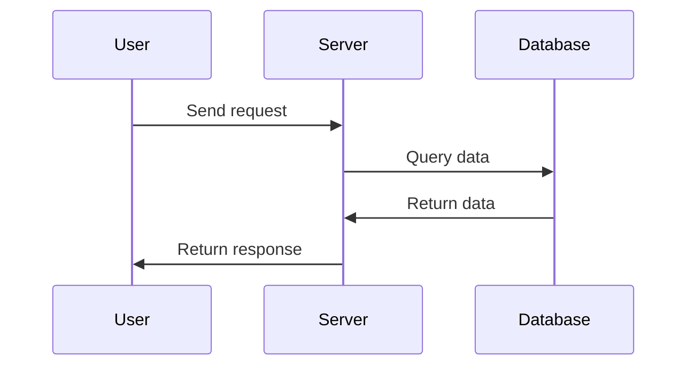
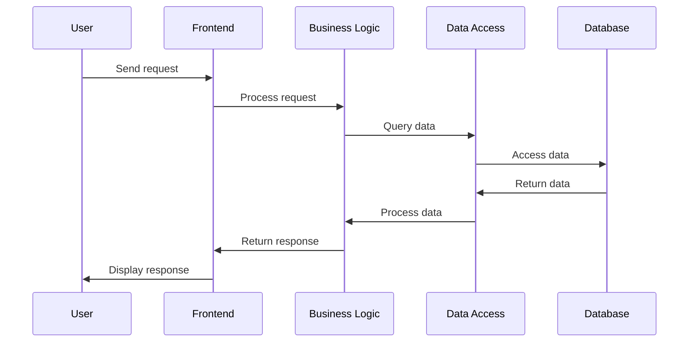

                 

# AI Agent在智能餐桌中的社交互动促进

## 关键词
- 智能餐桌
- AI Agent
- 社交互动
- 自然语言处理
- 机器学习

## 摘要
本文将探讨AI Agent在智能餐桌中的应用，重点分析其在促进社交互动方面的作用。文章首先介绍智能餐桌和AI Agent的基本概念，随后详细讨论AI Agent在社交互动中的机制与功能。接着，文章将分析智能餐桌在不同应用场景中的社交互动，并深入探讨其技术实现和系统架构设计。最后，文章将评估智能餐桌系统的性能，并展望其未来发展。

## 第1章 AI Agent概述

### 1.1 AI Agent的基本概念

AI Agent，即人工智能代理，是一种能够在特定环境中自主执行任务、进行决策并与其他系统或人进行交互的软件实体。它们具有以下特点：

1. **自主性**：AI Agent能够根据环境变化自主调整其行为。
2. **适应性**：AI Agent能够从经验中学习和适应，以提高其任务执行能力。
3. **交互性**：AI Agent能够与其他系统或人进行有效的通信和协作。

在社交互动中，AI Agent能够模拟人类社交行为，如问候、建议、讨论等，从而提高用户的社交体验。

### 1.2 AI Agent的功能与类型

AI Agent的功能可以分为以下几个方面：

1. **任务执行**：AI Agent能够执行用户指定的任务，如预订餐位、点餐、推荐菜品等。
2. **决策支持**：AI Agent能够根据用户历史数据和偏好提供个性化的建议和决策。
3. **情感识别与反应**：AI Agent能够识别用户的情感状态，并作出相应的情感反应。

AI Agent的类型可以根据其能力进行分类，常见的类型包括：

1. **基于规则的AI Agent**：这种类型的AI Agent通过预定义的规则进行决策和行动。
2. **基于模型的AI Agent**：这种类型的AI Agent通过学习和预测模型进行决策和行动。
3. **混合型AI Agent**：这种类型的AI Agent结合了基于规则和基于模型的方法，以实现更灵活的决策。

### 1.3 AI Agent在社交互动中的作用

AI Agent在社交互动中的作用主要体现在以下几个方面：

1. **提高用户体验**：AI Agent能够通过个性化的互动方式，如问候、推荐、闲聊等，提高用户的满意度。
2. **增强社交互动性**：AI Agent能够模拟人类社交行为，如对话、提问、回应等，从而增强社交互动。
3. **数据收集与分析**：AI Agent能够收集用户的社交互动数据，并进行分析，为优化社交互动提供依据。

## 第2章 智能餐桌的社交互动机制

### 2.1 社交互动的目标与原则

智能餐桌的社交互动旨在提高用户的社交体验和满意度。其目标包括：

1. **个性化互动**：根据用户的偏好和需求，提供个性化的互动服务。
2. **有效沟通**：确保AI Agent与用户之间的沟通畅通无阻。
3. **情感共鸣**：通过情感识别和反应，增强用户的情感体验。

为了实现这些目标，智能餐桌的社交互动应遵循以下原则：

1. **用户中心**：以用户的需求和体验为核心，提供个性化的服务。
2. **自然互动**：模拟人类的社交行为，如问候、提问、回应等。
3. **情感共鸣**：通过情感识别和反应，与用户建立情感联系。

### 2.2 用户行为分析

为了更好地促进社交互动，智能餐桌需要对用户的行为进行分析。用户行为分析包括以下几个方面：

1. **用户偏好**：分析用户的饮食偏好、娱乐偏好等，为提供个性化服务提供依据。
2. **用户情感**：通过语音、文本等数据识别用户的情感状态，为情感反应提供依据。
3. **用户互动**：分析用户在餐桌上的互动行为，如聊天、点餐、推荐等，为优化社交互动提供依据。

### 2.3 AI Agent的交互策略

AI Agent在社交互动中需要采取合适的交互策略，以提高用户的满意度和互动性。以下是一些常见的交互策略：

1. **主动互动**：AI Agent主动发起互动，如问候用户、提问等，以引导社交互动。
2. **回应互动**：AI Agent根据用户的反馈进行回应，如回答用户的问题、提出建议等。
3. **情感反应**：AI Agent根据用户的情感状态进行情感反应，如鼓励、安慰等。
4. **个性化互动**：根据用户的历史数据和偏好，提供个性化的互动服务。

## 第3章 应用场景

### 3.1 家庭餐桌

家庭餐桌是智能餐桌最常见的应用场景之一。在家庭用餐时，AI Agent可以：

1. **推荐菜品**：根据家庭成员的饮食偏好，推荐合适的菜品。
2. **辅助点餐**：帮助家庭成员点餐，并提供菜品介绍和营养分析。
3. **家庭互动**：组织家庭成员进行互动，如提问、讨论等，以增强家庭凝聚力。

### 3.2 商务餐桌

商务餐桌上的社交互动更加正式和商务。AI Agent可以：

1. **商务洽谈**：协助商务人士进行洽谈，如提醒日程、提供资料等。
2. **推荐菜品**：根据商务人士的饮食偏好，推荐适合的菜品。
3. **礼仪指导**：提供商务用餐礼仪，如介绍菜品、敬酒等。

### 3.3 餐厅环境下的社交互动

在餐厅环境下，AI Agent可以：

1. **客户服务**：提供客户服务，如解答疑问、提供用餐建议等。
2. **互动游戏**：组织互动游戏，如答题、抽奖等，以增强用餐氛围。
3. **社交推荐**：根据用户的社交关系，推荐合适的同伴。

## 第4章 技术实现

### 4.1 自然语言处理技术

自然语言处理技术是智能餐桌社交互动的关键。以下是一些常用的自然语言处理技术：

1. **文本分类**：用于识别用户的文本数据，如问题类型、情感状态等。
2. **情感分析**：用于识别用户的情感状态，为情感反应提供依据。
3. **对话生成**：用于生成AI Agent的回应，以实现自然对话。

### 4.2 机器学习算法

机器学习算法在智能餐桌的社交互动中发挥着重要作用。以下是一些常用的机器学习算法：

1. **决策树**：用于分类和回归任务，如情感分析、推荐系统等。
2. **神经网络**：用于复杂的数据分析和预测任务，如情感分析、语音识别等。
3. **强化学习**：用于自主学习和优化决策，如游戏AI、自动驾驶等。

### 4.3 数据库与存储技术

数据库与存储技术用于存储和管理智能餐桌的社交互动数据。以下是一些常用的数据库与存储技术：

1. **关系型数据库**：如MySQL、PostgreSQL，用于存储结构化数据。
2. **NoSQL数据库**：如MongoDB、Redis，用于存储非结构化数据。
3. **云存储**：如AWS S3、Google Cloud Storage，用于大规模数据存储。

## 第5章 系统架构设计

### 5.1 系统功能设计

智能餐桌的系统功能设计包括以下几个方面：

1. **用户管理**：包括用户注册、登录、信息管理等。
2. **点餐系统**：包括菜品浏览、点餐、支付等功能。
3. **社交互动**：包括AI Agent的对话、推荐、情感反应等功能。
4. **数据管理**：包括用户数据、社交互动数据的存储、分析和管理等。

### 5.2 系统架构设计

智能餐桌的系统架构设计可以分为以下几个层次：

1. **表现层**：包括前端界面和用户交互。
2. **业务逻辑层**：包括AI Agent的决策、对话生成、推荐等。
3. **数据访问层**：包括数据库访问和数据处理。
4. **数据存储层**：包括关系型数据库和NoSQL数据库。

### 5.3 系统接口设计

智能餐桌的系统接口设计包括以下几个方面：

1. **API接口**：用于与其他系统（如支付系统、推荐系统等）进行数据交换。
2. **WebSocket接口**：用于实时数据传输，如实时聊天、实时推荐等。
3. **RESTful接口**：用于HTTP请求，如用户管理、点餐等。

### 5.4 系统交互设计

智能餐桌的系统交互设计可以使用Mermaid流程图进行描述。以下是一个简单的系统交互流程图：

## 第6章 评估与优化

### 6.1 评估指标

智能餐桌的性能评估可以从以下几个方面进行：

1. **响应时间**：系统对用户请求的响应时间。
2. **准确性**：AI Agent对用户请求的响应准确性。
3. **满意度**：用户对智能餐桌的满意度。

### 6.2 性能优化

为了提高智能餐桌的性能，可以从以下几个方面进行优化：

1. **算法优化**：通过优化算法，如决策树、神经网络等，提高系统性能。
2. **数据库优化**：通过优化数据库查询和存储，提高数据访问速度。
3. **缓存技术**：使用缓存技术，如Redis，减少数据库访问次数。

### 6.3 用户体验改进

为了提高用户的满意度，可以从以下几个方面进行改进：

1. **界面优化**：优化前端界面，提高用户体验。
2. **功能完善**：增加新的功能，如实时聊天、语音互动等。
3. **情感反应**：通过情感识别和反应，提高用户的情感体验。

## 第7章 未来展望

### 7.1 技术发展趋势

智能餐桌技术的发展趋势主要包括以下几个方面：

1. **自然语言处理**：随着深度学习技术的发展，自然语言处理技术将更加成熟，为智能餐桌提供更强大的对话能力。
2. **机器学习**：机器学习技术将应用于更多领域，如情感识别、个性化推荐等，为智能餐桌提供更智能的服务。
3. **物联网**：随着物联网技术的发展，智能餐桌将与其他设备（如智能电视、智能家居等）进行集成，提供更全面的智能服务。

### 7.2 潜在挑战与解决方案

智能餐桌在发展中面临以下挑战：

1. **数据隐私**：如何保护用户数据的安全和隐私。
2. **算法偏见**：如何避免算法偏见，提供公平、公正的服务。
3. **用户体验**：如何提高用户的满意度，增强用户体验。

针对这些挑战，可以采取以下解决方案：

1. **数据加密**：使用加密技术保护用户数据的安全。
2. **算法公平性**：通过数据平衡和算法优化，减少算法偏见。
3. **用户反馈**：通过收集用户反馈，不断优化系统，提高用户体验。

### 7.3 应用前景

智能餐桌具有广泛的应用前景，包括：

1. **家庭餐桌**：提高家庭用餐的便利性和互动性。
2. **商务餐桌**：提高商务用餐的效率和服务质量。
3. **餐厅环境**：提升餐厅的智能化水平，提高客户满意度。

随着技术的不断发展，智能餐桌将在未来发挥越来越重要的作用，为人们的社交互动带来更多便利和乐趣。

## 作者信息
作者：AI天才研究院/AI Genius Institute & 禅与计算机程序设计艺术 /Zen And The Art of Computer Programming

### 第1章 AI Agent概述

#### 1.1 AI Agent的基本概念

人工智能代理（AI Agent）是一种在特定环境中可以自主决策和行动的软件实体。它通过感知环境、接收外部信息，然后根据预设的规则或学习到的模式来生成行为，并在环境中执行任务。AI Agent的核心特征包括自主性、适应性、交互性和协作性。

自主性指的是AI Agent能够在没有外部直接控制的情况下执行任务。适应性意味着AI Agent能够从环境中学习，并根据新的信息和反馈调整自己的行为。交互性指的是AI Agent能够与人类或其他AI Agent进行通信和协作。协作性则强调AI Agent可以在多个AI Agent或人类团队的共同目标下工作。

在社交互动中，AI Agent具有独特的优势。它们可以模拟人类的交流方式，使用自然语言进行对话，从而提供更自然的交互体验。此外，AI Agent还可以根据用户的历史行为和偏好，提供个性化的建议和服务，从而增强用户的满意度。

#### 1.2 AI Agent的功能与类型

AI Agent的功能可以分为几个主要方面：

1. **任务执行**：AI Agent能够执行特定的任务，如在线购物、导航、医疗诊断等。
2. **决策支持**：AI Agent可以基于数据和算法提供决策建议，帮助用户做出更好的决策。
3. **情感识别与反应**：通过情感分析技术，AI Agent可以识别用户的情感状态，并作出相应的情感反应，如安慰、鼓励、提供建议等。
4. **交互与协作**：AI Agent可以与用户进行对话，处理用户的请求，并与其他AI Agent或人类协作完成任务。

根据实现方式，AI Agent可以分为以下几种类型：

1. **基于规则的AI Agent**：这种类型的AI Agent通过预定义的规则来执行任务。例如，如果用户输入特定的查询，AI Agent会根据预设的规则生成响应。这种方法的优点是简单、易于理解，但缺点是缺乏灵活性和自适应能力。
   
2. **基于模型的AI Agent**：这种类型的AI Agent使用机器学习模型来预测和生成响应。例如，通过训练对话生成模型，AI Agent可以生成更加自然和流畅的对话。这种方法的优点是能够适应不同场景和用户需求，但需要大量的数据和计算资源。

3. **混合型AI Agent**：这种类型的AI Agent结合了基于规则和基于模型的方法，以提高决策的灵活性和准确性。例如，在特定场景下使用规则，而在需要更多灵活性的情况下使用模型。这种方法的优点是能够在不同场景下提供更高效的交互，但实现较为复杂。

#### 1.3 AI Agent在社交互动中的作用

在社交互动中，AI Agent扮演着多种关键角色，以下是其中的几个方面：

1. **个性化互动**：AI Agent可以根据用户的历史数据和行为模式，提供个性化的互动体验。例如，在餐厅中，AI Agent可以基于用户的饮食偏好推荐菜品，或者根据用户的聊天记录提供相关话题的讨论。

2. **情感共鸣**：AI Agent通过情感识别和反应，与用户建立情感上的联系。例如，在用户遇到挫折时，AI Agent可以提供安慰性的回应，或者在用户感到无聊时提供有趣的聊天话题。

3. **任务协助**：AI Agent可以帮助用户完成各种社交任务，如安排聚会、邀请朋友、组织活动等。这种功能不仅提高了用户的效率，还增强了社交互动的便捷性。

4. **互动记忆**：AI Agent能够记忆用户的偏好和互动历史，从而在后续的互动中提供更加贴心的服务。例如，如果用户之前提到喜欢某种食物，AI Agent可以在接下来的互动中推荐类似的菜品。

总之，AI Agent在智能餐桌中的社交互动中发挥着重要作用，它们不仅能够提高用户的满意度，还能够提供更加自然和个性化的社交体验。随着技术的不断发展，AI Agent的社交互动能力将更加成熟，为人们的日常生活带来更多的便利和乐趣。

### 第2章 智能餐桌的社交互动机制

#### 2.1 社交互动的目标与原则

智能餐桌的社交互动旨在为用户提供一个更加舒适、便捷和愉悦的用餐体验。具体目标包括以下几个方面：

1. **提升用户满意度**：通过个性化的互动和高质量的服务，提高用户对用餐环境的满意度和忠诚度。
2. **增强社交互动性**：通过AI Agent的介入，增强用户之间的社交互动，促进交流和合作。
3. **优化用户体验**：通过智能化的服务，减少用户的等待时间和操作复杂度，提高用餐的便捷性和效率。

为了实现这些目标，智能餐桌的社交互动应遵循以下原则：

1. **用户中心**：社交互动应以用户的需求和体验为核心，确保服务能够满足用户的实际需求。
2. **自然互动**：社交互动应模拟人类的交流方式，使用自然语言进行对话，提供流畅的互动体验。
3. **情感共鸣**：社交互动中应注重情感交流，AI Agent应能够识别用户的情感状态并作出相应的情感反应，以提高用户的情感体验。
4. **个性化服务**：社交互动应根据用户的历史数据和偏好，提供个性化的建议和服务，提高用户的满意度。
5. **实时反馈**：社交互动过程中应能够及时收集用户的反馈，并根据反馈进行优化和调整，以提高互动效果。

#### 2.2 用户行为分析

用户行为分析是智能餐桌社交互动机制的核心之一。通过对用户行为进行深入分析，可以更好地理解用户需求，提供更加个性化的服务。以下是用户行为分析的主要方面：

1. **用户偏好分析**：通过分析用户的用餐历史，如喜爱的菜品、饮料、用餐时间等，可以识别用户的饮食偏好。这些偏好可以为AI Agent提供个性化的推荐服务，例如推荐用户可能喜欢的菜品或饮品。

2. **情感状态识别**：通过自然语言处理技术，AI Agent可以分析用户的文本和语音，识别用户的情感状态，如快乐、沮丧、无聊等。这种情感识别有助于AI Agent提供更加贴心的服务，例如在用户感到无聊时提供有趣的聊天话题。

3. **社交互动行为**：通过分析用户在餐桌上的互动行为，如聊天、讨论、点餐等，可以了解用户的社交需求和习惯。这有助于AI Agent更好地组织互动，例如在用户讨论某个话题时提供相关的信息和资源。

4. **行为模式预测**：通过对用户行为模式的分析，可以预测用户的未来行为。例如，AI Agent可以预测用户何时可能需要点餐，并在适当时机提醒用户，以提高点餐效率。

5. **反馈收集与优化**：通过实时收集用户的反馈，AI Agent可以不断优化互动策略和服务质量。例如，如果用户对某个互动环节感到不满意，AI Agent可以调整策略，提供更好的服务。

#### 2.3 AI Agent的交互策略

AI Agent在社交互动中采用多种交互策略，以提高用户的满意度和互动性。以下是几种常见的交互策略：

1. **主动互动**：AI Agent可以主动发起互动，例如在用户进入餐厅时欢迎用户，或者在用餐过程中提出有趣的问题或话题。这种策略能够引导用户的注意力，增加互动机会。

2. **被动互动**：AI Agent可以等待用户提出请求或话题，然后根据用户的输入进行回应。这种策略尊重用户的主动性，能够提供更加自然和流畅的对话体验。

3. **情境互动**：AI Agent可以根据当前情境和用户行为提供相应的互动。例如，在用餐高峰期，AI Agent可以提供排队提示和候餐服务；在用餐过程中，AI Agent可以提供菜品介绍和营养分析。

4. **情感互动**：AI Agent可以识别用户的情感状态，并作出相应的情感反应。例如，在用户感到沮丧时提供安慰性的回应，或者在用户感到快乐时分享喜悦。这种策略能够增强用户的情感体验。

5. **个性化互动**：AI Agent可以根据用户的历史数据和偏好，提供个性化的互动服务。例如，根据用户的饮食习惯推荐菜品，或者在用户生日时提供特别的祝福。这种策略能够提高用户的满意度和忠诚度。

通过这些交互策略，AI Agent能够与用户建立更加紧密和自然的联系，提供高质量的社交互动体验。随着技术的不断进步，AI Agent的交互策略将更加多样化和智能化，为用户的用餐体验带来更多乐趣。

### 第3章 应用场景

#### 3.1 家庭餐桌

家庭餐桌是智能餐桌最常见的应用场景之一。家庭用餐不仅仅是为了满足生理需求，更是一种情感交流和社会互动的方式。智能餐桌在家庭餐桌上的应用，不仅能够提高用餐的便利性，还能够增强家庭成员之间的互动和情感联系。

1. **个性化推荐**：AI Agent可以根据家庭成员的饮食偏好和历史记录，提供个性化的菜品推荐。例如，为儿童推荐健康营养的菜品，为老年人推荐易于消化的食物，为年轻人推荐口味丰富的菜品。

2. **互动游戏**：智能餐桌可以组织家庭互动游戏，如猜谜语、智力问答等，增加用餐的趣味性和互动性。通过这种方式，家庭成员可以在用餐过程中增进彼此的了解和感情。

3. **情感交流**：AI Agent能够识别家庭成员的情感状态，并作出相应的情感反应。例如，在家庭成员遇到挫折时提供安慰性的话语，或者在家庭成员感到快乐时分享喜悦。这种情感交流有助于增强家庭凝聚力。

4. **家庭事务管理**：智能餐桌还可以帮助家庭成员管理家庭事务，如提醒家庭成员支付账单、安排家庭活动等。通过这种方式，家庭事务管理变得更加高效和有序。

#### 3.2 商务餐桌

商务餐桌上的社交互动具有其独特的特点，如正式、高效和商务性质。智能餐桌在商务餐桌上的应用，能够提高商务用餐的效率和质量，促进商务合作和交流。

1. **商务洽谈**：AI Agent可以作为商务洽谈的助手，协助商务人士进行讨论和交流。例如，在会议开始前提醒商务人士日程安排，在会议过程中记录关键信息，并在会议结束后总结会议内容。

2. **推荐菜品**：AI Agent可以根据商务人士的饮食偏好和健康状况，推荐适合的菜品。例如，为商务人士推荐低脂肪、低糖的菜品，以保持身体健康。

3. **礼仪指导**：AI Agent可以提供商务用餐礼仪的指导，如如何正确使用餐具、如何敬酒等。通过这种方式，商务人士可以更加自如地应对各种商务用餐场合。

4. **个性化服务**：AI Agent可以根据商务人士的历史数据和偏好，提供个性化的服务。例如，为商务人士提供定制的点餐服务，或者在商务人士生日时提供特别的祝福。

5. **高效沟通**：AI Agent可以协助商务人士进行高效沟通，如通过语音助手进行实时翻译、通过屏幕共享展示重要文件等。这种高效沟通有助于加快商务合作的进程。

#### 3.3 餐厅环境

在餐厅环境中，智能餐桌的应用能够提升餐厅的服务质量，增强用餐氛围，提高客户满意度。

1. **客户服务**：AI Agent可以作为餐厅的客户服务助手，解答客户的疑问，提供菜品介绍和推荐。例如，当客户不确定选择哪道菜品时，AI Agent可以提供详细的菜品信息和推荐。

2. **互动游戏**：AI Agent可以组织互动游戏，如猜谜语、答题等，增加用餐的趣味性和互动性。这种互动游戏有助于缓解用餐时的无聊感，提升用餐体验。

3. **个性化推荐**：AI Agent可以根据客户的用餐历史和偏好，提供个性化的菜品推荐。例如，当客户再次光临时，AI Agent可以推荐之前喜欢过的菜品或新的特色菜品。

4. **情感互动**：AI Agent能够识别客户的情感状态，并作出相应的情感反应。例如，当客户感到无聊时，AI Agent可以提供有趣的聊天话题；当客户遇到困难时，AI Agent可以提供帮助和安慰。

5. **实时反馈**：AI Agent可以收集客户的反馈，并根据反馈进行服务优化。例如，当客户对某道菜品或某种服务感到不满意时，AI Agent可以及时向餐厅管理层反馈，以便快速解决问题。

通过以上应用，智能餐桌在家庭餐桌、商务餐桌和餐厅环境中都能够发挥重要作用，提供更加个性化和高效的服务，提升用户的用餐体验。

### 第4章 技术实现

#### 4.1 自然语言处理技术

自然语言处理（NLP）技术是智能餐桌社交互动的核心，它使AI Agent能够理解和生成人类语言，从而实现自然、流畅的对话。以下是几种常用的NLP技术：

1. **文本分类**：文本分类是将文本数据按照一定的标准进行分类的过程。在智能餐桌中，文本分类可以用于识别用户的请求类型，如点餐请求、问题咨询等。

2. **情感分析**：情感分析是识别文本中的情感倾向，如积极、消极或中性。在智能餐桌中，情感分析可以帮助AI Agent了解用户的情绪状态，从而提供更贴心的服务。

3. **命名实体识别**：命名实体识别是从文本中识别出具有特定意义的实体，如人名、地名、组织名等。在智能餐桌中，命名实体识别可以用于解析用户的请求，提取关键信息。

4. **问答系统**：问答系统是AI Agent与用户进行交互的一种方式。在智能餐桌中，问答系统可以回答用户关于菜品、餐厅等信息的问题。

5. **对话生成**：对话生成是生成自然语言文本的过程，用于生成AI Agent的回应。在智能餐桌中，对话生成可以使AI Agent与用户进行流畅的对话。

#### 4.2 机器学习算法

机器学习算法在智能餐桌中用于训练模型，以便AI Agent能够根据用户行为和偏好提供个性化的服务。以下是几种常用的机器学习算法：

1. **决策树**：决策树是一种基于特征进行分类或回归的算法。在智能餐桌中，决策树可以用于预测用户的点餐行为或推荐菜品。

2. **神经网络**：神经网络是一种模拟人脑神经元结构的算法，用于处理复杂的非线性问题。在智能餐桌中，神经网络可以用于情感分析、图像识别等任务。

3. **支持向量机（SVM）**：SVM是一种用于分类和回归的算法，通过找到一个最佳的超平面来分隔不同类别的数据。在智能餐桌中，SVM可以用于情感分析、用户行为预测等。

4. **聚类算法**：聚类算法是将数据分成若干个组，使得同一组内的数据彼此相似，不同组的数据彼此不相似。在智能餐桌中，聚类算法可以用于用户分群，从而提供个性化的推荐。

5. **强化学习**：强化学习是一种通过试错学习策略来最大化长期回报的算法。在智能餐桌中，强化学习可以用于优化AI Agent的决策策略，提高服务质量。

#### 4.3 数据库与存储技术

数据库与存储技术是智能餐桌社交互动数据管理的基础。以下是几种常用的数据库与存储技术：

1. **关系型数据库**：关系型数据库如MySQL、PostgreSQL等，用于存储结构化数据，如用户信息、点餐记录等。

2. **NoSQL数据库**：NoSQL数据库如MongoDB、Redis等，用于存储非结构化数据，如用户行为日志、情感分析结果等。

3. **云存储**：云存储服务如AWS S3、Google Cloud Storage等，用于大规模数据的存储和备份。

4. **数据湖**：数据湖是一种用于存储大量结构化和非结构化数据的系统，可以处理来自多个来源的数据，如社交网络、传感器等。

5. **数据仓库**：数据仓库是一种用于存储和管理大量历史数据的系统，用于进行数据分析、报告和报表等。

通过以上技术实现，智能餐桌能够实现高效的社交互动，提供个性化的服务，提升用户体验。随着技术的不断进步，智能餐桌的社交互动功能将更加完善，为用户提供更加智能、便捷和愉悦的用餐体验。

### 第5章 系统架构设计

#### 5.1 系统功能设计

智能餐桌系统的功能设计旨在提供全面、高效、个性化的服务，满足用户在用餐过程中的各种需求。以下是智能餐桌系统的主要功能设计：

1. **用户管理**：包括用户注册、登录、信息管理、权限控制等，确保用户能够安全、便捷地使用系统。
2. **点餐系统**：支持在线点餐、菜品浏览、订单管理、支付等功能，方便用户快速、便捷地完成点餐过程。
3. **社交互动**：包括AI Agent的对话管理、情感识别、个性化推荐、互动游戏等，增强用户的用餐体验。
4. **菜品管理**：包括菜品信息管理、菜品推荐、库存管理、菜品更新等，确保菜品信息的准确性和新鲜度。
5. **数据分析**：通过对用户行为、订单数据、互动数据等进行分析，提供数据驱动的决策支持。
6. **系统集成**：与其他系统（如支付系统、推荐系统、物流系统等）进行集成，实现数据共享和业务协同。
7. **系统维护**：包括系统监控、故障排除、数据备份与恢复等，确保系统的稳定性和安全性。

#### 5.2 系统架构设计

智能餐桌的系统架构设计采用分层架构，包括表现层、业务逻辑层、数据访问层和数据存储层。以下是系统架构的详细设计：

1. **表现层**：负责与用户交互，包括前端界面和用户交互逻辑。使用HTML、CSS和JavaScript等技术实现，使用户能够方便地与系统进行交互。
2. **业务逻辑层**：负责处理业务逻辑，包括用户管理、点餐系统、社交互动、数据分析等。使用Spring Boot框架实现，确保系统的可扩展性和稳定性。
3. **数据访问层**：负责与数据库进行交互，实现数据的查询、插入、更新和删除等操作。使用MyBatis框架实现，简化数据访问操作。
4. **数据存储层**：负责数据的存储和管理，包括关系型数据库（如MySQL）和NoSQL数据库（如MongoDB）。使用数据库集群和数据分片技术，确保数据的高可用性和高性能。
5. **服务层**：包括消息队列、缓存、日志服务等，用于实现系统的异步处理、数据缓存和日志记录等功能。

#### 5.3 系统接口设计

智能餐桌的系统接口设计包括内部接口和外部接口。以下是系统接口的详细设计：

1. **内部接口**：用于系统内部模块之间的通信，包括用户管理接口、点餐系统接口、社交互动接口等。使用RESTful API设计，确保接口的规范性和易用性。
2. **外部接口**：用于系统与其他系统的通信，包括支付系统、推荐系统、物流系统等。使用Websocket、HTTP等协议，实现实时的数据传输和通信。
3. **数据接口**：用于数据的导入、导出和共享，包括CSV、JSON、XML等格式。使用数据转换工具，确保数据的兼容性和可读性。
4. **服务接口**：用于第三方服务的集成，如天气预报、地图服务、推荐算法服务等。使用开放接口协议，确保服务的可靠性和稳定性。

#### 5.4 系统交互设计

智能餐桌的系统交互设计采用Mermaid流程图进行描述，以下是一个简化的系统交互流程图：

通过以上系统架构和接口设计，智能餐桌能够实现高效、稳定的社交互动，为用户提供优质的用餐体验。

### 第6章 评估与优化

#### 6.1 评估指标

智能餐桌系统的性能评估是确保其服务质量的关键环节。以下是一些关键的评估指标：

1. **响应时间**：系统从接收到用户请求到返回响应所需的时间。较低的响应时间意味着用户能够更快地获得服务，提高用户体验。
2. **准确率**：AI Agent在处理用户请求时的准确率，包括点餐、菜品推荐、情感识别等。较高的准确率表明系统能够正确理解和执行用户的请求。
3. **用户满意度**：通过用户反馈和调查评估用户对智能餐桌服务的满意度。用户满意度是衡量系统服务质量的重要指标。
4. **错误率**：系统在处理请求时的错误率，包括误识别、错误推荐等。较低的错误率表明系统的稳定性和可靠性。
5. **资源利用率**：系统资源（如CPU、内存、网络等）的利用率，确保系统能够高效地利用资源，避免资源浪费。
6. **安全性**：系统在处理用户数据时的安全性，包括数据加密、访问控制等。确保用户数据的安全和隐私。

#### 6.2 性能优化

为了提高智能餐桌系统的性能，可以采取以下优化措施：

1. **算法优化**：针对常用的算法（如情感分析、推荐系统等）进行优化，提高处理速度和准确率。例如，使用更高效的算法或优化现有算法的实现。
2. **缓存策略**：使用缓存技术减少对数据库的查询次数，提高系统的响应速度。例如，将常用的数据缓存在内存中，减少数据库访问。
3. **并发处理**：优化系统的并发处理能力，确保在高峰期系统能够高效地处理大量请求。例如，使用线程池或异步处理技术。
4. **数据库优化**：对数据库进行优化，包括索引优化、查询优化、分片等，提高数据的访问速度。例如，创建合适的索引，优化查询语句。
5. **硬件升级**：增加服务器资源，如CPU、内存、硬盘等，提高系统的处理能力。例如，使用更快的SSD硬盘，增加CPU核心。
6. **网络优化**：优化网络传输，如使用CDN加速、优化网络协议等，减少网络延迟和带宽消耗。例如，使用HTTP/2协议，减少TCP连接次数。

#### 6.3 用户体验改进

用户体验是智能餐桌系统成功的关键，以下是一些改进用户体验的措施：

1. **界面优化**：优化用户界面设计，提高界面的美观性和易用性。例如，使用响应式设计，确保在不同设备上都有良好的显示效果。
2. **个性化推荐**：根据用户的历史数据和偏好，提供个性化的推荐和服务。例如，推荐用户喜欢的菜品、饮品等。
3. **情感互动**：增强AI Agent的情感识别和反应能力，提供更加自然的互动体验。例如，在用户感到无聊时提供有趣的聊天话题，在用户遇到困难时提供帮助。
4. **反馈机制**：建立完善的用户反馈机制，及时收集用户意见和建议，并进行优化。例如，设置反馈按钮，定期发布用户反馈报告。
5. **教育培训**：提供用户操作指南和培训，帮助用户更好地使用智能餐桌系统。例如，发布使用教程、视频演示等。
6. **个性化服务**：提供定制化的服务，如生日祝福、特殊需求服务等，提高用户的满意度和忠诚度。例如，在用户生日时发送祝福，为有特殊需求的用户提供个性化服务。

通过以上评估与优化措施，智能餐桌系统能够更好地满足用户需求，提供高质量的服务，提升用户体验。

### 第7章 未来展望

#### 7.1 技术发展趋势

随着人工智能和物联网技术的快速发展，智能餐桌的未来充满了无限可能。以下是智能餐桌技术的发展趋势：

1. **更强大的AI Agent**：随着深度学习和强化学习算法的进步，AI Agent将具备更高级的认知和决策能力，能够更好地模拟人类思维，提供更自然的交互体验。
2. **智能化的传感器**：智能餐桌将配备更多的传感器，如摄像头、麦克风、温度传感器等，能够实时感知用户和环境的状态，从而提供更加个性化的服务。
3. **物联网的整合**：智能餐桌将与智能家居、智能城市等物联网系统进行整合，实现数据的互联互通，提供更加智能和高效的服务。
4. **大数据分析**：通过大数据分析，智能餐桌能够更好地理解用户需求，提供更精准的推荐和服务。
5. **个性化体验**：智能餐桌将根据用户的行为、偏好和情感状态，提供高度个性化的体验，从而提高用户的满意度和忠诚度。

#### 7.2 潜在挑战与解决方案

智能餐桌的发展也面临一些挑战：

1. **数据隐私和安全**：随着智能餐桌收集的用户数据越来越多，数据隐私和安全成为重要问题。解决方案包括采用更严格的数据加密技术、制定数据保护政策等。
2. **算法偏见**：AI Agent可能会因为训练数据的不公平而产生偏见，导致服务不公平。解决方案包括使用更公平的数据集、优化算法设计等。
3. **用户体验**：智能餐桌需要不断优化用户体验，确保其提供的功能和服务能够满足用户的需求。解决方案包括定期收集用户反馈、持续改进界面设计和交互逻辑等。
4. **系统稳定性**：随着系统功能的增加，智能餐桌的稳定性成为关键。解决方案包括使用高可用性设计、定期维护和升级系统等。

#### 7.3 应用前景

智能餐桌具有广泛的应用前景：

1. **家庭餐桌**：在家庭用餐场景中，智能餐桌可以提高用餐便利性，增强家庭成员之间的互动，提供个性化服务。
2. **商务餐桌**：在商务用餐场景中，智能餐桌可以提供高效的点餐服务、商务洽谈支持，提高商务效率。
3. **餐厅环境**：在餐厅环境中，智能餐桌可以提升服务质量，增加餐厅的竞争力，提高客户满意度。
4. **医疗保健**：智能餐桌可以用于医疗保健领域，如辅助饮食管理、健康监测等，提供个性化的健康服务。
5. **教育领域**：智能餐桌可以用于教育领域，如在线学习辅导、互动教学等，提供更加灵活和个性化的学习体验。

总之，随着技术的不断进步，智能餐桌将在各个领域发挥越来越重要的作用，为人们的日常生活带来更多便利和乐趣。

## 作者信息

作者：AI天才研究院/AI Genius Institute & 禅与计算机程序设计艺术 /Zen And The Art of Computer Programming

在这篇文章中，我们深入探讨了AI Agent在智能餐桌中的社交互动促进。首先，我们介绍了AI Agent的基本概念、功能和类型，并阐述了其在社交互动中的作用。随后，我们分析了智能餐桌的社交互动机制，包括目标与原则、用户行为分析以及AI Agent的交互策略。接着，我们讨论了智能餐桌在不同应用场景中的社交互动，并详细描述了其技术实现和系统架构设计。最后，我们评估了智能餐桌系统的性能，并展望了其未来发展。

智能餐桌的社交互动不仅是技术实现的挑战，更是用户体验的提升。随着人工智能和物联网技术的不断进步，智能餐桌将在未来的餐饮、家庭、商务等领域发挥越来越重要的作用。我们期待未来的智能餐桌能够提供更加自然、智能和个性化的服务，为人们的日常生活带来更多的便利和乐趣。通过本文的探讨，我们希望为读者提供对智能餐桌社交互动的全面理解和深入思考。

