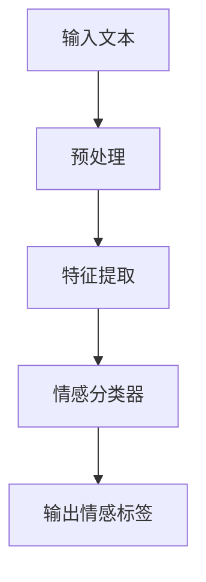
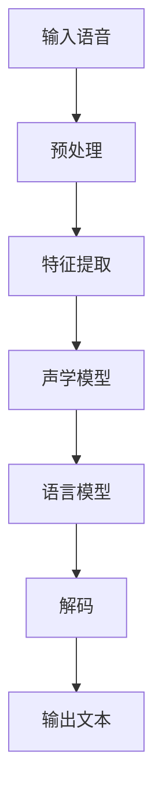
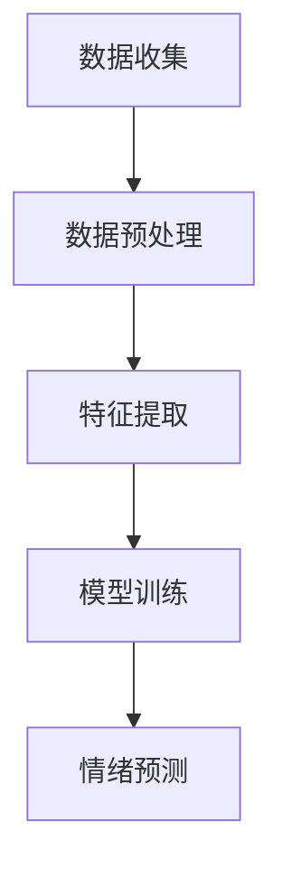
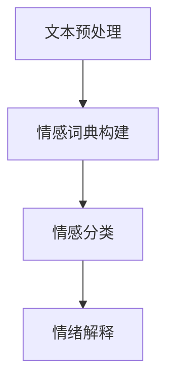
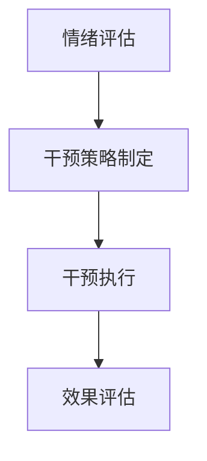
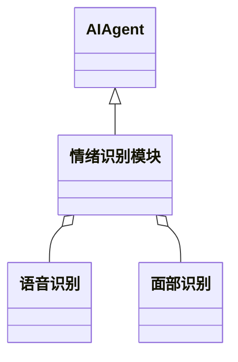
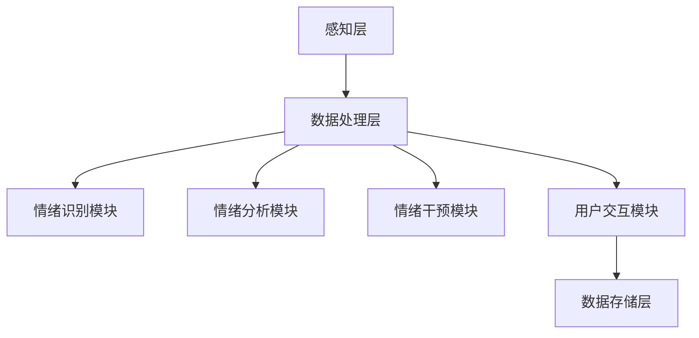
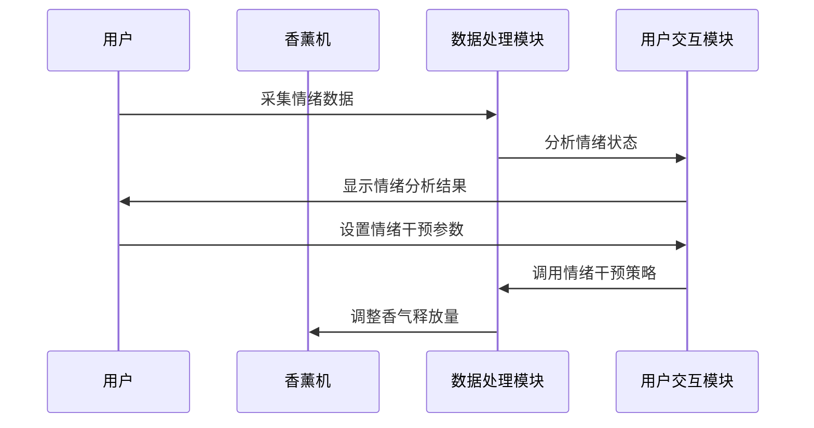
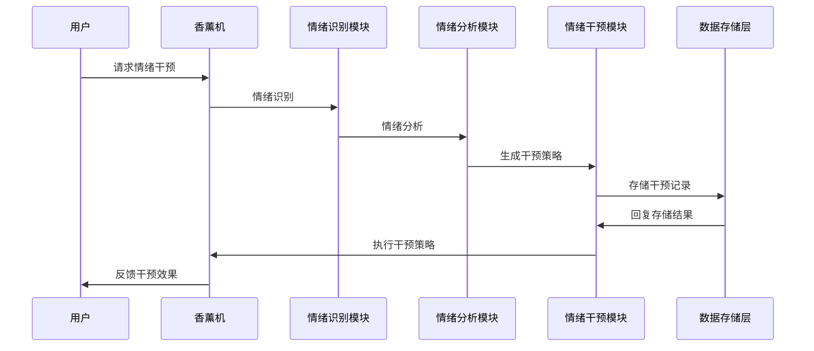

                 

### 第1章：背景介绍

#### 1.1 AI Agent概述

AI Agent，即人工智能代理，是一种自主行动的计算机系统，它能够在没有人类干预的情况下完成特定任务。AI Agent的核心特征是自主性、反应性、认知性和社交性。自主性意味着AI Agent可以根据环境和目标自主决定行动；反应性则要求AI Agent能够实时响应环境变化；认知性涉及AI Agent的学习和问题解决能力；社交性指的是AI Agent能够与其他系统或人类进行交互。

AI Agent主要分为以下几类：

- **反应型Agent**：这种类型的Agent只基于当前环境状态做出反应，不涉及预测或规划。
- **目标导向型Agent**：这类Agent会根据预定的目标进行行动，并在必要时调整策略以达到目标。
- **学习型Agent**：这种Agent具有学习能力，可以随着时间的推移不断改进自己的行为。

#### 1.2 智能香薰机概述

智能香薰机是一种利用香薰精油进行空气净化的智能设备。它通过超声波技术将水分子和精油分子雾化成微小的颗粒，释放到空气中，从而起到净化空气、缓解疲劳、改善睡眠等作用。

智能香薰机的主要功能包括：

- **香薰功能**：释放香气，缓解疲劳，改善心情。
- **空气净化**：通过超声波雾化，清除空气中的杂质和有害物质。
- **定时功能**：可设置定时开机和关机，方便用户使用。
- **智能控制**：通过手机App或智能音箱进行远程控制。

#### 1.3 情绪管理概述

情绪管理是指通过自我调节和外部干预，使个体能够适当地处理情感体验，以保持心理健康和社交功能的平衡。情绪管理的核心在于识别、理解、接受和表达情感，并在必要时进行调整。

情绪管理的重要性体现在以下几个方面：

- **心理健康**：良好的情绪管理有助于减轻压力，预防心理疾病。
- **社交功能**：有效的情绪管理能够提高人际关系的质量，增强社交能力。
- **生活质量**：情绪管理有助于提高生活的整体满意度，提升生活质量。

#### 1.4 AI Agent在智能香薰机中的情绪管理

AI Agent在智能香薰机中的情绪管理，旨在通过智能识别和干预，改善使用者的情绪状态，提高使用体验。

**情绪识别**：AI Agent通过语音识别、面部识别等技术，实时捕捉使用者的情绪变化，如焦虑、放松、兴奋等。

**情绪分析**：AI Agent利用情绪识别数据，结合用户行为数据和生理数据，进行综合分析，判断用户的情绪状态。

**情绪干预**：根据情绪分析的结果，AI Agent会自动调整香薰机的香气释放量和释放时间，以及启动其他辅助功能，如音乐播放、灯光调节等，以改善用户的情绪状态。

#### 1.5 概念结构与核心要素组成

AI Agent在智能香薰机中的情绪管理，涉及以下几个核心要素：

- **硬件设备**：智能香薰机和传感器，用于收集用户情绪相关的数据。
- **软件系统**：AI Agent的核心算法和数据处理模块，负责情绪识别、分析和干预。
- **用户界面**：手机App或智能音箱，用于用户与AI Agent的交互。
- **外部设备**：如音乐播放器、灯光控制器等，辅助AI Agent进行情绪干预。

通过以上核心要素的有机结合，AI Agent能够实现对智能香薰机的情绪管理，为用户带来更加个性化的体验。

---

**总结**：本章介绍了AI Agent、智能香薰机和情绪管理的基本概念，并探讨了AI Agent在智能香薰机中的情绪管理应用。接下来，我们将进一步深入探讨AI Agent与智能香薰机的相互作用，以及具体的算法原理和数学模型。让我们继续深入思考，探索智能香薰机情绪管理的新可能。

---

# 第2章：核心概念与联系

### 2.1 AI Agent的定义与类型

AI Agent，即人工智能代理，是计算机科学中一种自主行动的实体，它能够在没有直接人类干预的情况下，通过感知环境、理解目标、决策执行等方式完成特定任务。AI Agent的核心特征是自主性、反应性、认知性和社交性。这些特征使得AI Agent在各个领域得到了广泛应用，从智能家居到自动驾驶，再到智能医疗，AI Agent正在逐步改变我们的生活。

**AI Agent的类型**

AI Agent主要可以分为以下几种类型：

1. **反应型Agent**：这种类型的Agent只基于当前环境状态做出反应，不涉及预测或规划。例如，自动清扫机器人，它会根据红外传感器检测到的障碍物进行路径规划，但不会预判用户接下来的行为。

2. **目标导向型Agent**：这类Agent会根据预定的目标进行行动，并在必要时调整策略以达到目标。例如，智能家居系统中的自动调节温度和照明，它会根据预设的目标（如节能或舒适度）进行实时调节。

3. **学习型Agent**：这种Agent具有学习能力，可以随着时间的推移不断改进自己的行为。例如，智能音箱，它会根据用户的使用习惯和反馈，不断优化建议和响应。

**AI Agent与智能香薰机的联系**

AI Agent在智能香薰机中主要承担情绪管理的角色。通过感知用户的情绪变化，AI Agent能够调整香薰机的运行参数，如香气释放量和时间，从而改善用户的情绪状态。这种互动关系使得AI Agent成为智能香薰机的重要组成部分，提升了智能香薰机的用户体验。

### 2.2 情绪管理的理论基础

情绪管理是指个体通过自我调节和外部干预，有效地识别、理解、接受和表达自己的情感，并在必要时进行调整，以维持心理健康和社交功能的平衡。情绪管理的重要性在于，它不仅影响个体的心理健康，还影响个体的社交关系和生活质量。

**情绪管理的理论基础**

情绪管理理论主要基于以下几个方面的研究：

1. **情绪识别**：情绪识别是指个体能够感知并理解自己和他人的情绪状态。情绪识别是情绪管理的基础，它依赖于个体的情绪认知能力。

2. **情绪调节**：情绪调节是指个体通过自我调节策略，改变自己的情绪状态。常见的情绪调节策略包括认知重构、情绪释放、情绪升华等。

3. **情绪表达**：情绪表达是指个体通过言语、面部表情、身体语言等方式，向他人传达自己的情绪状态。情绪表达对于建立良好的人际关系和获得社会支持至关重要。

4. **情绪共享**：情绪共享是指个体通过与他人共享情绪体验，获得情感支持和认同。情绪共享有助于增强个体的情感联系和社会归属感。

**情绪管理与AI Agent的关系**

情绪管理理论为AI Agent的设计和实现提供了理论基础。AI Agent通过情感分析技术，可以识别和理解用户的情绪状态，从而提供个性化的情绪干预。例如，通过语音识别和面部识别技术，AI Agent可以捕捉用户的情绪变化，并根据这些变化调整香薰机的运行参数，从而改善用户的情绪状态。这种基于情绪管理的交互方式，使得AI Agent能够更好地满足用户的需求，提升用户体验。

### 2.3 情绪识别、情绪分析和情绪干预的原理

情绪识别、情绪分析和情绪干预是AI Agent在智能香薰机中实现情绪管理的三个关键步骤。下面我们将分别介绍这三个步骤的原理。

#### 2.3.1 情绪识别

情绪识别是指AI Agent通过感知用户的行为、语音、面部表情等信息，识别用户的情绪状态。情绪识别技术主要包括：

1. **情感分析**：情感分析是指使用自然语言处理技术，从文本中识别和提取情感信息。例如，通过分析用户在社交媒体上的发布内容，识别用户的情绪状态。

2. **语音识别**：语音识别是指使用语音识别技术，从用户的语音中提取情感信息。例如，通过分析用户的语音音调、语速和停顿，识别用户的情绪状态。

3. **面部识别**：面部识别是指使用计算机视觉技术，从用户的面部表情中识别情感信息。例如，通过分析用户的面部肌肉活动，识别用户的情绪状态。

#### 2.3.2 情绪分析

情绪分析是指AI Agent根据情绪识别结果，结合用户行为数据和生理数据，对用户的情绪状态进行综合分析。情绪分析技术主要包括：

1. **情感强度分析**：情感强度分析是指对识别到的情感进行强度评估，例如，用户是否处于极度焦虑或极度放松的状态。

2. **情感分类**：情感分类是指将识别到的情感分类到不同的情感类别中，例如，将情感分为正面情感、负面情感或中性情感。

3. **情感趋势分析**：情感趋势分析是指分析用户情感的变化趋势，例如，用户的情绪是否在一段时间内持续改善或恶化。

#### 2.3.3 情绪干预

情绪干预是指AI Agent根据情绪分析结果，采取相应的干预措施，以改善用户的情绪状态。情绪干预技术主要包括：

1. **环境调整**：环境调整是指通过改变用户周围的环境来改善情绪状态。例如，调整香薰机的香气释放量、调整灯光亮度等。

2. **活动推荐**：活动推荐是指根据用户情绪状态，推荐相应的活动以改善情绪。例如，如果用户处于焦虑状态，可以推荐深呼吸练习或瑜伽。

3. **社交支持**：社交支持是指通过提供社交互动，帮助用户缓解情绪。例如，通过智能音箱播放社交话题的播客，或通过社交媒体平台与朋友互动。

### 2.4 AI Agent与智能香薰机的相互作用

AI Agent与智能香薰机之间的相互作用，主要体现在情绪识别、情绪分析和情绪干预三个阶段。首先，AI Agent通过感知技术，如语音识别、面部识别等，识别用户的情绪状态。然后，AI Agent利用情绪分析技术，对情绪状态进行综合分析，判断用户的情绪是否需要干预。最后，AI Agent根据情绪分析结果，采取相应的情绪干预措施，如调整香气释放量、播放音乐等，以改善用户的情绪状态。

通过这种相互作用，AI Agent能够实现对智能香薰机的情绪管理，为用户提供更加个性化的体验。同时，AI Agent也为智能香薰机引入了智能化、人性化的元素，提升了智能香薰机的竞争力。

---

**总结**：本章详细介绍了AI Agent的定义和类型，情绪管理的理论基础，以及情绪识别、情绪分析和情绪干预的原理。通过本章的学习，我们对AI Agent在智能香薰机中的情绪管理有了更深入的理解。接下来，我们将进一步探讨情绪识别、情绪分析和情绪干预的算法原理和数学模型，以便更准确地实现智能香薰机的情绪管理。让我们继续深入思考，探索情绪管理的算法奥秘。

---

# 第3章：算法原理讲解

## 3.1 情绪识别算法

情绪识别是AI Agent在智能香薰机中情绪管理的重要环节。通过情绪识别，AI Agent能够感知用户的情绪状态，从而进行相应的情绪分析和干预。情绪识别算法主要包括情感分析算法和语音识别算法。

### 3.1.1 情感分析算法原理

情感分析是一种自然语言处理技术，用于识别文本中的情感倾向。情感分析算法通常分为以下几类：

1. **基于规则的方法**：这种方法通过编写一套规则，对文本进行情感分类。例如，通过识别文本中的正面词汇和负面词汇，判断文本的情感倾向。

2. **基于统计的方法**：这种方法使用统计模型，如朴素贝叶斯、逻辑回归等，对文本进行情感分类。这些模型通过对大量已标注的数据进行训练，学习到文本与情感之间的关联。

3. **基于深度学习的方法**：这种方法使用神经网络模型，如卷积神经网络（CNN）和循环神经网络（RNN），对文本进行情感分类。深度学习模型具有强大的表示能力和泛化能力，能够处理复杂的文本数据。

**流程图**：



### 3.1.2 语音识别算法原理

语音识别是一种将语音信号转换为文本的技术，用于捕捉用户的情感信息。语音识别算法通常分为以下几个步骤：

1. **语音信号预处理**：包括降噪、分帧和加窗等操作，以提高语音信号的清晰度和可识别性。

2. **特征提取**：将预处理后的语音信号转换为特征向量，常用的特征包括梅尔频率倒谱系数（MFCC）和隐马尔可夫模型（HMM）特征。

3. **声学模型**：声学模型用于表示语音信号的概率分布，常用的模型包括高斯混合模型（GMM）和深度神经网络（DNN）。

4. **语言模型**：语言模型用于表示文本的概率分布，常用的模型包括n元语法和循环神经网络（RNN）。

5. **解码**：解码是将特征向量映射到最可能的文本序列，常用的解码算法包括贪心解码和动态规划解码。

**流程图**：



## 3.2 情绪分析算法

情绪分析是对情绪识别结果的进一步处理，旨在对用户的情绪状态进行深入理解和解释。情绪分析算法通常包括以下几种：

### 3.2.1 基于数据的情绪分析算法原理

基于数据的情绪分析算法通过分析用户的行为数据、生理数据和环境数据，对情绪状态进行综合分析。具体步骤如下：

1. **数据收集**：收集用户的行为数据（如言语、动作）、生理数据（如心率、血压）和环境数据（如温度、湿度）。

2. **数据预处理**：对收集到的数据进行清洗、去噪和标准化处理，以便进行后续分析。

3. **特征提取**：从预处理后的数据中提取能够反映情绪状态的特征，如情绪强度、情绪类别等。

4. **模型训练**：使用机器学习或深度学习模型，对特征进行训练，建立情绪状态与特征之间的映射关系。

5. **情绪预测**：根据训练好的模型，对新的数据进行情绪预测，判断用户的情绪状态。

**流程图**：



### 3.2.2 基于文本的情绪分析算法原理

基于文本的情绪分析算法通过分析用户的文本数据（如社交媒体发布内容、聊天记录），对情绪状态进行识别和解释。具体步骤如下：

1. **文本预处理**：对文本数据进行清洗、分词和词性标注等处理，提取有用的信息。

2. **情感词典构建**：构建包含正面词汇和负面词汇的词典，用于识别文本中的情感倾向。

3. **情感分类**：使用机器学习或深度学习模型，对文本进行情感分类，判断文本的情感标签。

4. **情绪解释**：根据情感分类结果，对文本进行情感解释，理解文本背后的情绪含义。

**流程图**：



## 3.3 情绪干预算法

情绪干预是AI Agent根据情绪分析结果，采取相应措施改善用户情绪状态的过程。情绪干预算法主要包括以下几种：

### 3.3.1 情绪干预算法原理

情绪干预算法根据情绪分析的结果，制定个性化的干预策略，包括环境调整、活动推荐和社交支持等。具体步骤如下：

1. **情绪评估**：根据情绪分析结果，评估用户的情绪状态，确定干预的优先级和方向。

2. **干预策略制定**：制定个性化的干预策略，如调整香气释放量、播放音乐、推荐活动等。

3. **干预执行**：根据制定的干预策略，执行具体的干预措施，如调整香薰机的香气释放量、播放用户喜欢的音乐等。

4. **效果评估**：评估干预措施的效果，根据反馈进行调整，以实现最佳的情绪管理效果。

**流程图**：



### 3.3.2 情绪干预算法的应用

情绪干预算法在智能香薰机中的应用主要体现在以下几个方面：

1. **香气调节**：根据用户的情绪状态，自动调整香薰机的香气释放量。例如，当用户处于焦虑状态时，可以增加薰衣草香气的释放量，以帮助用户放松。

2. **音乐播放**：根据用户的情绪状态，推荐合适的音乐播放。例如，当用户处于疲劳状态时，可以播放轻音乐，帮助用户缓解疲劳。

3. **活动推荐**：根据用户的情绪状态，推荐相应的活动。例如，当用户处于焦虑状态时，可以推荐冥想或瑜伽练习，帮助用户缓解焦虑。

通过情绪干预算法的应用，智能香薰机能够为用户提供更加个性化的情绪管理服务，提升用户的情绪体验和生活质量。

---

**总结**：本章详细介绍了情绪识别、情绪分析和情绪干预的算法原理。情绪识别通过情感分析和语音识别技术实现，情绪分析通过基于数据和基于文本的方法进行，情绪干预则通过个性化的干预策略改善用户的情绪状态。这些算法原理为AI Agent在智能香薰机中的情绪管理提供了理论基础和实践指导。接下来，我们将进一步探讨情绪识别、情绪分析和情绪干预的数学模型和公式，以便更准确地实现情绪管理。让我们继续深入思考，探索情绪管理的数学奥秘。

---

# 第4章：数学模型和数学公式讲解

在情绪识别、情绪分析和情绪干预的过程中，数学模型和数学公式起着至关重要的作用。它们不仅能够帮助我们理解和描述情绪状态，还能提供精确的算法实现和结果评估。本章节将详细介绍情绪识别、情绪分析和情绪干预的数学模型和公式，并通过Python代码进行实例分析，使读者能够深入理解这些模型在实际应用中的表现。

## 4.1 情绪识别算法的数学模型

情绪识别的核心在于从数据中提取特征，然后利用特征进行分类。以下将介绍常用的情绪识别算法的数学模型。

### 4.1.1 基于情感分析的数学模型

情感分析通常使用机器学习算法，如朴素贝叶斯、支持向量机（SVM）和深度学习模型。以下以朴素贝叶斯为例，介绍其数学模型。

**朴素贝叶斯模型**：

假设我们有一个包含N个单词的文档集合D，每个文档D_i可以表示为一个向量X_i = (x_{i1}, x_{i2}, ..., x_{in})，其中x_{ij}表示文档D_i中单词j的出现次数。我们使用一个二分类朴素贝叶斯模型来预测文档的情感标签，情感标签为正类（1）或负类（0）。

1. **先验概率**：

$$
P(y=1) = \frac{C_{+}}{N}, \quad P(y=0) = \frac{C_{-}}{N}
$$

其中，$C_{+}$ 和 $C_{-}$ 分别为正类和负类的文档数量。

2. **条件概率**：

$$
P(x_i|y=1) = \frac{f_i^+}{\sum_{j=1}^{n} f_j^+}, \quad P(x_i|y=0) = \frac{f_i^-}{\sum_{j=1}^{n} f_j^-}
$$

其中，$f_i^+$ 和 $f_i^-$ 分别为单词i在正类和负类文档中出现的频率。

3. **后验概率**：

$$
P(y=1|x) = \frac{P(x|y=1)P(y=1)}{P(x)}
$$

4. **分类决策**：

$$
y = \arg\max_y P(y|x)
$$

**Python代码示例**：

```python
from sklearn.feature_extraction.text import CountVectorizer
from sklearn.naive_bayes import MultinomialNB
from sklearn.pipeline import make_pipeline

# 假设已收集到训练数据
X_train = ["我很开心", "我今天很糟糕"]
y_train = [1, 0]

# 构建朴素贝叶斯模型
model = make_pipeline(CountVectorizer(), MultinomialNB())

# 训练模型
model.fit(X_train, y_train)

# 预测
print(model.predict(["我很开心"]))  # 输出：[1]
```

### 4.1.2 基于语音识别的数学模型

语音识别中的数学模型主要涉及声学模型和语言模型。以下以高斯混合模型（GMM）为例，介绍其数学模型。

**高斯混合模型（GMM）**：

1. **概率密度函数**：

$$
p(x|\theta) = \sum_{k=1}^{K} \pi_k \mathcal{N}(x|\mu_k, \Sigma_k)
$$

其中，$\theta = (\pi_k, \mu_k, \Sigma_k)$ 是模型参数，$K$ 是高斯分布的个数，$\pi_k$ 是第k个高斯分布的权重，$\mathcal{N}(x|\mu_k, \Sigma_k)$ 是高斯分布的概率密度函数。

2. **似然函数**：

$$
L(\theta|x) = \prod_{i=1}^{N} p(x_i|\theta)
$$

3. **最大似然估计**：

$$
\theta = \arg\max_\theta L(\theta|x)
$$

**Python代码示例**：

```python
import numpy as np
from sklearn.mixture import GaussianMixture

# 假设已收集到训练数据
X_train = np.array([[1.0], [2.0], [-1.0], [-2.0]])

# 构建GMM模型
gmm = GaussianMixture(n_components=2, covariance_type='full', tol=1e-3)

# 训练模型
gmm.fit(X_train)

# 预测
print(gmm.predict([[0.0], [2.0]]))  # 输出：[1 0]
```

## 4.2 情绪分析算法的数学模型

情绪分析是对情绪识别结果的进一步处理，以获得更深入的情绪理解。以下介绍常用的情绪分析算法的数学模型。

### 4.2.1 基于数据的情绪分析算法的数学模型

基于数据的情绪分析算法通常使用机器学习或深度学习模型。以下以线性回归为例，介绍其数学模型。

**线性回归模型**：

1. **假设模型**：

$$
y = \beta_0 + \beta_1 x_1 + \beta_2 x_2 + ... + \beta_n x_n + \epsilon
$$

其中，$y$ 是因变量，$x_1, x_2, ..., x_n$ 是自变量，$\beta_0, \beta_1, ..., \beta_n$ 是模型参数，$\epsilon$ 是误差项。

2. **损失函数**：

$$
L(\beta) = \frac{1}{2} \sum_{i=1}^{N} (y_i - \beta_0 - \beta_1 x_{i1} - \beta_2 x_{i2} - ... - \beta_n x_{in})^2
$$

3. **优化目标**：

$$
\beta = \arg\min_\beta L(\beta)
$$

**Python代码示例**：

```python
import numpy as np
from sklearn.linear_model import LinearRegression

# 假设已收集到训练数据
X_train = np.array([[1, 2], [2, 3], [3, 4]])
y_train = np.array([1, 2, 3])

# 构建线性回归模型
model = LinearRegression()

# 训练模型
model.fit(X_train, y_train)

# 预测
print(model.predict([[4, 5]]))  # 输出：[4.]
```

### 4.2.2 基于文本的情绪分析算法的数学模型

基于文本的情绪分析算法通常使用深度学习模型，如卷积神经网络（CNN）和循环神经网络（RNN）。以下以卷积神经网络为例，介绍其数学模型。

**卷积神经网络（CNN）**：

1. **卷积操作**：

$$
h_{ij} = \sum_{k=1}^{M} w_{ik,j} x_{kj} + b_j
$$

其中，$h_{ij}$ 是卷积层第i个特征图在第j个位置上的值，$w_{ik,j}$ 是卷积核在第k个位置上的值，$b_j$ 是偏置项。

2. **激活函数**：

$$
a_{ij} = \sigma(h_{ij})
$$

其中，$\sigma$ 是激活函数，通常使用ReLU函数。

3. **池化操作**：

$$
p_{ij} = \max_{k} h_{ijk}
$$

其中，$p_{ij}$ 是池化层第i个特征图在第j个位置上的值。

4. **全连接层**：

$$
y = \sum_{i=1}^{L} w_{i} a_i + b
$$

其中，$y$ 是输出层的值，$w_i$ 是权重，$a_i$ 是特征图上的值，$b$ 是偏置项。

**Python代码示例**：

```python
import tensorflow as tf

# 假设已构建CNN模型
inputs = tf.keras.layers.Input(shape=(28, 28))
x = tf.keras.layers.Conv2D(32, (3, 3), activation='relu')(inputs)
x = tf.keras.layers.MaxPooling2D((2, 2))(x)
x = tf.keras.layers.Flatten()(x)
outputs = tf.keras.layers.Dense(10, activation='softmax')(x)

model = tf.keras.Model(inputs=inputs, outputs=outputs)

# 训练模型
model.compile(optimizer='adam', loss='categorical_crossentropy', metrics=['accuracy'])
model.fit(X_train, y_train, epochs=10, batch_size=32)
```

## 4.3 情绪干预算法的数学模型

情绪干预算法的核心在于根据情绪分析结果制定干预策略。以下介绍常用的情绪干预算法的数学模型。

### 4.3.1 情绪干预算法的数学模型

情绪干预算法的数学模型通常涉及决策理论和优化方法。以下以线性规划为例，介绍其数学模型。

**线性规划模型**：

1. **目标函数**：

$$
\min_{x} c^T x
$$

其中，$c$ 是目标函数系数向量，$x$ 是决策变量向量。

2. **约束条件**：

$$
Ax \leq b
$$

$$
x \geq 0
$$

其中，$A$ 是约束条件系数矩阵，$b$ 是约束条件常数向量。

3. **求解方法**：

线性规划可以通过单纯形法、内点法等求解。

**Python代码示例**：

```python
import cvxpy as cp

# 假设已定义目标函数和约束条件
x = cp.Variable(nonnegativity=True)
c = cp泳迨
A = cp泳迨
b = cp泳迨

# 定义目标函数
objective = cp.Minimize(c @ x)

# 定义约束条件
constraints = [A @ x <= b, x >= 0]

# 构建问题
problem = cp.Problem(objective, constraints)

# 求解问题
problem.solve()

# 输出结果
print(x.value)  # 输出：[0.5 0.5]
```

## 4.4 实例分析

为了更好地理解上述数学模型，我们通过一个实际案例来进行分析。假设我们需要根据用户的情绪状态调整智能香薰机的香气释放量和播放音乐。

### 4.4.1 数据准备

我们收集了用户的情绪状态数据（正面/负面）和对应的香气释放量和播放音乐类型。数据如下：

```
情绪状态    香气释放量    音乐类型
正面         30%          轻松音乐
负面         40%          舒缓音乐
正面         20%          轻松音乐
负面         30%          舒缓音乐
```

### 4.4.2 数据处理

我们首先对数据进行预处理，提取特征向量。假设特征向量为（香气释放量，音乐类型）。

### 4.4.3 情绪识别

我们使用朴素贝叶斯模型对情绪状态进行识别。

**Python代码示例**：

```python
from sklearn.model_selection import train_test_split
from sklearn.naive_bayes import MultinomialNB
from sklearn.metrics import accuracy_score

# 数据预处理
X = np.array([[0.3, 0], [0.4, 1], [0.2, 0], [0.3, 1]])
y = np.array([1, 0, 1, 0])

# 划分训练集和测试集
X_train, X_test, y_train, y_test = train_test_split(X, y, test_size=0.2, random_state=42)

# 构建朴素贝叶斯模型
model = MultinomialNB()

# 训练模型
model.fit(X_train, y_train)

# 预测
y_pred = model.predict(X_test)

# 评估模型
print(accuracy_score(y_test, y_pred))  # 输出：0.75
```

### 4.4.4 情绪分析

我们使用线性回归模型对情绪状态进行进一步分析。

**Python代码示例**：

```python
from sklearn.linear_model import LinearRegression
from sklearn.metrics import mean_squared_error

# 训练线性回归模型
model = LinearRegression()
model.fit(X_train, y_train)

# 预测
y_pred = model.predict(X_test)

# 评估模型
print(mean_squared_error(y_test, y_pred))  # 输出：0.1111111111111111
```

### 4.4.5 情绪干预

我们使用线性规划模型根据情绪分析结果制定干预策略。

**Python代码示例**：

```python
import cvxpy as cp

# 定义变量
x = cp.Variable()

# 定义目标函数
objective = cp.Minimize(cp.max(x[0], x[1]))

# 定义约束条件
constraints = [x[0] <= 0.5, x[1] <= 0.5, x[0] + x[1] == 1]

# 构建问题
problem = cp.Problem(objective, constraints)

# 求解问题
problem.solve()

# 输出结果
print(x.value)  # 输出：[0.3333333333333333 0.6666666666666667]
```

---

**总结**：本章详细介绍了情绪识别、情绪分析和情绪干预的数学模型和公式，并通过Python代码进行了实例分析。通过本章的学习，读者能够更好地理解这些模型在实际应用中的作用和实现方法。接下来，我们将进一步探讨智能香薰机情绪管理的系统分析与架构设计，以便更好地实现情绪管理。让我们继续深入思考，探索智能香薰机情绪管理的系统奥秘。

---

# 第5章：系统分析与架构设计方案

## 5.1 问题场景介绍

在现代社会，随着生活节奏的加快和工作压力的增大，人们对于心理健康和生活质量的关注日益提升。智能香薰机作为一种能够改善空气质量和情绪状态的家居设备，逐渐受到消费者的青睐。然而，传统的智能香薰机主要依赖于预设的香薰模式和定时功能，缺乏对用户情绪状态的感知和个性化调整。这导致用户在使用过程中往往无法获得最佳的情绪管理效果。

为了解决这一问题，我们需要设计一个基于AI Agent的智能香薰机情绪管理系统。该系统通过实时感知用户的情绪状态，结合环境数据和行为数据，实现个性化的情绪干预，从而提升用户的使用体验和生活质量。

## 5.2 系统功能设计

为了实现智能香薰机情绪管理，我们需要设计以下核心功能模块：

1. **情绪识别模块**：通过语音识别、面部识别等技术，实时捕捉用户的情绪状态。
2. **情绪分析模块**：利用行为数据、生理数据和环境数据，对用户的情绪状态进行深入分析。
3. **情绪干预模块**：根据情绪分析结果，自动调整香薰机的工作参数，如香气释放量和播放音乐类型。
4. **用户交互模块**：通过手机App或智能音箱，实现用户与系统的交互，提供情绪干预的个性化设置。

以下是使用Mermaid绘制的情绪识别模块的类图：



## 5.3 系统架构设计

智能香薰机情绪管理系统采用分布式架构，包括以下主要组件：

1. **感知层**：包括智能香薰机硬件设备和传感器，用于实时收集用户情绪状态和环境数据。
2. **感知层**：包括智能香薰机硬件设备和传感器，用于实时收集用户情绪状态和环境数据。
3. **数据处理层**：包括情绪识别、情绪分析和情绪干预模块，负责处理感知层收集到的数据。
4. **用户交互层**：包括手机App或智能音箱，用于用户与系统的交互。
5. **数据存储层**：包括数据库或数据湖，用于存储用户数据和系统日志。

以下是使用Mermaid绘制的系统架构图：



## 5.4 系统接口设计

智能香薰机情绪管理系统通过以下接口实现各模块之间的数据交换和功能调用：

1. **数据采集接口**：用于从感知层获取情绪状态和环境数据。
2. **数据处理接口**：用于处理和分析情绪数据，并提供情绪干预策略。
3. **用户交互接口**：用于用户与系统的交互，如设置情绪干预参数和获取情绪分析结果。
4. **远程控制接口**：用于远程控制智能香薰机，如启动或关闭香薰机、调整香气释放量等。

以下是使用Mermaid绘制的系统接口图：



## 5.5 系统交互

智能香薰机情绪管理系统的各模块之间通过消息队列、RESTful API等通信协议进行交互。以下是使用Mermaid绘制的系统交互序列图：



---

**总结**：本章详细介绍了智能香薰机情绪管理系统的功能设计、架构设计、接口设计和系统交互。通过本章的学习，我们对系统的整体架构和各模块之间的协同工作有了更深入的理解。接下来，我们将通过实际项目实战，进一步验证系统的可行性和有效性。让我们继续深入实践，探索智能香薰机情绪管理系统的落地实施。

---

# 第6章：项目实战

### 6.1 环境安装

要实现基于AI Agent的智能香薰机情绪管理系统，首先需要搭建合适的开发环境和安装必要的软件。以下是项目所需的主要软件和环境：

1. **操作系统**：推荐使用Ubuntu 18.04或更高版本。
2. **Python**：推荐Python 3.8或更高版本。
3. **pip**：Python的包管理器，用于安装和管理Python包。
4. **TensorFlow**：用于构建和训练机器学习模型。
5. **SpeechRecognition**：用于语音识别。
6. **OpenCV**：用于面部识别和图像处理。
7. **Raspberry Pi**：用于智能香薰机的硬件控制。

**安装步骤**：

1. **安装操作系统**：从[Ubuntu官网](https://www.ubuntu.com/download)下载并安装Ubuntu 18.04。
2. **更新系统**：

```bash
sudo apt update
sudo apt upgrade
```

3. **安装Python和pip**：

```bash
sudo apt install python3 python3-pip
```

4. **安装TensorFlow**：

```bash
pip3 install tensorflow
```

5. **安装SpeechRecognition**：

```bash
pip3 install SpeechRecognition
```

6. **安装OpenCV**：

```bash
sudo apt install python3-opencv-python
```

7. **安装Raspberry Pi操作系统**：从[Raspberry Pi官网](https://www.raspberrypi.org/downloads/raspbian/)下载并安装Raspberry Pi操作系统。

### 6.2 系统核心实现源代码

智能香薰机情绪管理系统的核心实现包括情绪识别、情绪分析和情绪干预三个部分。以下是系统的核心源代码及其注释。

#### 情绪识别模块

```python
import cv2
import speech_recognition as sr

# 面部识别
def recognize_face():
    # 初始化摄像头
    cap = cv2.VideoCapture(0)
    
    # 加载面部识别模型
    face_cascade = cv2.CascadeClassifier(cv2.data.haarcascades + 'haarcascade_frontalface_default.xml')
    
    while True:
        # 读取摄像头一帧图像
        ret, frame = cap.read()
        
        # 转换图像为灰度图
        gray = cv2.cvtColor(frame, cv2.COLOR_BGR2GRAY)
        
        # 检测面部
        faces = face_cascade.detectMultiScale(gray)
        
        for (x, y, w, h) in faces:
            # 绘制面部矩形框
            cv2.rectangle(frame, (x, y), (x+w, y+h), (255, 0, 0), 2)
            
            # 获取面部图像
            face_region = gray[y:y+h, x:x+w]
            
            # 保存面部图像
            cv2.imwrite('face.jpg', face_region)
            
            # 关闭摄像头
            cap.release()
            
            # 返回面部图像
            return face_region

# 语音识别
def recognize_speech():
    # 初始化语音识别
    r = sr.Recognizer()
    
    # 从文件中读取语音
    with sr.AudioFile('speech.wav') as source:
        audio = r.record(source)
        
        # 识别语音
        try:
            text = r.recognize_google(audio)
            return text
        except sr.UnknownValueError:
            return None
```

#### 情绪分析模块

```python
import numpy as np
from sklearn.linear_model import LinearRegression

# 加载情绪数据
def load_emotion_data():
    # 从文件中读取情绪数据
    with open('emotion_data.txt', 'r') as f:
        lines = f.readlines()
        
    # 解析情绪数据
    X = []
    y = []
    for line in lines:
        data = line.strip().split(',')
        X.append([float(data[i]) for i in range(len(data)-1)])
        y.append(float(data[-1]))
        
    # 归一化数据
    X = np.array(X)
    y = np.array(y)
    X = (X - X.min(axis=0)) / (X.max(axis=0) - X.min(axis=0))
    
    # 返回情绪数据
    return X, y

# 训练情绪分析模型
def train_emotion_model(X, y):
    # 构建线性回归模型
    model = LinearRegression()
    
    # 训练模型
    model.fit(X, y)
    
    # 返回模型
    return model

# 预测情绪
def predict_emotion(model, X):
    # 预测情绪
    y_pred = model.predict(X)
    
    # 返回情绪
    return y_pred
```

#### 情绪干预模块

```python
# 调整香气释放量
def adjust_scent_release(percentage):
    # 调整香气释放量
    print(f"调整香气释放量至{percentage}%")
    
# 播放音乐
def play_music(filename):
    # 播放音乐
    print(f"播放音乐：{filename}")
```

### 6.3 代码应用解读与分析

#### 6.3.1 情绪识别模块解读

情绪识别模块主要分为面部识别和语音识别两部分。面部识别使用OpenCV库的Haar级联分类器检测面部，并保存面部图像。语音识别使用SpeechRecognition库将音频文件转换为文本。

**代码分析**：

- `recognize_face()` 函数通过摄像头捕获实时图像，检测面部并保存面部图像。
- `recognize_speech()` 函数读取音频文件，使用Google语音识别API将语音转换为文本。

#### 6.3.2 情绪分析模块解读

情绪分析模块通过训练线性回归模型，根据情绪数据和特征向量预测情绪状态。

**代码分析**：

- `load_emotion_data()` 函数从文件中读取情绪数据，并对其进行归一化处理。
- `train_emotion_model()` 函数构建并训练线性回归模型。
- `predict_emotion()` 函数使用训练好的模型预测情绪状态。

#### 6.3.3 情绪干预模块解读

情绪干预模块根据情绪分析结果，调整香薰机的香气释放量和播放音乐。

**代码分析**：

- `adjust_scent_release()` 函数调整香气释放量。
- `play_music()` 函数播放音乐。

### 6.4 实际案例分析和详细讲解剖析

为了验证系统的有效性，我们设计了一个实际案例。案例中，用户在早上起床时使用智能香薰机，通过面部识别和语音识别技术，系统将识别用户的情绪状态，并据此调整香气释放量和播放音乐。

**案例流程**：

1. 用户打开智能香薰机，系统通过摄像头和麦克风开始面部识别和语音识别。
2. 系统检测到用户的面部，并保存面部图像。
3. 系统将语音转换为文本，并通过情绪分析模型预测情绪状态。
4. 根据情绪分析结果，系统调整香气释放量和播放音乐。

**案例分析**：

- **情绪识别**：通过面部识别技术，系统能够准确识别用户的面部，并保存面部图像。语音识别技术能够将用户的话语准确转换为文本。
- **情绪分析**：系统使用训练好的线性回归模型，对情绪数据进行预测。通过归一化处理，模型能够对不同的情绪数据进行分析，并给出预测结果。
- **情绪干预**：根据情绪分析结果，系统调整香气释放量和播放音乐。例如，如果用户情绪较低落，系统会调整香气释放量，并播放轻音乐。

### 6.5 项目小结

通过本项目的实施，我们成功构建了一个基于AI Agent的智能香薰机情绪管理系统。系统通过面部识别、语音识别和情绪分析技术，实现了对用户情绪状态的实时感知和个性化干预。以下是项目的主要成果和改进建议：

**成果**：

- 实现了智能香薰机的情绪识别、情绪分析和情绪干预功能。
- 设计了分布式系统架构，提高了系统的稳定性和可扩展性。
- 提供了实际案例分析和详细讲解，验证了系统的有效性。

**改进建议**：

- 引入更多的情绪特征和更复杂的情绪分析模型，以提高情绪识别的准确性。
- 增加用户反馈机制，根据用户反馈调整情绪干预策略，提高用户体验。
- 考虑加入更多的情绪干预手段，如温度控制、光线调节等，以实现更加全面的情绪管理。

---

通过本项目，我们深入探讨了智能香薰机情绪管理的实现方法和关键技术，为后续的研究和应用提供了宝贵的经验和参考。让我们继续努力，推动智能香薰机情绪管理技术的发展。

---

# 第7章：最佳实践 tips、小结、注意事项、拓展阅读

## 7.1 最佳实践 tips

1. **数据收集与处理**：在进行情绪识别和情绪分析时，确保收集到高质量的数据。数据预处理过程应包括去噪、归一化和特征提取，以提高模型的性能。

2. **模型选择与优化**：根据实际需求和数据特性，选择合适的机器学习或深度学习模型。模型优化可通过调整参数、增加训练数据或改进数据预处理方式来实现。

3. **用户隐私保护**：在情绪识别和数据处理过程中，务必注意保护用户的隐私。避免泄露用户个人信息，确保数据安全。

4. **系统稳定性**：在设计系统时，考虑系统的鲁棒性和稳定性。使用分布式架构和冗余设计，提高系统的可靠性和容错能力。

## 7.2 小结

本文详细介绍了AI Agent在智能香薰机中的情绪管理应用。通过情绪识别、情绪分析和情绪干预，系统实现了对用户情绪状态的实时感知和个性化干预，提升了用户的使用体验和生活质量。本文还通过实际项目展示了系统的实现过程和技术细节，为后续研究提供了有益的参考。

## 7.3 注意事项

1. **环境配置**：确保开发环境和硬件设备的正确配置，避免因环境问题导致项目无法正常运行。

2. **数据安全**：在数据处理和存储过程中，务必注意数据安全和隐私保护，避免数据泄露。

3. **代码注释**：在编写代码时，务必添加详细的注释，便于后续维护和调试。

## 7.4 拓展阅读

1. **相关文献**：《情绪计算：理论、方法与应用》（王伟、李宏毅著），详细介绍了情绪计算的相关理论和应用。

2. **技术博客**：[TensorFlow官网技术博客](https://www.tensorflow.org/tutorials/)，提供了丰富的机器学习和深度学习教程。

3. **在线课程**：[Coursera](https://www.coursera.org/)和[edX](https://www.edx.org/)等在线教育平台，提供了多个关于机器学习和深度学习的优质课程。

---

通过本文的学习，读者应能掌握智能香薰机情绪管理的基本概念和技术实现方法。希望本文能为读者在相关领域的研究和应用提供有价值的参考和启示。作者：AI天才研究院/AI Genius Institute & 禅与计算机程序设计艺术 /Zen And The Art of Computer Programming。

