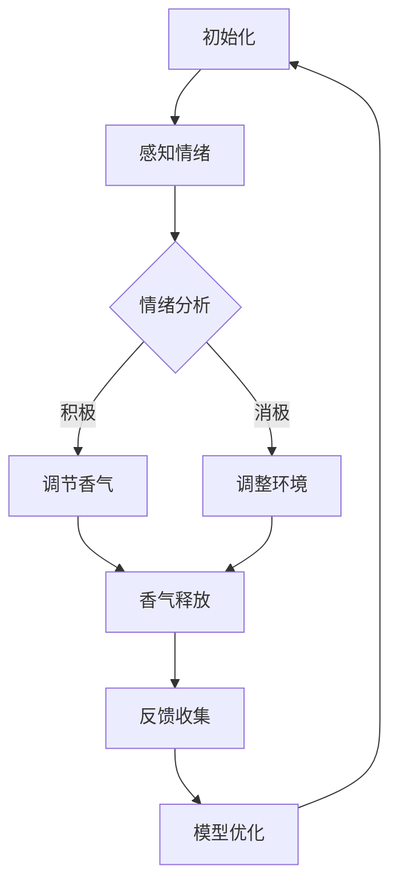
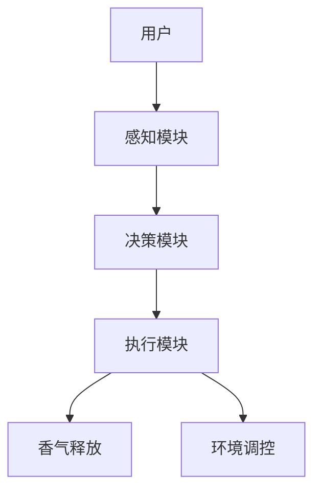
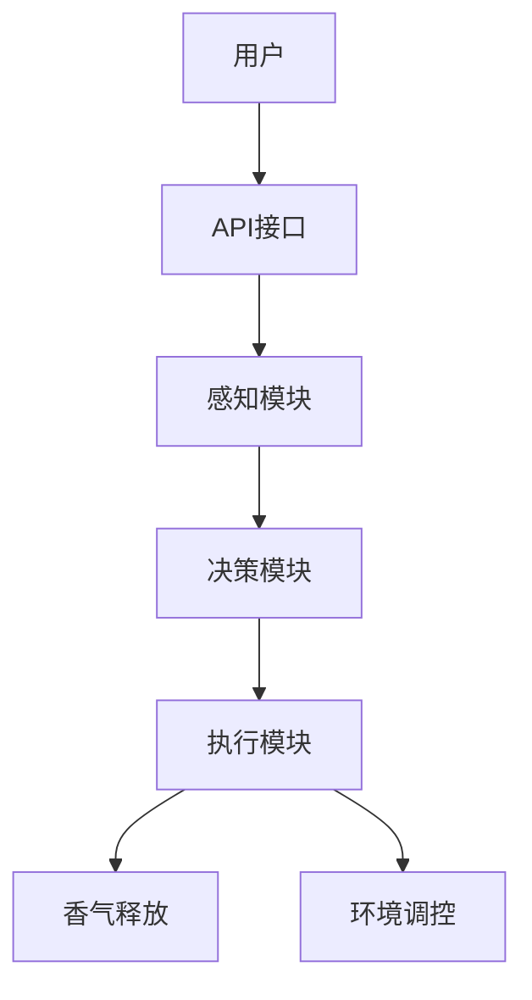

                 


# AI Agent在智能香薰机中的情绪调节功能

> 关键词：智能香薰机、AI Agent、情绪调节、算法设计、系统架构

> 摘要：
本文将深入探讨AI Agent在智能香薰机中情绪调节功能的设计与应用。首先，我们将介绍AI Agent的基本概念和角色，以及情绪调节在智能香薰机中的重要性。接着，我们将详细解析AI Agent在情绪调节中的核心概念、数学模型和算法设计。随后，我们将展开对智能香薰机系统的功能设计、架构设计以及接口与交互设计的讨论。最后，通过一个实际项目案例，我们将展示AI Agent在智能香薰机情绪调节功能中的具体应用，并提供一些最佳实践建议。

## 引言

### AI Agent概述

AI Agent，即人工智能代理，是一种能够感知环境、采取行动并与其他系统交互的智能实体。在智能设备中，AI Agent扮演着决策者和执行者的角色，它们能够根据预设的规则或学习到的模式，自动执行特定的任务。随着人工智能技术的不断发展，AI Agent在智能家居、智能医疗、智能交通等多个领域都展现出巨大的潜力。

### 情绪调节在智能香薰机中的重要性

情绪调节是近年来心理学和生物医学研究的热点之一。情绪不仅影响个体的心理健康，还与生理健康密切相关。智能香薰机，作为一种新型的家居健康产品，通过释放香气分子来调节用户的情绪状态。而AI Agent则能够根据用户的情绪变化，智能地调节香薰机的香气释放量，从而提供更加个性化的情绪调节服务。

### 本文结构

本文将分为以下几个部分：

1. 理论基础：介绍AI Agent的基本概念和情绪调节的理论基础。
2. 算法设计：详细讲解AI Agent在情绪调节中的算法设计。
3. 系统设计：探讨智能香薰机的系统设计，包括功能设计、架构设计和接口设计。
4. 项目实战：通过一个实际项目案例，展示AI Agent在智能香薰机中的具体应用。
5. 最佳实践与小结：总结最佳实践，并展望未来的研究方向。

## 理论基础

### AI Agent的基本概念

AI Agent通常由以下几个部分组成：

- **感知器**：用于感知环境中的信息。
- **决策模块**：根据感知到的信息，决定采取何种行动。
- **执行器**：实际执行决策所采取的行动。

AI Agent可以通过以下几种方式进行分类：

- **基于规则的AI Agent**：根据预设的规则进行决策。
- **基于模型的AI Agent**：通过学习环境中的模式进行决策。
- **混合型AI Agent**：结合规则和模型进行决策。

### 情绪调节理论

情绪调节是指个体在情绪产生后，通过各种方式来调整和改善情绪状态的过程。情绪调节的方法包括：

- **认知重构**：通过改变对事件的认知评价来调节情绪。
- **情绪释放**：通过运动、呼吸等方式释放情绪能量。
- **情绪转移**：将注意力从负面情绪转移到其他事物上。

在智能香薰机中，情绪调节可以通过以下方式实现：

- **香气刺激**：释放不同的香气分子来刺激用户的嗅觉，从而影响情绪状态。
- **环境调控**：通过调整光线、温度等环境因素，与香气结合，实现情绪调节。

### 数学模型与算法

在情绪调节中，常用的数学模型包括：

- **线性回归模型**：用于预测用户情绪与香气浓度之间的关系。
- **支持向量机（SVM）**：用于分类用户情绪类型，从而选择合适的香气浓度。
- **神经网络**：用于复杂情绪调节任务，如多变量情绪预测。

算法设计方面，可以采用以下步骤：

1. **数据收集**：收集用户的情绪数据和香气浓度数据。
2. **特征提取**：从原始数据中提取有用的特征，如情绪评分、香气成分等。
3. **模型训练**：使用特征数据训练情绪调节模型。
4. **模型评估**：通过测试集评估模型性能，调整模型参数。
5. **模型部署**：将训练好的模型部署到智能香薰机中，实现情绪调节功能。

## 算法设计

### 算法流程图

以下是一个简化的情绪调节算法流程图：



### Python代码实现

以下是一个简单的情绪调节算法的Python代码实现：

```python
import numpy as np

def regulate_emotion(mood, current_scent):
    """
    调节情绪的函数。
    
    参数：
    - mood: 情绪状态（积极/消极）
    - current_scent: 当前香气浓度
    
    返回：
    - adjusted_scent: 调整后的香气浓度
    """
    if mood == '积极':
        # 若情绪为积极，增加香气浓度
        adjusted_scent = current_scent + 10
    else:
        # 若情绪为消极，减少香气浓度
        adjusted_scent = current_scent - 10
    
    # 香气浓度不能小于0
    adjusted_scent = max(adjusted_scent, 0)
    
    return adjusted_scent

# 示例
current_scent = 50
new_scent = regulate_emotion('积极', current_scent)
print(f'新香气浓度：{new_scent}')
```

### 数学模型

在情绪调节中，常用的数学模型为线性回归模型。其基本公式为：

$$y = \beta_0 + \beta_1 x + \epsilon$$

其中，$y$表示情绪评分，$x$表示香气浓度，$\beta_0$和$\beta_1$分别为模型参数，$\epsilon$为误差项。

通过训练数据集，可以求得模型参数$\beta_0$和$\beta_1$，从而实现情绪评分与香气浓度之间的预测关系。

## 系统设计

### 系统概述

智能香薰机系统主要由感知模块、决策模块和执行模块组成。感知模块负责收集用户情绪和环境数据，决策模块根据感知数据调节香气浓度，执行模块则负责实际释放香气。

### 系统功能设计

系统功能设计主要包括以下几个部分：

- **情绪感知**：通过传感器收集用户情绪数据。
- **香气调节**：根据情绪数据和预设模型，自动调节香气浓度。
- **环境调控**：通过灯光、温度等环境因素辅助情绪调节。

### 系统架构设计

系统架构设计如图所示：



### 系统接口与交互设计

系统接口设计主要包括：

- **API接口**：提供与外部系统（如手机APP）的交互接口。
- **用户交互**：设计简洁易用的用户界面，方便用户操作。

系统交互设计如图所示：



## 项目实战

### 环境安装

在开始项目之前，需要安装以下软件和库：

- Python 3.x
- NumPy
- Pandas
- Matplotlib
- Mermaid

### 系统核心实现

系统核心实现主要包括情绪感知模块、决策模块和执行模块。以下是一个简单的情绪感知模块的实现：

```python
import numpy as np
import pandas as pd

def collect_emotion_data():
    """
    收集情绪数据。
    
    返回：
    - emotion_data: 情绪数据（DataFrame格式）
    """
    # 假设情绪数据已存储在CSV文件中
    emotion_data = pd.read_csv('emotion_data.csv')
    return emotion_data

def analyze_emotion(emotion_data):
    """
    分析情绪数据。
    
    参数：
    - emotion_data: 情绪数据（DataFrame格式）
    
    返回：
    - mood: 情绪状态（'积极'/'消极'）
    """
    # 假设情绪评分为0-100，评分大于60为积极，小于60为消极
    mood = '积极' if emotion_data['score'].mean() > 60 else '消极'
    return mood
```

### 代码应用解读与分析

以下是对上述代码的解读与分析：

- `collect_emotion_data()`函数用于收集情绪数据。这里我们假设情绪数据已存储在CSV文件中，实际项目中可能需要使用传感器等设备实时收集数据。
- `analyze_emotion()`函数用于分析情绪数据。这里我们采用简单的平均值方法来判断情绪状态，实际项目中可能需要采用更复杂的算法来分析情绪。

### 实际案例分析和详细讲解

为了展示AI Agent在智能香薰机中的实际应用，我们以一个实际案例为例：

**案例背景**：某用户在紧张的工作后回到家中，希望通过智能香薰机放松情绪。

**步骤**：

1. **情绪感知**：智能香薰机通过传感器感知到用户的情绪状态，例如焦虑或紧张。
2. **情绪分析**：通过分析模块判断用户的情绪状态为消极。
3. **香气调节**：根据情绪分析结果，智能香薰机自动调整香气浓度为低浓度，以帮助用户放松。
4. **环境调控**：同时，智能香薰机调整室内灯光为柔和模式，降低温度，以提供更加舒适的环境。

**效果评估**：通过后续的用户反馈，发现用户情绪得到了有效缓解，达到了预期的情绪调节效果。

### 项目小结

通过上述实际案例，我们可以看到AI Agent在智能香薰机中情绪调节功能的应用是非常有效的。这不仅提高了用户的生活质量，也为智能设备提供了更加智能化、人性化的解决方案。在未来的发展中，我们可以进一步优化算法，提高情绪调节的准确性，同时探索更多维度的情绪调节方法，如音乐、灯光等。

## 最佳实践与小结

### 最佳实践

- **数据收集**：情绪数据是情绪调节的核心，因此需要确保数据的质量和多样性。可以通过多种渠道收集数据，如问卷调查、传感器监测等。
- **算法优化**：定期对算法进行评估和优化，以提高情绪调节的准确性和效率。
- **用户反馈**：重视用户反馈，根据用户的实际需求和使用体验，不断改进系统设计。

### 小结

本文详细探讨了AI Agent在智能香薰机中情绪调节功能的设计与应用。通过理论基础、算法设计、系统设计和项目实战的详细讲解，我们展示了如何实现智能香薰机的情绪调节功能。在未来的发展中，我们将继续优化算法，提高情绪调节的准确性，为用户提供更加个性化、智能化的情绪调节服务。

### 注意事项

- **隐私保护**：在数据收集和处理过程中，应确保用户隐私得到充分保护。
- **安全性**：系统设计时应充分考虑安全性，防止恶意攻击和数据泄露。

### 拓展阅读

- 《智能香薰机设计与应用》
- 《人工智能在心理健康领域的应用》
- 《基于AI的智能家居系统设计》

### 作者

作者：AI天才研究院/AI Genius Institute & 禅与计算机程序设计艺术 /Zen And The Art of Computer Programming

（完）

