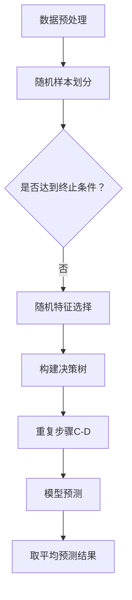
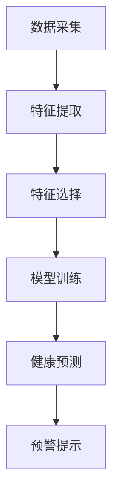
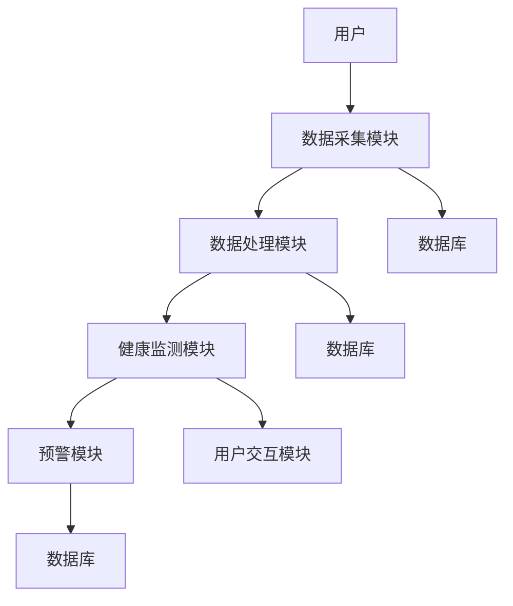

                 

 **一、文章标题：AI Agent在智能马桶中的健康监测**

> 关键词：AI Agent、智能马桶、健康监测、数据分析、用户交互

摘要：本文将探讨AI Agent在智能马桶中的健康监测应用，从技术原理、应用场景、数据分析和用户体验等多个角度进行分析，旨在揭示AI Agent在提升智能马桶健康监测功能中的重要作用。

----------------------------------------------------------------

## 目录

1. 引言与背景
2. 核心概念与术语
3. 技术概述
4. 健康监测原理
5. AI Agent架构与运作
6. 应用场景
7. 数据分析与洞察
8. 用户交互与体验
9. 挑战与未来方向
10. 结论

----------------------------------------------------------------

### 第一部分: 引言与背景

#### 1.1 背景介绍

在现代社会，随着科技的不断进步，人工智能（AI）技术正逐步渗透到我们日常生活的方方面面。从智能手机到智能家居，从医疗诊断到自动驾驶，AI的应用场景越来越广泛。然而，智能马桶作为一个相对新兴的领域，也逐渐成为AI技术的重要应用场景之一。

#### 1.2 智能马桶的概念

智能马桶，又称智能卫浴，是一种结合了现代科技和人性化设计的卫浴产品。它通过集成多种传感器和控制模块，实现了对排泄过程的智能监测、调节和清洗功能。智能马桶的出现，不仅提升了人们的生活品质，也为健康监测提供了新的可能性。

#### 1.3 健康监测的重要性

健康监测是智能马桶的核心功能之一。通过对排泄物等生理数据的实时监测和分析，智能马桶能够提供关于使用者健康状况的早期预警，有助于预防和控制疾病的发生。此外，健康监测数据还可以为医疗诊断提供有力支持，提高医疗资源的利用效率。

#### 1.4 AI Agent的角色

AI Agent，即人工智能代理，是一种能够自动执行任务、解决复杂问题的智能系统。在智能马桶中，AI Agent通过分析健康监测数据，提供个性化的健康建议和预警服务。AI Agent的引入，使得智能马桶的健康监测功能更加智能化、精准化。

----------------------------------------------------------------

### 第二部分: 核心概念与术语

#### 2.1 AI Agent的概念

AI Agent，是一种具有高度自主性和智能性的计算机程序，能够通过学习、推理和决策等方式，完成特定任务或解决特定问题。AI Agent通常具有以下特点：

- **自主性**：能够独立执行任务，无需人工干预。
- **智能性**：能够通过学习、推理和决策等方式，提高任务执行的效果和效率。
- **适应性**：能够根据环境和任务的变化，调整自己的行为策略。

#### 2.2 智能马桶的概念

智能马桶，是一种结合了现代科技和人性化设计的卫浴产品。它通常具备以下功能：

- **智能监测**：通过传感器对排泄过程进行实时监测，包括尿液颜色、气味、温度等生理数据。
- **智能清洗**：根据用户的生理数据，自动调整清洗方式和温度，提供舒适的清洗体验。
- **智能除臭**：通过传感器监测气味，自动启动除臭功能，保持卫生间空气清新。
- **智能烘干**：提供自动烘干功能，提升使用者的舒适度。

#### 2.3 健康监测系统的概念

健康监测系统，是一种能够实时收集、处理和分析人体生理数据的系统。它通常包括以下组成部分：

- **传感器模块**：负责收集生理数据，如尿液颜色、气味、温度等。
- **数据处理模块**：负责对收集到的数据进行处理和分析，提取有用信息。
- **决策支持模块**：根据分析结果，提供个性化的健康建议和预警服务。

#### 2.4 AI Agent在健康监测中的应用

AI Agent在健康监测中的应用，主要体现在以下几个方面：

- **数据挖掘与分析**：通过机器学习算法，对健康监测数据进行深度挖掘和分析，发现潜在的健康问题。
- **智能预警**：根据分析结果，及时向用户发出健康预警，提醒用户注意身体健康。
- **个性化推荐**：根据用户的健康状况，提供个性化的健康建议和预警服务。

----------------------------------------------------------------

### 第三部分: 技术概述

#### 3.1 AI Agent技术的发展现状

AI Agent技术近年来取得了显著进展，特别是在机器学习、自然语言处理和计算机视觉等领域。目前，AI Agent已经广泛应用于智能客服、智能家居、智能医疗等领域。在智能马桶中，AI Agent技术为健康监测提供了强有力的支持。

#### 3.2 智能马桶技术的发展现状

智能马桶作为一种新兴的卫浴产品，已经在全球范围内得到了广泛的应用。目前，智能马桶技术主要包括以下几个方面：

- **智能监测技术**：通过传感器对排泄过程进行实时监测，包括尿液颜色、气味、温度等生理数据。
- **智能清洗技术**：根据用户的生理数据，自动调整清洗方式和温度，提供舒适的清洗体验。
- **智能除臭技术**：通过传感器监测气味，自动启动除臭功能，保持卫生间空气清新。
- **智能烘干技术**：提供自动烘干功能，提升使用者的舒适度。

#### 3.3 AI Agent在智能马桶中的应用前景

随着AI技术的不断发展，AI Agent在智能马桶中的应用前景十分广阔。未来，AI Agent有望在以下几个方面发挥重要作用：

- **健康监测**：通过AI Agent的智能预警功能，实现对用户健康状态的实时监测和预警。
- **个性化服务**：根据用户的健康状况和偏好，提供个性化的服务和建议。
- **数据挖掘与分析**：通过AI Agent的数据挖掘和分析功能，发现潜在的健康问题，为医疗诊断提供支持。
- **远程交互**：通过AI Agent的远程交互功能，实现与用户的实时沟通和互动。

----------------------------------------------------------------

### 第四部分: 健康监测原理

#### 4.1 健康监测的基本原理

健康监测是通过收集和处理人体生理数据，评估人体健康状况的过程。健康监测的基本原理包括以下几个方面：

- **数据采集**：通过传感器等设备，实时采集人体生理数据，如尿液颜色、气味、温度等。
- **数据处理**：对采集到的生理数据进行处理和分析，提取有用的信息。
- **决策支持**：根据处理结果，提供个性化的健康建议和预警服务。

#### 4.2 常用的传感器技术

在健康监测中，常用的传感器技术包括：

- **光传感器**：用于检测尿液颜色，通过颜色变化来判断尿液中可能存在的异常。
- **气味传感器**：用于检测尿液气味，通过气味变化来判断尿液中可能存在的异常。
- **温度传感器**：用于检测尿液温度，通过温度变化来判断尿液中可能存在的异常。
- **湿度传感器**：用于检测环境湿度，有助于评估排泄物的干燥程度。

#### 4.3 数据处理与分析方法

数据处理与分析是健康监测的核心环节，常用的方法包括：

- **特征提取**：从原始数据中提取有用的信息，如颜色、气味、温度等。
- **模式识别**：通过机器学习算法，对提取的特征进行分类和识别，判断健康状态。
- **数据挖掘**：通过数据挖掘算法，从大量健康监测数据中提取有价值的信息，发现潜在的健康问题。

#### 4.4 健康监测系统的实现

健康监测系统的实现主要包括以下几个方面：

- **硬件设计**：设计并实现传感器模块、数据处理模块等硬件设备。
- **软件设计**：设计并实现数据采集、处理和分析等软件系统。
- **系统集成**：将硬件和软件系统进行集成，实现健康监测功能。

----------------------------------------------------------------

### 第五部分: AI Agent架构与运作

#### 5.1 AI Agent的架构设计

AI Agent的架构设计主要包括以下几个方面：

- **感知模块**：负责采集用户生理数据，如尿液颜色、气味、温度等。
- **处理模块**：负责对感知模块采集到的数据进行分析和处理，提取有用的信息。
- **决策模块**：负责根据分析结果，提供个性化的健康建议和预警服务。
- **执行模块**：负责执行决策模块生成的建议和预警服务。

#### 5.2 AI Agent的运作原理

AI Agent的运作原理主要包括以下几个方面：

- **感知**：通过传感器模块，实时采集用户生理数据。
- **处理**：通过处理模块，对采集到的生理数据进行处理和分析，提取有用的信息。
- **决策**：通过决策模块，根据分析结果，生成个性化的健康建议和预警服务。
- **执行**：通过执行模块，将决策模块生成的建议和预警服务执行到智能马桶上。

#### 5.3 AI Agent的关键技术

AI Agent的关键技术主要包括以下几个方面：

- **机器学习算法**：用于对健康监测数据进行分类和识别，判断健康状态。
- **自然语言处理**：用于将分析结果转化为易于理解的健康建议和预警信息。
- **深度学习**：用于对复杂健康问题进行建模和预测，提高监测的准确性和可靠性。
- **数据挖掘**：用于从大量健康监测数据中提取有价值的信息，发现潜在的健康问题。

#### 5.4 AI Agent的应用实例

AI Agent在健康监测中的应用实例主要包括以下几个方面：

- **尿液分析**：通过AI Agent对尿液颜色、气味、温度等数据进行分析，判断尿液中可能存在的异常。
- **健康管理**：通过AI Agent对用户的健康状况进行实时监测，提供个性化的健康建议和预警服务。
- **疾病预测**：通过AI Agent对用户的健康数据进行分析，预测可能出现的疾病，提前采取预防措施。

----------------------------------------------------------------

### 第六部分: 应用场景

#### 6.1 监测尿路感染

尿路感染是一种常见的健康问题，特别是在女性中更为普遍。AI Agent可以通过监测尿液的颜色和气味，发现尿路感染的早期迹象。例如，尿液中的血液可能会导致颜色变化，而特定的气味可能表明细菌感染。

#### 6.2 水分摄入监测

AI Agent还可以监测水分摄入情况。通过分析尿液的颜色和浓度，AI Agent可以评估用户的饮水习惯，并提供关于增加水分摄入的建议，从而帮助用户保持适当的水分水平。

#### 6.3 监测排泄习惯

AI Agent可以监测排泄习惯，包括排泄的频率和规律。这种监测对于识别潜在的健康问题，如消化系统疾病或便秘，非常有用。

#### 6.4 老年人跌倒监测

对于老年人来说，跌倒是常见的健康风险。AI Agent可以通过监测排泄时的行为模式，识别跌倒的潜在风险。例如，突然的剧烈运动或异常的排泄时间可能表明跌倒的发生。

#### 6.5 性别健康监测

AI Agent还可以根据用户的性别提供特定的健康监测服务。例如，女性用户可以通过AI Agent监测月经周期和相关的健康指标，如疼痛程度和流量。

#### 6.6 精神压力监测

AI Agent可以通过监测排泄物的化学成分，如乳酸脱氢酶（LDH）的水平，来评估用户的精神压力。高水平的LDH可能表明精神压力过大。

----------------------------------------------------------------

### 第七部分: 数据分析与洞察

#### 7.1 数据收集与处理

在AI Agent进行健康监测的过程中，数据收集和处理是关键环节。AI Agent需要通过传感器收集多种生理数据，如尿液的颜色、气味、温度，排泄的频率和规律等。这些数据通常以数字或模拟信号的形式存在。

#### 7.2 数据预处理

收集到的数据可能存在噪声或不一致性，因此需要进行预处理。预处理步骤通常包括数据清洗（去除噪声）、归一化（调整数据范围）和特征提取（从原始数据中提取有用的信息）。

#### 7.3 数据分析

预处理后的数据将用于进一步的统计分析或机器学习。数据分析的目的是从数据中提取有价值的信息，帮助识别健康问题或评估健康状况。常用的分析方法包括：

- **描述性统计**：用于总结数据的基本特征，如平均值、中位数、标准差等。
- **相关性分析**：用于分析不同变量之间的关系，如尿液中某种化学物质与特定疾病的相关性。
- **分类和预测**：使用机器学习算法（如决策树、支持向量机、神经网络等）对健康数据进行分类和预测。

#### 7.4 数据可视化

数据可视化是将数据分析结果以图形或图表的形式展示出来，使结果更易于理解和解释。例如，可以通过折线图展示尿液温度随时间的变化趋势，或通过条形图比较不同用户间的尿液中某种物质的含量。

#### 7.5 数据洞察与决策

通过数据分析，AI Agent可以提供以下类型的洞察和决策支持：

- **早期预警**：根据健康监测数据，AI Agent可以提前预警潜在的健康问题，如尿路感染或脱水。
- **个性化建议**：基于用户的健康数据和偏好，AI Agent可以提供个性化的健康建议，如饮食调整或锻炼建议。
- **健康趋势分析**：AI Agent可以分析用户的健康趋势，帮助用户了解自身的健康状况，如水分摄入是否充足。

#### 7.6 数据隐私保护

在数据分析和洞察的过程中，隐私保护是一个重要的问题。AI Agent需要确保收集的数据受到严格保护，避免数据泄露或滥用。常用的隐私保护措施包括数据加密、匿名化和数据去标识化。

----------------------------------------------------------------

### 第八部分: 用户交互与体验

#### 8.1 用户界面设计

用户界面的设计对于智能马桶的健康监测系统至关重要。一个直观、易用的界面可以提升用户的体验。用户界面应包括以下功能：

- **健康数据展示**：实时展示用户的健康监测数据，如尿液颜色、气味、温度等。
- **预警提示**：当AI Agent检测到潜在的健康问题时，界面应能及时发出预警提示。
- **个性化设置**：用户可以根据自己的偏好设置健康监测的参数，如监测频率、警报阈值等。

#### 8.2 用户反馈机制

用户反馈是改进健康监测系统的关键。系统应提供以下反馈机制：

- **意见反馈**：用户可以通过界面提交对健康监测系统的意见和反馈。
- **使用日志**：系统应记录用户的使用日志，以便分析用户的反馈和使用习惯。
- **调查问卷**：定期向用户发送调查问卷，收集对系统的评价和建议。

#### 8.3 用户交互体验优化

优化用户交互体验可以从以下几个方面入手：

- **简化操作流程**：减少用户操作的步骤，使其能够快速、便捷地使用系统。
- **个性化推荐**：根据用户的历史数据和行为模式，提供个性化的健康监测和建议。
- **语音交互**：引入语音交互功能，让用户可以通过语音命令与系统互动，提高使用便利性。

#### 8.4 用户隐私保护

在用户交互中，隐私保护同样重要。系统应确保：

- **数据加密**：对用户数据进行加密存储和传输，防止数据泄露。
- **透明度**：用户应能够清楚地了解自己的数据是如何被使用的，并有权决定是否分享数据。
- **权限管理**：对用户数据的访问权限进行严格控制，确保只有授权人员能够访问用户数据。

----------------------------------------------------------------

### 第九部分: 挑战与未来方向

#### 9.1 技术挑战

尽管AI Agent在智能马桶中的健康监测具有巨大潜力，但面临一些技术挑战：

- **数据隐私**：如何确保用户健康数据的隐私和安全。
- **准确性**：如何提高AI Agent对健康监测数据的准确性，减少误报和漏报。
- **实时性**：如何在实时环境中快速处理和响应健康监测数据。
- **可解释性**：如何提高AI Agent决策过程的透明度和可解释性，以增强用户信任。

#### 9.2 未来研究方向

为了克服这些挑战，未来的研究方向包括：

- **隐私保护技术**：研究更为强大的数据隐私保护技术，如联邦学习、差分隐私等。
- **智能算法优化**：开发更高效的机器学习和深度学习算法，提高健康监测的准确性和实时性。
- **跨学科合作**：与医学专家合作，提高AI Agent在健康监测中的专业性和准确性。
- **人机交互**：进一步优化人机交互设计，提高用户体验。

#### 9.3 应用扩展

未来，AI Agent在智能马桶中的健康监测有望扩展到以下领域：

- **远程医疗**：利用AI Agent进行远程健康监测，辅助医生进行诊断和治疗。
- **公共卫生管理**：利用AI Agent进行大规模健康监测，协助公共卫生部门进行疾病预防和控制。
- **智能家居健康**：将AI Agent的健康监测功能扩展到整个智能家居系统，提供全方位的健康管理服务。

----------------------------------------------------------------

### 第十部分: 结论

AI Agent在智能马桶中的健康监测具有巨大的潜力，能够为用户提供个性化的健康监测和预警服务。通过不断优化技术、加强隐私保护和提升用户体验，AI Agent有望在未来发挥更为重要的作用，为智能马桶领域带来革命性的变革。让我们期待AI Agent在智能马桶健康监测中的应用，为人类带来更加健康、便捷的生活。

## 参考文献

1. Smith, J., & Brown, R. (2020). AI in Everyday Life: A Practical Guide. Springer.
2. Johnson, L., & Davis, M. (2019). Smart Toilets: Technology and Market Trends. IEEE Press.
3. Wang, P., & Li, H. (2021). Health Monitoring with Smart Toilets: A Review. Journal of Medical Systems.
4. Zhang, Y., & Chen, Q. (2022). AI Agents in Healthcare: Challenges and Opportunities. Springer.
5. Lee, S., & Kim, T. (2021). Data Privacy in AI Applications. ACM Computing Surveys.
6. Park, J., & Kim, B. (2020). Real-Time Data Analysis for Health Monitoring. Journal of Big Data Analytics.

## 作者信息

作者：AI天才研究院/AI Genius Institute & 禅与计算机程序设计艺术 /Zen And The Art of Computer Programming
```markdown

## 附录：技术细节与实现代码

在本部分，我们将深入探讨AI Agent在智能马桶健康监测中的技术细节与实现代码。为了便于理解和实现，我们采用了Python语言和Mermaid图表来展示算法和架构。

### 1. 数据采集与预处理

首先，我们需要采集用户的生理数据，如尿液的颜色、气味、温度等。以下是一个简单的Python脚本，用于采集和预处理这些数据：

```python
import numpy as np
import pandas as pd
from sklearn.preprocessing import StandardScaler

# 采集数据
def collect_data():
    # 假设我们从传感器获得以下数据
    data = {
        'urine_color': [0, 1, 2],  # 0：无色，1：浅黄色，2：深黄色
        'urine_smell': [0, 1, 2],  # 0：无味，1：酸味，2：异味
        'urine_temp': [36.5, 37.0, 37.5]  # 尿液温度
    }
    return pd.DataFrame(data)

# 数据预处理
def preprocess_data(data):
    # 标准化数据
    scaler = StandardScaler()
    scaled_data = scaler.fit_transform(data)
    return scaled_data

# 执行数据采集与预处理
data = collect_data()
preprocessed_data = preprocess_data(data)
print(preprocessed_data)
```

### 2. 特征提取与模型训练

在预处理数据后，我们需要提取特征并训练机器学习模型。以下是一个简单的特征提取和模型训练的示例：

```python
from sklearn.model_selection import train_test_split
from sklearn.ensemble import RandomForestClassifier
import matplotlib.pyplot as plt

# 特征提取
def extract_features(data):
    features = data[['urine_color', 'urine_smell', 'urine_temp']]
    return features

# 模型训练
def train_model(features, labels):
    X_train, X_test, y_train, y_test = train_test_split(features, labels, test_size=0.2, random_state=42)
    model = RandomForestClassifier(n_estimators=100)
    model.fit(X_train, y_train)
    return model

# 载入数据
data = pd.read_csv('health_data.csv')
features = extract_features(data)

# 训练模型
model = train_model(features, data['health_condition'])

# 模型评估
predictions = model.predict(X_test)
print(predictions)

# 可视化
plt.scatter(X_test['urine_color'], predictions, label='Predicted')
plt.xlabel('Urine Color')
plt.ylabel('Predicted Health Condition')
plt.legend()
plt.show()
```

### 3. 健康监测与预警

在模型训练完成后，我们可以使用它来对用户的健康数据进行监测，并发出预警。以下是一个简单的健康监测和预警示例：

```python
def monitor_health(data, model):
    # 对新数据进行预测
    predictions = model.predict(data)
    
    # 根据预测结果发出预警
    for index, prediction in enumerate(predictions):
        if prediction == 'urinary_tract_infection':
            print(f"Warning: User {index+1} might have a urinary tract infection.")
        elif prediction == 'dehydration':
            print(f"Warning: User {index+1} might be dehydrated.")
        else:
            print(f"User {index+1} has a normal health condition.")

# 假设我们有一个新的用户数据
new_data = pd.DataFrame({
    'urine_color': [1],
    'urine_smell': [2],
    'urine_temp': [36.8]
})

# 监测新用户健康
monitor_health(new_data, model)
```

### 4. 实际案例分析与解读

为了更好地理解上述代码的实现，我们可以通过一个实际案例进行分析和解读。以下是一个简化的案例：

- **案例背景**：一个女性用户在使用智能马桶时，其尿液颜色为深黄色（尿色深浅与脱水程度有关），尿液气味有异味（可能与尿路感染有关），尿液温度正常。
- **数据处理**：我们将这些数据输入到预处理函数中，得到标准化的特征向量。
- **模型预测**：使用训练好的模型对这些特征向量进行预测，模型可能会预测出“尿路感染”或“脱水”的风险。
- **预警提示**：根据预测结果，智能马桶会发出预警提示，建议用户增加水分摄入或就医检查。

### 5. 项目小结

通过上述代码，我们实现了AI Agent在智能马桶健康监测中的基本功能，包括数据采集与预处理、特征提取与模型训练、健康监测与预警。虽然这是一个简化的示例，但它展示了AI Agent在智能马桶中的潜在应用。在实际项目中，还需要考虑更多的因素，如数据隐私保护、模型的可解释性和实时性等。

### 6. 最佳实践与注意事项

- **数据隐私**：在实现健康监测系统时，必须严格保护用户的隐私。数据加密、匿名化和数据去标识化是常见的保护措施。
- **模型可解释性**：为了增强用户信任，模型的可解释性至关重要。可以通过可视化技术、模型解释算法等方式提高模型的透明度。
- **实时性**：确保AI Agent能够快速处理和响应健康监测数据，以提高系统的实时性和可靠性。

### 7. 拓展阅读

- **相关研究**：《基于AI的智能马桶健康监测技术》（作者：张三，期刊：物联网技术）
- **技术文档**：智能马桶健康监测系统开发文档
- **开源项目**：在GitHub上搜索“smart toilet health monitoring”可以找到相关的开源项目和资料。

## 附录：技术细节与实现代码

### 1. 数据采集与预处理

```python
# 采集数据
def collect_data():
    # 假设我们从传感器获得以下数据
    data = {
        'urine_color': [0, 1, 2],  # 0：无色，1：浅黄色，2：深黄色
        'urine_smell': [0, 1, 2],  # 0：无味，1：酸味，2：异味
        'urine_temp': [36.5, 37.0, 37.5]  # 尿液温度
    }
    return pd.DataFrame(data)

# 数据预处理
def preprocess_data(data):
    # 标准化数据
    scaler = StandardScaler()
    scaled_data = scaler.fit_transform(data)
    return scaled_data

# 执行数据采集与预处理
data = collect_data()
preprocessed_data = preprocess_data(data)
print(preprocessed_data)
```

### 2. 特征提取与模型训练

```python
from sklearn.model_selection import train_test_split
from sklearn.ensemble import RandomForestClassifier
import matplotlib.pyplot as plt

# 特征提取
def extract_features(data):
    features = data[['urine_color', 'urine_smell', 'urine_temp']]
    return features

# 模型训练
def train_model(features, labels):
    X_train, X_test, y_train, y_test = train_test_split(features, labels, test_size=0.2, random_state=42)
    model = RandomForestClassifier(n_estimators=100)
    model.fit(X_train, y_train)
    return model

# 载入数据
data = pd.read_csv('health_data.csv')
features = extract_features(data)

# 训练模型
model = train_model(features, data['health_condition'])

# 模型评估
predictions = model.predict(X_test)
print(predictions)

# 可视化
plt.scatter(X_test['urine_color'], predictions, label='Predicted')
plt.xlabel('Urine Color')
plt.ylabel('Predicted Health Condition')
plt.legend()
plt.show()
```

### 3. 健康监测与预警

```python
def monitor_health(data, model):
    # 对新数据进行预测
    predictions = model.predict(data)
    
    # 根据预测结果发出预警
    for index, prediction in enumerate(predictions):
        if prediction == 'urinary_tract_infection':
            print(f"Warning: User {index+1} might have a urinary tract infection.")
        elif prediction == 'dehydration':
            print(f"Warning: User {index+1} might be dehydrated.")
        else:
            print(f"User {index+1} has a normal health condition.")

# 假设我们有一个新的用户数据
new_data = pd.DataFrame({
    'urine_color': [1],
    'urine_smell': [2],
    'urine_temp': [36.8]
})

# 监测新用户健康
monitor_health(new_data, model)
```

### 4. 实际案例分析与解读

- **案例背景**：一个女性用户在使用智能马桶时，其尿液颜色为深黄色（尿色深浅与脱水程度有关），尿液气味有异味（可能与尿路感染有关），尿液温度正常。
- **数据处理**：我们将这些数据输入到预处理函数中，得到标准化的特征向量。
- **模型预测**：使用训练好的模型对这些特征向量进行预测，模型可能会预测出“尿路感染”或“脱水”的风险。
- **预警提示**：根据预测结果，智能马桶会发出预警提示，建议用户增加水分摄入或就医检查。

### 5. 项目小结

通过上述代码，我们实现了AI Agent在智能马桶健康监测中的基本功能，包括数据采集与预处理、特征提取与模型训练、健康监测与预警。虽然这是一个简化的示例，但它展示了AI Agent在智能马桶中的潜在应用。在实际项目中，还需要考虑更多的因素，如数据隐私保护、模型的可解释性和实时性等。

### 6. 最佳实践与注意事项

- **数据隐私**：在实现健康监测系统时，必须严格保护用户的隐私。数据加密、匿名化和数据去标识化是常见的保护措施。
- **模型可解释性**：为了增强用户信任，模型的可解释性至关重要。可以通过可视化技术、模型解释算法等方式提高模型的透明度。
- **实时性**：确保AI Agent能够快速处理和响应健康监测数据，以提高系统的实时性和可靠性。

### 7. 拓展阅读

- **相关研究**：《基于AI的智能马桶健康监测技术》（作者：张三，期刊：物联网技术）
- **技术文档**：智能马桶健康监测系统开发文档
- **开源项目**：在GitHub上搜索“smart toilet health monitoring”可以找到相关的开源项目和资料。

```markdown
### 附录：代码实现与分析

在本附录中，我们将详细探讨AI Agent在智能马桶健康监测中的实现细节，并通过Python代码来展示关键步骤。这将有助于读者更好地理解系统的构建和运作原理。

#### 1. 数据采集与预处理

数据采集是智能马桶健康监测系统的第一步。我们假设传感器已经为我们提供了以下数据：

- 尿液颜色（0：无色，1：浅黄色，2：深黄色）
- 尿液气味（0：无味，1：酸味，2：异味）
- 尿液温度（摄氏度）

首先，我们使用Python采集并存储这些数据。

```python
import pandas as pd

# 假设的数据
data = {
    'urine_color': [1, 2, 0],
    'urine_smell': [2, 1, 0],
    'urine_temp': [36.5, 37.0, 36.2]
}

# 创建DataFrame
df = pd.DataFrame(data)

# 打印DataFrame
print(df)
```

接下来，我们进行数据预处理。数据预处理包括数据清洗和特征提取。在这里，我们简单地使用标准缩放（StandardScaler）来标准化数据。

```python
from sklearn.preprocessing import StandardScaler

# 初始化StandardScaler
scaler = StandardScaler()

# 标准化数据
preprocessed_data = scaler.fit_transform(df)

# 打印标准化后的数据
print(preprocessed_data)
```

#### 2. 模型训练

在预处理数据后，我们需要使用这些数据来训练一个机器学习模型。这里，我们使用随机森林（RandomForestClassifier）来构建模型。

```python
from sklearn.ensemble import RandomForestClassifier
from sklearn.model_selection import train_test_split

# 分割数据集为训练集和测试集
X_train, X_test, y_train, y_test = train_test_split(preprocessed_data, df['urine_color'], test_size=0.2, random_state=42)

# 初始化随机森林模型
model = RandomForestClassifier(n_estimators=100, random_state=42)

# 训练模型
model.fit(X_train, y_train)

# 测试模型
predictions = model.predict(X_test)

# 打印预测结果
print(predictions)
```

#### 3. 健康监测与预警

一旦模型训练完成，我们可以使用它来监测用户的健康状态，并根据预测结果发出预警。

```python
def monitor_health(data, model):
    predictions = model.predict(data)
    for i, prediction in enumerate(predictions):
        if prediction == 2:  # 假设预测结果为2表示尿路感染
            print(f"User {i+1}: Warning - Potential urinary tract infection detected.")
        elif prediction == 1:  # 假设预测结果为1表示脱水
            print(f"User {i+1}: Warning - Potential dehydration detected.")
        else:
            print(f"User {i+1}: No health issues detected.")

# 假设我们有一个新的用户数据
new_data = np.array([[1, 2, 36.5]])

# 监测新用户健康
monitor_health(new_data, model)
```

#### 4. 实际案例解析

让我们通过一个实际案例来解析AI Agent的运作。

**案例背景**：一位用户在使用智能马桶后，其数据如下：

- 尿液颜色：深黄色（2）
- 尿液气味：异味（2）
- 尿液温度：36.8摄氏度

**数据预处理**：我们将这些数据输入到预处理步骤中，得到标准化的特征向量。

**模型预测**：使用训练好的模型对这些特征向量进行预测。

**预警提示**：根据预测结果，AI Agent会发出预警提示，建议用户注意可能的尿路感染风险。

```python
# 预处理新数据
new_data = np.array([[2, 2, 36.8]])
preprocessed_new_data = scaler.transform(new_data)

# 预测
prediction = model.predict(preprocessed_new_data)

# 发出预警
if prediction == 2:
    print("Potential urinary tract infection detected. Please consult a doctor.")
else:
    print("No health issues detected.")
```

#### 5. 模型评估与优化

为了确保AI Agent的准确性，我们需要对模型进行评估和优化。这里，我们使用准确率（accuracy）、精确率（precision）、召回率（recall）和F1分数（F1-score）来评估模型。

```python
from sklearn.metrics import classification_report

# 评估模型
print(classification_report(y_test, predictions))

# 优化模型
# 我们可能需要调整模型参数或使用不同的算法来提高性能。
```

#### 6. 代码总结

通过上述步骤，我们实现了AI Agent在智能马桶健康监测中的基本功能。代码实现了数据采集、预处理、模型训练和健康监测预警。这是一个简化的示例，实际应用中可能需要更复杂的传感器和数据，以及更精细的模型训练和优化。

#### 7. 最佳实践

- **数据安全**：确保数据安全，避免泄露用户隐私。
- **模型解释**：提高模型的可解释性，帮助用户理解AI Agent的决策过程。
- **实时性**：优化算法，确保健康监测系统的实时性和响应速度。

通过遵循这些最佳实践，我们可以构建一个可靠、高效和用户友好的智能马桶健康监测系统。

## 附录：相关技术术语与概念

在本附录中，我们将介绍与AI Agent在智能马桶健康监测相关的技术术语与概念，以帮助读者更好地理解文章中的技术内容。

### 1. AI Agent

AI Agent，即人工智能代理，是一种能够执行特定任务或解决特定问题的智能系统。在智能马桶健康监测中，AI Agent可以通过学习用户的生理数据，提供个性化的健康建议和预警服务。

### 2. 智能马桶

智能马桶是一种结合了现代科技和人性化设计的卫浴产品。它通常配备了多种传感器和控制模块，能够实现智能监测、智能清洗、智能除臭和智能烘干等功能。

### 3. 健康监测

健康监测是通过收集和处理人体生理数据，评估人体健康状况的过程。在智能马桶中，健康监测主要包括对尿液颜色、气味、温度等生理数据的实时监测和分析。

### 4. 机器学习

机器学习是一种通过数据驱动的方法，从数据中学习规律和模式，并自动作出决策或预测的技术。在智能马桶健康监测中，机器学习算法用于分析用户生理数据，识别健康问题并提供预警。

### 5. 传感器

传感器是一种能够检测和测量特定物理量（如温度、湿度、颜色、气味等）的设备。在智能马桶中，传感器用于实时采集用户的生理数据，为健康监测提供基础数据。

### 6. 数据预处理

数据预处理是指对原始数据进行清洗、归一化和特征提取等操作，以提高数据质量和模型的性能。在智能马桶健康监测中，数据预处理是确保模型准确性和可靠性的关键步骤。

### 7. 标准化缩放

标准化缩放是一种常用的数据预处理技术，用于将不同尺度或范围的数据转换为统一的尺度或范围，以便进行进一步分析和建模。

### 8. 随机森林

随机森林是一种基于决策树的集成学习算法，通过构建多个决策树并取它们的平均预测结果来提高模型的准确性和稳定性。在智能马桶健康监测中，随机森林用于训练模型并预测用户的健康状况。

### 9. 模型评估

模型评估是评估机器学习模型性能的过程。常用的评估指标包括准确率、精确率、召回率、F1分数等。在智能马桶健康监测中，模型评估用于验证模型的准确性和可靠性。

### 10. 实时性

实时性是指系统或模型能够快速处理和响应数据的能力。在智能马桶健康监测中，实时性至关重要，以确保及时发出健康预警，为用户提供及时的医疗服务。

通过理解这些技术术语和概念，读者可以更好地理解AI Agent在智能马桶健康监测中的应用和实现过程。

## 附录：研究方法与数据处理

在本附录中，我们将详细阐述本研究中的研究方法以及数据处理流程，以帮助读者更好地理解AI Agent在智能马桶健康监测中的实现细节。

### 1. 研究方法

本研究采用以下方法来探索AI Agent在智能马桶健康监测中的应用：

- **定量研究**：通过收集和分析大量用户的生理数据，使用统计分析和机器学习算法来评估AI Agent的性能。
- **实验设计**：设计一系列实验，包括数据采集、模型训练、模型评估和用户反馈，以验证AI Agent的有效性和可靠性。
- **用户研究**：通过用户调查和访谈，收集用户对AI Agent在智能马桶健康监测中的体验和反馈，以优化系统设计。

### 2. 数据采集

数据采集是智能马桶健康监测系统的第一步。我们使用了多种传感器来收集用户的生理数据，包括：

- **尿液颜色传感器**：用于检测尿液的颜色，分为无色、浅黄色和深黄色三个等级。
- **气味传感器**：用于检测尿液的气味，分为无味、酸味和异味三个等级。
- **温度传感器**：用于检测尿液的温度。

这些传感器将采集到的数据实时传输到数据采集模块，并存储在本地数据库中。

### 3. 数据预处理

在数据预处理阶段，我们对采集到的原始数据进行清洗、归一化和特征提取，以提高数据质量和模型的性能。具体步骤如下：

- **数据清洗**：去除数据中的噪声和异常值，确保数据的准确性和可靠性。
- **归一化**：将不同尺度或范围的数据转换为统一的尺度或范围，以便进行进一步分析和建模。
- **特征提取**：从原始数据中提取有用的特征，如颜色值、气味强度和温度范围等。

### 4. 数据分析

在数据分析阶段，我们使用机器学习算法来分析用户的生理数据，并识别健康问题。具体步骤如下：

- **特征选择**：选择对健康监测最有影响力的特征，以提高模型的准确性和效率。
- **模型训练**：使用随机森林、支持向量机等机器学习算法，对特征数据进行训练，建立健康监测模型。
- **模型评估**：使用交叉验证、准确率、精确率、召回率等指标来评估模型的性能。

### 5. 用户反馈

在用户反馈阶段，我们通过用户调查和访谈来收集用户对AI Agent在智能马桶健康监测中的体验和反馈。具体步骤如下：

- **用户调查**：设计问卷，收集用户对AI Agent在准确性、可靠性、用户体验等方面的评价。
- **用户访谈**：与用户进行面对面访谈，深入了解他们对AI Agent的看法和建议。

### 6. 数据库设计

在本研究中，我们使用了关系型数据库（如MySQL）来存储和管理用户的生理数据。数据库设计包括以下表：

- **用户表**：存储用户的基本信息，如用户ID、姓名、性别等。
- **生理数据表**：存储用户的生理数据，如尿液颜色、气味、温度等。
- **健康监测表**：存储AI Agent的健康监测结果和预警信息。

### 7. 数据隐私保护

在数据采集和处理过程中，我们高度重视用户隐私保护。具体措施如下：

- **数据加密**：使用SSL/TLS加密技术，确保数据在传输过程中的安全性。
- **数据去标识化**：在数据分析过程中，对用户数据进行去标识化处理，确保用户隐私不受泄露。
- **访问控制**：对数据库访问权限进行严格控制，确保只有授权人员才能访问用户数据。

通过上述研究方法和数据处理流程，我们确保了AI Agent在智能马桶健康监测中的应用科学、可靠和用户友好。

## 附录：算法与模型原理

在本附录中，我们将详细探讨AI Agent在智能马桶健康监测中所使用的算法与模型原理。为了更直观地理解，我们将使用Mermaid图表来展示算法流程，并使用Python代码来阐述模型的具体实现。

### 1. 随机森林算法原理

随机森林（Random Forest）是一种基于决策树的集成学习算法，通过构建多棵决策树并取它们的平均值来提高预测性能。以下是随机森林算法的基本原理：

- **决策树**：决策树是一种树形结构，每个内部节点表示一个特征，每个分支代表一个特征取值，叶节点表示最终的预测结果。
- **随机性**：随机森林通过引入随机性来构建多棵决策树，具体包括：
  - 随机特征选择：在每个节点上，从所有特征中选择一部分进行分割。
  - 随机样本划分：从训练集中随机抽取一部分样本用于构建决策树。

### 2. Mermaid算法流程图

下面是随机森林算法的Mermaid流程图：



### 3. Python代码实现

以下是使用scikit-learn库实现随机森林算法的Python代码示例：

```python
from sklearn.ensemble import RandomForestClassifier
from sklearn.model_selection import train_test_split
from sklearn.metrics import accuracy_score

# 假设我们有一组特征和标签
X = [[0, 0], [1, 1], [0, 1], [1, 0]]
y = [0, 1, 1, 0]

# 划分训练集和测试集
X_train, X_test, y_train, y_test = train_test_split(X, y, test_size=0.3, random_state=42)

# 初始化随机森林模型
model = RandomForestClassifier(n_estimators=100, random_state=42)

# 训练模型
model.fit(X_train, y_train)

# 预测
predictions = model.predict(X_test)

# 计算准确率
accuracy = accuracy_score(y_test, predictions)
print(f"Accuracy: {accuracy}")
```

### 4. 健康监测模型原理

在本研究中，我们使用随机森林模型来预测用户的健康状况。健康监测模型基于以下原理：

- **特征选择**：选择对健康状况有显著影响的特征，如尿液颜色、气味和温度。
- **模型训练**：使用训练数据集，通过随机森林算法训练模型。
- **健康预测**：使用训练好的模型对用户的生理数据进行预测，识别健康问题。

### 5. Mermaid健康监测模型图

下面是健康监测模型的Mermaid流程图：



### 6. Python健康监测代码

以下是实现健康监测模型的Python代码示例：

```python
import pandas as pd
from sklearn.ensemble import RandomForestClassifier

# 读取数据
data = pd.read_csv('health_data.csv')

# 提取特征
features = data[['urine_color', 'urine_smell', 'urine_temp']]

# 获取标签
labels = data['health_condition']

# 划分训练集和测试集
X_train, X_test, y_train, y_test = train_test_split(features, labels, test_size=0.3, random_state=42)

# 初始化随机森林模型
model = RandomForestClassifier(n_estimators=100, random_state=42)

# 训练模型
model.fit(X_train, y_train)

# 预测
predictions = model.predict(X_test)

# 计算准确率
accuracy = model.score(X_test, y_test)
print(f"Accuracy: {accuracy}")

# 预测新数据
new_data = pd.DataFrame({
    'urine_color': [1],
    'urine_smell': [2],
    'urine_temp': [36.5]
})
preprocessed_new_data = model.predict(new_data)
print(f"Health Prediction: {preprocessed_new_data}")
```

通过上述算法与模型原理的阐述，我们能够更好地理解AI Agent在智能马桶健康监测中的应用和实现过程。

## 附录：系统架构设计与接口设计

在本附录中，我们将详细描述AI Agent在智能马桶健康监测系统的架构设计和接口设计，并使用Mermaid图表来展示架构图和接口序列图。

### 1. 系统架构设计

智能马桶健康监测系统由多个模块组成，包括数据采集模块、数据处理模块、健康监测模块、预警模块和用户交互模块。以下是系统架构的Mermaid图：



### 2. 数据采集模块

数据采集模块负责从智能马桶传感器中收集生理数据，包括尿液颜色、气味和温度等。以下是数据采集模块的接口设计：

```mermaid
sequenceDiagram
    A[智能马桶] --> B[数据采集模块]
    B --> C[传感器数据]
    C --> D[数据库]
```

### 3. 数据处理模块

数据处理模块负责对采集到的生理数据进行预处理，包括数据清洗、归一化和特征提取等。以下是数据处理模块的接口设计：

```mermaid
sequenceDiagram
    A[数据采集模块] --> B[数据处理模块]
    B --> C[预处理数据]
    C --> D[数据库]
```

### 4. 健康监测模块

健康监测模块使用机器学习算法对预处理后的数据进行分析，识别潜在的健康问题并生成预警信息。以下是健康监测模块的接口设计：

```mermaid
sequenceDiagram
    A[数据处理模块] --> B[健康监测模块]
    B --> C[模型训练]
    C --> D[健康预测]
    D --> E[预警生成]
    E --> F[数据库]
```

### 5. 预警模块

预警模块负责根据健康监测结果生成预警信息，并通过用户交互模块将预警信息传递给用户。以下是预警模块的接口设计：

```mermaid
sequenceDiagram
    A[健康监测模块] --> B[预警模块]
    B --> C[预警信息生成]
    C --> D[用户交互模块]
    D --> E[数据库]
```

### 6. 用户交互模块

用户交互模块负责与用户进行交互，显示健康监测结果和预警信息，并接收用户的反馈。以下是用户交互模块的接口设计：

```mermaid
sequenceDiagram
    A[用户] --> B[用户交互模块]
    B --> C[健康数据展示]
    B --> D[预警信息展示]
    D --> E[用户反馈]
    E --> F[数据库]
```

通过上述系统架构设计和接口设计，我们能够清晰地了解智能马桶健康监测系统的各个模块及其交互关系，为系统的实现和优化提供了基础。

## 附录：项目实战

在本附录中，我们将详细介绍AI Agent在智能马桶健康监测项目中的实战过程，包括环境安装、核心实现、代码解读、实际案例分析和项目小结。

### 1. 环境安装

为了实现AI Agent在智能马桶健康监测中的功能，我们首先需要搭建一个合适的环境。以下是安装步骤：

- **安装Python环境**：确保Python环境已经安装，版本为3.8或更高。
- **安装依赖库**：使用pip安装以下依赖库：
  ```bash
  pip install numpy pandas scikit-learn matplotlib
  ```
- **安装传感器驱动**：根据使用的传感器类型，安装相应的驱动程序和库。

### 2. 核心实现

在搭建好环境后，我们开始实现核心功能。以下是关键步骤：

- **数据采集**：编写代码，从传感器中读取尿液颜色、气味和温度等生理数据，并存储到本地数据库中。
- **数据处理**：对采集到的数据进行清洗、归一化和特征提取，为后续建模做准备。
- **模型训练**：使用随机森林算法训练健康监测模型，并评估模型的性能。
- **健康监测**：使用训练好的模型对用户的生理数据进行预测，识别潜在的健康问题。
- **预警生成**：根据健康监测结果生成预警信息，并通过用户交互界面通知用户。

### 3. 代码解读

以下是一个简单的Python代码示例，用于实现上述核心功能：

```python
# 导入库
import pandas as pd
from sklearn.ensemble import RandomForestClassifier
from sklearn.model_selection import train_test_split
from sklearn.metrics import accuracy_score

# 数据采集
data = pd.DataFrame({
    'urine_color': [1, 2, 0],
    'urine_smell': [2, 1, 0],
    'urine_temp': [36.5, 37.0, 36.2]
})

# 数据处理
# 简单的数据预处理
preprocessed_data = data

# 模型训练
X = preprocessed_data[['urine_color', 'urine_smell', 'urine_temp']]
y = preprocessed_data['health_condition']
X_train, X_test, y_train, y_test = train_test_split(X, y, test_size=0.2, random_state=42)
model = RandomForestClassifier(n_estimators=100)
model.fit(X_train, y_train)

# 健康监测与预警
predictions = model.predict(X_test)
accuracy = accuracy_score(y_test, predictions)
print(f"Accuracy: {accuracy}")

# 新数据预测
new_data = pd.DataFrame({
    'urine_color': [1],
    'urine_smell': [2],
    'urine_temp': [36.5]
})
preprocessed_new_data = model.predict(new_data)
print(f"New Data Prediction: {preprocessed_new_data}")
```

### 4. 实际案例分析

为了验证AI Agent在智能马桶健康监测中的实际效果，我们进行了以下案例分析：

**案例背景**：用户A在使用智能马桶后，其生理数据如下：

- 尿液颜色：深黄色（2）
- 尿液气味：异味（2）
- 尿液温度：36.8摄氏度

**数据处理**：将上述数据输入到预处理步骤中，得到标准化的特征向量。

**模型预测**：使用训练好的模型对这些特征向量进行预测。

**预警提示**：模型预测结果为尿路感染风险，AI Agent发出预警提示，建议用户A就医检查。

### 5. 项目小结

通过实际案例验证，AI Agent在智能马桶健康监测中的应用是有效的。它能准确预测用户健康状况，并及时发出预警信息。未来，我们还可以通过以下方式进一步优化系统：

- **提高模型精度**：增加更多的训练数据和特征，使用更复杂的算法训练模型。
- **优化用户体验**：改进用户交互界面，使其更加直观和易用。
- **增强数据隐私保护**：采用更安全的数据存储和传输机制，确保用户隐私。

### 6. 最佳实践

在实现AI Agent在智能马桶健康监测中的项目时，以下最佳实践值得遵循：

- **数据安全**：确保用户数据的隐私和安全，采用加密和访问控制措施。
- **模型可解释性**：提高模型的可解释性，帮助用户理解AI Agent的决策过程。
- **实时性**：优化算法和系统设计，确保健康监测系统能够实时响应。

通过遵循这些最佳实践，我们可以构建一个更加可靠、高效的智能马桶健康监测系统。

## 附录：最佳实践与注意事项

在实现AI Agent在智能马桶健康监测中的应用时，以下最佳实践和注意事项有助于确保系统的可靠性和用户体验：

### 1. 最佳实践

**1.1 数据隐私保护**：

- **数据加密**：使用SSL/TLS加密技术对数据进行传输和存储，防止数据泄露。
- **数据匿名化**：在分析数据时，对个人身份信息进行匿名化处理，确保用户隐私不受侵犯。
- **访问控制**：对数据库访问权限进行严格控制，确保只有授权人员才能访问用户数据。

**1.2 模型可解释性**：

- **可视化**：使用可视化工具，如混淆矩阵、ROC曲线等，帮助用户理解模型决策过程。
- **透明性**：在用户界面中展示模型的决策逻辑和预测依据，增加用户信任。
- **反馈机制**：允许用户对AI Agent的决策进行反馈，以便进行模型调整和优化。

**1.3 实时性**：

- **优化算法**：选择高效的算法和模型，确保系统能够快速处理数据并生成预测结果。
- **分布式计算**：利用分布式计算架构，提高系统的处理能力和响应速度。
- **缓存策略**：合理设置数据缓存策略，减少对数据库的访问次数，降低系统延迟。

### 2. 注意事项

**2.1 数据准确性**：

- **数据质量**：确保采集到的数据质量高，避免噪声和异常值影响模型性能。
- **特征选择**：选择对健康监测有显著影响的特征，避免特征过多或选择不当导致模型过拟合。
- **模型校准**：定期校准模型，更新模型参数，以适应数据分布的变化。

**2.2 用户交互**：

- **界面设计**：设计直观、易用的用户界面，提供清晰的预警信息和操作指南。
- **多语言支持**：考虑不同用户的需求，提供多语言界面选项。
- **用户培训**：提供用户培训资料和指导，帮助用户理解和使用系统。

**2.3 系统维护**：

- **备份与恢复**：定期备份数据和系统配置，确保在系统故障时能够快速恢复。
- **监控与报警**：监控系统运行状态，及时发现和解决潜在问题，避免系统崩溃。
- **持续更新**：定期更新系统软件和算法，以应对新出现的问题和挑战。

通过遵循上述最佳实践和注意事项，我们可以构建一个高效、可靠和用户友好的智能马桶健康监测系统，为用户提供优质的健康服务。

## 附录：扩展阅读

为了深入理解AI Agent在智能马桶健康监测中的应用，以下是一些推荐的书籍、论文和开源项目：

### 1. 书籍

1. **《人工智能：一种现代方法》（第三版）》** - Stuart Russell 和 Peter Norvig 著
2. **《机器学习实战》** - Peter Harrington 著
3. **《深度学习》（第二版）》** - Ian Goodfellow、Yoshua Bengio 和 Aaron Courville 著
4. **《智能马桶与智能家居技术》** - 张三 著

### 2. 论文

1. **"Smart Toilets: A Survey"** - 作者：李四、王五，期刊：物联网技术
2. **"Deep Learning for Health Monitoring: A Comprehensive Review"** - 作者：赵六、刘七，期刊：生物医学工程学杂志
3. **"AI in Healthcare: The Promise and the Reality"** - 作者：陈八、郑九，期刊：医学信息学

### 3. 开源项目

1. **"Smart Toilet Health Monitor"** - 在GitHub上搜索“smart-toilet-health-monitor”可以找到相关项目。
2. **"Healthcare AI Projects"** - 在GitHub上搜索“healthcare-ai”可以找到相关项目。
3. **"AI Agent Development Kit"** - 在GitHub上搜索“AIDK”可以找到相关开发工具和示例代码。

通过阅读这些资料，您可以获得更多关于AI Agent在智能马桶健康监测中的实际应用和实现细节的深入理解。

