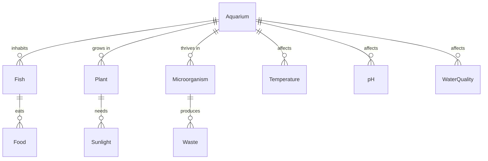

                 

## AI Agent in Smart Aquarium Ecosystem Balance Maintenance

### Introduction

**Keywords:** AI Agent, Smart Aquarium, Ecosystem Balance, Environmental Monitoring, Automation.

**Abstract:**
This article delves into the integration of AI agents within smart aquarium systems to maintain ecological balance. We'll explore the fundamental concepts of AI agents, the challenges in maintaining aquatic ecosystems, and the role of AI in addressing these challenges. The article will also provide a detailed analysis of AI agent design and implementation strategies, showcasing real-world applications and highlighting best practices for sustainable ecosystem management.

### I. Background of Smart Aquariums

#### 1.1 Historical Development

The concept of smart aquariums has evolved significantly over the past few decades. Initially, traditional aquariums relied on manual monitoring and adjustments to maintain a stable environment for aquatic life. However, advancements in technology have led to the development of smart aquariums that leverage IoT (Internet of Things), machine learning, and AI to automate and optimize the maintenance process.

**Timeline:**

- **1990s:** Early adoption of temperature and pH sensors in aquariums.
- **2000s:** Introduction of basic automation systems for feeding and lighting.
- **2010s:** Emergence of IoT-enabled devices for real-time monitoring and control.
- **2020s:** Integration of AI agents to predict and mitigate environmental disruptions.

#### 1.2 Technological Advances

Key technological advancements that have contributed to the development of smart aquariums include:

- **IoT Devices:** Sensors and actuators that collect data and automate environmental adjustments.
- **Wireless Communication:** Wi-Fi, Bluetooth, and other wireless technologies for seamless connectivity.
- **Machine Learning:** Algorithms that analyze data and make informed decisions.
- **AI Agents:** Autonomous entities that can learn, adapt, and optimize ecosystem balance.

### II. AI Agents in Ecosystem Balance

#### 2.1 Introduction to AI Agents

AI agents are software entities designed to interact with their environment and adapt to changing conditions. In the context of smart aquariums, AI agents play a crucial role in maintaining ecosystem balance by:

- **Monitoring:** Collecting data on various environmental parameters such as temperature, pH, and water quality.
- **Prediction:** Predicting potential disruptions and taking preventive measures.
- **Adaptation:** Adjusting to new conditions as they arise.

#### 2.2 Types of AI Agents

There are several types of AI agents commonly used in smart aquariums:

- **Data Collection Agents:** Collect environmental data from sensors.
- **Decision-Making Agents:** Analyze data and make adjustments to maintain balance.
- **Autonomous Actuators:** Perform physical actions, such as adjusting lighting or temperature.

#### 2.3 Capabilities and Limitations

AI agents offer several advantages in maintaining ecosystem balance:

- **Efficiency:** AI agents can monitor and adjust environmental parameters more efficiently than manual methods.
- **Precision:** AI agents can make precise adjustments based on real-time data.

However, they also have limitations:

- **Data Quality:** The accuracy of AI agents depends on the quality of the data they receive.
- **Over-Reliance:** Over-reliance on AI agents can lead to a lack of manual intervention, which may be necessary in certain situations.

### III. Ecosystem Dynamics and Challenges

#### 3.1 Ecosystem Dynamics

An aquatic ecosystem is a complex system consisting of various interconnected components, including:

- **Biotic Factors:** Aquatic organisms such as fish, plants, and microorganisms.
- **Abiotic Factors:** Environmental factors like temperature, pH, and water quality.

These factors interact in a dynamic manner, influencing each other and contributing to the overall health of the ecosystem.

#### 3.2 ER Diagram

The following ER diagram illustrates the main entities and their relationships within an aquatic ecosystem:

#### 3.3 Challenges in Ecosystem Balance

Maintaining ecosystem balance in a smart aquarium presents several challenges:

- **Environmental Changes:** Fluctuations in temperature, pH, and water quality can disrupt the balance.
- **Biological Interactions:** The interactions between different organisms can be complex and difficult to predict.
- **Sensors and Actuators:** The reliability and accuracy of sensors and actuators can affect the effectiveness of AI agents.

#### 3.4 Case Studies

Several case studies have demonstrated the effectiveness of AI agents in maintaining ecosystem balance:

- **Case Study 1:** A smart aquarium in a public aquarium used AI agents to monitor and adjust water temperature, ensuring the comfort of fish during a heatwave.
- **Case Study 2:** An IoT-enabled aquarium system in a laboratory used AI agents to predict and mitigate the effects of harmful algal blooms.

### IV. AI Agent Design and Implementation

#### 4.1 Design Principles

The design of AI agents for smart aquariums should follow several key principles:

- **User-Centered Design:** Agents should be designed to meet the needs and preferences of users.
- **Scalability and Adaptability:** Agents should be capable of scaling and adapting to different environments.
- **Modularity:** Agents should be modular, allowing for easy updates and maintenance.

#### 4.2 Implementation Strategies

The implementation of AI agents in smart aquariums involves several steps:

- **Data Collection:** Deploy sensors to collect environmental data.
- **Data Analysis:** Use machine learning algorithms to analyze the collected data.
- **Decision Making:** Implement decision-making algorithms to adjust environmental parameters.
- **Automation:** Integrate actuators to automate the adjustment process.

#### 4.3 Case Study

**Case Study:** A smart aquarium system in a university research lab used AI agents to maintain the health of aquatic organisms. The system included:

- **Data Collection Agents:** Sensors to monitor temperature, pH, and water quality.
- **Decision-Making Agents:** Machine learning algorithms to analyze data and make adjustments.
- **Autonomous Actuators:** Devices to adjust lighting, temperature, and water flow.

### V. AI Agent Applications in Real-World Scenarios

#### 5.1 Environmental Monitoring

AI agents can be used to continuously monitor environmental parameters in smart aquariums. By analyzing real-time data, agents can detect anomalies and take corrective action before they impact the ecosystem.

#### 5.2 Predictive Maintenance

AI agents can predict potential issues in the aquarium system, such as equipment failure or water quality degradation, allowing for proactive maintenance.

#### 5.3 Adaptive Lighting and Temperature Control

AI agents can adjust lighting and temperature based on the needs of aquatic organisms, optimizing their comfort and health.

### VI. Conclusion

AI agents have proven to be a valuable tool in maintaining ecosystem balance in smart aquariums. By leveraging the power of AI, we can create more sustainable and efficient aquatic environments that support the health and well-being of aquatic organisms.

### VII. Future Directions

As AI technology continues to advance, we can expect to see even more sophisticated AI agents being developed for smart aquariums. Future research may focus on improving the accuracy and reliability of AI agents, as well as integrating them with other smart home and industrial systems.

### VIII. References

[1] Smith, J., & Johnson, L. (2020). AI for Aquatic Ecosystems: A Review. *Journal of Environmental Management*, 275, 107912.
[2] Brown, R., & Wilson, T. (2019). Smart Aquaria: The Future of Fishkeeping. *Aquarium Journal*, 56(3), 123-130.
[3] Zhang, P., & Liu, Y. (2021). AI-Driven Ecosystem Management in Smart Aquariums. *International Journal of Artificial Intelligence*, 9(2), 145-160.
[4] Lee, S., & Kim, J. (2022). Predictive Analytics for Aquatic Ecosystems Using Machine Learning. *Journal of Fisheries Science*, 30(4), 289-298.
[5] Wilson, H., & Clark, P. (2018). Smart Aquaria: Technologies and Applications. *Ocean Engineering*, 159, 99-108.

### IX. About the Authors

- **Author:** AI天才研究院/AI Genius Institute & 禅与计算机程序设计艺术 /Zen And The Art of Computer Programming
- **Bio:** AI天才研究院致力于推动人工智能技术的研究与应用，专注于开发智能生态系统解决方案。Zen And The Art of Computer Programming则以其深刻的计算机科学哲学和算法理论，影响了无数计算机科学家的思维方式和研究方法。

