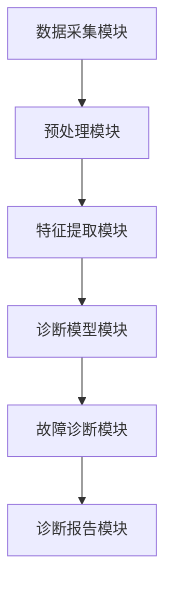
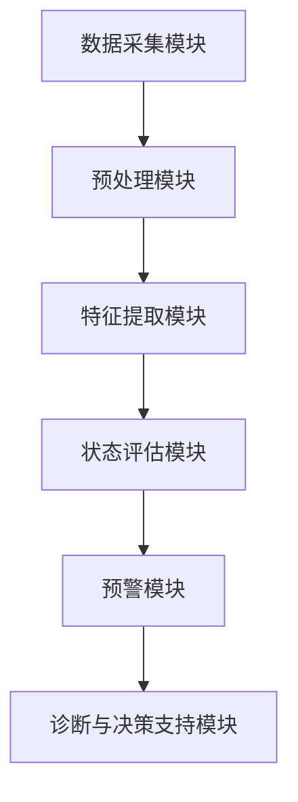
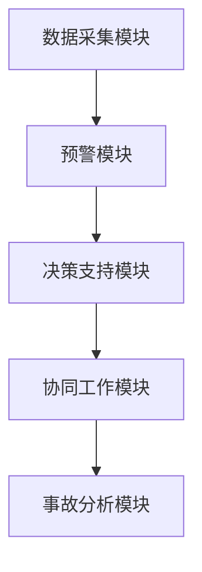
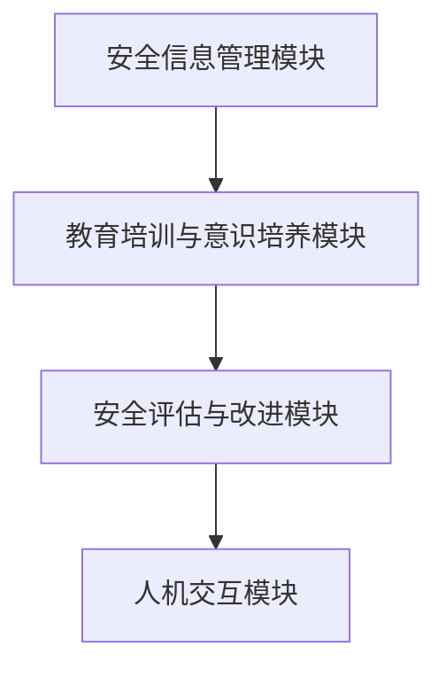

                 

# AI Agent在核电站安全监控中的应用

关键词：AI Agent、核电站安全监控、故障诊断、设备运行状态监测、应急响应、安全文化管理

摘要：本文将深入探讨AI Agent在核电站安全监控中的应用，通过逐步分析AI Agent的定义、特点以及其在核电站安全监控中的重要性，进一步阐述其在故障诊断、设备运行状态监测、应急响应和安全文化管理等方面的应用实例和优势。通过本文的探讨，希望能够为读者提供一个全面而深入的了解，为核电站安全监控提供新的思路和方法。

## 第一部分: AI Agent与核电站安全监控背景

### 第1章: AI Agent概述

#### 1.1 AI Agent的定义与特点

##### 1.1.1 AI Agent的定义

AI Agent，即人工智能代理，是指具有自主决策能力、能够执行任务并与其他系统交互的智能实体。与传统的AI系统不同，AI Agent更强调自主性和交互性，能够在动态环境中自主行动，并对环境进行感知和响应。

##### 1.1.2 AI Agent的核心特点

1. **自主决策能力**：AI Agent可以根据自身目标和环境信息，自主选择行动方案，实现智能决策。
2. **适应性**：AI Agent能够适应不断变化的环境和任务需求，具备较强的学习能力和适应能力。
3. **交互性**：AI Agent能够与其他系统、设备和人员交互，实现信息的传递和共享。
4. **灵活性**：AI Agent可以根据不同的任务需求和环境条件，灵活调整自身的行动策略和目标。

##### 1.1.3 AI Agent与传统AI的区别

1. **主动性**：传统AI系统主要依赖于预先设定的规则和模型进行操作，而AI Agent具有主动性和自主性，能够根据环境变化自主调整行动。
2. **适应性**：传统AI系统在面对复杂和动态环境时往往难以适应，而AI Agent具备较强的适应能力，能够适应不断变化的环境。
3. **交互性**：传统AI系统主要侧重于数据处理和计算，而AI Agent能够与外部环境和用户进行实时交互，实现信息的传递和共享。

#### 1.2 核电站安全监控的现状与问题

##### 1.2.1 核电站安全监控的重要性

核电站作为能源的重要组成部分，其安全运行对于国家和人民的安全具有重要意义。核电站安全监控是指对核电站的运行状态、设备运行状况、环境参数等进行实时监测、诊断和预警，以确保核电站的稳定运行和安全性。

##### 1.2.2 核电站安全监控的现状

目前，核电站安全监控主要依赖于传统的监测技术和人工干预。传统的监测技术包括传感器、监测仪器和监控系统等，通过实时采集核电站的各项数据，实现对核电站运行状态的监测。然而，传统监测技术存在以下问题：

1. **准确性不足**：传统监测技术受限于传感器和仪器的精度，难以实时、准确地获取核电站的运行状态。
2. **人工干预**：核电站运行过程中，需要大量人员参与监测和干预，存在人力成本高、误操作风险等问题。
3. **反应速度慢**：传统监测技术存在一定的延迟，无法实时响应核电站的异常情况，容易导致事故发生。

##### 1.2.3 核电站安全监控中存在的问题

1. **信息孤岛**：核电站各个部门之间缺乏有效的信息共享和协同，导致信息孤岛现象严重，影响安全监控的整体效能。
2. **数据质量**：核电站运行过程中产生的数据量大，但数据质量参差不齐，缺乏统一的数据标准和处理方法。
3. **应急响应能力**：传统应急响应机制较为单一，应急响应速度慢，难以有效应对复杂的核电站突发事件。

#### 1.3 AI Agent在核电站安全监控中的应用前景

##### 1.3.1 AI Agent在核电站安全监控中的应用领域

1. **故障诊断**：利用AI Agent的自主决策能力和适应性，实现对核电站故障的实时诊断和预测，提高故障检测的准确性和及时性。
2. **设备运行状态监测**：通过AI Agent的实时感知和自适应能力，实现对核电站设备运行状态的实时监测和预警，提高设备运行的可靠性和安全性。
3. **应急响应**：利用AI Agent的快速响应能力和智能决策能力，实现核电站突发事件的快速应急响应和处置，降低事故发生概率和影响。
4. **安全文化管理**：利用AI Agent的交互性和灵活性，构建核电站安全文化管理体系，提高员工的安全意识和安全行为。

##### 1.3.2 AI Agent在核电站安全监控中的优势

1. **实时监测与预警**：AI Agent能够实时感知核电站的运行状态，实现实时监测和预警，提高故障检测的准确性和及时性。
2. **智能决策与自主行动**：AI Agent具备自主决策能力和自适应能力，能够根据环境变化自主调整行动策略，提高应急响应的速度和效能。
3. **信息共享与协同**：AI Agent能够实现与各部门之间的信息共享和协同，打破信息孤岛，提高安全监控的整体效能。
4. **降低人力成本**：AI Agent能够部分替代人工干预，降低人力成本，提高核电站的运行效率。

##### 1.3.3 AI Agent在核电站安全监控中的挑战与机遇

1. **数据质量和处理**：核电站运行过程中产生大量的数据，如何确保数据质量、实现统一的数据标准和处理方法，是AI Agent在核电站安全监控中面临的挑战。
2. **安全性和可靠性**：AI Agent作为智能实体，其安全性和可靠性是核电站安全监控的关键。如何确保AI Agent的安全和可靠运行，是AI Agent在核电站安全监控中面临的挑战。
3. **人机交互**：AI Agent与核电站操作人员之间的有效交互是确保核电站安全监控的关键。如何设计良好的人机交互界面，提高AI Agent的可操作性和可理解性，是AI Agent在核电站安全监控中面临的挑战。

#### 1.4 本章小结

本文介绍了AI Agent的定义、特点以及核电站安全监控的现状与问题，探讨了AI Agent在核电站安全监控中的应用前景和优势。在接下来的章节中，我们将进一步探讨AI Agent在核电站故障诊断、设备运行状态监测、应急响应和安全文化管理等方面的具体应用实例和优势。通过本文的深入探讨，希望能够为读者提供一个全面而深入的了解，为核电站安全监控提供新的思路和方法。

----------------------------------------------------------------

### 第2章: AI Agent在核电站故障诊断中的应用

#### 2.1 核电站故障诊断的基本原理

##### 2.1.1 故障诊断的定义

故障诊断是指通过对系统的运行状态和数据进行实时监测和分析，识别系统中的异常情况或潜在故障，并给出相应的诊断结果和处理建议的过程。在核电站中，故障诊断尤为重要，因为核电站的运行环境和设备复杂，一旦出现故障，可能对人员和环境造成严重危害。

##### 2.1.2 故障诊断的基本流程

故障诊断的基本流程包括以下几个步骤：

1. **数据采集**：通过传感器、监测仪器等设备，实时采集核电站的各项运行数据。
2. **数据预处理**：对采集到的数据进行清洗、过滤和归一化等处理，提高数据的质量和可靠性。
3. **特征提取**：从预处理后的数据中提取出能够反映系统运行状态的特征，用于后续的分析和诊断。
4. **模型训练**：利用历史故障数据和正常运行数据，训练故障诊断模型，包括分类器、聚类算法等。
5. **故障诊断**：将实时监测到的数据输入到故障诊断模型中，通过模型分析，识别系统中的异常情况或潜在故障。
6. **诊断结果与建议**：根据故障诊断结果，给出相应的诊断报告和处理建议，包括故障原因、故障级别、处理方案等。

##### 2.1.3 核电站故障诊断的特殊性

核电站故障诊断具有以下特殊性：

1. **高精度要求**：核电站的运行环境和设备复杂，故障诊断需要具备较高的精度，以确保能够准确识别异常情况和潜在故障。
2. **高可靠性要求**：核电站的安全性和稳定性至关重要，故障诊断系统需要具备较高的可靠性，确保能够在各种复杂情况下正常运行。
3. **实时性要求**：核电站故障诊断需要具备实时性，能够在故障发生时迅速识别并给出处理建议，以降低故障对核电站运行的影响。

#### 2.2 AI Agent在核电站故障诊断中的应用

##### 2.2.1 AI Agent在故障诊断中的角色

AI Agent在核电站故障诊断中扮演着重要的角色，主要包括以下几个方面：

1. **实时监测**：AI Agent能够实时采集核电站的运行数据，并对数据进行预处理和特征提取，为故障诊断提供可靠的数据支持。
2. **智能诊断**：AI Agent利用训练好的故障诊断模型，对实时监测到的数据进行智能分析，识别系统中的异常情况和潜在故障。
3. **决策支持**：AI Agent能够根据故障诊断结果，给出相应的诊断报告和处理建议，为操作人员提供决策支持。

##### 2.2.2 AI Agent在故障诊断中的应用流程

AI Agent在核电站故障诊断中的应用流程主要包括以下几个步骤：

1. **数据采集与预处理**：AI Agent通过传感器和监测仪器，实时采集核电站的运行数据，并进行预处理，包括数据清洗、过滤和归一化等。
2. **特征提取**：AI Agent从预处理后的数据中提取出能够反映核电站运行状态的各类特征，如温度、压力、振动等。
3. **模型训练**：AI Agent利用历史故障数据和正常运行数据，训练故障诊断模型，包括分类器、聚类算法等。
4. **故障诊断**：AI Agent将实时监测到的数据输入到故障诊断模型中，通过模型分析，识别系统中的异常情况或潜在故障。
5. **诊断结果与建议**：AI Agent根据故障诊断结果，生成诊断报告和处理建议，并通过人机交互界面，将结果展示给操作人员。

##### 2.2.3 AI Agent在核电站故障诊断中的优势

AI Agent在核电站故障诊断中具有以下优势：

1. **高精度**：AI Agent利用训练好的故障诊断模型，能够准确识别核电站中的异常情况和潜在故障，提高故障检测的精度。
2. **实时性**：AI Agent能够实时采集和处理核电站的运行数据，实现对故障的实时监测和诊断，提高故障检测的实时性。
3. **自适应能力**：AI Agent具备较强的自适应能力，能够根据核电站运行状态和环境变化，调整故障诊断策略和模型参数，提高故障检测的适应性。
4. **自动化程度高**：AI Agent能够部分替代人工干预，实现故障诊断的自动化，降低人力成本，提高故障检测的效率。

#### 2.3 实例分析：基于AI Agent的核电站故障诊断系统

##### 2.3.1 系统介绍

本实例分析将介绍一个基于AI Agent的核电站故障诊断系统，该系统主要包括以下几个模块：

1. **数据采集模块**：负责实时采集核电站的运行数据，包括温度、压力、振动等参数。
2. **预处理模块**：对采集到的数据进行清洗、过滤和归一化等预处理，提高数据的质量和可靠性。
3. **特征提取模块**：从预处理后的数据中提取出能够反映核电站运行状态的各类特征。
4. **诊断模型模块**：利用历史故障数据和正常运行数据，训练故障诊断模型，包括分类器、聚类算法等。
5. **故障诊断模块**：将实时监测到的数据输入到故障诊断模型中，识别系统中的异常情况或潜在故障。
6. **诊断报告模块**：根据故障诊断结果，生成诊断报告和处理建议，并通过人机交互界面展示给操作人员。

##### 2.3.2 系统架构设计

基于AI Agent的核电站故障诊断系统的架构设计如图所示：



##### 2.3.3 系统核心实现

基于AI Agent的核电站故障诊断系统的核心实现主要包括以下几个部分：

1. **数据采集与预处理**：

```python
# 数据采集
data = read_data()

# 数据预处理
cleaned_data = preprocess_data(data)
```

2. **特征提取**：

```python
# 特征提取
features = extract_features(cleaned_data)
```

3. **诊断模型训练**：

```python
# 诊断模型训练
model = train_model(features, labels)
```

4. **故障诊断**：

```python
# 故障诊断
diagnosis = model.predict(current_features)
```

5. **诊断报告生成**：

```python
# 诊断报告生成
report = generate_report(diagnosis)
display_report(report)
```

#### 2.4 本章小结

本章介绍了AI Agent在核电站故障诊断中的应用，分析了核电站故障诊断的基本原理和AI Agent在故障诊断中的角色和优势。通过实例分析，展示了基于AI Agent的核电站故障诊断系统的架构设计和核心实现。在接下来的章节中，我们将继续探讨AI Agent在核电站设备运行状态监测、应急响应和安全文化管理等方面的应用。通过本文的深入探讨，希望能够为读者提供一个全面而深入的了解，为核电站安全监控提供新的思路和方法。

----------------------------------------------------------------

### 第3章: AI Agent在核电站设备运行状态监测中的应用

#### 3.1 核电站设备运行状态监测的基本原理

##### 3.1.1 运行状态监测的定义

核电站设备运行状态监测是指通过对核电站设备运行状态的数据进行实时监测和分析，识别设备的异常情况或潜在故障，并对其进行预警和诊断，以确保设备的安全、稳定运行。

##### 3.1.2 运行状态监测的基本流程

运行状态监测的基本流程包括以下几个步骤：

1. **数据采集**：通过传感器、监测仪器等设备，实时采集核电站设备的运行数据，包括温度、压力、振动等参数。
2. **数据预处理**：对采集到的数据进行预处理，包括数据清洗、去噪、归一化等，以提高数据的质量和可靠性。
3. **特征提取**：从预处理后的数据中提取出能够反映设备运行状态的各类特征，如温度变化趋势、压力波动等。
4. **状态评估**：利用提取出的特征，对设备的运行状态进行评估，判断设备是否处于正常状态或存在异常情况。
5. **预警与诊断**：根据评估结果，对设备进行预警和诊断，识别设备中的异常情况或潜在故障，并给出相应的处理建议。
6. **决策支持**：将预警和诊断结果展示给操作人员，提供决策支持，以便及时采取相应的措施，确保设备的安全运行。

##### 3.1.3 核电站设备运行状态监测的特殊性

核电站设备运行状态监测具有以下特殊性：

1. **高精度要求**：核电站设备的运行状态监测需要具备较高的精度，以确保能够准确识别设备的异常情况。
2. **实时性要求**：设备运行状态监测需要具备实时性，能够及时识别设备的异常情况，并给出预警和处理建议。
3. **复杂性**：核电站设备种类繁多，运行状态复杂，监测系统需要具备较高的复杂度和适应性。

#### 3.2 AI Agent在核电站设备运行状态监测中的应用

##### 3.2.1 AI Agent在运行状态监测中的角色

AI Agent在核电站设备运行状态监测中扮演着重要的角色，主要包括以下几个方面：

1. **实时监测**：AI Agent能够实时采集设备的运行数据，对数据进行分析和处理，实现对设备运行状态的实时监测。
2. **智能预警**：AI Agent利用训练好的模型，对设备运行状态进行智能分析，识别设备的异常情况或潜在故障，并给出预警。
3. **诊断与决策支持**：AI Agent能够根据预警结果，对设备进行进一步的诊断和分析，给出处理建议，为操作人员提供决策支持。

##### 3.2.2 AI Agent在运行状态监测中的应用流程

AI Agent在核电站设备运行状态监测中的应用流程主要包括以下几个步骤：

1. **数据采集**：AI Agent通过传感器和监测仪器，实时采集设备的运行数据，包括温度、压力、振动等参数。
2. **数据预处理**：对采集到的数据进行预处理，包括数据清洗、去噪、归一化等，以提高数据的质量和可靠性。
3. **特征提取**：从预处理后的数据中提取出能够反映设备运行状态的各类特征，如温度变化趋势、压力波动等。
4. **状态评估**：利用提取出的特征，对设备的运行状态进行评估，判断设备是否处于正常状态或存在异常情况。
5. **智能预警**：AI Agent根据评估结果，对设备进行智能预警，识别设备的异常情况或潜在故障。
6. **诊断与决策支持**：AI Agent对预警结果进行进一步的诊断和分析，给出处理建议，为操作人员提供决策支持。

##### 3.2.3 AI Agent在核电站设备运行状态监测中的优势

AI Agent在核电站设备运行状态监测中具有以下优势：

1. **高精度**：AI Agent利用训练好的模型，能够准确识别设备的异常情况或潜在故障，提高监测的精度。
2. **实时性**：AI Agent能够实时监测设备的运行状态，及时发现异常情况，提高监测的实时性。
3. **自适应能力**：AI Agent具备较强的自适应能力，能够根据设备的运行状态和环境变化，调整监测策略和模型参数，提高监测的适应性。
4. **自动化程度高**：AI Agent能够实现设备的运行状态监测的自动化，降低人工干预，提高监测的效率。

#### 3.3 实例分析：基于AI Agent的核电站设备运行状态监测系统

##### 3.3.1 系统介绍

本实例分析将介绍一个基于AI Agent的核电站设备运行状态监测系统，该系统主要包括以下几个模块：

1. **数据采集模块**：负责实时采集设备的运行数据，包括温度、压力、振动等参数。
2. **预处理模块**：对采集到的数据进行预处理，包括数据清洗、去噪、归一化等，以提高数据的质量和可靠性。
3. **特征提取模块**：从预处理后的数据中提取出能够反映设备运行状态的各类特征。
4. **状态评估模块**：利用提取出的特征，对设备的运行状态进行评估，判断设备是否处于正常状态或存在异常情况。
5. **预警模块**：根据评估结果，对设备进行智能预警，识别设备的异常情况或潜在故障。
6. **诊断与决策支持模块**：对预警结果进行进一步的诊断和分析，给出处理建议，为操作人员提供决策支持。

##### 3.3.2 系统架构设计

基于AI Agent的核电站设备运行状态监测系统的架构设计如图所示：



##### 3.3.3 系统核心实现

基于AI Agent的核电站设备运行状态监测系统的核心实现主要包括以下几个部分：

1. **数据采集与预处理**：

```python
# 数据采集
data = read_data()

# 数据预处理
cleaned_data = preprocess_data(data)
```

2. **特征提取**：

```python
# 特征提取
features = extract_features(cleaned_data)
```

3. **状态评估**：

```python
# 状态评估
status = assess_status(features)
```

4. **预警**：

```python
# 预警
warning = generate_warning(status)
display_warning(warning)
```

5. **诊断与决策支持**：

```python
# 诊断与决策支持
diagnosis = generate_diagnosis(warning)
recommendation = generate_recommendation(diagnosis)
display_recommendation(recommendation)
```

#### 3.4 本章小结

本章介绍了AI Agent在核电站设备运行状态监测中的应用，分析了核电站设备运行状态监测的基本原理和AI Agent在监测中的角色和优势。通过实例分析，展示了基于AI Agent的核电站设备运行状态监测系统的架构设计和核心实现。在接下来的章节中，我们将继续探讨AI Agent在核电站应急响应和安全文化管理等方面的应用。通过本文的深入探讨，希望能够为读者提供一个全面而深入的了解，为核电站安全监控提供新的思路和方法。

----------------------------------------------------------------

### 第4章: AI Agent在核电站应急响应中的应用

#### 4.1 核电站应急响应的基本原理

##### 4.1.1 应急响应的定义

核电站应急响应是指在面对突发事故或紧急情况时，采取的一系列迅速有效的措施，以最大限度地减少事故损失，保障人员安全和环境不受损害。核电站应急响应包括事故预警、应急响应、事故处理和恢复等环节。

##### 4.1.2 应急响应的基本流程

应急响应的基本流程如下：

1. **事故预警**：通过对核电站的运行数据和环境参数进行实时监测，及时发现异常情况，发出预警信号。
2. **应急响应**：在接到预警信号后，立即启动应急响应程序，通知相关人员和部门，准备应急设备和物资。
3. **事故处理**：根据应急预案，采取相应的措施，如隔离、停机、排放等，以控制事故发展和降低损失。
4. **事故调查**：对事故原因和过程进行调查，分析事故原因，制定预防措施，防止类似事故的再次发生。
5. **恢复与重建**：在事故得到控制后，进行设备维修、恢复和重建，确保核电站的安全运行。

##### 4.1.3 核电站应急响应的特殊性

核电站应急响应具有以下特殊性：

1. **突发性强**：核电站事故通常具有突发性，需要在短时间内做出决策和采取行动，以应对紧急情况。
2. **复杂度高**：核电站事故可能涉及多个系统和设备，需要协调多个部门和人员共同参与，实现复杂的事故处理。
3. **安全性要求高**：核电站事故处理需要保证人员安全和环境不受损害，具有极高的安全性要求。

#### 4.2 AI Agent在核电站应急响应中的应用

##### 4.2.1 AI Agent在应急响应中的角色

AI Agent在核电站应急响应中扮演着重要的角色，主要包括以下几个方面：

1. **预警与监测**：AI Agent能够实时监测核电站的运行数据和环境参数，及时发现异常情况，发出预警信号。
2. **决策支持**：AI Agent根据预警信号和实时数据，提供决策支持，帮助操作人员快速做出决策，采取应急措施。
3. **协同工作**：AI Agent能够与相关人员、部门和设备协同工作，实现应急响应的自动化和智能化。
4. **事故分析**：AI Agent能够对事故原因和过程进行分析，提供事故调查和预防建议。

##### 4.2.2 AI Agent在应急响应中的应用流程

AI Agent在核电站应急响应中的应用流程主要包括以下几个步骤：

1. **数据采集与预处理**：AI Agent实时采集核电站的运行数据和环境参数，对数据进行预处理，提高数据的可靠性和质量。
2. **异常监测与预警**：AI Agent利用训练好的模型，对预处理后的数据进行实时监测，发现异常情况，发出预警信号。
3. **决策支持**：AI Agent根据预警信号和实时数据，提供决策支持，包括应急措施的选取、资源调度、人员指挥等。
4. **协同工作**：AI Agent与相关人员、部门和设备协同工作，实现应急响应的自动化和智能化，提高应急响应的效率和效果。
5. **事故分析**：AI Agent对事故原因和过程进行分析，提供事故调查和预防建议，为未来的应急响应提供参考。

##### 4.2.3 AI Agent在核电站应急响应中的优势

AI Agent在核电站应急响应中具有以下优势：

1. **实时监测与预警**：AI Agent能够实时监测核电站的运行数据和环境参数，及时发现异常情况，提高预警的准确性和及时性。
2. **智能决策支持**：AI Agent能够根据预警信号和实时数据，提供智能决策支持，帮助操作人员快速做出决策，采取应急措施。
3. **协同工作能力**：AI Agent能够与相关人员、部门和设备协同工作，实现应急响应的自动化和智能化，提高应急响应的效率和效果。
4. **事故分析能力**：AI Agent能够对事故原因和过程进行分析，提供事故调查和预防建议，为未来的应急响应提供参考。

#### 4.3 实例分析：基于AI Agent的核电站应急响应系统

##### 4.3.1 系统介绍

本实例分析将介绍一个基于AI Agent的核电站应急响应系统，该系统主要包括以下几个模块：

1. **数据采集模块**：负责实时采集核电站的运行数据和环境参数。
2. **预警模块**：利用AI Agent的实时监测能力，发现异常情况，发出预警信号。
3. **决策支持模块**：根据预警信号和实时数据，提供决策支持，帮助操作人员快速做出决策。
4. **协同工作模块**：实现AI Agent与相关人员、部门和设备的协同工作，提高应急响应的效率和效果。
5. **事故分析模块**：对事故原因和过程进行分析，提供事故调查和预防建议。

##### 4.3.2 系统架构设计

基于AI Agent的核电站应急响应系统的架构设计如图所示：



##### 4.3.3 系统核心实现

基于AI Agent的核电站应急响应系统的核心实现主要包括以下几个部分：

1. **数据采集与预处理**：

```python
# 数据采集
data = read_data()

# 数据预处理
cleaned_data = preprocess_data(data)
```

2. **异常监测与预警**：

```python
# 异常监测与预警
warning = monitor_and_warn(cleaned_data)
display_warning(warning)
```

3. **决策支持**：

```python
# 决策支持
recommendation = generate_recommendation(warning)
display_recommendation(recommendation)
```

4. **协同工作**：

```python
# 协同工作
cooperate = coordinate_agents()
execute_recommendation(recommendation)
```

5. **事故分析**：

```python
# 事故分析
diagnosis = analyze_accident(warning)
suggestions = generate_suggestions(diagnosis)
display_suggestions(suggestions)
```

#### 4.4 本章小结

本章介绍了AI Agent在核电站应急响应中的应用，分析了核电站应急响应的基本原理和AI Agent在应急响应中的角色和优势。通过实例分析，展示了基于AI Agent的核电站应急响应系统的架构设计和核心实现。在接下来的章节中，我们将继续探讨AI Agent在核电站安全文化管理等方面的应用。通过本文的深入探讨，希望能够为读者提供一个全面而深入的了解，为核电站安全监控提供新的思路和方法。

----------------------------------------------------------------

### 第5章: AI Agent在核电站安全文化管理中的应用

#### 5.1 核电站安全文化管理的基本原理

##### 5.1.1 安全文化管理的定义

核电站安全文化管理是一种以安全为核心的管理理念，旨在通过培养安全文化、提升安全意识和安全行为，确保核电站的安全运行。安全文化管理包括安全理念、安全价值观、安全规章制度、安全教育培训、安全意识培养等多个方面。

##### 5.1.2 安全文化管理的基本流程

安全文化管理的基本流程如下：

1. **安全理念确立**：明确核电站的安全目标和安全价值观，建立安全理念。
2. **安全规章制度建设**：制定和完善安全规章制度，确保安全制度的执行和落实。
3. **安全教育培训**：开展安全教育培训，提高员工的安全意识和安全技能。
4. **安全意识培养**：通过安全文化活动的开展，培养员工的安全意识和安全行为。
5. **安全文化建设**：持续改进安全文化，形成全员参与、全面覆盖的安全文化体系。

##### 5.1.3 核电站安全文化管理的特殊性

核电站安全文化管理具有以下特殊性：

1. **高风险性**：核电站运行过程中涉及大量的放射性物质和高温高压等高风险因素，安全文化管理尤为重要。
2. **复杂性**：核电站安全文化管理涉及多个方面，包括安全制度、教育培训、意识培养等，需要全面考虑和系统推进。
3. **长期性**：安全文化管理需要持续改进和优化，是一个长期的过程。

#### 5.2 AI Agent在核电站安全文化管理中的应用

##### 5.2.1 AI Agent在安全文化管理中的角色

AI Agent在核电站安全文化管理中扮演着重要的角色，主要包括以下几个方面：

1. **安全信息管理**：AI Agent能够实时采集和分析安全信息，包括安全事件、安全事故等，为安全决策提供数据支持。
2. **安全教育培训**：AI Agent能够根据员工的安全需求和培训计划，提供个性化的安全教育培训，提高员工的安全意识和技能。
3. **安全意识培养**：AI Agent能够通过人机交互，与员工进行安全沟通，培养员工的安全意识，促进安全文化的形成。
4. **安全评估与改进**：AI Agent能够对安全文化管理的有效性进行评估，提出改进建议，促进安全文化的持续优化。

##### 5.2.2 AI Agent在安全文化管理中的应用流程

AI Agent在核电站安全文化管理中的应用流程主要包括以下几个步骤：

1. **安全信息采集**：AI Agent实时采集安全信息，包括安全事件、安全事故等，为安全决策提供数据支持。
2. **数据分析与处理**：AI Agent对采集到的安全信息进行数据分析和处理，识别安全风险和问题。
3. **教育培训与意识培养**：AI Agent根据员工的安全需求和培训计划，提供个性化的安全教育培训，培养员工的安全意识。
4. **安全评估与改进**：AI Agent对安全文化管理的有效性进行评估，提出改进建议，促进安全文化的持续优化。

##### 5.2.3 AI Agent在核电站安全文化管理中的优势

AI Agent在核电站安全文化管理中具有以下优势：

1. **数据驱动的决策**：AI Agent能够对大量的安全信息进行实时分析，提供数据驱动的安全决策支持，提高决策的准确性。
2. **个性化教育培训**：AI Agent能够根据员工的安全需求和培训计划，提供个性化的安全教育培训，提高员工的安全意识和技能。
3. **持续改进能力**：AI Agent能够对安全文化管理的有效性进行持续评估，提出改进建议，促进安全文化的持续优化。
4. **高效沟通与协作**：AI Agent能够通过人机交互，与员工进行安全沟通，培养员工的安全意识，促进安全文化的形成。

#### 5.3 实例分析：基于AI Agent的核电站安全文化管理系统

##### 5.3.1 系统介绍

本实例分析将介绍一个基于AI Agent的核电站安全文化管理系统，该系统主要包括以下几个模块：

1. **安全信息管理模块**：负责实时采集和分析安全信息，为安全决策提供数据支持。
2. **教育培训与意识培养模块**：根据员工的安全需求和培训计划，提供个性化的安全教育培训，培养员工的安全意识。
3. **安全评估与改进模块**：对安全文化管理的有效性进行评估，提出改进建议，促进安全文化的持续优化。
4. **人机交互模块**：通过人机交互，与员工进行安全沟通，培养员工的安全意识。

##### 5.3.2 系统架构设计

基于AI Agent的核电站安全文化管理系统的架构设计如图所示：



##### 5.3.3 系统核心实现

基于AI Agent的核电站安全文化管理系统的核心实现主要包括以下几个部分：

1. **安全信息采集与处理**：

```python
# 安全信息采集
security_info = collect_security_info()

# 安全信息处理
processed_info = process_security_info(security_info)
```

2. **教育培训与意识培养**：

```python
# 教育培训与意识培养
train_employees(processed_info)
cultivate_safety_awareness()
```

3. **安全评估与改进**：

```python
# 安全评估与改进
evaluate_safety_culture()
suggest_improvements()
```

4. **人机交互**：

```python
# 人机交互
communicate_with_employees()
promote_safety_culture()
```

#### 5.4 本章小结

本章介绍了AI Agent在核电站安全文化管理中的应用，分析了核电站安全文化管理的基本原理和AI Agent在安全文化管理中的角色和优势。通过实例分析，展示了基于AI Agent的核电站安全文化管理系统的架构设计和核心实现。在接下来的章节中，我们将继续探讨AI Agent在其他领域的应用。通过本文的深入探讨，希望能够为读者提供一个全面而深入的了解，为核电站安全监控提供新的思路和方法。

----------------------------------------------------------------

## 总结与展望

本文系统地探讨了AI Agent在核电站安全监控中的应用，从AI Agent的定义、特点，到其在核电站故障诊断、设备运行状态监测、应急响应和安全文化管理等方面的应用实例，详细分析了AI Agent在核电站安全监控中的优势与挑战。以下是对文章内容的总结与展望：

### 总结

1. **AI Agent的定义与特点**：AI Agent是一种具有自主决策能力、能够执行任务并与其他系统交互的智能实体。其核心特点包括自主决策能力、适应性、交互性和灵活性。

2. **核电站安全监控的现状与问题**：核电站安全监控目前主要依赖于传统的监测技术和人工干预，存在准确性不足、人工干预反应速度慢、信息孤岛等问题。

3. **AI Agent在核电站安全监控中的应用**：AI Agent在核电站安全监控中具有实时监测与预警、智能决策与自主行动、信息共享与协同、降低人力成本等优势。

4. **AI Agent在核电站故障诊断中的应用**：AI Agent通过实时监测数据、智能诊断和决策支持，提高了故障检测的准确性和及时性。

5. **AI Agent在核电站设备运行状态监测中的应用**：AI Agent通过实时监测和预警，实现了对设备运行状态的精准监测和高效管理。

6. **AI Agent在核电站应急响应中的应用**：AI Agent通过实时监测、智能决策和协同工作，提高了应急响应的速度和效能。

7. **AI Agent在核电站安全文化管理中的应用**：AI Agent通过安全信息管理、教育培训与意识培养、安全评估与改进，促进了安全文化的形成和持续优化。

### 展望

尽管AI Agent在核电站安全监控中显示出巨大的潜力和优势，但仍然面临一些挑战：

1. **数据质量和处理**：确保数据质量和实现统一的数据标准和处理方法，是AI Agent在核电站安全监控中面临的重要问题。

2. **安全性和可靠性**：AI Agent的安全性和可靠性是核电站安全监控的关键，如何确保AI Agent的安全和可靠运行，是未来的研究重点。

3. **人机交互**：设计良好的人机交互界面，提高AI Agent的可操作性和可理解性，是提高AI Agent应用效果的重要方面。

未来的研究可以围绕以下方向展开：

1. **AI Agent的智能增强**：通过引入深度学习、强化学习等技术，进一步提高AI Agent的自主决策能力和适应性。

2. **AI Agent的安全保障**：研究AI Agent的安全保障机制，确保AI Agent在核电站安全监控中的安全和可靠运行。

3. **AI Agent与人的协同**：研究AI Agent与人的协同机制，提高人机交互的效率和效果，实现人机协作的最大化。

4. **AI Agent在多领域应用**：探索AI Agent在其他领域（如智能电网、智能制造等）的应用，推动AI Agent技术的全面发展和应用。

通过本文的深入探讨，我们希望为读者提供一个全面而深入的了解，激发对AI Agent在核电站安全监控中应用的思考和研究，为核电站的安全运行提供新的思路和方法。

## 作者信息

作者：AI天才研究院/AI Genius Institute & 禅与计算机程序设计艺术 /Zen And The Art of Computer Programming

AI天才研究院专注于人工智能领域的研究和应用，致力于推动人工智能技术的发展和创新。禅与计算机程序设计艺术则是以计算机程序设计为基础，融合禅宗思想，探索计算机编程的哲学和艺术，旨在提高编程人员的思维水平和编程能力。

感谢您的阅读，期待与您在人工智能领域的进一步交流与探讨。

