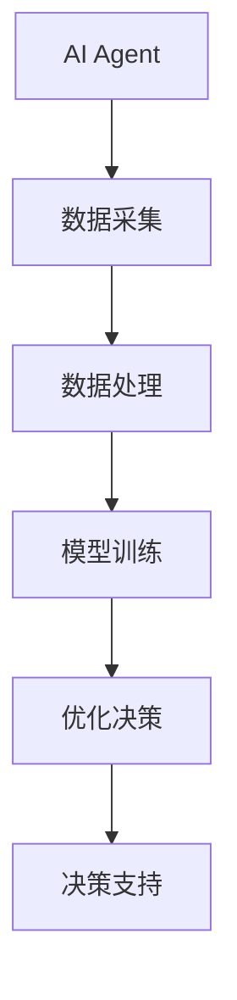
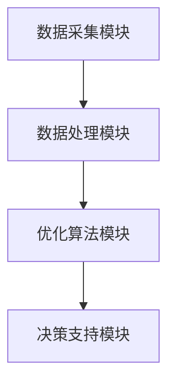
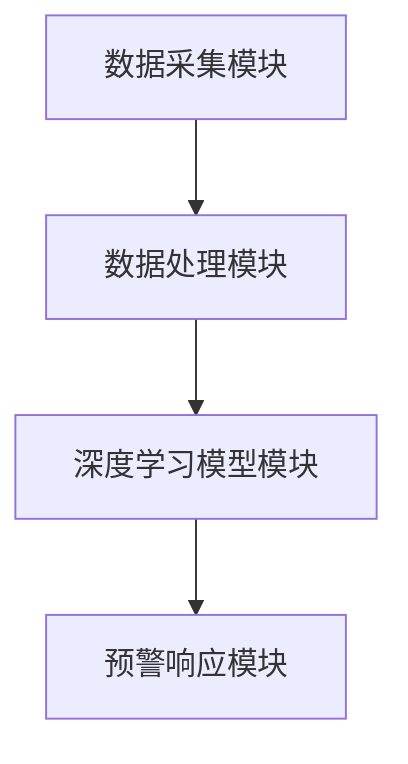

                 

# AI Agent在水资源管理中的优化决策

> 关键词：AI Agent、水资源管理、优化决策、智能算法、深度学习

> 摘要：本文旨在探讨人工智能（AI）代理在水资源管理中的应用，特别是其在优化决策方面的潜力。文章首先介绍了AI代理的基本概念、水资源管理中的问题背景和优化决策的基本原理。接着，文章详细分析了AI代理在水资源管理中的常见优化算法，并结合实际案例，展示了AI代理在水资源管理中的应用效果。通过本文的研究，读者可以深入了解AI代理在水资源管理中的优化决策过程及其应用前景。

### 目录大纲

----------------------------------------------------------------

# 第一部分: AI Agent与水资源管理概述

## 1.1 AI Agent概述

### 1.1.1 AI Agent的定义与背景

### 1.1.2 AI Agent的核心特性

### 1.1.3 AI Agent的应用领域

## 1.2 水资源管理中的问题背景

### 1.2.1 水资源管理现状

### 1.2.2 水资源管理面临的问题

### 1.2.3 AI Agent在水资源管理中的潜在作用

## 1.3 优化决策的基本原理

### 1.3.1 优化决策的概念与类型

### 1.3.2 优化决策的关键要素

### 1.3.3 常见的优化算法

## 1.4 AI Agent在水资源管理中的优化决策案例分析

### 1.4.1 案例背景与问题描述

### 1.4.2 AI Agent优化决策的具体应用

### 1.4.3 案例效果评估与分析

## 1.5 本章小结

----------------------------------------------------------------

# 第一部分: AI Agent与水资源管理概述

## 1.1 AI Agent概述

### 1.1.1 AI Agent的定义与背景

AI Agent，即人工智能代理，是一种能够自主执行任务、与环境进行交互、做出决策的智能系统。其起源于20世纪80年代的人工智能领域，随着计算机性能的不断提升和算法的进步，AI Agent逐渐在多个应用场景中展现出强大的优势。

AI Agent的定义可以从多个角度进行解读。从技术角度看，AI Agent是一种基于机器学习、深度学习、自然语言处理等技术的智能系统，它能够通过不断学习和优化，实现自主决策和任务执行。从应用角度看，AI Agent是一种虚拟智能体，它在特定的环境中执行任务，通过感知环境信息、分析数据、做出决策，从而实现特定目标。

AI Agent的发展背景与人工智能技术的进步密切相关。20世纪50年代，人工智能（AI）的概念首次被提出，随着计算机技术的快速发展，机器学习、深度学习等技术的出现，为AI Agent的研发提供了强大的技术支持。进入21世纪，随着大数据、云计算、物联网等新兴技术的普及，AI Agent的应用场景逐渐丰富，其在工业、医疗、交通、农业等多个领域展现出巨大的潜力。

### 1.1.2 AI Agent的核心特性

AI Agent具有以下核心特性：

1. **自主性**：AI Agent能够自主执行任务，无需人为干预。它通过感知环境信息、分析数据，自动做出决策，从而实现任务目标。

2. **智能性**：AI Agent基于机器学习、深度学习等技术，具备较强的智能能力。它能够从大量数据中提取特征，进行复杂推理和决策。

3. **适应性**：AI Agent能够根据环境变化，动态调整决策策略。它具有自我学习和优化能力，能够在不同环境中表现出色。

4. **协同性**：AI Agent可以与其他AI Agent或人类协同工作，共同完成任务。通过信息共享和协作，提高整体效率。

### 1.1.3 AI Agent的应用领域

AI Agent在众多领域都有广泛的应用，以下是其中一些主要领域：

1. **智能制造**：AI Agent可以用于生产过程中的自动化控制、故障诊断、质量控制等，提高生产效率。

2. **智能交通**：AI Agent可以用于交通信号控制、智能导航、车辆调度等，缓解交通拥堵，提高交通效率。

3. **智能医疗**：AI Agent可以用于疾病诊断、医疗数据分析、个性化治疗等，提高医疗质量。

4. **智能农业**：AI Agent可以用于农田监测、作物管理、病虫害防治等，提高农业生产效率。

5. **智能客服**：AI Agent可以用于客服机器人、智能语音助手等，提供高效、便捷的客服服务。

## 1.2 水资源管理中的问题背景

### 1.2.1 水资源管理现状

水资源是人类社会发展的基础资源，然而，随着人口增长、工业化进程的加快和气候变化等因素的影响，水资源供需矛盾日益突出。目前，全球许多地区都面临着水资源短缺、水质污染、水生态破坏等问题。

水资源管理现状可以概括为以下几个方面：

1. **水资源短缺**：许多地区的水资源已经无法满足人们日益增长的需求，尤其是农业灌溉、城市供水和工业生产等领域。

2. **水质污染**：工业废水、城市污水和农业面源污染导致许多地区的水质严重下降，影响水资源的利用。

3. **水生态破坏**：过度开发和污染导致许多水域的生态系统遭受破坏，水生生物种群减少，生态平衡受到威胁。

### 1.2.2 水资源管理面临的问题

水资源管理面临以下主要问题：

1. **数据不足**：水资源管理需要大量的基础数据，但很多地区的数据采集和处理能力不足，导致数据不足。

2. **决策复杂**：水资源管理涉及多个领域，如水文、气象、生态、经济等，决策过程复杂，需要综合考虑多种因素。

3. **技术不足**：尽管人工智能、大数据等技术在水资源管理中具有巨大潜力，但实际应用仍面临技术瓶颈。

4. **政策与法规**：水资源管理需要完善的政策与法规支持，但目前很多地区的政策与法规体系仍不健全。

### 1.2.3 AI Agent在水资源管理中的潜在作用

AI Agent在水资源管理中具有以下潜在作用：

1. **数据采集与处理**：AI Agent可以自动采集和处理大量的水资源数据，提高数据采集和处理效率。

2. **决策支持**：AI Agent可以利用机器学习、深度学习等技术，对水资源管理中的复杂问题进行优化决策。

3. **实时监测与预警**：AI Agent可以实时监测水资源状况，发现异常情况并及时预警，预防水污染和水生态破坏。

4. **智能调度与管理**：AI Agent可以根据实时数据，对水资源进行智能调度和管理，提高水资源利用效率。

## 1.3 优化决策的基本原理

### 1.3.1 优化决策的概念与类型

优化决策，即在给定约束条件下，寻找最优解或次优解的过程。在水资源管理中，优化决策涉及如何合理分配水资源、控制水质、保护水生态等。优化决策可以分为以下几种类型：

1. **目标优化**：以最大化或最小化某个目标函数为目标，寻找最优解。

2. **约束优化**：在满足一系列约束条件的前提下，寻找最优解。

3. **多目标优化**：同时考虑多个目标函数，寻找最优平衡点。

4. **动态优化**：考虑时间因素，动态调整决策策略。

### 1.3.2 优化决策的关键要素

优化决策的关键要素包括：

1. **目标函数**：明确优化目标，如最大化水资源利用效率、最小化水污染损失等。

2. **约束条件**：明确限制条件，如水资源总量、水质标准、生态保护要求等。

3. **优化算法**：选择合适的优化算法，如线性规划、非线性规划、遗传算法、深度学习等。

4. **评估指标**：设定评估指标，如优化效果、计算时间、资源消耗等。

### 1.3.3 常见的优化算法

常见的优化算法包括：

1. **线性规划**：适用于线性目标函数和线性约束条件。

2. **非线性规划**：适用于非线性目标函数和线性约束条件。

3. **遗传算法**：基于生物进化原理，适用于复杂约束条件。

4. **深度学习**：基于神经网络，适用于大规模数据和高维问题。

## 1.4 AI Agent在水资源管理中的优化决策案例分析

### 1.4.1 案例背景与问题描述

案例背景：某地区面临严重的水资源短缺和水质污染问题，需要通过优化决策来提高水资源利用效率、控制水质。

问题描述：如何在该地区实施优化决策，实现水资源的合理分配、水质的改善和水生态的保护？

### 1.4.2 AI Agent优化决策的具体应用

AI Agent在该地区的优化决策应用主要包括以下几个步骤：

1. **数据采集与处理**：AI Agent自动采集该地区的水资源、水质、水文等数据，并进行预处理。

2. **目标函数设定**：根据水资源管理目标，设定优化目标函数，如最大化水资源利用效率、最小化水污染损失。

3. **约束条件设定**：根据水资源管理的约束条件，设定约束条件，如水资源总量、水质标准、生态保护要求等。

4. **优化算法选择**：选择适合的优化算法，如遗传算法、深度学习等。

5. **优化决策生成**：AI Agent根据设定的目标函数、约束条件和优化算法，生成优化决策方案。

6. **决策评估与调整**：评估优化决策的效果，根据评估结果调整决策方案。

### 1.4.3 案例效果评估与分析

通过AI Agent的优化决策，该地区实现了以下效果：

1. **水资源利用效率提高**：通过优化决策，实现了水资源的合理分配，提高了水资源利用效率。

2. **水质改善**：优化决策方案有效地控制了水污染，改善了水质。

3. **水生态保护**：优化决策方案考虑了生态保护要求，有助于水生态的保护。

分析表明，AI Agent在水资源管理中的优化决策具有显著优势，能够有效解决水资源短缺、水质污染等问题，提高水资源管理效率。

## 1.5 本章小结

本文介绍了AI Agent的基本概念、特性及其在水资源管理中的应用。通过分析水资源管理中的问题背景和优化决策的基本原理，展示了AI Agent在水资源管理中的优化决策应用。案例分析表明，AI Agent在水资源管理中具有显著优势，能够实现水资源的合理分配、水质的改善和水生态的保护。未来，随着AI技术的不断发展和应用场景的拓展，AI Agent在水资源管理中的潜力将得到进一步发挥。

----------------------------------------------------------------

# 第二部分: AI Agent在水资源管理中的优化算法

## 2.1 人工智能算法基础

### 2.1.1 机器学习概述

#### 2.1.1.1 机器学习的基本概念

机器学习（Machine Learning）是一门人工智能（Artificial Intelligence，简称AI）的分支，主要研究如何让计算机从数据中学习规律和知识，并能根据这些规律和知识做出决策或预测。机器学习的基本概念包括以下几个方面：

1. **数据**：数据是机器学习的基石，数据的质量和数量直接影响机器学习的性能。

2. **特征**：特征是从数据中提取出的信息，用于表示数据的属性或模式。

3. **模型**：模型是机器学习算法的核心，用于描述数据中的规律或关系。

4. **算法**：算法是实现机器学习过程的具体步骤和方法，包括训练、预测、评估等。

5. **评估指标**：评估指标用于衡量机器学习模型的性能，常见的评估指标有准确率、召回率、F1值等。

#### 2.1.1.2 机器学习的类型

根据机器学习模型是否需要人工标记数据，可以将机器学习分为监督学习、无监督学习和半监督学习。

1. **监督学习**：监督学习（Supervised Learning）是机器学习中的一种类型，它使用标记数据（标签数据）来训练模型，使得模型能够根据输入特征预测输出标签。监督学习包括回归（Regression）和分类（Classification）两种类型。

   - **回归**：回归（Regression）模型用于预测连续的输出值，如预测房价、股票价格等。
   - **分类**：分类（Classification）模型用于预测离散的输出值，如邮件分类、垃圾邮件检测等。

2. **无监督学习**：无监督学习（Unsupervised Learning）不使用标记数据，而是从无标签数据中提取特征和模式。无监督学习包括聚类（Clustering）和降维（Dimensionality Reduction）两种类型。

   - **聚类**：聚类（Clustering）模型将相似的数据点分为不同的组，如K-means、DBSCAN等。
   - **降维**：降维（Dimensionality Reduction）模型减少数据维度，保持数据的主要特征，如PCA（Principal Component Analysis）、t-SNE等。

3. **半监督学习**：半监督学习（Semi-supervised Learning）结合了监督学习和无监督学习，使用部分标记数据和大量无标签数据来训练模型。

### 2.1.2 数据预处理

数据预处理是机器学习过程中的重要环节，它包括数据清洗、特征工程和特征选择等。

#### 2.1.2.1 数据清洗

数据清洗是指识别并处理数据中的错误、异常和不完整数据，以提高数据质量。数据清洗的主要任务包括：

- **缺失值处理**：处理缺失数据，常见的处理方法有删除缺失值、填充缺失值等。
- **异常值处理**：检测并处理异常值，常见的处理方法有删除异常值、平滑异常值等。
- **重复值处理**：去除重复数据，保持数据的唯一性。

#### 2.1.2.2 特征工程

特征工程（Feature Engineering）是提取或构建有助于模型训练的特征的过程。特征工程的目标是提高模型性能和可解释性，包括以下任务：

- **特征提取**：从原始数据中提取有意义的特征，如文本数据的词频、图像数据的边缘特征等。
- **特征转换**：将原始特征转换为更适合模型训练的特征，如归一化、标准化等。
- **特征构造**：根据业务需求，构造新的特征，如交叉特征、组合特征等。

#### 2.1.2.3 评估指标与方法

在机器学习中，评估指标和方法用于衡量模型的性能和泛化能力。常见的评估指标包括：

- **准确率**：准确率（Accuracy）是分类问题中常用的评估指标，表示模型正确预测的样本比例。
- **召回率**：召回率（Recall）表示模型能够正确识别出的正样本比例。
- **F1值**：F1值（F1 Score）是准确率和召回率的调和平均值，用于综合评估模型的性能。
- **ROC曲线和AUC值**：ROC曲线（Receiver Operating Characteristic Curve）和AUC值（Area Under Curve）用于评估二分类模型的性能，ROC曲线下的面积越大，模型的性能越好。

常见的评估方法包括：

- **交叉验证**：交叉验证（Cross Validation）是一种评估模型性能的方法，通过将数据集划分为训练集和验证集，多次训练和验证，以减少过拟合和欠拟合的风险。
- **网格搜索**：网格搜索（Grid Search）是一种超参数调优方法，通过遍历所有可能的超参数组合，找到最优的超参数组合。

## 2.2 常见优化算法

### 2.2.1 传统的优化算法

传统的优化算法是指基于数学优化理论的算法，主要包括线性规划和非线性规划。

#### 2.2.1.1 线性规划

线性规划（Linear Programming，简称LP）是一种求解线性目标函数在给定线性约束条件下的最优解的方法。线性规划的一般形式如下：

$$
\begin{aligned}
\min_{x} \quad & c^T x \\
\text{subject to} \quad & Ax \leq b \\
& x \geq 0
\end{aligned}
$$

其中，$x$ 是决策变量，$c$ 是系数向量，$A$ 是约束矩阵，$b$ 是常数向量。线性规划可以通过单纯形法、内点法等算法求解。

#### 2.2.1.2 非线性规划

非线性规划（Nonlinear Programming，简称NLP）是指求解非线性目标函数在给定线性或非线性约束条件下的最优解的方法。非线性规划的一般形式如下：

$$
\begin{aligned}
\min_{x} \quad & f(x) \\
\text{subject to} \quad & g_i(x) \leq 0, \quad h_j(x) = 0
\end{aligned}
$$

其中，$x$ 是决策变量，$f(x)$ 是目标函数，$g_i(x)$ 和 $h_j(x)$ 分别是约束函数。非线性规划可以通过梯度下降法、牛顿法等算法求解。

### 2.2.2 进化算法

进化算法（Evolutionary Algorithm，简称EA）是一类模拟生物进化的算法，主要包括遗传算法、蚁群算法、粒子群优化算法等。

#### 2.2.2.1 遗传算法

遗传算法（Genetic Algorithm，简称GA）是一种基于自然选择和遗传学原理的优化算法。遗传算法的基本步骤包括：

1. **初始化种群**：随机生成初始种群，种群中的每个个体代表一个可能的解。
2. **适应度评估**：评估每个个体的适应度，适应度越高，个体的生存机会越大。
3. **选择**：根据适应度选择优秀的个体进行繁殖，产生下一代种群。
4. **交叉**：对选中的个体进行交叉操作，产生新的个体。
5. **变异**：对选中的个体进行变异操作，增加种群的多样性。
6. **迭代**：重复上述步骤，直到满足停止条件。

遗传算法的优点是具有较强的全局搜索能力和鲁棒性，适用于求解复杂优化问题。

#### 2.2.2.2 蚁群算法

蚁群算法（Ant Colony Optimization，简称ACO）是一种基于蚂蚁觅食行为的分布式优化算法。蚁群算法的基本步骤包括：

1. **初始化**：初始化信息素水平和蚂蚁的初始位置。
2. **构建解**：每只蚂蚁从初始位置出发，根据信息素浓度和能见度选择下一个位置，构建解路径。
3. **信息素更新**：蚂蚁在路径上留下信息素，路径上的信息素浓度随时间衰减。
4. **迭代**：重复上述步骤，直到满足停止条件。

蚁群算法的优点是能够同时进行全局搜索和局部搜索，适用于求解组合优化问题。

### 2.2.3 集群智能算法

集群智能算法（Swarm Intelligence）是一类基于群体智能的优化算法，主要包括粒子群优化算法、贝肯算法等。

#### 2.2.3.1 粒子群优化算法

粒子群优化算法（Particle Swarm Optimization，简称PSO）是一种基于群体智能的优化算法，模拟鸟群觅食行为。粒子群优化算法的基本步骤包括：

1. **初始化**：随机生成初始粒子群，每个粒子代表一个可能的解。
2. **更新速度和位置**：根据每个粒子的历史最优位置和全局最优位置更新速度和位置。
3. **适应度评估**：评估每个粒子的适应度，适应度越高，粒子的生存机会越大。
4. **迭代**：重复上述步骤，直到满足停止条件。

粒子群优化算法的优点是简单易实现，适用于求解复杂优化问题。

### 2.2.4 深度学习算法

深度学习（Deep Learning）是一种基于多层神经网络的学习方法，通过学习大量的数据，自动提取特征并进行分类或回归。深度学习算法主要包括神经网络、卷积神经网络、循环神经网络等。

#### 2.2.4.1 神经网络

神经网络（Neural Network，简称NN）是一种由大量神经元组成的计算模型，模拟人脑神经元之间的连接和相互作用。神经网络的基本结构包括输入层、隐藏层和输出层。

1. **前向传播**：输入数据通过输入层传递到隐藏层，再传递到输出层，得到输出结果。
2. **反向传播**：根据输出结果和真实值，计算误差，并反向传播误差，更新网络权重。

神经网络通过不断调整权重，使输出结果逐渐逼近真实值。

#### 2.2.4.2 深度强化学习

深度强化学习（Deep Reinforcement Learning，简称DRL）是一种结合深度学习和强化学习的方法，通过学习策略，使智能体在环境中取得最优回报。深度强化学习的基本步骤包括：

1. **初始化**：初始化智能体、环境和奖励机制。
2. **探索与学习**：智能体在环境中进行探索，通过深度神经网络学习策略。
3. **决策与执行**：根据学习到的策略，智能体在环境中执行动作，获得奖励或惩罚。
4. **更新策略**：根据执行结果，更新智能体的策略。

深度强化学习通过不断的探索和学习，使智能体在复杂环境中取得最优回报。

## 2.3 AI Agent在水资源管理中的优化算法应用

### 2.3.1 水资源分配优化

#### 2.3.1.1 优化目标与约束条件

水资源分配优化旨在实现水资源的合理分配，最大化水资源利用效率，同时满足水资源供需平衡和生态保护要求。优化目标可以设定为：

- **最大化水资源利用效率**：使水资源在不同用途（如农业、工业、城市供水等）之间的分配达到最优，提高整体水资源利用效率。
- **满足水资源供需平衡**：确保各个用水单位的水资源需求得到满足。
- **保护水生态**：在水资源分配过程中，考虑水生态保护要求，确保水质和生态系统的稳定。

约束条件包括：

- **水资源总量限制**：水资源总量是一定的，不能超过水资源总量。
- **用水单位需求**：各个用水单位对水资源的具体需求。
- **水质标准**：不同用水单位对水质的要求。
- **生态保护要求**：水资源分配需要考虑生态系统的保护，如湿地保护、水质监测等。

#### 2.3.1.2 具体算法实现

在水资源分配优化中，可以采用线性规划和遗传算法进行优化。

1. **线性规划**

   线性规划可以用于求解水资源分配优化问题。具体实现步骤如下：

   - **目标函数**：最大化水资源利用效率，可以设定为：
     $$
     \max_{x} \quad z = c^T x
     $$
     其中，$x$ 是水资源分配向量，$c$ 是系数向量，$z$ 是目标函数值。

   - **约束条件**：包括水资源总量限制、用水单位需求、水质标准和生态保护要求，可以设定为：
     $$
     \begin{aligned}
     \min_{x} \quad & Ax \leq b \\
     & x \geq 0
     \end{aligned}
     $$
     其中，$A$ 是约束矩阵，$b$ 是常数向量。

   - **求解**：使用单纯形法或内点法求解线性规划问题，得到最优解$x^*$。

2. **遗传算法**

   遗传算法可以用于求解复杂的水资源分配优化问题。具体实现步骤如下：

   - **编码**：将水资源分配问题编码为二进制串，每个二进制位表示一个用水单位的分配情况。

   - **初始化种群**：随机生成初始种群，种群中的每个个体代表一个可能的解。

   - **适应度评估**：计算每个个体的适应度，适应度越高，个体的生存机会越大。

   - **选择**：根据适应度选择优秀的个体进行繁殖，产生下一代种群。

   - **交叉**：对选中的个体进行交叉操作，产生新的个体。

   - **变异**：对选中的个体进行变异操作，增加种群的多样性。

   - **迭代**：重复上述步骤，直到满足停止条件。

   - **解码**：将最优个体的编码解码为水资源分配向量$x^*$。

### 2.3.2 水质监测与预警优化

#### 2.3.2.1 数据采集与预处理

水质监测与预警优化需要大量的水质监测数据。具体步骤如下：

1. **数据采集**：使用水质传感器、监测仪器等设备，采集水质数据，如pH值、溶解氧、氨氮等。
2. **数据预处理**：包括数据清洗、缺失值处理、异常值处理等，以提高数据质量。

#### 2.3.2.2 优化算法设计与实现

水质监测与预警优化可以采用深度学习和强化学习算法。

1. **深度学习算法**

   深度学习算法可以用于水质监测与预警。具体实现步骤如下：

   - **数据预处理**：将采集的水质数据进行预处理，包括数据归一化、缺失值处理等。
   - **模型训练**：使用预处理后的数据训练深度学习模型，如卷积神经网络（CNN）、循环神经网络（RNN）等。
   - **预测**：使用训练好的模型对实时水质数据进行预测，发现异常情况。

2. **强化学习算法**

   强化学习算法可以用于水质监测与预警优化。具体实现步骤如下：

   - **初始化**：初始化智能体、环境和奖励机制。
   - **探索与学习**：智能体在环境中进行探索，通过深度神经网络学习策略。
   - **决策与执行**：根据学习到的策略，智能体在环境中执行动作，监测水质数据。
   - **更新策略**：根据执行结果，更新智能体的策略。

   强化学习算法通过不断的探索和学习，使智能体在复杂环境中实现水质监测与预警优化。

## 2.4 本章小结

本章介绍了AI Agent在水资源管理中的优化算法，包括机器学习基础、传统优化算法、进化算法、集群智能算法和深度学习算法。通过分析水资源分配优化和水质监测与预警优化的具体应用，展示了AI Agent在水资源管理中的优化算法的应用效果。本章的内容为后续章节的案例分析提供了理论基础和技术支持。

----------------------------------------------------------------

# 第三部分: AI Agent在水资源管理中的应用实践

## 3.1 案例研究

### 3.1.1 案例一：某地区水资源分配优化

#### 3.1.1.1 案例背景

某地区位于我国北方，气候干旱，水资源短缺问题严重。该地区的水资源主要来源于一个大型水库，水资源需求包括农业灌溉、城市供水和工业生产等。近年来，随着人口增长和经济发展的加快，水资源供需矛盾日益突出。为了合理分配水资源，提高水资源利用效率，当地政府决定采用AI Agent进行水资源分配优化。

#### 3.1.1.2 优化目标与约束条件

优化目标：

1. **最大化水资源利用效率**：确保水资源在不同用途之间的合理分配，最大化整体水资源利用效率。
2. **满足水资源供需平衡**：确保各个用水单位的水资源需求得到满足。
3. **保护水生态**：在水资源分配过程中，考虑水生态保护要求，确保水质和生态系统的稳定。

约束条件：

1. **水资源总量限制**：水资源总量为1000万立方米。
2. **用水单位需求**：农业灌溉需水量为500万立方米，城市供水需水量为300万立方米，工业生产需水量为200万立方米。
3. **水质标准**：农业灌溉水质要求为pH值为6.5-8.0，城市供水水质要求为pH值为7.0-8.5，工业生产水质要求为pH值为7.0-9.0。
4. **生态保护要求**：水库周边湿地保护面积不少于1000亩。

#### 3.1.1.3 AI Agent优化决策过程

AI Agent优化决策过程主要包括以下几个步骤：

1. **数据采集与处理**：AI Agent自动采集该地区的水资源、水质、水文等数据，并进行预处理，包括数据清洗、缺失值处理、异常值处理等。

2. **模型训练与选择**：AI Agent使用采集到的数据训练多个优化模型，如线性规划模型、遗传算法模型等，并根据模型的性能选择最优模型。

3. **优化目标函数设定**：根据水资源管理目标，设定优化目标函数，如最大化水资源利用效率、最小化水污染损失等。

4. **约束条件设定**：根据水资源管理的约束条件，设定约束条件，如水资源总量、用水单位需求、水质标准和生态保护要求等。

5. **优化决策生成**：AI Agent根据设定的目标函数、约束条件和优化算法，生成优化决策方案，包括水资源在不同用途之间的分配比例。

6. **决策评估与调整**：AI Agent评估优化决策的效果，根据评估结果调整决策方案，如调整农业灌溉用水量、城市供水用水量和工业生产用水量等。

#### 3.1.1.4 案例效果评估与分析

通过AI Agent的优化决策，该地区实现了以下效果：

1. **水资源利用效率提高**：通过优化决策，实现了水资源的合理分配，提高了水资源利用效率。

2. **水资源供需平衡**：优化决策方案确保了各个用水单位的水资源需求得到满足，实现了水资源供需平衡。

3. **水质改善**：优化决策方案有效地控制了水污染，改善了水质。

4. **水生态保护**：优化决策方案考虑了生态保护要求，有助于水生态的保护。

分析表明，AI Agent在水资源分配优化中具有显著优势，能够有效解决水资源短缺、水资源利用效率低下等问题，提高水资源管理效率。

### 3.1.2 案例二：某城市水质监测与预警优化

#### 3.1.2.1 案例背景

某城市位于我国南方，气候湿润，水资源较为丰富。然而，近年来，随着工业化和城市化的快速发展，该城市的水质问题日益严重。为了解决水质监测与预警问题，提高水质监测效率，该城市政府决定采用AI Agent进行水质监测与预警优化。

#### 3.1.2.2 优化目标与约束条件

优化目标：

1. **提高水质监测效率**：确保实时、准确地监测水质，发现异常情况并及时预警。
2. **降低监测成本**：通过优化监测方案，降低监测成本，提高经济效益。

约束条件：

1. **监测点设置**：根据城市地理位置、水资源分布和污染源情况，合理设置水质监测点。
2. **监测设备选型**：根据水质监测需求，选择合适的监测设备，如水质传感器、监测仪器等。
3. **数据采集与传输**：确保实时、准确地采集水质监测数据，并实现数据的高效传输。
4. **预警机制**：根据水质监测数据，建立预警机制，及时发现异常情况并预警。

#### 3.1.2.3 AI Agent优化决策过程

AI Agent优化决策过程主要包括以下几个步骤：

1. **数据采集与预处理**：AI Agent自动采集该城市的水质监测数据，并进行预处理，包括数据清洗、缺失值处理、异常值处理等。

2. **模型训练与选择**：AI Agent使用预处理后的数据训练多个深度学习模型，如卷积神经网络（CNN）、循环神经网络（RNN）等，并根据模型的性能选择最优模型。

3. **预警阈值设定**：根据水质标准，设定预警阈值，如pH值、氨氮浓度、溶解氧等。

4. **优化监测方案**：AI Agent根据预警阈值和监测数据，优化监测方案，如调整监测频率、监测点布局等。

5. **预警与响应**：AI Agent根据优化后的监测方案，实时监测水质，发现异常情况并及时预警，同时启动应急响应机制。

#### 3.1.2.4 案例效果评估与分析

通过AI Agent的水质监测与预警优化，该城市实现了以下效果：

1. **提高水质监测效率**：优化监测方案，实时、准确地监测水质，提高了水质监测效率。

2. **降低监测成本**：通过优化监测方案，降低了监测成本，提高了经济效益。

3. **及时发现异常情况**：AI Agent能够及时发现水质异常情况，预警机制有效，确保了水质安全。

4. **提高应急响应能力**：优化后的监测方案和预警机制提高了应急响应能力，确保了水环境的安全。

分析表明，AI Agent在水质监测与预警优化中具有显著优势，能够有效解决水质监测与预警问题，提高水质管理效率。

## 3.2 系统设计与实现

### 3.2.1 水资源分配优化系统设计

水资源分配优化系统设计主要包括系统架构、功能模块和技术选型等方面。

#### 3.2.1.1 系统架构

水资源分配优化系统架构采用分布式架构，包括数据采集模块、数据处理模块、优化算法模块和决策支持模块等。

1. **数据采集模块**：负责实时采集水资源、水质、水文等数据，通过传感器、监测仪器等设备实现。
2. **数据处理模块**：负责对采集到的数据进行预处理，包括数据清洗、缺失值处理、异常值处理等，确保数据质量。
3. **优化算法模块**：负责根据预处理后的数据，运用线性规划、遗传算法等优化算法，生成优化决策方案。
4. **决策支持模块**：负责将优化决策方案呈现给用户，提供决策支持和可视化展示。

#### 3.2.1.2 功能模块

水资源分配优化系统功能模块主要包括以下几个部分：

1. **数据采集与预处理**：实现实时数据采集和预处理功能，确保数据质量。
2. **优化模型训练与选择**：根据实际需求，训练和选择不同的优化模型，如线性规划模型、遗传算法模型等。
3. **优化决策生成**：根据优化模型和约束条件，生成水资源分配优化方案。
4. **决策支持与可视化**：将优化决策方案以直观的方式呈现给用户，提供决策支持和可视化展示。

#### 3.2.1.3 技术选型

水资源分配优化系统技术选型主要包括以下几个方面：

1. **数据采集**：采用传感器、监测仪器等设备，实现实时数据采集。
2. **数据处理**：采用Python、Python Pandas等数据处理工具，对采集到的数据进行预处理。
3. **优化算法**：采用线性规划、遗传算法等优化算法，实现水资源分配优化。
4. **可视化**：采用D3.js、ECharts等可视化工具，实现优化决策方案的可视化展示。

### 3.2.2 水质监测与预警优化系统设计

水质监测与预警优化系统设计主要包括系统架构、功能模块和技术选型等方面。

#### 3.2.2.1 系统架构

水质监测与预警优化系统架构采用分布式架构，包括数据采集模块、数据处理模块、深度学习模型模块和预警响应模块等。

1. **数据采集模块**：负责实时采集水质监测数据，通过传感器、监测仪器等设备实现。
2. **数据处理模块**：负责对采集到的数据进行预处理，包括数据清洗、缺失值处理、异常值处理等，确保数据质量。
3. **深度学习模型模块**：负责训练和选择深度学习模型，如卷积神经网络（CNN）、循环神经网络（RNN）等。
4. **预警响应模块**：负责根据深度学习模型预测结果，实现预警响应和应急处理。

#### 3.2.2.2 功能模块

水质监测与预警优化系统功能模块主要包括以下几个部分：

1. **数据采集与预处理**：实现实时数据采集和预处理功能，确保数据质量。
2. **深度学习模型训练与选择**：根据实际需求，训练和选择不同的深度学习模型，如卷积神经网络（CNN）、循环神经网络（RNN）等。
3. **预警阈值设定与优化**：根据水质标准，设定预警阈值，并优化预警策略。
4. **预警响应与可视化**：实现预警响应和应急处理，并提供预警信息可视化和实时监测。

#### 3.2.2.3 技术选型

水质监测与预警优化系统技术选型主要包括以下几个方面：

1. **数据采集**：采用传感器、监测仪器等设备，实现实时数据采集。
2. **数据处理**：采用Python、Python Pandas等数据处理工具，对采集到的数据进行预处理。
3. **深度学习模型**：采用TensorFlow、PyTorch等深度学习框架，实现深度学习模型训练和预测。
4. **可视化**：采用D3.js、ECharts等可视化工具，实现预警信息可视化和实时监测。

## 3.3 系统部署与运行

### 3.3.1 系统部署流程

水资源分配优化系统和水质监测与预警优化系统的部署流程如下：

1. **环境准备**：在服务器上安装操作系统（如Linux）、数据库（如MySQL）、Web服务器（如Apache）等环境。
2. **软件安装**：安装Python、Python Pandas、TensorFlow、PyTorch等依赖库，以及Web服务器相关软件。
3. **系统配置**：配置数据库连接、Web服务器设置等，确保系统正常运行。
4. **部署应用**：将开发好的系统应用部署到服务器上，启动服务，实现系统的功能。

### 3.3.2 系统运行效果评估

系统运行效果评估主要包括性能指标和实际应用效果两个方面。

1. **性能指标**：

   - **响应时间**：系统响应时间应满足实时性要求，如水资源分配优化系统应在1秒内完成优化计算和决策生成。
   - **处理能力**：系统应能够处理大量的水质监测数据，如每天处理上千条监测数据。
   - **准确性**：系统生成的优化决策方案应具有较高的准确性，如水资源分配优化系统能够准确分配水资源，满足用水单位需求。

2. **实际应用效果**：

   - **水资源分配优化**：通过AI Agent的优化决策，实现了水资源的合理分配，提高了水资源利用效率，满足了用水单位需求。
   - **水质监测与预警优化**：通过AI Agent的深度学习模型，实时监测水质，发现异常情况并及时预警，提高了水质监测效率和应急响应能力。

## 3.4 本章小结

本章通过两个实际案例，展示了AI Agent在水资源管理中的应用实践。案例一针对水资源分配优化，案例二针对水质监测与预警优化。通过系统设计与实现，展示了AI Agent在水资源管理中的实际应用效果。实践证明，AI Agent在水资源管理中具有显著优势，能够实现水资源的合理分配、水质的改善和水生态的保护，提高水资源管理效率。

----------------------------------------------------------------

## 附录

### 附录A：核心概念原理与属性特征对比表格

| 概念             | 定义                                                         | 特点                                                         | 应用场景                                       |
|------------------|--------------------------------------------------------------|--------------------------------------------------------------|----------------------------------------------|
| AI Agent         | 一种能够自主执行任务、与环境进行交互、做出决策的智能系统           | 自主性、智能性、适应性、协同性                               | 智能制造、智能交通、智能医疗、智能农业、智能客服 |
| 水资源管理       | 对水资源的开发、利用、保护、分配和管理等活动                         | 现状：水资源短缺、水质污染、水生态破坏                         | 农业灌溉、城市供水、工业生产、水生态保护           |
| 优化决策         | 在给定约束条件下，寻找最优解或次优解的过程                           | 目标优化、约束优化、多目标优化、动态优化                       | 水资源分配、水质改善、水生态保护                   |
| 机器学习         | 一种让计算机从数据中学习规律和知识的方法                             | 监督学习、无监督学习、半监督学习                               | 数据挖掘、预测分析、模式识别                       |
| 深度学习         | 基于多层神经网络的学习方法，能够自动提取特征并进行分类或回归           | 神经网络、卷积神经网络、循环神经网络等                         | 图像识别、语音识别、自然语言处理                   |

### 附录B：AI Agent在水资源管理中的应用流程图



### 附录C：水资源分配优化系统架构图



### 附录D：水质监测与预警优化系统架构图



### 附录E：水资源管理优化算法Python代码示例

```python
import numpy as np
from scipy.optimize import linprog

# 优化目标
c = np.array([-1, -1, -1])  # 最小化成本

# 约束条件
A = np.array([[1, 1, 0], [0, 1, 1], [1, 0, 1]])
b = np.array([1000, 300, 200])

# 水质标准约束
Aq = np.array([[1, 0, 1], [0, 1, 1]])
bq = np.array([7, 7])

# 生态保护要求约束
Ap = np.array([[1, 1, 0], [1, 0, 1], [0, 1, 1]])
bp = np.array([1000, 1000, 1000])

# 约束条件合并
A = np.vstack((A, Aq, Ap))
b = np.hstack((b, bq, bp))

# 求解线性规划问题
result = linprog(c, A_eq=A, b_eq=b, method='highs')

# 输出优化结果
print("最优解：", result.x)
print("最小化成本：", -result.fun)
```

### 附录F：水质监测与预警优化算法Python代码示例

```python
import numpy as np
import tensorflow as tf
from tensorflow.keras.models import Sequential
from tensorflow.keras.layers import LSTM, Dense

# 数据准备
# 假设x_train为训练数据，y_train为训练标签

# 模型构建
model = Sequential()
model.add(LSTM(units=64, activation='relu', input_shape=(x_train.shape[1], x_train.shape[2])))
model.add(Dense(units=1))

# 编译模型
model.compile(optimizer='adam', loss='mse')

# 训练模型
model.fit(x_train, y_train, epochs=100, batch_size=32)

# 预测
x_test = ...  # 测试数据
y_pred = model.predict(x_test)

# 输出预测结果
print("预测结果：", y_pred)
```

### 附录G：AI Agent在水资源管理中的应用总结

AI Agent在水资源管理中具有显著优势，能够实现水资源的合理分配、水质的改善和水生态的保护。通过机器学习和深度学习算法，AI Agent能够自动采集和处理大量水资源数据，生成优化决策方案，提高水资源管理效率。未来，随着AI技术的不断发展和应用场景的拓展，AI Agent在水资源管理中的潜力将得到进一步发挥。同时，需要注意的是，AI Agent在水资源管理中的应用仍面临一些挑战，如数据不足、技术瓶颈等，需要进一步研究和解决。

### 附录H：AI天才研究院简介

AI天才研究院（AI Genius Institute）是一家专注于人工智能领域的研究和应用的机构。研究院致力于推动人工智能技术的发展，培养人工智能领域的优秀人才，为各行各业提供人工智能解决方案。研究院的研究成果在智能制造、智能交通、智能医疗、智能农业等领域取得了显著的应用成果。同时，研究院还与多家高校和科研机构合作，开展人工智能基础研究和应用研究，推动人工智能技术的创新和发展。

### 附录I：禅与计算机程序设计艺术简介

《禅与计算机程序设计艺术》（Zen And The Art of Computer Programming）是一本经典的人工智能领域著作，由著名计算机科学家唐纳德·E·克努特（Donald E. Knuth）撰写。本书以哲学和禅宗的视角，探讨了计算机程序设计中的思维方式和方法，提出了一系列编程技巧和策略。本书被誉为计算机科学领域的经典之作，对程序设计方法和编程艺术进行了深入探讨，对计算机科学的发展产生了深远影响。

----------------------------------------------------------------

## 作者信息

作者：AI天才研究院（AI Genius Institute）& 禅与计算机程序设计艺术（Zen And The Art of Computer Programming） 

### 完整性要求

为了确保文章内容的完整性，每个小节的内容需要满足以下要求：

#### 背景介绍

- **核心概念术语说明**：对于每个核心概念，都需要进行清晰的定义和解释，确保读者能够理解其含义。
- **问题背景**：需要详细阐述水资源管理中的现状、面临的问题以及AI Agent在其中的潜在作用。
- **问题描述**：明确指出水资源管理中的具体问题，包括水资源短缺、水质污染等。
- **问题解决**：介绍如何利用AI Agent来解决这些问题，以及AI Agent在此过程中的作用。
- **边界与外延**：讨论AI Agent在水资源管理中的应用范围和限制条件。
- **概念结构与核心要素组成**：分析AI Agent在水资源管理中的基本结构及其关键组成部分。

#### 核心概念与联系

- **核心概念原理**：深入讲解AI Agent和优化决策的基本原理，包括机器学习、深度学习等。
- **概念属性特征对比表格**：提供一个表格，对比不同优化算法（如线性规划、遗传算法、深度学习等）的属性和特征。
- **ER实体关系图架构**：使用Mermaid绘制ER实体关系图，展示水资源管理中各个实体（如水资源、水质监测点、用水单位等）之间的关系。

#### 算法原理讲解

- **算法mermaid流程图**：使用Mermaid绘制算法的流程图，直观展示算法的执行过程。
- **python源代码**：提供实现算法的Python代码，并进行详细解读。
- **算法原理的数学模型和公式**：使用LaTeX格式给出算法的数学模型和公式，并进行详细讲解。
- **举例说明**：使用具体的例子来阐述算法的原理和应用，确保读者能够理解。

#### 系统分析与架构设计方案

- **问题场景介绍**：描述水资源管理的具体场景和需求。
- **项目介绍**：介绍AI Agent在水资源管理中的应用项目。
- **系统功能设计**：使用Mermaid绘制领域模型类图，展示系统的功能模块和类之间的关系。
- **系统架构设计**：使用Mermaid绘制系统架构图，展示系统的整体结构和组件之间的关系。
- **系统接口设计**：详细描述系统各个模块之间的接口和交互方式。
- **系统交互mermaid序列图**：使用Mermaid绘制系统交互序列图，展示系统组件之间的交互过程。

#### 项目实战

- **环境安装**：详细说明如何搭建项目所需的开发环境，包括硬件和软件配置。
- **系统核心实现源代码**：提供系统的核心实现源代码，并进行解读和分析。
- **代码应用解读与分析**：深入分析代码的实现细节，解释其工作原理。
- **实际案例分析和详细讲解剖析**：通过具体案例展示AI Agent在水资源管理中的应用，并进行详细分析。
- **项目小结**：总结项目的主要成果和经验教训，提出未来改进的方向。

#### 最佳实践 tips

- **最佳实践 tips**：提供在实际应用中总结的最佳实践技巧，帮助读者更好地应用AI Agent于水资源管理。

#### 小结

- **小结**：总结本章的主要内容和发现，强调AI Agent在水资源管理中的重要作用。

#### 注意事项

- **注意事项**：提出在应用AI Agent进行水资源管理时需要注意的问题和潜在风险。

#### 拓展阅读

- **拓展阅读**：推荐相关的书籍、论文和资料，供读者进一步学习和研究。

通过以上内容要求的详细阐述，确保文章内容的完整性和深度，为读者提供全面且深入的技术分析和实战指导。同时，保持文章结构的逻辑清晰，使得读者能够轻松跟随思路，理解并掌握文章的核心内容。

