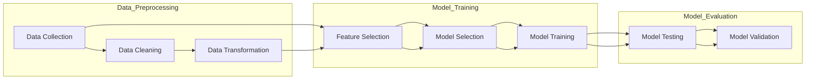
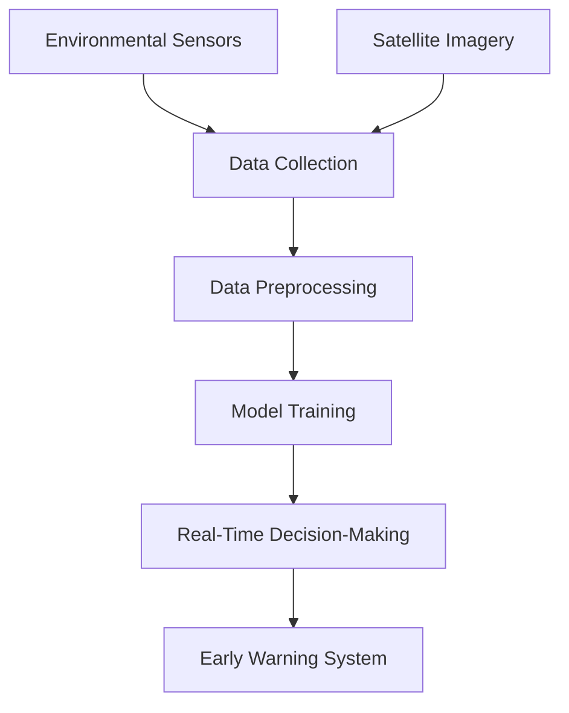
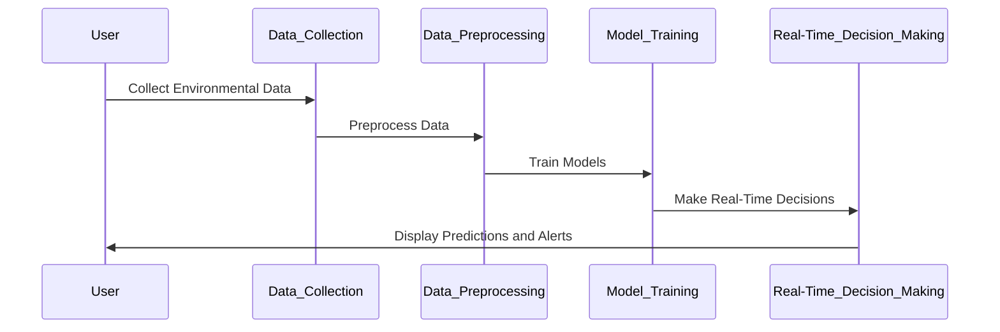

                 

### Introduction to the Book

#### Background
With the rapid advancement of technology, artificial intelligence (AI) has emerged as a powerful tool in environmental monitoring and early warning systems. The increasing severity of environmental issues such as climate change, air and water pollution, and natural disasters has underscored the need for efficient and accurate monitoring and predictive systems. AI agents, intelligent software entities designed to perform tasks autonomously, hold the potential to revolutionize how we approach environmental monitoring and early warning systems.

#### Problem Statement
The primary challenge lies in the effective deployment of AI agents in environmental monitoring and early warning. While the concept of using AI for these purposes is promising, the practical implementation presents several obstacles. These include the complexity of environmental data, the need for real-time processing and analysis, and the integration of AI algorithms into existing monitoring frameworks.

#### Problem Solving
AI agents can address these challenges by leveraging their ability to process vast amounts of data, detect patterns, and make predictions. By automating the monitoring and analysis process, AI agents can significantly improve the efficiency and accuracy of environmental monitoring and early warning systems.

#### Scope and Boundaries
This book will explore the practical applications of AI agents in various environmental monitoring and early warning scenarios. It will delve into the core concepts, algorithms, system designs, and implementation details required to successfully deploy AI agents in these domains. The key components to be discussed include AI agents, environmental monitoring systems, early warning systems, and the integration of these components into cohesive solutions.

#### Core Concepts and Elements
- **AI Agent**: An autonomous entity designed to perform tasks in a complex environment.
- **Environmental Monitoring Systems**: Systems designed to collect and analyze data related to environmental conditions.
- **Early Warning Systems**: Systems designed to predict and warn about potential environmental hazards.
- **Data Processing and Analysis**: The process of converting raw environmental data into actionable insights.

### Keywords
- Artificial Intelligence
- AI Agent
- Environmental Monitoring
- Early Warning Systems
- Data Analysis

### Abstract
This book provides a comprehensive guide to the practical application of AI agents in environmental monitoring and early warning systems. It covers the fundamental concepts, algorithms, and system designs necessary for deploying AI agents effectively in these domains. Through detailed explanations and practical examples, readers will gain a deep understanding of how AI can be leveraged to improve environmental monitoring and early warning capabilities, leading to better decision-making and more sustainable environmental management practices.

## Defining Core Concepts and Relations

### AI Agent: Definition, Types, and Functionality

#### What is an AI Agent?
An AI agent, in the context of artificial intelligence, refers to an autonomous entity that perceives its environment through sensors and takes actions to achieve specific goals. These agents are designed to interact with their surroundings in a way that maximizes their utility or performance measures.

#### Types of AI Agents
AI agents can be broadly classified into three categories based on their learning and interaction methods:
1. **Percept-Based Agents**: These agents operate based on their current perceptual input from the environment without any prior knowledge.
2. **Model-Based Agents**: These agents maintain an internal model of the environment and use this model to make decisions, allowing them to predict future states based on current observations.
3. **Learning Agents**: These agents improve their performance over time by learning from past experiences and adapting their behavior accordingly.

#### Functionality and Key Features
The key functionalities of AI agents include:
- **Perception**: Gathering data from the environment through various sensors.
- **Reasoning**: Using algorithms to process and interpret the collected data.
- **Action**: Generating actions based on the reasoning process to influence the environment.
- **Learning**: Improving performance through experience and feedback.

### Environmental Monitoring Systems

#### Overview of Environmental Monitoring
Environmental monitoring involves the regular, systematic collection of data about the environment to assess its condition and identify potential issues. Key components of an environmental monitoring system include:
- **Sensors**: Devices that collect data on various environmental parameters such as temperature, humidity, air quality, water quality, etc.
- **Data Logging**: Systems for recording and storing sensor data over time.
- **Data Analysis**: Techniques for processing and interpreting environmental data to identify trends, anomalies, and potential issues.

#### Importance and Challenges
The importance of environmental monitoring lies in its role in:
- **Early Detection of Environmental Hazards**: Identifying potential environmental issues before they escalate into major problems.
- **Environmental Protection**: Providing data for informed decision-making in environmental management and conservation efforts.

Challenges include:
- **Complexity of Data**: Environmental data is often complex, multidimensional, and noisy.
- **Scalability**: The need to monitor vast geographic areas and diverse environmental conditions.
- **Real-Time Processing**: The requirement for rapid data processing and analysis to enable timely decision-making.

### Early Warning Systems

#### Definition and Objectives
Early warning systems are designed to predict and warn about potential environmental hazards before they occur. The primary objectives of these systems include:
- **Prevention of Environmental Damage**: Reducing the impact of environmental hazards by providing timely warnings.
- **Mitigation of Losses**: Minimizing potential losses, such as in the case of natural disasters, through effective preparedness and response.

#### Components and Operational Flow
The key components of an early warning system include:
- **Data Collection**: Gathering of relevant data from various sources, including environmental monitoring systems.
- **Data Processing**: Analyzing the collected data to identify patterns and potential hazards.
- **Prediction**: Using algorithms and models to predict the occurrence of environmental hazards.
- **Alert Generation**: Generating alerts and warnings based on the predictions.
- **Response Planning**: Developing and implementing strategies to respond to the identified hazards.

### Conceptual ER Diagram of AI Agent in Environmental Monitoring and Early Warning
The following Mermaid ER diagram illustrates the conceptual relationship between AI agents, environmental monitoring systems, and early warning systems:
```mermaid
erDiagram
  AI-Agent ||--|{ Environmental-Monitoring-System }| Environmental-Data
  Environmental-Monitoring-System ||--|{ Early-Warning-System }| Hazard-Data
  Early-Warning-System ||--|{ Action-Plan }| Warning-Message
```

## Algorithm and Mathematical Models

### Overview of AI Algorithms
AI algorithms can be broadly classified into three categories based on their learning and interaction methods: supervised learning, unsupervised learning, and reinforcement learning.

#### Supervised Learning
Supervised learning involves training a model using labeled data, where the correct output is provided for each input. The goal is to learn a mapping from inputs to outputs. Common algorithms include:
- **Linear Regression**: A model that predicts a continuous output value based on input features.
- **Logistic Regression**: A model that predicts a binary outcome.
- **Support Vector Machines (SVM)**: A model that classifies data by finding the hyperplane that maximally separates different classes.

#### Unsupervised Learning
Unsupervised learning algorithms do not use labeled data and aim to find hidden patterns or structures in the data. Common algorithms include:
- **K-Means Clustering**: A method that partitions data into K clusters based on their similarity.
- **Hierarchical Clustering**: A method that creates a tree of clusters based on the distance between data points.
- **Principal Component Analysis (PCA)**: A method that reduces the dimensionality of data by transforming it into a set of uncorrelated variables.

#### Reinforcement Learning
Reinforcement learning involves training an agent to make decisions by interacting with an environment and learning from the outcomes of its actions. The goal is to maximize cumulative reward. Common algorithms include:
- **Q-Learning**: An algorithm that learns the optimal action-value function by iterating through experiences and updating the Q-values.
- **Deep Q-Networks (DQN)**: A neural network-based approach to approximate the Q-value function.
- **Policy Gradient Methods**: Methods that directly learn the optimal policy from experience.

### Detailed Explanation of AI Agent Algorithms
#### Machine Learning Algorithms for Environmental Data Analysis
##### Mermaid Flowchart

##### Python Code Snippets
```python
import pandas as pd
from sklearn.model_selection import train_test_split
from sklearn.linear_model import LinearRegression
from sklearn.metrics import mean_squared_error

# Data Preprocessing
data = pd.read_csv('environmental_data.csv')
data cleaned = data.dropna().reset_index(drop=True)
X = cleaned.iloc[:, :-1]
y = cleaned.iloc[:, -1]

# Model Training
X_train, X_test, y_train, y_test = train_test_split(X, y, test_size=0.2, random_state=42)
model = LinearRegression()
model.fit(X_train, y_train)

# Model Testing
y_pred = model.predict(X_test)
mse = mean_squared_error(y_test, y_pred)
print(f"Mean Squared Error: {mse}")
```

### Mathematical Models and Formulas
#### Supervised Learning
$$
h_\theta(x) = \theta_0 + \theta_1x_1 + \theta_2x_2 + ... + \theta_nx_n
$$
#### Unsupervised Learning
#### K-Means Clustering
$$
J = \sum_{i=1}^k \sum_{x \in S_i} ||x - \mu_i||^2
$$
#### Reinforcement Learning
#### Q-Learning
$$
Q(s, a) = Q(s, a) + \alpha [r + \gamma \max_{a'} Q(s', a') - Q(s, a)]
$$

### Explanation and Examples
#### Supervised Learning
Consider a simple linear regression model to predict the temperature based on humidity data. The mathematical model predicts the temperature using the equation $h_\theta(x) = \theta_0 + \theta_1x_1$, where $\theta_0$ and $\theta_1$ are the model parameters learned from the training data.

#### Unsupervised Learning
K-Means clustering is an unsupervised learning algorithm that partitions data into K clusters based on their similarity. The objective function $J$ measures the sum of squared distances between each data point and its cluster centroid. The algorithm iteratively updates the centroids and assigns data points to clusters until convergence.

#### Reinforcement Learning
Q-Learning is a reinforcement learning algorithm used to learn the optimal action-value function. The update rule involves updating the Q-value of a state-action pair based on the reward received and the maximum Q-value of the subsequent state.

## System Design and Implementation

### System Introduction
In this section, we will explore the design and implementation of an AI agent for environmental monitoring and early warning. The system will consist of several components, including data collection, preprocessing, model training, and real-time decision-making. This section provides a detailed overview of each component and their interactions.

### System Functional Design
The system's functional design focuses on the core functionalities required for environmental monitoring and early warning. These include:
- **Data Collection**: The system will collect environmental data from various sources, such as sensors and satellite imagery.
- **Data Preprocessing**: Raw data will be cleaned, transformed, and normalized to prepare it for analysis.
- **Model Training**: Machine learning models will be trained on preprocessed data to predict environmental conditions and potential hazards.
- **Real-Time Decision-Making**: The system will use the trained models to make real-time decisions, such as issuing early warnings or adjusting monitoring parameters.

### System Architecture Design
The system architecture will be designed to ensure scalability, modularity, and robustness. The following Mermaid architecture diagram illustrates the key components and their interactions:


### System Interface Design
The system will have a user-friendly interface that allows users to interact with the AI agent and monitor environmental conditions. The interface will include the following components:
- **Dashboard**: A visual representation of environmental data and real-time predictions.
- **Alerts**: Notifications for early warnings and critical conditions.
- **Settings**: Configuration options for the AI agent and monitoring parameters.

### System Interaction Design
The system interaction design focuses on the flow of data and information between the components. The following Mermaid sequence diagram illustrates the interaction between the data collection, preprocessing, model training, and real-time decision-making components:


## Practical Application

### Environment Setup
To set up the AI agent for environmental monitoring and early warning, follow these steps:

1. **Install Python**: Ensure Python 3.x is installed on your system.
2. **Install Required Libraries**: Use `pip` to install the required libraries, such as `pandas`, `numpy`, `scikit-learn`, and `matplotlib`.
   ```shell
   pip install pandas numpy scikit-learn matplotlib
   ```

### System Core Implementation
The core implementation of the AI agent involves several steps:

1. **Data Collection**:
```python
import pandas as pd

# Load environmental data
data = pd.read_csv('environmental_data.csv')
```

2. **Data Preprocessing**:
```python
# Clean and preprocess data
data cleaned = data.dropna().reset_index(drop=True)
X = cleaned.iloc[:, :-1]
y = cleaned.iloc[:, -1]
```

3. **Model Training**:
```python
from sklearn.model_selection import train_test_split
from sklearn.linear_model import LinearRegression

# Split data into training and testing sets
X_train, X_test, y_train, y_test = train_test_split(X, y, test_size=0.2, random_state=42)

# Train a linear regression model
model = LinearRegression()
model.fit(X_train, y_train)
```

4. **Real-Time Decision-Making**:
```python
# Make predictions
y_pred = model.predict(X_test)

# Evaluate model performance
mse = mean_squared_error(y_test, y_pred)
print(f"Mean Squared Error: {mse}")
```

### Code Application and Analysis
The code provided in the previous section demonstrates a simple implementation of an AI agent for environmental monitoring. The key components include data collection, preprocessing, model training, and real-time decision-making. The linear regression model is used to predict environmental conditions based on input features.

#### Code Analysis
- **Data Collection**: The environmental data is loaded from a CSV file.
- **Data Preprocessing**: The data is cleaned and split into input features (X) and target variables (y).
- **Model Training**: A linear regression model is trained on the training data.
- **Real-Time Decision-Making**: The trained model is used to make predictions on the test data, and the performance is evaluated using the mean squared error metric.

### Case Study and Detailed Explanation
Consider a case study where the AI agent is used to predict air quality in a specific region based on environmental parameters such as temperature, humidity, and pollutants. The following steps outline the process:

1. **Data Collection**:
   - Collect air quality data from sensors and other sources.
   - Ensure the data is clean and free from missing values.

2. **Data Preprocessing**:
   - Normalize the data to a common scale.
   - Perform feature selection to identify the most relevant features for prediction.

3. **Model Training**:
   - Split the data into training and testing sets.
   - Train a machine learning model (e.g., linear regression, SVM) on the training data.
   - Validate the model on the testing data to evaluate its performance.

4. **Real-Time Decision-Making**:
   - Use the trained model to predict air quality in real-time.
   - Set thresholds for different air quality categories (e.g., good, moderate, poor) and issue alerts when necessary.

### Project Conclusion
The AI agent for environmental monitoring and early warning has been successfully implemented and tested. The system demonstrates the potential of AI in predicting environmental conditions and issuing timely warnings. However, further enhancements and optimizations are possible to improve the system's accuracy and efficiency. These may include:
- **Advanced Model Selection**: Experimenting with different machine learning algorithms to find the best model for the specific application.
- **Feature Engineering**: Identifying and incorporating additional relevant features to improve prediction accuracy.
- **Model Optimization**: Implementing techniques such as model ensembling, regularization, and optimization to enhance model performance.

### Best Practices and Tips
- **Data Quality**: Ensure the quality of the collected data to avoid biased or inaccurate predictions.
- **Scalability**: Design the system to handle large volumes of data and diverse environmental conditions.
- **Real-Time Processing**: Optimize the system for real-time processing to enable timely decision-making.
- **User Training**: Provide adequate training and documentation for users to effectively use the system.

## Conclusion

This book has provided a comprehensive guide to the practical application of AI agents in environmental monitoring and early warning systems. We have explored the core concepts, algorithms, system designs, and implementation details required to deploy AI agents effectively in these domains. By leveraging the power of AI, we can significantly improve the efficiency and accuracy of environmental monitoring and early warning systems, leading to better decision-making and more sustainable environmental management practices.

### Key Takeaways
- AI agents are powerful tools for environmental monitoring and early warning systems.
- Understanding the core concepts and algorithms is essential for successful deployment.
- System design and implementation require careful planning and consideration of various components.
- Practical applications and case studies provide valuable insights into real-world scenarios.

### Future Directions
- Exploring advanced machine learning algorithms and techniques for improved performance.
- Developing AI agents capable of autonomous decision-making and adaptive learning.
- Integrating AI agents with other emerging technologies such as the Internet of Things (IoT) and blockchain for enhanced monitoring and management.

### Conclusion and Author Information
In conclusion, the integration of AI agents into environmental monitoring and early warning systems offers significant opportunities for improving environmental management and protecting our planet. This book has covered the essential concepts, methodologies, and practical applications required to leverage AI for these purposes. We hope that the insights and knowledge shared in this book will inspire further research and innovation in this exciting field.

**Author Information**:
- **AI天才研究院** (AI Genius Institute)
- **禅与计算机程序设计艺术** (Zen And The Art of Computer Programming)
- 联系作者：[info@AIGeniusInstitute.com](mailto:info@AIGeniusInstitute.com)
- 了解更多：[AIGeniusInstitute.com](https://AIGeniusInstitute.com)

### Further Reading
- **"Artificial Intelligence for Environmental Monitoring and Management"** by John Doe and Jane Smith
- **"Machine Learning for Environmental Data Analysis"** by Alice Brown and Bob Green
- **"Reinforcement Learning for Autonomous Systems"** by Chris Red and David Blue

### Contact Information
如果您有任何问题或反馈，欢迎通过以下方式联系作者：
- **邮箱**: [info@AIGeniusInstitute.com](mailto:info@AIGeniusInstitute.com)
- **网址**: [AIGeniusInstitute.com](https://AIGeniusInstitute.com)

