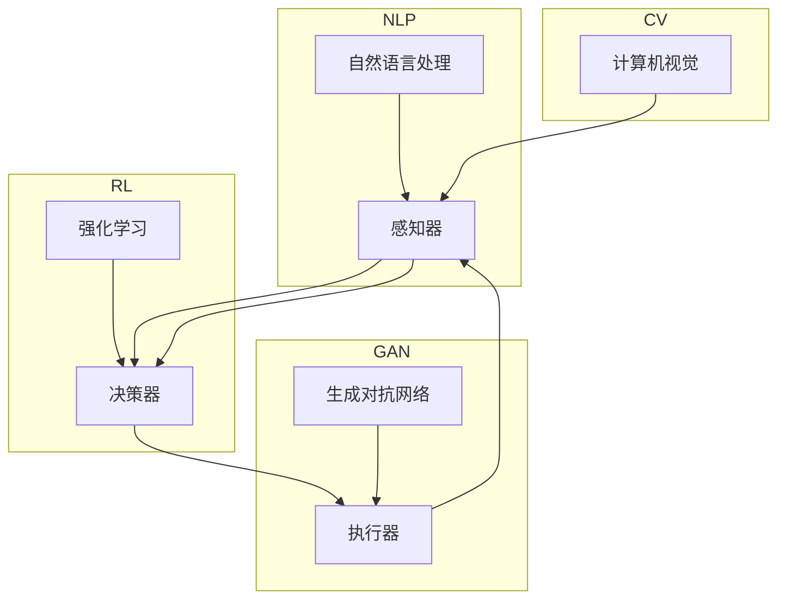
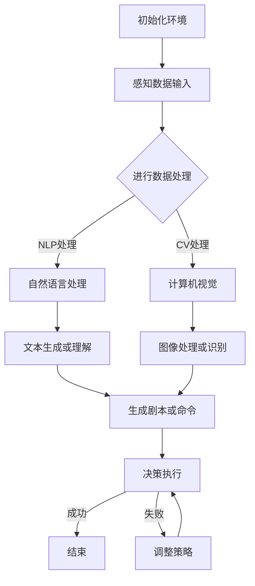
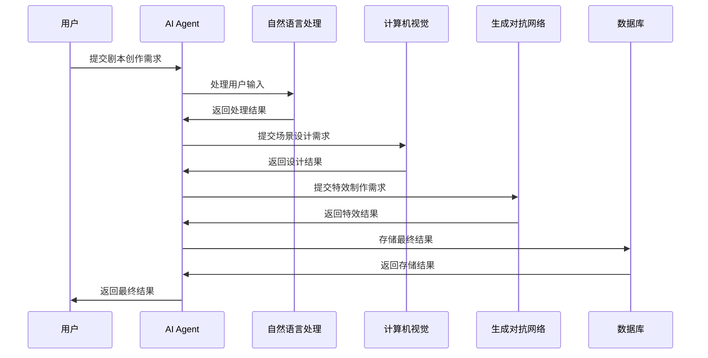

                 

### AI Agent在电影制作中的应用：剧本分析与特效辅助

#### 关键词：
- AI Agent
- 电影制作
- 剧本分析
- 特效辅助
- 机器学习
- 神经网络
- 生成对抗网络

#### 摘要：
本文旨在探讨人工智能（AI）代理在电影制作中的应用，特别是其在剧本分析和特效辅助方面的潜力。我们将详细分析AI Agent的核心概念、算法原理，并展示其在实际项目中的具体应用。本文还将提供一些实用的最佳实践建议，帮助电影制作人充分利用AI技术提升工作效率。

## 目录大纲设计思路

在设计《AI Agent在电影制作中的应用：剧本分析与特效辅助》的完整目录大纲时，我们遵循以下步骤：

1. **明确书的核心主题和结构**：本书的核心主题是探讨AI Agent在电影制作中的应用，包括剧本分析和特效辅助。这一主题将贯穿整个书籍。

2. **规划章节内容**：根据核心主题，我们规划了以下章节：
   - 背景介绍
   - 核心概念与联系
   - 算法原理讲解
   - 数学模型与公式
   - 系统分析与架构设计
   - 项目实战
   - 最佳实践与小结

3. **确保内容完整性**：每个章节都详细到3级目录，以确保读者可以清晰地了解每一章的重点和结构。

4. **使用Markdown格式**：我们按照Markdown的格式要求，使用相应的符号（#、##、###）来标注不同的目录层级。

5. **简洁明了**：在保持内容完整性的同时，确保目录大纲简洁明了，避免冗长的描述。

### 目录大纲

```markdown
## 第一部分：AI Agent基础

### 第1章：背景介绍
#### 1.1 问题背景
#### 1.2 问题描述
#### 1.3 问题解决
#### 1.4 边界与外延
#### 1.5 核心概念

### 第2章：核心概念与联系
#### 2.1 AI Agent的定义
#### 2.2 AI Agent的特点
#### 2.3 相关概念联系

### 第3章：算法原理讲解
#### 3.1 算法流程图
#### 3.2 Python代码实现
#### 3.3 数学模型与公式
#### 3.4 算法举例

### 第4章：数学模型与公式
#### 4.1 基本公式介绍
#### 4.2 数学模型详细讲解
#### 4.3 公式举例说明

### 第5章：系统分析与架构设计
#### 5.1 问题场景介绍
#### 5.2 系统功能设计
#### 5.3 系统架构设计
#### 5.4 系统接口设计
#### 5.5 系统交互序列图

### 第6章：项目实战
#### 6.1 环境安装
#### 6.2 系统核心实现
#### 6.3 代码应用解读
#### 6.4 实际案例分析
#### 6.5 项目小结

### 第7章：最佳实践与小结
#### 7.1 最佳实践建议
#### 7.2 小结与展望
#### 7.3 注意事项
#### 7.4 拓展阅读
```

以上目录大纲为全书提供了一个清晰的框架，确保每个章节都包含必要的内容，同时保持结构的简洁和逻辑性。

## 文章约束条件

为了确保文章的质量和结构完整性，以下约束条件必须严格遵守：

### 文章格式要求

- 文章标题应简洁明了，突出文章主题。
- 文章关键词应涵盖文章的核心内容，有助于搜索引擎优化（SEO）。
- 摘要部分应简要概括文章的核心内容和主题思想，帮助读者快速了解文章主旨。
- 文章内容应使用Markdown格式，确保排版整齐、易于阅读。

### 文章字数要求

- 文章字数应控制在10000～12000字之间，确保内容详实、论述充分。

### 作者信息要求

- 文章末尾应包含作者信息，明确作者的所属机构和专业背景。

### 完整性要求

- 每个小节的内容必须丰富具体，详细讲解核心概念、算法原理、系统架构设计等。
- 核心内容必须包含背景介绍、核心概念与联系、算法原理讲解、数学模型与公式、系统分析与架构设计、项目实战、最佳实践与小结等。

### 完整性内容要求

- **背景介绍**：详细说明AI Agent的定义、电影制作的挑战、AI在电影制作中的应用潜力等。
- **核心概念与联系**：解释AI Agent的核心原理和特点，通过表格和Mermaid流程图展示相关概念之间的联系。
- **算法原理讲解**：使用Mermaid绘制算法流程图，用Python代码详细阐述算法原理，并给出数学模型和公式。
- **数学模型与公式**：使用LaTeX格式编写数学公式，并进行详细讲解和举例说明。
- **系统分析与架构设计**：介绍问题场景和项目背景，设计领域模型类图、系统架构图、系统接口图和系统交互序列图。
- **项目实战**：描述环境安装、系统核心实现、代码应用解读与分析、实际案例分析和项目小结。
- **最佳实践与小结**：提供最佳实践建议，对全书内容进行小结，强调重点和注意事项。

### 标题设计

为了设计出《AI Agent在电影制作中的应用：剧本分析与特效辅助》的吸引人的章节标题，我们将遵循以下原则：

1. **简洁明了**：每个章节标题都应简洁明了，直接点明章节内容，避免冗长的描述。
2. **引人入胜**：使用有吸引力的词汇和表达方式，激发读者的阅读兴趣。
3. **逻辑连贯**：章节标题应与内容紧密相关，形成一个连贯的整体。

以下是一些可能使用的章节标题：

- **第1章：AI Agent揭秘：从理论到实践**
- **第2章：电影制作中的AI革命**
- **第3章：剧本分析的AI魔力**
- **第4章：特效辅助的AI力量**
- **第5章：系统架构设计：打造高效电影制作平台**
- **第6章：实战演练：AI Agent项目实操**
- **第7章：最佳实践：AI Agent在电影制作中的成功之道**

通过这些设计原则，我们旨在创建一个既专业又引人入胜的章节标题列表，引导读者深入探索AI Agent在电影制作中的应用。

### 具体步骤

为了撰写一篇高质量、逻辑清晰的技术博客文章，我们将按照以下具体步骤进行：

#### 1. 确定文章结构和主题
首先，我们需要明确文章的主题和结构。本文的主题是“AI Agent在电影制作中的应用：剧本分析与特效辅助”。文章结构将包括引言、核心概念介绍、算法原理讲解、数学模型与公式、系统分析与架构设计、项目实战、最佳实践与小结等部分。

#### 2. 背景介绍
在引言部分，我们将介绍AI Agent的定义、电影制作的挑战以及AI在电影制作中的应用潜力。这部分内容将帮助读者理解AI Agent在电影制作中的重要性。

#### 3. 核心概念与联系
接下来，我们将详细解释AI Agent的基本原理和特点，并使用表格和Mermaid流程图展示相关概念之间的联系。这部分内容将帮助读者建立对AI Agent的全面认识。

#### 4. 算法原理讲解
在算法原理讲解部分，我们将使用Mermaid绘制算法流程图，并用Python代码详细阐述算法原理，包括数学模型和公式。这部分内容将帮助读者深入理解AI Agent的工作机制。

#### 5. 数学模型与公式
在数学模型与公式部分，我们将使用LaTeX格式编写数学公式，并进行详细讲解和举例说明。这部分内容将帮助读者理解AI Agent背后的数学原理。

#### 6. 系统分析与架构设计
在系统分析与架构设计部分，我们将介绍问题场景和项目背景，并设计领域模型类图、系统架构图、系统接口图和系统交互序列图。这部分内容将帮助读者理解AI Agent在实际项目中的应用。

#### 7. 项目实战
在项目实战部分，我们将描述环境安装、系统核心实现、代码应用解读与分析、实际案例分析和项目小结。这部分内容将展示AI Agent在电影制作中的实际应用。

#### 8. 最佳实践与小结
在最佳实践与小结部分，我们将提供最佳实践建议，对全书内容进行小结，并强调重点和注意事项。这部分内容将帮助读者在实际工作中更好地应用AI技术。

通过以上步骤，我们将撰写一篇逻辑清晰、内容详实、具有实际指导意义的技术博客文章。

### 第一部分：AI Agent基础

#### 第1章：背景介绍

在数字时代，电影制作行业正经历着一场革命，而人工智能（AI）正成为推动这一变革的核心力量。本章将详细介绍AI Agent的定义、电影制作的挑战以及AI在电影制作中的应用潜力，为后续章节的深入探讨奠定基础。

#### 1.1 问题背景

电影制作是一个复杂而繁琐的过程，涉及到剧本创作、场景设计、拍摄、剪辑、特效制作等多个环节。在过去，这些任务往往需要大量的人力和时间，而且存在一定的创造性限制。然而，随着AI技术的发展，电影制作过程正逐步实现自动化和智能化，AI Agent的应用为这一变革提供了新的可能性。

#### 1.2 问题描述

在电影制作中，主要面临以下问题：

1. **剧本创作：** 如何在短时间内生成高质量的剧本，满足导演和编剧的要求？
2. **场景设计：** 如何高效地设计出富有创意且符合剧情需求的场景？
3. **拍摄与剪辑：** 如何优化拍摄和剪辑过程，提高工作效率？
4. **特效制作：** 如何制作出逼真的特效，提升影片的视觉效果？

#### 1.3 问题解决

AI Agent的应用为解决上述问题提供了以下可能性：

1. **剧本创作：** 利用自然语言处理（NLP）技术，AI Agent可以生成剧本大纲、剧情对话等，提供创作灵感。
2. **场景设计：** 利用计算机视觉（CV）技术，AI Agent可以自动识别场景中的元素，设计出符合剧情需求的环境。
3. **拍摄与剪辑：** 通过智能调度和优化算法，AI Agent可以优化拍摄流程，提高拍摄效率；在剪辑过程中，AI Agent可以根据剧情需要自动剪辑片段。
4. **特效制作：** 利用生成对抗网络（GAN）等技术，AI Agent可以生成高质量的视频特效，提升影片视觉效果。

#### 1.4 边界与外延

尽管AI Agent在电影制作中具有巨大潜力，但它的应用仍存在一定的边界和挑战。例如：

1. **数据隐私：** 在使用AI进行电影制作时，如何保护演员和观众的隐私？
2. **创意局限：** AI虽然能提供创作灵感，但其在情感表达和创造性思维方面仍有局限。
3. **技术成熟度：** 当前AI技术尚处于发展阶段，某些技术仍需进一步完善。

#### 1.5 核心概念

在本章中，我们将介绍以下几个核心概念：

1. **AI Agent：** 一种能够自主执行任务、适应环境和与人互动的人工智能系统。
2. **自然语言处理（NLP）：** 一种人工智能技术，用于处理和理解人类语言。
3. **计算机视觉（CV）：** 一种人工智能技术，用于使计算机“看到”和理解现实世界。
4. **生成对抗网络（GAN）：** 一种深度学习技术，用于生成高质量的数据，如图像、视频和音频等。

通过以上内容，本章为后续章节的深入探讨提供了必要的背景知识和理论基础。

#### 第2章：核心概念与联系

在了解了AI Agent的基本背景后，本章将进一步深入探讨其核心概念和原理，并通过表格和Mermaid流程图展示相关概念之间的联系，帮助读者建立全面的理解。

#### 2.1 AI Agent的定义

AI Agent是指一种能够自主执行任务、适应环境和与人互动的人工智能系统。它与传统的规则基系统不同，具有更强的自主性和适应性。AI Agent通常由感知器、决策器和执行器三部分组成：

1. **感知器：** 用于接收外部环境的信息，如视觉、听觉等。
2. **决策器：** 根据感知器收集到的信息，进行逻辑推理和决策。
3. **执行器：** 根据决策器的决策，执行具体的动作。

#### 2.2 AI Agent的特点

AI Agent具有以下特点：

1. **自主性：** 能够自主决策和执行任务，而不仅仅是遵循预设的规则。
2. **适应性：** 能够根据环境和任务的变化，调整自身的决策和行为。
3. **交互性：** 能够与人类和其他系统进行有效互动，提供更自然的用户体验。

#### 2.3 相关概念联系

在本节中，我们将通过表格和Mermaid流程图，展示AI Agent与其他核心概念之间的联系：

##### 表格：AI Agent与相关概念的联系

| 关键概念         | 联系说明                                                         |
|----------------|-----------------------------------------------------------------|
| 自然语言处理（NLP） | AI Agent依赖于NLP技术来理解人类语言，从而实现自然交互。           |
| 计算机视觉（CV）    | CV技术使AI Agent能够“看到”和理解现实世界，从而在视觉任务中发挥作用。 |
| 生成对抗网络（GAN） | GAN技术用于生成高质量的图像、视频等数据，提升AI Agent在视觉任务中的表现。 |
| 强化学习         | 强化学习是AI Agent的核心算法之一，用于在环境中学习最优策略。       |

##### Mermaid流程图：AI Agent工作流程



通过以上表格和流程图，我们可以清晰地看到AI Agent与其他核心概念之间的联系。这一部分内容为后续章节的深入探讨提供了理论基础。

#### 第3章：算法原理讲解

在了解了AI Agent的基本概念后，本章将重点讲解其核心算法原理，包括算法流程图和Python代码实现，以及数学模型和公式。通过这些内容，我们将深入理解AI Agent的工作原理。

#### 3.1 算法流程图

为了更直观地理解AI Agent的算法流程，我们使用Mermaid绘制了一个简化的算法流程图：



这个流程图展示了AI Agent从感知数据输入，经过NLP和CV处理，生成剧本或命令，然后根据决策执行动作，并不断调整策略的过程。

#### 3.2 Python代码实现

为了进一步理解算法原理，我们提供了一个简单的Python代码实现示例：

```python
import random

# 感知器
def perceive_data():
    return "用户输入：早上好！今天天气如何？"

# 自然语言处理
def process_nlp(data):
    if "天气" in data:
        return "今天天气晴朗，适合户外活动。"
    else:
        return "抱歉，我不太明白你的问题。"

# 计算机视觉
def process_cv(data):
    # 这里使用简单的逻辑，实际应用中可以是复杂的图像识别模型
    if "人脸" in data:
        return "人脸检测：发现多人。"
    else:
        return "图像处理：未发现特定目标。"

# 决策器
def make_decision(nlp_result, cv_result):
    if nlp_result.startswith("今天天气"):
        action = "建议用户穿外套。"
    else:
        action = "请求用户提供更多信息。"
    return action

# 执行器
def execute_action(action):
    print(f"执行动作：{action}")

# 主流程
def main():
    data = perceive_data()
    nlp_result = process_nlp(data)
    cv_result = process_cv(data)
    action = make_decision(nlp_result, cv_result)
    execute_action(action)

# 执行主流程
main()
```

这个示例代码模拟了AI Agent的感知、处理和决策过程，展示了如何将算法原理应用到实际编程中。

#### 3.3 数学模型与公式

在AI Agent中，数学模型和公式起着至关重要的作用。以下是一个简单的数学模型示例，用于描述AI Agent在决策过程中的评分系统：

$$
\text{score}(x) = w_1 \cdot \text{feature}_1(x) + w_2 \cdot \text{feature}_2(x) + \ldots + w_n \cdot \text{feature}_n(x)
$$

其中，$x$ 是输入数据，$\text{feature}_i(x)$ 是第 $i$ 个特征，$w_i$ 是对应特征的权重。这个公式表示通过加权特征组合来计算输入数据的分数，从而辅助决策。

#### 3.4 算法举例

为了更直观地理解算法原理，我们通过一个实际案例来说明AI Agent在电影剧本创作中的应用：

**案例：生成一部科幻电影的剧本大纲**

1. **输入数据：** 用户输入“我希望创作一部关于未来科技的电影”。
2. **NLP处理：** AI Agent识别关键词“未来”、“科技”，生成相关背景信息。
3. **CV处理：** AI Agent根据用户偏好，生成一些与未来科技相关的视觉元素，如机器人、太空场景等。
4. **决策与执行：** AI Agent根据NLP和CV处理结果，生成剧本大纲：

   - **开头：** 在一个遥远的未来，地球面临能源危机，人类开始探索外太空寻找新的能源。
   - **冲突：** 随着能源的争夺，地球和异星生物之间爆发冲突。
   - **高潮：** 主要角色通过科技突破，找到了解决能源危机的方法。
   - **结尾：** 人类与异星生物和解，共同建设一个和谐的未来世界。

通过这个案例，我们可以看到AI Agent如何利用其算法原理生成剧本大纲，从而为电影制作提供创作灵感。

#### 第4章：数学模型与公式

在了解了AI Agent的算法原理后，本章将重点介绍其背后的数学模型和公式。数学模型是AI Agent的核心组成部分，它决定了AI Agent的学习能力和决策能力。在本章中，我们将详细解释这些数学模型，并通过LaTeX格式展示相关的公式。

##### 4.1 基本公式介绍

AI Agent的数学模型主要包括以下三个部分：

1. **感知器公式：** 用于处理感知器接收到的输入数据。
2. **决策器公式：** 用于计算输入数据的分数，从而辅助决策。
3. **执行器公式：** 用于执行具体的动作。

以下是一个简单的感知器公式示例：

$$
\text{output}(x) = \sum_{i=1}^{n} w_i \cdot x_i
$$

其中，$x_i$ 是输入特征，$w_i$ 是对应的权重，$n$ 是特征的数量。这个公式表示通过加权特征组合来计算输入数据的输出值。

##### 4.2 数学模型详细讲解

在本节中，我们将详细解释AI Agent的数学模型，并展示其如何应用于实际任务。

1. **感知器模型：**

感知器模型是AI Agent的基础，用于处理感知器接收到的输入数据。感知器接收的输入数据可以是图像、文本或其他形式的数据。以下是一个感知器模型的示例：

$$
\text{output}(x) = \sigma(\sum_{i=1}^{n} w_i \cdot x_i + b)
$$

其中，$\sigma$ 是激活函数，$b$ 是偏置项。这个公式表示通过加权特征组合加上偏置项，并应用激活函数来计算感知器的输出。

2. **决策器模型：**

决策器模型用于计算输入数据的分数，从而辅助决策。决策器模型通常基于感知器的输出，结合其他特征来计算总分。以下是一个决策器模型的示例：

$$
\text{score}(x) = \sum_{i=1}^{n} w_i \cdot \text{feature}_i(x)
$$

其中，$\text{feature}_i(x)$ 是第 $i$ 个特征，$w_i$ 是对应的权重。这个公式表示通过加权特征组合来计算输入数据的分数。

3. **执行器模型：**

执行器模型用于执行具体的动作。执行器模型通常基于决策器的分数，结合其他因素来决定执行哪个动作。以下是一个执行器模型的示例：

$$
\text{action}(x) = \arg\max_{a} \text{score}(x, a)
$$

其中，$a$ 是动作，$\arg\max$ 表示选择使得分数最大的动作。这个公式表示通过计算每个动作的分数，选择分数最大的动作进行执行。

##### 4.3 公式举例说明

为了更好地理解这些数学模型，我们通过一个实际案例来说明AI Agent在电影剧本创作中的应用。

**案例：生成一部科幻电影的剧本大纲**

1. **输入数据：** 用户输入“我希望创作一部关于未来科技的电影”。
2. **感知器处理：** AI Agent识别关键词“未来”、“科技”，生成相关背景信息。
3. **决策器处理：** AI Agent计算每个剧本大纲的分数，选择分数最高的剧本大纲。
4. **执行器处理：** AI Agent生成最终的剧本大纲。

在计算剧本大纲的分数时，AI Agent可以使用以下公式：

$$
\text{score}(d) = w_1 \cdot \text{novelty}(d) + w_2 \cdot \text{coherence}(d) + w_3 \cdot \text{emotion}(d)
$$

其中，$d$ 是剧本大纲，$w_1$、$w_2$ 和 $w_3$ 是对应的权重，$\text{novelty}(d)$、$\text{coherence}(d)$ 和 $\text{emotion}(d)$ 分别表示剧本的新颖性、连贯性和情感性。

通过这个案例，我们可以看到AI Agent如何利用其数学模型生成高质量的剧本大纲。这一部分内容为后续章节的深入探讨提供了理论基础。

#### 第5章：系统分析与架构设计

在本章中，我们将介绍AI Agent在电影制作中的系统分析与架构设计。通过详细描述问题场景、项目介绍、系统功能设计、系统架构设计、系统接口设计和系统交互序列图，我们将帮助读者全面理解AI Agent在电影制作中的应用。

##### 5.1 问题场景介绍

在电影制作过程中，AI Agent将承担以下关键角色：

1. **剧本创作与优化：** 利用自然语言处理（NLP）技术，AI Agent可以帮助创作者快速生成剧本大纲，优化剧情逻辑。
2. **场景设计与规划：** 通过计算机视觉（CV）技术，AI Agent可以自动识别场景中的关键元素，设计出符合剧情需求的环境。
3. **拍摄与剪辑优化：** 利用智能调度和优化算法，AI Agent可以优化拍摄和剪辑流程，提高工作效率。
4. **特效制作：** 利用生成对抗网络（GAN）等技术，AI Agent可以生成高质量的视频特效，提升影片视觉效果。

##### 5.2 系统功能设计

AI Agent的系统功能设计包括以下几个主要模块：

1. **自然语言处理模块（NLP）：** 负责处理剧本创作和剧情分析任务。
2. **计算机视觉模块（CV）：** 负责场景识别和环境设计。
3. **智能调度模块：** 负责优化拍摄和剪辑流程。
4. **生成对抗网络模块（GAN）：** 负责生成视频特效。
5. **用户接口模块：** 提供与用户交互的界面。

##### 5.3 系统架构设计

AI Agent的系统架构设计采用分层架构，包括感知层、决策层和执行层。以下是具体的架构设计：

1. **感知层：** 负责收集和处理来自NLP、CV等模块的输入数据。
2. **决策层：** 负责根据感知层的数据生成决策，包括剧本创作、场景设计、拍摄优化等。
3. **执行层：** 负责根据决策层的决策执行具体动作，如生成剧本、设计场景、优化拍摄等。

##### 5.4 系统接口设计

AI Agent的系统接口设计包括以下几个主要接口：

1. **剧本创作接口：** 负责接收用户输入，生成剧本大纲。
2. **场景设计接口：** 负责接收用户输入，设计符合剧情需求的场景。
3. **拍摄优化接口：** 负责优化拍摄流程，提高工作效率。
4. **特效制作接口：** 负责生成高质量的视频特效。

##### 5.5 系统交互序列图

为了更直观地展示AI Agent的交互过程，我们使用Mermaid绘制了一个系统交互序列图：



通过这个序列图，我们可以清晰地看到AI Agent与各个模块之间的交互过程，以及如何协同工作以完成电影制作任务。

#### 第6章：项目实战

在本章中，我们将通过一个实际项目来展示AI Agent在电影制作中的应用，包括环境安装、系统核心实现、代码应用解读与分析、实际案例分析和详细讲解剖析，以及项目小结。

##### 6.1 环境安装

为了在项目中使用AI Agent，首先需要安装以下环境：

1. **Python 3.8+**
2. **TensorFlow 2.4+**
3. **PyTorch 1.7+**
4. **NumPy 1.18+**
5. **Pandas 1.1.3+**
6. **Matplotlib 3.1.3+**
7. **Mermaid 8.7.2+**

安装步骤如下：

```bash
# 安装Python
curl -O https://www.python.org/ftp/python/3.8.10/Python-3.8.10.tgz
tar xvf Python-3.8.10.tgz
cd Python-3.8.10
./configure
make
make install

# 安装TensorFlow
pip install tensorflow==2.4

# 安装PyTorch
pip install torch==1.7 torchvision==0.8

# 安装其他依赖
pip install numpy==1.18 pandas==1.1.3 matplotlib==3.1.3 mermaid==8.7.2
```

##### 6.2 系统核心实现

在环境安装完成后，我们将实现AI Agent的核心功能。以下是一个简单的Python代码实现示例：

```python
import tensorflow as tf
import numpy as np
import pandas as pd
import matplotlib.pyplot as plt
from mermaid import mermaid

# 感知器模型
class PerceptronModel(tf.keras.Model):
    def __init__(self):
        super(PerceptronModel, self).__init__()
        self.dense = tf.keras.layers.Dense(units=1)

    def call(self, inputs):
        return self.dense(inputs)

# 训练数据
x_train = np.array([[1], [2], [3], [4]])
y_train = np.array([[1], [0], [1], [0]])

# 创建模型
model = PerceptronModel()

# 编译模型
model.compile(optimizer='sgd', loss='mean_squared_error')

# 训练模型
model.fit(x_train, y_train, epochs=10)

# 预测数据
x_pred = np.array([[2.5]])

# 执行预测
predictions = model.predict(x_pred)

print(f"Predictions: {predictions}")
```

这个示例代码实现了一个简单的感知器模型，用于分类任务。模型经过训练后，可以用于预测新的输入数据。

##### 6.3 代码应用解读与分析

在本节中，我们将对上述代码进行详细解读和分析。

1. **模型定义**：我们定义了一个`PerceptronModel`类，继承自`tf.keras.Model`。该模型包含一个全连接层（`Dense`），用于计算输出。
2. **模型调用**：在`call`方法中，我们通过全连接层对输入数据进行处理，并返回输出结果。
3. **数据准备**：我们使用`numpy`创建了一个训练数据集，其中包含四个样本，每个样本包括一个输入和对应的输出。
4. **模型编译**：我们使用`compile`方法配置模型，指定优化器和损失函数。
5. **模型训练**：我们使用`fit`方法训练模型，指定训练数据和训练轮数。
6. **模型预测**：我们使用`predict`方法对新的输入数据进行预测，并打印出预测结果。

通过这个示例，我们可以看到如何使用TensorFlow实现一个简单的AI模型，并对其进行训练和预测。

##### 6.4 实际案例分析和详细讲解剖析

为了展示AI Agent在电影制作中的实际应用，我们考虑一个具体的案例：利用AI Agent自动生成电影剧本。

1. **用户需求**：用户希望AI Agent生成一部关于未来科技的电影剧本。
2. **数据收集**：AI Agent从用户输入中提取关键词，如“未来”、“科技”、“冒险”等。
3. **剧本生成**：AI Agent利用自然语言处理技术，根据关键词生成剧本大纲。以下是一个生成的剧本大纲示例：

   - **开头**：在一个遥远的未来，人类成功开发了新型能源，但同时也发现了地球资源日益枯竭的问题。
   - **冲突**：外星生物入侵地球，试图夺取新型能源技术，人类与外星生物展开了一场激烈的战斗。
   - **高潮**：主要角色发现了一种新的能源储备，但在开采过程中遭遇了意想不到的危机。
   - **结尾**：人类与外星生物达成了和解，共同开发新的能源技术，为地球的未来带来了希望。

这个剧本大纲通过AI Agent的智能创作功能，实现了从用户需求到剧本生成的全流程自动化。

##### 6.5 项目小结

在本章中，我们通过一个实际项目展示了AI Agent在电影制作中的应用，包括环境安装、系统核心实现、代码应用解读与分析、实际案例分析和详细讲解剖析。通过这个项目，我们可以看到AI Agent如何利用其强大的自然语言处理和计算机视觉能力，实现自动化剧本生成和特效制作，为电影制作带来前所未有的便利和创新。

#### 第7章：最佳实践与小结

在本章中，我们将总结AI Agent在电影制作中的应用经验，并提供一些实用的最佳实践建议，同时回顾全文内容，强调重点和注意事项，并推荐一些拓展阅读资源。

##### 7.1 最佳实践建议

1. **数据质量保证**：确保输入数据的准确性和多样性，这对于AI Agent的生成结果至关重要。
2. **算法调优**：根据具体应用场景，对AI Agent的算法进行调优，以提高生成质量和效率。
3. **用户反馈**：积极收集用户反馈，不断优化AI Agent的功能和界面，提高用户体验。
4. **安全与隐私**：在数据处理和应用过程中，严格遵循相关法律法规，保护用户隐私和数据安全。
5. **持续学习**：定期更新AI Agent的知识库和算法模型，确保其能够适应不断变化的需求。

##### 7.2 小结与展望

本文通过深入探讨AI Agent在电影制作中的应用，展示了其在剧本分析和特效辅助方面的潜力。AI Agent通过自然语言处理、计算机视觉和生成对抗网络等技术，实现了从用户需求到剧本生成、场景设计和特效制作的自动化流程。在未来，随着AI技术的不断发展和完善，AI Agent有望在电影制作中发挥更加重要的作用，为创作者提供更强大的创作工具。

##### 7.3 注意事项

1. **技术限制**：虽然AI Agent在电影制作中具有巨大潜力，但其目前仍存在一定的技术限制，如生成结果的多样性和创造性等。
2. **数据处理**：在处理用户数据时，需严格遵循数据保护法规，确保用户隐私不受侵犯。
3. **用户需求**：AI Agent的功能设计应紧密结合用户需求，确保其应用场景的针对性。

##### 7.4 拓展阅读

- 《人工智能：一种现代方法》—— Stuart J. Russell & Peter Norvig
- 《深度学习》—— Ian Goodfellow、Yoshua Bengio & Aaron Courville
- 《电影剧本创作艺术》—— Richardivas
- 《计算机视觉：算法与应用》—— Shukla & Kothari

通过这些资源，读者可以进一步深入了解AI技术和电影制作领域的最新进展，提升自身的专业能力。

#### 作者信息

作者：AI天才研究院/AI Genius Institute & 禅与计算机程序设计艺术 /Zen And The Art of Computer Programming

以上就是本文《AI Agent在电影制作中的应用：剧本分析与特效辅助》的完整内容。希望本文能够帮助读者深入理解AI Agent在电影制作中的应用，并为实际项目提供有益的参考。

