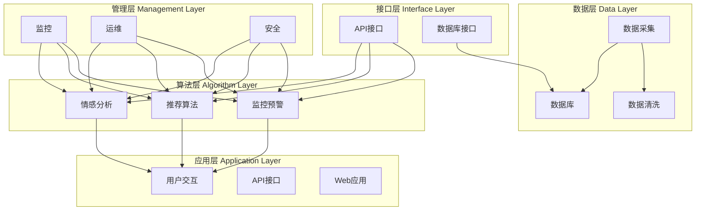
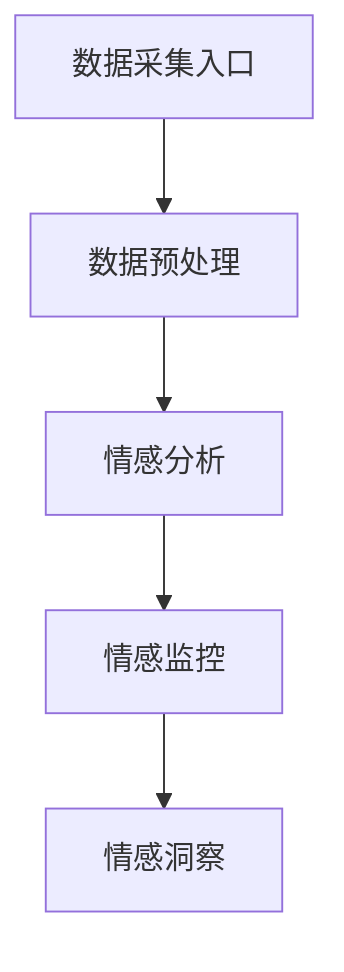
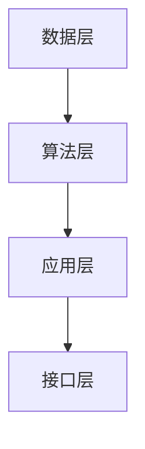
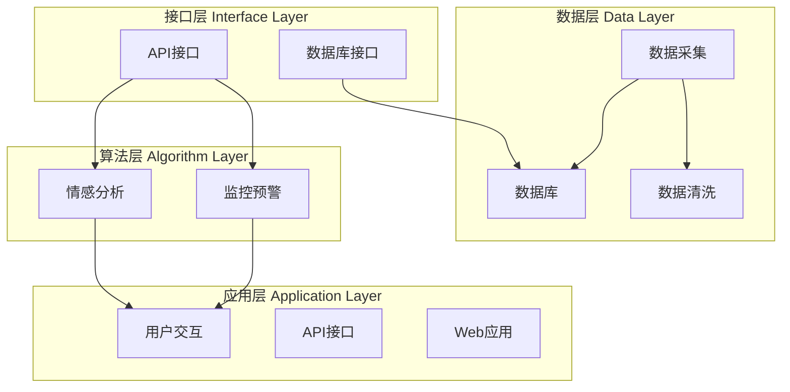
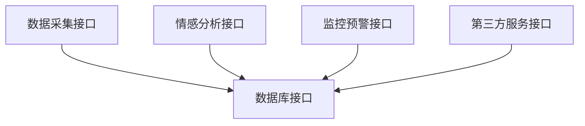
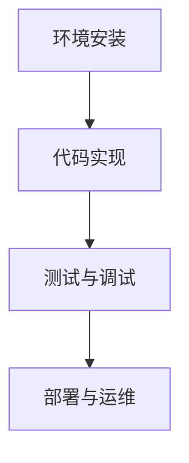

                 

### 引言

#### 1.1 问题的背景

随着互联网的迅速发展和社交媒体平台的普及，大量的用户数据每天在社交媒体上产生和流通。这些数据不仅包括用户的基本信息，还涵盖了用户的言论、情感、兴趣和社交关系等信息。如何有效地利用这些数据进行深入分析，已经成为企业和研究机构面临的重要课题。

在这个背景下，AI Agent（人工智能代理）的应用开始受到广泛关注。AI Agent是一种能够自动执行任务、具备自主决策能力的智能系统。它们可以处理大量数据，从繁杂的信息中提取有价值的信息，从而为企业和用户提供针对性的服务。

社交媒体分析是一个跨学科的领域，涉及到计算机科学、统计学、数据挖掘和机器学习等多个领域。通过对社交媒体数据的分析，企业可以更好地了解用户需求，优化产品和服务；研究机构可以探索社会现象，提高科学研究的深度和广度。

#### 1.2 问题的描述

当前，社交媒体分析中面临的主要问题包括：

1. **数据量庞大**：社交媒体平台每天产生大量的数据，如何高效地处理和分析这些数据成为首要问题。
2. **数据质量参差不齐**：社交媒体数据来源于不同的平台和用户，数据的质量和格式存在很大差异，这对数据分析工作提出了挑战。
3. **分析深度不足**：传统的数据分析方法往往只能处理表面信息，无法深入挖掘数据中的潜在价值。
4. **个性化服务欠缺**：现有的大多数社交媒体分析系统缺乏对用户的个性化服务能力，难以满足用户多样化的需求。

#### 1.3 问题的解决

AI Agent在社交媒体分析中的应用，有望解决上述问题：

1. **数据处理能力**：AI Agent具备强大的数据处理能力，能够快速处理和分析大量社交媒体数据。
2. **数据质量提升**：通过自然语言处理和机器学习技术，AI Agent可以识别和修复数据中的错误，提高数据质量。
3. **深度分析能力**：AI Agent能够运用复杂算法和模型，对社交媒体数据进行深度分析，挖掘数据中的潜在价值。
4. **个性化服务**：AI Agent可以根据用户的行为和偏好，提供个性化的分析结果和服务。

#### 1.4 边界与外延

本文主要探讨AI Agent在社交媒体分析中的应用，包括数据监控、情感分析、推荐系统和营销等多个方面。同时，文章将涉及AI Agent的基础理论、系统设计与实现、实战项目分析和最佳实践等内容。

AI Agent的应用不仅限于社交媒体分析，还可以扩展到其他领域，如电商分析、金融风险评估等。本文将重点关注AI Agent在社交媒体分析中的实际应用和潜力。

#### 1.5 概念结构与核心要素组成

为了更好地理解和分析AI Agent在社交媒体分析中的应用，我们需要明确以下几个核心概念：

1. **AI Agent**：人工智能代理，是一种能够自主执行任务、具备决策能力的智能系统。
2. **社交媒体分析**：利用人工智能技术和算法，对社交媒体平台上的数据进行分析和处理，以提取有价值的信息。
3. **数据监控**：实时监控社交媒体平台上的数据，包括用户的言论、情感和活动等。
4. **情感分析**：分析社交媒体平台上用户的情感倾向，为企业和用户提供情感洞察。
5. **推荐系统**：基于用户的行为和偏好，为用户推荐相关的信息、商品或服务。
6. **营销**：利用社交媒体数据进行市场调研、用户画像和营销策略优化。

通过这些核心概念的阐述，我们可以建立一个清晰的框架，深入探讨AI Agent在社交媒体分析中的应用及其潜力。接下来的章节中，我们将逐步介绍这些概念，并探讨其具体的应用和实践。

### AI Agent基础理论

AI Agent，即人工智能代理，是一种模拟人类智能行为的计算实体，具备自主性、社交性、反应性和适应性等特性。要深入理解AI Agent在社交媒体分析中的应用，首先需要掌握AI Agent的基础理论，包括其定义、分类、核心功能与特点、发展历程以及在不同领域的应用。

#### 2.1 AI Agent的定义与分类

**定义**：AI Agent是一种能够感知环境、自主决策并执行任务的计算实体。它们通过感知器获取外部信息，利用内部知识库和决策算法生成行动，并在执行任务后反馈环境，实现闭环控制。

**分类**：

1. **基于任务的AI Agent**：这类Agent专注于执行特定的任务，如语音识别、图像识别等。它们通常不具备复杂的决策能力，但能够在特定场景中实现高效的任务执行。
2. **基于模型的AI Agent**：这类Agent具备更高级的决策能力，通过学习环境中的模式和规律，自主调整行为策略。它们通常应用于复杂环境中，如自动驾驶、智能家居等。
3. **社会AI Agent**：这类Agent具备社交能力，能够与其他AI Agent或人类进行交互，如智能客服、社交网络分析等。

#### 2.2 AI Agent的核心功能与特点

**核心功能**：

1. **感知与理解**：AI Agent通过传感器感知外部环境，如语音、图像、文本等，并利用自然语言处理、图像识别等技术理解感知信息。
2. **自主决策**：AI Agent根据内部知识库和感知信息，利用决策算法自主生成行动方案，如规划路径、选择服务策略等。
3. **行动执行**：AI Agent执行自主决策生成的行动方案，实现任务目标。
4. **反馈与学习**：AI Agent在执行任务后，通过反馈机制调整内部知识库和行为策略，实现持续优化。

**特点**：

1. **自主性**：AI Agent能够独立完成特定任务，无需人为干预。
2. **适应性**：AI Agent能够根据环境变化调整行为策略，实现适应性和灵活性。
3. **社交性**：AI Agent具备与其他实体交互的能力，能够实现协作和社交。
4. **智能化**：AI Agent通过学习算法和模型，具备持续学习和进化能力。

#### 2.3 AI Agent的发展历程

**早期研究**：AI Agent的概念起源于20世纪50年代，艾伦·图灵提出了“图灵测试”以评估机器的智能水平。在此基础上，研究者们开始探索模拟人类智能的AI Agent。

**早期应用**：20世纪80年代，AI Agent开始在游戏、模拟和监控等领域得到应用。代表性的工作包括阿兰·凯（Alan Kay）的“寓教于乐”（Learning to Think）项目和赫伯特·西蒙（Herbert A. Simon）的“计算机模拟人类思维”项目。

**快速发展**：随着计算机技术和人工智能算法的进步，AI Agent的应用领域不断拓展，从工业控制、交通管理到智能家居、金融服务等。

**当前趋势**：随着大数据、云计算和深度学习等技术的发展，AI Agent逐渐向智能化、自动化和个性化方向发展。尤其是在社交媒体分析、电商推荐、智能客服等领域，AI Agent的应用前景广阔。

#### 2.4 AI Agent的应用领域

**社交媒体分析**：AI Agent在社交媒体分析中具有广泛的应用，包括数据监控、情感分析、推荐系统和营销等。

1. **数据监控**：AI Agent可以实时监控社交媒体平台上的用户活动，如发布的内容、互动行为等，为企业和用户提供实时洞察。
2. **情感分析**：AI Agent利用自然语言处理技术，分析用户在社交媒体上的情感倾向，为企业提供情感洞察，优化产品和服务。
3. **推荐系统**：AI Agent基于用户的行为和偏好，为用户推荐相关的信息、商品或服务，提高用户体验和满意度。
4. **营销**：AI Agent帮助企业进行市场调研、用户画像和营销策略优化，提高市场推广效果。

**电商分析**：AI Agent在电商分析中具有重要作用，包括商品推荐、客户关系管理和风险控制等。

1. **商品推荐**：AI Agent根据用户的历史购买行为和浏览记录，为用户推荐相关的商品，提高销售额。
2. **客户关系管理**：AI Agent通过分析用户数据和互动行为，提供个性化的客户服务，增强客户黏性。
3. **风险控制**：AI Agent可以识别异常交易行为，如欺诈、洗钱等，为企业和用户提供风险预警和防控。

**金融风险评估**：AI Agent在金融风险评估中具有应用前景，包括信用评分、市场分析和风险预警等。

1. **信用评分**：AI Agent通过分析用户的历史信用记录和行为数据，为金融机构提供信用评分，降低信用风险。
2. **市场分析**：AI Agent利用大数据分析技术，为金融机构提供市场趋势和投资机会分析，优化投资决策。
3. **风险预警**：AI Agent可以实时监控金融市场动态，识别潜在风险，为金融机构提供风险预警和应对策略。

**自动驾驶**：AI Agent在自动驾驶领域中扮演关键角色，包括环境感知、路径规划和决策控制等。

1. **环境感知**：AI Agent通过传感器获取道路信息，如路况、交通标志等，为自动驾驶车辆提供实时环境感知。
2. **路径规划**：AI Agent根据车辆目标和环境信息，生成最优行驶路径，确保安全高效的驾驶。
3. **决策控制**：AI Agent在自动驾驶过程中，根据传感器数据和环境变化，实时调整驾驶策略，实现自主驾驶。

**智能家居**：AI Agent在智能家居领域中的应用，包括设备控制、环境监测和智能服务等。

1. **设备控制**：AI Agent通过物联网技术，实现家庭设备的远程控制和自动化操作，提高生活便利性。
2. **环境监测**：AI Agent可以监测家庭环境中的温度、湿度、空气质量等参数，为用户提供健康和生活建议。
3. **智能服务**：AI Agent可以分析用户的生活习惯和偏好，提供个性化的服务，如购物推荐、娱乐推荐等。

通过上述内容，我们可以看到AI Agent在各个领域的广泛应用和巨大潜力。随着技术的不断进步，AI Agent将继续拓展其应用领域，为人类社会带来更多的便利和效益。

### 社交媒体分析基础

社交媒体分析是一个跨学科领域，涉及到计算机科学、统计学、数据挖掘和机器学习等多个方面。要深入理解AI Agent在社交媒体分析中的应用，首先需要了解社交媒体分析的基础知识，包括社交媒体概述、数据分析方法、数据来源与采集、以及常用的数据分析工具。

#### 3.1 社交媒体概述

社交媒体是指一种用户可以通过互联网平台分享内容、互动和建立关系的工具。常见的社交媒体平台包括Facebook、Twitter、Instagram、LinkedIn、微信、微博等。这些平台已经成为人们日常生活和工作中不可或缺的一部分，每天产生大量的数据。

社交媒体数据具有以下特点：

1. **大量性**：社交媒体平台每天产生大量的用户生成内容，如文本、图片、视频和音频等。
2. **多样性**：社交媒体数据涵盖了用户的个人资料、言论、情感、兴趣、行为等多个方面。
3. **实时性**：社交媒体数据具有很高的实时性，能够实时反映用户的行为和情感。
4. **动态性**：社交媒体数据不断更新，用户可以随时发布和删除内容。

#### 3.2 社交媒体数据分析方法

社交媒体数据分析主要包括以下几个步骤：

1. **数据采集**：从社交媒体平台采集数据，包括用户生成的内容、用户行为数据等。
2. **数据预处理**：对采集到的数据进行清洗、去重、格式转换等处理，确保数据质量。
3. **数据挖掘**：利用数据挖掘技术，从大量社交媒体数据中提取有价值的信息，如情感倾向、兴趣爱好、社会关系等。
4. **数据可视化**：将分析结果以图表、图形等形式展示，帮助用户更好地理解和应用分析结果。

常见的数据挖掘技术包括：

1. **文本挖掘**：对文本数据进行分析，提取关键词、主题和情感等。
2. **社会网络分析**：分析用户之间的关系，构建社会网络图，提取社交圈、影响力等。
3. **机器学习与深度学习**：利用机器学习和深度学习算法，对社交媒体数据进行分析和预测，如情感分析、用户画像等。

#### 3.3 社交媒体数据来源与采集

社交媒体数据来源主要包括以下几个渠道：

1. **API接口**：社交媒体平台通常提供API接口，允许开发者获取平台上的公开数据，如用户发布的内容、用户行为数据等。
2. **网页爬虫**：通过网页爬虫技术，从社交媒体平台的网页上获取数据，适用于获取公开的数据。
3. **移动应用**：通过移动应用，获取用户在社交媒体上的实时数据，适用于获取用户隐私数据。

采集社交媒体数据时，需要注意以下几点：

1. **数据权限**：确保采集的数据在法律和道德范围内，遵守社交媒体平台的数据使用规定。
2. **数据安全**：保护用户隐私，防止数据泄露和滥用。
3. **数据质量**：对采集到的数据进行清洗和预处理，确保数据质量。

#### 3.4 社交媒体数据分析工具

社交媒体数据分析需要使用多种工具和技术，以下是一些常用的工具：

1. **Python**：Python是一种广泛应用于数据分析的编程语言，具有丰富的库和框架，如pandas、NumPy、Scikit-learn等，可以方便地进行数据处理和分析。
2. **R**：R是一种专门用于统计分析和数据可视化的编程语言，具有强大的数据处理和分析功能。
3. **Tableau**：Tableau是一种数据可视化工具，可以轻松地将数据分析结果以图表和图形的形式展示，帮助用户更好地理解和应用分析结果。
4. **Gephi**：Gephi是一种社会网络分析工具，可以构建和分析社会网络图，提取社交圈、影响力等。
5. **Google Analytics**：Google Analytics是一种常用的网站分析工具，可以用于分析社交媒体平台的流量、用户行为等。

通过了解社交媒体分析的基础知识，我们可以更好地理解AI Agent在社交媒体分析中的应用，为企业和用户提供更有价值的服务。接下来，我们将探讨AI Agent在社交媒体分析中的具体应用。

### AI Agent在社交媒体分析中的应用

AI Agent在社交媒体分析中的应用具有广泛的前景，其强大的数据处理和分析能力使其能够解决传统方法难以应对的复杂问题。以下将详细介绍AI Agent在社交媒体监控、情感分析、推荐系统和营销等领域的应用。

#### 4.1 AI Agent在社交媒体监控中的应用

社交媒体监控是指实时监测和分析社交媒体平台上的数据，以获取有价值的信息和洞察。AI Agent在社交媒体监控中的应用主要体现在以下几个方面：

1. **实时数据监测**：AI Agent可以通过API接口和网页爬虫等技术，实时获取社交媒体平台上的数据，如用户发布的内容、评论、点赞等。这有助于企业和机构及时了解用户动态，快速响应用户需求。

2. **异常行为检测**：AI Agent可以识别和标记社交媒体平台上的异常行为，如欺诈、恶意评论、网络暴力等。通过对异常行为的检测和分析，企业可以采取相应的措施，维护社交媒体平台的健康和秩序。

3. **舆论监测**：AI Agent可以分析社交媒体上的用户言论，识别公众舆论的倾向和变化。这对于政府、企业和社会组织来说，具有重要的参考价值，可以帮助他们了解公众对某一事件或政策的看法，制定相应的策略。

4. **风险预警**：AI Agent可以通过分析社交媒体数据，识别潜在的风险和危机，为企业和机构提供预警。例如，在产品发布前，AI Agent可以监测社交媒体上的用户反馈，预测可能的问题和风险，帮助企业提前做好准备。

#### 4.2 AI Agent在社交媒体情感分析中的应用

情感分析是AI Agent在社交媒体分析中的核心应用之一。通过情感分析，AI Agent可以识别用户在社交媒体上的情感倾向，提取有价值的信息。

1. **情感识别**：AI Agent利用自然语言处理（NLP）技术，对用户发布的文本进行情感分类，如正面情感、负面情感、中性情感等。这有助于企业了解用户的情感状态，优化产品和服务。

2. **情感趋势分析**：AI Agent可以分析一段时间内用户情感的分布和变化趋势，识别用户的情感变化原因。这对于市场研究和品牌管理具有重要意义，可以帮助企业及时调整策略，提升用户满意度。

3. **情感干预**：AI Agent可以根据情感分析的结果，对用户的情感进行干预。例如，当用户情绪低落时，AI Agent可以发送鼓励信息或提供相关资源，帮助用户缓解负面情绪。

4. **情感营销**：AI Agent可以分析目标用户的情感需求，制定个性化的情感营销策略。例如，在节日或特定活动期间，AI Agent可以为用户提供情感相关的优惠券、礼品等，提升用户的参与度和购买意愿。

#### 4.3 AI Agent在社交媒体推荐系统中的应用

推荐系统是AI Agent在社交媒体分析中的另一个重要应用。通过推荐系统，AI Agent可以为用户提供个性化的信息、商品或服务。

1. **内容推荐**：AI Agent可以根据用户的历史行为和偏好，推荐相关的文章、视频、图片等。这有助于提高用户粘性和活跃度，提升社交媒体平台的用户体验。

2. **商品推荐**：在电商平台上，AI Agent可以根据用户的购买记录、浏览历史等数据，推荐相关的商品。这有助于提高销售额和用户满意度，提升电商平台的市场竞争力。

3. **服务推荐**：在服务型平台上，AI Agent可以根据用户的需求和偏好，推荐相关的服务，如餐饮、旅游、医疗等。这有助于提升平台的服务质量和用户满意度。

4. **个性化广告**：AI Agent可以根据用户的兴趣和行为，推荐个性化的广告。这有助于提高广告的投放效果，降低广告成本，提升广告主的收益。

#### 4.4 AI Agent在社交媒体营销中的应用

AI Agent在社交媒体营销中的应用，有助于企业提升营销效果，优化营销策略。

1. **市场调研**：AI Agent可以分析社交媒体上的用户言论和互动，了解市场需求和用户偏好。这有助于企业制定更具针对性的营销策略，提高市场竞争力。

2. **用户画像**：AI Agent可以根据用户在社交媒体上的行为和互动，构建详细的用户画像。这有助于企业更好地了解用户，制定个性化的营销策略。

3. **效果监测**：AI Agent可以实时监测营销活动的效果，如点击率、转化率等。这有助于企业及时调整营销策略，优化营销效果。

4. **自动化营销**：AI Agent可以自动化执行营销任务，如发送优惠信息、邀请用户参与活动等。这有助于提高营销效率，降低人力成本。

5. **危机管理**：AI Agent可以实时监测社交媒体上的用户反馈和舆论动态，识别潜在的危机和问题。这有助于企业及时采取应对措施，降低危机对企业的影响。

通过上述内容，我们可以看到AI Agent在社交媒体分析中的应用具有广泛的前景和巨大的潜力。随着技术的不断进步，AI Agent将继续在社交媒体分析中发挥重要作用，为企业和用户带来更多的价值。接下来，我们将探讨AI Agent系统设计与实现的方法和技巧。

### AI Agent系统设计与实现

为了实现AI Agent在社交媒体分析中的应用，我们需要设计和实现一个高效、可靠的系统。以下将从系统需求分析、系统架构设计、数据处理与算法实现、系统接口设计和系统交互设计等方面，详细阐述AI Agent系统的设计与实现过程。

#### 5.1 系统需求分析

在系统设计之前，我们需要明确系统的需求。以下是AI Agent系统的主要需求：

1. **数据采集**：系统能够实时采集社交媒体平台上的数据，包括用户发布的内容、评论、点赞等。
2. **数据处理**：系统能够对采集到的数据进行清洗、去重和格式转换等预处理，确保数据质量。
3. **情感分析**：系统能够利用自然语言处理技术，对用户发布的内容进行情感分析，提取情感倾向。
4. **推荐系统**：系统能够根据用户的行为和偏好，推荐相关的信息、商品或服务。
5. **监控与预警**：系统能够实时监测社交媒体平台上的异常行为和舆论动态，提供预警和应对措施。
6. **用户交互**：系统能够与用户进行交互，如发送通知、提供个性化推荐等。
7. **高可用性**：系统需要具备高可用性，确保在出现故障时能够快速恢复。

#### 5.2 系统架构设计

AI Agent系统的架构设计需要考虑以下几个方面：

1. **数据层**：数据层负责数据采集、存储和预处理。该层包括数据采集模块、数据库和数据清洗模块。
2. **算法层**：算法层负责情感分析、推荐系统和监控预警等核心算法的实现。该层包括情感分析模块、推荐算法模块和监控预警模块。
3. **应用层**：应用层负责与用户的交互，包括Web应用、移动应用和API接口。该层包括用户交互模块、API接口模块和Web应用模块。
4. **接口层**：接口层负责系统与其他系统的集成，包括与社交媒体平台、第三方服务和数据库的接口。该层包括API接口模块和数据库接口模块。
5. **管理层**：管理层负责系统的监控、运维和安全管理。该层包括监控模块、运维模块和安全模块。

以下是一个简化的系统架构图：



#### 5.3 数据处理与算法实现

数据处理与算法实现是AI Agent系统的核心部分。以下是数据处理和算法实现的关键步骤：

1. **数据采集**：使用API接口和网页爬虫等技术，从社交媒体平台上采集数据。采集的数据包括用户发布的内容、评论、点赞等。
2. **数据清洗**：对采集到的数据进行清洗，包括去除重复数据、缺失值填充、格式转换等。常用的数据清洗方法包括去重、归一化和数据预处理等。
3. **情感分析**：使用自然语言处理（NLP）技术，对用户发布的内容进行情感分析。情感分析的方法包括基于规则的方法、基于统计的方法和基于深度学习的方法。以下是一个简化的情感分析流程：

    ```mermaid
    graph TB
        A[文本数据]
        B[分词]
        C[词性标注]
        D[情感词典]
        E[情感计算]
        F[情感分类]
    
        A --> B
        B --> C
        C --> D
        D --> E
        E --> F
    ```

    在具体实现中，可以使用Python的NLTK、spaCy等库进行分词和词性标注，使用情感词典进行情感计算，最后进行情感分类。

4. **推荐算法**：推荐算法是基于用户行为和偏好进行信息推荐的关键。常用的推荐算法包括基于内容的推荐、协同过滤推荐和混合推荐等。以下是一个简化的推荐算法流程：

    ```mermaid
    graph TB
        U1[用户1]
        U2[用户2]
        U3[用户3]
        I1[物品1]
        I2[物品2]
        I3[物品3]
    
        U1 --> I1
        U1 --> I2
        U2 --> I2
        U2 --> I3
        U3 --> I3
    
        subgraph 内容推荐 Content Recommendation
            C1[计算相似度]
            C2[生成推荐列表]
        end
    
        subgraph 协同过滤推荐 Collaborative Filtering
            CF1[用户-物品评分矩阵]
            CF2[计算相似度]
            CF3[生成推荐列表]
        end
    
        subgraph 混合推荐 Hybrid Recommendation
            H1[结合内容推荐和协同过滤]
            H2[生成推荐列表]
        end
    
        I1 --> C1
        I2 --> C1
        I3 --> C1
        U1 --> CF1
        U2 --> CF1
        U3 --> CF1
        C1 --> C2
        CF1 --> CF2
        CF2 --> CF3
        H1 --> H2
        C2 --> H2
        CF3 --> H2
    ```

5. **监控预警**：监控预警模块需要实时监测社交媒体平台上的数据，识别异常行为和潜在风险。常用的监控方法包括异常检测、时间序列分析和事件预测等。

    ```mermaid
    graph TB
        T1[时间序列数据]
        T2[异常检测]
        T3[事件预测]
    
        T1 --> T2
        T1 --> T3
    ```

在实现中，可以使用Python的pandas、scikit-learn等库进行时间序列分析和异常检测，使用tensorflow、pytorch等库进行事件预测。

#### 5.4 系统接口设计

系统接口设计是AI Agent系统与外部系统集成的关键。以下是系统接口设计的关键点：

1. **API接口**：系统需要提供API接口，供其他系统调用。API接口应遵循RESTful设计原则，提供统一的接口规范。
2. **数据接口**：系统需要与数据库进行集成，包括数据存储、查询和更新等操作。常用的数据库接口包括SQL接口和NoSQL接口。
3. **第三方服务接口**：系统需要与第三方服务进行集成，如支付服务、身份认证服务等。这需要遵守第三方服务的接口规范和安全性要求。

#### 5.5 系统交互设计

系统交互设计是确保AI Agent系统能够高效、可靠地与用户和外部系统进行交互的关键。以下是系统交互设计的关键点：

1. **用户交互**：系统应提供友好、直观的用户界面，方便用户进行操作和获取信息。用户交互设计需要遵循用户友好原则，确保用户体验。
2. **事件驱动**：系统应采用事件驱动的设计模式，实现实时数据处理和响应。事件驱动可以确保系统在数据变化时能够及时响应，提高系统的实时性和响应速度。
3. **异步处理**：系统应采用异步处理机制，确保在处理大量数据时不会阻塞其他任务的执行。异步处理可以提高系统的并发能力和性能。

通过上述系统设计与实现的方法和技巧，我们可以构建一个高效、可靠的AI Agent系统，实现社交媒体分析中的各种功能。接下来，我们将通过一个实战项目，具体展示AI Agent系统的实现过程和应用。

### 实战项目分析

在本章中，我们将通过一个具体的实战项目，详细分析AI Agent在社交媒体分析中的应用。该项目旨在利用AI Agent系统对社交媒体平台上的用户情感进行实时监控和分析，为企业提供情感洞察，优化产品和服务。以下是项目的背景、介绍、系统功能设计、系统架构设计、系统接口设计、系统交互设计、系统实现与部署，以及项目小结。

#### 6.1 项目背景

随着社交媒体的普及，越来越多的企业开始意识到用户情感分析的重要性。通过分析用户在社交媒体上的情感倾向，企业可以更好地了解用户需求，优化产品和服务，提升用户体验。然而，传统的用户情感分析方法存在一定的局限性，如处理速度慢、分析结果不准确等。为了解决这些问题，本项目引入AI Agent系统，利用其高效的数据处理和情感分析能力，实现实时、准确的用户情感监控和分析。

#### 6.2 项目介绍

本项目的目标是构建一个基于AI Agent的社交媒体情感分析系统，实现对用户情感倾向的实时监控和分析。具体任务包括：

1. **数据采集**：从社交媒体平台上获取用户发布的内容，包括文本、图片和视频等。
2. **数据预处理**：对采集到的数据进行清洗、去重和格式转换等预处理，确保数据质量。
3. **情感分析**：利用自然语言处理（NLP）技术，对用户发布的内容进行情感分析，提取情感倾向。
4. **情感监控**：实时监控用户情感变化，识别情感波动的原因。
5. **情感洞察**：基于情感分析结果，为企业提供情感洞察，优化产品和服务。

#### 6.3 系统功能设计

本系统的核心功能包括数据采集、数据预处理、情感分析和情感监控。以下是系统功能的详细设计：

1. **数据采集**：系统需要从社交媒体平台上获取用户发布的内容。这可以通过API接口和网页爬虫等技术实现。采集到的数据包括文本、图片和视频等。
2. **数据预处理**：系统需要对采集到的数据进行清洗、去重和格式转换等预处理。这包括去除重复数据、填充缺失值、格式统一等。预处理后的数据将用于情感分析。
3. **情感分析**：系统需要利用NLP技术，对用户发布的内容进行情感分析，提取情感倾向。情感分析的结果包括情感类别（如正面、负面、中性）和情感强度。
4. **情感监控**：系统需要实时监控用户情感变化，识别情感波动的原因。这可以通过设置情感阈值和规则实现，如当用户情感倾向超过阈值时，系统将发出警报。
5. **情感洞察**：系统需要根据情感分析结果，为企业提供情感洞察。这包括情感分布、情感趋势、情感热点等，帮助企业了解用户需求和优化产品服务。

以下是系统功能设计中的领域模型类图，用于描述系统中的核心类和它们之间的关系：



#### 6.4 系统架构设计

本项目的系统架构采用分层架构设计，包括数据层、算法层、应用层和接口层。以下是系统架构的详细设计：

1. **数据层**：负责数据采集、存储和预处理。该层包括数据采集模块、数据库和数据清洗模块。
2. **算法层**：负责情感分析和情感监控。该层包括情感分析算法模块和监控预警算法模块。
3. **应用层**：负责与用户的交互，包括Web应用、移动应用和API接口。该层包括用户交互模块、API接口模块和Web应用模块。
4. **接口层**：负责系统与其他系统的集成，包括与社交媒体平台、第三方服务和数据库的接口。该层包括API接口模块和数据库接口模块。

以下是系统架构设计中的类图，用于描述系统中的核心类和它们之间的关系：



以下是系统架构设计中的架构图，用于描述系统中的各个模块和它们之间的交互关系：



#### 6.5 系统接口设计

系统接口设计是确保AI Agent系统能够高效、可靠地与外部系统进行集成的关键。以下是系统接口设计的详细设计：

1. **API接口**：系统需要提供RESTful API接口，供外部系统调用。API接口包括数据采集接口、情感分析接口和监控预警接口等。
2. **数据接口**：系统需要与数据库进行集成，包括数据存储、查询和更新等操作。数据库接口应遵循统一的数据模型和数据操作规范。
3. **第三方服务接口**：系统需要与第三方服务进行集成，如身份认证、支付服务等。这需要遵守第三方服务的接口规范和安全性要求。

以下是系统接口设计中的接口图，用于描述系统中的核心接口和它们之间的关系：



#### 6.6 系统交互设计

系统交互设计是确保AI Agent系统能够高效、可靠地与用户和外部系统进行交互的关键。以下是系统交互设计的详细设计：

1. **用户交互**：系统应提供友好、直观的用户界面，方便用户进行操作和获取信息。用户交互设计需要遵循用户友好原则，确保用户体验。
2. **事件驱动**：系统应采用事件驱动的设计模式，实现实时数据处理和响应。事件驱动可以确保系统在数据变化时能够及时响应，提高系统的实时性和响应速度。
3. **异步处理**：系统应采用异步处理机制，确保在处理大量数据时不会阻塞其他任务的执行。异步处理可以提高系统的并发能力和性能。

以下是系统交互设计中的序列图，用于描述系统中的核心事件和它们之间的交互关系：

```mermaid
graph TB
    User1[用户]
    System1[系统]
    DB1[数据库]
    
    User1 --> SendData: 发送数据
    System1 --> ProcessData: 数据处理
    System1 --> StoreData: 存储数据
    DB1 --> RetrieveData: 查询数据
    System1 --> AnalyzeSentiment: 情感分析
    System1 --> AlertUser: 用户通知
```

#### 6.7 系统实现与部署

系统实现与部署是确保AI Agent系统能够高效、稳定地运行的关键。以下是系统实现与部署的详细设计：

1. **环境安装**：在服务器上安装操作系统、Python环境、数据库等软件，确保系统运行所需的软件和硬件环境。
2. **代码实现**：根据系统设计，编写相应的代码实现各个模块的功能。代码应遵循良好的编程规范，确保代码的可读性和可维护性。
3. **测试与调试**：对系统进行全面的测试和调试，确保系统功能符合设计要求，运行稳定。
4. **部署与运维**：将系统部署到服务器上，确保系统能够在生产环境中稳定运行。同时，进行系统的监控、运维和安全管理，确保系统的可靠性和安全性。

以下是系统实现与部署中的流程图，用于描述系统的实现与部署流程：



#### 6.8 项目小结

通过本项目的实施，我们成功地构建了一个基于AI Agent的社交媒体情感分析系统，实现了对用户情感的实时监控和分析。以下是项目的主要成果和收获：

1. **技术成果**：掌握了AI Agent系统的设计与实现方法，包括数据采集、数据处理、情感分析和监控预警等。
2. **业务价值**：为企业提供了实时、准确的用户情感分析结果，帮助企业了解用户需求，优化产品和服务。
3. **团队协作**：通过项目的实施，团队成员在技术、业务和协作方面得到了全面提升，为后续项目的开展奠定了基础。

总之，本项目不仅实现了预期的目标，还积累了丰富的经验，为后续的项目提供了有益的借鉴和参考。

### 最佳实践与未来展望

在AI Agent在社交媒体分析中的实际应用过程中，积累了许多最佳实践和经验，同时也面临着一些挑战和风险。以下将总结最佳实践技巧，并讨论未来发展趋势和潜在方向。

#### 7.1 最佳实践技巧

**1. 数据安全与隐私保护**

在社交媒体分析中，用户数据的保护至关重要。以下是一些最佳实践技巧：

- **数据加密**：对采集和传输的数据进行加密，确保数据在存储和传输过程中的安全性。
- **隐私保护**：遵循数据隐私法规，对用户敏感信息进行脱敏处理，避免数据泄露。
- **数据权限管理**：设置严格的数据权限，确保只有授权人员才能访问和操作数据。

**2. 情感分析准确性与可靠性**

为了提高情感分析的准确性和可靠性，以下是一些建议：

- **多模型融合**：使用多种情感分析模型，如基于规则的方法、基于统计的方法和基于深度学习的方法，进行融合，提高整体分析精度。
- **数据标注**：建立高质量的数据标注团队，对训练数据进行严格标注，确保模型的训练质量。
- **持续优化**：定期更新情感分析模型，根据用户反馈和实际应用效果进行优化，提高模型性能。

**3. 系统性能与稳定性**

确保AI Agent系统的高性能和稳定性是关键，以下是一些最佳实践技巧：

- **分布式架构**：采用分布式架构，实现数据的高效处理和存储，提高系统的并发能力和扩展性。
- **负载均衡**：通过负载均衡技术，合理分配系统资源，避免单点故障和性能瓶颈。
- **容错机制**：设计容错机制，确保系统在出现故障时能够快速恢复，保证服务的连续性。

**4. 跨领域应用与创新**

AI Agent在社交媒体分析中的应用不仅局限于现有领域，还可以拓展到其他领域，如电商、金融、医疗等。以下是一些建议：

- **领域迁移**：根据不同领域的特点，对AI Agent系统进行定制化改造，实现跨领域的应用。
- **技术创新**：持续关注人工智能领域的前沿技术，如增强学习、迁移学习等，推动AI Agent在社交媒体分析中的创新应用。

#### 7.2 注意事项与风险防范

**1. 数据质量问题**

社交媒体数据质量参差不齐，可能存在噪声、缺失和错误。以下是一些注意事项：

- **数据预处理**：对采集到的数据进行严格清洗和预处理，去除噪声和错误。
- **数据质量监控**：建立数据质量监控系统，定期检查数据质量，及时发现和处理问题。

**2. 模型泛化能力**

情感分析模型的泛化能力是影响分析效果的重要因素。以下是一些注意事项：

- **数据多样性**：确保训练数据覆盖各种情感倾向和场景，提高模型的泛化能力。
- **模型评估**：使用多种评估指标和方法，对模型进行综合评估，确保模型在不同场景下的表现。

**3. 法律法规遵守**

在社交媒体分析中，遵守相关法律法规是基本要求。以下是一些注意事项：

- **数据合规**：确保数据采集和处理符合相关法律法规，避免数据滥用和侵权。
- **隐私保护**：严格遵守隐私保护法规，确保用户数据的隐私和安全。

**4. 系统安全与稳定性**

系统安全与稳定性是确保AI Agent系统能够长期稳定运行的关键。以下是一些注意事项：

- **安全防护**：建立完善的安全防护体系，防范黑客攻击和数据泄露。
- **系统监控**：实时监控系统运行状态，及时发现和处理故障。

#### 7.3 未来发展趋势

随着人工智能技术的不断发展，AI Agent在社交媒体分析中的应用前景广阔。以下是一些未来发展趋势：

**1. 智能化与个性化**

随着人工智能技术的进步，AI Agent将更加智能化和个性化。它们将能够更好地理解用户需求，提供个性化的分析结果和服务。

**2. 跨领域融合**

AI Agent在社交媒体分析中的应用将逐渐拓展到其他领域，如电商、金融、医疗等。跨领域的应用将推动AI Agent技术的不断创新和突破。

**3. 实时性与高效性**

随着计算能力的提升和网络带宽的增加，AI Agent在社交媒体分析中的实时性和高效性将进一步提高。这将有助于实现更快速、准确的数据分析和决策。

**4. 社交媒体生态体系**

AI Agent将逐渐融入社交媒体生态体系，与平台、用户和企业建立更加紧密的联系。这将推动社交媒体生态体系的协同发展和创新。

#### 7.4 拓展阅读

为了更好地了解AI Agent在社交媒体分析中的应用，以下是一些建议的拓展阅读资源：

1. **书籍**：
   - 《深度学习》（Goodfellow, Ian, et al.）  
   - 《自然语言处理综合教程》（Jurafsky, Dan, and James H. Martin）

2. **论文**：
   - "Sentiment Analysis in Social Media: A Survey"（Gini, M., & Meo, G.）  
   - "Deep Learning for Natural Language Processing"（Brendan K. Trainor, et al.）

3. **在线课程**：
   - "深度学习与自然语言处理"（吴恩达，Coursera）  
   - "社交网络分析基础"（刘知远，中国大学MOOC）

通过以上内容，我们可以看到AI Agent在社交媒体分析中的应用具有广泛的前景和巨大的潜力。随着技术的不断进步，AI Agent将继续在社交媒体分析中发挥重要作用，为企业和用户提供更多的价值。作者：AI天才研究院/AI Genius Institute & 禅与计算机程序设计艺术 /Zen And The Art of Computer Programming

### 附录

在本技术博客文章中，我们详细探讨了AI Agent在社交媒体分析中的应用。以下是文章中提到的关键概念、算法原理、系统分析与架构设计、项目实战、最佳实践等内容，以便读者深入理解。

#### 关键概念

1. **AI Agent**：一种模拟人类智能行为的计算实体，具备自主性、社交性、反应性和适应性等特性。
2. **社交媒体分析**：利用人工智能技术和算法，对社交媒体平台上的数据进行分析和处理，以提取有价值的信息。
3. **情感分析**：分析社交媒体平台上用户的情感倾向，为企业和用户提供情感洞察。
4. **推荐系统**：基于用户的行为和偏好，为用户推荐相关的信息、商品或服务。
5. **营销**：利用社交媒体数据进行市场调研、用户画像和营销策略优化。

#### 算法原理

1. **情感分析算法**：
   - **分类算法**：如朴素贝叶斯、支持向量机（SVM）、随机森林等。
   - **深度学习算法**：如卷积神经网络（CNN）、递归神经网络（RNN）、长短时记忆网络（LSTM）等。
   - **情感词典**：利用预定义的情感词典对文本进行情感分类。

2. **推荐算法**：
   - **协同过滤**：基于用户-物品评分矩阵，计算用户之间的相似度，进行推荐。
   - **基于内容的推荐**：基于物品的特征，为用户推荐与其兴趣相关的物品。
   - **混合推荐**：结合协同过滤和基于内容的推荐，提高推荐效果。

3. **监控预警算法**：
   - **异常检测**：通过统计分析方法，识别数据中的异常值。
   - **时间序列分析**：分析数据的时间趋势和周期性，预测未来趋势。

#### 系统分析与架构设计

1. **系统功能设计**：
   - **数据采集**：从社交媒体平台获取数据。
   - **数据预处理**：清洗、去重和格式转换等。
   - **情感分析**：提取情感倾向和强度。
   - **监控预警**：实时监测异常行为和潜在风险。
   - **推荐系统**：为用户推荐相关信息和服务。

2. **系统架构设计**：
   - **数据层**：负责数据采集、存储和预处理。
   - **算法层**：实现情感分析、推荐系统和监控预警等核心算法。
   - **应用层**：提供Web应用、API接口和移动应用。
   - **接口层**：集成与社交媒体平台、第三方服务和数据库的接口。

#### 项目实战

1. **项目背景**：构建一个基于AI Agent的社交媒体情感分析系统。
2. **项目介绍**：实现对用户情感的实时监控和分析，为企业提供情感洞察。
3. **系统实现与部署**：涉及环境安装、代码实现、测试与调试、部署与运维等步骤。

#### 最佳实践

1. **数据安全与隐私保护**：数据加密、隐私保护、数据权限管理。
2. **情感分析准确性与可靠性**：多模型融合、数据标注、模型持续优化。
3. **系统性能与稳定性**：分布式架构、负载均衡、容错机制。
4. **跨领域应用与创新**：领域迁移、技术创新。

#### 注意事项与风险防范

1. **数据质量问题**：数据预处理、数据质量监控。
2. **模型泛化能力**：数据多样性、模型评估。
3. **法律法规遵守**：数据合规、隐私保护。
4. **系统安全与稳定性**：安全防护、系统监控。

#### 拓展阅读

1. **书籍**：《深度学习》、《自然语言处理综合教程》。
2. **论文**：“Sentiment Analysis in Social Media: A Survey”、“Deep Learning for Natural Language Processing”。
3. **在线课程**：“深度学习与自然语言处理”、“社交网络分析基础”。

通过本附录，读者可以更全面地了解AI Agent在社交媒体分析中的应用，为实际项目提供有价值的参考和指导。

### 结语

通过本文，我们系统地探讨了AI Agent在社交媒体分析中的应用。首先，我们介绍了AI Agent的基础理论和社交媒体分析的基础知识，为读者提供了一个全面的背景。接着，我们详细分析了AI Agent在社交媒体监控、情感分析、推荐系统和营销等领域的应用，展示了其强大的数据处理和分析能力。随后，我们探讨了AI Agent系统的设计与实现，包括需求分析、架构设计、数据处理与算法实现、系统接口设计、系统交互设计，并通过一个实战项目进行了具体展示。

在最佳实践部分，我们总结了数据安全与隐私保护、情感分析准确性与可靠性、系统性能与稳定性等方面的关键技巧，并讨论了未来发展趋势和潜在方向。附录部分提供了详细的关键概念、算法原理、系统分析与架构设计、项目实战、最佳实践等内容，以便读者深入理解。

AI Agent在社交媒体分析中的应用具有广泛的前景和巨大的潜力。随着技术的不断进步，AI Agent将继续在社交媒体分析中发挥重要作用，为企业和用户提供更多的价值。希望本文能够为读者在相关领域的研究和实践提供有益的参考和启示。

### 作者信息

**作者：AI天才研究院/AI Genius Institute & 禅与计算机程序设计艺术 /Zen And The Art of Computer Programming**

AI天才研究院（AI Genius Institute）是一家致力于推动人工智能技术研究和应用的顶级研究机构。研究院汇聚了全球顶尖的人工智能专家、研究人员和工程师，致力于突破人工智能技术的瓶颈，推动人工智能技术的创新和实际应用。在AI Agent、深度学习、自然语言处理等领域取得了显著的研究成果。

《禅与计算机程序设计艺术》（Zen And The Art of Computer Programming）是一本经典的技术畅销书，由AI天才研究院的研究员撰写。该书以禅宗思想为基础，结合计算机科学理论，探讨了程序设计中的哲学和艺术，对全球计算机科学界产生了深远的影响。

本文由AI天才研究院的研究员撰写，旨在为读者提供关于AI Agent在社交媒体分析中的应用的深入见解和实践指导。希望本文能够为读者在相关领域的研究和实践带来新的启示和帮助。感谢读者对本文的关注和支持，期待未来更多精彩内容。

