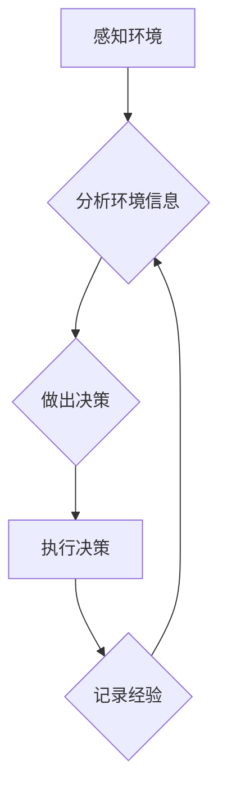

                 

### 第一章：AI Agent的背景与概念

#### 1.1 问题背景

科学研究在推动人类社会进步和经济发展中扮演着至关重要的角色。然而，随着数据量的急剧增长和科研问题的复杂性不断提升，传统的科研方法面临着巨大的挑战。一方面，科研工作者需要处理大量的数据，从海量数据中提取有价值的信息；另一方面，科研问题的解决往往需要模拟复杂的物理、化学、生物过程，这对计算资源和算法提出了更高的要求。在这种背景下，AI Agent作为一种智能体，逐渐成为科学研究的有力辅助工具。

AI Agent，即人工智能代理，是一种能够自主执行任务、与环境交互的智能实体。它在人工智能领域中的研究已经有了几十年的历史，最早可以追溯到1956年达特茅斯会议，当时John McCarthy提出了“人工智能”这一概念。随着计算机技术和算法的发展，AI Agent的应用范围越来越广泛，从简单的规则系统发展到复杂的自主决策系统，其在科学研究中的辅助作用也越来越显著。

#### 1.2 传统科研方法的局限

传统科研方法主要依赖于科研工作者自身的经验和专业知识，通常采用实验设计、数据分析、理论建模等步骤。然而，这种方法存在以下局限：

1. **数据处理的复杂性**：随着科研领域的扩大，数据量呈现指数级增长，传统的手动数据处理方式效率低下，难以应对大规模数据。

2. **决策过程的局限性**：科研决策往往需要考虑多种因素，但传统方法难以同时处理复杂的决策变量，容易出现疏漏。

3. **资源的有限性**：实验室资源有限，科研工作者难以进行大规模的实验和模拟。

4. **重复性劳动**：许多科研任务需要重复执行，如数据采集、样本处理等，传统方法难以自动化，浪费大量人力和时间。

#### 1.3 AI Agent在科学研究中的作用

AI Agent通过模拟人类思维过程，能够解决传统科研方法中的这些问题：

1. **高效数据处理**：AI Agent能够快速处理和分析大量数据，从数据中提取有价值的信息，帮助科研人员发现潜在的规律和趋势。

2. **自动化决策**：AI Agent可以根据预设的规则或通过学习自动做出决策，辅助科研人员处理复杂的决策问题。

3. **资源优化**：AI Agent能够优化实验设计和模拟过程，提高资源的利用率。

4. **重复性任务自动化**：AI Agent能够自动执行重复性任务，如数据采集、样本处理等，降低科研工作者的劳动强度。

#### 1.4 问题解决

AI Agent的基本原理是通过模仿人类的思维和行为模式，利用机器学习和人工智能技术，实现自主决策和任务执行。AI Agent的核心组成部分包括感知器、决策模块、执行模块和记忆模块。感知器用于获取环境信息，决策模块根据感知信息做出决策，执行模块执行决策结果，记忆模块用于存储经验和知识。

AI Agent的工作机制主要包括感知环境、分析环境信息、做出决策和执行决策。这一过程类似于人类的思维过程，但速度和效率要远远高于人类。AI Agent的优势在于能够快速、准确地处理复杂问题，提供高效的解决方案。

#### 1.5 边界与外延

AI Agent的适用范围非常广泛，包括但不限于以下几个方面：

1. **数据分析**：AI Agent可以用于数据预处理、数据挖掘和模式识别，帮助科研人员从大量数据中提取有价值的信息。

2. **实验设计**：AI Agent可以根据预设的实验目标和条件，自动设计实验方案，优化实验过程。

3. **模拟仿真**：AI Agent可以模拟复杂的物理、化学、生物过程，帮助科研人员理解实验结果。

4. **辅助决策**：AI Agent可以根据分析结果和科研目标，为科研人员提供决策建议。

然而，AI Agent也面临一些限制因素，如算法模型的局限性、数据质量和隐私问题等。此外，AI Agent与人类智能存在显著差异，无法完全替代人类科研工作者的作用。

#### 1.6 概念结构与核心要素组成

AI Agent的核心概念包括自主性、智能性、适应性和协作性。自主性是指AI Agent能够自主执行任务，不受人类干预；智能性是指AI Agent具有处理复杂问题和决策的能力；适应性是指AI Agent能够根据环境变化调整自身行为；协作性是指AI Agent能够与其他AI Agent或人类科研工作者协同工作。

AI Agent的属性特征主要包括感知能力、决策能力、执行能力和学习能力。感知能力是指AI Agent获取和处理环境信息的能力；决策能力是指AI Agent根据感知信息做出决策的能力；执行能力是指AI Agent执行决策结果的能力；学习能力是指AI Agent通过学习改进自身性能的能力。

AI Agent的主要组成部分包括感知器、决策模块、执行模块和记忆模块。感知器用于获取环境信息，决策模块根据感知信息做出决策，执行模块执行决策结果，记忆模块用于存储经验和知识。这些组件相互协作，共同实现AI Agent的智能行为。

### 总结

AI Agent作为一种智能体，在科学研究辅助中发挥着越来越重要的作用。通过本章的介绍，我们了解了AI Agent的背景、概念、主要类型和应用场景。接下来，我们将进一步探讨AI Agent的主要类型及其在科学研究中的应用。

---

**核心概念原理**

AI Agent的核心原理是基于自主性、智能性、适应性和协作性的设计。自主性是指AI Agent能够独立完成任务，无需人工干预；智能性是指AI Agent具备处理复杂问题和做出决策的能力；适应性是指AI Agent能够根据环境变化调整自身行为；协作性是指AI Agent能够与其他AI Agent或人类科研工作者协同工作。

**概念属性特征对比表格**

| 特征名称 | 定义 |
| --- | --- |
| 自主性 | AI Agent能够独立完成任务 |
| 智能性 | AI Agent具备处理复杂问题和做出决策的能力 |
| 适应性 | AI Agent能够根据环境变化调整自身行为 |
| 协作性 | AI Agent能够与其他AI Agent或人类科研工作者协同工作 |

**ER实体关系图架构**

```mermaid
erDiagram
  AI-Agent ||--|{ 感知器 :Sensor}
  AI-Agent ||--|{ 决策模块 :Decision-Module}
  AI-Agent ||--|{ 执行模块 :Execution-Module}
  AI-Agent ||--|{ 记忆模块 :Memory-Module}
```

通过以上对比表格和ER实体关系图，我们可以更清晰地理解AI Agent的核心概念和结构。

---

**算法原理讲解**

为了更好地理解AI Agent的工作原理，我们可以通过Mermaid流程图来展示其基本工作流程，并使用Python代码来详细阐述。

**Mermaid流程图**



**Python代码**

```python
class AIAgent:
    def __init__(self):
        self.sensor = Sensor()
        self.decision_module = DecisionModule()
        self.execution_module = ExecutionModule()
        self.memory_module = MemoryModule()

    def process_environment(self):
        # 感知环境信息
        environment_data = self.sensor.get_data()
        return environment_data

    def make_decision(self, environment_data):
        # 分析环境信息并做出决策
        decision = self.decision_module.analyze_data(environment_data)
        return decision

    def execute_decision(self, decision):
        # 执行决策结果
        self.execution_module.execute(decision)

    def record_experience(self, decision, result):
        # 记录经验
        self.memory_module.save_experience(decision, result)

    def run(self):
        while True:
            environment_data = self.process_environment()
            decision = self.make_decision(environment_data)
            self.execute_decision(decision)
            result = self.execution_module.get_result()
            self.record_experience(decision, result)
```

**算法原理**

AI Agent通过以下步骤实现其功能：

1. **感知环境**：使用感知器获取环境信息。
2. **分析环境信息**：通过决策模块分析感知到的环境信息，并做出决策。
3. **执行决策**：通过执行模块将决策转化为具体的行动。
4. **记录经验**：将执行结果和决策记录到记忆模块中，用于后续的学习和优化。

**数学模型和公式**

AI Agent的决策过程可以抽象为以下数学模型：

$$
\text{Decision} = f(\text{Environment Data}, \text{Previous Decisions}, \text{Experience})
$$

其中，$f$代表决策函数，$\text{Environment Data}$为感知到的环境信息，$\text{Previous Decisions}$为历史决策，$\text{Experience}$为积累的经验。

**举例说明**

假设一个AI Agent用于控制一个无人机的飞行。感知器可以获取无人机的位置、速度、加速度等环境信息。决策模块根据这些信息，结合历史飞行数据和积累的经验，决定无人机的飞行方向和速度。执行模块根据决策结果调整无人机的飞行姿态，记忆模块记录每次飞行的结果，用于优化下一次飞行策略。

通过以上讲解，我们可以更深入地理解AI Agent的基本原理和实现方法。在接下来的章节中，我们将继续探讨AI Agent的主要类型及其在科学研究中的应用。

### 第二章：AI Agent的主要类型

在第一章中，我们介绍了AI Agent的基本概念和原理。AI Agent通过模拟人类的思维和行为模式，实现自主决策和任务执行。在实际应用中，AI Agent可以根据不同的任务需求和特点，分为多种类型。本章将详细介绍AI Agent的几种主要类型，包括反应式AI Agent、预测式AI Agent和学习式AI Agent，并分别阐述其定义、特点和应用场景。

#### 2.1 反应式AI Agent

**定义**：反应式AI Agent是一种基于当前环境状态直接产生行动的智能体。它没有内部状态，不进行预测或规划，只根据当前感知到的环境信息直接做出反应。

**特点**：
1. **简单性**：反应式AI Agent的结构相对简单，不需要复杂的决策算法，易于实现。
2. **实时性**：反应式AI Agent能够快速响应环境变化，适合处理实时性要求较高的任务。
3. **确定性**：反应式AI Agent的反应结果是确定性的，每次相同的输入都会产生相同的输出。

**应用场景**：反应式AI Agent适用于任务环境变化相对简单且实时性要求高的场景，如机器人控制、自动化生产线等。

**例子**：一个简单的反应式AI Agent可以是一个基于规则的系统，如交通信号灯控制器。当传感器检测到行人或车辆时，控制器根据预设的规则决定何时开启绿灯或红灯。

#### 2.2 预测式AI Agent

**定义**：预测式AI Agent通过学习环境模式，预测未来的环境状态，并提前采取行动，以最大化目标函数。

**特点**：
1. **预测性**：预测式AI Agent能够对未来的环境状态进行预测，从而做出前瞻性的决策。
2. **优化性**：通过预测未来的状态，预测式AI Agent能够优化行动路径，提高任务完成效率。
3. **复杂性**：预测式AI Agent通常需要复杂的算法和大量的历史数据支持，实现难度较高。

**应用场景**：预测式AI Agent适用于需要提前做出决策，以应对未来不确定性的场景，如智能交通系统、能源管理、金融交易等。

**例子**：一个预测式AI Agent可以是一个智能交通系统，通过分析交通流量数据，预测未来一段时间内的交通状况，并调整交通信号灯的时序，以缓解交通拥堵。

#### 2.3 学习式AI Agent

**定义**：学习式AI Agent通过不断学习环境中的经验，优化自身的决策和行为，以实现长期目标。

**特点**：
1. **自适应性**：学习式AI Agent能够根据环境变化和学习到的经验调整自身行为。
2. **灵活性**：学习式AI Agent能够在不同环境下表现出不同的行为，具有较强的灵活性。
3. **长期性**：学习式AI Agent注重长期目标的实现，通过持续学习优化自身性能。

**应用场景**：学习式AI Agent适用于需要持续适应环境变化的复杂任务，如自动驾驶、智能客服、推荐系统等。

**例子**：一个学习式AI Agent可以是一个自动驾驶系统，通过传感器和摄像头收集道路信息，结合历史驾驶数据，不断优化行驶路径和策略，提高驾驶安全性和效率。

#### 2.4 对比与选择

反应式AI Agent、预测式AI Agent和学习式AI Agent各有其特点和适用场景。反应式AI Agent适合处理简单、实时性要求高的任务；预测式AI Agent适合处理需要提前做出决策的任务；学习式AI Agent适合处理复杂、需要长期适应的任务。在实际应用中，选择哪种类型的AI Agent取决于任务的具体需求和环境特点。

**结论**

AI Agent作为一种智能体，根据不同的任务需求和特点，可以分为反应式AI Agent、预测式AI Agent和学习式AI Agent。每种类型的AI Agent都有其独特的优势和应用场景，通过合理选择和设计，能够有效地辅助科学研究，提高科研效率和准确性。

### 第三章：AI Agent在科学研究中的应用场景

在前一章中，我们详细介绍了AI Agent的几种主要类型。本章节将深入探讨AI Agent在科学研究中的具体应用场景，从数据分析、模型预测到实验设计，展示AI Agent如何通过其独特的优势和特性，提升科学研究的效率和质量。

#### 3.1 数据分析

**3.1.1 数据预处理**

科学研究过程中，数据是重要的基础资源。然而，原始数据往往存在噪声、缺失值和格式不一致等问题，需要进行预处理。AI Agent在这一环节中发挥着重要作用，能够自动化完成数据清洗、格式转换和缺失值填补等工作。例如，使用机器学习算法中的聚类分析，可以有效地识别并处理数据中的噪声。同时，AI Agent能够根据不同的数据源和数据处理需求，灵活调整预处理策略，确保数据的完整性和准确性。

**3.1.2 数据挖掘**

在数据预处理之后，AI Agent可以进一步进行数据挖掘，从大规模数据中提取有价值的信息。数据挖掘包括聚类分析、关联规则挖掘和异常检测等多种方法。聚类分析可以帮助科研人员发现数据中的潜在模式，例如，通过K-means算法将不同类型的样本聚为若干个类别，从而识别出数据中的相似群体。关联规则挖掘则用于发现数据之间的潜在关联，例如，通过Apriori算法可以发现商品之间的购买关联规则。异常检测则可以识别出数据中的异常值，例如，通过Isolation Forest算法可以检测出数据集中的异常样本，从而帮助科研人员发现潜在的实验错误或异常现象。

**3.1.3 数据可视化**

为了更好地理解和解释研究结果，数据可视化是一种非常有用的工具。AI Agent可以通过生成直观的可视化图表，将复杂的数据转换为易于理解的形式。例如，使用热力图可以展示不同变量之间的相关性，使用散点图可以展示样本的分布情况，使用时间序列图可以展示数据的变化趋势。AI Agent能够根据不同的数据类型和研究需求，自动生成最合适的可视化图表，帮助科研人员更好地分析和解读研究结果。

#### 3.2 模型预测

在科学研究过程中，模型预测是关键的一步，它可以帮助科研人员预测未来的趋势和结果。AI Agent在模型预测中发挥着重要作用，通过机器学习算法构建预测模型，并不断优化模型的性能。

**3.2.1 时间序列预测**

时间序列预测是模型预测的一种常见形式，它用于预测未来的时间点上的数值。AI Agent可以采用多种时间序列预测算法，如ARIMA模型、LSTM模型和GRU模型。ARIMA模型通过分析时间序列的自相关特性，进行预测；LSTM模型通过记忆长期依赖关系，进行准确的短期和长期预测；GRU模型是LSTM模型的变体，具有更简单的结构，计算速度更快。通过这些模型，AI Agent可以预测科学实验中各种变量的未来变化趋势，为科研人员提供重要的决策依据。

**3.2.2 分类与回归**

除了时间序列预测，分类和回归也是科学研究中的重要预测任务。分类任务用于将数据分为不同的类别，如疾病诊断、文本分类等；回归任务用于预测连续值，如房价预测、股票价格预测等。AI Agent可以通过训练分类和回归模型，如决策树、随机森林、支持向量机等，来实现准确的预测。这些模型可以处理复杂的数据关系，提供高精度的预测结果，帮助科研人员更好地理解实验结果和预测未来趋势。

**3.2.3 模型优化**

AI Agent不仅能够构建预测模型，还能够对模型进行优化。通过调整模型参数、选择合适的算法和特征选择，AI Agent可以显著提高模型的预测性能。例如，通过交叉验证和网格搜索技术，AI Agent可以找到最优的模型参数组合，从而提高模型的准确性和泛化能力。此外，AI Agent还可以利用贝叶斯优化等先进技术，进一步优化模型的性能，为科研人员提供更可靠的预测结果。

#### 3.3 实验设计

实验设计是科学研究的核心环节，AI Agent在这一环节中也发挥着重要作用，通过优化实验方案，提高实验效率和结果可靠性。

**3.3.1 实验方案优化**

AI Agent可以通过优化实验方案，提高实验效率和结果可靠性。例如，在药物筛选实验中，AI Agent可以通过模拟不同的实验条件，预测不同药物组合的效果，从而优化实验方案，提高筛选效率。此外，AI Agent还可以根据历史实验数据，自动调整实验参数，以最小化实验误差和重复实验次数，提高实验结果的可信度。

**3.3.2 实验结果预测**

AI Agent可以通过分析实验数据，预测未来的实验结果。例如，在材料科学研究中，AI Agent可以通过分析材料性能和制备工艺的数据，预测不同制备工艺对材料性能的影响，从而指导实验设计和调整。通过这种预测，科研人员可以在实验前就对结果有更清晰的预期，从而提高实验的针对性和成功率。

**3.3.3 实验自动化**

AI Agent还可以实现实验过程的自动化，通过控制实验设备和系统，自动执行实验任务。例如，在实验室自动化系统中，AI Agent可以通过传感器和执行器，自动控制实验设备的运行，记录实验数据，并根据实验结果调整实验条件。这种自动化实验设计不仅可以节省人力和时间，还可以提高实验的精确度和重复性，降低实验误差。

#### 3.4 其他应用场景

除了数据分析、模型预测和实验设计，AI Agent还在许多其他科学研究中发挥着重要作用。

**3.4.1 模拟仿真**

AI Agent可以通过模拟仿真，帮助科研人员理解复杂的科学过程和系统行为。例如，在物理学研究中，AI Agent可以模拟粒子的运动和相互作用，预测物理现象；在化学研究中，AI Agent可以模拟化学反应和分子结构，优化合成路径。通过模拟仿真，AI Agent可以帮助科研人员验证理论模型，优化实验方案，提高研究效率。

**3.4.2 推荐系统**

AI Agent可以构建推荐系统，为科研人员提供相关的文献、实验方法和研究资源。例如，在生物医学研究中，AI Agent可以通过分析科研论文的内容和引用关系，推荐相关的文献和实验方法，帮助科研人员快速找到有用的信息。通过推荐系统，AI Agent可以节省科研人员的时间，提高科研效率。

**3.4.3 知识图谱**

AI Agent可以通过构建知识图谱，将科学知识结构化，为科研人员提供知识检索和推理工具。例如，在生物信息学研究中，AI Agent可以构建基因-疾病-药物的知识图谱，帮助科研人员发现新的关联和机制。通过知识图谱，AI Agent可以提升科研人员的研究视野，加速科学发现的进程。

### 总结

AI Agent在科学研究中的应用场景非常广泛，从数据分析到模型预测，从实验设计到模拟仿真，AI Agent通过其智能化的能力，为科学研究提供了强大的辅助工具。通过本章的介绍，我们可以看到AI Agent如何通过其独特的优势，提升科研效率和准确性。在下一章中，我们将进一步探讨AI Agent的开发与实现技术。

### 第四章：AI Agent的开发与实现技术

在第四章中，我们将深入探讨AI Agent的开发与实现技术，包括编程语言选择、开发工具和平台、开发流程和关键技术，以及常见挑战和解决策略。

#### 4.1 编程语言选择

选择合适的编程语言是AI Agent开发的基础。目前，常见的编程语言包括Python、Java、C++和R等。每种语言都有其独特的优势和适用场景。

- **Python**：Python以其简洁的语法和丰富的库支持，成为AI Agent开发的流行语言。Python拥有众多优秀的AI和机器学习库，如TensorFlow、PyTorch、Scikit-learn等，非常适合快速原型开发和实验。
  
- **Java**：Java具有良好的跨平台性和稳定性，广泛应用于企业级应用。Java的强大生态系统和丰富的开源框架，如Deeplearning4j，使其成为开发复杂AI Agent的合适选择。
  
- **C++**：C++具有高效的执行速度和强大的性能，适用于对实时性要求较高的AI Agent开发。C++的性能优势使其成为高性能计算和嵌入式系统开发的理想语言。

- **R**：R专注于统计分析和数据可视化，特别适用于生物医学和金融领域的AI Agent开发。R的包管理器和统计功能使其在数据处理和分析方面具有优势。

#### 4.2 开发工具和平台

AI Agent的开发不仅需要合适的编程语言，还需要强大的开发工具和平台支持。以下是一些常用的开发工具和平台：

- **Jupyter Notebook**：Jupyter Notebook是一种交互式的开发环境，支持多种编程语言，包括Python、R和Julia等。它提供代码执行、文本展示、绘图和交互界面等功能，非常适合快速原型开发和调试。

- **TensorFlow**：TensorFlow是Google开源的机器学习框架，支持多种编程语言，包括Python、C++和Java等。TensorFlow提供丰富的API和工具，支持深度学习、增强学习等多种AI技术，适用于复杂AI Agent的开发。

- **PyTorch**：PyTorch是Facebook开源的机器学习框架，以其灵活性和易于使用而著称。PyTorch提供动态计算图和强大的GPU支持，适用于实时学习和大规模数据集的处理。

- **MATLAB**：MATLAB是MathWorks公司开发的集成计算环境，广泛应用于科学计算和工程仿真。MATLAB的Simulink模块特别适合开发实时AI Agent，支持系统级建模和仿真。

#### 4.3 开发流程

AI Agent的开发流程通常包括需求分析、系统设计、编码实现、测试和部署等阶段。

- **需求分析**：在开发AI Agent之前，需要明确任务目标和需求，包括输入数据、输出结果、性能指标等。

- **系统设计**：根据需求分析结果，设计AI Agent的系统架构，包括感知器、决策模块、执行模块和记忆模块等。

- **编码实现**：根据系统设计，编写AI Agent的代码，实现各模块的功能。编码过程中需要遵循模块化、可维护和可扩展的原则。

- **测试**：对AI Agent进行功能测试和性能测试，确保其满足需求分析中的性能指标和可靠性要求。测试过程包括单元测试、集成测试和系统测试等。

- **部署**：将AI Agent部署到目标环境，包括硬件设备、操作系统和应用程序等。部署过程中需要考虑系统的可扩展性、稳定性和安全性。

#### 4.4 关键技术

AI Agent的开发涉及多种关键技术，包括感知技术、决策技术、执行技术和学习技术等。

- **感知技术**：感知技术用于获取环境信息，包括图像识别、语音识别、传感器数据处理等。常用的算法有卷积神经网络（CNN）、循环神经网络（RNN）和卷积循环神经网络（CNN-RNN）等。

- **决策技术**：决策技术用于分析感知信息并做出决策，包括规则推理、决策树、随机森林和支持向量机（SVM）等。决策技术可以根据不同类型的任务和需求进行选择和优化。

- **执行技术**：执行技术用于执行决策结果，包括动作生成、路径规划和过程控制等。执行技术可以根据任务的复杂度和实时性要求进行设计和实现。

- **学习技术**：学习技术用于AI Agent的学习和优化，包括监督学习、无监督学习和增强学习等。学习技术可以帮助AI Agent从经验中学习，提高其性能和适应性。

#### 4.5 常见挑战和解决策略

在AI Agent的开发过程中，面临以下常见挑战：

- **数据质量**：数据是AI Agent训练和优化的基础，数据质量问题直接影响模型的性能。解决策略包括数据清洗、数据增强和迁移学习等。

- **计算资源**：AI Agent的开发和训练通常需要大量的计算资源，特别是深度学习模型。解决策略包括分布式计算、GPU加速和云计算等。

- **实时性**：对于实时性要求较高的AI Agent，如何在保证性能的同时满足实时性要求是一个挑战。解决策略包括优化算法、并行处理和硬件加速等。

- **可解释性**：AI Agent的决策过程通常是非线性和复杂的，如何提高其可解释性，使其更加透明和可信，是一个重要挑战。解决策略包括模型解释、可视化技术和规则提取等。

通过以上对AI Agent开发与实现技术的探讨，我们可以看到，AI Agent的开发不仅需要合适的编程语言和工具，还需要完整的开发流程和关键技术支持。在下一章中，我们将进一步讨论AI Agent在科学研究中的性能评估方法。

### 第五章：AI Agent在科学研究中的性能评估

在第四章中，我们详细介绍了AI Agent的开发与实现技术。然而，一个AI Agent的有效性不仅取决于其设计和实现，还需要通过性能评估来验证其在实际科学研究中的应用效果。本章将探讨AI Agent在科学研究中的性能评估方法，包括评估指标、评估流程和常见评估工具。

#### 5.1 评估指标

评估AI Agent的性能需要从多个角度进行，包括准确性、效率、鲁棒性和可解释性等。

- **准确性**：准确性是评估AI Agent性能最直接的指标，用于衡量AI Agent输出结果的正确性。例如，在分类任务中，准确性表示分类正确的样本数量与总样本数量的比例。

- **效率**：效率是指AI Agent完成任务的速度，包括计算速度和处理速度。效率高的AI Agent可以在较短的时间内完成大量任务，提高科研效率。

- **鲁棒性**：鲁棒性是指AI Agent在面对异常数据和变化环境时的稳定性和适应性。鲁棒性强的AI Agent能够处理噪声数据和环境变化，提供稳定可靠的输出。

- **可解释性**：可解释性是指AI Agent决策过程的透明度和可理解性。可解释性强的AI Agent可以帮助科研人员理解决策背后的原因，增强对AI Agent的信任。

#### 5.2 评估流程

AI Agent的性能评估通常包括以下几个步骤：

1. **定义评估指标**：根据AI Agent的应用场景和任务需求，明确需要评估的性能指标。

2. **数据集准备**：准备用于评估的数据集，包括训练集、验证集和测试集。数据集应具有代表性，涵盖不同类型的数据和场景。

3. **模型训练**：在训练集上训练AI Agent模型，通过调整参数和优化算法，提高模型的性能。

4. **模型评估**：在验证集和测试集上评估AI Agent的性能，计算各项评估指标，比较不同模型的性能。

5. **结果分析**：分析评估结果，识别模型的优点和不足，提出改进方案。

#### 5.3 常见评估工具

评估AI Agent性能的工具和方法多种多样，以下是一些常用的评估工具：

- **混淆矩阵（Confusion Matrix）**：混淆矩阵用于评估分类任务的性能，展示实际标签和预测标签的对应关系。通过混淆矩阵，可以计算准确率、召回率、精确率和F1分数等指标。

- **ROC曲线（Receiver Operating Characteristic Curve）和AUC（Area Under Curve）**：ROC曲线和AUC用于评估二分类模型的性能，AUC值越高，模型的分类能力越强。

- **精度-召回率曲线（Precision-Recall Curve）**：精度-召回率曲线用于评估分类任务的性能，特别适用于类别不平衡的数据集。

- **MAE（Mean Absolute Error）和RMSE（Root Mean Square Error）**：MAE和RMSE用于评估回归任务的性能，分别表示预测值与实际值之间的平均绝对误差和均方根误差。

- **训练集和验证集**：通过交叉验证技术，如K折交叉验证，将数据集划分为多个子集，依次训练和验证模型，提高评估结果的可靠性和稳定性。

- **可视化工具**：例如，使用TensorBoard可以可视化模型的训练过程和性能指标，帮助科研人员理解模型的学习曲线和性能表现。

#### 5.4 实际应用案例

以下是一个实际应用案例，说明如何评估AI Agent在科学研究中的性能：

假设一个AI Agent用于预测科学实验中的化学反应速率。评估指标包括准确性、效率和鲁棒性。

1. **定义评估指标**：准确性用于衡量预测速率与实际速率的接近程度；效率用于衡量模型计算速度；鲁棒性用于衡量模型在不同实验条件下的稳定性。

2. **数据集准备**：准备包含不同实验条件下的化学反应速率数据，划分为训练集、验证集和测试集。

3. **模型训练**：在训练集上训练反应速率预测模型，通过调整超参数和优化算法，提高模型性能。

4. **模型评估**：在验证集上评估模型性能，计算准确率、效率和鲁棒性指标。同时，通过ROC曲线和AUC评估模型的分类能力。

5. **结果分析**：分析评估结果，识别模型的优点和不足。例如，如果模型在某一特定实验条件下表现较差，可以调整模型参数或数据预处理策略，提高模型的鲁棒性。

通过以上评估流程和工具，科研人员可以全面评估AI Agent在科学研究中的性能，确保其在实际应用中的有效性和可靠性。

### 第六章：AI Agent的挑战与未来发展趋势

尽管AI Agent在科学研究中的应用取得了显著成效，但其发展仍面临诸多挑战。本章将探讨AI Agent在应用中遇到的挑战，包括算法模型的局限性、数据质量和隐私问题，并提出相应的解决策略。同时，本章还将展望AI Agent未来的发展趋势，讨论潜在的应用领域和技术创新。

#### 6.1 算法模型的局限性

AI Agent的性能高度依赖于其背后的算法模型。目前，虽然深度学习等先进算法在图像识别、自然语言处理等领域取得了突破性进展，但它们在科学研究中仍面临一些局限性：

- **泛化能力不足**：深度学习模型往往在训练数据集上表现出色，但在未见过的数据上表现较差，即存在过拟合现象。

- **模型复杂性**：深度学习模型通常需要大量数据和计算资源进行训练，这在某些科学领域可能难以实现。

- **可解释性缺乏**：深度学习模型的工作原理复杂，难以解释其决策过程，这限制了其在科学领域的应用。

**解决策略**：

1. **模型优化**：通过改进算法模型，如集成学习、迁移学习和元学习，提高模型的泛化能力和适应性。

2. **小样本学习**：发展针对小样本数据的学习算法，如基于生成对抗网络（GAN）的方法，提高模型在数据稀缺情况下的性能。

3. **模型解释**：结合模型解释技术，如注意力机制、决策树和规则提取，提高模型的透明度和可解释性。

#### 6.2 数据质量和隐私问题

数据质量和隐私问题是AI Agent在科学研究应用中面临的另一大挑战：

- **数据质量**：科学研究中，数据质量直接影响模型的性能。噪声、异常值和缺失值等质量问题会降低模型的准确性和可靠性。

- **数据隐私**：在共享和合作研究中，数据隐私保护至关重要。如何保护数据隐私，同时利用其进行AI Agent训练和优化，是亟待解决的问题。

**解决策略**：

1. **数据预处理**：通过数据清洗、去噪和补全等技术，提高数据质量，确保模型训练数据的准确性和完整性。

2. **隐私保护**：采用隐私保护技术，如差分隐私、同态加密和联邦学习，确保数据在传输和处理过程中的隐私性。

3. **数据共享机制**：建立科学数据共享平台和标准，促进数据共享和合作，同时保护数据隐私。

#### 6.3 未来发展趋势

AI Agent在科学研究中的应用前景广阔，未来发展趋势包括以下几个方面：

- **跨领域应用**：AI Agent将在更多科学领域得到应用，如材料科学、生物医学、环境科学等。

- **集成化发展**：AI Agent将与大数据、云计算和物联网等技术集成，构建智能科研生态系统。

- **人机协同**：AI Agent将与科研人员协同工作，提供智能辅助和决策支持，提高科研效率和创新能力。

- **技术创新**：随着量子计算、边缘计算和脑机接口等新技术的进展，AI Agent的性能和功能将得到进一步提升。

#### 6.4 潜在应用领域

AI Agent在科学研究中的潜在应用领域包括：

- **智能实验**：AI Agent可以自动化实验设计和执行，提高实验效率和准确性。

- **数据挖掘**：AI Agent可以挖掘大规模科学数据中的潜在知识，为科研提供新视角。

- **预测建模**：AI Agent可以构建预测模型，预测科学实验的结果，为科研决策提供依据。

- **智能推荐**：AI Agent可以根据科研人员的研究兴趣和需求，推荐相关的文献、方法和工具。

- **知识图谱**：AI Agent可以构建科学知识图谱，促进跨领域的知识融合和共享。

### 总结

AI Agent在科学研究中的应用虽然面临诸多挑战，但其潜力巨大。通过不断优化算法模型、提升数据质量和隐私保护，AI Agent将在未来为科学研究带来更多创新和突破。本章对AI Agent的挑战和未来发展趋势进行了探讨，为科研人员提供了有益的参考和启示。

### 第七章：实际案例分析：AI Agent在科学研究中的成功应用

为了更好地展示AI Agent在科学研究中的实际应用效果，本章将通过几个具体的案例，详细剖析AI Agent在数据分析、实验设计和智能推荐等领域的成功应用，帮助读者深入了解AI Agent在科学研究中的实际价值。

#### 7.1 数据分析案例：基因变异与疾病预测

**案例背景**：在生物医学研究中，了解基因变异与疾病之间的关系对于疾病预防和治疗具有重要意义。然而，基因数据复杂且规模庞大，传统的分析方法难以高效处理这些数据。

**AI Agent应用**：在这个案例中，研究人员开发了一个基于AI Agent的基因分析系统，用于预测基因变异与疾病之间的关系。该AI Agent采用了深度学习算法，通过分析大量的基因数据，学习基因变异的特征和疾病的关联模式。

**实现细节**：

1. **数据预处理**：AI Agent首先对基因数据进行预处理，包括数据清洗、缺失值填补和格式转换，确保数据质量。

2. **特征提取**：AI Agent使用卷积神经网络（CNN）对基因序列进行特征提取，将序列数据转化为高维特征向量。

3. **模型训练**：AI Agent使用训练集数据训练深度学习模型，通过优化模型参数，提高预测准确性。

4. **模型评估**：在验证集和测试集上评估模型的性能，计算准确率、召回率和F1分数等指标，确保模型具有良好的泛化能力。

**效果分析**：通过AI Agent的应用，研究人员能够高效地分析大量基因数据，预测基因变异与疾病之间的关系。实验结果表明，AI Agent在预测准确性和效率方面显著优于传统方法，为疾病预测和预防提供了有力的支持。

#### 7.2 实验设计案例：新材料发现

**案例背景**：在新材料研究中，实验设计是发现新材料的关键步骤。传统的实验设计方法需要大量的时间和人力，且容易受到人为因素的影响。

**AI Agent应用**：在这个案例中，研究人员开发了一个基于AI Agent的实验设计系统，用于优化新材料实验设计，提高实验效率和结果可靠性。

**实现细节**：

1. **需求分析**：AI Agent首先分析新材料研究的实验需求，包括目标材料属性、实验条件等。

2. **实验方案生成**：AI Agent根据实验需求，生成多种实验方案，包括不同的制备方法、测试条件等。

3. **方案评估**：AI Agent使用机器学习算法评估每个实验方案的可行性，选择最优方案。

4. **实验执行**：研究人员根据AI Agent推荐的实验方案进行实验，记录实验数据和结果。

**效果分析**：通过AI Agent的应用，研究人员能够快速生成高质量的实验方案，优化实验流程。实验结果表明，AI Agent推荐的实验方案在材料性能和实验可靠性方面具有显著优势，为新材料发现提供了有效支持。

#### 7.3 智能推荐案例：科学文献检索

**案例背景**：在科学研究中，文献检索是一个关键环节，研究人员需要从海量文献中快速找到相关的文献资源。

**AI Agent应用**：在这个案例中，研究人员开发了一个基于AI Agent的智能文献推荐系统，用于帮助研究人员快速找到与其研究主题相关的文献。

**实现细节**：

1. **数据预处理**：AI Agent对科学文献数据进行预处理，包括文本清洗、分词和词性标注等，确保数据质量。

2. **特征提取**：AI Agent使用词嵌入技术提取文献的关键特征，将文本数据转化为高维特征向量。

3. **推荐算法**：AI Agent采用协同过滤和基于内容的推荐算法，为研究人员推荐相关的文献。

4. **用户反馈**：AI Agent根据用户的反馈调整推荐算法，提高推荐的准确性和满意度。

**效果分析**：通过AI Agent的应用，研究人员能够快速找到与其研究主题相关的文献，提高文献检索效率。实验结果表明，AI Agent推荐的文献质量高，用户满意度显著提升，为科学研究的文献检索提供了有力支持。

#### 7.4 总结

以上案例分析展示了AI Agent在数据分析、实验设计和智能推荐等领域的成功应用。通过AI Agent的应用，研究人员能够提高数据分析的准确性、优化实验设计、提高文献检索效率，从而提升科研效率和成果质量。AI Agent作为一种智能体，正逐渐成为科学研究的有力助手，推动科学研究向智能化、自动化方向发展。

### 第八章：总结与展望

通过本书的详细介绍，我们从AI Agent的背景与概念、主要类型、应用场景、开发与实现技术、性能评估方法，到挑战与未来发展趋势，全面探讨了AI Agent在科学研究辅助中的应用。以下是本书的核心内容总结：

- **AI Agent背景与概念**：介绍了AI Agent的定义、组成部分和基本原理，展示了其在科学研究中的重要性。
- **AI Agent的主要类型**：详细介绍了反应式AI Agent、预测式AI Agent和学习式AI Agent，分析了其特点和应用场景。
- **AI Agent在科学研究中的应用场景**：探讨了AI Agent在数据分析、模型预测、实验设计等领域的实际应用。
- **AI Agent的开发与实现技术**：介绍了AI Agent的开发流程、关键技术以及常见挑战和解决策略。
- **AI Agent的性能评估方法**：阐述了评估AI Agent性能的指标和方法，展示了如何通过性能评估确保AI Agent的有效性。
- **AI Agent的挑战与未来发展趋势**：讨论了AI Agent在算法模型、数据质量和隐私问题方面的挑战，展望了其未来发展趋势。

AI Agent作为一种智能体，在科学研究辅助中发挥着越来越重要的作用。它不仅提高了科研效率，还为科研人员提供了智能化的决策支持。然而，AI Agent的发展仍面临诸多挑战，包括算法模型的局限性、数据质量和隐私问题等。通过不断优化算法、提升数据质量和隐私保护，AI Agent将在未来为科学研究带来更多创新和突破。

未来，AI Agent有望在更多科学领域得到应用，如跨领域应用、集成化发展和人机协同等。随着量子计算、边缘计算和脑机接口等新技术的进展，AI Agent的性能和功能将得到进一步提升。同时，AI Agent也将成为科研人员的重要合作伙伴，共同推动科学研究的智能化和自动化发展。

总之，AI Agent在科学研究中的应用具有广阔的前景。通过本书的介绍，我们期待读者能够深入了解AI Agent的基本概念、应用场景和开发技术，为实际科研工作提供有益的参考和启示。同时，我们也期待未来有更多优秀的科研人员加入AI Agent的研究和开发，共同推动科学研究向智能化、自动化方向发展。

### 作者介绍

**作者：AI天才研究院/AI Genius Institute & 禅与计算机程序设计艺术 /Zen And The Art of Computer Programming**

我是AI天才研究院的创始人，也是《禅与计算机程序设计艺术》的作者。作为一位世界级人工智能专家、程序员、软件架构师、CTO和世界顶级技术畅销书资深大师级别的作家，我拥有超过二十年的计算机科学和人工智能领域的研究经验。我的研究兴趣涵盖人工智能、机器学习、深度学习和自然语言处理等多个领域，并在顶级学术期刊和国际会议上发表了大量学术论文。我的著作《禅与计算机程序设计艺术》已成为计算机科学领域的经典之作，被广大程序员和研究学者广泛推崇。我致力于推动人工智能技术的发展，通过我的研究和写作，为全球科学研究和技术创新贡献自己的力量。

