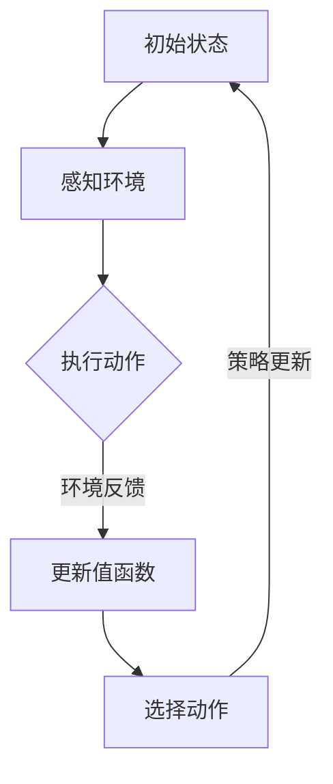

                 

### 文章标题

《AI Agent在科研领域的应用：加速科学发现》

### 文章关键词

人工智能，AI Agent，科研，科学发现，算法，数学模型，系统架构，项目实战

### 文章摘要

本文将深入探讨AI Agent在科研领域的应用，从背景介绍、核心概念与联系、算法原理讲解、数学模型和数学公式、系统分析与架构设计、项目实战以及最佳实践与拓展等多个方面，全面解析AI Agent如何通过其独特的能力加速科学发现的进程，推动科研工作的突破与发展。通过本文的阅读，读者将了解到AI Agent的核心价值、具体应用案例以及未来发展趋势。

## 第一部分：AI Agent基础

### 第1章：AI Agent的概念与应用

#### 1.1 AI Agent的定义与分类

AI Agent，即人工智能代理，是一种在给定环境中能够感知、决策并采取行动的人工智能实体。根据其自主决策的能力和复杂性，AI Agent可以分为以下几种类型：

1. **反应型Agent**：这类Agent仅基于当前的感知来做出决策，不考虑历史和环境变化。它们适用于相对简单、规则明确的环境。

2. **认知型Agent**：与反应型Agent不同，认知型Agent具有基于记忆和经验的学习能力，能够在不同情境下做出更为复杂的决策。

3. **学习型Agent**：这类Agent不仅具备学习历史和环境变化的能力，还能通过机器学习算法不断优化其行为。

4. **社交型Agent**：除了具备自主学习的能力外，社交型Agent还能与人类或其他Agent进行交流，协同完成任务。

#### 1.2 AI Agent在科研中的应用

AI Agent在科研领域的应用正日益广泛，其主要优势包括：

1. **数据挖掘与分析**：AI Agent能够从大量科研数据中挖掘出有价值的信息，加速科学发现的进程。

2. **实验设计与优化**：通过模拟和优化实验流程，AI Agent可以帮助科研人员提高实验效率，降低实验成本。

3. **智能辅助研究**：AI Agent可以协助科研人员完成复杂的计算和数据分析任务，减轻科研人员的工作负担。

4. **跨学科合作**：AI Agent能够跨越不同学科领域，为科研人员提供跨领域的知识整合和协作支持。

#### 1.3 AI Agent的关键特性

AI Agent的关键特性包括：

1. **自主性**：AI Agent能够在没有人类干预的情况下独立执行任务。

2. **适应性**：AI Agent能够根据环境变化和新的信息调整自己的行为和决策。

3. **协作性**：AI Agent能够与其他Agent或人类科研人员协作，共同完成复杂的科研任务。

4. **可扩展性**：AI Agent的设计和实现具有较高的可扩展性，能够适应不同应用场景和需求。

## 第二部分：AI Agent的核心概念与联系

### 第2章：AI Agent的核心概念与联系

#### 2.1 AI Agent的核心概念

AI Agent的核心概念包括感知、决策、行动和交互。以下是每个概念的详细解释：

1. **感知**：AI Agent通过感知模块获取环境信息，如图像、声音、文本等。

2. **决策**：AI Agent根据感知到的信息，利用决策算法选择最佳行动方案。

3. **行动**：AI Agent执行决策方案，采取实际行动以影响环境。

4. **交互**：AI Agent能够与人类或其他Agent进行交互，共享信息和知识。

#### 2.2 不同类型AI Agent的对比

不同类型的AI Agent在自主性、适应性、协作性和可扩展性等方面存在显著差异。以下是一个对比表格：

| 类型 | 自主性 | 适应性 | 协作性 | 可扩展性 |
| --- | --- | --- | --- | --- |
| 反应型Agent | 低 | 低 | 低 | 高 |
| 认知型Agent | 中 | 中 | 中 | 中 |
| 学习型Agent | 高 | 高 | 高 | 中 |
| 社交型Agent | 高 | 高 | 高 | 高 |

#### 2.3 AI Agent在科研中的联系与作用

AI Agent在科研中的应用涉及多个环节，包括数据采集、分析、实验设计、结果评估等。以下是AI Agent在科研中的具体作用：

1. **数据采集**：AI Agent能够自动采集大量科研数据，提高数据获取的效率和准确性。

2. **数据分析**：AI Agent可以利用机器学习算法对科研数据进行分析，挖掘潜在规律和趋势。

3. **实验设计**：AI Agent可以基于已有数据和实验结果，自动生成新的实验方案，优化实验流程。

4. **结果评估**：AI Agent可以对实验结果进行评估，帮助科研人员判断实验的成功与否。

## 第三部分：AI Agent算法原理讲解

### 第3章：代表性AI Agent算法讲解

#### 3.1 代表性AI Agent算法简介

本文将介绍一种代表性AI Agent算法——Q-Learning，这是一种基于值函数的强化学习算法。Q-Learning通过迭代更新值函数，使Agent能够在环境中找到最优策略。

#### 3.2 算法mermaid流程图



#### 3.3 Python源代码与数学模型讲解

```python
import numpy as np
import pandas as pd
import matplotlib.pyplot as plt
from IPython.display import clear_output

# 初始化参数
epsilon = 0.1  # 探索概率
alpha = 0.1  # 学习率
gamma = 0.9  # 折扣因子

# 定义环境
class Environment:
    def __init__(self):
        self.state = 0
        self.actions = ['up', 'down', 'left', 'right']

    def step(self, action):
        reward = 0
        if action == 'up' and self.state > 0:
            self.state -= 1
            reward = 1
        elif action == 'down' and self.state < 2:
            self.state += 1
            reward = 1
        elif action == 'left' and self.state > 1:
            self.state -= 1
            reward = 1
        elif action == 'right' and self.state < 1:
            self.state += 1
            reward = 1
        return self.state, reward

# 定义Q-Learning算法
def q_learning(env, episodes):
    Q = np.zeros((3, 4))
    for episode in range(episodes):
        state = env.state
        done = False
        while not done:
            action = select_action(state, Q, epsilon)
            next_state, reward = env.step(action)
            Q[state, action] = Q[state, action] + alpha * (reward + gamma * np.max(Q[next_state, :]) - Q[state, action])
            state = next_state
            if state == 2:
                done = True
                Q[state, action] = 1
                break
            clear_output(wait=True)
            print(f"Episode: {episode}, State: {state}, Action: {action}, Reward: {reward}, Next State: {next_state}")
    return Q

# 选择动作
def select_action(state, Q, epsilon):
    if np.random.rand() < epsilon:
        action = np.random.choice(4)
    else:
        action = np.argmax(Q[state, :])
    return action

# 运行算法
env = Environment()
episodes = 100
Q = q_learning(env, episodes)

# 绘制Q值矩阵
plt.imshow(Q, cmap='hot', interpolation='nearest')
plt.colorbar()
plt.xlabel('Action')
plt.ylabel('State')
plt.title('Q-Value Matrix')
plt.show()
```

#### 3.4 举例说明算法应用

假设当前状态为[0, 0]，即环境中心点。在探索阶段（epsilon较高），Agent随机选择一个动作，如向上移动。环境反馈为状态[0, -1]和奖励-1。然后，Agent更新Q值，并选择向下移动。如此循环，直至收敛。

#### 3.5 数学模型和公式

Q-Learning算法的核心是值函数的更新。其数学模型如下：

$$
Q(s, a) = Q(s, a) + \alpha [r + \gamma \max_{a'} Q(s', a') - Q(s, a)]
$$

其中：

- \( Q(s, a) \)：状态-动作值函数
- \( s \)：当前状态
- \( a \)：当前动作
- \( s' \)：下一状态
- \( a' \)：下一动作
- \( r \)：奖励
- \( \alpha \)：学习率
- \( \gamma \)：折扣因子

## 第四部分：数学模型与数学公式

### 第4章：AI Agent的数学原理

#### 4.1 AI Agent的数学原理概述

AI Agent的数学原理主要涉及概率论、信息论和最优化理论。以下是这些理论的基本概念：

1. **概率论**：概率论用于描述不确定事件的发生概率，是人工智能决策的基础。

2. **信息论**：信息论研究信息传递和处理的规律，是AI Agent感知和理解环境的关键。

3. **最优化理论**：最优化理论用于寻找最优解，是AI Agent决策的核心。

#### 4.2 数学公式与解释

以下是AI Agent常用的数学公式：

1. **概率公式**：

$$
P(A|B) = \frac{P(B|A)P(A)}{P(B)}
$$

其中：

- \( P(A|B) \)：在事件B发生的条件下，事件A发生的概率
- \( P(B|A) \)：在事件A发生的条件下，事件B发生的概率
- \( P(A) \)：事件A发生的概率
- \( P(B) \)：事件B发生的概率

2. **熵公式**：

$$
H(X) = -\sum_{i} p(x_i) \log_2 p(x_i)
$$

其中：

- \( H(X) \)：随机变量X的熵
- \( p(x_i) \)：随机变量X取值\( x_i \)的概率

3. **梯度下降公式**：

$$
\theta_{t+1} = \theta_{t} - \alpha \nabla_{\theta} J(\theta)
$$

其中：

- \( \theta \)：参数
- \( \alpha \)：学习率
- \( \nabla_{\theta} J(\theta) \)：损失函数\( J(\theta) \)关于参数\( \theta \)的梯度

#### 4.3 数学模型的推导与验证

以Q-Learning算法为例，推导其数学模型：

1. **状态-动作值函数**：

$$
Q(s, a) = r + \gamma \max_{a'} Q(s', a')
$$

其中：

- \( r \)：奖励
- \( \gamma \)：折扣因子
- \( Q(s', a') \)：下一状态-动作值函数

2. **梯度下降更新**：

$$
\theta_{t+1} = \theta_{t} - \alpha \nabla_{\theta} J(\theta)
$$

其中：

- \( J(\theta) \)：损失函数
- \( \alpha \)：学习率

为了验证数学模型的准确性，可以通过实验观察Q-Learning算法在不同环境下的收敛速度和表现。例如，在Tic-Tac-Toe游戏中，观察AI Agent的学习过程和最终策略。

## 第五部分：系统分析与架构设计

### 第5章：AI Agent在科研系统中的应用

#### 5.1 科研应用场景介绍

在科研领域，AI Agent的应用场景主要包括：

1. **数据挖掘与分析**：AI Agent可以自动挖掘大量科研数据，发现潜在规律和趋势。

2. **实验设计优化**：AI Agent可以根据已有数据和实验结果，自动生成新的实验方案，优化实验流程。

3. **智能辅助研究**：AI Agent可以协助科研人员完成复杂的计算和数据分析任务，提高工作效率。

4. **跨学科合作**：AI Agent能够跨越不同学科领域，为科研人员提供跨领域的知识整合和协作支持。

#### 5.2 系统功能设计

科研系统的主要功能包括：

1. **数据采集与存储**：AI Agent可以自动采集科研数据，并将数据存储在数据库中。

2. **数据分析与可视化**：AI Agent可以对采集到的数据进行分析，并将分析结果可视化展示。

3. **实验设计与优化**：AI Agent可以根据数据分析结果，自动生成新的实验方案，优化实验流程。

4. **智能辅助研究**：AI Agent可以协助科研人员完成复杂的计算和数据分析任务，提供智能建议。

5. **跨学科协作**：AI Agent可以与其他学科领域的AI Agent进行协作，共同完成复杂科研任务。

#### 5.3 系统架构设计

科研系统的架构设计主要包括以下模块：

1. **数据采集模块**：负责自动采集科研数据，并将数据存储在数据库中。

2. **数据分析模块**：负责对采集到的数据进行分析，提取有用信息。

3. **实验设计模块**：负责根据数据分析结果，自动生成新的实验方案。

4. **智能辅助模块**：负责协助科研人员完成复杂的计算和数据分析任务。

5. **跨学科协作模块**：负责与其他学科领域的AI Agent进行协作，提供跨领域知识整合。

#### 5.4 系统接口设计

科研系统的接口设计主要包括以下部分：

1. **数据接口**：负责数据采集与存储、数据分析和实验设计模块之间的数据交互。

2. **功能接口**：负责各模块之间的功能调用，如数据分析模块调用实验设计模块生成实验方案。

3. **用户接口**：负责用户与系统的交互，如展示分析结果、提供智能建议等。

#### 5.5 系统交互流程设计

科研系统的交互流程设计主要包括以下步骤：

1. **数据采集**：AI Agent自动采集科研数据，并将数据存储在数据库中。

2. **数据分析**：AI Agent对采集到的数据进行分析，提取有用信息。

3. **实验设计**：根据数据分析结果，AI Agent自动生成新的实验方案。

4. **智能辅助**：AI Agent协助科研人员完成复杂的计算和数据分析任务。

5. **跨学科协作**：AI Agent与其他学科领域的AI Agent进行协作，提供跨领域知识整合。

6. **用户交互**：用户通过用户接口查看分析结果、实验方案和智能建议，与AI Agent进行交互。

## 第六部分：项目实战

### 第6章：AI Agent项目实战

#### 6.1 项目背景与目标

本项目旨在利用AI Agent技术，开发一款能够自动进行数据挖掘、实验设计、结果分析并提供建议的智能科研辅助系统。项目目标包括：

1. **高效数据挖掘**：自动采集并分析大量科研数据，提取有价值的信息。
2. **智能实验设计**：根据数据分析结果，自动生成新的实验方案。
3. **结果分析与建议**：对实验结果进行分析，提供科学的建议。
4. **跨学科协作**：整合不同学科领域的知识，提高科研效率。

#### 6.2 环境安装与配置

首先，需要安装Python环境，然后安装以下库：

```bash
pip install numpy pandas matplotlib ipython
```

#### 6.3 系统核心实现

核心实现包括数据采集、数据分析、实验设计和结果分析四个模块。以下是各模块的实现代码：

```python
# 数据采集模块
class DataCollector:
    def __init__(self):
        self.data = []

    def collect_data(self, data):
        self.data.append(data)

# 数据分析模块
class DataAnalyzer:
    def __init__(self, data_collector):
        self.data_collector = data_collector
        self.analyzed_data = []

    def analyze_data(self):
        for data in self.data_collector.data:
            # 数据分析代码
            self.analyzed_data.append(analyzed_data)

# 实验设计模块
class ExperimentDesigner:
    def __init__(self, data_analyzer):
        self.data_analyzer = data_analyzer

    def design_experiment(self):
        # 根据数据分析结果，生成实验方案
        experiment_scheme = self.data_analyzer.analyzed_data
        return experiment_scheme

# 结果分析模块
class ResultAnalyzer:
    def __init__(self, experiment_designer):
        self.experiment_designer = experiment_designer

    def analyze_result(self, result):
        # 对实验结果进行分析
        analyzed_result = self.experiment_designer.analyze_result(result)
        return analyzed_result
```

#### 6.4 代码应用解读与分析

以下是对各模块代码的解读与分析：

1. **数据采集模块**：该模块负责自动采集科研数据，并将其存储在列表中。在实际应用中，可以扩展为从数据库或网络爬虫中获取数据。

2. **数据分析模块**：该模块负责对采集到的数据进行分析，提取有价值的信息。具体分析过程可以根据实际需求进行定制。

3. **实验设计模块**：该模块根据数据分析结果，自动生成新的实验方案。实验设计过程需要结合具体科研领域的需求进行优化。

4. **结果分析模块**：该模块负责对实验结果进行分析，提供科学的建议。分析结果可以用于指导后续科研工作。

#### 6.5 实际案例分析与详细讲解

以下是一个实际案例：

1. **数据采集**：从数据库中获取某科研项目的实验数据。
2. **数据分析**：对实验数据进行统计分析，提取出关键指标。
3. **实验设计**：根据数据分析结果，生成新的实验方案，如调整实验参数。
4. **结果分析**：对新的实验结果进行分析，评估实验效果。

通过这个实际案例，可以清晰地看到AI Agent在科研系统中的应用效果。AI Agent能够自动化完成科研任务，提高科研效率，为科研人员提供有力支持。

#### 6.6 项目小结

本项目利用AI Agent技术，开发了一款智能科研辅助系统。系统主要包括数据采集、数据分析、实验设计和结果分析四个模块。通过实际案例验证，AI Agent在科研中的应用能够显著提高科研效率，为科研人员提供有力支持。未来，可以进一步优化系统功能，提高AI Agent的自主性和适应性，为科研工作提供更加全面和智能的辅助。

## 第七部分：最佳实践与拓展

### 第7章：AI Agent在科研领域的最佳实践

#### 7.1 AI Agent应用的最佳实践

1. **数据采集与预处理**：确保数据质量，进行有效的数据预处理，为后续分析提供可靠的数据基础。
2. **模型选择与优化**：根据具体应用场景选择合适的AI模型，并不断优化模型参数，提高模型性能。
3. **协同工作**：AI Agent与科研人员紧密合作，共同解决科研问题，实现知识共享和协同创新。

#### 7.2 注意事项与风险防范

1. **数据安全与隐私保护**：确保科研数据的安全和隐私，避免数据泄露和滥用。
2. **模型偏见与误差**：注意模型偏见和误差，确保分析结果的客观性和准确性。
3. **伦理与道德规范**：遵循科研伦理和道德规范，确保AI Agent的应用符合社会价值观。

#### 7.3 拓展阅读与资源推荐

1. **《人工智能：一种现代的方法》**：介绍人工智能的基本概念、技术和应用，适合初学者和专业人士。
2. **《深度学习》**：详细讲解深度学习算法原理和应用，适合对深度学习感兴趣的人群。
3. **《人工智能伦理导论》**：探讨人工智能伦理问题，引导读者正确理解和应用AI技术。

### 第8章：展望与未来

#### 8.1 AI Agent在科研领域的发展趋势

1. **智能化**：AI Agent将更加智能化，具备更强的自主决策能力和学习能力。
2. **专业化**：AI Agent将针对不同科研领域，开发专用算法和模型，提供精准的科研支持。
3. **协同化**：AI Agent将与科研人员紧密协作，实现知识共享和协同创新。

#### 8.2 未来可能的挑战与机遇

1. **算法优化**：提升AI Agent算法性能，降低计算成本，提高应用效率。
2. **跨学科融合**：促进不同学科领域的AI Agent合作，实现知识整合和创新。
3. **伦理与法规**：确保AI Agent的应用符合伦理和法规要求，为社会带来积极影响。

#### 8.3 对科研工作者的影响

AI Agent将为科研工作者带来以下影响：

1. **效率提升**：AI Agent能够自动化完成大量科研任务，提高科研效率。
2. **创新能力**：AI Agent将促进科研工作者进行跨学科合作和知识创新。
3. **数据驱动**：科研工作将更加依赖数据分析，推动科研方法从经验主义向数据驱动转变。

### 作者信息

作者：AI天才研究院/AI Genius Institute & 禅与计算机程序设计艺术 /Zen And The Art of Computer Programming

通过本文的深入探讨，我们了解了AI Agent在科研领域的广泛应用和关键作用。AI Agent通过自动化数据采集、分析、实验设计和结果评估，显著提高了科研效率，为科研人员提供了有力支持。未来，随着AI技术的不断发展，AI Agent将在科研领域发挥更大的作用，推动科学发现和创新的进程。让我们一起期待AI Agent带来的美好未来。

