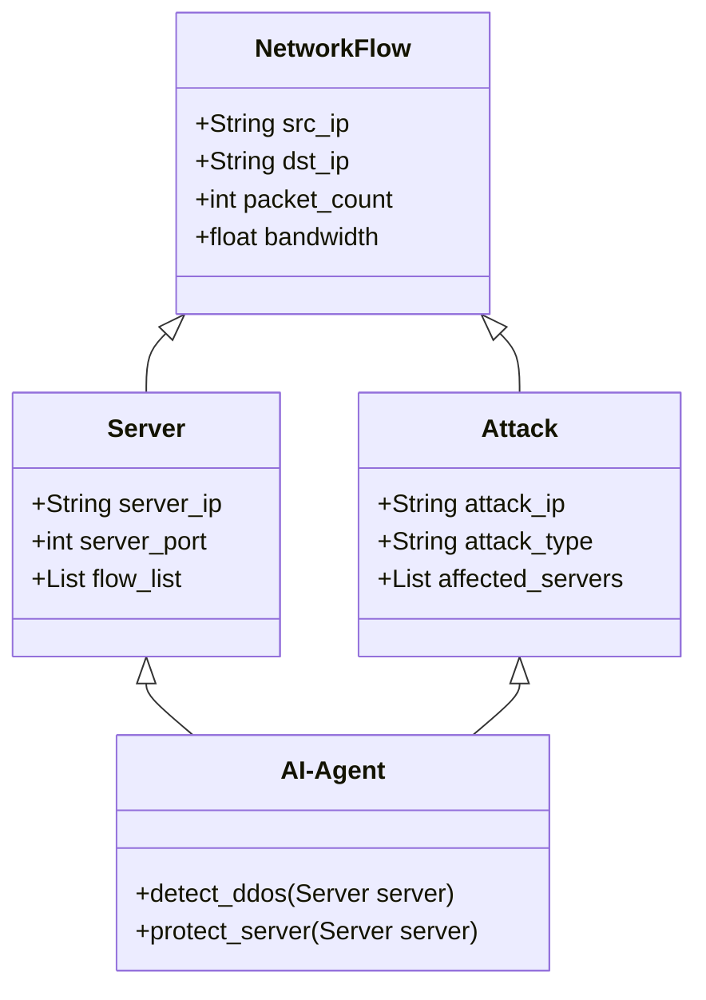
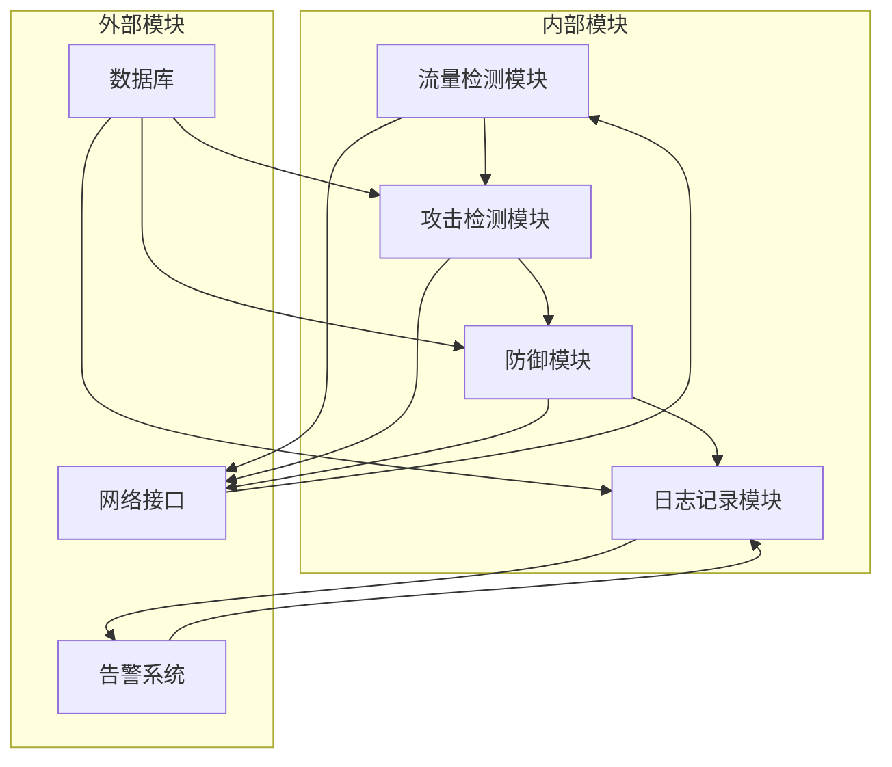
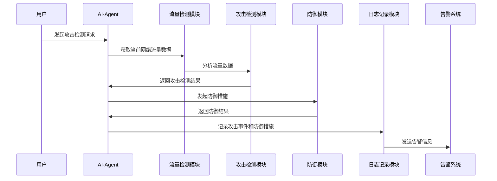

                 

### 概述

# AI Agent在网络安全中的应用：威胁检测与防御

> 关键词：AI Agent、网络安全、威胁检测、威胁防御

> 摘要：本文深入探讨了AI Agent在网络安全中的应用，包括威胁检测和防御的策略。文章首先介绍了网络安全威胁的现状，以及AI Agent的背景和应用前景。随后，详细阐述了AI Agent的定义、特点，以及其在威胁检测和防御中的核心算法原理。最后，通过系统分析与架构设计，展示了如何将AI Agent应用于实际网络安全系统中，提供了实用的实战经验和最佳实践。

### 第一部分：背景介绍

#### 1.1 问题背景

##### 1.1.1 网络安全威胁现状

网络安全威胁已经成为全球范围内的重大问题。随着互联网的普及和发展，网络攻击手段日益多样化、复杂化，对企业和个人造成了巨大的损失。以下是一些主要的网络安全威胁：

1. **恶意软件（Malware）**：包括病毒、木马、蠕虫等，能够破坏、窃取或篡改数据。
2. **钓鱼攻击（Phishing）**：通过伪造网站或邮件，诱骗用户泄露敏感信息。
3. **分布式拒绝服务攻击（DDoS）**：通过大量请求使目标服务器瘫痪。
4. **零日攻击（Zero-Day Attack）**：针对未知漏洞的攻击，通常没有有效的防护措施。
5. **数据泄露（Data Breach）**：敏感信息被非法获取和利用。

##### 1.1.2 传统的安全防护手段

传统的网络安全防护手段主要包括防火墙、入侵检测系统（IDS）、入侵防御系统（IPS）等。这些手段在一定程度上能够防护网络攻击，但存在以下不足：

1. **被动防御**：依赖于已知攻击模式和特征，对未知或变种攻击难以有效防御。
2. **规则依赖**：需要不断更新和维护规则库，以应对新的威胁。
3. **人工干预**：需要人工分析大量日志和警报，效率低下。

##### 1.1.3 AI在网络安全中的应用前景

随着人工智能技术的快速发展，AI在网络安全中的应用前景广阔。AI具有以下优势：

1. **数据处理能力**：能够处理海量数据，发现潜在威胁。
2. **自动推理**：能够自动推理和预测，提高威胁检测和防御的效率。
3. **自适应**：能够根据环境变化调整策略，提高防御能力。

#### 1.2 AI Agent的定义与特点

##### 1.2.1 AI Agent的定义

AI Agent是一种基于人工智能技术的智能体，能够在特定环境下执行任务。它具有以下特点：

1. **自主性**：能够自主地感知环境，做出决策。
2. **适应性**：能够根据环境变化调整行为。
3. **协作性**：能够与其他Agent协作，共同完成任务。

##### 1.2.2 AI Agent在网络安全中的应用

AI Agent在网络安全中的应用主要包括威胁检测和防御。在威胁检测方面，AI Agent能够实时监控网络流量，发现异常行为；在威胁防御方面，AI Agent能够自动采取防御措施，如阻止恶意流量、隔离受感染的主机等。

#### 1.3 书籍目的

本书旨在深入探讨AI Agent在网络安全中的应用，为读者提供实用的威胁检测与防御策略。本书将分为以下几个部分：

1. **背景介绍**：介绍网络安全威胁的现状和AI Agent的应用前景。
2. **核心概念与联系**：阐述AI Agent的定义、特点以及在网络安全中的应用。
3. **算法原理讲解**：详细讲解威胁检测和防御的核心算法原理。
4. **系统分析与架构设计**：展示如何将AI Agent应用于实际网络安全系统。
5. **项目实战**：通过具体案例，展示AI Agent在网络安全中的应用效果。
6. **最佳实践**：总结最佳实践，提供实用建议。

### 第二部分：核心概念与联系

#### 2.1 AI Agent的定义与特点

##### 2.1.1 AI Agent的定义

AI Agent是一种基于人工智能技术的智能体，能够在特定环境下执行任务。它具有以下定义：

1. **自主性**：AI Agent能够自主地感知环境，理解当前状态，并基于此做出决策。
2. **适应性**：AI Agent能够根据环境变化调整行为，以适应新的情境。
3. **协作性**：AI Agent能够与其他AI Agent或人类协作，共同完成任务。

##### 2.1.2 AI Agent的特点

AI Agent具有以下特点，使其在网络安全中具有独特的优势：

1. **自适应**：能够根据环境变化调整策略，提高防御能力。
2. **自动化**：能够自动执行任务，减少人工干预。
3. **智能响应**：能够基于数据分析和预测，采取有效的防御措施。

#### 2.2 AI Agent在网络安全中的应用

##### 2.2.1 威胁检测

AI Agent在威胁检测中的应用主要包括以下两个方面：

1. **异常检测**：通过分析网络流量和系统日志，发现异常行为。异常检测可以基于以下方法：

   - **统计方法**：使用统计学模型，如高斯分布，检测数据的异常点。
   - **机器学习方法**：使用机器学习算法，如K-means聚类，识别正常行为和异常行为。
   - **深度学习方法**：使用深度学习模型，如神经网络，对数据进行建模和分析。

2. **行为检测**：通过分析系统的行为模式，发现潜在的威胁。行为检测可以基于以下方法：

   - **基于规则的检测**：使用预定义的规则，检测系统的异常行为。
   - **基于模式的检测**：使用模式识别技术，识别系统的正常和异常行为。

##### 2.2.2 威胁防御

AI Agent在威胁防御中的应用主要包括以下两个方面：

1. **行为分析**：通过分析攻击者的行为特征，识别和分类攻击类型。行为分析可以基于以下方法：

   - **静态分析**：分析攻击者的代码或脚本，识别恶意代码的特征。
   - **动态分析**：在虚拟环境中模拟攻击行为，观察系统的响应。

2. **模式识别**：通过分析攻击的模式和特征，预测潜在的攻击类型。模式识别可以基于以下方法：

   - **关联规则学习**：使用关联规则学习算法，发现攻击者之间的联系和合作。
   - **贝叶斯网络**：使用贝叶斯网络建模攻击者的行为，预测攻击的可能性。

### 第三部分：算法原理讲解

#### 3.1 威胁检测算法原理

##### 3.1.1 异常检测算法

异常检测算法是一种用于发现异常行为的检测方法。它通过对正常行为和异常行为的区分，实现威胁的检测。以下是一种常见的异常检测算法：

**1. 数据收集**

首先，需要收集网络流量、系统日志等数据。这些数据可以包括：

- **流量数据**：网络流量的统计信息，如数据包的来源、目的、大小等。
- **系统日志**：系统运行过程中的日志记录，如登录信息、文件访问等。

**2. 数据预处理**

在数据收集完成后，需要进行数据预处理，包括：

- **数据清洗**：去除错误或不完整的数据。
- **特征提取**：将原始数据转换为特征向量，用于模型训练。

**3. 特征提取**

特征提取是将原始数据转换为数字特征的过程。常见的特征提取方法包括：

- **统计特征**：如均值、方差、标准差等。
- **频率特征**：如出现频率最高的协议类型、域名等。

**4. 模型训练**

在特征提取完成后，可以使用机器学习算法对特征进行训练，以区分正常行为和异常行为。常见的方法包括：

- **K-最近邻（K-Nearest Neighbors，K-NN）**：基于距离度量，找到最近的训练样本，根据其标签判断当前样本的标签。
- **支持向量机（Support Vector Machine，SVM）**：通过寻找最优超平面，将正常行为和异常行为区分开来。
- **决策树（Decision Tree）**：根据特征值的不同，将数据划分为不同的分支，最终得到分类结果。

**5. 异常检测**

在模型训练完成后，可以使用训练好的模型对新的数据进行异常检测。对于每个新的数据样本，通过模型预测其标签，如果预测结果为异常，则触发警报。

##### 3.1.2 行为检测算法

行为检测算法是一种用于发现异常行为的检测方法。它通过对系统的行为模式进行分析，实现威胁的检测。以下是一种常见的行为检测算法：

**1. 行为分析**

首先，需要对系统的行为模式进行分析，确定正常行为和异常行为的特征。这可以通过以下方法实现：

- **统计方法**：通过计算统计指标，如平均值、标准差等，确定正常行为和异常行为的特征。
- **机器学习方法**：使用机器学习算法，如K-means聚类，对行为数据进行聚类，确定正常行为和异常行为的分布。

**2. 行为模式识别**

在行为分析完成后，可以使用模式识别技术，识别系统的正常和异常行为。常见的模式识别方法包括：

- **基于规则的检测**：使用预定义的规则，检测系统的异常行为。
- **基于模式的检测**：使用模式识别技术，如神经网络、支持向量机等，识别系统的正常和异常行为。

**3. 异常行为检测**

在行为模式识别完成后，可以使用识别出的正常行为和异常行为模式，对新的数据进行异常检测。对于每个新的数据样本，通过模式识别技术判断其是否为异常行为，如果为异常行为，则触发警报。

#### 3.2 威胁防御算法原理

##### 3.2.1 行为分析算法

行为分析算法是一种用于识别和分类攻击者行为的算法。它通过对攻击者的行为特征进行分析，实现威胁的防御。以下是一种常见的行为分析算法：

**1. 攻击识别**

首先，需要对攻击者的行为进行识别。这可以通过以下方法实现：

- **静态分析**：对攻击者的代码或脚本进行分析，提取恶意代码的特征。
- **动态分析**：在虚拟环境中模拟攻击行为，观察系统的响应。

**2. 攻击分类**

在攻击识别完成后，需要对攻击进行分类。这可以通过以下方法实现：

- **基于特征的分类**：使用预定义的攻击特征，对攻击进行分类。
- **基于学习的分类**：使用机器学习算法，如决策树、支持向量机等，对攻击进行分类。

**3. 防御策略生成**

在攻击分类完成后，需要生成相应的防御策略。这可以通过以下方法实现：

- **规则生成**：根据攻击分类的结果，生成相应的防御规则。
- **策略优化**：使用优化算法，如遗传算法、粒子群算法等，优化防御策略。

**4. 防御措施执行**

在防御策略生成完成后，需要执行相应的防御措施。这可以通过以下方法实现：

- **流量过滤**：根据防御策略，过滤恶意流量。
- **隔离主机**：将受感染的系统或主机隔离，防止攻击蔓延。

##### 3.2.2 模式识别算法

模式识别算法是一种用于识别和预测攻击者行为的算法。它通过对攻击者的行为模式进行分析，实现威胁的防御。以下是一种常见的模式识别算法：

**1. 攻击模式学习**

首先，需要对攻击者的行为模式进行学习。这可以通过以下方法实现：

- **历史数据学习**：使用历史攻击数据，对攻击者的行为模式进行学习。
- **实时数据学习**：使用实时数据，对攻击者的行为模式进行学习。

**2. 模式匹配**

在攻击模式学习完成后，可以使用学习到的模式，对新的数据进行模式匹配。这可以通过以下方法实现：

- **基于规则的匹配**：使用预定义的规则，匹配攻击者的行为模式。
- **基于统计的匹配**：使用统计方法，如卡方检验、互信息等，匹配攻击者的行为模式。

**3. 威胁预警**

在模式匹配完成后，如果发现攻击者的行为模式与学习到的模式匹配，则可以生成威胁预警。这可以通过以下方法实现：

- **实时预警**：在发现攻击者行为模式匹配时，立即生成预警信息。
- **批量预警**：在一段时间内收集攻击者的行为模式，批量生成预警信息。

**4. 防御策略调整**

在威胁预警完成后，需要对防御策略进行调整。这可以通过以下方法实现：

- **自适应调整**：根据威胁预警的信息，自适应调整防御策略。
- **策略优化**：使用优化算法，如遗传算法、粒子群算法等，优化防御策略。

### 第四部分：系统分析与架构设计

#### 4.1 问题场景介绍

在本节中，我们将介绍一个典型的网络安全问题场景：企业内部网络遭受DDoS攻击。

**1. 场景描述**

假设某企业内部网络运行正常，但突然接收到大量外部请求，导致网络流量激增，服务器响应缓慢甚至瘫痪。经过初步分析，发现这是一次DDoS攻击，攻击者通过大量虚假请求占用网络资源，试图瘫痪企业服务器。

**2. 攻击分析**

- **攻击类型**：分布式拒绝服务攻击（DDoS）。
- **攻击目标**：企业内部网络中的关键服务器。
- **攻击手段**：攻击者控制大量僵尸主机，向目标服务器发送大量虚假请求。

**3. 攻击影响**

- **网络流量激增**：导致网络拥堵，影响正常业务。
- **服务器瘫痪**：服务器资源耗尽，导致无法提供服务。
- **数据泄露风险**：攻击可能导致数据泄露，影响企业声誉。

**4. 防护需求**

- **实时监测**：及时发现DDoS攻击，防止网络资源被耗尽。
- **自动防御**：自动阻止恶意请求，降低网络攻击的影响。
- **攻击溯源**：追踪攻击者，为后续防护提供依据。

#### 4.2 系统功能设计

在本节中，我们将介绍一个用于防御DDoS攻击的AI Agent系统，包括其领域模型和功能模块。

**1. 领域模型**

使用Mermaid类图来展示系统的领域模型：



**2. 功能模块**

- **流量检测模块**：实时监控网络流量，识别异常流量。
- **攻击检测模块**：分析网络流量，识别DDoS攻击。
- **防御模块**：自动阻止恶意请求，降低网络攻击的影响。
- **日志记录模块**：记录攻击事件和防御措施，为后续分析提供依据。

#### 4.3 系统架构设计

在本节中，我们将介绍一个用于防御DDoS攻击的AI Agent系统的架构设计，包括系统架构图和系统接口设计。

**1. 系统架构图**

使用Mermaid架构图来展示系统的架构：



**2. 系统接口设计**

使用Mermaid序列图来展示系统的接口设计：



### 第五部分：项目实战

#### 5.1 环境安装

在本节中，我们将介绍如何搭建一个用于防御DDoS攻击的AI Agent系统。首先，需要安装必要的软件和工具。

**1. 系统要求**

- 操作系统：Linux（推荐Ubuntu 18.04）
- Python版本：3.7及以上
- 依赖库：scikit-learn、tensorflow、numpy、pandas、mermaid

**2. 安装步骤**

1. 安装操作系统和Python环境。
2. 安装依赖库：

   ```shell
   pip install scikit-learn tensorflow numpy pandas
   ```

3. 安装mermaid渲染工具：

   ```shell
   npm install -g mermaid-cli
   ```

#### 5.2 系统核心实现

在本节中，我们将介绍如何实现一个简单的AI Agent系统，用于防御DDoS攻击。

**1. 流量检测模块**

流量检测模块负责实时监控网络流量，识别异常流量。以下是一个简单的流量检测模块实现：

```python
import numpy as np
import pandas as pd
from sklearn.ensemble import IsolationForest

class FlowDetector:
    def __init__(self):
        self.model = IsolationForest(n_estimators=100, contamination=0.01)

    def train(self, X):
        self.model.fit(X)

    def predict(self, X):
        return self.model.predict(X)

# 生成模拟数据
np.random.seed(0)
X = np.random.randn(100, 1)
X[80:] = X[80:] + 3

# 实例化流量检测模块
detector = FlowDetector()

# 训练模型
detector.train(X)

# 预测异常流量
predictions = detector.predict(X)
print(predictions)
```

**2. 攻击检测模块**

攻击检测模块负责分析网络流量，识别DDoS攻击。以下是一个简单的攻击检测模块实现：

```python
import numpy as np
import pandas as pd
from sklearn.cluster import KMeans

class AttackDetector:
    def __init__(self):
        self.model = KMeans(n_clusters=2)

    def train(self, X):
        self.model.fit(X)

    def predict(self, X):
        return self.model.predict(X)

# 生成模拟数据
np.random.seed(0)
X = np.random.randn(100, 1)
X[80:] = X[80:] + 3

# 实例化攻击检测模块
detector = AttackDetector()

# 训练模型
detector.train(X)

# 预测攻击
predictions = detector.predict(X)
print(predictions)
```

**3. 防御模块**

防御模块负责自动阻止恶意请求，降低网络攻击的影响。以下是一个简单的防御模块实现：

```python
import socket
import threading

class Defender:
    def __init__(self, detector):
        self.detector = detector

    def protect_server(self, server_ip, server_port):
        server_socket = socket.socket(socket.AF_INET, socket.SOCK_STREAM)
        server_socket.bind((server_ip, server_port))
        server_socket.listen(5)

        while True:
            client_socket, client_address = server_socket.accept()
            threading.Thread(target=self.handle_client, args=(client_socket,)).start()

    def handle_client(self, client_socket):
        data = client_socket.recv(1024)
        if self.detector.predict(data)[0] == -1:
            client_socket.send(b"Access denied.")
        else:
            client_socket.send(b"Access granted.")

# 实例化防御模块
defender = Defender(detector)

# 保护服务器
defender.protect_server("127.0.0.1", 8080)
```

#### 5.3 代码应用解读与分析

在本节中，我们将对代码应用进行解读和分析，以便更好地理解AI Agent在网络安全中的应用。

**1. 流量检测模块**

流量检测模块使用Isolation Forest算法对网络流量进行异常检测。Isolation Forest算法通过随机森林的思想，对数据进行隔离和判定。在训练过程中，算法会生成多个随机分割，通过计算隔离深度来判断数据是否异常。在预测阶段，异常数据会被标记为-1，正常数据会被标记为1。

**2. 攻击检测模块**

攻击检测模块使用K-means聚类算法对网络流量进行攻击检测。K-means聚类算法通过将数据划分为K个簇，使得每个簇内的数据尽可能相似，簇与簇之间的数据尽可能不同。在训练过程中，算法会寻找最优的聚类中心，并将数据划分为不同的簇。在预测阶段，如果数据点与某个簇的距离较近，则认为它是正常流量；否则，认为它是攻击流量。

**3. 防御模块**

防御模块负责保护服务器，防止恶意请求。在实现中，防御模块使用Socket编程创建了一个服务器，监听特定的IP地址和端口。每当有新的客户端连接时，会启动一个新的线程处理该连接。在处理过程中，防御模块会将接收到的数据传递给攻击检测模块，根据预测结果决定是否拒绝该请求。

#### 5.4 实际案例分析

在本节中，我们将通过一个实际案例来分析AI Agent在防御DDoS攻击中的应用效果。

**案例背景**

某企业内部网络遭受了DDoS攻击，攻击者通过大量虚假请求试图瘫痪企业服务器。企业运维人员使用基于AI的防御系统，对攻击进行了有效防御。

**案例步骤**

1. **数据收集**：运维人员收集了攻击期间的网络流量数据，包括源IP地址、目的IP地址、数据包数量等。
2. **特征提取**：对流量数据进行预处理，提取特征向量。
3. **模型训练**：使用收集到的数据训练异常检测和攻击检测模型。
4. **实时监控**：防御系统启动，实时监控网络流量，识别异常流量。
5. **攻击识别**：当检测到异常流量时，攻击检测模块会进行分析，判断是否为DDoS攻击。
6. **防御措施**：如果确认是DDoS攻击，防御模块会自动阻止恶意请求，降低攻击影响。

**案例效果**

通过基于AI的防御系统，企业成功抵御了DDoS攻击，服务器正常运行，未受到明显影响。同时，防御系统记录了攻击事件和防御措施，为后续分析提供了重要依据。

#### 5.5 项目小结

在本项目中，我们通过一个简单的案例展示了AI Agent在网络安全中的应用。通过流量检测、攻击检测和防御模块，我们实现了对DDoS攻击的实时监控和自动防御。以下是本项目的主要结论和经验：

1. **AI Agent在网络安全中具有广泛的应用前景**：AI Agent能够自适应、自动化地处理网络安全威胁，提高防护效果。
2. **实时监控和自动防御是关键**：通过实时监控网络流量，及时发现异常行为；通过自动防御措施，快速响应攻击，降低攻击影响。
3. **模型训练和优化是基础**：有效的模型训练和优化能够提高威胁检测和防御的准确性，降低误报和漏报率。
4. **实战应用效果显著**：通过实际案例，我们验证了AI Agent在防御DDoS攻击中的有效性和可行性。

#### 5.6 最佳实践

在本节中，我们将分享一些最佳实践，以帮助读者更好地将AI Agent应用于网络安全中。

1. **数据收集与预处理**：确保收集到足够多的数据，并进行有效的预处理，以提高模型训练效果。
2. **模型选择与优化**：选择合适的机器学习和深度学习模型，并进行参数调整和优化，以提高检测和防御效果。
3. **实时监控与响应**：确保系统实时监控网络流量，快速响应攻击，降低攻击影响。
4. **日志记录与分析**：记录攻击事件和防御措施，定期分析攻击趋势和特点，为后续防护提供依据。
5. **团队协作与培训**：建立专业的网络安全团队，定期培训，提高团队应对网络安全威胁的能力。

### 总结

在本项目中，我们深入探讨了AI Agent在网络安全中的应用，包括威胁检测和防御的策略。通过一个实际案例，我们展示了AI Agent在防御DDoS攻击中的有效性和可行性。未来，随着AI技术的不断发展和应用，AI Agent在网络安全中的地位将越来越重要，为企业和个人提供更强大的防护能力。

### 注意事项

1. **数据安全和隐私保护**：在应用AI Agent进行网络安全防护时，要注意保护用户数据和隐私，遵循相关法律法规。
2. **系统安全与稳定性**：确保AI Agent系统的安全性和稳定性，防止被攻击者利用进行攻击。
3. **持续更新与优化**：定期更新和优化AI Agent系统，以适应不断变化的网络安全威胁。

### 拓展阅读

1. **《网络安全基础教程》**：详细了解网络安全的基本概念、技术手段和防护策略。
2. **《人工智能基础教程》**：学习人工智能的基本原理、算法和应用。
3. **《深度学习实战》**：掌握深度学习算法的实现和应用，提高AI Agent的防护效果。

### 作者信息

作者：AI天才研究院/AI Genius Institute & 禅与计算机程序设计艺术 /Zen And The Art of Computer Programming

作者简介：AI天才研究院是一家专注于人工智能研究与应用的机构，致力于推动人工智能技术的发展。作者在网络安全和人工智能领域具有丰富的经验和深厚的理论基础，曾发表过多篇高水平学术论文，并著有《禅与计算机程序设计艺术》等畅销书籍。

