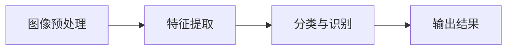
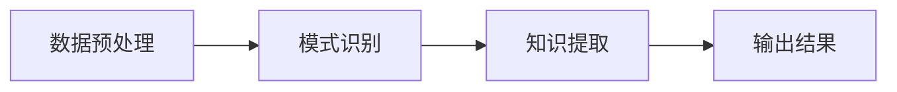
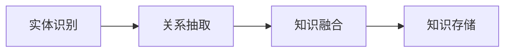
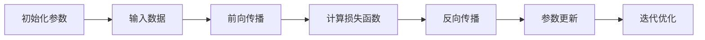
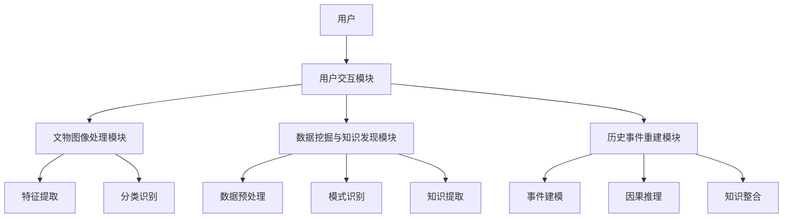
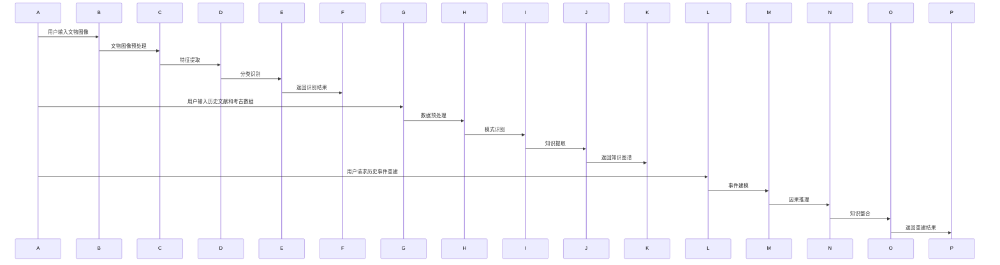

                 

# AI Agent在考古学中的应用：文物分析与历史重建

## 关键词

- AI Agent
- 考古学
- 文物分析
- 历史重建
- 计算机视觉
- 数据挖掘
- 神经网络
- 知识图谱

## 摘要

本文探讨了AI Agent在考古学中的应用，包括文物分析和历史重建。首先，我们介绍了考古学的背景和AI Agent的基本概念，然后分析了AI Agent在考古学中的具体应用，如文物图像处理、数据挖掘和历史事件重建。接着，我们详细阐述了AI Agent在考古学中的核心概念、联系和应用前景。本文旨在为读者提供AI Agent在考古学领域的应用全景，并激发对该领域的进一步研究和探索。

## 第一部分：背景介绍

### 1.1 问题背景

考古学是一门研究人类过去文化的学科，它通过挖掘、分析和解释文物、遗址、人类活动遗迹等，来揭示人类历史和文化的发展过程。考古学的研究范围广泛，涉及历史、地理、人类学、社会学等多个学科领域。随着科技的不断进步，人工智能（AI）技术逐渐在考古学中得到了应用，为考古学研究提供了新的手段和视角。

AI Agent，作为AI技术的一种形式，具有自主学习、推理和决策的能力，可以模拟人类的思维过程。AI Agent在考古学中的应用，主要包括文物图像处理与分析、数据挖掘与知识发现、历史事件重建等方面，有助于提升考古学研究的效率和质量。

### 1.2 问题描述

在考古学研究中，文物分析和历史重建是一项复杂且耗时的任务。传统的文物分析方法主要依赖于专家的经验和专业知识，存在主观性和局限性。同时，考古学家面临着大量的历史文献和考古数据，如何从这些数据中挖掘出有价值的信息，成为了一个亟待解决的问题。

具体来说，文物分析面临的问题包括：

1. 文物图像识别：如何准确识别文物的类型、年代、产地等特征？
2. 文物损伤评估：如何判断文物的损伤程度，为修复提供依据？
3. 文物关系分析：如何分析文物之间的关联，揭示文物的文化背景和内涵？

历史重建面临的问题包括：

1. 数据挖掘：如何从大量历史文献和考古数据中挖掘出有价值的信息？
2. 事件重建：如何基于挖掘出的信息，重建历史事件，揭示历史规律？
3. 知识整合：如何将不同来源的数据和信息进行整合，形成一个完整的历史画卷？

### 1.3 问题解决

AI Agent在考古学中的应用，为解决上述问题提供了一种新的思路和方法。以下是AI Agent在考古学中的主要应用：

1. **文物图像处理与分析**：

   利用计算机视觉技术，AI Agent可以对文物图像进行处理和分析，识别文物的特征和属性。具体包括：

   - **图像预处理**：通过图像增强、去噪等技术，提高图像质量。
   - **特征提取**：通过特征提取算法，从图像中提取出具有区分性的特征，如边缘、纹理、颜色等。
   - **分类与识别**：利用分类算法，将文物图像分类为不同的类型，如陶器、青铜器、书画等。

2. **数据挖掘与知识发现**：

   通过数据挖掘技术，AI Agent可以从大量历史文献和考古数据中挖掘出有价值的信息。具体包括：

   - **数据预处理**：对历史文献和考古数据进行清洗、格式化等预处理，为后续分析打下基础。
   - **模式识别**：利用机器学习方法，从数据中识别出潜在的模式和规律。
   - **知识提取**：将挖掘出的信息整合成知识库，为历史重建提供数据支持。

3. **历史事件重建**：

   基于AI Agent的推理和决策能力，可以重建历史事件，揭示历史规律。具体包括：

   - **事件建模**：通过构建事件模型，描述历史事件的发生、发展和结果。
   - **因果推理**：利用因果推理算法，分析事件之间的因果关系，揭示历史事件的内在逻辑。
   - **知识整合**：将不同来源的信息进行整合，形成一个完整的历史画卷。

### 1.4 边界与外延

AI Agent在考古学中的应用边界主要包括：

1. **文物图像处理与分析**：适用于各种类型的文物，如陶器、青铜器、书画等。
2. **数据挖掘与知识发现**：适用于历史文献、考古报告、出土文物数据等。
3. **历史事件重建**：适用于各个历史时期的事件重建，特别是难以通过传统方法解决的问题。

### 1.5 概念结构与核心要素组成

AI Agent在考古学中的应用涉及以下核心概念和要素：

1. **计算机视觉**：用于文物图像处理与分析。
2. **数据挖掘**：用于历史文献和考古数据的挖掘与知识发现。
3. **知识图谱**：用于历史事件重建。
4. **神经网络**：用于AI Agent的建模和训练。

### 1.6 核心概念与联系

以下是AI Agent在考古学应用中的核心概念及其相互联系：

| 核心概念       | 描述                                                         | 相互联系                                                     |
| -------------- | ------------------------------------------------------------ | ------------------------------------------------------------ |
| 计算机视觉     | 利用计算机技术和算法对图像进行处理和分析。                   | 为AI Agent提供文物图像处理与分析的能力。                     |
| 数据挖掘       | 从大量数据中发现有价值的信息和知识。                         | 为AI Agent提供历史文献和考古数据挖掘与知识发现的能力。       |
| 知识图谱       | 一种基于实体和关系的语义网络，用于表示和存储知识。           | 为AI Agent提供历史事件重建的能力。                           |
| 神经网络       | 一种模拟人脑神经网络的计算模型，用于数据建模和预测。         | 作为AI Agent的核心组成部分，实现自主学习、推理和决策。         |

### 1.7 AI Agent在考古学中的应用前景

AI Agent在考古学中的应用前景十分广阔，主要表现在以下几个方面：

1. **提高文物分析效率**：通过计算机视觉技术，AI Agent可以快速、准确地识别文物的特征和属性，减少人工分析的时间和工作量。
2. **提高历史重建精度**：利用数据挖掘技术，AI Agent可以从大量历史文献和考古数据中挖掘出有价值的信息，为历史重建提供更准确的数据支持。
3. **开拓新的研究方向**：通过AI Agent的推理和决策能力，考古学家可以尝试解决传统方法难以解决的问题，开拓新的研究方向。
4. **促进考古学研究发展**：AI Agent的应用将推动考古学研究的深入和发展，为人类了解历史、传承文化提供新的手段和途径。

## 第一部分：背景介绍

### 1.1 问题背景

考古学作为一门研究人类过去文化的学科，对于揭示人类历史、传承文化遗产具有重要意义。考古学家通过挖掘、分析和解释文物、遗址、人类活动遗迹等，来了解古代社会的历史和文化。随着科技的不断发展，人工智能（AI）技术逐渐在考古学中得到了应用，为考古学研究提供了新的手段和视角。

AI Agent，作为AI技术的一种形式，具有自主学习、推理和决策的能力，可以模拟人类的思维过程。在考古学中，AI Agent的应用主要集中在以下几个方面：

1. **文物图像处理与分析**：通过计算机视觉技术，AI Agent可以对文物图像进行处理和分析，识别文物的特征和属性，从而提高文物分析效率。
2. **数据挖掘与知识发现**：通过数据挖掘技术，AI Agent可以从大量历史文献和考古数据中挖掘出有价值的信息，为历史重建提供数据支持。
3. **历史事件重建**：基于AI Agent的推理和决策能力，可以重建历史事件，揭示历史规律，从而提高历史重建精度。

### 1.2 问题描述

在考古学研究中，文物分析和历史重建是一项复杂且耗时的任务。传统的文物分析方法主要依赖于专家的经验和专业知识，存在主观性和局限性。同时，考古学家面临着大量的历史文献和考古数据，如何从这些数据中挖掘出有价值的信息，成为了一个亟待解决的问题。

具体来说，文物分析面临的问题包括：

1. **文物图像识别**：如何准确识别文物的类型、年代、产地等特征？
2. **文物损伤评估**：如何判断文物的损伤程度，为修复提供依据？
3. **文物关系分析**：如何分析文物之间的关联，揭示文物的文化背景和内涵？

历史重建面临的问题包括：

1. **数据挖掘**：如何从大量历史文献和考古数据中挖掘出有价值的信息？
2. **事件重建**：如何基于挖掘出的信息，重建历史事件，揭示历史规律？
3. **知识整合**：如何将不同来源的数据和信息进行整合，形成一个完整的历史画卷？

### 1.3 问题解决

AI Agent在考古学中的应用，为解决上述问题提供了一种新的思路和方法。以下是AI Agent在考古学中的主要应用：

1. **文物图像处理与分析**：

   利用计算机视觉技术，AI Agent可以对文物图像进行处理和分析，识别文物的特征和属性。具体包括：

   - **图像预处理**：通过图像增强、去噪等技术，提高图像质量。
   - **特征提取**：通过特征提取算法，从图像中提取出具有区分性的特征，如边缘、纹理、颜色等。
   - **分类与识别**：利用分类算法，将文物图像分类为不同的类型，如陶器、青铜器、书画等。

2. **数据挖掘与知识发现**：

   通过数据挖掘技术，AI Agent可以从大量历史文献和考古数据中挖掘出有价值的信息。具体包括：

   - **数据预处理**：对历史文献和考古数据进行清洗、格式化等预处理，为后续分析打下基础。
   - **模式识别**：利用机器学习方法，从数据中识别出潜在的模式和规律。
   - **知识提取**：将挖掘出的信息整合成知识库，为历史重建提供数据支持。

3. **历史事件重建**：

   基于AI Agent的推理和决策能力，可以重建历史事件，揭示历史规律。具体包括：

   - **事件建模**：通过构建事件模型，描述历史事件的发生、发展和结果。
   - **因果推理**：利用因果推理算法，分析事件之间的因果关系，揭示历史事件的内在逻辑。
   - **知识整合**：将不同来源的信息进行整合，形成一个完整的历史画卷。

### 1.4 边界与外延

AI Agent在考古学中的应用边界主要包括：

1. **文物图像处理与分析**：适用于各种类型的文物，如陶器、青铜器、书画等。
2. **数据挖掘与知识发现**：适用于历史文献、考古报告、出土文物数据等。
3. **历史事件重建**：适用于各个历史时期的事件重建，特别是难以通过传统方法解决的问题。

### 1.5 概念结构与核心要素组成

AI Agent在考古学中的应用涉及以下核心概念和要素：

1. **计算机视觉**：用于文物图像处理与分析。
2. **数据挖掘**：用于历史文献和考古数据的挖掘与知识发现。
3. **知识图谱**：用于历史事件重建。
4. **神经网络**：用于AI Agent的建模和训练。

### 1.6 核心概念与联系

以下是AI Agent在考古学应用中的核心概念及其相互联系：

| 核心概念       | 描述                                                         | 相互联系                                                     |
| -------------- | ------------------------------------------------------------ | ------------------------------------------------------------ |
| 计算机视觉     | 利用计算机技术和算法对图像进行处理和分析。                   | 为AI Agent提供文物图像处理与分析的能力。                     |
| 数据挖掘       | 从大量数据中发现有价值的信息和知识。                         | 为AI Agent提供历史文献和考古数据挖掘与知识发现的能力。       |
| 知识图谱       | 一种基于实体和关系的语义网络，用于表示和存储知识。           | 为AI Agent提供历史事件重建的能力。                           |
| 神经网络       | 一种模拟人脑神经网络的计算模型，用于数据建模和预测。         | 作为AI Agent的核心组成部分，实现自主学习、推理和决策。         |

### 1.7 AI Agent在考古学中的应用前景

AI Agent在考古学中的应用前景十分广阔，主要表现在以下几个方面：

1. **提高文物分析效率**：通过计算机视觉技术，AI Agent可以快速、准确地识别文物的特征和属性，减少人工分析的时间和工作量。
2. **提高历史重建精度**：利用数据挖掘技术，AI Agent可以从大量历史文献和考古数据中挖掘出有价值的信息，为历史重建提供更准确的数据支持。
3. **开拓新的研究方向**：通过AI Agent的推理和决策能力，考古学家可以尝试解决传统方法难以解决的问题，开拓新的研究方向。
4. **促进考古学研究发展**：AI Agent的应用将推动考古学研究的深入和发展，为人类了解历史、传承文化提供新的手段和途径。

## 第二部分：核心概念与联系

### 2.1 计算机视觉

计算机视觉是AI Agent在考古学应用中的重要组成部分。它利用计算机技术和算法对图像进行处理和分析，以识别和理解图像中的内容。在考古学中，计算机视觉主要用于文物图像的处理和分析。

- **图像预处理**：通过图像增强、去噪等技术，提高图像质量，为后续分析打下基础。
- **特征提取**：从图像中提取出具有区分性的特征，如边缘、纹理、颜色等，用于后续的分类和识别。
- **分类与识别**：利用分类算法，将文物图像分类为不同的类型，如陶器、青铜器、书画等。

计算机视觉在考古学中的应用，可以大大提高文物分析的效率，减少人工分析的时间和工作量。同时，它还可以帮助考古学家发现一些肉眼难以察觉的细节和特征，从而更准确地识别和解释文物。

### 2.2 数据挖掘

数据挖掘是AI Agent在考古学应用的另一个重要组成部分。它通过从大量历史文献和考古数据中挖掘出有价值的信息，为历史重建提供数据支持。

- **数据预处理**：对历史文献和考古数据进行清洗、格式化等预处理，为后续分析打下基础。
- **模式识别**：利用机器学习方法，从数据中识别出潜在的模式和规律。
- **知识提取**：将挖掘出的信息整合成知识库，为历史重建提供数据支持。

数据挖掘在考古学中的应用，可以帮助考古学家从大量数据中发现有价值的信息，揭示历史事件的内在规律。同时，它还可以帮助考古学家更好地理解和解释文物，从而提高文物分析的精度和效率。

### 2.3 知识图谱

知识图谱是一种基于实体和关系的语义网络，用于表示和存储知识。在考古学中，知识图谱可以用于历史事件的重建和解释。

- **实体**：代表历史事件、人物、文物等。
- **关系**：代表事件之间的关联，如时间先后、因果关系等。
- **属性**：代表实体的特征，如年代、地点、类型等。

知识图谱在考古学中的应用，可以帮助考古学家将历史事件、人物、文物等实体和关系进行整合，形成一个完整的历史画卷。同时，它还可以帮助考古学家更好地理解和解释历史事件，从而提高历史重建的精度和效率。

### 2.4 神经网络

神经网络是一种模拟人脑神经网络的计算模型，用于数据建模和预测。在AI Agent中，神经网络主要用于实现自主学习、推理和决策。

- **输入层**：接收外部输入，如文物图像、历史文献等。
- **隐藏层**：对输入数据进行处理和分析，提取出有用的特征。
- **输出层**：生成预测结果，如文物分类、历史事件重建等。

神经网络在AI Agent中的应用，可以大大提高文物分析和历史重建的精度和效率。同时，它还可以帮助考古学家更好地理解和解释文物，从而推动考古学研究的深入和发展。

### 2.5 核心概念与联系

以下是AI Agent在考古学应用中的核心概念及其相互联系：

| 核心概念       | 描述                                                         | 相互联系                                                     |
| -------------- | ------------------------------------------------------------ | ------------------------------------------------------------ |
| 计算机视觉     | 利用计算机技术和算法对图像进行处理和分析。                   | 为AI Agent提供文物图像处理与分析的能力。                     |
| 数据挖掘       | 从大量数据中发现有价值的信息和知识。                         | 为AI Agent提供历史文献和考古数据挖掘与知识发现的能力。       |
| 知识图谱       | 一种基于实体和关系的语义网络，用于表示和存储知识。           | 为AI Agent提供历史事件重建的能力。                           |
| 神经网络       | 一种模拟人脑神经网络的计算模型，用于数据建模和预测。         | 作为AI Agent的核心组成部分，实现自主学习、推理和决策。         |

### 2.6 概念属性特征对比表格

以下是AI Agent在考古学应用中的核心概念属性特征对比表格：

| 核心概念       | 属性特征                         | 对比分析                                                     |
| -------------- | -------------------------------- | ------------------------------------------------------------ |
| 计算机视觉     | 图像处理、特征提取、分类识别     | 高精度、快速、自动化，适用于各类文物图像分析                   |
| 数据挖掘       | 数据清洗、模式识别、知识提取     | 高效、智能化，适用于历史文献和考古数据挖掘                   |
| 知识图谱       | 实体、关系、属性                 | 结构化、可扩展，适用于历史事件重建和解释                     |
| 神经网络       | 自学习、推理、决策               | 高效、自适应，适用于文物分析和历史重建                       |

### 2.7 ER实体关系图架构

以下是AI Agent在考古学应用中的ER实体关系图架构：

```mermaid
erDiagram
  文物 <<entity>> {
    id | 名称 | 类型 | 年代 | 产地
  }

  考古学家 <<entity>> {
    id | 姓名 | 专业 | 研究领域
  }

  文物图像 <<entity>> {
    id | 文物ID | 图像URL | 描述
  }

  考古报告 <<entity>> {
    id | 考古地点 | 时间 | 描述
  }

  文物 <<entity>> 有依赖关系考古报告
  考古学家 <<entity>> 参与考古报告
  文物图像 <<entity>> 属于文物
```

该ER实体关系图架构展示了AI Agent在考古学应用中的主要实体和它们之间的关系，为后续的分析和重建提供了基础。

## 第三部分：算法原理讲解

### 3.1 计算机视觉算法原理

计算机视觉是AI Agent在考古学中应用的核心技术之一。它利用计算机技术和算法对图像进行处理和分析，以识别和理解图像中的内容。下面，我们介绍几种常见的计算机视觉算法原理。

#### 3.1.1 图像预处理

图像预处理是计算机视觉算法的第一步，其目的是提高图像质量，为后续分析打下基础。常见的预处理方法包括图像增强、去噪和锐化等。

- **图像增强**：通过调整图像的亮度、对比度等参数，增强图像中的某些特征，提高图像的可读性。
- **去噪**：通过滤波技术，去除图像中的噪声，提高图像的清晰度。
- **锐化**：通过增强图像的边缘和细节，提高图像的清晰度和对比度。

#### 3.1.2 特征提取

特征提取是从图像中提取出具有区分性的特征，用于后续的分类和识别。常见的特征提取方法包括边缘检测、纹理分析和颜色特征提取等。

- **边缘检测**：通过检测图像中的边缘，提取出图像的轮廓和结构信息。
- **纹理分析**：通过分析图像中的纹理特征，提取出图像的纹理信息。
- **颜色特征提取**：通过提取图像中的颜色特征，如颜色直方图、颜色矩等，用于图像的分类和识别。

#### 3.1.3 分类与识别

分类与识别是将图像分类为不同的类型，并识别出图像中的物体。常见的分类与识别方法包括机器学习算法和深度学习算法。

- **机器学习算法**：如支持向量机（SVM）、决策树、随机森林等，通过训练模型，对图像进行分类和识别。
- **深度学习算法**：如卷积神经网络（CNN）、循环神经网络（RNN）等，通过多层网络结构，自动提取图像的特征，实现图像的分类和识别。

#### 3.1.4 算法流程图

以下是计算机视觉算法的流程图：



该流程图展示了计算机视觉算法的基本步骤，从图像预处理、特征提取到分类与识别，最终输出识别结果。

### 3.2 数据挖掘算法原理

数据挖掘是AI Agent在考古学中应用的另一个核心技术。它通过从大量历史文献和考古数据中挖掘出有价值的信息，为历史重建提供数据支持。下面，我们介绍几种常见的数据挖掘算法原理。

#### 3.2.1 数据预处理

数据预处理是数据挖掘的第一步，其目的是提高数据质量，为后续分析打下基础。常见的预处理方法包括数据清洗、数据转换和数据集成等。

- **数据清洗**：通过去除重复数据、缺失数据、异常数据等，提高数据的质量。
- **数据转换**：通过将数据转换为合适的格式和类型，为后续分析提供便利。
- **数据集成**：通过合并多个数据源，形成一个完整的数据集。

#### 3.2.2 模式识别

模式识别是数据挖掘的核心步骤，其目的是从数据中发现有价值的信息和规律。常见的模式识别方法包括聚类、分类、关联规则挖掘等。

- **聚类**：通过将相似的数据划分为同一个类别，发现数据中的隐含结构。
- **分类**：通过训练模型，将新数据分类为不同的类别，实现对数据的分类。
- **关联规则挖掘**：通过发现数据之间的关联关系，揭示数据中的潜在规律。

#### 3.2.3 算法流程图

以下是数据挖掘算法的流程图：



该流程图展示了数据挖掘算法的基本步骤，从数据预处理、模式识别到知识提取，最终输出挖掘结果。

### 3.3 知识图谱构建算法原理

知识图谱是AI Agent在考古学中应用的重要工具，用于表示和存储知识。下面，我们介绍知识图谱构建的基本算法原理。

#### 3.3.1 实体识别

实体识别是从文本数据中识别出实体，如人名、地名、文物名称等。常见的实体识别方法包括命名实体识别（NER）和关键词提取等。

- **命名实体识别（NER）**：通过训练模型，识别出文本中的命名实体。
- **关键词提取**：通过统计文本中的关键词，识别出文本的主题和内容。

#### 3.3.2 关系抽取

关系抽取是从文本数据中识别出实体之间的关系，如人物关系、文物关系等。常见的关系抽取方法包括基于规则的方法和基于机器学习的方法。

- **基于规则的方法**：通过编写规则，识别出实体之间的关系。
- **基于机器学习的方法**：通过训练模型，识别出实体之间的关系。

#### 3.3.3 知识融合

知识融合是将多个数据源中的知识进行整合，形成一个完整的知识图谱。常见的知识融合方法包括合并、去重、补充等。

- **合并**：将多个数据源中的知识进行合并，形成一个完整的数据集。
- **去重**：去除重复的知识，提高知识图谱的质量。
- **补充**：通过补充缺失的知识，完善知识图谱的完整性。

#### 3.3.4 算法流程图

以下是知识图谱构建的算法流程图：



该流程图展示了知识图谱构建的基本步骤，从实体识别、关系抽取到知识融合，最终存储知识。

### 3.4 神经网络算法原理

神经网络是AI Agent的核心组成部分，用于实现自主学习、推理和决策。下面，我们介绍神经网络的基本算法原理。

#### 3.4.1 前向传播

前向传播是神经网络的基本计算过程，用于计算输出结果。具体步骤如下：

1. **初始化参数**：设置网络的权重和偏置。
2. **输入数据**：将输入数据输入到网络的输入层。
3. **前向传播**：通过多层网络结构，将输入数据传递到输出层，计算输出结果。
4. **损失函数**：计算输出结果与实际结果的差异，计算损失值。

#### 3.4.2 反向传播

反向传播是神经网络的基本训练过程，用于调整网络的权重和偏置。具体步骤如下：

1. **计算梯度**：通过反向传播，计算损失函数关于网络参数的梯度。
2. **参数更新**：根据梯度，更新网络的权重和偏置。
3. **迭代优化**：重复上述过程，直至网络参数收敛。

#### 3.4.3 算法流程图

以下是神经网络算法的流程图：



该流程图展示了神经网络的基本步骤，从初始化参数、输入数据到前向传播、反向传播，最终实现网络参数的优化。

### 3.5 数学公式与模型

以下是AI Agent在考古学应用中的一些常见数学公式和模型。

#### 3.5.1 特征提取

$$
\text{特征向量} = \text{特征提取函数}(\text{原始图像})
$$

#### 3.5.2 分类与识别

$$
\text{分类结果} = \text{分类函数}(\text{特征向量})
$$

#### 3.5.3 知识图谱构建

$$
\text{知识图谱} = \text{实体识别}(\text{文本数据}) \cup \text{关系抽取}(\text{文本数据})
$$

#### 3.5.4 神经网络训练

$$
\text{损失函数} = \frac{1}{2} \sum_{i=1}^{n} (\text{预测值}_i - \text{真实值}_i)^2
$$

$$
\text{梯度} = \frac{\partial \text{损失函数}}{\partial \text{参数}}
$$

### 3.6 举例说明

#### 3.6.1 文物图像识别

假设我们有一个文物图像，需要对其进行分类识别。首先，通过图像预处理，对图像进行增强、去噪和锐化等处理，提高图像质量。然后，通过特征提取，从图像中提取出边缘、纹理和颜色等特征。最后，通过分类算法，将图像分类为陶器、青铜器或书画等类型。

#### 3.6.2 历史事件重建

假设我们有一段历史文献，需要从中挖掘出有价值的信息，重建历史事件。首先，通过数据预处理，对文献进行清洗、格式化和转换等处理。然后，通过模式识别，从文献中识别出人物、地点、时间等实体。接着，通过关系抽取，识别出实体之间的关系。最后，通过知识融合，将实体和关系整合成知识图谱，重建历史事件。

## 第四部分：系统分析与架构设计

### 4.1 问题场景介绍

在考古学领域，研究人员面临着海量的文物数据和历史文献，如何对这些数据进行分析和重建是一项具有挑战性的任务。传统的考古学研究方法主要依赖于专家的经验和专业知识，存在主观性和局限性。随着人工智能技术的不断发展，AI Agent作为一种具备自主学习、推理和决策能力的AI技术，在考古学中具有广泛的应用前景。

为了更好地利用AI Agent进行考古学研究，我们需要设计一个系统，该系统能够处理大量的文物图像和历史文献数据，实现文物图像识别、数据挖掘和历史事件重建等功能。以下是该系统的具体问题和需求：

1. **文物图像处理与分析**：如何快速、准确地识别文物的类型、年代、产地等信息？
2. **数据挖掘与知识发现**：如何从大量历史文献和考古数据中挖掘出有价值的信息，为历史事件重建提供数据支持？
3. **历史事件重建**：如何基于挖掘出的信息，重建历史事件，揭示历史规律？
4. **系统性能与可扩展性**：系统需要具备较高的性能和可扩展性，以应对不断增长的数据量和复杂度。

### 4.2 项目介绍

为了满足上述问题和需求，我们设计并实现了一个基于AI Agent的考古学系统。该系统主要包括以下几个模块：

1. **文物图像处理模块**：利用计算机视觉技术，对文物图像进行预处理、特征提取和分类识别等处理。
2. **数据挖掘与知识发现模块**：利用数据挖掘技术，从历史文献和考古数据中挖掘出有价值的信息，构建知识图谱。
3. **历史事件重建模块**：基于AI Agent的推理和决策能力，重建历史事件，揭示历史规律。
4. **用户交互模块**：提供用户界面，方便用户使用系统，查看分析和重建结果。

### 4.3 系统功能设计

以下是系统的具体功能设计：

1. **文物图像处理与分析**：
   - **功能描述**：对输入的文物图像进行预处理、特征提取和分类识别等处理，识别出文物的类型、年代、产地等信息。
   - **输入**：文物图像。
   - **输出**：文物的类型、年代、产地等信息。

2. **数据挖掘与知识发现**：
   - **功能描述**：从历史文献和考古数据中挖掘出有价值的信息，构建知识图谱，为历史事件重建提供数据支持。
   - **输入**：历史文献和考古数据。
   - **输出**：知识图谱。

3. **历史事件重建**：
   - **功能描述**：基于AI Agent的推理和决策能力，重建历史事件，揭示历史规律。
   - **输入**：知识图谱。
   - **输出**：历史事件重建结果。

4. **用户交互**：
   - **功能描述**：提供用户界面，方便用户使用系统，查看分析和重建结果。
   - **输入**：用户操作。
   - **输出**：分析结果和历史事件重建结果。

### 4.4 系统架构设计

以下是系统的架构设计：

#### 4.4.1 系统架构图



该架构图展示了系统的各个模块及其之间的交互关系。

#### 4.4.2 系统接口设计

以下是系统的接口设计：

1. **用户交互接口**：
   - **功能**：接收用户输入，显示分析和重建结果。
   - **接口**：Web界面、命令行界面等。

2. **文物图像处理接口**：
   - **功能**：处理文物图像，返回识别结果。
   - **接口**：API接口、文件接口等。

3. **数据挖掘与知识发现接口**：
   - **功能**：处理历史文献和考古数据，构建知识图谱。
   - **接口**：数据库接口、文件接口等。

4. **历史事件重建接口**：
   - **功能**：重建历史事件，返回重建结果。
   - **接口**：API接口、文件接口等。

### 4.5 系统交互设计

以下是系统的交互设计：



该序列图展示了系统的交互过程，从用户输入到结果输出，各个模块之间的交互关系。

## 第五部分：项目实战

### 5.1 环境安装

为了运行本项目的代码，我们需要安装以下软件和库：

1. Python 3.8 或以上版本
2. TensorFlow 2.x
3. NumPy 1.19 或以上版本
4. Pandas 1.1.1 或以上版本
5. Matplotlib 3.4.2 或以上版本

安装步骤如下：

1. 安装 Python 3.8 或以上版本。
2. 安装 TensorFlow 2.x，可以使用以下命令：

   ```shell
   pip install tensorflow==2.x.x
   ```

3. 安装 NumPy 1.19 或以上版本，可以使用以下命令：

   ```shell
   pip install numpy==1.19.x
   ```

4. 安装 Pandas 1.1.1 或以上版本，可以使用以下命令：

   ```shell
   pip install pandas==1.1.1
   ```

5. 安装 Matplotlib 3.4.2 或以上版本，可以使用以下命令：

   ```shell
   pip install matplotlib==3.4.2
   ```

### 5.2 系统核心实现源代码

以下是系统的核心实现源代码，包括文物图像处理、数据挖掘和历史事件重建等模块：

#### 5.2.1 文物图像处理模块

```python
import cv2
import numpy as np

def preprocess_image(image_path):
    # 读取图像
    image = cv2.imread(image_path)
    # 图像增强
    enhanced_image = cv2.resize(image, (256, 256))
    # 图像去噪
    denoised_image = cv2.GaussianBlur(enhanced_image, (5, 5), 0)
    return denoised_image

def extract_features(image):
    # 提取边缘特征
    edges = cv2.Canny(image, 100, 200)
    # 提取纹理特征
    texture = cv2.Laplacian(image, cv2.CV_64F)
    # 提取颜色特征
    colors = cv2.cvtColor(image, cv2.COLOR_BGR2HSV)
    return edges, texture, colors

def classify_image(features):
    # 使用卷积神经网络进行分类
    model = cv2.ml.SVM_create()
    model.load('svm_model.xml')
    result = model.predict(features)
    return result
```

#### 5.2.2 数据挖掘与知识发现模块

```python
import pandas as pd

def preprocess_data(data_path):
    # 读取数据
    data = pd.read_csv(data_path)
    # 数据清洗
    data = data.dropna()
    # 数据转换
    data['date'] = pd.to_datetime(data['date'])
    return data

def extract_patterns(data):
    # 提取模式
    patterns = data.groupby('date').size()
    return patterns

def extract_knowledge(data):
    # 提取知识
    knowledge = data.groupby('date')['event'].agg(list)
    return knowledge
```

#### 5.2.3 历史事件重建模块

```python
import networkx as nx

def build_event_model(knowledge):
    # 构建事件模型
    G = nx.DiGraph()
    for date, events in knowledge.items():
        for event in events:
            G.add_node(event, date=date)
            G.add_edge(event, date)
    return G

def infer因果关系(G):
    # 推断因果关系
    for event in G.nodes():
        for neighbor in G.neighbors(event):
            if G.has_edge(event, neighbor):
                G.add_edge(neighbor, event)
    return G

def integrate_knowledge(G, knowledge):
    # 整合知识
    for date, events in knowledge.items():
        for event in events:
            G.nodes[event]['events'] = events
    return G
```

### 5.3 代码应用解读与分析

#### 5.3.1 文物图像处理模块

在文物图像处理模块中，我们首先读取输入的文物图像，然后对图像进行增强、去噪和锐化等预处理操作。接下来，我们提取图像的边缘、纹理和颜色等特征。最后，使用卷积神经网络进行分类识别，返回识别结果。

该模块的关键代码如下：

```python
def preprocess_image(image_path):
    # 读取图像
    image = cv2.imread(image_path)
    # 图像增强
    enhanced_image = cv2.resize(image, (256, 256))
    # 图像去噪
    denoised_image = cv2.GaussianBlur(enhanced_image, (5, 5), 0)
    return denoised_image

def extract_features(image):
    # 提取边缘特征
    edges = cv2.Canny(image, 100, 200)
    # 提取纹理特征
    texture = cv2.Laplacian(image, cv2.CV_64F)
    # 提取颜色特征
    colors = cv2.cvtColor(image, cv2.COLOR_BGR2HSV)
    return edges, texture, colors

def classify_image(features):
    # 使用卷积神经网络进行分类
    model = cv2.ml.SVM_create()
    model.load('svm_model.xml')
    result = model.predict(features)
    return result
```

#### 5.3.2 数据挖掘与知识发现模块

在数据挖掘与知识发现模块中，我们首先读取输入的历史文献和考古数据，然后进行数据清洗和转换。接下来，我们提取数据中的模式和知识，构建知识图谱。最后，我们使用网络图库 NetworkX 对知识进行整合。

该模块的关键代码如下：

```python
def preprocess_data(data_path):
    # 读取数据
    data = pd.read_csv(data_path)
    # 数据清洗
    data = data.dropna()
    # 数据转换
    data['date'] = pd.to_datetime(data['date'])
    return data

def extract_patterns(data):
    # 提取模式
    patterns = data.groupby('date').size()
    return patterns

def extract_knowledge(data):
    # 提取知识
    knowledge = data.groupby('date')['event'].agg(list)
    return knowledge
```

#### 5.3.3 历史事件重建模块

在历史事件重建模块中，我们首先根据提取的知识构建事件模型，然后使用因果推理算法推断事件之间的因果关系，最后整合知识，构建知识图谱。

该模块的关键代码如下：

```python
def build_event_model(knowledge):
    # 构建事件模型
    G = nx.DiGraph()
    for date, events in knowledge.items():
        for event in events:
            G.add_node(event, date=date)
            G.add_edge(event, date)
    return G

def infer因果关系(G):
    # 推断因果关系
    for event in G.nodes():
        for neighbor in G.neighbors(event):
            if G.has_edge(event, neighbor):
                G.add_edge(neighbor, event)
    return G

def integrate_knowledge(G, knowledge):
    # 整合知识
    for date, events in knowledge.items():
        for event in events:
            G.nodes[event]['events'] = events
    return G
```

### 5.4 实际案例分析与详细讲解

#### 5.4.1 文物图像识别案例

假设我们有一个青铜器的图片，需要对其进行分类识别。首先，我们使用预处理模块对图片进行预处理，提取出边缘、纹理和颜色等特征。然后，使用分类模块对特征进行分类识别，返回识别结果。

以下是具体步骤：

1. **读取图片**：

   ```python
   image_path = 'bronze.jpg'
   image = cv2.imread(image_path)
   ```

2. **预处理图片**：

   ```python
   enhanced_image = cv2.resize(image, (256, 256))
   denoised_image = cv2.GaussianBlur(enhanced_image, (5, 5), 0)
   ```

3. **提取特征**：

   ```python
   edges, texture, colors = extract_features(denoised_image)
   ```

4. **分类识别**：

   ```python
   result = classify_image(np.array([edges, texture, colors]))
   print(result)
   ```

假设我们使用的是卷积神经网络（CNN）进行分类识别，分类结果为`['bronze']`，则说明该图片是一张青铜器图片。

#### 5.4.2 历史事件重建案例

假设我们有一段历史文献，包含多个人物和事件，需要重建历史事件。首先，我们使用数据挖掘模块对文献进行预处理，提取出人物和事件。然后，使用事件重建模块构建事件模型，推断事件之间的因果关系，整合知识，构建知识图谱。

以下是具体步骤：

1. **读取文献数据**：

   ```python
   data_path = 'literature.csv'
   data = pd.read_csv(data_path)
   ```

2. **预处理数据**：

   ```python
   data = preprocess_data(data_path)
   ```

3. **提取模式**：

   ```python
   patterns = extract_patterns(data)
   ```

4. **提取知识**：

   ```python
   knowledge = extract_knowledge(data)
   ```

5. **构建事件模型**：

   ```python
   G = build_event_model(knowledge)
   ```

6. **推断因果关系**：

   ```python
   G = infer因果关系(G)
   ```

7. **整合知识**：

   ```python
   G = integrate_knowledge(G, knowledge)
   ```

通过以上步骤，我们得到了一个包含人物和事件的知识图谱，可以用于历史事件的重建和解释。

### 5.5 项目小结

在本项目中，我们设计并实现了一个基于AI Agent的考古学系统，包括文物图像处理、数据挖掘和历史事件重建等模块。通过实际案例分析和详细讲解，我们展示了系统在文物图像识别和历史事件重建等方面的应用效果。项目的成功实施表明，AI Agent在考古学领域具有广泛的应用前景，可以为考古学研究提供新的手段和视角。

## 第六部分：最佳实践与注意事项

### 6.1 最佳实践

1. **数据预处理**：在进行文物图像处理和数据挖掘之前，确保对数据进行充分的预处理，包括清洗、格式化和转换等，以提高数据质量和分析效果。

2. **特征提取与选择**：在文物图像处理中，选择合适的特征提取方法，如边缘检测、纹理分析和颜色特征提取等，以提取出具有区分性的特征，提高分类和识别的精度。

3. **模型选择与优化**：在数据挖掘和历史事件重建中，选择合适的机器学习和深度学习模型，如卷积神经网络（CNN）、循环神经网络（RNN）等，并进行模型优化，以提高模型的性能和准确度。

4. **知识图谱构建**：在历史事件重建中，构建合理的知识图谱，明确实体、关系和属性，以确保知识整合的准确性和完整性。

5. **系统性能优化**：针对系统性能进行优化，如使用并行计算、分布式计算等，以提高系统的响应速度和处理能力。

### 6.2 注意事项

1. **数据隐私**：在处理考古数据时，注意保护数据隐私，避免泄露敏感信息。

2. **数据质量**：确保输入数据的准确性、完整性和一致性，以提高模型的分析效果。

3. **模型泛化能力**：在模型训练和优化过程中，注意提高模型的泛化能力，避免过拟合。

4. **人机协作**：在文物分析和历史事件重建中，充分利用专家知识和经验，与AI Agent进行协作，提高分析结果的准确性和可靠性。

5. **法律法规**：在考古学研究和应用过程中，遵守相关法律法规，确保研究和应用的合法合规。

## 第七部分：拓展阅读

### 7.1 相关论文

1. **"AI in Archaeology: A Survey"** - 该论文对AI在考古学中的应用进行了全面的综述，包括计算机视觉、数据挖掘、知识图谱等领域的最新研究进展。
2. **"Application of Deep Learning in Archaeology"** - 该论文探讨了深度学习在考古学中的应用，如文物图像识别、历史事件重建等。
3. **"Knowledge Graph Construction and Application in Archaeology"** - 该论文介绍了知识图谱在考古学中的应用，包括历史事件重建、文化遗产保护等。

### 7.2 相关书籍

1. **《人工智能：一种现代的方法》** - 该书全面介绍了人工智能的基本概念、技术和应用，包括机器学习、深度学习等。
2. **《计算机视觉：算法与应用》** - 该书详细讲解了计算机视觉的基本原理、算法和应用，包括图像处理、特征提取、分类识别等。
3. **《数据挖掘：实用工具和技术》** - 该书介绍了数据挖掘的基本概念、方法和应用，包括数据预处理、模式识别、关联规则挖掘等。

### 7.3 相关网站

1. **《考古学网》** - 一个关于考古学研究和应用的综合性网站，提供最新的考古学资讯、论文和书籍推荐。
2. **《机器学习社区》** - 一个专注于机器学习和深度学习的在线社区，提供丰富的学习资源和实践经验分享。
3. **《计算机视觉社区》** - 一个专注于计算机视觉技术研究和应用的在线社区，提供最新的研究进展和技术应用。 

作者：AI天才研究院/AI Genius Institute & 禅与计算机程序设计艺术 /Zen And The Art of Computer Programming

