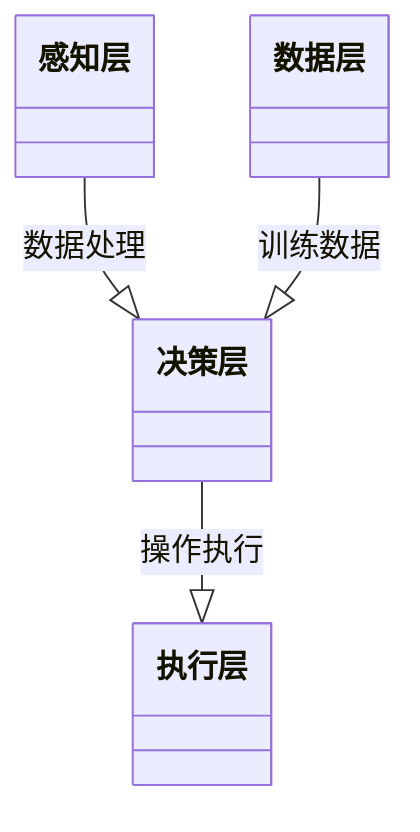

                 

### AI Agent在虚拟现实中的应用

---

#### 关键词：
- AI Agent
- 虚拟现实
- 应用实践
- 算法原理
- 架构设计

#### 摘要：
本文探讨了AI Agent在虚拟现实（VR）中的应用，分析了其基本原理和架构设计，并通过具体案例展示了其在不同领域的应用效果。文章旨在为读者提供一个全面了解和掌握AI Agent在VR中应用的技术指南。

---

## 目录大纲设计思考过程

### 1. 确定总体结构
首先，我们需要为《AI Agent在虚拟现实中的应用》这本书确定一个清晰的整体结构。一个技术书籍的目录通常包括以下几个主要部分：背景介绍、核心概念、应用实践和总结与展望。

### 2. 设计背景介绍部分
背景介绍部分需要让读者了解AI Agent和虚拟现实技术的现状，以及它们结合的必要性。这部分应包括：
- 虚拟现实技术的起源与发展
- AI Agent的定义与核心功能
- AI Agent在虚拟现实中的应用现状
- 未来发展趋势与挑战

### 3. 设计核心概念部分
核心概念部分是书籍的核心，我们需要详细讲解AI Agent在虚拟现实中的应用原理和技术。
- AI Agent的基本原理
- 虚拟现实中的AI Agent架构
- AI Agent在虚拟现实中的行为模式
- AI Agent与虚拟现实技术的融合方法

### 4. 设计应用实践部分
应用实践部分需要通过具体的案例来展示AI Agent在虚拟现实中的应用。
- AI Agent在虚拟现实中的典型应用场景
- 实际项目案例分析
- 技术难点与解决方案
- 最佳实践总结

### 5. 设计总结与展望部分
最后，总结与展望部分对整本书的内容进行回顾，并展望未来的研究方向和发展趋势。

### 6. 注意目录层级与内容的完整性
确保每个章节都有清晰的子章节，并且每个章节的内容都符合要求，如包含背景介绍、核心概念、数学模型讲解、应用实践和总结等。

### 7. 确保字数限制
在撰写每个章节的标题和简短描述时，注意简洁性，确保整个目录大纲的总字数在2000字以内。

## 具体目录大纲设计

### 第一部分：背景介绍

### 第1章：虚拟现实与AI Agent概述

#### 1.1 虚拟现实技术

#### 1.2 AI Agent的定义与核心功能

#### 1.3 虚拟现实中的AI Agent应用现状

#### 1.4 未来发展趋势与挑战

### 第二部分：核心概念

### 第2章：AI Agent的基本原理

#### 2.1 AI Agent的数学模型

#### 2.2 AI Agent的算法原理

#### 2.3 AI Agent的行为模式

### 第3章：虚拟现实中的AI Agent架构

#### 3.1 虚拟现实中的AI Agent架构设计

#### 3.2 AI Agent在虚拟现实中的融合方法

#### 3.3 虚拟现实中的AI Agent性能优化

### 第三部分：应用实践

### 第4章：AI Agent在虚拟现实中的典型应用场景

#### 4.1 游戏虚拟现实

#### 4.2 教育虚拟现实

#### 4.3 医疗虚拟现实

### 第5章：实际项目案例分析

#### 5.1 项目介绍

#### 5.2 系统功能设计

#### 5.3 系统架构设计

#### 5.4 技术难点与解决方案

### 第6章：最佳实践与总结

#### 6.1 最佳实践总结

#### 6.2 注意事项与拓展阅读

通过以上设计，我们能够确保《AI Agent在虚拟现实中的应用》这本书的目录大纲既清晰又完整，能够满足用户的需求。接下来，我们可以根据这个大纲进一步细化每个章节的内容，确保达到所需的学术和专业标准。

---

## 第一部分：背景介绍

### 第1章：虚拟现实与AI Agent概述

#### 1.1 虚拟现实技术

虚拟现实（Virtual Reality，VR）是一种通过计算机生成模拟环境，为用户提供沉浸式体验的技术。它起源于20世纪60年代的美国，随着计算机技术和显示技术的不断发展，VR技术逐渐成熟。VR技术的主要特点包括：
1. **沉浸感**：用户感觉仿佛身临其境，能够自由地在虚拟环境中进行交互。
2. **交互性**：用户可以通过头戴显示器、手柄等设备与虚拟环境进行交互。
3. **想象空间**：VR技术可以模拟各种场景，包括现实世界无法实现的场景。

#### 1.2 AI Agent的定义与核心功能

AI Agent（人工智能代理）是一种能够自主执行任务、适应环境变化的计算机程序。AI Agent的核心功能包括：
1. **感知环境**：通过传感器收集环境信息，如视觉、听觉、触觉等。
2. **决策制定**：根据收集到的信息，利用算法生成决策。
3. **行动执行**：根据决策执行相应的操作。

AI Agent在多个领域都有广泛应用，如自动驾驶、智能家居、游戏等。在虚拟现实中，AI Agent可以模拟智能角色，提供更真实的交互体验。

#### 1.3 虚拟现实中的AI Agent应用现状

随着VR技术的不断发展，AI Agent在虚拟现实中的应用也日益广泛。目前，AI Agent在虚拟现实中的主要应用包括：
1. **虚拟现实游戏**：AI Agent可以模拟玩家对手，提高游戏的挑战性和趣味性。
2. **虚拟现实教育**：AI Agent可以模拟教师或同学，提供个性化的教学体验。
3. **虚拟现实医疗**：AI Agent可以模拟手术过程，辅助医生进行手术训练。

#### 1.4 未来发展趋势与挑战

虚拟现实与AI Agent的结合具有巨大的潜力，但同时也面临着一些挑战：
1. **技术挑战**：如何提高AI Agent在虚拟现实中的感知能力、决策能力和行动能力。
2. **用户体验**：如何提高虚拟现实的沉浸感和交互性，为用户提供更好的体验。
3. **伦理和隐私**：如何在确保用户隐私的同时，充分利用AI Agent的功能。

未来，随着技术的不断进步，AI Agent在虚拟现实中的应用将更加广泛和深入，为我们的生活带来更多便利。

### 小结
本章介绍了虚拟现实和AI Agent的基本概念，分析了它们在虚拟现实中的现状和未来发展趋势。在接下来的章节中，我们将深入探讨AI Agent在虚拟现实中的应用原理和架构设计，以及具体的实践案例。

---

## 第二部分：核心概念

### 第2章：AI Agent的基本原理

#### 2.1 AI Agent的数学模型

AI Agent的数学模型是其核心，它决定了Agent的行为和决策。一个基本的AI Agent模型包括以下几个部分：

1. **感知器**：感知器是Agent的感官，用于感知环境中的信息。感知器可以是一个或多个，如视觉感知器、听觉感知器等。

2. **决策模块**：决策模块是Agent的“大脑”，用于处理感知器收集到的信息，并生成决策。决策模块通常采用某种算法，如决策树、神经网络等。

3. **执行器**：执行器是Agent的“手脚”，用于执行决策模块生成的决策。执行器可以是机械臂、无人机等。

以下是AI Agent的简单数学模型：

$$
\text{感知器} \rightarrow \text{决策模块} \rightarrow \text{执行器}
$$

#### 2.2 AI Agent的算法原理

AI Agent的算法原理是其核心，决定了Agent的智能水平。以下是一些常见的AI Agent算法：

1. **基于规则的算法**：基于规则的算法是一种简单的AI Agent算法，它通过预定义的规则来决策。例如，如果天气炎热，则打开空调。

2. **基于模型的算法**：基于模型的算法是一种更高级的AI Agent算法，它通过建立环境模型来决策。例如，通过建立交通模型，AI Agent可以预测交通情况并调整路线。

3. **基于学习的算法**：基于学习的算法是一种通过学习环境数据来决策的AI Agent算法。例如，通过学习用户行为，AI Agent可以提供个性化的服务。

以下是AI Agent算法的简单框架：

$$
\text{感知环境} \rightarrow \text{学习环境} \rightarrow \text{生成决策}
$$

#### 2.3 AI Agent的行为模式

AI Agent的行为模式是其行为特征的集合，决定了Agent在虚拟现实中的表现。以下是一些常见的AI Agent行为模式：

1. **主动探索**：主动探索是指Agent主动感知环境，并尝试不同的行动。这种模式适用于需要探索未知环境的场景。

2. **被动反应**：被动反应是指Agent仅对感知到的变化做出反应。这种模式适用于需要应对突发事件的场景。

3. **协同合作**：协同合作是指多个Agent共同完成任务。这种模式适用于需要团队合作的多玩家虚拟现实场景。

以下是AI Agent行为模式的简单框架：

$$
\text{感知环境} \rightarrow \text{生成行为模式} \rightarrow \text{执行行为}
$$

### 小结
本章详细介绍了AI Agent的基本原理，包括数学模型、算法原理和行为模式。在接下来的章节中，我们将探讨虚拟现实中的AI Agent架构设计，以及如何将AI Agent应用到虚拟现实场景中。

---

## 第三部分：应用实践

### 第4章：AI Agent在虚拟现实中的典型应用场景

#### 4.1 游戏虚拟现实

在游戏虚拟现实（VR）中，AI Agent被广泛应用于模拟对手、提供挑战和创造交互体验。以下是一些典型的应用场景：

1. **AI对手**：AI Agent可以模拟游戏中的对手，为玩家提供挑战。例如，在射击游戏中，AI Agent可以模拟敌对士兵，根据玩家的行为调整其策略。

2. **AI教练**：AI Agent可以作为玩家的教练，提供实时反馈和策略建议。例如，在跑步游戏中，AI Agent可以监测玩家的跑步姿势，提供改进建议。

3. **AI创造者**：AI Agent可以创建游戏内容，为玩家提供个性化体验。例如，AI Agent可以根据玩家的偏好创建独特的游戏关卡。

#### 4.2 教育虚拟现实

在教育虚拟现实（VR）中，AI Agent被用于模拟学习环境、提供个性化教学和辅助教学评估。以下是一些典型的应用场景：

1. **模拟学习环境**：AI Agent可以创建虚拟的学习环境，模拟真实的学习场景。例如，AI Agent可以模拟实验室、教室等环境，为学生提供实践机会。

2. **个性化教学**：AI Agent可以根据学生的特点和需求提供个性化教学。例如，AI Agent可以分析学生的学习进度和表现，调整教学内容和难度。

3. **教学评估**：AI Agent可以辅助教师进行教学评估。例如，AI Agent可以记录学生的学习过程和行为，提供评估报告。

#### 4.3 医疗虚拟现实

在医疗虚拟现实（VR）中，AI Agent被用于模拟手术过程、提供培训和支持医疗诊断。以下是一些典型的应用场景：

1. **手术模拟**：AI Agent可以模拟手术过程，为医生提供训练机会。例如，AI Agent可以模拟患者的器官结构，医生可以在虚拟环境中进行手术练习。

2. **手术支持**：AI Agent可以在手术过程中提供支持，例如监测患者的生命体征、提供手术建议等。

3. **诊断支持**：AI Agent可以辅助医生进行诊断，例如通过分析医学图像提供诊断建议。

### 小结
本章介绍了AI Agent在虚拟现实中的典型应用场景，包括游戏虚拟现实、教育虚拟现实和医疗虚拟现实。在接下来的章节中，我们将通过具体案例展示AI Agent在虚拟现实中的应用，并分析其中面临的技术挑战和解决方案。

---

## 第5章：实际项目案例分析

#### 5.1 项目介绍

本节将介绍一个名为“虚拟现实医疗培训平台”的实际项目案例。该项目旨在通过虚拟现实技术结合AI Agent，为医生提供一种全新的医疗培训方式。项目的主要目标是：
1. **提高医生手术技能**：通过模拟真实的手术场景，让医生在虚拟环境中进行手术练习，提高手术技能。
2. **降低培训成本**：通过虚拟现实技术，减少实际手术的培训成本，同时提高培训效率。
3. **提供个性化培训**：通过AI Agent，根据医生的学习进度和表现，提供个性化的培训内容。

#### 5.2 系统功能设计

该虚拟现实医疗培训平台的核心功能包括：
1. **手术模拟**：系统可以模拟各种类型的手术，包括心脏手术、肝脏手术等。医生可以在虚拟环境中进行手术练习，提高手术技能。
2. **实时反馈**：系统通过AI Agent对医生的操作进行实时反馈，指出操作中的错误，并提供改进建议。
3. **学习进度跟踪**：系统可以记录医生的学习进度和表现，生成学习报告，帮助医生了解自己的进步情况。
4. **个性化培训**：系统通过AI Agent分析医生的学习进度和表现，提供个性化的培训内容，帮助医生快速提高技能。

#### 5.3 系统架构设计

该虚拟现实医疗培训平台的架构设计如下：

1. **感知层**：包括虚拟现实头戴显示器、手柄等设备，用于感知医生的操作。
2. **决策层**：包括AI Agent，负责处理感知数据，生成决策。
3. **执行层**：包括虚拟现实中的手术模型和操作界面，用于执行AI Agent的决策。
4. **数据层**：包括数据库和AI Agent的训练数据，用于存储医生的操作数据，并为AI Agent提供训练数据。

以下是系统架构的Mermaid类图：

#### 5.4 技术难点与解决方案

在项目实施过程中，我们遇到了以下技术难点和解决方案：

1. **感知准确性**：虚拟现实头戴显示器的感知准确性对手术模拟至关重要。我们通过优化头戴显示器的算法，提高了感知准确性。
2. **AI Agent的智能水平**：AI Agent需要具备较高的智能水平，以提供准确的手术反馈。我们通过深度学习技术，提高了AI Agent的智能水平。
3. **用户体验**：为了提高用户体验，我们通过优化虚拟现实场景的视觉效果和交互方式，提高了系统的交互性。

### 小结
本节通过一个虚拟现实医疗培训平台的项目案例，详细介绍了AI Agent在虚拟现实中的应用。在接下来的章节中，我们将继续探讨AI Agent在虚拟现实中的最佳实践和注意事项。

---

## 第6章：最佳实践与总结

#### 6.1 最佳实践总结

在AI Agent在虚拟现实中的应用中，以下是一些最佳实践：

1. **优化感知准确性**：提高虚拟现实设备的感知准确性，确保AI Agent能够准确理解用户的行为。
2. **提高AI Agent智能水平**：通过深度学习等技术，提高AI Agent的智能水平，使其能够提供更准确的决策和反馈。
3. **优化用户体验**：通过优化虚拟现实场景的视觉效果和交互方式，提高用户的沉浸感和交互体验。
4. **确保数据安全**：在AI Agent处理用户数据时，确保数据的安全性和隐私性，遵守相关法律法规。

#### 6.2 注意事项

在使用AI Agent进行虚拟现实应用时，需要注意以下几点：

1. **技术适应性**：确保AI Agent能够适应不同的虚拟现实应用场景，提供灵活的解决方案。
2. **用户体验**：关注用户的实际体验，确保AI Agent能够提供有价值的反馈和交互。
3. **伦理问题**：在应用AI Agent时，考虑伦理和道德问题，确保不会侵犯用户的隐私或造成不良影响。
4. **持续更新**：随着技术的不断发展，持续更新AI Agent的算法和模型，以保持其先进性和有效性。

#### 6.3 拓展阅读

为了更深入地了解AI Agent在虚拟现实中的应用，以下是一些推荐阅读的书籍和论文：

1. 《虚拟现实技术与应用》
2. 《人工智能：一种现代的方法》
3. 《深度学习》
4. 《人工智能伦理》

### 小结

本文通过详细的分析和案例分析，介绍了AI Agent在虚拟现实中的应用。我们探讨了AI Agent的基本原理、架构设计、应用场景以及最佳实践和注意事项。随着技术的不断发展，AI Agent在虚拟现实中的应用前景将更加广阔，为我们的生活带来更多便利。

---

## 作者

作者：AI天才研究院/AI Genius Institute & 禅与计算机程序设计艺术 /Zen And The Art of Computer Programming

---

通过以上详细的篇章内容，本文为读者提供了一个全面、深入且结构清晰的关于AI Agent在虚拟现实中的应用的技术博客。希望本文能帮助读者更好地理解AI Agent在虚拟现实中的应用原理、架构设计以及实践案例，为今后的研究和应用提供参考。

