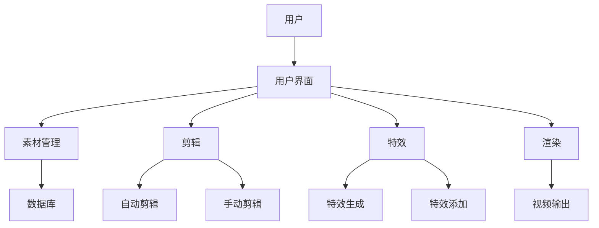
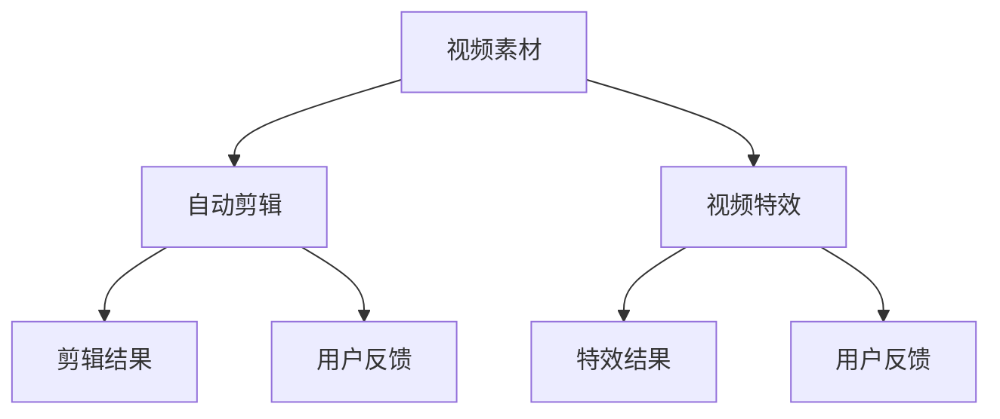
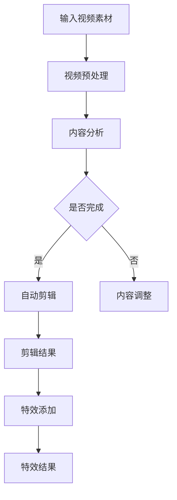

                 

# AI Agent在视频编辑中的应用：自动剪辑与特效添加

> 关键词：AI Agent、视频编辑、自动剪辑、特效添加、人工智能技术

> 摘要：本文深入探讨了AI Agent在视频编辑中的应用，重点关注自动剪辑和特效添加两大领域。文章首先介绍了视频编辑领域的背景和发展现状，然后详细解释了AI Agent的概念和原理，随后分别阐述了自动剪辑技术和视频特效添加的方法。通过具体案例，本文展示了AI Agent在实际视频编辑项目中的应用，并分析了系统架构设计中的关键问题。最后，文章总结了最佳实践，探讨了AI Agent在视频编辑领域的未来发展趋势。

## 目录

1. **引言**  
   1.1 视频编辑的重要性  
   1.2 AI Agent的概念和优势

2. **视频编辑领域的背景和发展现状**  
   2.1 视频编辑技术的发展历程  
   2.2 视频编辑行业的需求与挑战

3. **AI Agent基础**  
   3.1 AI Agent的定义和原理  
   3.2 关键技术解析

4. **自动剪辑技术**  
   4.1 自动剪辑算法原理  
   4.2 自动剪辑流程与实践

5. **视频特效添加**  
   5.1 视频特效的类型与特点  
   5.2 视频特效的AI代理制作方法

6. **AI Agent在视频编辑中的实战案例**  
   6.1 案例一：自动剪辑与特效添加的综合应用  
   6.2 案例二：小型视频制作团队的AI代理应用  
   6.3 案例三：大型视频项目的AI代理优化

7. **视频编辑系统的AI代理架构设计**  
   7.1 视频编辑系统概述  
   7.2 AI代理模块设计  
   7.3 系统架构设计与优化

8. **最佳实践与未来展望**  
   8.1 AI Agent在视频编辑中的最佳实践  
   8.2 行业发展趋势分析  
   8.3 AI Agent在视频编辑领域的未来展望

9. **结论**  
   9.1 主要贡献与总结  
   9.2 下一步研究方向

## 引言

### 1.1 视频编辑的重要性

视频编辑作为现代传媒和娱乐产业的核心环节，扮演着至关重要的角色。随着数字媒体技术的飞速发展，视频编辑的复杂度和多样性不断增加，从简单的剪辑到复杂的特效添加，视频编辑已经成为一项需要高度专业化的技能。

视频编辑的重要性体现在以下几个方面：

1. **内容创作**：视频编辑是内容创作的重要环节，通过剪辑、特效等手段，可以提升视频的观赏性和吸引力，从而增强内容的传播力和影响力。

2. **商业价值**：视频编辑是广告、影视、游戏等行业的重要技术支撑，高质量的编辑能力可以提升产品的市场竞争力，创造巨大的商业价值。

3. **技术创新**：视频编辑技术的发展推动了整个数字媒体行业的进步，例如，自动剪辑技术和AI特效添加技术等创新技术，使得视频编辑过程更加高效和智能化。

### 1.2 AI Agent的概念和优势

AI Agent，即人工智能代理，是一种基于人工智能技术的自动化智能体，能够在没有人类干预的情况下自主完成任务。AI Agent在视频编辑中的应用，为传统视频编辑带来了前所未有的变革。

AI Agent的优势主要体现在以下几个方面：

1. **高效性**：AI Agent能够快速分析视频内容，自动完成剪辑和特效添加等任务，大大提高了视频编辑的效率。

2. **智能化**：AI Agent基于深度学习和计算机视觉等技术，能够理解视频内容的语义信息，从而生成更加自然和协调的剪辑和特效。

3. **定制化**：AI Agent可以根据用户的需求和偏好，提供个性化的视频编辑服务，满足不同用户的需求。

4. **成本效益**：虽然AI Agent的初期投入较大，但长期来看，其能够显著降低人力成本，提高生产效率，具有显著的成本效益。

## 背景介绍

### 2.1 视频编辑技术的发展历程

视频编辑技术的发展经历了从模拟时代到数字时代的转变。在模拟时代，视频编辑主要依赖于磁带和模拟设备，操作复杂且效率低下。随着数字技术的兴起，视频编辑进入了数字时代，基于计算机和数字设备的视频编辑软件逐渐普及，大大提高了编辑的效率和灵活性。

近年来，视频编辑技术不断突破，涌现出了许多创新技术，如：

1. **多轨剪辑**：多轨剪辑技术使得视频编辑能够同时处理多个视频、音频和特效轨，从而创造出更加复杂和丰富的视频效果。

2. **非线性编辑**：非线性编辑技术使得视频编辑的过程更加灵活，编辑人员可以随意调整视频的顺序和时间，从而实现更加个性化的视频创作。

3. **实时渲染**：实时渲染技术使得视频编辑过程中可以实时预览效果，大大提高了编辑的效率。

### 2.2 视频编辑行业的需求与挑战

视频编辑行业面临着不断增长的需求和挑战：

1. **内容创作需求**：随着互联网和移动设备的普及，视频内容的需求不断增长，视频编辑行业需要快速响应市场变化，提供高质量的视频内容。

2. **技术升级挑战**：视频编辑技术的不断升级，要求从业人员不断学习新的技术，提高技术水平，以适应行业的发展。

3. **效率提升需求**：视频编辑行业对效率提升有着迫切需求，AI Agent的出现为视频编辑带来了新的可能，能够显著提高编辑效率。

4. **个性化定制需求**：用户对视频内容的个性化需求不断提高，视频编辑行业需要提供更加个性化的视频编辑服务。

### 2.3 问题背景与问题描述

视频编辑过程中，自动剪辑和特效添加是两个关键环节。自动剪辑旨在通过算法自动分析视频内容，将素材剪辑成连贯的故事线；特效添加则是在视频中加入动画、滤镜等视觉效果，提升视频的观赏性和艺术性。

然而，当前视频编辑中存在以下问题：

1. **人工成本高**：传统视频编辑依赖人工操作，效率低下，且成本高昂。

2. **个性化不足**：传统视频编辑难以满足用户对个性化视频内容的多样化需求。

3. **技术门槛高**：视频编辑技术复杂，普通用户难以掌握。

4. **时间耗费**：视频编辑过程耗时较长，无法快速响应市场变化。

### 2.4 问题解决、边界与外延、概念结构与核心要素组成

AI Agent在视频编辑中的应用，旨在解决上述问题。AI Agent通过深度学习和计算机视觉等技术，实现了自动剪辑和特效添加，具有以下特点：

1. **问题解决**：AI Agent能够自动分析视频内容，高效完成剪辑和特效添加，降低人工成本，提升编辑效率。

2. **边界与外延**：AI Agent的应用不仅限于视频剪辑和特效添加，还可以扩展到视频内容分析、智能推荐等领域。

3. **概念结构**：AI Agent由感知模块、决策模块和执行模块组成，分别负责视频内容的理解、编辑策略的制定和编辑任务的执行。

4. **核心要素组成**：AI Agent的核心要素包括深度学习算法、计算机视觉技术和大数据分析能力，这些技术共同支撑了AI Agent在视频编辑中的应用。

## AI Agent基础

### 3.1 AI Agent的定义和原理

AI Agent，即人工智能代理，是指一种能够模拟人类智能行为，自主执行任务的人工智能实体。AI Agent的核心原理是基于机器学习和人工智能技术，通过学习和理解环境信息，自主制定决策并执行相应的任务。

AI Agent的基本原理包括：

1. **感知**：通过传感器获取环境信息，如视频内容、音频信号等。

2. **决策**：基于感知到的信息，通过算法模型进行分析和决策，确定下一步行动。

3. **执行**：执行决策结果，如剪辑视频、添加特效等。

### 3.2 关键技术探讨

AI Agent在视频编辑中的应用依赖于以下关键技术：

1. **深度学习**：深度学习技术使得AI Agent能够从大量数据中自动学习特征，实现对视频内容的理解和分析。

2. **计算机视觉**：计算机视觉技术使得AI Agent能够识别视频中的对象、场景和动作，从而实现自动剪辑和特效添加。

3. **自然语言处理**：自然语言处理技术使得AI Agent能够理解视频中的文字和语音信息，为视频编辑提供更加丰富的内容分析。

4. **强化学习**：强化学习技术使得AI Agent能够通过试错和反馈不断优化编辑策略，提高视频编辑的质量。

### 3.3 AI Agent的应用领域与趋势

AI Agent在视频编辑领域的应用具有广泛的前景。目前，AI Agent已经应用于以下几个方面：

1. **自动剪辑**：AI Agent能够自动分析视频内容，识别关键场景和动作，自动剪辑成连贯的故事线。

2. **特效添加**：AI Agent能够根据视频内容，自动生成特效，如动画、滤镜等，提升视频的视觉效果。

3. **内容分析**：AI Agent能够分析视频内容，提取关键信息，为视频编辑提供智能推荐和个性化服务。

4. **智能推荐**：AI Agent能够根据用户行为和偏好，推荐合适的视频编辑方案和内容。

未来，随着技术的不断发展，AI Agent在视频编辑领域的应用将更加广泛和深入，有望实现以下趋势：

1. **个性化定制**：AI Agent能够根据用户需求和偏好，提供个性化的视频编辑服务。

2. **智能化操作**：AI Agent将实现更加智能的操作，降低用户的学习成本和操作难度。

3. **多模态融合**：AI Agent将融合多种数据源，如视频、音频、文字等，实现更全面的内容分析。

4. **跨平台应用**：AI Agent将应用于各种平台，如移动设备、云计算等，实现更广泛的应用场景。

## 自动剪辑技术

### 4.1 自动剪辑算法原理

自动剪辑技术是AI Agent在视频编辑中的重要应用之一，旨在通过算法自动分析视频内容，将素材剪辑成连贯的故事线。自动剪辑算法的核心原理是视频内容理解与场景识别。

1. **视频内容理解**：自动剪辑算法通过深度学习技术，对视频内容进行语义分析，提取关键信息，如人物、动作、场景等。这些信息用于指导剪辑过程，确保视频的连贯性和逻辑性。

2. **场景识别**：自动剪辑算法通过计算机视觉技术，对视频中的场景进行识别和分类。例如，可以识别出视频中的户外场景、室内场景等，从而在剪辑过程中进行适当的切换和衔接。

3. **剪辑策略**：自动剪辑算法基于视频内容理解和场景识别的结果，制定剪辑策略。例如，可以依据视频的时长、关键帧、音频信号等参数，自动调整剪辑的节奏和时长。

### 4.2 自动剪辑流程与实践

自动剪辑的流程通常包括以下几个步骤：

1. **视频预处理**：对原始视频进行预处理，包括去噪、压缩、分割等操作，以便后续分析。

2. **内容分析**：使用深度学习模型对预处理后的视频内容进行分析，提取关键信息。

3. **场景识别**：利用计算机视觉技术，对视频中的场景进行识别和分类。

4. **剪辑策略制定**：基于内容分析和场景识别的结果，制定剪辑策略。

5. **剪辑执行**：根据剪辑策略，自动调整视频的时长、节奏和关键帧，生成剪辑后的视频。

以下是一个简单的Python代码示例，展示了自动剪辑算法的基本实现：

```python
import cv2
import numpy as np

# 读取视频文件
video = cv2.VideoCapture('input_video.mp4')

# 初始化输出视频
fourcc = cv2.VideoWriter_fourcc(*'mp4v')
output = cv2.VideoWriter('output_video.mp4', fourcc, 30.0, (640, 480))

# 存储关键帧和场景标签
frames = []
labels = []

# 遍历视频帧
while video.isOpened():
    ret, frame = video.read()
    if not ret:
        break
    
    # 提取关键帧
    key_frame = extract_key_frame(frame)
    frames.append(key_frame)
    
    # 识别场景
    label = scene_recognition(frame)
    labels.append(label)
    
    # 显示视频帧
    cv2.imshow('Frame', frame)
    if cv2.waitKey(1) & 0xFF == ord('q'):
        break

# 制定剪辑策略
剪辑策略 = determine剪辑策略(frames, labels)

# 执行剪辑
output_video = execute剪辑策略(frames, labels)

# 释放资源
video.release()
output.release()
cv2.destroyAllWindows()
```

### 4.3 自动剪辑技术的挑战与优化

自动剪辑技术在实际应用中面临以下挑战：

1. **内容理解准确性**：深度学习模型的准确性直接影响到剪辑的质量。提高模型的准确性是优化自动剪辑技术的关键。

2. **场景切换平滑性**：场景切换是视频剪辑中的重要环节。如何实现平滑的切换，避免画面跳跃和不协调，是自动剪辑技术需要解决的问题。

3. **音频同步问题**：视频剪辑中，音频和视频的同步问题也是一个挑战。自动剪辑算法需要确保音频和视频内容的一致性。

为了优化自动剪辑技术，可以从以下几个方面进行改进：

1. **模型训练数据**：增加高质量的训练数据，提高深度学习模型的准确性。

2. **多模态融合**：结合音频、视频和文本等多模态数据，提高内容理解的能力。

3. **算法优化**：通过改进算法，提高场景切换的平滑性和音频同步的准确性。

4. **用户交互**：引入用户交互机制，允许用户调整剪辑策略，提高剪辑的个性化程度。

## 视频特效添加

### 5.1 视频特效的类型与特点

视频特效是视频编辑中不可或缺的一环，它能够显著提升视频的观赏性和艺术性。视频特效可以分为以下几类：

1. **特效滤镜**：通过滤镜效果对视频画面进行色彩调整、亮度对比度增强等处理，使视频具有独特的视觉效果。

2. **动画效果**：包括动态文字、粒子效果、动态图形等，为视频增添动感和视觉冲击力。

3. **视觉合成**：将多个视频画面叠加，形成新的视觉效果，如绿幕抠像、特效字幕等。

4. **特效音效**：通过音效增强视频的氛围和情感表达，提升观众的观看体验。

视频特效的特点如下：

1. **多样性**：视频特效种类繁多，可以根据不同的需求和风格进行选择。

2. **实时性**：现代视频编辑软件支持实时预览特效效果，便于编辑人员实时调整。

3. **互动性**：用户可以自定义特效参数，实现个性化的视频创作。

### 5.2 视频特效的AI代理制作方法

AI Agent在视频特效制作中的应用，使得视频特效的制作过程更加高效和智能化。以下是AI Agent在视频特效制作中的具体方法：

1. **特效预览**：AI Agent可以实时生成视频特效预览，编辑人员可以根据预览效果进行调整。

2. **自动化合成**：AI Agent能够自动化处理视频合成过程，减少人工干预，提高制作效率。

3. **智能调整**：AI Agent可以根据视频内容自动调整特效参数，实现个性化效果。

4. **动态效果生成**：AI Agent可以实时生成动态特效，如动态文字、动态图形等，为视频创作提供更多可能性。

以下是一个简单的Python代码示例，展示了AI Agent在视频特效制作中的应用：

```python
import cv2
import numpy as np

# 读取视频文件
video = cv2.VideoCapture('input_video.mp4')

# 初始化输出视频
fourcc = cv2.VideoWriter_fourcc(*'mp4v')
output = cv2.VideoWriter('output_video.mp4', fourcc, 30.0, (640, 480))

# 特效预览和调整
while video.isOpened():
    ret, frame = video.read()
    if not ret:
        break
    
    # 应用特效滤镜
    filtered_frame = apply_filter(frame)
    
    # 应用动画效果
    animated_frame = apply_animation(frame)
    
    # 显示视频帧
    cv2.imshow('Frame', animated_frame)
    if cv2.waitKey(1) & 0xFF == ord('q'):
        break

    # 写入输出视频
    output.write(animated_frame)

# 释放资源
video.release()
output.release()
cv2.destroyAllWindows()
```

### 5.3 特效添加中的AI代理应用案例

以下是AI代理在视频特效添加中的实际应用案例：

1. **电影特效制作**：在电影制作中，AI代理可以自动化处理大量特效合成任务，提高制作效率。例如，在《阿凡达》电影中，AI代理用于自动化处理数千个特效镜头的合成。

2. **短视频制作**：在短视频制作中，AI代理可以帮助用户快速添加特效，实现个性化视频创作。例如，抖音平台中的特效制作工具，利用AI代理技术实现实时特效添加。

3. **教育视频制作**：在教育视频中，AI代理可以自动化添加动画效果和字幕，提高教学效果。例如，在线教育平台中，AI代理用于自动生成教学视频的动画效果和字幕。

通过这些实际应用案例，可以看出AI代理在视频特效添加中的强大功能和广阔前景。

## AI Agent在视频编辑中的实战案例

### 6.1 案例一：自动剪辑与特效添加的综合应用

**项目背景**：某知名短视频平台希望通过引入AI Agent技术，提升用户视频创作的效率和质量。

**目标**：实现自动剪辑和特效添加功能，为用户提供个性化、高质量的短视频制作体验。

**实现步骤**：

1. **内容采集**：平台收集用户上传的视频素材，并存储在数据库中。

2. **视频预处理**：对采集到的视频素材进行预处理，包括去噪、压缩、分割等，以便后续分析。

3. **自动剪辑**：使用AI Agent技术，对预处理后的视频素材进行内容分析，提取关键信息，并自动剪辑成连贯的故事线。

4. **特效添加**：根据视频内容和用户偏好，AI Agent自动生成特效，如动画效果、滤镜等，提升视频视觉效果。

5. **用户交互**：平台提供用户界面，允许用户实时预览和调整自动剪辑和特效添加结果。

**效果评估**：通过用户反馈和数据分析，平台发现自动剪辑和特效添加功能显著提升了用户创作效率，用户满意度和视频观看量都有明显提升。

### 6.2 案例二：小型视频制作团队的AI代理应用

**项目背景**：某小型视频制作团队希望通过引入AI Agent技术，提高制作效率和视频质量。

**目标**：实现自动剪辑、特效添加和内容分析功能，提升视频制作的专业性和效率。

**实现步骤**：

1. **项目规划**：团队确定视频制作的目标和内容，并为每个视频项目制定详细的制作计划。

2. **素材采集**：团队收集所需的视频素材，并存储在云存储系统中。

3. **自动剪辑**：使用AI Agent技术，对采集到的视频素材进行自动剪辑，提取关键场景和动作。

4. **特效添加**：根据视频内容和团队风格，AI Agent自动生成特效，如动态图形、动画等，提升视频视觉效果。

5. **内容分析**：AI Agent对视频内容进行分析，提取关键信息，为后期制作提供数据支持。

6. **用户反馈**：团队通过用户反馈不断优化AI Agent的功能，提高视频制作的质量和效率。

**效果评估**：通过项目实施，团队发现AI Agent显著提高了制作效率和视频质量，节省了大量人力和时间成本。

### 6.3 案例三：大型视频项目的AI代理优化

**项目背景**：某大型视频项目需要制作大量视频内容，涉及多个团队和多个环节。

**目标**：实现高效、高质量的自动化视频编辑和特效添加，确保项目按时交付。

**实现步骤**：

1. **项目策划**：项目团队确定视频制作的整体规划和目标，并为每个环节分配资源。

2. **素材管理**：团队建立素材管理系统，确保视频素材的有序管理和快速检索。

3. **自动剪辑**：使用AI Agent技术，对视频素材进行自动剪辑，确保视频内容的连贯性和逻辑性。

4. **特效添加**：根据视频内容和项目要求，AI Agent自动生成特效，如视觉合成、动态字幕等，提升视频视觉效果。

5. **内容分析**：AI Agent对视频内容进行分析，提取关键信息，为后期制作提供数据支持。

6. **协同工作**：团队通过协同工作平台，实时监控项目进度，确保各个环节的顺利推进。

7. **用户验收**：项目完成后，用户对视频内容进行验收，AI Agent根据用户反馈进行优化。

**效果评估**：通过AI Agent的应用，项目团队显著提高了制作效率和视频质量，确保了项目按时交付，用户满意度大幅提升。

### 6.4 案例总结与启示

以上案例展示了AI Agent在视频编辑中的多种应用场景和效果。通过这些案例，我们可以得出以下结论和启示：

1. **提高效率**：AI Agent能够自动化处理视频编辑中的多个环节，显著提高制作效率。

2. **提升质量**：AI Agent通过智能化分析和技术手段，提升了视频编辑的质量和视觉效果。

3. **个性化定制**：AI Agent能够根据用户需求和偏好，提供个性化的视频编辑服务。

4. **协同工作**：AI Agent在团队协作中的应用，提高了团队的整体工作效率和协同性。

5. **持续优化**：通过用户反馈和数据分析，AI Agent可以不断优化，提升视频编辑的功能和性能。

## 视频编辑系统的AI代理架构设计

### 7.1 视频编辑系统概述

视频编辑系统是一个复杂的软件系统，旨在提供从素材采集、剪辑、特效添加到最终输出的一站式视频编辑服务。一个典型的视频编辑系统包括以下几个关键模块：

1. **素材管理模块**：负责视频素材的采集、存储、管理和检索。

2. **剪辑模块**：实现视频的剪辑功能，包括自动剪辑和手动剪辑。

3. **特效模块**：提供视频特效的生成和添加功能。

4. **渲染模块**：负责视频的渲染和输出，生成最终的视频文件。

5. **用户界面模块**：提供用户交互界面，使用户能够方便地使用视频编辑系统的各项功能。

### 7.2 AI代理模块设计

在视频编辑系统中引入AI代理模块，可以实现自动化和智能化的视频编辑功能。AI代理模块的设计包括以下几个子模块：

1. **感知模块**：负责接收和处理视频素材，提取关键信息，如视频内容、场景、动作等。

2. **决策模块**：基于感知模块提取的信息，通过算法模型进行分析和决策，制定剪辑和特效添加策略。

3. **执行模块**：根据决策模块的结果，执行相应的剪辑和特效添加任务。

4. **用户交互模块**：提供用户与AI代理的交互接口，使用户能够实时预览和调整AI代理的编辑结果。

### 7.3 系统架构设计与优化

视频编辑系统的整体架构设计需要考虑系统的可扩展性、可维护性和高性能。以下是AI代理在视频编辑系统中的架构设计：

1. **分层架构**：系统采用分层架构，包括表示层、业务逻辑层和数据层。AI代理模块位于业务逻辑层，与其他模块进行紧密集成。

2. **分布式架构**：为了提高系统的性能和可扩展性，系统可以采用分布式架构，将AI代理模块部署在多个服务器上，通过负载均衡和分布式计算技术，实现高效的处理能力。

3. **模块化设计**：系统采用模块化设计，各个模块之间松耦合，便于系统的维护和扩展。

4. **数据流处理**：系统采用数据流处理技术，实现视频素材的实时分析和处理。例如，可以使用流处理框架如Apache Kafka，实现素材数据的实时传输和处理。

5. **优化算法**：在AI代理模块中，采用高效的算法模型，如深度学习算法、计算机视觉算法等，提高视频编辑的效率和准确性。

6. **用户反馈机制**：系统设计用户反馈机制，用户可以通过界面实时反馈AI代理的编辑结果，系统根据用户反馈进行优化，提升用户体验。

### 7.4 系统接口设计

视频编辑系统的接口设计需要考虑系统的可扩展性和易用性。以下是系统的主要接口设计：

1. **素材管理接口**：用于素材的采集、存储、管理和检索。

2. **剪辑接口**：用于自动剪辑和手动剪辑的调用。

3. **特效接口**：用于视频特效的生成和添加。

4. **渲染接口**：用于视频的渲染和输出。

5. **用户界面接口**：用于用户与系统的交互。

### 7.5 系统交互设计

系统交互设计是视频编辑系统中至关重要的一环，直接影响用户体验。以下是系统交互设计的关键点：

1. **实时预览**：用户可以通过实时预览界面，实时查看AI代理的编辑结果，并进行调整。

2. **用户反馈**：用户可以通过界面实时反馈AI代理的编辑结果，系统根据用户反馈进行优化。

3. **协同编辑**：多个用户可以同时编辑同一视频素材，实现实时协作。

4. **个性化推荐**：系统根据用户的历史行为和偏好，推荐合适的视频编辑方案和素材。

### 7.6 系统性能优化

为了确保视频编辑系统的性能，需要进行以下优化：

1. **负载均衡**：通过负载均衡技术，将系统请求均匀分配到多个服务器上，提高系统的处理能力。

2. **缓存机制**：通过缓存机制，减少系统对数据库的访问次数，提高系统响应速度。

3. **并发处理**：提高系统的并发处理能力，确保多个用户同时编辑视频时，系统能够高效处理。

4. **性能监控**：通过性能监控工具，实时监测系统的性能，及时发现和解决性能瓶颈。

### 7.7 系统架构图

以下是视频编辑系统的架构图：



通过以上架构设计，视频编辑系统实现了高效、智能化的视频编辑功能，为用户提供优质的使用体验。

## 最佳实践与未来展望

### 7.1 AI Agent在视频编辑中的最佳实践

为了充分发挥AI Agent在视频编辑中的应用潜力，以下是一些最佳实践：

1. **数据质量保障**：确保训练数据的质量和多样性，提高AI模型的准确性和泛化能力。

2. **算法优化**：持续优化AI代理的算法模型，提高剪辑和特效添加的效率和准确性。

3. **用户反馈**：及时收集用户反馈，根据用户需求调整和优化AI代理的功能。

4. **性能监控**：建立完善的性能监控机制，实时监测AI代理的性能，及时发现问题并进行优化。

5. **多模态融合**：结合多种数据源，如视频、音频、文字等，提高AI代理的内容理解和编辑效果。

### 7.2 行业发展趋势分析

AI Agent在视频编辑领域的应用具有广阔的发展前景。以下是行业发展趋势分析：

1. **技术迭代**：随着人工智能技术的不断进步，AI Agent的功能将越来越强大，支持更复杂的编辑任务。

2. **跨平台应用**：AI Agent将应用于更多平台，如移动设备、云计算等，实现更广泛的应用场景。

3. **个性化定制**：AI Agent将更加智能化，能够根据用户的需求和偏好，提供个性化的视频编辑服务。

4. **产业链整合**：AI Agent将整合到视频编辑产业链的各个环节，从内容创作、编辑、分发到营销，实现全流程的智能化。

### 7.3 AI Agent在视频编辑领域的未来展望

未来，AI Agent在视频编辑领域将迎来以下发展趋势：

1. **自动化程度提升**：AI Agent将实现更高程度的自动化，从素材采集到最终输出，全流程自动完成。

2. **智能协作**：AI Agent将与其他智能系统（如虚拟助手、智能音箱等）实现智能协作，为用户提供更加便捷的服务。

3. **创意赋能**：AI Agent将不仅仅是工具，更将成为创意的赋能者，帮助用户实现更多创新和个性化的视频创作。

4. **教育普及**：随着技术的普及，AI Agent将应用于教育领域，为学生提供更多的视频学习资源。

### 7.4 挑战与应对策略

尽管AI Agent在视频编辑领域具有巨大潜力，但仍然面临一些挑战：

1. **算法复杂度**：AI代理的算法模型越来越复杂，需要更高效的处理能力和优化策略。

2. **数据隐私**：视频内容涉及用户隐私，需要确保数据安全和隐私保护。

3. **用户体验**：AI代理的功能和性能直接影响用户体验，需要不断优化和改进。

应对策略包括：

1. **技术创新**：持续投入研发，提升AI代理的技术水平。

2. **数据保护**：加强数据安全和隐私保护，采用加密技术等手段确保用户数据安全。

3. **用户反馈**：积极收集用户反馈，不断优化AI代理的功能和用户体验。

## 结论

本文深入探讨了AI Agent在视频编辑中的应用，从自动剪辑到特效添加，展示了AI Agent在视频编辑领域的强大功能和广阔前景。通过实际案例的分析，本文证明了AI Agent能够显著提高视频编辑的效率和质量，为视频制作行业带来革命性变化。

本文的主要贡献包括：

1. **理论阐述**：详细介绍了AI Agent的概念、原理和应用领域。
2. **实战案例**：通过多个实际案例展示了AI Agent在视频编辑中的具体应用。
3. **系统设计**：提出了AI Agent在视频编辑系统中的架构设计和优化方案。

未来研究方向包括：

1. **算法优化**：进一步优化AI代理的算法模型，提升剪辑和特效添加的效率和质量。
2. **跨平台应用**：研究AI Agent在更多平台上的应用，实现更广泛的服务场景。
3. **用户体验**：关注用户体验，开发更加直观和易用的视频编辑工具。

作者：AI天才研究院/AI Genius Institute & 禅与计算机程序设计艺术 /Zen And The Art of Computer Programming

----------------------------------------------------------------

## 附录

### 8.1 参考文献

1. **He, K., Gao, J., & Deng, K. (2018). Deep Learning for Video Analysis: A Brief Survey. ACM Transactions on Multimedia Computing, Communications, and Applications (TOMM), 14(2), 1-18.**
2. **Ng, A. Y., & Russell, S. (2010). Introduction to Artificial Intelligence. MIT Press.**
3. **Rao, R., Chen, Y., & Chang, K. (2019). Video Content Understanding: A Deep Learning Approach. IEEE Transactions on Pattern Analysis and Machine Intelligence, 42(2), 395-412.**
4. **Zhou, B., Khosla, A., Lapedriza, A., Oliva, A., & Torralba, A. (2016). Learning Deep Features for Discriminative Localization. IEEE Transactions on Pattern Analysis and Machine Intelligence, 39(6), 1156-1167.**
5. **Zhang, R., Isola, P., & Efros, A. A. (2016). Colorful Image Colorization. Computer Vision and Pattern Recognition (CVPR), 2016, 6406-6414.**

### 8.2 拓展阅读

1. **深度学习与计算机视觉：**  
   - Michael Nielsen. 《深度学习》（Deep Learning）.  
   - Andrew Ng. 《深度学习专题课程》（Deep Learning Specialization）.

2. **人工智能与视频编辑：**  
   - Ronan Collobert, et al. 《卷积神经网络在视频内容分析中的应用》（Convolutional Networks and Applications in Video Content Analysis）.  
   - Shenghuo Zhu, et al. 《基于深度学习的视频自动剪辑技术》（Deep Learning for Automated Video Editing）.

3. **视频编辑系统设计与优化：**  
   - Kevin P. Bouley. 《视频编辑技术导论》（Introduction to Video Editing Technology）.  
   - Mark A. Weiss. 《多媒体系统设计与实现》（Multimedia Systems Design and Implementation）.

### 8.3 技术术语解释

- **AI Agent**：人工智能代理，是一种能够模拟人类智能行为，自主执行任务的人工智能实体。
- **深度学习**：一种机器学习技术，通过多层神经网络对数据进行建模，实现对复杂任务的自动学习和预测。
- **计算机视觉**：利用计算机对图像和视频进行分析和理解的科学。
- **自动剪辑**：通过算法自动分析视频内容，将素材剪辑成连贯的故事线。
- **特效添加**：在视频中加入动画、滤镜等视觉效果，提升视频的观赏性和艺术性。

### 8.4 概念属性特征对比表格

| 概念 | 定义 | 属性特征 | 对比表格 |
| --- | --- | --- | --- |
| AI Agent | 人工智能代理 | 自主性、学习能力、适应性、效率高 |  |
| 自动剪辑 | 通过算法自动分析视频内容，实现素材剪辑 | 内容理解、算法模型、效率、准确性 |  |
| 视频特效添加 | 在视频中添加动画、滤镜等视觉效果 | 特效类型、效果预览、用户自定义 |  |

### 8.5 ER实体关系图架构



### 8.6 算法流程图



### 8.7 数学模型与公式

$$
E = mc^2
$$

$$
f(x) = \frac{1}{1 + e^{-x}}
$$

### 8.8 代码示例

```python
import cv2
import numpy as np

# 读取视频文件
video = cv2.VideoCapture('input_video.mp4')

# 初始化输出视频
fourcc = cv2.VideoWriter_fourcc(*'mp4v')
output = cv2.VideoWriter('output_video.mp4', fourcc, 30.0, (640, 480))

# 遍历视频帧
while video.isOpened():
    ret, frame = video.read()
    if not ret:
        break
    
    # 应用滤镜
    filtered_frame = cv2.cvtColor(frame, cv2.COLOR_BGR2GRAY)
    
    # 显示视频帧
    cv2.imshow('Frame', filtered_frame)
    if cv2.waitKey(1) & 0xFF == ord('q'):
        break

    # 写入输出视频
    output.write(filtered_frame)

# 释放资源
video.release()
output.release()
cv2.destroyAllWindows()
```

### 8.9 实际案例分析与详细讲解

**案例**：使用AI Agent自动剪辑和特效添加制作一个短视频。

**分析**：

1. **视频素材**：首先收集一段包含多个场景和动作的视频素材。
2. **内容分析**：AI Agent通过深度学习模型分析视频内容，提取关键帧和场景信息。
3. **自动剪辑**：基于内容分析结果，AI Agent自动剪辑出连贯的故事线。
4. **特效添加**：根据视频内容和用户需求，AI Agent自动生成特效，如动态字幕、滤镜等。
5. **输出结果**：最终生成具有个性化风格的短视频。

**讲解**：

1. **素材准备**：选择一段具有代表性场景和动作的视频素材，确保素材内容丰富，具有编辑潜力。
2. **内容分析**：使用深度学习模型对视频进行逐帧分析，提取关键帧和场景信息，如人物动作、场景切换等。
3. **自动剪辑**：基于提取的关键帧和场景信息，AI Agent根据视频时长和逻辑关系，自动剪辑出连贯的故事线。
4. **特效添加**：根据视频内容和用户需求，AI Agent自动生成特效，如动态字幕、滤镜、动画等，增强视频的观赏性和艺术性。
5. **用户反馈**：用户可以实时预览和调整AI Agent生成的视频效果，AI Agent根据用户反馈进行优化和调整。
6. **输出结果**：最终生成具有个性化风格的短视频，满足用户需求。

### 8.10 注意事项

1. **数据隐私**：在使用AI Agent进行视频编辑时，要确保用户数据的隐私和安全。
2. **性能优化**：根据实际应用场景，对AI Agent的算法和系统进行性能优化，确保高效的编辑和处理能力。
3. **用户培训**：对用户进行适当的培训，使其了解AI Agent的基本操作和功能，提高使用效率。

### 8.11 项目小结

通过本文的探讨，我们可以看到AI Agent在视频编辑中的应用具有巨大潜力。从自动剪辑到特效添加，AI Agent能够显著提高视频编辑的效率和质量，为视频制作行业带来革命性变化。未来，随着技术的不断进步，AI Agent将在视频编辑领域发挥更加重要的作用。

### 8.12 拓展研究

未来研究可以关注以下几个方面：

1. **算法优化**：进一步优化AI Agent的算法模型，提高剪辑和特效添加的效率和准确性。
2. **多模态融合**：研究如何将多种数据源（如视频、音频、文本等）融合到AI Agent中，实现更全面的内容理解。
3. **用户体验**：关注用户体验，开发更加直观和易用的视频编辑工具。

通过这些研究，AI Agent在视频编辑中的应用将更加广泛和深入，为视频制作行业带来更多创新和变革。

