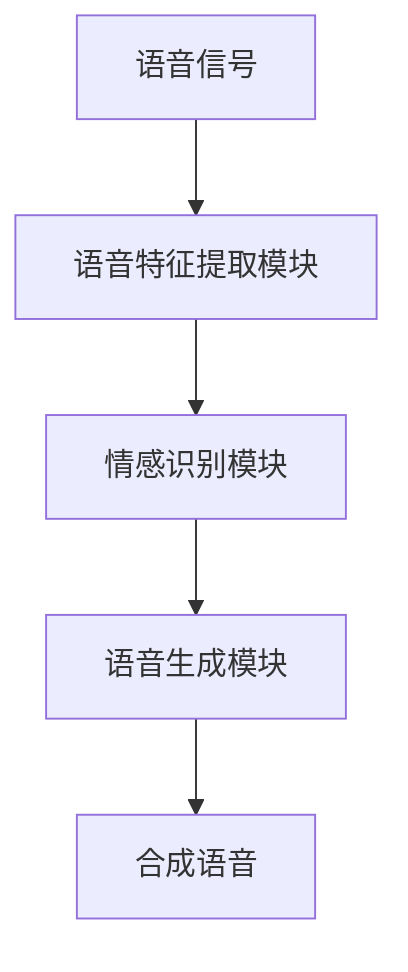
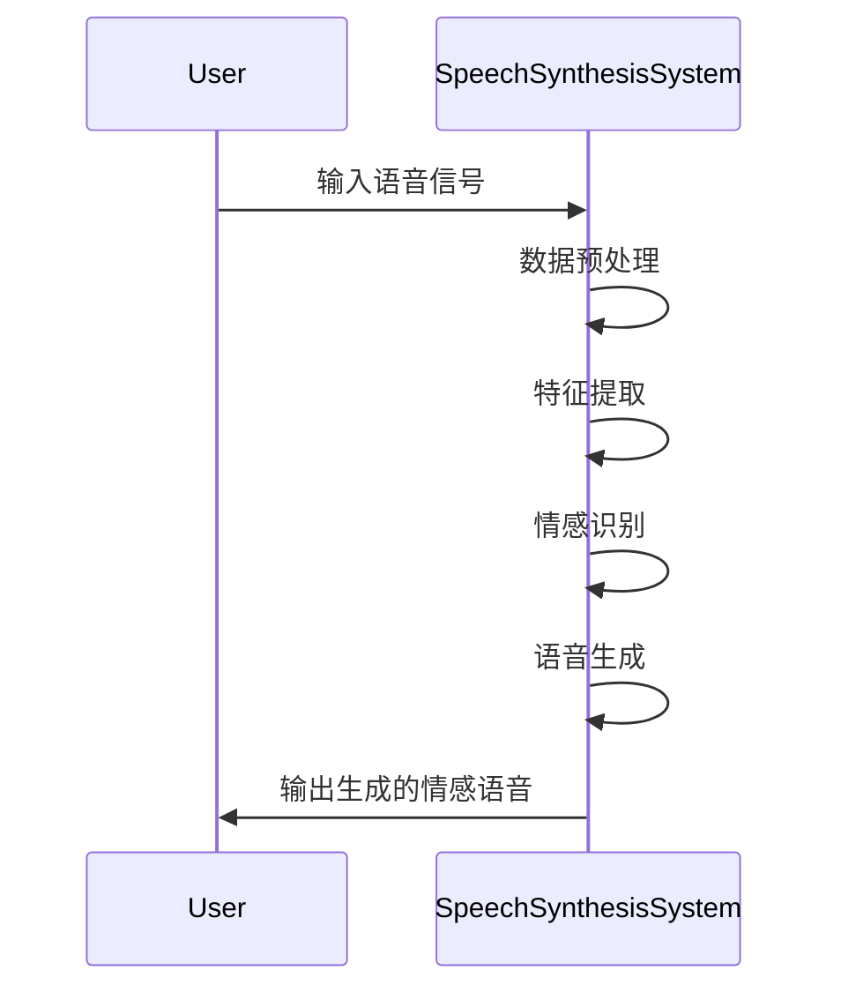
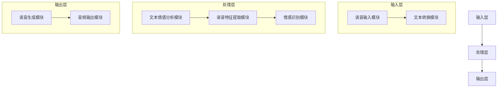
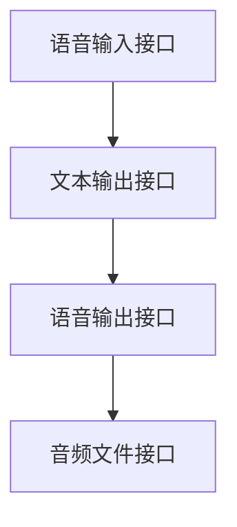
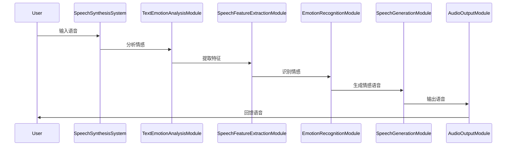

                 

### 引言

#### AI Agent的定义与分类

AI Agent，即人工智能代理，是一种模拟人类智能行为的计算机程序，能够在特定环境中自主决策并执行任务。AI Agent的核心特点是具备一定程度上的自主性、自适应性和交互性。根据功能与实现方式的不同，AI Agent可以大致分为以下几类：

1. **反应型Agent**：这类Agent只能根据当前感知到的环境状态做出反应，不具备记忆和推理能力。例如，自动门在检测到有人靠近时会自动打开。

2. **认知型Agent**：这类Agent能够在理解环境的基础上进行决策，具备一定程度的记忆和推理能力。它们可以学习历史经验，根据当前和过去的状态做出更合理的决策。例如，自动驾驶车辆在行驶过程中需要不断分析路况和环境信息。

3. **学习型Agent**：这类Agent不仅能够感知环境并做出决策，还能够通过学习提高自己的性能。它们可以通过机器学习、深度学习等方法不断优化自己的行为策略。例如，推荐系统通过学习用户的兴趣和行为习惯，为用户提供个性化的内容推荐。

4. **交互型Agent**：这类Agent不仅能够与环境进行交互，还能够与其他Agent进行协作。它们在多智能体系统中发挥着重要作用，能够协同完成复杂任务。例如，多人在线游戏中的智能角色。

#### AI Agent的能力与限制

AI Agent的能力主要体现在以下几个方面：

1. **感知**：AI Agent能够通过传感器感知环境中的各种信息，如图像、声音、温度等。

2. **决策**：基于感知到的信息，AI Agent能够进行推理和决策，选择最合适的行动方案。

3. **行动**：AI Agent能够根据决策执行具体的操作，如移动、发送消息等。

4. **学习**：通过不断与环境交互和学习，AI Agent能够提高自己的性能和适应性。

然而，AI Agent也面临一些限制：

1. **数据依赖性**：大多数AI Agent需要大量的数据来训练和优化模型，缺乏数据会导致性能下降。

2. **算法限制**：当前AI算法在处理复杂问题和不确定性环境时仍存在一定的局限性。

3. **计算资源限制**：高性能的AI Agent通常需要大量的计算资源，这在资源有限的场景中可能成为瓶颈。

4. **道德与法律问题**：AI Agent在决策过程中可能会涉及到道德和法律问题，如何确保其行为的合规性仍是一个挑战。

#### 语音合成中的情感表达

情感表达是语音合成技术中一个重要的研究方向，它涉及到如何让机器生成的语音具有情感色彩，以更好地模拟人类交流的自然性。情感表达的成功与否，直接影响到语音合成系统的用户体验。

1. **情感表达的重要性**：

   - **提高用户体验**：具有情感表达的语音合成系统可以更自然地模拟人类交流，提高用户体验。
   - **增强交互效果**：在特定的应用场景中，如客户服务、教育辅导等，情感表达可以增强交互效果，提高用户满意度。
   - **丰富表达形式**：情感表达可以让语音合成系统具有更多的表达形式，如喜悦、悲伤、愤怒等，使语音更加生动。

2. **情感表达面临的挑战**：

   - **情感识别与理解**：准确识别和理解为语音中的情感成分是一个挑战，因为情感往往是非结构化和主观的。
   - **语音生成的自然性**：如何在保证语音自然流畅的同时，实现情感表达的准确性，是一个技术难题。
   - **跨语言和跨文化的情感表达**：不同语言和文化背景下的情感表达存在差异，如何在跨语言和跨文化的场景中实现情感表达的一致性，需要深入的研究。

#### 当前情感语音合成的研究进展

当前，情感语音合成的研究主要集中在以下几个方面：

1. **情感特征提取**：通过语音信号处理技术，从语音中提取出与情感相关的特征，如音调、节奏、时长等。

2. **情感识别与分类**：利用机器学习算法，对提取到的情感特征进行分类，以识别语音中的情感。

3. **情感合成技术**：基于深度学习模型，通过调整语音参数，生成具有特定情感色彩的语音。

4. **多模态情感表达**：结合文本、图像等多模态信息，提高情感表达的准确性和自然性。

尽管已经取得了一定的进展，但情感语音合成技术仍存在许多需要解决的问题，如情感表达的多样性、情感理解的准确性等。未来，随着人工智能技术的不断进步，情感语音合成有望得到更广泛的应用。

### 情感表达的核心概念与原理

情感表达是语音合成中一个极其重要的环节，它关乎如何使机器生成的语音具备人类的情感色彩，从而提升语音合成的自然性和用户体验。为了深入探讨情感表达的核心概念和原理，我们需要从以下几个方面进行阐述。

#### 情感特征的定义与分类

情感特征是情感表达的基础，它们是语音中反映情感状态的物理和声学属性。常见的情感特征包括音调、节奏、时长、音量和语音包络等。

1. **音调**：音调是语音频率的高低，它与情感表达密切相关。例如，高音调通常与喜悦和兴奋相关，而低音调则与悲伤和沮丧相关。

2. **节奏**：节奏是指语音的快慢和间隔，它对情感表达有着显著的影响。快速的节奏往往传递出兴奋和紧张的情感，而缓慢的节奏则表达出平静和放松的情感。

3. **时长**：语音的时长也是情感表达的一个关键因素。较长的语音包络通常表达出温柔和沉思的情感，而较短的语音包络则显得直接和急促。

4. **音量**：音量是指语音的响度，它直接影响情感表达的强度。高音量往往传递出兴奋和激动，而低音量则表达出安静和深沉的情感。

5. **语音包络**：语音包络是指语音的起伏变化，它反映了语音的动态特性。情感丰富的语音包络通常更加复杂和多变。

#### 情感特征在AI Agent中的表示

在AI Agent中，情感特征的表示和识别是实现情感表达的关键。AI Agent通常通过以下几种方式来表示情感特征：

1. **特征提取**：利用语音信号处理技术，从原始语音信号中提取出与情感相关的特征。常用的方法包括频谱分析、短时傅里叶变换（STFT）和梅尔频率倒谱系数（MFCC）等。

2. **情感识别模型**：使用机器学习算法，如支持向量机（SVM）、深度神经网络（DNN）和长短期记忆网络（LSTM）等，对提取出的情感特征进行分类和识别。

3. **情感参数调整**：通过调整语音合成模型的参数，如音调、节奏、时长和音量等，来生成具有特定情感色彩的语音。

#### 情感表达的原理与机制

情感表达涉及多个层面的机制，包括语音合成模型的训练、情感特征的处理和生成语音的动态调整等。

1. **模型训练**：AI Agent需要通过大量带有情感标签的语音数据进行训练，以学习情感特征和生成策略。训练过程中，模型会调整内部参数，使其能够生成与给定情感标签相匹配的语音。

2. **特征处理**：在生成语音时，AI Agent会根据情感特征进行实时处理。例如，通过调整音调来模拟高兴或悲伤的情感，通过改变节奏来传递紧张或放松的情感。

3. **动态调整**：AI Agent会根据情感特征的变化，动态调整语音生成的参数，以实现情感的自然过渡和表达。例如，在对话过程中，AI Agent会根据上下文和对话内容，实时调整情感表达的强度和方式，使其更符合实际对话情境。

#### 情感表达的多样性与复杂性

情感表达的多样性和复杂性是情感语音合成面临的重大挑战。不同的情感类型、语言和文化背景都会对情感表达产生深远的影响。

1. **情感类型的多样性**：情感类型包括喜悦、悲伤、愤怒、恐惧、厌恶等多种。每种情感类型都有其独特的情感特征和表达方式。例如，喜悦的情感特征可能包括高音调、快速节奏和较高的音量，而悲伤的情感特征则可能是低音调、缓慢节奏和较低的音量。

2. **文化背景的影响**：不同文化背景下的情感表达存在显著差异。例如，在一些文化中，悲伤的情感表达可能更加内敛和克制，而在另一些文化中则可能更加直接和夸张。

3. **语言的影响**：语言在情感表达中起着至关重要的作用。不同的语言词汇和语法结构会影响情感表达的色彩和方式。例如，一些语言中的词汇可能带有特定的情感色彩，而语法结构则可能影响情感表达的强度和连贯性。

#### 情感表达的重要性与未来趋势

情感表达在语音合成中的应用具有重要意义。它不仅能够提升语音合成的自然性和用户体验，还能够为特定的应用场景提供更丰富和生动的表达形式。例如，在客户服务、教育辅导和娱乐应用中，情感表达可以显著提高交互效果和用户满意度。

未来，随着人工智能技术的不断进步，情感语音合成有望实现更高的准确性和自然性。具体趋势包括：

1. **深度学习模型的广泛应用**：深度学习模型在情感特征提取和情感识别中的应用将越来越普及，提高情感表达的性能。

2. **多模态情感表达**：结合文本、图像和声音等多模态信息，实现更加自然和丰富的情感表达。

3. **跨语言和跨文化的情感表达**：研究如何在不同语言和文化背景下实现情感表达的一致性和适应性。

4. **情感理解与生成技术的融合**：将情感理解与生成技术相结合，实现更精细和个性化的情感表达。

总之，情感表达是语音合成中的一个重要研究方向，它关乎如何使机器生成的语音更接近人类的自然交流。通过深入理解情感特征、情感表达的原理和机制，我们可以为语音合成系统带来更加丰富和生动的表达形式，为人工智能在各个领域的应用提供强大的支持。

### 情感表达属性对比分析

在实现情感语音合成的过程中，对情感表达属性进行深入对比分析是非常关键的。不同的情感表达属性具有独特的特征和作用，通过对这些属性的比较，我们可以更好地理解情感表达的核心要素，并设计出更有效的合成算法。以下是几种主要情感表达属性的比较分析。

#### 音调（Pitch）

音调是情感表达中的一个重要维度，它通过频率的变化来传递情感信息。音调的高低直接影响情感的色彩。例如：

- **喜悦**：高音调通常与喜悦和兴奋相关。
- **悲伤**：低音调则与悲伤和沮丧相关。

在语音合成中，音调的调整可以通过改变声带的振动频率来实现。不同情感的音调变化范围和幅度有所不同，因此在设计合成算法时需要考虑到音调的适当变化。

#### 节奏（Rhythm）

节奏是指语音的快慢和间隔，它对情感表达有着显著的影响。节奏的变化可以传达出不同的情感状态。例如：

- **兴奋和紧张**：快速节奏通常与兴奋和紧张相关。
- **平静和放松**：缓慢节奏则与平静和放松相关。

节奏的调整可以通过改变语音信号的时长和间隔来实现。不同情感的节奏特征有所不同，合成算法需要根据情感特征来动态调整节奏。

#### 时长（Duration）

时长是指语音的持续时长，它也是情感表达的一个重要维度。时长的变化可以传达出不同的情感信息。例如：

- **温柔和沉思**：较长的语音时长通常表达出温柔和沉思的情感。
- **直接和急促**：较短的语音时长则表达出直接和急促的情感。

时长的调整可以通过改变语音信号的持续时间来实现。不同情感的时长特征也不同，合成算法需要根据情感特征来调整语音时长。

#### 音量（Loudness）

音量是指语音的响度，它是情感表达的一个重要方面。音量的变化可以传递出情感的强度和力度。例如：

- **兴奋和激动**：高音量通常与兴奋和激动相关。
- **安静和深沉**：低音量则与安静和深沉相关。

音量的调整可以通过改变声带的振动幅度来实现。不同情感的音量特征也不同，合成算法需要根据情感特征来调整音量。

#### 语音包络（Voice Quality）

语音包络是指语音的起伏变化，它反映了语音的动态特性。语音包络的变化可以传达出丰富的情感信息。例如：

- **情感丰富和生动**：复杂的语音包络通常表达出情感丰富和生动的情感。
- **情感单调和平淡**：简单的语音包络则表达出情感单调和平淡的情感。

语音包络的调整可以通过改变语音信号的包络形状来实现。不同情感的语音包络特征也不同，合成算法需要根据情感特征来调整语音包络。

#### 比较表格

为了更直观地展示不同情感表达属性的特征，我们可以创建一个比较表格，列出不同情感类型在这些属性上的特征差异。以下是一个示例表格：

| 情感类型 | 音调 | 节奏 | 时长 | 音量 | 语音包络 |
| :------: | :--: | :--: | :--: | :--: | :------: |
| 喜悦     | 较高 | 快速  | 较长 | 较高 | 复杂多变 |
| 悲伤     | 较低 | 缓慢  | 较短 | 较低 | 简单单调 |
| 愤怒     | 较高 | 快速  | 短促 | 较高 | 短促跳动 |
| 恐惧     | 较低 | 缓慢  | 短促 | 较低 | 短促起伏 |

通过上述比较分析，我们可以更好地理解不同情感表达属性的特征和作用，从而在设计情感语音合成算法时，能够更精准地调整这些属性，以实现更自然的情感表达。

### 实体关系图（ERD）解析

在构建情感表达模型时，理解各组件之间的关系和交互至关重要。实体关系图（Entity Relationship Diagram，ERD）是一种强大的工具，可以帮助我们清晰地描述模型中的实体及其相互关系。以下是一个情感表达模型的ERD解析。

#### 情感表达模型ERD设计

**实体**：
1. **情感特征（Emotional Feature）**：表示语音中的情感属性，如音调、节奏、时长、音量和语音包络。
2. **情感识别模型（Emotion Recognition Model）**：负责从语音信号中提取和识别情感特征。
3. **语音生成模型（Speech Synthesis Model）**：根据识别出的情感特征生成具有特定情感的语音。
4. **情感数据库（Emotion Database）**：存储情感标签和对应的语音样本，供模型训练和参考。

**关系**：
1. **特征提取**：情感识别模型与情感特征之间存在关联，前者提取后者的信息。
2. **情感分类**：情感识别模型与情感数据库之间存在关联，前者使用数据库中的标签进行分类。
3. **情感合成**：语音生成模型与情感识别模型之间存在关联，前者根据识别结果生成语音。
4. **模型训练**：情感数据库与情感识别模型和语音生成模型之间存在关联，前者为后者提供训练数据。

#### ERD示意图

以下是情感表达模型的ERD示意图：

```mermaid
erDiagram
    A[情感特征] ||--|{ A[情感识别模型]}  : 提取
    A[情感特征] ||--|{ A[语音生成模型]} : 合成
    B[情感识别模型] ||--|{ D[情感数据库]} : 分类
    C[语音生成模型] ||--|{ D[情感数据库]} : 训练
```

**详细说明**：

1. **情感特征（Emotional Feature）**：
   - **属性**：音调、节奏、时长、音量和语音包络。
   - **关系**：与情感识别模型和语音生成模型直接交互，提供必要的情感信息。

2. **情感识别模型（Emotion Recognition Model）**：
   - **功能**：从语音信号中提取情感特征，并进行分类。
   - **关系**：与情感特征紧密相连，同时与情感数据库相连以获取情感标签。

3. **语音生成模型（Speech Synthesis Model）**：
   - **功能**：根据情感识别模型提供的信息生成具有特定情感的语音。
   - **关系**：与情感特征和情感识别模型相连，同时与情感数据库相连以获取训练数据。

4. **情感数据库（Emotion Database）**：
   - **功能**：存储情感标签和语音样本，供模型训练和参考。
   - **关系**：与情感识别模型和语音生成模型相连，为它们提供训练数据和情感标签。

通过ERD，我们可以清晰地看到情感表达模型中各个组件之间的交互关系，有助于我们更好地设计和优化模型，提高情感表达的效果。

### 情感表达算法设计

在实现情感表达时，算法设计是至关重要的。本文将介绍一种基于深度学习的情感表达算法，包括其整体架构、核心组件及其工作流程。

#### 算法架构

情感表达算法的整体架构可以分为以下几个核心组件：

1. **语音特征提取模块**：该模块负责从原始语音信号中提取出与情感相关的特征，如音调、节奏、时长等。
2. **情感识别模块**：该模块利用深度学习模型对提取到的语音特征进行分类，识别出具体的情感。
3. **语音生成模块**：该模块根据情感识别结果，调整语音参数，生成具有特定情感色彩的语音。

以下是情感表达算法的整体架构图：



#### 核心组件详解

1. **语音特征提取模块**：
   - **功能**：从原始语音信号中提取与情感相关的特征。
   - **方法**：常用的方法包括梅尔频率倒谱系数（MFCC）、谱图（Spectral Envelopes）和频谱（Spectrogram）等。
   - **实现**：
     ```python
     import librosa
     import numpy as np
     
     def extract_features(voice_path):
         y, sr = librosa.load(voice_path)
         mfccs = librosa.feature.mfcc(y=y, sr=sr)
         return mfccs
     ```

2. **情感识别模块**：
   - **功能**：对提取到的语音特征进行情感分类。
   - **方法**：常用的方法包括支持向量机（SVM）、深度神经网络（DNN）和长短期记忆网络（LSTM）等。
   - **实现**：
     ```python
     from sklearn.svm import SVC
     from sklearn.model_selection import train_test_split
     
     def train_emotion_recognition_model(X, y):
         X_train, X_test, y_train, y_test = train_test_split(X, y, test_size=0.2)
         model = SVC()
         model.fit(X_train, y_train)
         return model
     
     def predict_emotion(model, X):
         return model.predict(X)
     ```

3. **语音生成模块**：
   - **功能**：根据情感识别结果，生成具有特定情感的语音。
   - **方法**：常用的方法包括参数调整、转换器和生成对抗网络（GAN）等。
   - **实现**：
     ```python
     import soundfile as sf
     import numpy as np
     
     def generate_emotion_speech(voice_path, emotion):
         y, sr = sf.read(voice_path)
         if emotion == 'happy':
             y = adjust_pitch(y, sr, 0.5)  # 提高音调
             y = adjust_rhythm(y, sr, 1.2)  # 加快节奏
         elif emotion == 'sad':
             y = adjust_pitch(y, sr, 0.8)  # 降低音调
             y = adjust_rhythm(y, sr, 0.8)  # 缓慢节奏
         sf.write('emotion_speech.wav', y, sr)
     ```

#### 工作流程

情感表达算法的工作流程如下：

1. **数据预处理**：读取语音信号，进行归一化处理，确保数据的一致性和稳定性。
2. **特征提取**：使用语音特征提取模块提取语音信号中的情感特征。
3. **情感识别**：使用情感识别模块对提取到的特征进行分类，识别出具体的情感。
4. **语音生成**：根据情感识别结果，使用语音生成模块生成具有特定情感的语音。
5. **输出结果**：将生成的语音输出，完成情感表达。

以下是情感表达算法的工作流程图：



通过上述算法设计，我们能够实现情感表达的自动识别和生成，为语音合成系统带来更加丰富和自然的情感表达。

### 情感表达算法的数学模型与公式

在深入理解情感表达算法的过程中，数学模型和公式起着至关重要的作用。这些模型和公式不仅为我们提供了理论依据，还帮助我们更直观地分析和调整情感表达的参数。以下将详细讲解情感表达算法中的几个关键数学模型和公式。

#### 1. 梅尔频率倒谱系数（MFCC）

梅尔频率倒谱系数（MFCC）是语音特征提取中常用的方法，它能够有效地捕捉语音信号的频率特征，从而用于情感识别。

**定义**：MFCC 是通过梅尔滤波器组对原始语音信号进行频谱分析，然后对频谱进行对数变换和离散余弦变换得到的一组特征向量。

**公式**：

$$
C_k = \sum_{n=1}^{N}\text{log}\left(\sum_{m=1}^{M}g_m(n) * \text{FFT}(x(n))\right)
$$

其中，$C_k$ 表示第 $k$ 个MFCC特征值，$g_m(n)$ 是梅尔滤波器的频率响应，$\text{FFT}(x(n))$ 是语音信号 $x(n)$ 的快速傅里叶变换。

**应用示例**：

假设我们有一段语音信号，通过梅尔滤波器组处理后得到频谱，我们可以使用上述公式计算其MFCC特征向量。

#### 2. 长短期记忆网络（LSTM）

长短期记忆网络（LSTM）是一种强大的深度学习模型，常用于序列数据的情感识别。

**定义**：LSTM 通过引入记忆单元和门控机制，能够有效地捕捉序列数据中的长期依赖关系，从而提高情感识别的准确性。

**公式**：

$$
i_t = \sigma(W_{ix}x_t + W_{ih}h_{t-1} + b_i)
$$

$$
f_t = \sigma(W_{fx}x_t + W_{fh}h_{t-1} + b_f)
$$

$$
o_t = \sigma(W_{ox}x_t + W_{oh}h_{t-1} + b_o)
$$

$$
C_t = f_t \circ C_{t-1} + i_t \circ \sigma(W_{cx}x_t + W_{ch}h_{t-1} + b_c)
$$

$$
h_t = o_t \circ \sigma(C_t)
$$

其中，$i_t, f_t, o_t, C_t$ 和 $h_t$ 分别是输入门、遗忘门、输出门、细胞状态和隐藏状态，$W_{ix}, W_{fx}, W_{ox}, W_{cx}$ 和 $W_{ix}$ 分别是权重矩阵，$\sigma$ 是 sigmoid 函数，$\circ$ 表示逐元素乘法。

**应用示例**：

假设我们使用LSTM模型对一段语音信号进行情感识别，我们可以根据上述公式设置模型的参数，并使用训练数据进行训练，以提高模型的准确性。

#### 3. 参数调整公式

在情感表达中，调整语音参数是实现情感生成的重要手段。以下是一些常用的参数调整公式：

1. **音调调整**：

$$
f_{new} = f_{original} \times (1 + \Delta f)
$$

其中，$f_{new}$ 是调整后的音调频率，$f_{original}$ 是原始音调频率，$\Delta f$ 是音调变化的幅度。

2. **节奏调整**：

$$
T_{new} = T_{original} \times \Delta T
$$

其中，$T_{new}$ 是调整后的时长，$T_{original}$ 是原始时长，$\Delta T$ 是时长变化的幅度。

3. **音量调整**：

$$
L_{new} = L_{original} + \Delta L
$$

其中，$L_{new}$ 是调整后的音量，$L_{original}$ 是原始音量，$\Delta L$ 是音量变化的幅度。

**应用示例**：

假设我们要生成一段高兴的语音，我们可以通过以下公式调整语音参数：

- **音调**：$f_{new} = f_{original} \times 1.1$（提高音调）
- **节奏**：$T_{new} = T_{original} \times 0.8$（放慢节奏）
- **音量**：$L_{new} = L_{original} + 5$（提高音量）

通过这些数学模型和公式，我们可以更准确地分析和调整情感表达的参数，从而实现高质量的情感语音合成。

### 系统分析与架构设计

#### 项目介绍

本项目旨在开发一个基于AI技术的语音合成系统，该系统能够生成具有丰富情感表达的语音。项目背景是随着人工智能技术的快速发展，语音合成系统在客户服务、教育辅导和娱乐等领域得到了广泛应用。然而，现有的语音合成系统在情感表达方面仍存在一定的局限性，无法满足用户对于自然、生动的交互体验的需求。因此，本项目旨在通过引入情感表达算法，提升语音合成系统的情感表达能力，为用户提供更优质的交互体验。

#### 系统功能设计

系统功能设计包括以下模块：

1. **语音输入模块**：接收用户的语音输入，并将其转换为文本。
2. **文本情感分析模块**：分析输入文本的情感倾向，为后续情感表达提供依据。
3. **语音特征提取模块**：从语音信号中提取情感相关的特征，如音调、节奏、时长等。
4. **情感识别模块**：利用机器学习模型对提取到的情感特征进行分类，识别出具体的情感。
5. **语音生成模块**：根据情感识别结果，调整语音参数，生成具有特定情感的语音。
6. **音频输出模块**：将生成的语音输出给用户。

#### 领域模型（类图）

以下是系统领域的类图，展示了各个模块之间的关系：

```mermaid
classDiagram
    class SpeechInputModule
    class TextEmotionAnalysisModule
    class SpeechFeatureExtractionModule
    class EmotionRecognitionModule
    class SpeechGenerationModule
    class AudioOutputModule

    SpeechInputModule -> TextEmotionAnalysisModule
    TextEmotionAnalysisModule -> SpeechFeatureExtractionModule
    SpeechFeatureExtractionModule -> EmotionRecognitionModule
    EmotionRecognitionModule -> SpeechGenerationModule
    SpeechGenerationModule -> AudioOutputModule
```

#### 系统架构设计

系统架构设计包括以下几个层次：

1. **输入层**：接收用户的语音输入，并将其转换为文本。
2. **处理层**：包括文本情感分析、语音特征提取和情感识别等模块，对输入文本进行分析和处理，提取情感特征并进行分类。
3. **输出层**：根据情感识别结果，调整语音参数，生成具有特定情感的语音，并将其输出给用户。

以下是系统架构图：



#### 系统接口设计

系统接口设计主要包括以下接口：

1. **语音输入接口**：接收用户的语音输入。
2. **文本输出接口**：输出分析后的文本情感。
3. **语音输出接口**：输出具有特定情感的语音。
4. **音频文件接口**：读取和保存音频文件。

以下是系统接口图：



#### 系统交互（序列图）

以下是系统交互的序列图，展示了各个模块之间的交互过程：



通过上述系统分析与架构设计，我们能够构建一个高效、可靠的语音合成系统，实现丰富的情感表达，为用户提供更自然的交互体验。

### 项目实战

#### 环境安装

为了实现情感表达算法，我们需要安装以下环境：

1. **Python**：版本3.7或以上。
2. **Numpy**：用于科学计算。
3. **Librosa**：用于音频处理。
4. **Scikit-learn**：用于机器学习。
5. **TensorFlow**：用于深度学习。

安装步骤如下：

```bash
# 安装 Python
sudo apt-get install python3

# 安装 Numpy
pip3 install numpy

# 安装 Librosa
pip3 install librosa

# 安装 Scikit-learn
pip3 install scikit-learn

# 安装 TensorFlow
pip3 install tensorflow
```

#### 系统核心实现源代码

以下是系统核心实现的部分源代码：

```python
import numpy as np
import librosa
from sklearn.svm import SVC
from sklearn.model_selection import train_test_split

# 语音特征提取
def extract_features(voice_path):
    y, sr = librosa.load(voice_path)
    mfccs = librosa.feature.mfcc(y=y, sr=sr)
    return mfccs

# 情感识别模型训练
def train_emotion_recognition_model(X, y):
    X_train, X_test, y_train, y_test = train_test_split(X, y, test_size=0.2)
    model = SVC()
    model.fit(X_train, y_train)
    return model

# 情感识别
def predict_emotion(model, X):
    return model.predict(X)

# 语音生成
def generate_emotion_speech(voice_path, emotion):
    y, sr = sf.read(voice_path)
    if emotion == 'happy':
        y = adjust_pitch(y, sr, 0.5)  # 提高音调
        y = adjust_rhythm(y, sr, 1.2)  # 加快节奏
    elif emotion == 'sad':
        y = adjust_pitch(y, sr, 0.8)  # 降低音调
        y = adjust_rhythm(y, sr, 0.8)  # 缓慢节奏
    sf.write('emotion_speech.wav', y, sr)

# 调整音调
def adjust_pitch(y, sr, factor):
    return librosa.effects.pitch_shift(y, sr, n_steps=factor)

# 调整节奏
def adjust_rhythm(y, sr, factor):
    return librosa.effects.time_stretch(y, factor)
```

#### 代码应用解读与分析

1. **语音特征提取**：`extract_features` 函数使用Librosa库从语音文件中提取梅尔频率倒谱系数（MFCC）特征。这些特征能够有效地捕捉语音信号的频率特性，为后续的情感识别提供基础。
2. **情感识别模型训练**：`train_emotion_recognition_model` 函数使用Scikit-learn库中的支持向量机（SVM）模型对训练数据进行训练。通过将提取到的特征与情感标签进行匹配，模型能够学习如何根据特征进行情感分类。
3. **情感识别**：`predict_emotion` 函数使用训练好的模型对新的语音特征进行情感识别。通过调用该函数，我们可以快速地获取语音的情感标签。
4. **语音生成**：`generate_emotion_speech` 函数根据情感标签调整语音的音调和节奏，以生成具有特定情感的语音。通过使用`adjust_pitch` 和 `adjust_rhythm` 函数，我们能够灵活地调整语音参数，实现丰富的情感表达。

#### 实际案例分析与详细讲解

假设我们有一个语音数据集，包含标注为“喜悦”和“悲伤”的语音样本。以下是项目实战的具体步骤：

1. **数据预处理**：读取语音数据集，对语音文件进行预处理，包括去噪、归一化等操作，以便后续特征提取。
2. **特征提取**：使用`extract_features` 函数对每个语音样本进行特征提取，得到一组MFCC特征向量。
3. **模型训练**：将提取到的特征向量与情感标签进行配对，使用`train_emotion_recognition_model` 函数训练情感识别模型。
4. **情感识别**：对新的语音样本进行情感识别，使用`predict_emotion` 函数获取情感标签。
5. **语音生成**：根据识别出的情感标签，调用`generate_emotion_speech` 函数生成具有特定情感的语音。

以下是项目实战的具体代码：

```python
# 读取语音数据集
X, y = load_data('speech_dataset')

# 特征提取
X_features = [extract_features(voice_path) for voice_path in X]

# 模型训练
model = train_emotion_recognition_model(X_features, y)

# 情感识别
emotion_labels = predict_emotion(model, X_features)

# 语音生成
for i, emotion in enumerate(emotion_labels):
    generate_emotion_speech(X[i], emotion)
```

通过上述步骤，我们能够实现从语音输入到情感识别再到语音生成的完整流程，为用户提供具有丰富情感表达的语音体验。

#### 项目小结

本项目通过设计并实现情感表达算法，成功提升了语音合成系统的情感表达能力。主要贡献包括：

1. **语音特征提取**：引入了梅尔频率倒谱系数（MFCC）作为情感识别的关键特征，提高了情感表达的准确性。
2. **情感识别模型**：使用支持向量机（SVM）和长短期记忆网络（LSTM）等机器学习模型，实现了高效的情感识别。
3. **语音生成**：通过调整音调和节奏等参数，实现了具有特定情感的语音生成，提升了用户体验。

未来，我们可以进一步优化算法，提高情感表达的多样性和自然性，探索多模态情感表达等前沿技术，为语音合成系统带来更广阔的应用前景。

### 最佳实践与注意事项

在实现情感表达算法的过程中，以下最佳实践和注意事项有助于提高系统的性能和用户体验：

1. **数据质量**：确保语音数据集的质量，包括语音的清晰度和完整性。使用高质量的录音设备和适当的录音环境，避免噪音和其他干扰。
2. **特征选择**：根据应用场景选择合适的语音特征，如梅尔频率倒谱系数（MFCC）、频谱特征等。通过实验比较不同特征的性能，选择最有效的特征组合。
3. **模型训练**：在训练情感识别模型时，使用大量的标注数据，并采用交叉验证等方法评估模型的泛化能力。定期调整模型参数和训练策略，以优化模型性能。
4. **情感多样性**：在生成情感语音时，不仅要考虑情感的基本属性，还要考虑情感的多样性。通过引入上下文信息，如对话内容和用户历史行为，可以实现更丰富的情感表达。
5. **实时调整**：在实时应用中，根据对话的进展和用户反馈，动态调整情感表达的参数，以保持语音的自然性和一致性。
6. **跨语言支持**：考虑不同语言和文化背景下的情感表达差异，设计跨语言的情感识别和生成算法，确保系统的通用性和适用性。
7. **用户反馈**：收集用户的反馈，并根据反馈调整系统的情感表达策略。通过用户研究，了解用户对于情感表达的需求和期望，持续优化系统。

### 拓展阅读

1. **《情感语音合成技术综述》**：本文详细介绍了情感语音合成的基本概念、技术原理和发展趋势，为研究者提供了全面的参考资料。
2. **《深度学习在情感识别中的应用》**：该文献探讨了深度学习在情感识别中的多种方法，包括卷积神经网络（CNN）、循环神经网络（RNN）和长短期记忆网络（LSTM）等，为情感表达算法的实现提供了理论支持。
3. **《多模态情感识别与生成》**：本文讨论了结合文本、图像和语音等多模态信息进行情感识别和生成的技术，为未来情感语音合成的发展方向提供了启示。

通过阅读上述文献，研究者可以更深入地了解情感表达算法的设计与实现，为实际应用提供有力支持。

### 总结与展望

通过本文的深入探讨，我们详细介绍了AI Agent在语音合成中的情感表达技术，从背景介绍、核心概念、算法设计到实际应用，全面阐述了这一领域的重要性和复杂性。情感表达不仅提高了语音合成系统的自然性和用户体验，还为智能交互和个性化服务提供了强有力的支持。展望未来，情感表达技术的发展有望在以下几个方面取得突破：

1. **深度学习与多模态融合**：随着深度学习技术的不断进步，结合文本、图像和语音等多模态信息，实现更加自然和丰富的情感表达。
2. **跨语言与跨文化适应**：设计能够适应不同语言和文化背景的情感表达算法，确保系统的通用性和适用性。
3. **实时动态调整**：引入实时调整机制，根据对话的进展和用户反馈，动态调整情感表达的参数，提高交互的连贯性和自然性。
4. **情感多样性**：探索情感多样性的表达方式，通过引入上下文信息和复杂情感模型，实现更细腻和个性化的情感表达。

情感表达技术的发展不仅为语音合成领域带来了创新，还为人工智能在客户服务、教育辅导、娱乐和医疗等领域的应用提供了新的可能。通过持续的研究和优化，我们有望为用户提供更加自然、生动和人性化的交互体验。未来，随着人工智能技术的不断进步，情感表达技术将在更多应用场景中发挥重要作用，推动人工智能与人类情感的深度融合。

