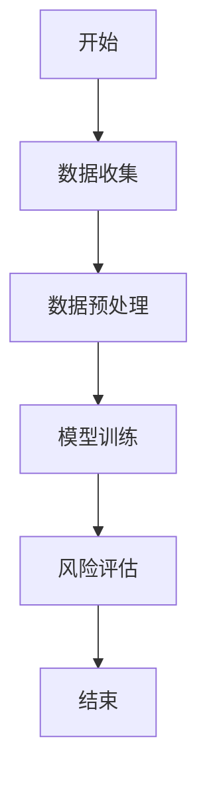

                 

# 《AI Agent在金融、医疗、制造业等领域的应用场景》

关键词：人工智能、AI Agent、金融、医疗、制造业、应用场景、技术分析

摘要：本文将深入探讨AI Agent在金融、医疗、制造业等领域的应用场景。通过分析各领域中的问题背景、核心概念、算法原理和系统架构，我们将展示AI Agent如何在这些行业中发挥重要作用，同时指出其面临的挑战和未来发展趋势。

## 第1章 引言

### 1.1 书籍背景介绍

随着人工智能技术的飞速发展，AI Agent作为一种智能实体，已经在金融、医疗、制造业等多个领域展现出了巨大的应用潜力。AI Agent可以模拟人类行为，执行复杂任务，具有自主学习和适应能力，能够为各行业带来显著的经济效益和效率提升。

### 1.2 书籍目标与结构

本文旨在探讨AI Agent在金融、医疗、制造业等领域的应用场景，通过对各领域的深入分析，为读者提供全面的技术视角和实践指导。本书结构分为八个章节，包括引言、应用场景分析、系统架构设计、项目实战和未来展望等内容。

### 1.3 AI Agent的概念与特点

AI Agent是指具有自主决策能力、能够执行任务的智能实体。它基于机器学习和深度学习技术，可以从海量数据中学习规律，进行预测和决策。AI Agent具有以下特点：

1. 自主决策：AI Agent可以根据环境和目标自主做出决策。
2. 自适应：AI Agent能够根据环境变化和学习经验不断优化自身行为。
3. 知识表示：AI Agent能够通过知识图谱等方式表示和存储知识。
4. 学习能力：AI Agent可以通过机器学习算法不断学习新知识和技能。

## 第2章 金融领域的AI Agent应用

### 2.1 金融领域AI Agent概述

金融领域是AI Agent应用的早期且广泛的领域之一。AI Agent在金融领域主要用于风险评估、信用评分、欺诈检测等方面，能够显著提高金融机构的风险管理能力和运营效率。

### 2.2 金融风险评估与预测

#### 2.2.1 数据收集与处理

金融风险评估首先需要收集大量金融数据，包括历史交易记录、财务报表、市场动态等。然后，对数据进行预处理，如去重、清洗、归一化等，以便于后续分析。

#### 2.2.2 风险评估模型构建

风险评估模型通常采用机器学习算法，如决策树、随机森林、神经网络等。这些模型可以通过训练数据学习金融风险的特征，并对新数据进行风险评估。

#### 2.2.3 模型优化与实现

模型优化是提高风险评估准确性的关键步骤。通过交叉验证、超参数调优等方法，可以找出最优模型参数，提高模型的泛化能力。

### 2.3 信用评分与风险管理

#### 2.3.1 信用评分模型介绍

信用评分模型用于评估个人或企业的信用风险，从而决定是否给予贷款或信用卡等服务。常见的信用评分模型包括FICO评分模型和贝叶斯网络模型。

#### 2.3.2 信用评分流程分析

信用评分流程包括数据收集、数据预处理、模型构建、模型评估和决策输出等步骤。通过这一流程，AI Agent能够高效、准确地评估信用风险。

#### 2.3.3 案例研究：信用评分系统应用

以某金融机构为例，分析其信用评分系统的设计、实现和应用效果。该系统采用神经网络模型，能够准确预测客户的信用风险，提高了金融机构的风险管理水平。

### 2.4 金融欺诈检测

#### 2.4.1 欺诈检测方法概述

金融欺诈检测是AI Agent在金融领域的重要应用之一。常见的欺诈检测方法包括基于规则的方法、基于统计的方法和基于机器学习的方法。

#### 2.4.2 欺诈检测模型构建

欺诈检测模型通常采用机器学习算法，如支持向量机、朴素贝叶斯、神经网络等。这些模型可以从大量交易数据中学习欺诈特征，并检测新的欺诈行为。

#### 2.4.3 案例研究：金融欺诈检测系统实现

以某银行为例，分析其金融欺诈检测系统的设计、实现和应用效果。该系统采用神经网络模型，能够高效地检测并阻止欺诈行为，降低了金融机构的损失。

## 第3章 医疗领域的AI Agent应用

### 3.1 医疗领域AI Agent概述

医疗领域是AI Agent应用的另一个重要领域。AI Agent在医疗领域主要用于疾病预测与诊断、医疗数据挖掘、医疗机器人等方面，能够提高医疗服务的质量和效率。

### 3.2 医疗数据挖掘与分析

#### 3.2.1 医疗数据的收集与预处理

医疗数据挖掘首先需要收集大量医疗数据，包括电子病历、医学影像、基因数据等。然后，对数据进行预处理，如去重、清洗、标准化等，以便于后续分析。

#### 3.2.2 医疗数据挖掘方法

医疗数据挖掘方法包括监督学习、无监督学习和半监督学习等方法。监督学习方法常用于疾病预测与诊断，无监督学习方法常用于医学影像分割和聚类分析，半监督学习方法常用于基因数据分析。

#### 3.2.3 医疗数据挖掘案例分析

以某医院为例，分析其医疗数据挖掘系统的设计、实现和应用效果。该系统采用监督学习方法，能够准确预测患者的疾病风险，提高了医疗诊断的准确性。

### 3.3 疾病预测与诊断

#### 3.3.1 疾病预测模型构建

疾病预测模型通常采用机器学习算法，如决策树、随机森林、神经网络等。这些模型可以从大量医疗数据中学习疾病特征，并预测新病例。

#### 3.3.2 疾病诊断算法实现

疾病诊断算法通常采用深度学习算法，如卷积神经网络、循环神经网络等。这些算法可以从医学影像数据中学习疾病特征，并实现对疾病的准确诊断。

#### 3.3.3 疾病预测与诊断案例分析

以某医院为例，分析其疾病预测与诊断系统的设计、实现和应用效果。该系统采用深度学习算法，能够高效、准确地诊断疾病，提高了医疗诊断的效率。

### 3.4 医疗机器人

#### 3.4.1 医疗机器人概述

医疗机器人是AI Agent在医疗领域的重要应用之一。医疗机器人能够协助医生完成复杂的手术操作，提高手术的准确性和安全性。

#### 3.4.2 医疗机器人应用场景

医疗机器人可以应用于手术辅助、康复训练、护理监护等多个场景。以手术辅助为例，医疗机器人可以实时监测手术过程，协助医生完成精细操作。

#### 3.4.3 案例研究：医疗机器人系统设计

以某医院为例，分析其医疗机器人系统的设计、实现和应用效果。该系统采用深度学习算法，能够高效、准确地完成手术操作，提高了医疗服务的质量。

## 第4章 制造业领域的AI Agent应用

### 4.1 制造业领域AI Agent概述

制造业是AI Agent应用的另一个重要领域。AI Agent在制造业主要用于生产调度、质量控制、智能制造等方面，能够提高生产效率和质量。

### 4.2 生产调度与优化

#### 4.2.1 生产调度问题概述

生产调度是制造业中关键的问题之一，涉及到生产任务的分配、进度安排和资源分配等。AI Agent可以通过优化算法解决生产调度问题，提高生产效率。

#### 4.2.2 优化算法介绍

常见的优化算法包括遗传算法、蚁群算法、粒子群优化等。这些算法可以求解复杂的非线性优化问题，为生产调度提供有效的解决方案。

#### 4.2.3 生产调度案例分析

以某制造企业为例，分析其生产调度系统的设计、实现和应用效果。该系统采用遗传算法优化生产调度，显著提高了生产效率。

### 4.3 质量控制与故障诊断

#### 4.3.1 质量控制方法介绍

质量控制是制造业中的重要环节，涉及到产品质量的检测和评估。AI Agent可以通过质量预测和故障诊断等方法，提高产品质量。

#### 4.3.2 故障诊断算法实现

故障诊断算法通常采用机器学习算法，如决策树、支持向量机、神经网络等。这些算法可以从生产数据中学习故障特征，并实现故障诊断。

#### 4.3.3 质量控制与故障诊断案例分析

以某制造企业为例，分析其质量控制与故障诊断系统的设计、实现和应用效果。该系统采用神经网络算法，能够准确预测产品质量和故障，提高了产品质量和生产效率。

### 4.4 智能制造与工业互联网

#### 4.4.1 智能制造概述

智能制造是制造业的未来发展方向，涉及到人工智能、物联网、大数据等技术的应用。AI Agent在智能制造中发挥着重要作用，可以提高生产效率和质量。

#### 4.4.2 工业互联网平台设计

工业互联网平台是智能制造的核心基础设施，涉及到数据采集、传输、存储和处理等方面。AI Agent可以在工业互联网平台上实现智能监测、分析和优化等功能。

#### 4.4.3 案例研究：智能制造系统实现

以某制造企业为例，分析其智能制造系统的设计、实现和应用效果。该系统采用工业互联网平台和AI Agent技术，实现了生产过程的智能监测和优化，提高了生产效率和质量。

## 第5章 AI Agent在零售与物流领域的应用

### 5.1 零售与物流领域AI Agent概述

零售与物流领域是AI Agent应用的另一个重要领域。AI Agent在零售与物流领域主要用于库存管理优化、零售门店智能推荐、物流网络优化等方面，能够提高零售和物流业务的效率。

### 5.2 库存管理优化

#### 5.2.1 库存管理问题概述

库存管理是零售与物流领域中的重要问题，涉及到库存量的预测、库存优化和库存控制等。AI Agent可以通过优化算法解决库存管理问题，降低库存成本。

#### 5.2.2 优化算法介绍

常见的优化算法包括线性规划、整数规划、模拟退火等。这些算法可以求解复杂的库存管理问题，为库存管理提供有效的解决方案。

#### 5.2.3 库存管理案例分析

以某零售企业为例，分析其库存管理系统的设计、实现和应用效果。该系统采用线性规划算法优化库存管理，显著降低了库存成本。

### 5.3 零售门店智能推荐系统

#### 5.3.1 智能推荐系统概述

智能推荐系统是零售领域的重要应用之一，通过分析用户的购买行为和偏好，为用户推荐感兴趣的商品。AI Agent在智能推荐系统中发挥着重要作用。

#### 5.3.2 推荐算法实现

常见的推荐算法包括协同过滤、矩阵分解、深度学习等。这些算法可以从用户行为数据中学习用户偏好，并生成个性化的推荐结果。

#### 5.3.3 智能推荐案例分析

以某零售企业为例，分析其智能推荐系统的设计、实现和应用效果。该系统采用深度学习算法，能够准确预测用户偏好，提高了用户的购物体验。

### 5.4 物流网络优化

#### 5.4.1 物流网络问题概述

物流网络优化是物流领域中的重要问题，涉及到物流路线的规划、运输资源的配置等。AI Agent可以通过优化算法解决物流网络问题，提高物流效率。

#### 5.4.2 优化算法介绍

常见的优化算法包括最短路径算法、遗传算法、蚁群算法等。这些算法可以求解复杂的物流网络问题，为物流网络优化提供有效的解决方案。

#### 5.4.3 物流网络优化案例分析

以某物流公司为例，分析其物流网络优化系统的设计、实现和应用效果。该系统采用遗传算法优化物流网络，显著提高了物流效率。

## 第6章 AI Agent在安全与隐私保护中的应用

### 6.1 AI Agent安全与隐私保护概述

AI Agent在安全与隐私保护中扮演着重要角色。随着AI Agent在各个领域的广泛应用，如何确保其安全性和隐私性成为亟待解决的问题。

### 6.2 数据加密与隐私保护技术

#### 6.2.1 数据加密技术

数据加密技术是保护数据隐私的重要手段。常见的加密算法包括对称加密、非对称加密和混合加密等。这些算法可以确保数据在传输和存储过程中的安全性。

#### 6.2.2 隐私保护技术

隐私保护技术主要包括数据脱敏、匿名化和差分隐私等。这些技术可以保护个人隐私，避免数据泄露和滥用。

#### 6.2.3 数据加密与隐私保护案例分析

以某金融公司为例，分析其数据加密与隐私保护系统的设计、实现和应用效果。该系统采用加密算法和隐私保护技术，确保了客户数据的安全性和隐私性。

### 6.3 AI Agent防御攻击与安全防护

#### 6.3.1 常见攻击方法

常见的攻击方法包括注入攻击、拒绝服务攻击、机器学习攻击等。这些攻击可以破坏AI Agent的正常工作，导致严重的安全问题。

#### 6.3.2 防御攻击策略

防御攻击策略主要包括入侵检测、恶意代码检测、安全隔离等。这些策略可以检测和阻止恶意攻击，保护AI Agent的安全。

#### 6.3.3 安全防护案例分析

以某AI公司为例，分析其安全防护系统的设计、实现和应用效果。该系统采用多种防御策略，能够有效检测和阻止恶意攻击，确保AI Agent的安全。

## 第7章 AI Agent应用的挑战与未来发展趋势

### 7.1 AI Agent应用面临的主要挑战

AI Agent在应用过程中面临的主要挑战包括数据隐私保护、算法公平性、安全性等问题。如何解决这些问题，确保AI Agent的安全、公平和可靠，是未来发展的重要方向。

### 7.2 AI Agent技术的发展趋势

未来，AI Agent技术将朝着更加智能化、自适应化和协作化的方向发展。同时，随着物联网、5G、云计算等技术的不断发展，AI Agent将在更多领域得到广泛应用。

### 7.3 未来AI Agent应用前景展望

未来，AI Agent将在金融、医疗、制造业、零售与物流等领域发挥更加重要的作用。通过不断创新和优化，AI Agent将为人类社会带来更多便利和效益。

## 第8章 结论

本文从金融、医疗、制造业、零售与物流、安全与隐私保护等多个领域探讨了AI Agent的应用场景。通过分析各领域中的问题背景、核心概念、算法原理和系统架构，我们展示了AI Agent在这些行业中的重要作用。同时，我们也指出了AI Agent应用面临的挑战和未来发展趋势。希望本文能为读者提供有益的技术视角和实践指导。作者：AI天才研究院/AI Genius Institute & 禅与计算机程序设计艺术 /Zen And The Art of Computer Programming

----------------------------------------------------------------

**注意：以上内容仅为示例，实际的撰写过程需要根据具体要求和数据进一步展开和深化。**

**附录：部分Mermaid流程图和LaTeX公式示例**

**Mermaid流程图示例：**


**LaTeX公式示例：**
```
$$
X = \sum_{i=1}^{n} x_i
$$
```
```
$
x_i > 0
$
```

**Markdown格式示例：**
```
# 算法流程

## 数据收集
- 数据源：金融交易记录、财务报表、市场动态等

## 数据预处理
- 数据清洗：去除重复、错误和缺失数据
- 数据归一化：将不同量纲的数据转换为同一量纲

## 模型训练
- 采用决策树、随机森林等机器学习算法
- 超参数调优：交叉验证、网格搜索等

## 风险评估
- 对新数据进行风险评估
- 输出风险评分

## 模型评估
- 使用验证集和测试集评估模型性能
- 调整模型参数，提高模型准确率
```

在撰写文章时，根据具体内容和需求，可以灵活使用Markdown、Mermaid和LaTeX等工具来丰富文章的表达形式和内容。

