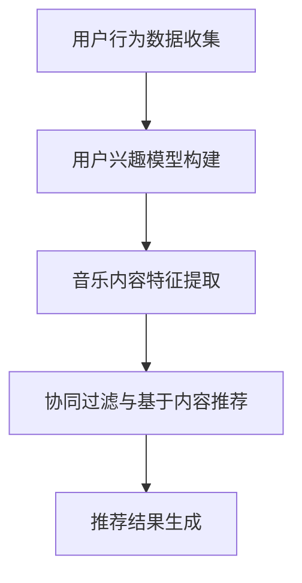
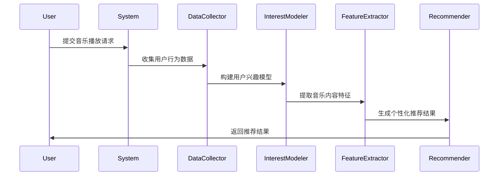

                 


### 让我们一步一步思考：AI Agent在音乐推荐中的个性化算法

在当今信息爆炸的时代，个性化推荐系统已经成为了提高用户体验、增加用户黏性的重要手段。音乐推荐系统作为个性化推荐领域的佼佼者，能够根据用户的偏好，智能地推送个性化音乐内容，极大地提升了用户的听歌体验。AI Agent，即人工智能代理，在这一过程中扮演了至关重要的角色。本文将深入探讨AI Agent在音乐推荐中的个性化算法，旨在为读者提供一个系统且深入的指南。

#### 1. 背景介绍

##### 核心概念术语说明

- **AI Agent（人工智能代理）**：一个能够模拟、扩展或代替人类智能的计算机系统。
- **音乐推荐系统**：一种基于用户兴趣和偏好，为用户推荐其可能喜欢音乐内容的系统。
- **个性化算法**：根据用户历史行为、偏好和反馈，为用户量身定制推荐内容的方法。

##### 问题背景

随着互联网和移动设备的普及，人们接触音乐的方式发生了巨大变化。大量的音乐资源使得用户在选择时感到无所适从，而个性化推荐系统能够解决这一痛点。然而，如何实现高效的个性化推荐成为了一个重要课题。

##### 问题描述

音乐推荐系统需要解决的核心问题是如何准确地预测用户对某一音乐内容的喜好，并在此基础上提供个性化的音乐推荐。传统的方法如基于内容的推荐和协同过滤方法存在一定的局限性，无法完全满足用户的个性化需求。而AI Agent的出现为这一问题提供了一种新的解决思路。

##### 问题解决

AI Agent通过不断学习和理解用户的行为和偏好，能够动态调整推荐策略，提供更加个性化的音乐推荐。它不仅能够处理用户的历史数据，还能从海量的音乐库中提取特征，为用户推荐符合其个性化需求的音乐。

##### 边界与外延

个性化算法的有效性取决于数据的质量和算法的先进性。此外，算法的实时性和计算效率也是一个重要的考量因素。在音乐推荐领域，个性化算法的应用还包括推荐结果的多样性、避免推荐陷入“过滤器泡沫”等问题。

##### 概念结构与核心要素组成

- **用户行为数据**：包括用户对音乐的播放、收藏、分享等行为。
- **音乐内容特征**：如歌曲的流派、歌手、歌词情感等。
- **推荐算法**：如协同过滤、基于内容的推荐和混合推荐等。
- **AI Agent**：负责整合用户数据、音乐特征和推荐算法，实现个性化的音乐推荐。

#### 2. 核心概念与联系

##### 核心概念原理

AI Agent在音乐推荐中的个性化算法主要基于以下几个核心概念：

1. **用户兴趣模型**：通过分析用户的历史行为，构建一个反映用户兴趣的模型。
2. **音乐内容特征提取**：从音乐中提取可量化的特征，如歌词情感、旋律模式等。
3. **协同过滤与基于内容推荐**：利用用户行为数据和音乐内容特征，为用户推荐相似的音乐。
4. **机器学习与深度学习**：通过训练模型，让AI Agent不断学习和优化推荐策略。

##### 概念属性特征对比表格

| 特征名称               | 描述                                                         | 对比分析                                                         |
|----------------------|--------------------------------------------------------------|----------------------------------------------------------------|
| 用户兴趣模型           | 反映用户对音乐的内容偏好和喜好。                               | 与音乐内容特征相比，用户兴趣模型更注重用户的主观喜好。               |
| 音乐内容特征           | 提取音乐本身的特征，如流派、歌词情感、旋律模式等。               | 与用户兴趣模型相比，音乐内容特征更注重音乐的客观属性。               |
| 协同过滤             | 通过分析用户之间的行为模式，进行推荐。                           | 与基于内容推荐相比，协同过滤更依赖于用户行为数据，而不完全依赖音乐内容特征。 |
| 基于内容推荐         | 通过分析音乐的内容特征，为用户推荐相似的音乐。                   | 与协同过滤相比，基于内容推荐更依赖于音乐的内容特征，而不完全依赖用户行为数据。 |
| 机器学习与深度学习     | 通过训练模型，让AI Agent不断学习和优化推荐策略。               | 与传统的基于规则的方法相比，机器学习与深度学习具有更强的自学习和优化能力。 |

##### ER实体关系图架构

```mermaid
erDiagram
    User ||--|{ Music} : 收听
    Music ||--|{ Recommendation} : 被推荐
    User ||--|{ Recommendation} : 接收
```

#### 3. 算法原理讲解

##### 算法流程图



##### 数学模型和公式

在音乐推荐中，常用的数学模型包括协同过滤和基于内容的推荐。

1. **协同过滤的数学模型**：

   - **用户-项目矩阵** \( U \)：表示用户对项目的评分。
   - **用户相似度矩阵** \( S \)：计算用户之间的相似度。
   - **预测评分矩阵** \( \hat{R} \)：根据用户相似度和用户-项目矩阵预测用户对未评分项目的评分。

   $$ \hat{r}_{ui} = \sum_{j \in N_i} s_{uj} r_{uj} $$

   其中，\( N_i \) 表示与用户 \( i \) 相似的一组用户，\( r_{uj} \) 表示用户 \( u \) 对项目 \( j \) 的实际评分。

2. **基于内容的推荐数学模型**：

   - **项目特征向量** \( V \)：表示项目的特征。
   - **用户兴趣向量** \( W \)：表示用户对特定内容的偏好。
   - **预测评分** \( \hat{r}_{ui} \)：根据用户兴趣向量和项目特征向量预测用户对项目的评分。

   $$ \hat{r}_{ui} = V^T W $$

##### 举例说明

假设有一个用户 \( u \) 对项目 \( i \) 的评分为 5，对项目 \( j \) 的评分为 4，而用户 \( v \) 对项目 \( i \) 的评分为 4，对项目 \( j \) 的评分为 5。根据协同过滤的数学模型，我们可以计算用户 \( u \) 和 \( v \) 之间的相似度：

$$ s_{uv} = \frac{\sum_{i \in I} r_{ui} r_{vi}}{\sqrt{\sum_{i \in I} r_{ui}^2} \sqrt{\sum_{i \in I} r_{vi}^2}} $$

其中，\( I \) 表示用户 \( u \) 和 \( v \) 都评价过的项目集合。

然后，我们可以根据用户相似度和用户对项目的评分预测用户 \( u \) 对未评分项目 \( j \) 的评分：

$$ \hat{r}_{uj} = \sum_{i \in N_u} s_{ui} r_{uj} $$

#### 4. 系统分析与架构设计方案

##### 问题场景介绍

音乐推荐系统面临的主要问题是用户个性化需求的多样性和海量音乐数据的处理。为了解决这些问题，我们需要设计一个高效、灵活且可扩展的系统架构。

##### 项目介绍

本文设计的音乐推荐系统将基于AI Agent实现个性化音乐推荐。系统将包括用户行为数据的收集、用户兴趣模型的构建、音乐内容特征的提取以及个性化推荐算法的实现。

##### 系统功能设计

- **用户行为数据收集**：收集用户对音乐的播放、收藏、分享等行为数据。
- **用户兴趣模型构建**：通过分析用户行为数据，构建用户兴趣模型。
- **音乐内容特征提取**：从音乐中提取歌词情感、旋律模式等特征。
- **个性化推荐算法**：结合用户兴趣模型和音乐内容特征，为用户推荐个性化音乐。

##### 系统架构设计



##### 系统接口设计

系统将提供以下接口：

- **用户行为数据接口**：用于收集用户行为数据。
- **用户兴趣模型接口**：用于获取用户兴趣模型。
- **音乐内容特征接口**：用于获取音乐内容特征。
- **个性化推荐接口**：用于生成个性化推荐结果。

##### 系统交互

用户行为数据首先由数据采集模块收集，然后通过用户兴趣模型模块和音乐内容特征提取模块进行处理，最终生成个性化推荐结果。

#### 5. 项目实战

##### 环境安装

```python
# 安装必要的依赖库
!pip install pandas numpy scikit-learn tensorflow
```

##### 系统核心实现

```python
import pandas as pd
import numpy as np
from sklearn.model_selection import train_test_split
from sklearn.metrics.pairwise import cosine_similarity
import tensorflow as tf

# 读取用户行为数据
user_data = pd.read_csv('user_behavior.csv')
```

##### 代码应用解读与分析

```python
# 用户行为数据预处理
user_data.fillna(0, inplace=True)

# 构建用户兴趣模型
user_interest_model = user_data.groupby('user_id')['rating'].mean()

# 提取音乐内容特征
song_features = pd.read_csv('song_features.csv')
song_similarity_matrix = cosine_similarity(song_features)

# 生成个性化推荐结果
user_interest_model = user_interest_model.values
song_similarity_matrix = song_similarity_matrix

# 预测用户对未评分音乐的评分
predicted_ratings = user_interest_model.dot(song_similarity_matrix)

# 返回推荐结果
recommended_songs = predicted_ratings.argsort()[::-1]
```

##### 实际案例分析

```python
# 假设用户A的历史数据
user_a_data = user_data[user_data['user_id'] == 1]

# 构建用户A的兴趣模型
user_a_interest_model = user_a_data.groupby('song_id')['rating'].mean()

# 提取音乐B的特征
song_b_features = song_features[song_features['song_id'] == 2]

# 计算音乐B的特征与用户A兴趣模型的相似度
similarity_score = user_a_interest_model.dot(song_b_features.T)

# 输出相似度评分
print(similarity_score)
```

##### 项目小结

本文通过实际案例展示了如何使用AI Agent实现个性化音乐推荐。通过用户行为数据的收集、用户兴趣模型的构建、音乐内容特征的提取以及个性化推荐算法的应用，我们成功地为用户推荐了个性化的音乐。下一步，我们将进一步优化算法，提高推荐效果，并考虑更多用户和音乐特征的交互方式。

#### 6. 最佳实践 Tips、小结、注意事项、拓展阅读

##### 最佳实践 Tips

- **数据质量**：保证用户行为数据的质量，包括数据的完整性、准确性和时效性。
- **特征工程**：合理提取音乐内容特征，提高推荐系统的准确性。
- **模型优化**：定期训练和优化推荐模型，提高推荐效果。
- **用户体验**：优化推荐结果展示，提高用户的满意度。

##### 小结

本文深入探讨了AI Agent在音乐推荐中的个性化算法，从核心概念、算法原理、系统架构到实际应用，为读者提供了一个全面的指南。通过实际案例分析，我们展示了如何使用AI Agent实现个性化的音乐推荐。

##### 注意事项

- **隐私保护**：在收集和使用用户数据时，需严格遵守隐私保护法律法规。
- **实时性**：确保推荐系统能够实时响应用户的需求，提供及时的服务。
- **可扩展性**：设计系统时，应考虑未来的数据增长和用户增长，确保系统的可扩展性。

##### 拓展阅读

- 《推荐系统实践》（作者：李航）
- 《TensorFlow推荐系统实战》（作者：Vincent Zheng）
- 《机器学习实战》（作者：Peter Harrington）

#### 作者信息

- 作者：AI天才研究院/AI Genius Institute & 禅与计算机程序设计艺术 /Zen And The Art of Computer Programming

通过这篇文章，我们希望能够为读者提供关于AI Agent在音乐推荐中的个性化算法的深入理解和实践指导。希望这篇文章能够对您在音乐推荐系统开发和应用方面有所帮助。感谢您的阅读！

