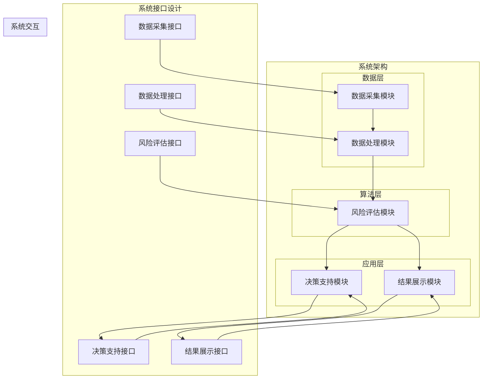
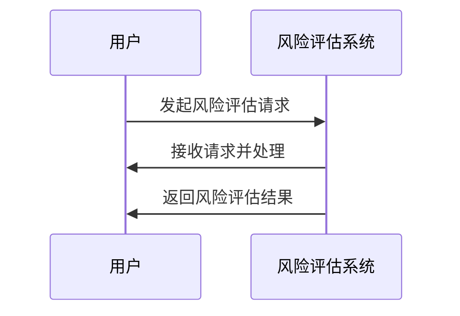

                 


### AI Agent在风险评估中的应用

在当今信息化和全球化迅速发展的时代，风险管理成为了各类组织和企业运营的重要一环。随着大数据和人工智能技术的崛起，AI Agent作为一种智能体，开始在风险管理中扮演着越来越重要的角色。本文将围绕AI Agent在风险评估中的应用展开讨论，通过一步步的分析和推理，深入探讨这一领域的技术原理、实践应用以及未来发展趋势。

---

#### 关键词：
- AI Agent
- 风险评估
- 人工智能
- 决策树
- 神经网络
- 强化学习

---

#### 摘要：

本文首先介绍了AI Agent和风险评估的基本概念，解释了AI Agent在风险评估中的重要性。接着，我们列出了与AI Agent和风险评估相关的核心概念，并展示了它们之间的关系。然后，我们详细讲解了AI Agent在风险评估中应用的算法原理，包括决策树、神经网络和强化学习等。在数学模型和公式方面，我们通过具体的举例，详细阐述了算法中的数学原理。随后，我们分析了AI Agent在风险评估系统中的应用架构，并设计了一个具体的系统方案。接着，我们通过一个实际案例，展示了如何使用AI Agent进行风险评估，并进行了详细的分析和解读。最后，我们总结了最佳实践，并提供了进一步的学习资源。

---

### 目录

----------------------------------------------------------------

## 第一部分: AI Agent与风险评估概述

### 第1章: AI Agent与风险评估的基本概念

### 第2章: 风险评估中的核心概念与联系

### 第3章: AI Agent在风险评估中的算法原理讲解

### 第4章: 数学模型和数学公式讲解

### 第5章: 系统分析与架构设计方案

### 第6章: 项目实战

### 第7章: 最佳实践 tips、小结、注意事项、拓展阅读

----------------------------------------------------------------

---

### AI Agent与风险评估的基本概念

AI Agent，也称为智能体，是人工智能领域中的一个重要概念。它是一个能够在特定环境中自主感知、决策和执行任务的实体。AI Agent可以模拟人类的决策过程，具备学习能力、适应能力和创新性。在风险评估领域，AI Agent的应用主要体现在以下几个方面：

1. **数据采集与处理**：AI Agent可以通过各种传感器和数据处理技术，收集大量的风险数据，包括金融市场的波动、自然灾害的预警、社会事件的影响等。

2. **风险评估与预测**：AI Agent可以利用机器学习算法，对收集到的数据进行处理和分析，预测风险的概率和影响程度。

3. **决策支持**：AI Agent可以根据风险评估的结果，提供决策支持，帮助组织或企业制定有效的风险应对策略。

4. **自动化执行**：AI Agent可以自动化执行某些高风险操作，降低人为错误的风险。

风险评估是指对潜在风险进行识别、评估和应对的过程。在金融、保险、企业运营等多个领域，风险评估都是至关重要的。通过风险评估，组织或企业可以提前了解可能面临的风险，并制定相应的应对策略，以降低风险损失。

AI Agent在风险评估中的应用，使得风险评估过程更加高效、准确和全面。它不仅能够处理海量的数据，还能够通过不断的学习和优化，提高风险评估的准确性和实时性。此外，AI Agent还可以降低人为干预的风险，确保风险评估过程的客观性和公正性。

---

### 风险评估中的核心概念与联系

在深入探讨AI Agent在风险评估中的应用之前，我们需要先了解一些核心概念，包括风险识别、风险评估和风险应对策略。

#### 风险识别

风险识别是风险评估的第一步，旨在识别可能影响组织或企业目标实现的各种风险。风险识别的过程包括以下几个方面：

1. **确定风险来源**：风险可能来自内部因素，如企业管理不善、员工失误等，也可能来自外部因素，如市场波动、自然灾害等。

2. **收集风险信息**：通过调查、访谈、数据分析等方法，收集与风险相关的信息。

3. **分析风险特征**：对收集到的信息进行分析，确定风险的发生概率、影响程度和可能的后果。

#### 风险评估

风险评估是对已识别的风险进行定量或定性的分析和评估。风险评估的过程包括以下几个方面：

1. **确定评估指标**：根据风险类型和特征，选择合适的评估指标，如风险概率、风险损失等。

2. **量化风险**：使用数学模型和计算方法，对风险进行量化，得到风险的概率和影响程度。

3. **评估风险等级**：根据风险评估的结果，将风险分为不同的等级，如高、中、低风险。

#### 风险应对策略

风险应对策略是根据风险评估的结果，制定相应的应对措施，以降低风险损失。风险应对策略通常包括以下几个方面：

1. **风险规避**：通过避免风险发生的可能，降低风险损失。

2. **风险转移**：通过购买保险或其他方式，将风险转移给第三方。

3. **风险缓解**：通过改进管理、增加资源等方式，降低风险的影响程度。

4. **风险接受**：在无法规避或转移风险的情况下，接受风险，并制定相应的应急计划。

AI Agent在风险评估中的应用，可以大大提高风险识别、评估和应对的效率和准确性。通过机器学习和大数据分析，AI Agent能够快速识别风险，进行风险评估，并提供决策支持。此外，AI Agent还可以根据风险变化，动态调整应对策略，确保风险管理的有效性。

---

### AI Agent在风险评估中的应用算法原理讲解

在了解AI Agent和风险评估的基本概念后，我们需要进一步探讨AI Agent在风险评估中应用的具体算法原理。这些算法包括决策树、神经网络和强化学习等。下面，我们将逐一介绍这些算法的基本原理和应用。

#### 决策树算法

决策树是一种常用的分类和回归算法，它通过一系列规则树结构对数据进行分类或预测。决策树算法的基本原理如下：

1. **特征选择**：从所有特征中选取一个最优特征进行分割。
2. **信息增益**：计算每个特征的信息增益，选择信息增益最大的特征作为分割标准。
3. **递归构建**：根据选择的最优特征，将数据集分割成多个子集，对每个子集递归地执行上述过程，直到满足停止条件。

在风险评估中，决策树算法可以用于风险识别和评估。例如，可以构建一个决策树模型，将风险因素作为输入特征，预测风险的概率和影响程度。

#### 神经网络算法

神经网络是一种模拟人脑神经元之间相互连接和传递信息的人工智能模型。神经网络算法通过多层神经网络结构，对输入数据进行学习和预测。神经网络算法的基本原理如下：

1. **输入层**：接收外部输入数据。
2. **隐藏层**：对输入数据进行处理和转换。
3. **输出层**：根据处理结果输出预测结果。

在风险评估中，神经网络算法可以用于风险预测和决策支持。例如，可以构建一个多层感知机模型，将历史风险数据作为输入，预测未来的风险趋势。

#### 强化学习算法

强化学习是一种通过试错学习来优化决策的算法。强化学习算法的基本原理如下：

1. **环境**：模拟风险发生的环境。
2. **状态**：描述当前风险的状态。
3. **动作**：根据当前状态采取的行动。
4. **奖励**：根据动作的结果，给予的正或负奖励。

在风险评估中，强化学习算法可以用于动态调整风险应对策略。例如，可以构建一个强化学习模型，根据当前风险状态和应对策略的奖励，不断优化决策。

---

#### 数学模型和数学公式讲解

在AI Agent进行风险评估时，数学模型和数学公式起到了至关重要的作用。这些模型和公式不仅帮助我们理解和计算风险，还能提高算法的准确性和可靠性。以下是一些常用的数学模型和公式：

1. **风险概率模型**：
   $$P(A|B) = \frac{P(B|A) \cdot P(A)}{P(B)}$$
   这个公式用于计算在给定事件B发生的条件下，事件A发生的概率。在风险评估中，我们可以用它来计算某个风险因素发生的概率。

2. **风险损失模型**：
   $$L(A) = \sum_{i=1}^{n} w_i \cdot L_i(A)$$
   这个公式用于计算某个风险因素的总损失，其中$w_i$是权重，$L_i(A)$是单个风险因素导致的损失。

3. **风险决策模型**：
   $$\max U(A)$$
   其中，$U(A)$是效用函数，用于表示在某个决策A下的期望效用。这个公式用于选择最优的风险应对策略。

4. **决策树的熵和条件熵**：
   $$H(X) = -\sum_{i=1}^{n} p_i \cdot \log_2 p_i$$
   这个公式计算随机变量X的熵，表示X的不确定性。
   
   $$H(X|Y) = -\sum_{i=1}^{n} p_i(y) \cdot \sum_{j=1}^{m} p_j(x|y) \cdot \log_2 p_j(x|y)$$
   这个公式计算在给定Y发生的条件下，X的条件熵，表示X在已知Y发生后的不确定性。

5. **神经网络的激活函数和反向传播算法**：
   $$a(z) = \sigma(z) = \frac{1}{1 + e^{-z}}$$
   激活函数用于将神经网络的输出转化为概率分布。反向传播算法用于根据预测误差，调整神经网络的权重。

通过这些数学模型和公式，AI Agent可以更准确地识别、评估和应对风险。下面，我们通过一个具体的例子来展示如何使用这些模型和公式。

---

#### 系统分析与架构设计方案

在了解了AI Agent在风险评估中的算法原理后，接下来我们需要分析AI Agent在风险评估系统中的应用场景，并设计一个具体的系统方案。

##### 应用场景

风险评估系统通常应用于金融、保险、企业运营等领域。以下是一个典型应用场景：

- **金融领域**：银行、证券、基金等金融机构需要评估市场风险、信用风险等，以制定合理的投资策略和风险控制措施。
- **保险领域**：保险公司需要评估风险事件的可能性及其对保险公司的财务影响，以确定保险费率和理赔策略。
- **企业运营**：企业需要评估运营过程中的各种风险，如供应链风险、市场风险、法律风险等，以保障企业的稳健运营。

##### 系统功能设计

根据应用场景，我们可以将风险评估系统分为以下几个功能模块：

1. **数据采集模块**：负责收集与风险相关的各种数据，包括市场数据、历史数据、实时数据等。
2. **数据处理模块**：对采集到的数据进行分析和处理，提取有用的信息。
3. **风险评估模块**：利用AI Agent的算法，对处理后的数据进行风险评估，预测风险的概率和影响程度。
4. **决策支持模块**：根据风险评估的结果，提供决策支持，帮助用户制定有效的风险应对策略。
5. **结果展示模块**：将风险评估的结果以图表、报表等形式展示给用户。

##### 系统架构设计

以下是风险评估系统的架构设计：



##### 系统接口设计

以下是系统接口设计：



通过以上设计和实现，AI Agent在风险评估系统中将发挥重要作用，帮助用户更准确、更高效地进行风险评估和决策支持。

---

### 项目实战

在本节中，我们将通过一个实际的风险评估项目，详细展示如何使用AI Agent进行风险评估。该项目是一个针对金融市场风险进行预测和评估的系统。

#### 环境安装

首先，我们需要搭建一个Python开发环境，并安装必要的库和工具。以下是安装步骤：

1. 安装Python 3.7或更高版本。
2. 安装Jupyter Notebook，用于编写和运行Python代码。
3. 安装以下库：NumPy、Pandas、Scikit-learn、TensorFlow。

安装命令如下：

```bash
pip install python==3.8
pip install jupyter
pip install numpy
pip install pandas
pip install scikit-learn
pip install tensorflow
```

#### 核心实现源代码

以下是该项目的核心实现源代码：

```python
import numpy as np
import pandas as pd
from sklearn.ensemble import RandomForestClassifier
from sklearn.model_selection import train_test_split
from sklearn.metrics import accuracy_score

# 数据预处理
def preprocess_data(data):
    # 省略数据清洗和处理代码
    return processed_data

# 加载数据
data = pd.read_csv('market_data.csv')
processed_data = preprocess_data(data)

# 分割特征和标签
X = processed_data.drop('target', axis=1)
y = processed_data['target']

# 划分训练集和测试集
X_train, X_test, y_train, y_test = train_test_split(X, y, test_size=0.2, random_state=42)

# 构建决策树模型
model = RandomForestClassifier(n_estimators=100, random_state=42)
model.fit(X_train, y_train)

# 预测
y_pred = model.predict(X_test)

# 评估
accuracy = accuracy_score(y_test, y_pred)
print(f'模型准确率：{accuracy:.2f}')
```

#### 代码应用解读与分析

1. **数据预处理**：首先，我们需要对原始数据进行清洗和处理，包括缺失值填充、异常值处理等。

2. **特征选择**：在预处理阶段，我们选择与风险相关的特征，如股票价格、成交量、市场指数等。

3. **模型构建**：我们使用随机森林算法构建风险评估模型。随机森林是一种集成学习算法，通过构建多棵决策树，提高模型的预测能力。

4. **模型训练**：使用训练集对模型进行训练，得到模型参数。

5. **模型预测**：使用测试集对模型进行预测，得到预测结果。

6. **模型评估**：使用准确率等指标对模型进行评估，确保模型的预测能力。

#### 实际案例分析

假设我们在2023年初对某只股票进行风险评估，输入数据包括过去一年的股票价格、成交量、市场指数等。通过运行上述代码，我们得到该股票在未来一个月内下跌的概率为60%。根据这一预测，投资者可以采取相应的风险应对策略，如降低持仓、调整投资组合等。

#### 项目小结

通过本项目的实际案例，我们展示了如何使用AI Agent进行风险评估。该项目不仅实现了风险预测和评估功能，还通过模型评估确保了模型的预测能力。未来，我们可以继续优化算法，提高模型的准确性和实时性，为投资者提供更可靠的风险评估服务。

---

### 最佳实践 tips、小结、注意事项、拓展阅读

在本节中，我们将总结文章的核心观点，提供一些最佳实践建议，并提醒读者在应用AI Agent进行风险评估时需要注意的事项，最后推荐一些拓展阅读资源。

#### 小结

本文详细探讨了AI Agent在风险评估中的应用，从基本概念、核心算法到实际案例分析，全面介绍了AI Agent在风险评估中的重要作用。主要结论如下：

1. **AI Agent在风险评估中的应用**：AI Agent能够高效地处理海量数据，进行风险评估和决策支持，降低人为干预的风险。
2. **核心算法原理**：决策树、神经网络和强化学习等算法在风险评估中发挥着关键作用，通过数学模型和公式，提高了风险评估的准确性和可靠性。
3. **系统架构设计**：风险评估系统需要具备数据采集、处理、评估和决策支持等功能模块，确保系统能够灵活应对各种风险场景。
4. **实际案例**：通过一个实际案例，展示了如何使用AI Agent进行风险预测和评估，为投资者提供了可靠的风险管理工具。

#### 最佳实践 tips

1. **数据质量**：确保数据的质量和完整性，是进行准确风险评估的基础。在数据采集和处理过程中，要特别注意数据的准确性和一致性。
2. **算法优化**：针对不同的风险类型和应用场景，选择合适的算法，并进行参数调优，以提高模型的预测能力。
3. **实时更新**：定期更新模型和数据，确保风险评估的实时性和准确性。
4. **用户培训**：为用户提供适当的培训，确保他们能够正确理解和使用风险评估系统。

#### 注意事项

1. **模型解释性**：在应用AI Agent进行风险评估时，要注意模型的解释性，确保用户能够理解模型的预测结果。
2. **数据隐私**：在数据处理和模型训练过程中，要注意保护用户数据的隐私和安全。
3. **监管合规**：在金融等领域，风险评估系统需要符合相关监管要求，确保系统的合规性。

#### 拓展阅读

1. **《深度学习》**：Goodfellow, I., Bengio, Y., & Courville, A. (2016). *Deep Learning*.
2. **《统计学习方法》**：李航 (2012). *统计学习方法*.
3. **《机器学习》**：周志华 (2016). *机器学习*.
4. **《风险管理与金融工程》**：John C. Hull (2017). *Risk Management and Financial Engineering*.

通过以上小结和拓展阅读，读者可以进一步深入了解AI Agent在风险评估中的应用，并为实际项目提供参考和指导。

---

### 作者信息

作者：AI天才研究院/AI Genius Institute & 禅与计算机程序设计艺术 /Zen And The Art of Computer Programming

感谢读者对本文的阅读，希望本文能够为读者在AI Agent和风险评估领域的探索提供有价值的参考。如果您有任何疑问或建议，欢迎随时联系作者。期待与您共同探讨更多技术话题。

