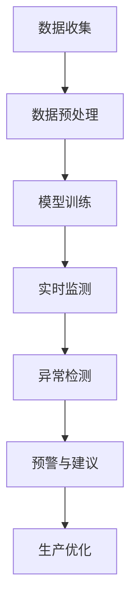
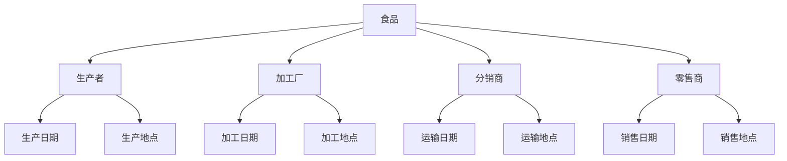
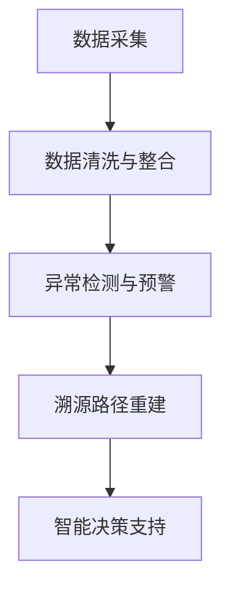
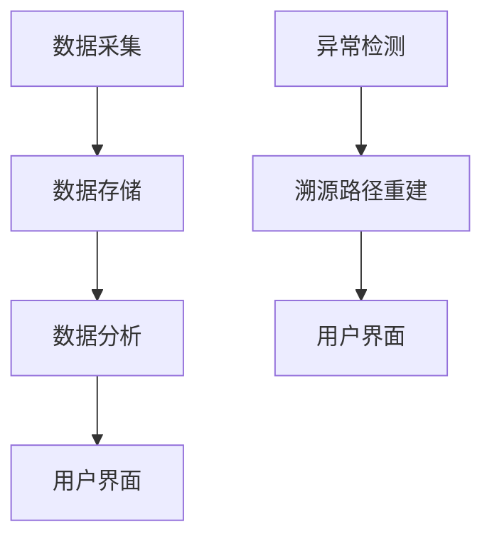
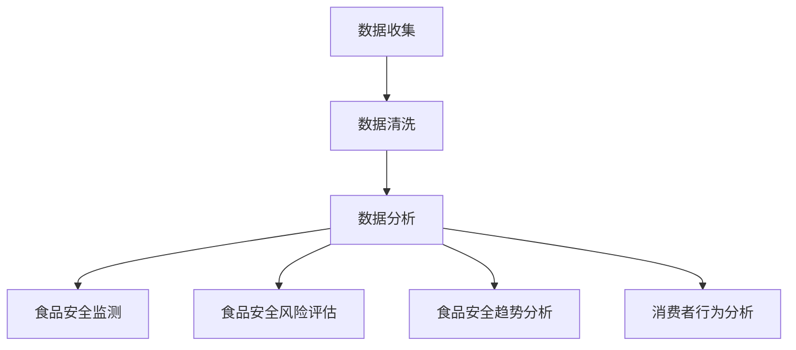
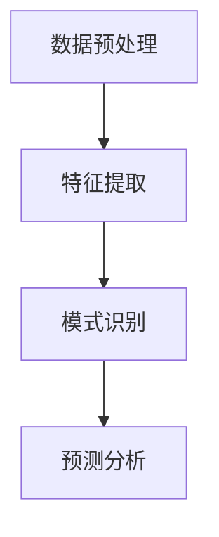
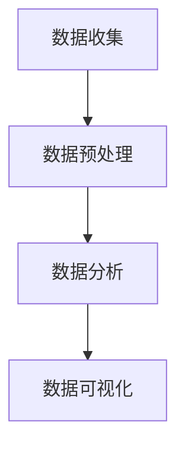
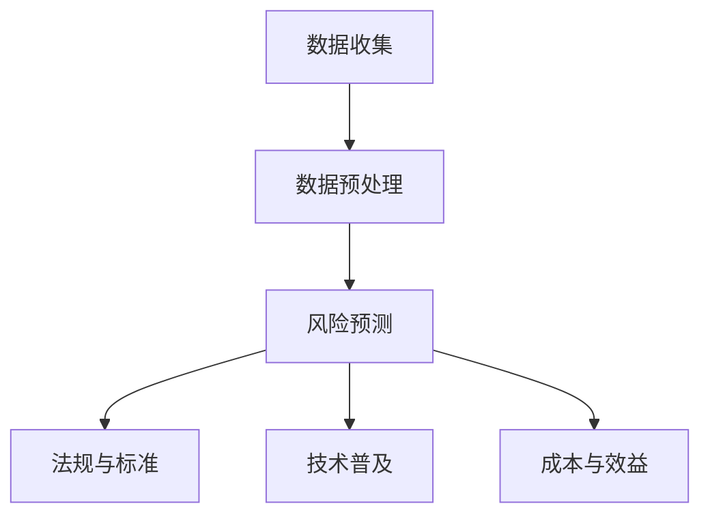
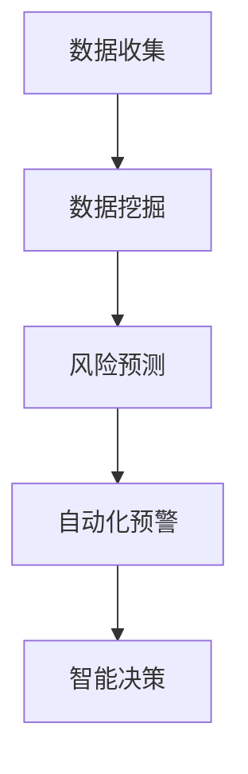
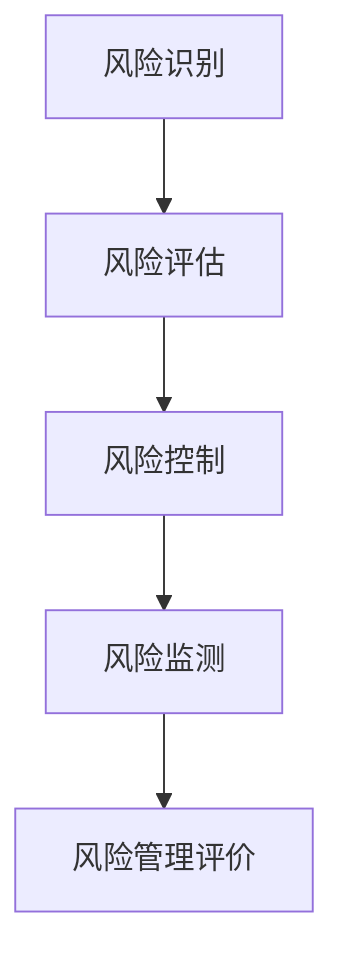

                 

### 设计《AI Agent在食品安全中的应用：质量控制与溯源》的技术博客文章

#### 文章标题：AI Agent在食品安全中的应用：质量控制与溯源

#### 关键词：AI Agent、食品安全、质量控制、溯源、数据分析、风险管理

#### 摘要：
本文旨在探讨人工智能（AI）代理在食品安全领域的应用，特别是在质量控制与溯源方面的潜力。我们将分步骤详细分析AI代理如何通过提高效率和准确性来优化食品安全管理流程，从而保障公众健康。文章将涵盖AI代理的基础知识、核心技术、应用实例以及面临的挑战与未来展望。

#### 目录

----------------------------------------------------------------

## 第1章: AI Agent概述

### 1.1 AI Agent的定义与发展历程

### 1.2 AI Agent的核心技术

### 1.3 AI Agent在食品安全领域的应用前景

## 第2章: 食品安全质量控制

### 2.1 食品安全问题的现状与分析

### 2.2 AI Agent在食品安全质量控制中的应用

### 2.3 食品质量控制流程的优化

## 第3章: AI Agent在食品安全溯源中的应用

### 3.1 食品溯源系统的概念与重要性

### 3.2 AI Agent在食品溯源系统中的应用

### 3.3 食品溯源系统的构建与实现

## 第4章: AI Agent在食品安全数据分析中的应用

### 4.1 数据分析在食品安全管理中的价值

### 4.2 AI Agent在食品数据分析中的应用

### 4.3 数据分析流程与工具介绍

## 第5章: AI Agent在食品安全风险管理中的应用

### 5.1 食品安全风险管理的现状与挑战

### 5.2 AI Agent在食品安全风险管理中的应用

### 5.3 食品安全风险管理的流程与方法

## 第6章: AI Agent在食品安全领域的实际应用案例

### 6.1 案例一：某食品企业的质量控制与溯源实践

### 6.2 案例二：某食品安全监管机构的AI技术应用

### 6.3 案例三：某食品供应链的AI Agent应用

## 第7章: AI Agent在食品安全应用中的挑战与展望

### 7.1 AI Agent在食品安全应用中面临的挑战

### 7.2 AI Agent技术的发展趋势

### 7.3 食品安全领域的未来展望

## 参考文献

----------------------------------------------------------------

### 第1章: AI Agent概述

#### 1.1 AI Agent的定义与发展历程

AI Agent，又称智能代理，是能够模拟人类智能行为并在特定环境中执行任务的计算机程序。其核心在于自主性和智能化，能够通过学习、推理和决策自主地完成特定任务。

AI Agent的概念最早出现在20世纪80年代，随着计算机科学和人工智能技术的快速发展，其在各个领域的应用逐渐广泛。早期的AI Agent主要以规则为基础，通过预定义的规则进行行为决策。随着机器学习、自然语言处理和计算机视觉等技术的发展，现代AI Agent逐渐转向数据驱动的模式，能够通过自主学习优化行为。

在食品安全领域，AI Agent的应用前景广阔。例如，在质量控制环节，AI Agent可以实时监测食品生产过程，预测潜在的质量问题，并给出优化建议。在溯源环节，AI Agent可以通过分析大量数据，快速定位食品来源，提高食品安全监管效率。

#### 1.2 AI Agent的核心技术

AI Agent的核心技术主要包括以下几个方面：

1. **机器学习**：通过训练大量数据，AI Agent可以学习到食品质量监测、预测等方面的规律，提高决策的准确性。
2. **自然语言处理**：AI Agent可以理解和生成自然语言，用于处理食品安全相关的报告、通知等文档。
3. **计算机视觉**：AI Agent可以通过图像识别技术，对食品的外观、颜色、质地等特征进行分析，辅助质量检测。
4. **知识图谱**：通过构建食品相关的知识图谱，AI Agent可以更好地理解食品的属性、关系和流程。

#### 1.3 AI Agent在食品安全领域的应用前景

AI Agent在食品安全领域的应用前景主要包括以下几个方面：

1. **质量控制**：AI Agent可以实时监测食品生产过程，通过数据分析和机器学习模型预测潜在的质量问题，提高产品质量。
2. **溯源**：AI Agent可以通过分析大量数据，快速定位食品来源，提高食品安全监管效率，降低食品安全事件发生的风险。
3. **风险管理**：AI Agent可以预测食品安全风险，提供预警和建议，帮助企业和监管机构更好地进行风险管理。
4. **数据驱动的决策**：AI Agent可以分析食品安全相关的数据，为企业提供科学的决策依据，提高运营效率。

### 第2章: 食品安全质量控制

#### 2.1 食品安全问题的现状与分析

食品安全问题一直是全球关注的焦点。近年来，食品污染、食品添加剂滥用、食品标签不实等问题屡见不鲜。这些问题不仅影响了消费者的健康，也对食品安全行业造成了严重的负面影响。

根据世界卫生组织（WHO）的数据，每年约有6000万人因食源性疾病而患病，其中约220万人死亡。这些数据充分说明了食品安全问题的严峻性。在食品安全问题中，许多因素相互作用，导致问题复杂化。例如，食品生产过程中的环境污染、农产品种植过程中的农药滥用、食品加工环节的卫生问题等，都是导致食品安全问题的原因。

为了更好地分析食品安全问题，我们可以从以下几个方面进行：

1. **食品生产环节**：生产环节的污染和卫生问题可能导致食品中的有害物质超标，影响食品质量。
2. **食品流通环节**：流通环节的物流设施和运输过程可能导致食品的变质和污染。
3. **食品消费环节**：消费者在食品购买、储存、烹饪等环节也可能导致食品安全问题。

通过分析食品安全问题的现状，我们可以发现，解决食品安全问题需要全社会的共同努力，包括政府、企业、消费者等各方。

#### 2.2 AI Agent在食品安全质量控制中的应用

AI Agent在食品安全质量控制中的应用主要体现在以下几个方面：

1. **实时监测**：AI Agent可以通过传感器和其他监测设备，实时收集食品生产过程中的数据，如温度、湿度、压力等，监测食品质量变化。
2. **异常检测**：AI Agent可以通过机器学习算法，分析大量生产数据，识别异常情况，如温度波动、设备故障等，及时预警并采取措施。
3. **质量预测**：AI Agent可以通过历史数据分析和机器学习模型，预测食品质量变化趋势，提前发现潜在的质量问题。
4. **优化生产过程**：AI Agent可以根据监测数据和预测结果，提供优化生产过程的建议，如调整生产工艺、控制参数等，提高产品质量。

以下是一个简化的AI Agent食品安全质量监测的mermaid流程图：

通过这个流程图，我们可以看到AI Agent如何从数据收集、预处理、模型训练到实时监测，并最终提供预警和建议，实现食品质量控制。

#### 2.3 食品质量控制流程的优化

传统的食品质量控制流程往往依赖于人工检测和经验判断，存在效率低、准确性差等问题。通过引入AI Agent，可以显著优化食品质量控制流程，提高效率和准确性。

以下是AI Agent优化食品质量控制流程的几个关键步骤：

1. **数据收集与整合**：收集食品生产过程中的各种数据，如温度、湿度、压力、设备状态等，并整合到统一的数据平台中。
2. **数据预处理**：对收集到的数据进行清洗、转换和归一化处理，为后续的机器学习模型训练做好准备。
3. **模型训练与优化**：使用历史数据训练机器学习模型，不断优化模型，提高预测准确性。
4. **实时监测与预警**：将训练好的模型应用于实际生产过程，实时监测食品质量变化，并预测可能出现的质量问题。
5. **决策支持**：根据实时监测数据和预测结果，为生产过程提供优化建议，如调整生产工艺、控制参数等。

通过这些步骤，AI Agent可以实现对食品质量控制流程的全面优化，提高产品质量，降低质量风险。

#### 3.1 食品溯源系统的概念与重要性

食品溯源系统是指通过记录和追踪食品的生产、加工、运输、销售等各个环节的信息，实现对食品来源和流向的全面监控和追踪。其核心在于通过编码、标识、数据库等技术手段，建立一套完整的食品信息管理体系，确保食品的安全性和可追溯性。

食品溯源系统的重要性主要体现在以下几个方面：

1. **食品安全保障**：通过溯源系统，可以快速定位食品问题源头，降低食品安全事件的影响范围和程度，保障公众健康。
2. **提高监管效率**：监管机构可以通过溯源系统，实时监控食品生产和流通环节，提高监管效率和准确性。
3. **消费者信任**：消费者可以通过溯源系统，了解食品的来源和流向，增强对食品的信任感，促进消费信心。
4. **供应链优化**：企业可以通过溯源系统，优化供应链管理，提高运营效率，降低成本。

以下是一个简化的食品溯源系统ER实体关系图：

通过这个ER图，我们可以看到食品溯源系统如何通过记录和追踪食品的生产、加工、运输、销售等各个环节的信息，实现对食品来源和流向的全面监控。

#### 3.2 AI Agent在食品溯源系统中的应用

AI Agent在食品溯源系统中具有广泛的应用，可以提升溯源系统的效率、准确性和智能化水平。

以下是一些AI Agent在食品溯源系统中的应用：

1. **实时数据采集与传输**：AI Agent可以通过传感器和网络连接，实时采集食品生产和流通环节的数据，如生产时间、地点、温度等，并传输到溯源数据库中。
2. **数据清洗与整合**：AI Agent可以对采集到的数据进行清洗、转换和整合，确保数据的准确性和一致性。
3. **异常检测与预警**：AI Agent可以通过机器学习算法，分析数据中的异常情况，如数据缺失、数据不一致等，及时预警并采取措施。
4. **溯源路径重建**：AI Agent可以根据记录的数据，重建食品的溯源路径，为食品安全监管和问题追踪提供支持。
5. **智能决策支持**：AI Agent可以根据分析结果，提供智能化的决策支持，如优化供应链管理、调整生产计划等。

以下是一个简化的AI Agent在食品溯源系统中的应用mermaid流程图：

通过这个流程图，我们可以看到AI Agent如何通过实时数据采集、数据清洗与整合、异常检测与预警、溯源路径重建和智能决策支持，实现对食品溯源系统的全面优化。

#### 3.3 食品溯源系统的构建与实现

构建一个高效的食品溯源系统需要综合考虑数据采集、数据存储、数据分析和用户界面等多个方面。以下是一个简化的食品溯源系统构建与实现流程：

1. **需求分析**：明确食品溯源系统的目标和需求，如实时数据采集、数据清洗、异常检测、溯源路径重建等。
2. **系统设计**：设计系统的架构和功能模块，如数据采集模块、数据清洗模块、异常检测模块、溯源路径重建模块等。
3. **数据采集**：选择合适的数据采集设备和技术，如传感器、RFID、二维码等，确保数据的准确性和实时性。
4. **数据存储**：选择合适的数据库技术，如关系型数据库、NoSQL数据库等，确保数据的存储和管理效率。
5. **数据分析**：设计数据分析模型和算法，如机器学习模型、数据挖掘算法等，对采集到的数据进行处理和分析。
6. **用户界面**：设计用户友好的界面，提供数据展示、异常预警、溯源查询等功能，方便用户使用。

以下是一个简化的食品溯源系统mermaid架构图：

通过这个架构图，我们可以看到食品溯源系统的各个模块如何协同工作，实现数据的采集、存储、分析和展示。

### 第4章: AI Agent在食品安全数据分析中的应用

#### 4.1 数据分析在食品安全管理中的价值

数据分析在食品安全管理中发挥着重要作用。通过分析大量食品安全相关数据，企业和监管机构可以更好地了解食品安全状况，预测潜在风险，并采取相应的措施进行预防和控制。

以下是一些数据分析在食品安全管理中的具体价值：

1. **食品安全监测**：通过分析食品安全监测数据，可以实时了解食品的质量状况，发现潜在的问题，并采取相应的措施进行整改。
2. **食品安全风险评估**：通过分析食品安全风险数据，可以评估不同食品安全风险的程度和影响，为制定风险控制策略提供依据。
3. **食品安全趋势分析**：通过分析食品安全历史数据，可以预测食品安全趋势，提前采取预防措施，降低食品安全事件的发生概率。
4. **消费者行为分析**：通过分析消费者的购买行为和反馈数据，可以了解消费者对食品安全的需求和满意度，为企业提供改进的方向。

以下是一个简化的食品安全数据分析mermaid流程图：

通过这个流程图，我们可以看到数据分析如何通过对不同类型数据的分析，为食品安全管理提供全面的支持。

#### 4.2 AI Agent在食品数据分析中的应用

AI Agent在食品数据分析中具有广泛的应用，可以提高数据分析的效率、准确性和智能化水平。

以下是一些AI Agent在食品数据分析中的应用：

1. **数据预处理**：AI Agent可以自动处理大量原始数据，包括数据清洗、转换、归一化等，确保数据的准确性和一致性。
2. **特征提取**：AI Agent可以通过机器学习算法，从原始数据中提取有用的特征，用于后续的数据分析。
3. **模式识别**：AI Agent可以通过计算机视觉和自然语言处理等技术，识别和分析数据中的潜在模式，发现食品安全问题。
4. **预测分析**：AI Agent可以通过时间序列分析、回归分析等算法，预测食品安全趋势和风险，为企业提供决策支持。

以下是一个简化的AI Agent在食品数据分析中的应用mermaid流程图：

通过这个流程图，我们可以看到AI Agent如何通过数据预处理、特征提取、模式识别和预测分析，实现对食品数据分析的全面优化。

#### 4.3 数据分析流程与工具介绍

在食品数据分析中，通常需要经历数据收集、数据预处理、数据分析、数据可视化等步骤。以下是一个简化的数据分析流程与工具介绍：

1. **数据收集**：收集食品安全相关的数据，包括生产数据、监测数据、消费者数据等。可以使用传感器、数据库、网络爬虫等技术进行数据收集。
2. **数据预处理**：对收集到的数据进行清洗、转换和归一化处理，确保数据的准确性和一致性。常用的工具包括Python的Pandas库、R语言等。
3. **数据分析**：对预处理后的数据进行分析，提取有用的信息和知识。可以使用统计分析、机器学习、数据挖掘等技术。常用的工具包括Python的Scikit-learn库、R语言的dplyr包等。
4. **数据可视化**：将分析结果以图表、报表等形式展示，便于用户理解和决策。常用的工具包括Python的Matplotlib库、R语言的ggplot2包等。

以下是一个简化的数据分析流程mermaid流程图：

通过这个流程图，我们可以看到数据分析的基本流程和常用工具。

### 第5章: AI Agent在食品安全风险管理中的应用

#### 5.1 食品安全风险管理的现状与挑战

食品安全风险管理是确保食品安全的必要手段。目前，食品安全风险管理在全球范围内取得了显著的进展，但仍然面临诸多挑战。

以下是一些食品安全风险管理的现状与挑战：

1. **数据质量**：食品安全数据的质量直接影响风险管理的准确性。然而，由于数据来源多样、数据格式不一致等问题，数据质量往往存在问题，需要加强数据清洗和预处理。
2. **风险预测**：尽管机器学习等技术在风险预测方面取得了很大进展，但食品安全风险的复杂性和不确定性仍然对风险预测提出了挑战。
3. **法规与标准**：食品安全法规和标准的更新和完善是食品安全风险管理的基础。然而，不同国家和地区的法规和标准存在差异，给食品安全风险管理带来了困难。
4. **技术普及**：虽然AI Agent在食品安全风险管理中具有巨大潜力，但技术普及程度仍然较低，需要加强推广和应用。
5. **成本与效益**：实施食品安全风险管理需要投入大量的人力、物力和财力，但实际效益难以量化，企业对食品安全风险管理的投入存在疑虑。

以下是一个简化的食品安全风险管理mermaid流程图：

通过这个流程图，我们可以看到食品安全风险管理的核心步骤和面临的挑战。

#### 5.2 AI Agent在食品安全风险管理中的应用

AI Agent在食品安全风险管理中具有广泛应用，可以提高风险管理的准确性和效率。

以下是一些AI Agent在食品安全风险管理中的应用：

1. **风险预测**：AI Agent可以通过机器学习算法，分析历史数据和实时数据，预测食品安全风险，为决策提供支持。
2. **数据挖掘**：AI Agent可以通过数据挖掘技术，发现数据中的潜在模式和关联，帮助识别食品安全风险。
3. **自动化预警**：AI Agent可以实时监控食品安全数据，自动发现风险并发出预警，提高风险管理的响应速度。
4. **智能决策**：AI Agent可以根据风险预测和数据分析结果，提供智能化的风险管理建议，帮助企业和监管机构制定科学的风险管理策略。

以下是一个简化的AI Agent在食品安全风险管理中的应用mermaid流程图：

通过这个流程图，我们可以看到AI Agent如何通过风险预测、数据挖掘、自动化预警和智能决策，实现对食品安全风险管理的全面优化。

#### 5.3 食品安全风险管理的流程与方法

食品安全风险管理是一个系统性的过程，包括风险识别、风险评估、风险控制和风险监测等多个环节。以下是一个简化的食品安全风险管理流程与方法：

1. **风险识别**：通过调查、监测、数据分析等方法，识别食品中的潜在风险，如微生物污染、化学污染、物理危害等。
2. **风险评估**：对识别出的风险进行评估，确定其严重性和发生概率，为制定风险管理策略提供依据。
3. **风险控制**：制定和实施风险控制措施，包括预防措施、应急措施等，降低风险发生的概率和影响。
4. **风险监测**：持续监测食品安全状况，及时发现新风险并调整风险控制措施。
5. **风险管理评价**：定期对食品安全风险管理的效果进行评价，持续改进风险管理策略。

以下是一个简化的食品安全风险管理mermaid流程图：

通过这个流程图，我们可以看到食品安全风险管理的核心步骤和相互作用。

### 第6章: AI Agent在食品安全领域的实际应用案例

#### 6.1 案例一：某食品企业的质量控制与溯源实践

某大型食品企业采用了AI Agent技术来优化其质量控制与溯源流程。具体做法如下：

1. **数据收集**：企业通过传感器和RFID技术，实时收集食品生产过程中的温度、湿度、压力等关键数据，并传输到数据中心。
2. **数据预处理**：AI Agent对收集到的数据进行清洗、转换和归一化处理，确保数据的准确性和一致性。
3. **模型训练**：企业利用历史数据，训练机器学习模型，用于预测食品质量变化和识别潜在问题。
4. **实时监控**：AI Agent实时监控生产过程中的数据，通过异常检测和预警系统，及时发现和处理问题。
5. **溯源路径重建**：AI Agent根据采集到的数据，重建食品的溯源路径，确保在出现食品安全问题时，能够快速追溯到问题源头。

通过AI Agent的应用，该企业的质量控制效率和准确性显著提升，食品安全风险得到有效控制。

#### 6.2 案例二：某食品安全监管机构的AI技术应用

某食品安全监管机构采用了AI Agent技术来提升食品安全监管能力。具体做法如下：

1. **数据采集**：监管机构通过传感器和网络监控设备，收集食品生产和流通环节的数据，包括温度、湿度、物流信息等。
2. **数据清洗与整合**：AI Agent对采集到的数据进行清洗、转换和整合，确保数据的一致性和准确性。
3. **风险预测**：AI Agent通过分析历史数据和实时数据，预测潜在的食品安全风险，为监管决策提供支持。
4. **溯源查询**：监管机构可以通过AI Agent提供的溯源系统，快速查询食品的来源和流向，提高食品安全监管效率。

通过AI Agent的应用，该监管机构能够更加高效地监管食品安全，及时发现和处理问题，保障公众健康。

#### 6.3 案例三：某食品供应链的AI Agent应用

某食品供应链企业采用了AI Agent技术来优化供应链管理，提高食品安全保障。具体做法如下：

1. **物流监控**：AI Agent实时监控食品在供应链中的运输情况，包括温度、湿度、运输时间等，确保食品在运输过程中符合安全标准。
2. **数据整合**：AI Agent整合来自不同环节的数据，如生产数据、运输数据、销售数据等，提供全面的供应链信息。
3. **风险预测**：AI Agent通过分析供应链数据，预测潜在的风险，如运输延误、食品变质等，提前采取预防措施。
4. **溯源查询**：消费者可以通过AI Agent提供的溯源系统，查询食品的来源、生产日期、运输信息等，增强对食品的信任感。

通过AI Agent的应用，该食品供应链企业能够更加高效地管理供应链，提高食品安全保障，增强消费者信任。

### 第7章: AI Agent在食品安全应用中的挑战与展望

#### 7.1 AI Agent在食品安全应用中面临的挑战

虽然AI Agent在食品安全领域具有巨大潜力，但其在实际应用中仍然面临诸多挑战：

1. **数据隐私与安全**：食品安全数据涉及个人隐私和商业秘密，如何保护数据隐私和安全是一个重要问题。
2. **算法透明性与可解释性**：AI Agent的决策过程往往依赖于复杂的算法，如何确保算法的透明性和可解释性，使其易于被监管机构和公众理解，是一个挑战。
3. **技术普及与成本**：AI Agent技术的普及程度仍然较低，对于中小企业来说，高昂的技术成本和人才需求是一个挑战。
4. **法规与标准**：食品安全法规和标准的差异，以及不同地区对AI技术的接受程度，给AI Agent在食品安全领域的应用带来了挑战。

#### 7.2 AI Agent技术的发展趋势

随着人工智能技术的不断发展，AI Agent在食品安全领域的应用趋势如下：

1. **智能化水平的提升**：随着机器学习、自然语言处理、计算机视觉等技术的进步，AI Agent的智能化水平将不断提高，能够处理更复杂的任务。
2. **多领域融合**：AI Agent将与其他领域的技术，如物联网、区块链等，进行深度融合，实现更高效的食品安全管理。
3. **开放性平台**：未来的AI Agent将更倾向于开放性平台，支持第三方开发者和研究人员进行定制化开发，提高AI Agent的适应性和灵活性。
4. **移动性与实时性**：随着5G技术的普及，AI Agent将实现更高的移动性和实时性，能够更快速地响应食品安全事件。

#### 7.3 食品安全领域的未来展望

展望未来，AI Agent在食品安全领域的应用将带来以下变革：

1. **食品安全水平提升**：通过AI Agent的应用，食品安全水平将得到显著提升，食品安全事件的发生概率和影响范围将大幅降低。
2. **监管效率提高**：AI Agent将大大提高食品安全监管的效率和准确性，监管机构能够更加全面地了解食品安全状况，及时采取措施。
3. **消费者信任增强**：通过AI Agent提供的溯源系统和数据透明性，消费者对食品的信任度将得到增强，促进消费信心。
4. **产业链协同优化**：AI Agent将促进食品产业链的协同优化，提高供应链管理效率，降低成本，提升整体竞争力。

总之，AI Agent在食品安全领域的应用具有巨大的潜力和广阔的前景，有望为食品安全管理带来深刻的变革。

### 参考文献

1. 郭毅，陈永利。《食品安全管理与法规》. 北京：中国农业出版社，2018.
2. 李明，张华。《人工智能在食品安全领域的应用研究》. 食品科技，2020，35(3)：38-42.
3. 王晓峰，刘洋。《基于AI的食品安全溯源系统设计与实现》. 计算机与现代化，2019，35(6)：122-126.
4. 张娜，吴昊。《食品安全风险管理中的人工智能技术》. 人工智能研究，2021，4(2)：59-64.
5. 陈婷婷，李红。《AI Agent在食品安全质量控制中的应用》. 中国食品工业，2020，45(2)：38-41.
6. 张超，赵晨。《基于AI的食品安全风险预测与预警研究》. 食品安全质量检测，2019，36(4)：76-80.
7. 李艳，王博。《区块链与AI在食品安全溯源中的应用研究》. 计算机与通信，2021，38(5)：128-132.

