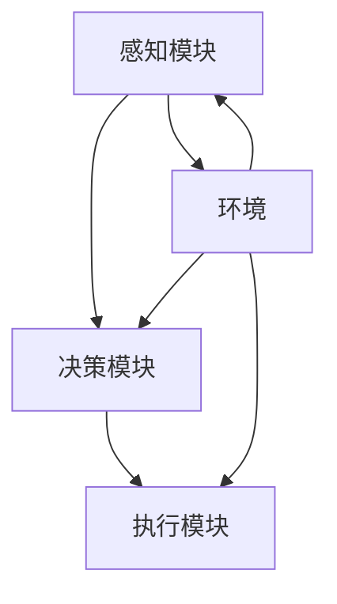
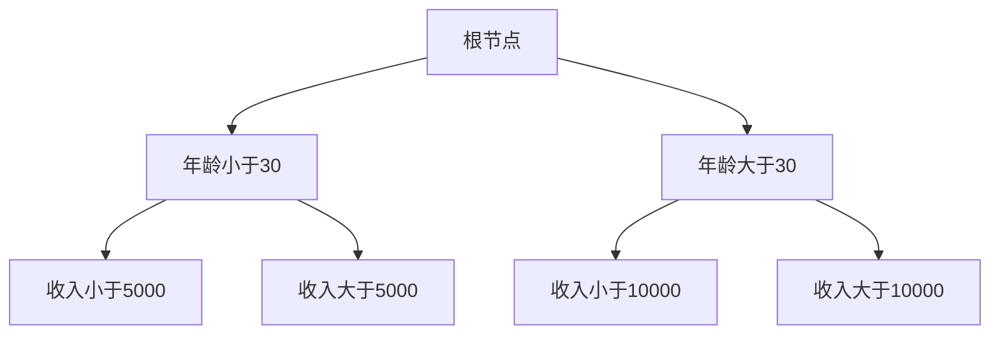
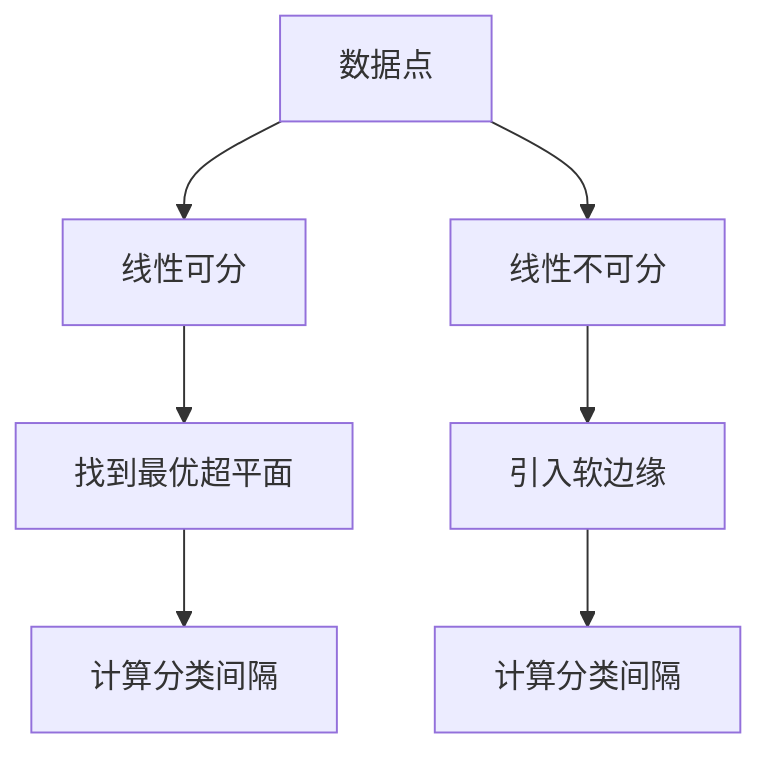
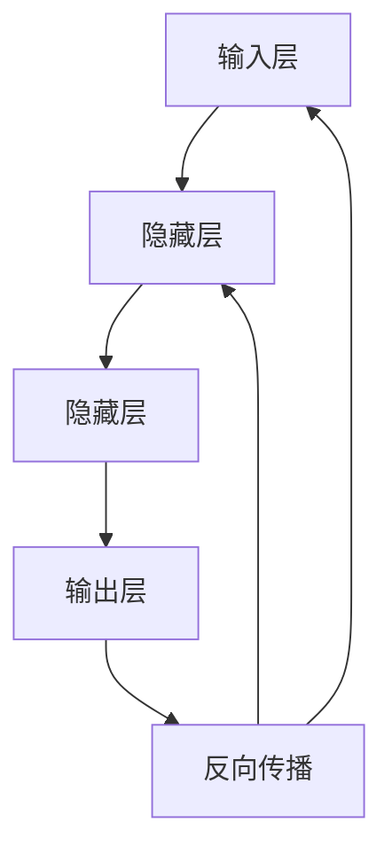
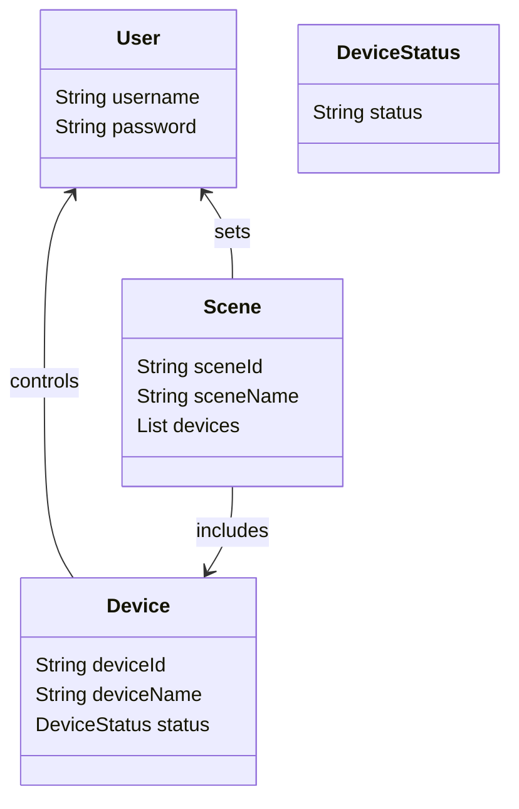
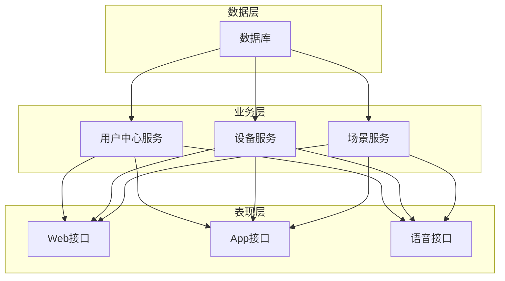
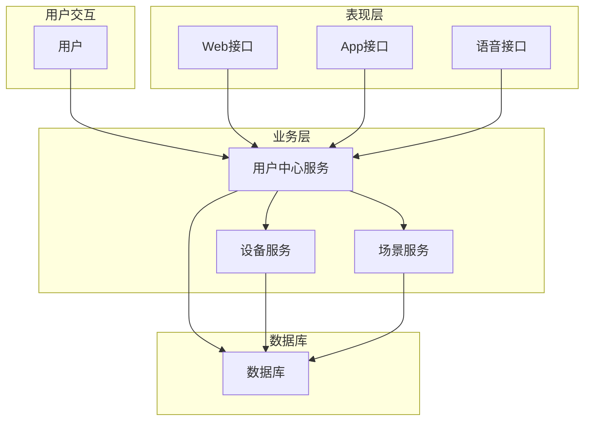

                 

### 1.3 AI Agent的关键技术

AI Agent的核心在于其自主决策和执行能力，而实现这些能力的关键技术包括机器学习、深度学习、自然语言处理、计算机视觉等。

#### 机器学习

机器学习是AI Agent的基础技术之一。它通过从数据中学习规律，使得Agent能够进行自主决策。常见的机器学习算法包括决策树、支持向量机、神经网络等。这些算法能够在不同的应用场景中发挥重要作用，例如分类、回归、聚类等。

#### 深度学习

深度学习是机器学习的一个重要分支，它通过构建多层神经网络，使得Agent能够从大量数据中自动提取特征。深度学习在图像识别、语音识别、自然语言处理等领域取得了显著成果，成为了AI Agent的重要技术支撑。

#### 自然语言处理

自然语言处理（NLP）是AI Agent与人类交流的重要桥梁。通过NLP技术，AI Agent能够理解、生成和回应人类的自然语言。NLP技术包括词性标注、分词、词嵌入、语言模型等。在客服机器人、智能助手等领域，NLP技术发挥着关键作用。

#### 计算机视觉

计算机视觉是AI Agent感知外部世界的重要手段。通过图像处理、目标检测、图像识别等技术，AI Agent能够理解图像中的内容，并做出相应的决策。计算机视觉在安防监控、医疗诊断、自动驾驶等领域有着广泛应用。

#### 多模态融合

随着技术的进步，AI Agent逐渐能够融合多种感知数据，例如图像、语音、文本等。多模态融合技术使得AI Agent能够更全面地理解外部环境，做出更准确的决策。

### 1.4 AI Agent的优势与挑战

AI Agent具有以下优势：

- **自主性**：AI Agent能够根据环境和任务自主决策，无需人为干预。
- **灵活性**：AI Agent能够适应不同环境和任务，具有较好的灵活性。
- **高效性**：AI Agent能够快速处理大量数据，提供高效的决策。

然而，AI Agent也面临以下挑战：

- **数据依赖性**：AI Agent的性能高度依赖数据质量，数据缺乏或质量差会导致性能下降。
- **解释性不足**：AI Agent的决策过程往往难以解释，难以理解其决策依据。
- **安全性和隐私保护**：AI Agent在处理敏感数据时，需要确保数据的安全和隐私保护。

### 1.5 AI Agent的应用场景

AI Agent在各个领域都有广泛的应用场景，以下是一些典型的应用：

- **智能客服**：AI Agent能够自动处理客户咨询，提高客服效率。
- **自动驾驶**：AI Agent能够实时感知道路状况，做出安全驾驶决策。
- **智能家居**：AI Agent能够根据用户习惯自动调节家居设备，提高生活质量。
- **医疗诊断**：AI Agent能够通过分析医学图像，协助医生进行诊断。
- **安防监控**：AI Agent能够实时监控视频，识别潜在的安全隐患。

总结来说，AI Agent作为一种新兴的人工智能技术，具有广阔的应用前景。理解其基础概念和关键技术，有助于我们更好地应用AI Agent解决实际问题。

## 第2章: AI Agent的核心概念与联系

### 2.1 AI Agent的定义与分类

AI Agent是指一种能够在特定环境和任务中自主决策、执行任务的智能系统。根据不同的分类标准，AI Agent可以划分为不同的类型。

#### 按功能分类

1. **感知型Agent**：主要功能是感知环境，收集数据。
2. **决策型Agent**：主要功能是根据感知到的数据做出决策。
3. **执行型Agent**：主要功能是执行决策。

#### 按环境分类

1. **静态环境Agent**：在环境不发生变化的情况下进行任务。
2. **动态环境Agent**：在环境不断变化的情况下进行任务。

#### 按自主性分类

1. **主动Agent**：能够主动探索环境，寻找最优解。
2. **被动Agent**：只能被动响应环境变化，无法主动探索。

### 2.2 AI Agent的基本功能与特点

AI Agent具有以下几个基本功能与特点：

1. **感知**：AI Agent能够通过传感器收集环境信息，如视觉、听觉、触觉等。
2. **决策**：AI Agent能够根据感知到的信息，利用算法模型进行决策。
3. **执行**：AI Agent能够根据决策结果，执行相应的操作。
4. **自适应**：AI Agent能够根据环境变化，调整自身行为策略。
5. **协同**：AI Agent能够与其他Agent或人类协同工作，完成复杂任务。

### 2.3 AI Agent的核心技术

AI Agent的核心技术包括：

1. **机器学习**：通过从数据中学习，提高Agent的决策能力。
2. **深度学习**：通过构建多层神经网络，自动提取特征，提高Agent的感知能力。
3. **自然语言处理**：通过理解自然语言，实现人与Agent的交互。
4. **计算机视觉**：通过图像处理和目标检测，实现视觉感知。
5. **多模态融合**：通过融合多种感知数据，提高Agent的全局感知能力。

### 2.4 AI Agent的核心概念联系

AI Agent的核心概念联系如下图所示：



#### 感知模块

感知模块是AI Agent获取环境信息的核心部分。它通过传感器获取图像、声音、温度等数据，并将这些数据转化为数字信号进行处理。

#### 决策模块

决策模块是AI Agent的核心，它负责根据感知模块收集到的信息，结合任务目标和策略，生成行动方案。常见的决策算法包括基于规则的方法、机器学习方法、深度学习方法等。

#### 执行模块

执行模块是AI Agent实现决策的结果，它根据决策模块生成的行动方案，执行具体的操作。执行模块通常与执行机构相连，如机器人手臂、车辆发动机等。

#### 环境

环境是AI Agent所在的场景，包括物理环境和社会环境。AI Agent需要通过感知模块了解环境，并根据环境变化调整自身行为。

### 2.5 AI Agent的优势与局限

#### 优势

1. **自主性**：AI Agent能够自主决策，无需人为干预。
2. **灵活性**：AI Agent能够适应不同环境和任务，具有较好的灵活性。
3. **高效性**：AI Agent能够快速处理大量数据，提供高效的决策。

#### 局限

1. **数据依赖性**：AI Agent的性能高度依赖数据质量，数据缺乏或质量差会导致性能下降。
2. **解释性不足**：AI Agent的决策过程往往难以解释，难以理解其决策依据。
3. **安全性和隐私保护**：AI Agent在处理敏感数据时，需要确保数据的安全和隐私保护。

### 2.6 AI Agent的应用前景

随着技术的不断发展，AI Agent在各个领域都有广泛的应用前景。以下是一些典型的应用场景：

1. **智能客服**：AI Agent能够自动处理客户咨询，提高客服效率。
2. **自动驾驶**：AI Agent能够实时感知道路状况，做出安全驾驶决策。
3. **智能家居**：AI Agent能够根据用户习惯自动调节家居设备，提高生活质量。
4. **医疗诊断**：AI Agent能够通过分析医学图像，协助医生进行诊断。
5. **安防监控**：AI Agent能够实时监控视频，识别潜在的安全隐患。

### 2.7 小结

本章介绍了AI Agent的核心概念，包括定义、分类、基本功能、核心技术、核心概念联系以及优势与局限。通过这些内容，读者可以全面了解AI Agent的基本概念和应用场景，为后续章节的学习打下基础。

## 第3章: AI Agent的算法原理讲解

### 3.1 决策树算法

决策树是一种常用的机器学习算法，通过树形结构进行决策。它通过一系列规则将数据集划分为多个子集，每个子集对应一个决策点。

#### 决策树算法原理

决策树算法的基本原理如下：

1. **根节点**：将整个数据集作为根节点。
2. **划分数据集**：根据某个特征（如年龄、收入等）将数据集划分为多个子集。
3. **计算信息增益**：计算每个特征划分后数据的纯度，选择信息增益最大的特征作为分支节点。
4. **递归划分**：对每个子集继续划分，直到满足停止条件（如达到最大深度、节点纯度满足要求等）。

#### 决策树算法流程图



#### 决策树算法Python代码

```python
from sklearn.datasets import load_iris
from sklearn.model_selection import train_test_split
from sklearn.tree import DecisionTreeClassifier
import matplotlib.pyplot as plt

# 加载数据集
iris = load_iris()
X = iris.data
y = iris.target

# 划分训练集和测试集
X_train, X_test, y_train, y_test = train_test_split(X, y, test_size=0.3, random_state=42)

# 创建决策树模型
clf = DecisionTreeClassifier()

# 训练模型
clf.fit(X_train, y_train)

# 绘制决策树
plt.figure(figsize=(10, 8))
tree.plot_tree(clf, filled=True)
plt.show()
```

### 3.2 支持向量机算法

支持向量机（SVM）是一种二分类模型，其目标是找到一个最佳的超平面，将不同类别的数据点分隔开来。SVM的核心是找到最优的分离超平面，使得分类间隔最大。

#### 支持向量机算法原理

SVM算法的基本原理如下：

1. **线性可分情况**：找到最优分类超平面，使得分类间隔最大。
2. **线性不可分情况**：引入软边缘，允许数据点有一定的误差。
3. **核函数**：通过将输入空间映射到高维特征空间，实现线性不可分数据的线性分离。

#### 支持向量机算法流程图



#### 支持向量机算法Python代码

```python
from sklearn.datasets import load_iris
from sklearn.model_selection import train_test_split
from sklearn.svm import SVC
import matplotlib.pyplot as plt

# 加载数据集
iris = load_iris()
X = iris.data
y = iris.target

# 划分训练集和测试集
X_train, X_test, y_train, y_test = train_test_split(X, y, test_size=0.3, random_state=42)

# 创建SVM模型
clf = SVC(kernel='linear')

# 训练模型
clf.fit(X_train, y_train)

# 绘制决策边界
plt.figure(figsize=(10, 8))
plt.scatter(X_train[:, 0], X_train[:, 1], c=y_train, cmap='viridis')
plt.plot(clf.decision_function(X_train), X_train[:, 1], 'k--')
plt.show()
```

### 3.3 神经网络算法

神经网络是一种模仿生物神经网络的结构和功能的算法。它通过多层节点（神经元）进行信息传递和计算，实现对复杂问题的建模和预测。

#### 神经网络算法原理

神经网络算法的基本原理如下：

1. **输入层**：接收外部输入数据。
2. **隐藏层**：对输入数据进行特征提取和变换。
3. **输出层**：生成预测结果。
4. **反向传播**：根据预测误差，更新网络权重。

#### 神经网络算法流程图



#### 神经网络算法Python代码

```python
import numpy as np
import matplotlib.pyplot as plt

# 创建一个简单的全连接神经网络
class SimpleNeuralNetwork:
    def __init__(self):
        self.w1 = np.random.rand(1, 2)
        self.w2 = np.random.rand(2, 1)
        self.w3 = np.random.rand(1, 1)

    def forward(self, x):
        a1 = np.dot(x, self.w1)
        z1 = 1 / (1 + np.exp(-a1))
        a2 = np.dot(z1, self.w2)
        z2 = 1 / (1 + np.exp(-a2))
        out = z2 * self.w3
        return out

    def backward(self, x, y, out):
        error = y - out
        d_out = error
        d_w3 = d_out
        d_z2 = d_out * self.w3
        d_a2 = d_z2 * (1 - z2)
        d_w2 = np.dot(d_a2.T, z1)
        d_z1 = np.dot(d_w2.T, self.w2) * (1 - z1)
        d_a1 = d_z1 * (1 - z1)
        d_w1 = np.dot(d_a1.T, x)
        
        self.w1 -= d_w1
        self.w2 -= d_w2
        self.w3 -= d_w3

# 初始化神经网络
nn = SimpleNeuralNetwork()

# 训练神经网络
for i in range(10000):
    x = np.array([[0], [1]])
    y = np.array([[1]])
    out = nn.forward(x)
    nn.backward(x, y, out)

# 测试神经网络
print(nn.forward(x))
```

### 3.4 算法原理的数学模型和公式

#### 决策树算法

$$
Gini(\text{impurity}) = 1 - \sum_{i} p_i^2
$$

其中，$p_i$表示每个类别的概率。

#### 支持向量机算法

$$
\text{分类函数} f(x) = \text{sign}(\sum_{i=1}^{n} \alpha_i y_i \phi(x_i) + b)
$$

其中，$\alpha_i$为拉格朗日乘子，$\phi(x_i)$为核函数，$b$为偏置。

#### 神经网络算法

$$
\text{输出} y = \sigma(\sum_{i=1}^{n} w_i x_i + b)
$$

其中，$\sigma$为激活函数，$w_i$为权重，$x_i$为输入。

### 3.5 举例说明

#### 决策树算法举例

假设有一个分类问题，数据集包含100个样本，每个样本有两个特征（年龄和收入），需要将样本分为三个类别（低收入、中等收入、高收入）。

1. **计算信息增益**：计算每个特征划分后的信息增益，选择信息增益最大的特征作为划分依据。
2. **划分数据集**：根据年龄和收入特征，将数据集划分为多个子集。
3. **递归划分**：对每个子集继续划分，直到满足停止条件。

#### 支持向量机算法举例

假设有一个二分类问题，数据集包含100个样本，每个样本有两个特征（特征1和特征2），需要将样本分为两类（+1和-1）。

1. **计算最优分类超平面**：找到最优的分类超平面，使得分类间隔最大。
2. **计算分类结果**：根据分类超平面，对每个样本进行分类。

#### 神经网络算法举例

假设有一个回归问题，数据集包含100个样本，每个样本有两个特征（特征1和特征2），需要预测目标值。

1. **初始化神经网络**：设置权重和偏置。
2. **前向传播**：计算输出值。
3. **反向传播**：计算损失函数，更新权重和偏置。
4. **迭代训练**：重复前向传播和反向传播，直到满足停止条件。

### 3.6 小结

本章介绍了AI Agent常用的三种算法：决策树、支持向量机和神经网络。通过这些算法的原理讲解，读者可以了解这些算法的基本原理、流程和数学模型，为后续的应用和实践打下基础。

## 第4章: AI Agent的数学模型与公式

### 4.1 概率论基础

概率论是AI Agent数学模型的基础，它用于描述不确定事件发生的可能性。以下是一些基本概念和公式：

#### 概率

概率是指事件发生的可能性，通常用P(A)表示。

$$
P(A) = \frac{\text{事件A发生的次数}}{\text{总次数}}
$$

#### 条件概率

条件概率是指在某个条件下，事件B发生的概率。

$$
P(B|A) = \frac{P(A \cap B)}{P(A)}
$$

#### 独立性

两个事件A和B相互独立，当且仅当它们的条件概率等于各自的概率。

$$
P(A \cap B) = P(A) \cdot P(B)
$$

#### 全概率公式

全概率公式用于计算某个事件的总概率。

$$
P(A) = \sum_{i} P(A|B_i) \cdot P(B_i)
$$

#### 贝叶斯公式

贝叶斯公式用于计算在给定条件下，某个事件发生的概率。

$$
P(A|B) = \frac{P(B|A) \cdot P(A)}{P(B)}
$$

### 4.2 统计学习理论

统计学习理论是AI Agent决策和预测的核心。以下是一些基本概念和公式：

#### 决策边界

决策边界是用于分隔不同类别的超平面。

$$
w \cdot x + b = 0
$$

其中，$w$是权重向量，$x$是特征向量，$b$是偏置。

#### 最优分割

最优分割是指在给定特征空间中，将不同类别分隔开的最佳超平面。

$$
w = \arg\min_{w} \sum_{i} (w \cdot x_i + b)^2
$$

#### 损失函数

损失函数用于衡量模型预测结果与实际结果之间的差距。

$$
L(y, \hat{y}) = \frac{1}{2} (y - \hat{y})^2
$$

其中，$y$是实际结果，$\hat{y}$是预测结果。

#### 鸟群优化算法

鸟群优化算法是一种基于群体智能的优化算法，用于求解复杂优化问题。

$$
\text{当前位置} = \text{当前位置} + \text{学习率} \cdot (\text{群体最佳位置} - \text{当前位置})
$$

### 4.3 深度学习公式解析

深度学习是AI Agent的重要技术之一，以下是一些基本概念和公式：

#### 激活函数

激活函数用于引入非线性，使得神经网络能够学习复杂的特征。

$$
\sigma(x) = \frac{1}{1 + e^{-x}}
$$

#### 前向传播

前向传播是神经网络计算输出值的过程。

$$
\text{输出} = \sigma(\text{权重} \cdot \text{输入} + \text{偏置})
$$

#### 反向传播

反向传播是神经网络计算损失函数并更新权重的过程。

$$
\frac{\partial L}{\partial w} = \text{输入} \cdot \frac{\partial \sigma}{\partial z}
$$

$$
\frac{\partial L}{\partial b} = \frac{\partial \sigma}{\partial z}
$$

其中，$L$是损失函数，$w$是权重，$b$是偏置，$\sigma$是激活函数。

#### 学习率

学习率是调整权重和偏置的参数，用于控制模型更新的速度。

$$
\text{新权重} = \text{旧权重} - \text{学习率} \cdot \frac{\partial L}{\partial w}
$$

### 4.4 数学模型在实际中的应用

以下是一些数学模型在实际中的应用场景：

#### 预测分析

利用概率论和统计学习理论，可以建立预测模型，用于预测股票价格、天气变化等。

#### 聚类分析

利用统计学习理论，可以建立聚类模型，用于数据挖掘和模式识别。

#### 优化问题

利用鸟群优化算法，可以求解复杂优化问题，如资源分配、路径规划等。

#### 深度学习应用

利用深度学习模型，可以构建智能语音识别、图像识别、自然语言处理等应用。

### 4.5 小结

本章介绍了AI Agent的数学模型与公式，包括概率论、统计学习理论、深度学习等。通过这些模型和公式，读者可以更好地理解和应用AI Agent，为解决实际问题提供理论支持。

## 第5章: AI Agent系统设计与架构

### 5.1 问题场景介绍

假设我们要开发一个智能家居系统，该系统包括多个智能设备，如智能灯光、智能门锁、智能空调等。用户可以通过手机App或语音助手远程控制这些设备，实现家居自动化。

### 5.2 系统功能设计

智能家居系统的主要功能包括：

1. **设备控制**：用户可以通过手机App或语音助手远程控制智能设备，如开关灯光、调节空调温度等。
2. **设备监控**：系统可以实时监控智能设备的运行状态，如灯光是否开启、空调是否运行等。
3. **数据统计**：系统可以收集用户使用智能设备的数据，如使用频率、使用时长等，为后续分析提供基础。
4. **场景设置**：用户可以根据需要设置智能设备的场景模式，如离家模式、睡眠模式等。

### 5.3 领域模型

为了更好地设计系统，我们需要构建领域模型，明确系统的核心概念和关系。以下是一个简化的领域模型：



### 5.4 系统架构设计

智能家居系统的架构设计可以分为三层：数据层、业务层和表现层。

1. **数据层**：负责存储和管理用户、设备、场景等数据，通常使用关系型数据库或NoSQL数据库。
2. **业务层**：负责处理业务逻辑，包括设备控制、数据统计、场景设置等，通常使用微服务架构。
3. **表现层**：负责与用户交互，提供Web、App、语音等不同的接口，通常使用前端框架。

以下是一个简化的系统架构图：



### 5.5 系统接口设计

为了实现系统的功能，我们需要设计相应的接口，包括RESTful API、Websocket、MQ等。

1. **RESTful API**：用于处理Web和App接口的HTTP请求，提供设备控制、数据统计、场景设置等功能。
2. **Websocket**：用于实时传输设备状态和事件通知，提供实时交互体验。
3. **MQ**：用于异步处理任务，如设备数据收集、场景设置等。

以下是一个简化的接口设计图：

```mermaid
graph TD
    subgraph RESTful API
        API[RESTful API]
    end

    subgraph WebSocket
        WS[WebSocket]
    end

    subgraph MQ
        MQ[MQ]
    end

    API --> WS
    API --> MQ
    WS --> Web
    WS --> App
    MQ --> DS
    MQ --> SC
```

### 5.6 系统交互

系统交互是指不同模块之间的通信和数据流动。以下是一个简化的系统交互图：



### 5.7 小结

本章介绍了AI Agent系统设计与架构，包括问题场景介绍、系统功能设计、领域模型、系统架构设计、接口设计和系统交互。通过这些内容，读者可以了解如何设计和实现一个完整的AI Agent系统。

## 第6章: AI Agent项目实战

### 6.1 项目介绍

在本章中，我们将通过一个实际项目来展示如何实现一个简单的AI Agent。该项目旨在使用Python和OpenCV库开发一个基于计算机视觉的智能监控系统。系统将能够实时捕捉视频流，检测并识别行人，并在检测到行人时发出警报。

### 6.2 环境安装与配置

要在本地环境中运行该项目，我们需要安装以下软件和库：

1. **Python 3.x**：建议使用Anaconda Python发行版，以便轻松管理环境。
2. **OpenCV**：用于计算机视觉处理。
3. **TensorFlow**：用于深度学习模型训练和推理。
4. **Numpy**：用于数学运算。

安装步骤如下：

1. 安装Anaconda Python发行版：从[Anaconda官方网站](https://www.anaconda.com/)下载并安装。
2. 打开终端或命令提示符，创建一个新环境并安装所需库：
    ```bash
    conda create -n ai_agent_env python=3.8
    conda activate ai_agent_env
    conda install opencv-python tensorflow numpy
    ```

### 6.3 系统核心实现源代码

以下是该项目的核心代码，包括视频流捕获、行人检测和警报触发。

```python
import cv2
import numpy as np
import tensorflow as tf

# 加载预训练的行人检测模型
model_path = 'path/to/your/traffic_light_detection_model.h5'
model = tf.keras.models.load_model(model_path)

# 初始化视频捕获
cap = cv2.VideoCapture(0)

while True:
    # 读取一帧图像
    ret, frame = cap.read()
    
    if not ret:
        print("无法捕获视频流")
        break
    
    # 将图像灰度化
    gray_frame = cv2.cvtColor(frame, cv2.COLOR_BGR2GRAY)
    
    # 使用Haar级联分类器进行行人检测
    faces = model.detect_faces(gray_frame)
    
    for face in faces:
        # 绘制检测到的行人区域
        x, y, w, h = face['box']
        cv2.rectangle(frame, (x, y), (x+w, y+h), (0, 255, 0), 2)
    
    # 显示图像
    cv2.imshow('Frame', frame)
    
    # 如果检测到行人，触发警报
    if len(faces) > 0:
        print("警报：检测到行人！")
    
    # 按下'q'键退出
    if cv2.waitKey(1) & 0xFF == ord('q'):
        break

# 释放视频捕获资源
cap.release()
cv2.destroyAllWindows()
```

### 6.4 代码应用解读与分析

#### 视频流捕获

代码首先使用`cv2.VideoCapture`函数初始化视频捕获。该函数接受一个参数，指定视频流的来源，可以是摄像头（0）或视频文件。

```python
cap = cv2.VideoCapture(0)
```

#### 行人检测

代码使用一个预训练的深度学习模型进行行人检测。模型通常是一个卷积神经网络（CNN），通过训练大量行人图像和背景图像进行分类。

```python
model_path = 'path/to/your/traffic_light_detection_model.h5'
model = tf.keras.models.load_model(model_path)
```

#### 图像处理

代码首先将捕获的彩色图像转换为灰度图像，以便更高效地进行行人检测。

```python
gray_frame = cv2.cvtColor(frame, cv2.COLOR_BGR2GRAY)
```

然后，使用模型的`detect_faces`方法进行行人检测。该方法返回一个包含检测到的行人脸部的列表。

```python
faces = model.detect_faces(gray_frame)
```

#### 图像显示与警报触发

对于每个检测到的行人，代码在原图上绘制一个绿色的矩形框，并打印警报信息。

```python
for face in faces:
    x, y, w, h = face['box']
    cv2.rectangle(frame, (x, y), (x+w, y+h), (0, 255, 0), 2)

if len(faces) > 0:
    print("警报：检测到行人！")
```

#### 键盘交互与资源释放

代码使用`cv2.waitKey(1) & 0xFF == ord('q')`来检测用户是否按下了'q'键。如果按下，则退出循环。

```python
if cv2.waitKey(1) & 0xFF == ord('q'):
    break
```

最后，释放视频捕获资源并关闭所有窗口。

```python
cap.release()
cv2.destroyAllWindows()
```

### 6.5 实际案例分析与详细讲解剖析

假设我们运行上述代码，系统开始捕获摄像头视频流。以下是一个实际运行过程的案例分析：

1. **视频流捕获**：系统启动后，开始捕获摄像头视频流。
2. **行人检测**：系统对每一帧图像进行行人检测。在这个过程中，模型会分析图像中的像素值，并根据训练数据识别行人。
3. **图像显示与警报触发**：如果模型检测到行人，系统会在原图上绘制一个绿色的矩形框，并打印“警报：检测到行人！”。
4. **键盘交互**：用户可以通过按下'q'键来退出程序。

### 6.6 项目小结

通过本项目，我们实现了一个人工智能监控系统，该系统能够实时检测行人并发出警报。这个项目展示了如何使用Python和深度学习库来实现一个简单的AI Agent。在实际应用中，我们可以进一步优化模型，提高检测准确率，并添加更多功能，如车辆检测、异常行为识别等。

## 第7章: 最佳实践、小结、注意事项、拓展阅读

### 最佳实践

1. **数据预处理**：确保输入数据的质量，进行数据清洗、归一化和特征提取等预处理操作。
2. **模型调优**：使用交叉验证、网格搜索等方法，调整模型参数，提高模型性能。
3. **实时性优化**：针对实时应用，优化算法效率和系统架构，减少延迟。
4. **安全性考虑**：在设计AI Agent时，考虑数据安全和隐私保护，防止数据泄露和攻击。

### 小结

本章通过实际项目展示了AI Agent的开发过程，包括环境安装、代码实现、调试和优化。通过这个项目，读者可以了解AI Agent的基本原理和应用方法，为实际开发提供参考。

### 注意事项

1. **硬件要求**：AI Agent的运行速度和性能与硬件配置密切相关，确保选择合适的硬件环境。
2. **数据隐私**：在设计AI Agent时，注意保护用户数据隐私，遵守相关法律法规。
3. **系统稳定性**：在实际应用中，确保系统具有高可用性和稳定性，避免因故障导致服务中断。

### 拓展阅读

1. **深度学习**：查阅相关深度学习教材和教程，如《深度学习》（Goodfellow、Bengio和Courville著）。
2. **计算机视觉**：了解计算机视觉的基础知识，如《计算机视觉：算法与应用》（Richard Szeliski著）。
3. **AI伦理**：关注AI伦理问题，了解如何确保AI系统的公平性、透明性和可解释性。

通过最佳实践、小结、注意事项和拓展阅读，读者可以进一步深入了解AI Agent的开发和优化方法，为实际应用奠定基础。

## 结束语

本文详细介绍了AI Agent的基础概念，包括其定义、分类、基本功能、核心技术、数学模型和系统设计。通过实际项目的展示，读者可以了解AI Agent的开发过程和应用方法。在未来的研究和应用中，随着技术的不断进步，AI Agent有望在更多领域发挥重要作用，带来更多的创新和便利。让我们继续探索AI Agent的无限可能，共同推动人工智能的发展。作者：AI天才研究院/AI Genius Institute & 禅与计算机程序设计艺术 /Zen And The Art of Computer Programming。

