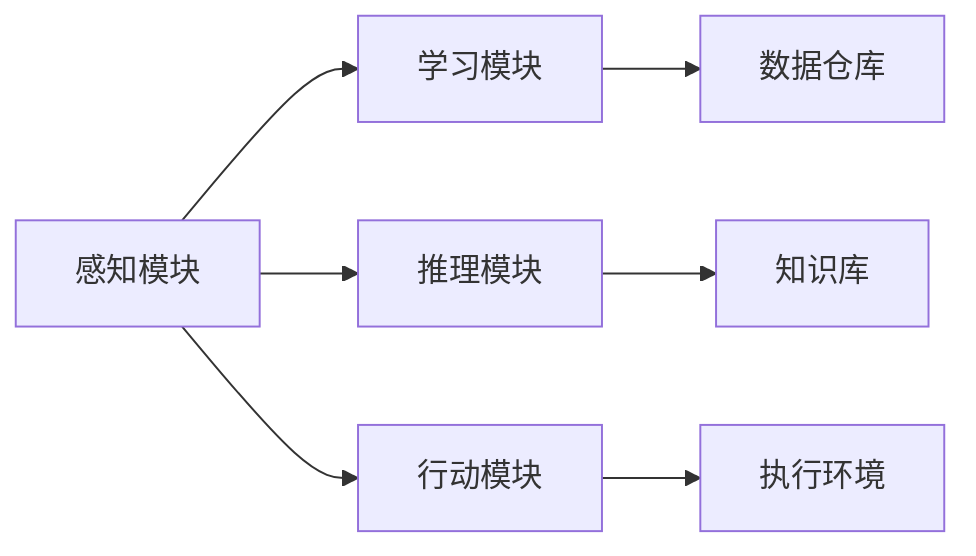
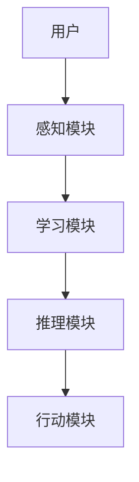
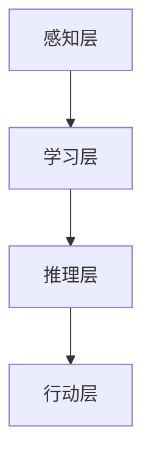
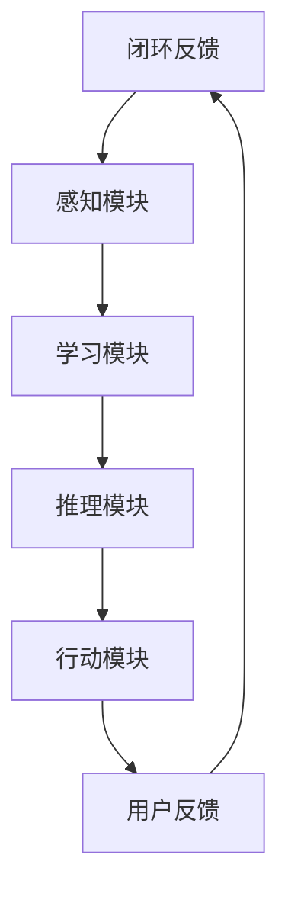

                 


## 《AI Agent基础：企业应用中的核心概念与重要性》

### 文章关键词
- AI Agent
- 企业应用
- 核心概念
- 算法原理
- 系统架构设计

### 摘要
本文深入探讨了AI Agent在企业应用中的核心概念、重要性及其实现原理。通过逐步分析，我们明确了AI Agent的基本组成部分，详细讲解了感知、学习、推理和行动等核心概念的内涵与联系，并结合实际案例，展示了其在企业中的具体应用和系统架构设计。文章旨在为读者提供关于AI Agent的全面理解和实践指导。

---

### 第一部分：AI Agent概述

#### 第1章：AI Agent的背景与发展

**1.1 问题背景**

AI Agent，作为人工智能领域的一个重要分支，近年来在企业应用中展现出巨大的潜力。本节我们将探讨AI Agent的定义、其在企业中的应用、发展现状以及未来趋势。

**1.1.1 AI Agent的定义**

AI Agent，即人工智能代理，是一种能够自主感知环境、学习、推理并采取行动的智能体。它可以在没有人为干预的情况下，执行特定的任务并做出决策。

**1.1.2 AI Agent在企业中的应用**

AI Agent在企业中的应用非常广泛，包括但不限于以下方面：
- **客户服务**：通过聊天机器人提供24/7的客户支持。
- **供应链管理**：优化库存管理，降低库存成本。
- **风险管理**：预测市场趋势，为企业提供投资建议。
- **人力资源**：自动处理招聘流程，提高招聘效率。

**1.1.3 AI Agent的发展现状与趋势**

随着技术的进步，AI Agent的发展现状令人瞩目。越来越多的企业开始将其应用于实际业务中，从而提高效率和降低成本。未来，AI Agent的发展趋势将包括：
- **智能化**：AI Agent将更加智能化，能够处理更复杂的任务。
- **泛在化**：AI Agent将应用到更多的领域和行业。
- **人机协作**：AI Agent将更加强调与人类用户的协作，提高用户体验。

**1.2 问题描述**

**1.2.1 企业面临的挑战**

- **数据管理**：企业面临着海量数据的管理挑战，需要高效的数据处理和分析能力。
- **决策支持**：企业需要智能化的决策支持系统，以应对快速变化的市场环境。
- **成本控制**：企业需要降低运营成本，提高盈利能力。

**1.2.2 AI Agent解决的问题**

AI Agent可以通过以下方式解决企业面临的挑战：
- **自动化**：通过自动化流程，降低人工干预，提高工作效率。
- **数据分析**：利用AI Agent的数据分析能力，为企业提供精准的决策支持。
- **成本优化**：通过智能化的资源管理，降低运营成本。

**1.2.3 AI Agent的优势与局限**

**优势**：
- **高效性**：AI Agent可以快速处理大量数据，提供高效的决策支持。
- **准确性**：AI Agent基于数据驱动，可以提供更加准确的预测和分析。
- **灵活性**：AI Agent可以适应不同的业务场景，提供定制化的解决方案。

**局限**：
- **依赖数据质量**：AI Agent的性能高度依赖于数据的质量，数据不准确将影响其表现。
- **解释性**：AI Agent的决策过程通常缺乏透明度，难以解释。

**1.3 问题解决**

**1.3.1 AI Agent的核心技术**

AI Agent的核心技术包括：
- **感知**：通过传感器和数据采集设备获取环境信息。
- **学习**：利用机器学习算法从数据中学习模式和规律。
- **推理**：基于学习到的模式和规律，进行逻辑推理和决策。
- **行动**：执行决策，采取行动。

**1.3.2 AI Agent的关键组件**

AI Agent的关键组件包括：
- **感知模块**：负责感知环境信息。
- **学习模块**：负责从数据中学习。
- **推理模块**：负责逻辑推理和决策。
- **行动模块**：负责执行决策。

**1.3.3 AI Agent的实现步骤**

实现AI Agent的一般步骤如下：
1. **需求分析**：明确AI Agent的应用场景和目标。
2. **数据收集**：收集与AI Agent应用相关的数据。
3. **模型训练**：利用收集的数据训练AI Agent模型。
4. **测试与优化**：对AI Agent进行测试，并根据测试结果进行优化。
5. **部署与运行**：将AI Agent部署到实际环境中，进行运行。

**1.4 边界与外延**

**1.4.1 AI Agent的分类**

AI Agent可以根据不同的标准进行分类，常见的分类方法包括：
- **基于任务**：根据AI Agent执行的任务进行分类，如客户服务Agent、财务报表分析Agent等。
- **基于架构**：根据AI Agent的架构进行分类，如基于规则的Agent、基于模型的Agent等。

**1.4.2 AI Agent的层次结构**

AI Agent的层次结构通常包括：
- **感知层**：负责感知环境信息。
- **学习层**：负责从数据中学习。
- **推理层**：负责逻辑推理和决策。
- **行动层**：负责执行决策。

**1.4.3 AI Agent的应用领域**

AI Agent的应用领域非常广泛，包括但不限于：
- **金融**：风险管理、投资顾问等。
- **医疗**：疾病诊断、患者管理等。
- **制造**：生产优化、质量控制等。
- **交通**：智能交通管理、自动驾驶等。

#### 第2章：AI Agent的核心概念与联系

**2.1 核心概念**

AI Agent的核心概念包括：
- **感知**：通过传感器和数据采集设备获取环境信息。
- **学习**：利用机器学习算法从数据中学习模式和规律。
- **推理**：基于学习到的模式和规律，进行逻辑推理和决策。
- **行动**：执行决策，采取行动。

**2.2 概念属性特征对比**

| 概念 | 特征1 | 特征2 | 特征3 |
|------|-------|-------|-------|
| 感知 | 实时性 | 数据来源多样性 | 数据预处理需求 |
| 学习 | 数据依赖 | 学习效率 | 模型可解释性 |
| 推理 | 知识表示 | 推理速度 | 推理准确性 |
| 行动 | 行动策略多样性 | 行动效果评估 | 行动反馈学习 |

**2.3 ER实体关系图**



#### 第3章：AI Agent算法原理讲解

**3.1 监督学习算法**

**3.1.1 算法原理**

监督学习算法是AI Agent中常用的一种算法。其基本原理是利用标记好的训练数据，通过学习输入和输出之间的关系，建立预测模型。

**3.1.2 Python代码实现**

```python
# Python代码实现
```

**3.1.3 LaTeX公式**

$$
y = \hat{f}(x; \theta)
$$`

**3.1.4 举例说明**

假设我们有一个分类问题，需要将数据分为两类。通过监督学习算法，我们可以学习到一个模型，能够对新的数据进行分类。

**3.2 无监督学习算法**

**3.2.1 算法原理**

无监督学习算法是AI Agent中另一种重要的算法。其基本原理是利用未标记的数据，自动发现数据中的模式和规律。

**3.2.2 Python代码实现**

```python
# Python代码实现
```

**3.2.3 LaTeX公式**

$$
x \sim P(\cdot | \theta)
$$`

**3.2.4 举例说明**

假设我们有一组未标记的数据，通过无监督学习算法，我们可以发现数据中的聚类结构，从而对数据进行分类。

#### 第4章：AI Agent系统分析与架构设计

**4.1 问题场景介绍**

在本节中，我们将介绍一个典型的AI Agent系统，并分析其问题场景、需求和目标。

**4.2 系统功能设计**

**4.2.1 领域模型**



**4.2.2 系统功能模块**

- **感知模块**：负责感知环境信息，如用户行为、市场数据等。
- **学习模块**：负责从感知模块获取的数据中学习，建立模型。
- **推理模块**：负责利用学习到的模型进行推理，做出决策。
- **行动模块**：负责执行决策，采取行动。

**4.3 系统架构设计**

**4.3.1 架构设计**



**4.3.2 系统接口设计**

系统接口设计包括以下部分：

- **数据接口**：负责数据传输和存储。
- **控制接口**：负责系统控制和调度。
- **用户接口**：负责用户交互和数据展示。

**4.3.3 系统交互**



#### 第5章：项目实战

**5.1 环境安装**

在本节中，我们将介绍如何安装和配置AI Agent的开发环境，包括所需的软件和硬件。

**5.2 系统核心实现**

**5.2.1 感知模块**

```python
# 感知模块代码
```

**5.2.2 学习模块**

```python
# 学习模块代码
```

**5.2.3 推理模块**

```python
# 推理模块代码
```

**5.2.4 行动模块**

```python
# 行动模块代码
```

**5.3 案例分析与解读**

在本节中，我们将分析一个实际的AI Agent项目案例，并对其进行解读。

**5.4 项目小结**

在本节中，我们将对项目进行总结，并给出实践经验和建议。

#### 第6章：最佳实践、小结与拓展阅读

**6.1 最佳实践**

在本节中，我们将总结一些关于AI Agent应用的最佳实践。

**6.2 小结**

在本节中，我们将回顾文章的核心内容和关键点。

**6.3 拓展阅读**

在本节中，我们将推荐一些关于AI Agent的拓展阅读资源。

### 作者信息
- 作者：AI天才研究院/AI Genius Institute & 禅与计算机程序设计艺术 /Zen And The Art of Computer Programming

---

以上就是《AI Agent基础：企业应用中的核心概念与重要性》的完整目录大纲和部分内容。在接下来的章节中，我们将深入探讨AI Agent的核心概念、算法原理、系统架构设计以及实际应用案例，帮助读者全面了解AI Agent在企业中的应用和价值。让我们一步步分析推理，共同探索AI Agent的奥秘。

