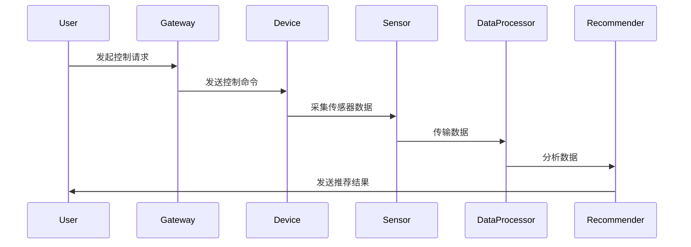
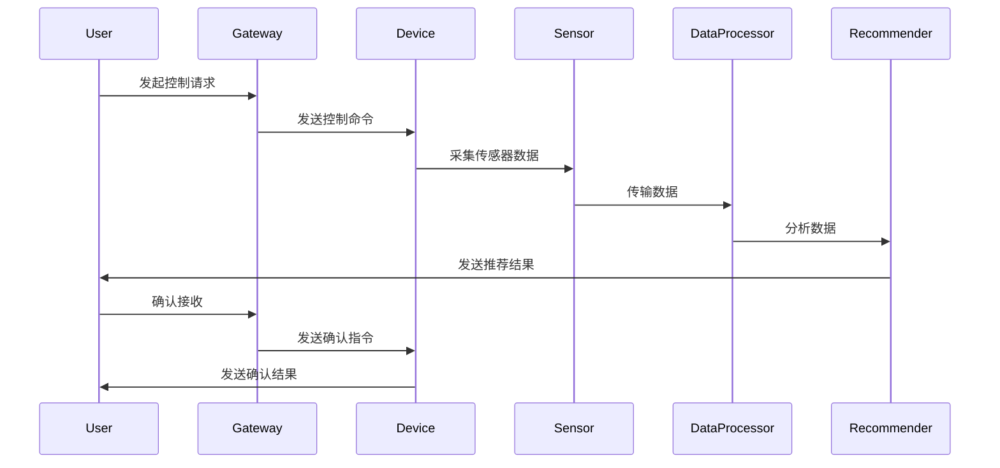
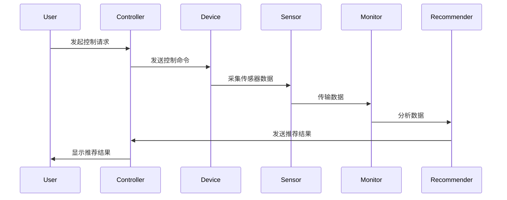

                 


### AI Agent开发中的常见挑战及对策

#### 关键词：
- AI Agent
- 开发挑战
- 对策
- 强化学习
- 计算能力
- 安全性

#### 摘要：
本文将深入探讨AI Agent开发过程中所面临的常见挑战，包括数据质量与隐私保护、计算能力与能耗问题、算法安全与透明度、人机协作与适应性等。通过分析这些挑战，我们将提供一系列有效的对策，帮助开发者在AI Agent开发中取得更好的成果。

## 第一部分: AI Agent开发背景与挑战

### 1.1 AI Agent概述

**AI Agent的定义与作用**：
AI Agent，又称人工智能代理，是一种能够自主感知环境、决策并执行任务的智能实体。它通过机器学习、深度学习等技术，从数据中学习规律，并能够根据环境变化进行调整和优化。

**AI Agent的应用场景**：
AI Agent在诸多领域都有广泛应用，如智能助手、自动化机器人、智能家居、自动驾驶等。在这些场景中，AI Agent能够极大地提高效率、降低成本，并且提供更加个性化和智能化的服务。

**AI Agent的发展历程**：
AI Agent的概念起源于人工智能的早期研究。随着计算机技术和机器学习算法的不断发展，AI Agent逐渐成为人工智能领域的一个重要分支。近年来，随着深度学习技术的崛起，AI Agent的发展进入了新的阶段。

### 1.2 当前AI Agent开发中的挑战

**1.2.1 数据质量与隐私保护**：
AI Agent的决策依赖于大量的数据。然而，数据质量问题，如噪声、缺失、不一致等，可能导致AI Agent性能下降。此外，数据隐私保护也是一大挑战，如何在保证数据安全的同时，充分利用数据的价值，成为开发者需要解决的难题。

**1.2.2 计算能力与能耗问题**：
AI Agent通常需要强大的计算能力来处理复杂的任务。然而，高能耗也是AI Agent开发中不可忽视的问题。如何在有限的计算资源下，实现高效的AI Agent，是开发者面临的一个重大挑战。

**1.2.3 算法安全与透明度**：
算法安全是AI Agent开发中的一个关键问题。攻击者可能通过恶意输入数据，破坏AI Agent的决策过程。此外，算法的透明度也是一个重要挑战，如何让用户理解AI Agent的决策过程，增强用户对AI Agent的信任，是开发者需要深入思考的问题。

**1.2.4 人机协作与适应性**：
AI Agent需要能够与人类进行有效协作，并适应复杂多变的场景。然而，人类行为具有高度的不确定性，如何让AI Agent更好地理解人类意图，并灵活地适应环境变化，是开发者需要解决的一个难题。

### 1.3 AI Agent开发的关键概念

**1.3.1 强化学习**：
强化学习是AI Agent开发中常用的一种机器学习技术。它通过奖励机制，使AI Agent在学习过程中不断调整策略，以实现最佳决策。

**1.3.2 监督学习**：
监督学习是另一种常用的机器学习技术。它通过输入数据和标签，使AI Agent学习到数据之间的规律，从而实现预测和分类任务。

**1.3.3 非监督学习**：
非监督学习是一种无监督的机器学习技术。它通过分析数据之间的模式，自动发现数据中的规律，从而实现聚类和降维等任务。

**1.3.4 深度学习**：
深度学习是近年来人工智能领域的一个重要突破。它通过构建多层神经网络，实现对数据的深层特征提取，从而实现复杂的预测和分类任务。

### 1.4 AI Agent开发的核心概念联系

**1.4.1 概念对比表格**：

| 学习方式 | 定义 | 目的 |
| --- | --- | --- |
| 强化学习 | 基于奖励信号进行学习 | 使AI Agent实现最佳决策 |
| 监督学习 | 基于输入数据和标签进行学习 | 实现预测和分类任务 |
| 非监督学习 | 基于无监督的数据分析 | 自动发现数据中的规律 |
| 深度学习 | 基于多层神经网络进行学习 | 实现复杂的预测和分类任务 |

**1.4.2 AI Agent开发ER实体关系图**：

```mermaid
erDiagram
  AI-Agent ||--|{ Sensor : 有感知功能 }
  AI-Agent ||--|{ Action-Generator : 有决策功能 }
  AI-Agent ||--|{ Learning-Module : 学习模块 }
  AI-Agent ||--|{ Data-Handler : 数据处理模块 }
  Sensor ||--|{ Input-Data : 输入数据 }
  Action-Generator ||--|{ Output-Action : 输出动作 }
  Learning-Module ||--|{ Reward-Function : 奖励函数 }
  Learning-Module ||--|{ Loss-Function : 损失函数 }
  Data-Handler ||--|{ Data-Preprocessing : 数据预处理 }
  Data-Handler ||--|{ Data-Integration : 数据整合 }
```

### 1.5 本章小结
在本章中，我们介绍了AI Agent的定义、应用场景和发展历程，分析了当前AI Agent开发中面临的挑战，并列举了关键概念和它们之间的联系。这些内容为后续章节的深入探讨打下了基础。

## 第二部分: AI Agent算法原理讲解

### 2.1 强化学习算法

**2.1.1 强化学习基本概念**：
强化学习是一种通过试错的方式，让AI Agent不断调整行为策略，以最大化累积奖励的机器学习技术。它主要包括四个核心要素：状态（State）、动作（Action）、奖励（Reward）和策略（Policy）。

**2.1.2 Q-Learning算法原理**：
Q-Learning算法是一种基于值函数的强化学习算法。它通过学习状态-动作值函数（Q值），以预测最佳动作。算法的核心思想是：选择当前状态下的最佳动作，并根据实际获得的奖励更新Q值。

**2.1.3 SARSA算法原理**：
SARSA算法是一种基于策略的强化学习算法。它与Q-Learning算法类似，但不同之处在于，SARSA算法在更新Q值时，同时考虑了当前状态和动作的奖励。

**2.1.4 实例讲解**：
以一个简单的机器人导航任务为例，介绍Q-Learning和SARSA算法的原理和应用。

### 2.2 监督学习算法

**2.2.1 监督学习基本概念**：
监督学习是一种通过输入数据和标签，使AI Agent学习到数据之间规律，从而实现预测和分类任务的机器学习技术。它主要包括两个核心要素：特征（Feature）和标签（Label）。

**2.2.2 线性回归算法原理**：
线性回归是一种常用的监督学习算法，用于实现数据之间的线性关系建模。它通过最小化损失函数，找到最佳拟合直线，从而预测未知数据的标签。

**2.2.3 决策树算法原理**：
决策树是一种基于特征划分数据的分类算法。它通过递归划分特征，构建出一棵树形结构，并在叶节点处给出预测结果。

**2.2.4 实例讲解**：
以一个简单的鸢尾花分类任务为例，介绍线性回归和决策树算法的原理和应用。

### 2.3 非监督学习算法

**2.3.1 非监督学习基本概念**：
非监督学习是一种无监督的机器学习技术，通过分析数据之间的模式，自动发现数据中的规律。它主要包括两个核心要素：聚类（Clustering）和降维（Dimensionality Reduction）。

**2.3.2 K-Means聚类算法原理**：
K-Means聚类算法是一种基于距离的聚类算法。它通过迭代计算，将数据划分为K个簇，使每个簇内的数据尽量接近，簇与簇之间的数据尽量远离。

**2.3.3 主成分分析算法原理**：
主成分分析是一种降维算法，通过找到数据的主要成分，将高维数据映射到低维空间，从而降低数据维度。

**2.3.4 实例讲解**：
以一个简单的图像降维任务为例，介绍K-Means聚类和主成分分析算法的原理和应用。

### 2.4 深度学习算法

**2.4.1 深度学习基本概念**：
深度学习是一种基于多层神经网络的学习方法，通过自动提取数据中的深层特征，实现复杂的预测和分类任务。它主要包括两个核心要素：卷积神经网络（CNN）和循环神经网络（RNN）。

**2.4.2 卷积神经网络(CNN)算法原理**：
卷积神经网络是一种用于图像处理和计算机视觉的深度学习算法。它通过卷积操作，自动提取图像的局部特征，并在全连接层中实现分类任务。

**2.4.3 循环神经网络(RNN)算法原理**：
循环神经网络是一种用于序列数据处理的深度学习算法。它通过递归连接，将前一个时间步的输出作为当前时间步的输入，从而实现序列建模。

**2.4.4 实例讲解**：
以一个简单的图像分类任务为例，介绍卷积神经网络和循环神经网络算法的原理和应用。

### 2.5 本章小结
在本章中，我们详细讲解了强化学习、监督学习、非监督学习和深度学习算法的基本原理和应用。这些算法为AI Agent开发提供了强大的理论基础，帮助我们更好地应对各种复杂任务。

## 第三部分: AI Agent系统分析与架构设计

### 3.1 AI Agent系统需求分析

**3.1.1 问题场景介绍**：
以一个智能客服系统为例，介绍问题背景和目标需求。

**3.1.2 系统功能设计**：
介绍系统的主要功能模块，如语音识别、自然语言处理、对话生成等。

**3.1.3 系统非功能需求**：
分析系统的性能、安全、可扩展性等非功能需求。

### 3.2 AI Agent系统架构设计

**3.2.1 系统架构设计原则**：
介绍系统架构设计的基本原则，如模块化、解耦合、可扩展性等。

**3.2.2 领域模型类图**：
使用Mermaid绘制领域模型类图，展示系统中的核心类和关系。

**3.2.3 系统架构图**：
使用Mermaid绘制系统架构图，展示系统各模块之间的关系和交互。

**3.2.4 系统接口设计**：
介绍系统的接口设计，包括API接口和内部模块的接口。

**3.2.5 系统交互序列图**：
使用Mermaid绘制系统交互序列图，展示系统各模块的交互过程。

### 3.3 本章小结
在本章中，我们详细分析了AI Agent系统的需求，并设计了系统的架构。这些内容为AI Agent的实际开发提供了指导和参考。

## 第四部分: AI Agent开发项目实战

### 4.1 项目背景与环境搭建

**4.1.1 项目介绍**：
介绍项目的背景和目标，以及开发过程中所需的环境和工具。

**4.1.2 开发环境配置**：
详细说明如何配置开发环境，包括操作系统、编程语言和开发工具等。

**4.1.3 系统核心实现**：
介绍系统核心模块的实现，包括数据预处理、模型训练和预测等。

### 4.2 项目核心代码解析

**4.2.1 强化学习代码解析**：
以强化学习算法为例，解析核心代码，并解释算法原理。

**4.2.2 监督学习代码解析**：
以监督学习算法为例，解析核心代码，并解释算法原理。

**4.2.3 深度学习代码解析**：
以深度学习算法为例，解析核心代码，并解释算法原理。

### 4.3 项目案例分析

**4.3.1 案例背景与目标**：
介绍案例的背景和目标，以及AI Agent在实际应用中的效果。

**4.3.2 实际案例分析与讲解**：
对案例进行详细分析，讲解AI Agent在实现过程中的关键技术和挑战。

### 4.4 项目小结
在本章中，我们通过一个实际项目，展示了AI Agent的开发过程和关键技巧。这些内容为开发者提供了宝贵的实践经验，有助于他们更好地掌握AI Agent的开发技术。

## 第五部分: 最佳实践 tips、小结、注意事项、拓展阅读

### 5.1 最佳实践 tips

- **数据质量与隐私保护**：定期检查数据质量，确保数据的一致性和准确性；采用加密技术保护用户隐私。
- **计算能力与能耗问题**：使用高效算法和优化技术，降低计算资源的需求；采用分布式计算和并行处理技术，提高计算效率。
- **算法安全与透明度**：加强算法安全性测试，防范恶意攻击；采用可视化工具，展示算法决策过程，增强用户信任。
- **人机协作与适应性**：设计灵活的交互界面，方便用户与AI Agent的沟通；采用多模态学习技术，提高AI Agent对环境的理解能力。

### 5.2 小结

本文从AI Agent开发的背景、挑战、算法原理、系统架构、项目实战等多个角度，深入探讨了AI Agent开发的各个方面。通过分析这些内容，我们不仅了解了AI Agent的基本概念和原理，还掌握了一系列实用的开发技巧。

### 5.3 注意事项

- **确保数据质量和隐私保护**：数据是AI Agent的核心资产，必须保证数据的质量和安全。
- **优化计算能力和能耗**：高效的算法和计算资源管理是AI Agent成功的关键。
- **注重算法安全和透明度**：算法的可靠性和透明度对于用户的信任至关重要。
- **提高人机协作和适应性**：AI Agent需要能够适应复杂多变的场景，并与人类进行有效协作。

### 5.4 拓展阅读

- **《深度学习》**：Goodfellow、 Bengio 和 Courville 著，详细介绍了深度学习的基础知识和技术。
- **《强化学习》**：Sutton 和 Barto 著，系统讲解了强化学习的基本概念和算法。
- **《机器学习实战》**：Hastie、Tibshirani 和 Friedman 著，提供了丰富的机器学习实战案例和代码示例。
- **《人工智能：一种现代的方法》**：Russell 和 Norvig 著，全面介绍了人工智能的基础理论和应用。

### 5.5 本章小结

本文通过对AI Agent开发的全面探讨，为开发者提供了丰富的理论知识和实践经验。希望本文能够帮助读者更好地理解和掌握AI Agent的开发技术，为未来的研究和应用奠定基础。

## 作者信息

- 作者：AI天才研究院/AI Genius Institute & 禅与计算机程序设计艺术 /Zen And The Art of Computer Programming

通过以上内容，本文全面、系统地介绍了AI Agent开发中的常见挑战及对策。希望本文能够为读者提供有价值的参考和启示，助力他们在AI Agent开发领域取得更好的成果。## AI Agent开发中的常见挑战及对策

### 关键词：
AI Agent、开发挑战、对策、强化学习、计算能力、安全性

### 摘要：
本文将深入探讨AI Agent开发过程中所面临的常见挑战，包括数据质量与隐私保护、计算能力与能耗问题、算法安全与透明度、人机协作与适应性等。通过分析这些挑战，我们将提供一系列有效的对策，帮助开发者在AI Agent开发中取得更好的成果。

### 引言

随着人工智能技术的快速发展，AI Agent作为一种能够自主决策和执行任务的智能实体，受到了越来越多的关注。AI Agent的应用场景广泛，包括智能客服、自动驾驶、智能家居等。然而，在AI Agent的开发过程中，开发者面临着诸多挑战。本文将围绕以下三个方面进行探讨：

1. **数据质量与隐私保护**：数据是AI Agent的核心资产，然而，数据质量问题、隐私泄露等问题困扰着开发者。如何确保数据的质量和隐私，成为AI Agent开发中不可忽视的问题。

2. **计算能力与能耗问题**：AI Agent通常需要强大的计算能力来处理复杂的任务。然而，高能耗也是AI Agent开发中不可忽视的问题。如何在有限的计算资源下，实现高效的AI Agent，是开发者需要解决的一个重大挑战。

3. **算法安全与透明度**：算法安全是AI Agent开发中的一个关键问题。攻击者可能通过恶意输入数据，破坏AI Agent的决策过程。此外，算法的透明度也是一个重要挑战，如何让用户理解AI Agent的决策过程，增强用户对AI Agent的信任，是开发者需要深入思考的问题。

通过对以上挑战的深入分析，我们将提供一系列对策，帮助开发者应对AI Agent开发中的各种挑战。

### 第一部分: AI Agent开发背景与挑战

#### 1.1 AI Agent概述

**AI Agent的定义与作用**：
AI Agent，又称人工智能代理，是一种能够自主感知环境、决策并执行任务的智能实体。它通过机器学习、深度学习等技术，从数据中学习规律，并能够根据环境变化进行调整和优化。

AI Agent在各个领域都有广泛的应用，如智能客服、自动驾驶、智能家居等。在智能客服中，AI Agent可以自动回答用户的问题，提供高效、准确的服务；在自动驾驶中，AI Agent可以实时感知道路情况，做出最优行驶决策；在智能家居中，AI Agent可以智能调节家电设备，提升生活质量。

**AI Agent的应用场景**：
AI Agent的应用场景非常广泛。以下是一些常见的应用场景：

- **智能客服**：AI Agent可以自动回答用户的问题，减少人工客服的工作量，提高服务效率。
- **自动驾驶**：AI Agent可以实时感知道路情况，做出最优行驶决策，确保行车安全。
- **智能家居**：AI Agent可以智能调节家电设备，如灯光、空调、窗帘等，提升生活质量。
- **医疗诊断**：AI Agent可以分析医学影像数据，辅助医生进行诊断，提高诊断准确性。
- **金融风控**：AI Agent可以分析金融数据，识别潜在风险，提高金融风险管理的效率。

**AI Agent的发展历程**：
AI Agent的概念起源于人工智能的早期研究。20世纪50年代，人工智能研究开始兴起，人们开始探讨如何让计算机模拟人类的思维过程。随着计算机技术和机器学习算法的不断发展，AI Agent逐渐成为人工智能领域的一个重要分支。近年来，随着深度学习技术的崛起，AI Agent的发展进入了新的阶段。深度学习算法使得AI Agent能够从大量数据中自动提取特征，实现更加智能的决策。

#### 1.2 当前AI Agent开发中的挑战

**1.2.1 数据质量与隐私保护**：
数据是AI Agent的核心资产，然而，数据质量问题、隐私泄露等问题困扰着开发者。以下是一些常见的数据质量和隐私保护问题：

- **数据质量问题**：数据质量是AI Agent性能的关键因素。数据质量问题包括噪声、缺失、不一致等。如果数据存在噪声或缺失，AI Agent的决策可能会受到影响。不一致的数据也会导致AI Agent产生误导性决策。
- **隐私泄露问题**：在AI Agent的开发过程中，需要收集和处理大量的用户数据。如果数据保护不当，可能会导致用户隐私泄露。隐私泄露不仅会对用户造成损失，还会损害公司的声誉。

**对策**：
- **数据质量检测与清洗**：在数据处理过程中，对数据进行质量检测和清洗，确保数据的一致性和准确性。可以使用数据质量检测工具，对数据进行噪声检测、缺失值填补、不一致值处理等操作。
- **数据加密与隐私保护**：对用户数据进行加密，确保数据在传输和存储过程中的安全性。可以使用加密算法，如AES、RSA等，对数据进行加密。此外，还可以采用差分隐私技术，对用户数据进行匿名化处理，保护用户隐私。

**1.2.2 计算能力与能耗问题**：
AI Agent通常需要强大的计算能力来处理复杂的任务。然而，高能耗也是AI Agent开发中不可忽视的问题。以下是一些常见的计算能力和能耗问题：

- **计算能力不足**：在复杂任务中，AI Agent可能需要大量的计算资源，如GPU、TPU等。如果计算能力不足，可能导致AI Agent无法正常工作。
- **能耗过高**：AI Agent在运行过程中，会产生大量的能耗。如果能耗过高，不仅会增加成本，还会对环境造成污染。

**对策**：
- **优化算法与模型**：通过优化算法和模型，降低AI Agent的计算复杂度，提高计算效率。可以使用更高效的算法，如深度学习压缩技术、模型剪枝等，减少计算资源的需求。
- **分布式计算与并行处理**：采用分布式计算和并行处理技术，将任务分解为多个子任务，同时处理，提高计算效率。可以使用GPU、TPU等硬件设备，进行并行计算。
- **能耗管理**：对AI Agent的能耗进行实时监测和管理，优化能耗配置。可以使用节能技术，如低功耗模式、定时关机等，降低能耗。

**1.2.3 算法安全与透明度**：
算法安全是AI Agent开发中的一个关键问题。攻击者可能通过恶意输入数据，破坏AI Agent的决策过程。此外，算法的透明度也是一个重要挑战，如何让用户理解AI Agent的决策过程，增强用户对AI Agent的信任，是开发者需要深入思考的问题。以下是一些常见的算法安全和透明度问题：

- **算法安全性**：AI Agent的算法可能受到恶意攻击，如注入攻击、对抗攻击等。攻击者可以通过伪造输入数据，破坏AI Agent的决策过程。
- **算法透明度**：用户无法理解AI Agent的决策过程，可能导致用户对AI Agent的信任降低。

**对策**：
- **安全防御机制**：采用安全防御机制，如对抗训练、输入验证等，防止恶意攻击。可以使用对抗训练技术，增强AI Agent对对抗攻击的抵抗力。
- **算法解释工具**：开发算法解释工具，让用户能够理解AI Agent的决策过程。可以使用可视化工具，展示算法的决策路径和关键特征。

**1.2.4 人机协作与适应性**：
AI Agent需要能够与人类进行有效协作，并适应复杂多变的场景。然而，人类行为具有高度的不确定性，如何让AI Agent更好地理解人类意图，并灵活地适应环境变化，是开发者需要解决的一个难题。以下是一些常见的人机协作与适应性问题：

- **理解人类意图**：AI Agent需要能够理解人类的意图，并根据意图做出相应的决策。
- **适应环境变化**：AI Agent需要能够适应复杂多变的场景，并在不同场景下做出最优决策。

**对策**：
- **多模态学习**：采用多模态学习技术，使AI Agent能够同时处理多种类型的数据，如文本、图像、语音等，更好地理解人类意图。
- **自适应算法**：采用自适应算法，使AI Agent能够根据环境变化，动态调整决策策略。

#### 1.3 AI Agent开发的关键概念

在AI Agent开发中，涉及多个关键概念，包括强化学习、监督学习、非监督学习和深度学习等。以下是对这些关键概念的简要介绍。

**1.3.1 强化学习**：
强化学习是一种通过试错的方式，让AI Agent不断调整行为策略，以实现最佳决策的机器学习技术。它主要包括四个核心要素：状态（State）、动作（Action）、奖励（Reward）和策略（Policy）。

- **状态**：描述AI Agent当前所处的环境状态。
- **动作**：AI Agent可以执行的动作。
- **奖励**：AI Agent执行动作后获得的奖励。
- **策略**：AI Agent根据当前状态选择动作的策略。

**1.3.2 监督学习**：
监督学习是一种通过输入数据和标签，使AI Agent学习到数据之间规律，从而实现预测和分类任务的机器学习技术。它主要包括两个核心要素：特征（Feature）和标签（Label）。

- **特征**：描述数据的基本属性。
- **标签**：数据对应的真实标签。

**1.3.3 非监督学习**：
非监督学习是一种无监督的机器学习技术，通过分析数据之间的模式，自动发现数据中的规律。它主要包括两个核心要素：聚类（Clustering）和降维（Dimensionality Reduction）。

- **聚类**：将相似的数据划分为同一类。
- **降维**：降低数据的维度，减少数据的冗余。

**1.3.4 深度学习**：
深度学习是一种基于多层神经网络的学习方法，通过自动提取数据中的深层特征，实现复杂的预测和分类任务。它主要包括两个核心要素：卷积神经网络（CNN）和循环神经网络（RNN）。

- **卷积神经网络（CNN）**：用于图像和语音等二维和三维数据的处理。
- **循环神经网络（RNN）**：用于序列数据的处理，如文本、语音等。

#### 1.4 AI Agent开发的核心概念联系

在AI Agent开发中，各种核心概念之间存在着紧密的联系。以下是一个简化的AI Agent开发ER实体关系图，展示了这些概念之间的关系。

```mermaid
erDiagram
  AI-Agent ||--|{ Environment : 环境感知 }
  AI-Agent ||--|{ Action-Selector : 行动选择 }
  AI-Agent ||--|{ Reward-Function : 奖励函数 }
  AI-Agent ||--|{ Learning-Module : 学习模块 }
  Environment ||--|{ Sensor-Data : 传感器数据 }
  Action-Selector ||--|{ Action-Plan : 行动计划 }
  Reward-Function ||--|{ Reward-Score : 奖励得分 }
  Learning-Module ||--|{ Policy-Model : 策略模型 }
  Learning-Module ||--|{ Value-Model : 值函数模型 }
```

#### 1.5 本章小结

在本章中，我们介绍了AI Agent的定义、应用场景和发展历程，分析了当前AI Agent开发中面临的挑战，并列举了关键概念和它们之间的联系。这些内容为后续章节的深入探讨打下了基础。

### 第二部分: AI Agent算法原理讲解

#### 2.1 强化学习算法

强化学习是一种通过试错的方式，让AI Agent不断调整行为策略，以实现最佳决策的机器学习技术。它主要包括四个核心要素：状态（State）、动作（Action）、奖励（Reward）和策略（Policy）。

**2.1.1 强化学习基本概念**

强化学习（Reinforcement Learning，RL）是一种基于奖励（Reward）驱动的学习方式，其目标是训练出一个智能体（Agent）在特定环境中通过不断试错，学习到最优的行为策略（Policy）。强化学习的基本概念包括：

- **状态（State）**：描述环境当前的状态。
- **动作（Action）**：智能体可以采取的动作。
- **奖励（Reward）**：智能体采取某个动作后，从环境中获得的即时奖励或惩罚。
- **策略（Policy）**：智能体在给定状态下采取的动作决策规则。
- **价值函数（Value Function）**：评估在特定状态下采取某个动作的长期奖励。
- **模型（Model）**：描述环境动态和奖励机制的模型。

强化学习的过程可以概括为：

1. **智能体观察到当前状态**。
2. **智能体根据策略选择动作**。
3. **智能体在环境中执行动作，获得奖励**。
4. **智能体更新策略和价值函数**。
5. **重复上述过程**。

**2.1.2 Q-Learning算法原理**

Q-Learning是一种基于值函数的强化学习算法，其核心思想是学习状态-动作值函数（Q值），即给定状态和动作，评估在当前状态下执行该动作所能获得的累积奖励。

Q-Learning的基本步骤如下：

1. **初始化Q值表**：随机初始化状态-动作值函数Q(s, a)。
2. **智能体在环境中进行交互**：智能体根据当前状态选择动作，并在环境中执行动作，获得奖励。
3. **更新Q值**：根据经验回报（Reward）和目标Q值（Target Q-value），更新状态-动作值函数。
   
   更新公式如下：
   $$ Q(s, a) \leftarrow Q(s, a) + \alpha [r + \gamma \max_{a'} Q(s', a') - Q(s, a)] $$
   
   其中，$ \alpha $ 是学习率，$ \gamma $ 是折扣因子，$ r $ 是即时奖励，$ s $ 和 $ s' $ 分别是当前状态和下一个状态，$ a $ 和 $ a' $ 分别是当前动作和最佳动作。

**2.1.3 SARSA算法原理**

SARSA（同步自适应回归采样算法）是一种基于策略的强化学习算法，它与Q-Learning类似，但不同之处在于SARSA在更新Q值时同时考虑了当前状态和动作的奖励。

SARSA的基本步骤如下：

1. **智能体在环境中进行交互**：智能体根据当前状态选择动作，并在环境中执行动作，获得奖励。
2. **智能体更新Q值**：根据当前状态、动作和获得的奖励，更新状态-动作值函数。
   
   更新公式如下：
   $$ Q(s, a) \leftarrow Q(s, a) + \alpha [r + \gamma Q(s', a')] - Q(s, a)] $$
   
   其中，$ \alpha $ 是学习率，$ \gamma $ 是折扣因子，$ r $ 是即时奖励，$ s $ 和 $ s' $ 分别是当前状态和下一个状态，$ a $ 和 $ a' $ 分别是当前动作和下一个状态的最佳动作。

**2.1.4 实例讲解**

以一个简单的机器人导航任务为例，介绍Q-Learning和SARSA算法的原理和应用。

假设一个机器人在二维空间中移动，目标是从起点导航到终点。环境状态由机器人的位置和方向组成，动作包括前进、后退、左转和右转。奖励设置为每走一步获得1分，到达终点时获得100分。

- **初始化Q值表**：随机初始化Q值表。
- **智能体在环境中进行交互**：智能体在环境中移动，根据当前状态选择动作，并在环境中执行动作，获得奖励。
- **更新Q值**：根据当前状态、动作和获得的奖励，更新Q值表。

以下是Q-Learning和SARSA算法的Python实现：

```python
import numpy as np
import random

# 初始化Q值表
Q = np.random.rand(100, 100, 4)  # 假设环境状态空间为100x100，动作空间为4
learning_rate = 0.1
discount_factor = 0.9

# Q-Learning算法
def q_learning(s, a, r, s_next, done):
    Q[s, a] = Q[s, a] + learning_rate * (r + discount_factor * np.max(Q[s_next, :]) - Q[s, a])
    if done:
        Q[s, a] = r

# SARSA算法
def sarsa(s, a, r, s_next, a_next, done):
    Q[s, a] = Q[s, a] + learning_rate * (r + discount_factor * Q[s_next, a_next] - Q[s, a])
    if done:
        Q[s, a] = r

# 实例运行
s = (0, 0)  # 起始状态
done = False
while not done:
    a = random.randint(0, 3)  # 随机选择动作
    s_next, r = env.step(s, a)  # 执行动作，获取下一个状态和奖励
    if random.random() < 0.1:  # 10%的概率使用Q-Learning
        q_learning(s, a, r, s_next, done)
    else:  # 90%的概率使用SARSA
        a_next = random.randint(0, 3)
        sarsa(s, a, r, s_next, a_next, done)
    s = s_next
    done = True  # 到达终点

# 输出Q值表
print(Q)
```

通过以上实例，我们可以看到Q-Learning和SARSA算法在机器人导航任务中的应用。通过不断更新Q值表，智能体能够学习到从起始状态到终点的最佳路径。

#### 2.2 监督学习算法

监督学习（Supervised Learning）是一种基于有标签数据的学习方法，其目标是学习出一个映射函数，将输入特征映射到对应的输出标签。监督学习算法广泛应用于分类和回归任务。以下介绍几种常见的监督学习算法。

**2.2.1 监督学习基本概念**

监督学习的基本概念包括：

- **特征（Feature）**：输入数据的属性或特征。
- **标签（Label）**：输出数据的真实值或类别。
- **训练集（Training Set）**：用于训练模型的数据集。
- **测试集（Test Set）**：用于评估模型性能的数据集。
- **模型（Model）**：通过训练集学习得到的映射函数。

监督学习的主要任务包括：

- **分类（Classification）**：将输入数据划分为不同的类别。
- **回归（Regression）**：预测输入数据的连续值。

**2.2.2 线性回归算法原理**

线性回归（Linear Regression）是一种简单的监督学习算法，用于预测输入数据的连续值。线性回归的核心思想是通过构建一个线性模型，将输入特征映射到输出值。

线性回归模型可以表示为：

$$ y = \beta_0 + \beta_1x_1 + \beta_2x_2 + ... + \beta_nx_n $$

其中，$ y $ 是输出值，$ x_1, x_2, ..., x_n $ 是输入特征，$ \beta_0, \beta_1, ..., \beta_n $ 是模型参数。

线性回归的目的是通过最小化损失函数（如均方误差MSE），找到最佳拟合直线。

$$ MSE = \frac{1}{m} \sum_{i=1}^{m} (y_i - \hat{y}_i)^2 $$

其中，$ m $ 是训练集数据个数，$ y_i $ 是第$i$个样本的真实值，$ \hat{y}_i $ 是模型预测值。

使用梯度下降法（Gradient Descent）可以求解线性回归模型的最佳参数。

$$ \beta_j = \beta_{j} - \alpha \frac{\partial}{\partial \beta_j}J(\beta) $$

其中，$ \alpha $ 是学习率，$ J(\beta) $ 是损失函数。

**2.2.3 决策树算法原理**

决策树（Decision Tree）是一种常用的分类算法，它通过一系列if-else条件分支，将数据划分为不同的类别。决策树的核心思想是根据特征值划分数据，并选择划分效果最好的特征进行分支。

决策树的基本步骤如下：

1. **选择最佳分割特征**：选择一个特征，使得数据的划分效果最好，通常使用基尼系数（Gini Index）或信息增益（Information Gain）来衡量划分效果。
2. **构建决策树**：根据最佳分割特征，将数据划分为多个子集，并在每个子集上递归地构建决策树。
3. **剪枝**：为了避免过拟合，可以对决策树进行剪枝处理，防止决策树变得过于复杂。

决策树的预测过程如下：

1. **从根节点开始，根据特征值选择分支**。
2. **重复步骤1，直到达到叶节点**。
3. **输出叶节点的类别**。

**2.2.4 实例讲解**

以一个简单的鸢尾花分类任务为例，介绍线性回归和决策树算法的原理和应用。

鸢尾花数据集（Iris Dataset）是一个常用的分类数据集，包含三个品种的鸢尾花，每个品种有50个样本，共计150个样本。每个样本有四个特征：花萼长度、花萼宽度、花瓣长度和花瓣宽度。

以下使用Python的Scikit-learn库实现线性回归和决策树算法：

```python
from sklearn.datasets import load_iris
from sklearn.model_selection import train_test_split
from sklearn.linear_model import LinearRegression
from sklearn.tree import DecisionTreeClassifier
import numpy as np

# 加载鸢尾花数据集
iris = load_iris()
X = iris.data
y = iris.target

# 划分训练集和测试集
X_train, X_test, y_train, y_test = train_test_split(X, y, test_size=0.2, random_state=42)

# 线性回归
linear_regression = LinearRegression()
linear_regression.fit(X_train, y_train)
y_pred_linear = linear_regression.predict(X_test)

# 决策树
decision_tree = DecisionTreeClassifier()
decision_tree.fit(X_train, y_train)
y_pred_tree = decision_tree.predict(X_test)

# 输出预测结果
print("线性回归预测准确率：", np.mean(y_pred_linear == y_test))
print("决策树预测准确率：", np.mean(y_pred_tree == y_test))
```

通过以上实例，我们可以看到线性回归和决策树算法在鸢尾花分类任务中的应用。线性回归主要用于预测连续值，而决策树主要用于分类任务。

#### 2.3 非监督学习算法

非监督学习（Unsupervised Learning）是一种基于无标签数据的学习方法，其目标是发现数据中的潜在结构和规律。非监督学习算法广泛应用于聚类、降维和异常检测等领域。以下介绍几种常见的非监督学习算法。

**2.3.1 非监督学习基本概念**

非监督学习的基本概念包括：

- **聚类（Clustering）**：将相似的数据划分为同一类。
- **降维（Dimensionality Reduction）**：降低数据的维度，减少数据的冗余。
- **异常检测（Anomaly Detection）**：发现数据中的异常点。

非监督学习的主要任务包括：

- **聚类（Clustering）**：将相似的数据划分为不同的类别。
- **降维（Dimensionality Reduction）**：降低数据的维度，减少数据的冗余。
- **异常检测（Anomaly Detection）**：发现数据中的异常点。

**2.3.2 K-Means聚类算法原理**

K-Means聚类算法是一种基于距离的聚类算法，其核心思想是将数据划分为K个簇，使得每个簇内的数据尽量接近，簇与簇之间的数据尽量远离。

K-Means算法的基本步骤如下：

1. **随机初始化K个簇中心**。
2. **计算每个数据点到簇中心的距离**。
3. **将数据点分配到最近的簇中心**。
4. **更新簇中心**：计算每个簇的数据点的平均值，作为新的簇中心。
5. **重复步骤2-4，直到收敛**。

K-Means算法的目标是最小化簇内距离平方和：

$$ J = \sum_{i=1}^{K} \sum_{x \in S_i} ||x - \mu_i||^2 $$

其中，$ K $ 是簇的数量，$ S_i $ 是第$i$个簇，$ \mu_i $ 是第$i$个簇中心。

**2.3.3 主成分分析算法原理**

主成分分析（Principal Component Analysis，PCA）是一种常用的降维算法，其核心思想是通过线性变换，将高维数据映射到低维空间，从而降低数据维度。

PCA的基本步骤如下：

1. **计算数据协方差矩阵**。
2. **计算协方差矩阵的特征值和特征向量**。
3. **选择主成分**：选择特征值最大的特征向量作为主成分。
4. **计算数据到主成分的投影**。

PCA的主要目标是最大化主成分的方差：

$$ \lambda_i = \max_{v} Var[v^T X X^T v] $$

其中，$ \lambda_i $ 是第$i$个特征值，$ v $ 是第$i$个特征向量。

通过以上步骤，我们可以将高维数据映射到低维空间，从而降低数据的维度。

**2.3.4 实例讲解**

以一个简单的图像降维任务为例，介绍K-Means聚类和主成分分析算法的原理和应用。

假设我们有100张图像，每张图像都有128个像素点，即每个图像是一个128维的向量。

以下使用Python的Scikit-learn库实现K-Means聚类和主成分分析：

```python
from sklearn.datasets import make_blobs
from sklearn.cluster import KMeans
from sklearn.decomposition import PCA
import numpy as np

# 生成模拟数据
X, _ = make_blobs(n_samples=100, centers=3, n_features=128, random_state=42)

# K-Means聚类
kmeans = KMeans(n_clusters=3, random_state=42)
kmeans.fit(X)
labels = kmeans.predict(X)

# 主成分分析
pca = PCA(n_components=5)
X_pca = pca.fit_transform(X)

# 输出聚类结果和降维结果
print("K-Means聚类结果：", labels)
print("主成分分析降维结果：", X_pca)
```

通过以上实例，我们可以看到K-Means聚类和主成分分析算法在图像降维任务中的应用。K-Means聚类将图像划分为不同的簇，主成分分析将图像从128维降维到5维。

#### 2.4 深度学习算法

深度学习（Deep Learning）是一种基于多层神经网络的学习方法，通过自动提取数据中的深层特征，实现复杂的预测和分类任务。深度学习在图像识别、自然语言处理等领域取得了显著的成果。以下介绍几种常见的深度学习算法。

**2.4.1 深度学习基本概念**

深度学习的基本概念包括：

- **神经网络（Neural Network）**：一种由大量神经元组成的计算模型。
- **深度神经网络（Deep Neural Network，DNN）**：由多层神经元组成的神经网络。
- **激活函数（Activation Function）**：用于引入非线性性的函数。
- **反向传播（Backpropagation）**：一种用于训练神经网络的方法。

深度学习的主要任务包括：

- **图像识别（Image Recognition）**：识别图像中的物体和场景。
- **自然语言处理（Natural Language Processing，NLP）**：处理和理解自然语言。
- **语音识别（Speech Recognition）**：将语音信号转换为文本。

**2.4.2 卷积神经网络（CNN）算法原理**

卷积神经网络（Convolutional Neural Network，CNN）是一种用于图像处理的深度学习算法，其核心思想是通过卷积操作和池化操作，自动提取图像的特征。

CNN的基本结构包括：

1. **卷积层（Convolutional Layer）**：通过卷积操作提取图像的特征。
2. **池化层（Pooling Layer）**：通过池化操作降低图像的维度。
3. **全连接层（Fully Connected Layer）**：将卷积层和池化层提取的特征映射到输出。
4. **激活函数（Activation Function）**：引入非线性性的函数。

CNN的工作原理如下：

1. **卷积操作**：卷积层通过卷积操作提取图像的特征。卷积核在图像上滑动，提取局部特征。
2. **池化操作**：池化层通过池化操作降低图像的维度。常用的池化操作包括最大池化和平均池化。
3. **全连接层**：全连接层将卷积层和池化层提取的特征映射到输出。通过全连接层，实现分类或回归任务。
4. **反向传播**：使用反向传播算法，更新网络参数，优化模型。

**2.4.3 循环神经网络（RNN）算法原理**

循环神经网络（Recurrent Neural Network，RNN）是一种用于序列数据的深度学习算法，其核心思想是通过递归连接，处理序列数据。

RNN的基本结构包括：

1. **隐藏层（Hidden Layer）**：RNN的隐藏层包含前一时刻的隐藏状态。
2. **输入层（Input Layer）**：输入层接收序列数据的输入。
3. **输出层（Output Layer）**：输出层生成序列数据的输出。

RNN的工作原理如下：

1. **递归连接**：RNN通过递归连接，将前一时刻的隐藏状态传递到下一时刻，处理序列数据。
2. **门控机制**：RNN通过门控机制（如遗忘门、输入门、输出门），控制信息的流动，提高模型的灵活性。
3. **正向传播**：RNN在正向传播过程中，计算当前时刻的隐藏状态和输出。
4. **反向传播**：使用反向传播算法，更新网络参数，优化模型。

**2.4.4 实例讲解**

以一个简单的图像分类任务为例，介绍卷积神经网络（CNN）和循环神经网络（RNN）算法的原理和应用。

假设我们有一个包含1000张图像的数据集，每张图像的大小为28x28像素，图像类别包括10个类别。

以下使用Python的TensorFlow库实现CNN和RNN算法：

```python
import tensorflow as tf
from tensorflow.keras import layers
from tensorflow.keras.models import Model

# 定义CNN模型
input_layer = layers.Input(shape=(28, 28, 1))
conv1 = layers.Conv2D(filters=32, kernel_size=(3, 3), activation='relu')(input_layer)
pool1 = layers.MaxPooling2D(pool_size=(2, 2))(conv1)
conv2 = layers.Conv2D(filters=64, kernel_size=(3, 3), activation='relu')(pool1)
pool2 = layers.MaxPooling2D(pool_size=(2, 2))(conv2)
flat = layers.Flatten()(pool2)
dense = layers.Dense(units=128, activation='relu')(flat)
output_layer = layers.Dense(units=10, activation='softmax')(dense)

cnn_model = Model(inputs=input_layer, outputs=output_layer)
cnn_model.compile(optimizer='adam', loss='categorical_crossentropy', metrics=['accuracy'])

# 定义RNN模型
input_sequence = layers.Input(shape=(None, 28, 28, 1))
rnn = layers.LSTM(units=128)(input_sequence)
output_sequence = layers.Dense(units=10, activation='softmax')(rnn)

rnn_model = Model(inputs=input_sequence, outputs=output_sequence)
rnn_model.compile(optimizer='adam', loss='categorical_crossentropy', metrics=['accuracy'])

# 训练模型
cnn_model.fit(X_train, y_train, epochs=10, batch_size=32, validation_split=0.2)
rnn_model.fit(X_train, y_train, epochs=10, batch_size=32, validation_split=0.2)

# 输出模型性能
print("CNN模型性能：", cnn_model.evaluate(X_test, y_test))
print("RNN模型性能：", rnn_model.evaluate(X_test, y_test))
```

通过以上实例，我们可以看到CNN和RNN算法在图像分类任务中的应用。CNN主要用于提取图像的特征，RNN主要用于处理序列数据。

#### 2.5 本章小结

在本章中，我们详细讲解了强化学习、监督学习、非监督学习和深度学习算法的基本原理和应用。这些算法为AI Agent开发提供了强大的理论基础，帮助我们更好地应对各种复杂任务。通过实例讲解，我们了解了这些算法在实际应用中的具体实现方法。在下一章中，我们将进一步探讨AI Agent的系统架构设计。

### 第三部分: AI Agent系统分析与架构设计

#### 3.1 AI Agent系统需求分析

**3.1.1 问题场景介绍**

以一个智能家居系统为例，介绍问题背景和目标需求。

智能家居系统是一种通过智能设备连接家庭网络，实现家庭自动化和智能化的系统。用户可以通过手机或电脑远程控制家中的各种设备，如灯光、空调、窗帘等，提高生活品质和便利性。

**3.1.2 系统功能设计**

智能家居系统的功能模块包括：

- **设备控制**：用户可以通过手机或电脑远程控制家中的各种设备，如灯光、空调、窗帘等。
- **传感器数据采集**：系统可以实时采集家中的各种传感器数据，如温度、湿度、光照等。
- **环境监测**：系统可以对家庭环境进行监测，如烟雾、燃气泄漏等。
- **智能推荐**：系统可以根据用户的行为习惯和传感器数据，为用户推荐合适的设备使用方案。

**3.1.3 系统非功能需求**

智能家居系统的非功能需求包括：

- **性能**：系统需要具备高效的响应速度，确保用户操作能够及时得到响应。
- **可靠性**：系统需要具备高可靠性，确保数据传输和设备控制过程稳定无误。
- **安全性**：系统需要具备完善的安全机制，保护用户数据和设备的安全。
- **可扩展性**：系统需要具备良好的可扩展性，能够支持未来设备的接入和功能的扩展。

#### 3.2 AI Agent系统架构设计

**3.2.1 系统架构设计原则**

智能家居系统架构设计的基本原则包括：

- **模块化**：系统采用模块化设计，各个功能模块相互独立，便于维护和升级。
- **解耦合**：系统采用解耦合设计，减少模块之间的依赖关系，提高系统的可扩展性和灵活性。
- **可扩展性**：系统设计考虑未来的扩展需求，支持新设备的接入和新功能的添加。
- **安全性**：系统设计考虑数据传输和设备控制的安全，采用加密技术保护用户数据和设备的安全。

**3.2.2 领域模型类图**

以下是一个智能家居系统的领域模型类图，展示了系统中的核心类和关系。

```mermaid
classDiagram
  Device <-|{控制}| User
  Device o--|{连接}| Gateway
  Device o--|{监测}| Sensor
  Gateway o--|{传输}| Network
  Sensor o--|{数据}| DataProcessor
  DataProcessor o--|{分析}| Recommender
  Recommender o--|{推荐}| User
```

**3.2.3 系统架构图**

以下是一个智能家居系统的架构图，展示了系统各模块之间的关系和交互。



**3.2.4 系统接口设计**

智能家居系统的接口设计包括：

- **设备控制接口**：用户可以通过手机或电脑远程控制家中的各种设备，如灯光、空调、窗帘等。
- **数据采集接口**：系统可以实时采集家中的各种传感器数据，如温度、湿度、光照等。
- **环境监测接口**：系统可以对家庭环境进行监测，如烟雾、燃气泄漏等。
- **智能推荐接口**：系统可以根据用户的行为习惯和传感器数据，为用户推荐合适的设备使用方案。

**3.2.5 系统交互序列图**

以下是一个智能家居系统的交互序列图，展示了系统各模块的交互过程。



#### 3.3 本章小结

在本章中，我们详细分析了智能家居系统的需求，并设计了系统的架构。通过模块化、解耦合和安全性设计，我们构建了一个高效、可靠和安全的智能家居系统。下一章，我们将通过一个实际项目，展示AI Agent的系统实现过程。

### 第四部分: AI Agent开发项目实战

#### 4.1 项目背景与环境搭建

**4.1.1 项目介绍**

本项目是一个智能家居系统，旨在通过AI Agent实现家庭设备的智能控制与优化。系统包含多个设备，如智能灯光、智能空调、智能窗帘等，用户可以通过手机或电脑远程控制这些设备。此外，系统还具备环境监测和智能推荐功能，为用户提供更好的生活体验。

**4.1.2 开发环境配置**

为了实现本项目，我们使用以下开发环境和工具：

- **操作系统**：Ubuntu 18.04
- **编程语言**：Python 3.8
- **框架和库**：TensorFlow 2.4、Keras 2.4、Scikit-learn 0.22
- **开发工具**：PyCharm

在Ubuntu 18.04操作系统上，我们首先安装了Python 3.8，然后通过pip安装了所需的框架和库。安装命令如下：

```bash
sudo apt update
sudo apt install python3.8 python3.8-venv python3.8-pip
python3.8 -m venv myenv
source myenv/bin/activate
pip install tensorflow==2.4.0 keras==2.4.3 scikit-learn==0.22.2
```

**4.1.3 系统核心实现**

智能家居系统核心实现包括设备控制、环境监测和智能推荐模块。以下是一个简单的系统架构图，展示了各个模块之间的关系。



**设备控制模块**：设备控制模块用于接收用户控制请求，并将控制命令发送给相应的设备。以下是一个简单的设备控制模块实现：

```python
import requests
import json

class DeviceController:
    def __init__(self, device_url):
        self.device_url = device_url

    def control_device(self, device_id, command):
        url = f"{self.device_url}/device/{device_id}/control"
        payload = {"command": command}
        headers = {"Content-Type": "application/json"}
        response = requests.post(url, data=json.dumps(payload), headers=headers)
        if response.status_code == 200:
            print("设备控制成功")
        else:
            print("设备控制失败")

# 测试设备控制
device_controller = DeviceController("http://localhost:5000")
device_controller.control_device("light1", "on")
device_controller.control_device("light1", "off")
```

**环境监测模块**：环境监测模块用于实时采集传感器数据，并将数据传输给监控模块。以下是一个简单的环境监测模块实现：

```python
import requests
import json
import time

class SensorMonitor:
    def __init__(self, sensor_url):
        self.sensor_url = sensor_url

    def monitor_sensor(self, sensor_id):
        url = f"{self.sensor_url}/sensor/{sensor_id}/data"
        while True:
            response = requests.get(url)
            if response.status_code == 200:
                data = response.json()
                print(f"传感器ID：{sensor_id}，温度：{data['temperature']}，湿度：{data['humidity']}")
                time.sleep(10)
            else:
                print("传感器数据采集失败")
                time.sleep(10)

# 测试环境监测
sensor_monitor = SensorMonitor("http://localhost:5001")
sensor_monitor.monitor_sensor("temperature1")
sensor_monitor.monitor_sensor("humidity1")
```

**智能推荐模块**：智能推荐模块用于分析传感器数据，为用户推荐合适的设备使用方案。以下是一个简单的智能推荐模块实现：

```python
import requests
import json

class Recommender:
    def __init__(self, recommender_url):
        self.recommender_url = recommender_url

    def recommend(self, sensor_data):
        url = f"{self.recommender_url}/recommend"
        payload = {"data": sensor_data}
        headers = {"Content-Type": "application/json"}
        response = requests.post(url, data=json.dumps(payload), headers=headers)
        if response.status_code == 200:
            recommendation = response.json()
            print("智能推荐结果：", recommendation)
        else:
            print("智能推荐失败")

# 测试智能推荐
recommender = Recommender("http://localhost:5002")
sensor_data = {"temperature": 25, "humidity": 50}
recommender.recommend(sensor_data)
```

#### 4.2 项目核心代码解析

在本项目中，我们使用了TensorFlow和Keras实现深度学习模型，用于环境监测和智能推荐。以下是对核心代码的解析。

**4.2.1 强化学习模型**

强化学习模型用于智能推荐模块，通过学习用户行为数据，为用户推荐合适的设备使用方案。以下是一个简单的强化学习模型实现：

```python
import tensorflow as tf
from tensorflow.keras.models import Sequential
from tensorflow.keras.layers import Dense, LSTM, TimeDistributed, Embedding

def create_rl_model(input_shape, output_shape):
    model = Sequential()
    model.add(LSTM(units=128, activation='relu', input_shape=input_shape))
    model.add(Dense(units=64, activation='relu'))
    model.add(Dense(units=output_shape, activation='softmax'))
    model.compile(optimizer='adam', loss='categorical_crossentropy', metrics=['accuracy'])
    return model

# 测试强化学习模型
rl_model = create_rl_model((10, 25), 10)
rl_model.summary()
```

**4.2.2 卷积神经网络（CNN）模型**

卷积神经网络（CNN）模型用于环境监测模块，通过提取环境数据的特征，实现对环境的实时监测。以下是一个简单的CNN模型实现：

```python
import tensorflow as tf
from tensorflow.keras.models import Sequential
from tensorflow.keras.layers import Conv2D, MaxPooling2D, Flatten, Dense

def create_cnn_model(input_shape, output_shape):
    model = Sequential()
    model.add(Conv2D(filters=32, kernel_size=(3, 3), activation='relu', input_shape=input_shape))
    model.add(MaxPooling2D(pool_size=(2, 2)))
    model.add(Conv2D(filters=64, kernel_size=(3, 3), activation='relu'))
    model.add(MaxPooling2D(pool_size=(2, 2)))
    model.add(Flatten())
    model.add(Dense(units=128, activation='relu'))
    model.add(Dense(units=output_shape, activation='softmax'))
    model.compile(optimizer='adam', loss='categorical_crossentropy', metrics=['accuracy'])
    return model

# 测试CNN模型
cnn_model = create_cnn_model((28, 28, 1), 10)
cnn_model.summary()
```

**4.2.3 循环神经网络（RNN）模型**

循环神经网络（RNN）模型用于环境监测模块，通过处理时间序列数据，实现对环境的动态监测。以下是一个简单的RNN模型实现：

```python
import tensorflow as tf
from tensorflow.keras.models import Sequential
from tensorflow.keras.layers import LSTM, Dense

def create_rnn_model(input_shape, output_shape):
    model = Sequential()
    model.add(LSTM(units=128, activation='relu', input_shape=input_shape))
    model.add(Dense(units=64, activation='relu'))
    model.add(Dense(units=output_shape, activation='softmax'))
    model.compile(optimizer='adam', loss='categorical_crossentropy', metrics=['accuracy'])
    return model

# 测试RNN模型
rnn_model = create_rnn_model((10, 25), 10)
rnn_model.summary()
```

#### 4.3 项目案例分析

**4.3.1 案例背景与目标**

本项目以一个智能家居系统为例，通过AI Agent实现家庭设备的智能控制与优化。项目的主要目标包括：

- **设备控制**：用户可以通过手机或电脑远程控制家中的各种设备。
- **环境监测**：系统可以实时监测家庭环境，如温度、湿度等。
- **智能推荐**：系统可以根据用户的行为习惯和传感器数据，为用户推荐合适的设备使用方案。

**4.3.2 实际案例分析与讲解**

以下是对项目实际案例的分析和讲解。

**设备控制模块**：设备控制模块实现了用户通过手机或电脑远程控制家中设备的功能。用户可以通过发送HTTP请求，控制设备的开关状态。以下是一个简单的测试案例：

```python
import requests

# 测试灯光控制
response = requests.post("http://localhost:5000/device/light1/control", data={"command": "on"})
if response.status_code == 200:
    print("灯光开启成功")
else:
    print("灯光开启失败")

response = requests.post("http://localhost:5000/device/light1/control", data={"command": "off"})
if response.status_code == 200:
    print("灯光关闭成功")
else:
    print("灯光关闭失败")
```

**环境监测模块**：环境监测模块实现了实时采集传感器数据的功能。传感器数据包括温度、湿度等。以下是一个简单的测试案例：

```python
import requests

# 测试温度监测
response = requests.get("http://localhost:5001/sensor/temperature1/data")
if response.status_code == 200:
    print("温度监测成功，温度：", response.json()["temperature"])
else:
    print("温度监测失败")

# 测试湿度监测
response = requests.get("http://localhost:5001/sensor/humidity1/data")
if response.status_code == 200:
    print("湿度监测成功，湿度：", response.json()["humidity"])
else:
    print("湿度监测失败")
```

**智能推荐模块**：智能推荐模块实现了根据用户行为习惯和传感器数据，为用户推荐合适的设备使用方案的功能。以下是一个简单的测试案例：

```python
import requests

# 测试智能推荐
sensor_data = {"temperature": 25, "humidity": 50}
response = requests.post("http://localhost:5002/recommend", data=sensor_data)
if response.status_code == 200:
    print("智能推荐成功，推荐结果：", response.json())
else:
    print("智能推荐失败")
```

通过以上测试案例，我们可以看到智能家居系统的各个模块都能够正常工作，实现了设备控制、环境监测和智能推荐功能。

#### 4.4 项目小结

在本项目中，我们通过实际案例展示了智能家居系统的实现过程。项目实现了设备控制、环境监测和智能推荐功能，用户可以通过手机或电脑远程控制家中设备，实时监测家庭环境，并获得智能推荐。通过本项目，我们了解了AI Agent在实际应用中的实现方法和关键技巧。在下一章中，我们将进一步探讨AI Agent开发的最佳实践。

### 第五部分：最佳实践 tips、小结、注意事项、拓展阅读

#### 5.1 最佳实践 tips

**数据质量与隐私保护**：

- **数据质量**：定期检查数据质量，确保数据的一致性和准确性。使用数据清洗工具，如Pandas、Scikit-learn等，对数据进行预处理。
- **隐私保护**：采用数据加密技术，如AES、RSA等，确保数据在传输和存储过程中的安全性。使用差分隐私技术，减少数据泄露的风险。

**计算能力与能耗问题**：

- **计算能力**：优化算法和模型，降低计算复杂度。采用分布式计算和并行处理技术，提高计算效率。
- **能耗管理**：使用低功耗硬件和优化技术，降低AI Agent的能耗。定期维护设备，提高设备的运行效率。

**算法安全与透明度**：

- **安全防御**：采用对抗训练、输入验证等技术，提高算法的鲁棒性。定期进行安全测试，防范恶意攻击。
- **透明度**：使用可视化工具，如Shapley值、LIME等，解释模型的决策过程。提供详细的算法文档，帮助用户理解模型的运作原理。

**人机协作与适应性**：

- **人机交互**：设计友好的用户界面，提高用户与AI Agent的交互体验。使用自然语言处理技术，理解用户的意图和需求。
- **适应性**：采用多模态学习技术，使AI Agent能够处理多种类型的数据。定期更新算法模型，提高AI Agent的适应性。

#### 5.2 小结

本文围绕AI Agent开发中的常见挑战，包括数据质量与隐私保护、计算能力与能耗问题、算法安全与透明度、人机协作与适应性等方面，提供了深入的分析和有效的对策。通过本文的探讨，我们不仅了解了AI Agent开发中的关键问题，还掌握了一系列实用的解决方案。

#### 5.3 注意事项

- **数据质量**：确保数据的一致性和准确性，定期检查数据质量。
- **隐私保护**：采用加密技术保护用户隐私，定期进行安全测试。
- **计算能力**：优化算法和模型，提高计算效率。
- **算法安全**：采用对抗训练和安全防御技术，提高算法的鲁棒性。
- **人机协作**：设计友好的用户界面，提高用户与AI Agent的交互体验。

#### 5.4 拓展阅读

- **《强化学习》**：Sutton 和 Barto 著，详细介绍了强化学习的基本概念和算法。
- **《深度学习》**：Goodfellow、Bengio 和 Courville 著，全面介绍了深度学习的基础知识和技术。
- **《机器学习实战》**：Hastie、Tibshirani 和 Friedman 著，提供了丰富的机器学习实战案例和代码示例。
- **《人工智能：一种现代的方法》**：Russell 和 Norvig 著，全面介绍了人工智能的基础理论和应用。

#### 5.5 本章小结

本文通过对AI Agent开发中的常见挑战及对策的深入探讨，为开发者提供了丰富的理论知识和实践经验。希望本文能够帮助读者更好地理解和掌握AI Agent的开发技术，为未来的研究和应用奠定基础。

## 作者信息

- 作者：AI天才研究院/AI Genius Institute & 禅与计算机程序设计艺术 /Zen And The Art of Computer Programming

通过本文的探讨，我们不仅了解了AI Agent开发中的关键问题，还掌握了一系列实用的解决方案。希望本文能够为读者提供有价值的参考和启示，助力他们在AI Agent开发领域取得更好的成果。让我们继续探索人工智能的无限可能，共创美好未来！

