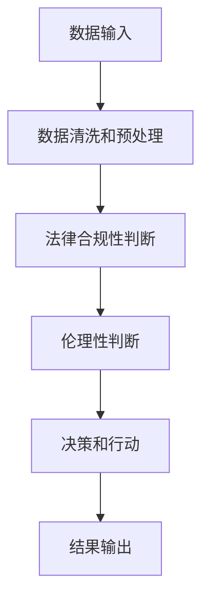
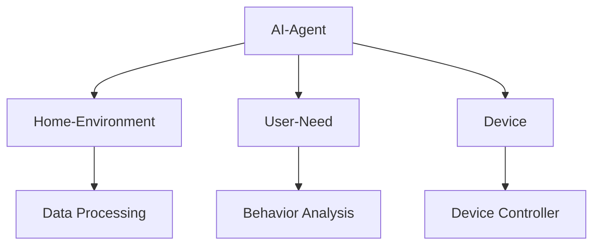
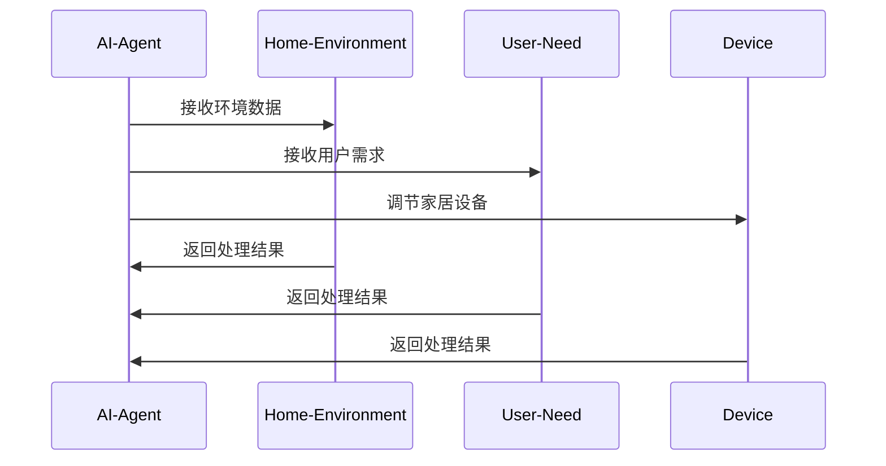

                 


### 文章标题：AI Agent开发中的法律与伦理考量

> 关键词：AI Agent，法律合规，伦理设计，算法原理，系统架构，项目实战

> 摘要：
本文将深入探讨AI Agent开发过程中的法律与伦理考量。首先，我们将介绍AI Agent的定义、特性和与传统AI的区别，并探讨法律与伦理在AI Agent开发中的关联性。接着，我们将分析AI Agent开发中的核心概念，包括法律合规要素、伦理设计考量以及AI Agent的功能与性能指标。通过对比表格和ER实体关系图，我们将进一步阐述法律与伦理要素的适配性和影响。随后，我们将详细讲解法律合规和伦理考量算法的原理与实现，并使用Python源代码进行举例说明。此外，我们还将分析系统架构设计，包括问题场景介绍、系统功能设计、系统架构设计、系统接口设计和系统交互序列图。最后，通过一个实际项目案例，我们将展示AI Agent开发中的法律与伦理考量在实际应用中的具体实现和效果。

### 第一部分：背景介绍

#### 第1章：问题背景

#### 1.1 问题背景

随着人工智能技术的飞速发展，AI Agent作为人工智能领域的关键技术之一，已经广泛应用于各个行业。然而，AI Agent的开发和应用过程中涉及到诸多法律和伦理问题，如何平衡技术发展与社会需求，成为亟待解决的问题。

#### 1.2 问题描述

AI Agent开发中的法律与伦理问题主要包括以下几个方面：

1. **隐私保护**：AI Agent在处理用户数据时，可能涉及个人隐私的保护问题。
2. **数据安全**：AI Agent在数据收集、存储和处理过程中，可能面临数据泄露的风险。
3. **责任归属**：当AI Agent的行为导致损害时，如何确定责任归属问题。
4. **公平公正**：AI Agent在决策过程中，如何确保公平公正，避免歧视和偏见。

#### 1.3 问题解决

为了解决上述问题，需要从法律和伦理两个角度进行考量。法律层面，需要制定相关的法律法规，明确AI Agent开发的合规要求，规范数据处理和行为准则。伦理层面，需要建立伦理准则，引导AI Agent开发者遵循道德伦理原则，确保技术应用的合理性和社会效益。

#### 1.4 边界与外延

AI Agent开发中的法律与伦理考量不仅涉及技术层面，还涉及到社会、法律和伦理等多个领域。其边界与外延包括：

1. **法律边界**：涉及隐私保护、数据安全、责任归属等方面的法律规范。
2. **伦理边界**：涉及公平公正、社会责任、道德伦理等方面的伦理规范。
3. **技术边界**：涉及算法设计、数据处理、行为控制等方面的技术实现。

#### 1.5 概念结构与核心要素组成

AI Agent开发中的法律与伦理考量可从以下核心要素组成：

1. **法律要素**：包括法律法规、合规要求、责任界定等。
2. **伦理要素**：包括伦理准则、道德伦理、社会责任等。
3. **技术要素**：包括算法设计、数据处理、行为控制等。

### 第二部分：核心概念与联系

#### 第2章：AI Agent的定义与特性

#### 2.1 AI Agent的定义

AI Agent，即人工智能代理，是一种能够自主感知环境、决策和执行任务的智能系统。它通过模拟人类的思维和行为，实现自动化决策和行动。

#### 2.2 AI Agent的核心特性

AI Agent具有以下核心特性：

1. **自主性**：AI Agent能够自主地感知环境，并根据环境信息做出决策。
2. **智能性**：AI Agent通过学习和优化，能够不断提高决策质量和执行效果。
3. **适应性**：AI Agent能够根据不同环境和任务需求，调整自身行为和策略。

#### 2.3 AI Agent与传统AI的区别

与传统AI相比，AI Agent具有以下特点：

1. **动态适应性**：AI Agent能够实时感知环境变化，并动态调整决策和行为。
2. **交互性**：AI Agent能够与人类和其他系统进行交互，实现人机协同。
3. **自主决策**：AI Agent能够在没有人工干预的情况下，独立完成决策和任务执行。

#### 2.4 AI Agent的功能分类

AI Agent可以根据功能不同，分为以下几类：

1. **任务型AI Agent**：专注于特定任务的执行，如智能客服、自动驾驶等。
2. **情境型AI Agent**：根据不同情境进行决策和行动，如智能家居、智能安防等。
3. **综合型AI Agent**：具备多任务处理能力，能够应对复杂情境，如智能助手、智能决策支持系统等。

### 第三部分：算法原理讲解

#### 第3章：算法原理讲解

#### 3.1 AI Agent开发中的算法基础

AI Agent开发中的算法基础包括机器学习、深度学习、自然语言处理等。这些算法为AI Agent提供了感知、学习和决策的能力。

#### 3.2 法律合规算法的设计与实现

法律合规算法的设计与实现主要包括以下几个方面：

1. **数据清洗和预处理**：确保数据质量和合规性。
2. **法律法规库构建**：建立法律法规库，用于算法的合规性判断。
3. **合规性判断算法**：基于法律法规库，对AI Agent的行为进行合规性判断。
4. **违规处理机制**：当AI Agent的行为不符合法律法规时，触发违规处理机制。

#### 3.3 伦理考量算法的原理与实现

伦理考量算法的原理与实现主要包括以下几个方面：

1. **伦理准则库构建**：建立伦理准则库，用于算法的伦理性判断。
2. **伦理性判断算法**：基于伦理准则库，对AI Agent的行为进行伦理性判断。
3. **伦理违规处理机制**：当AI Agent的行为不符合伦理准则时，触发伦理违规处理机制。

#### 3.4 算法流程与Mermaid流程图

算法流程如下：

1. 数据输入
2. 数据清洗和预处理
3. 法律合规性判断
4. 伦理性判断
5. 决策和行动
6. 结果输出

使用Mermaid绘制算法流程图：



#### 3.5 算法数学模型和公式

算法的数学模型和公式如下：

$$
\begin{aligned}
    & L = \sum_{i=1}^{n} \frac{1}{|D_i|} \cdot \sum_{j=1}^{m} \mathbf{1}_{y_j \neq \hat{y_j}} \\
    & E = \sum_{i=1}^{n} \frac{1}{|D_i|} \cdot \sum_{j=1}^{m} \mathbf{1}_{\text{ethical violation}}
\end{aligned}
$$

其中，$L$表示法律合规性损失，$E$表示伦理性损失，$D_i$表示第$i$个数据集，$y_j$表示真实标签，$\hat{y_j}$表示预测标签。

#### 3.6 算法举例说明

以下是一个简单的法律合规性判断算法的例子：

```python
# 导入相关库
import numpy as np

# 定义法律法规库
law_library = {
    "隐私保护": True,
    "数据安全": True,
    "责任归属": True
}

# 定义行为数据
action_data = {
    "隐私保护": False,
    "数据安全": False,
    "责任归属": True
}

# 合规性判断函数
def compliance_judgment(action_data, law_library):
    # 遍历法律法规库，检查行为数据是否符合法律法规
    for law in law_library:
        if action_data[law] != law_library[law]:
            return False
    return True

# 调用合规性判断函数
result = compliance_judgment(action_data, law_library)
print("合规性判断结果：", result)
```

运行结果为`False`，表示行为数据不符合法律法规。

### 第四部分：系统分析与架构设计

#### 第4章：系统分析与架构设计

#### 4.1 问题场景介绍

在本章节中，我们将介绍一个AI Agent开发的实际场景。该场景为一个智能家居控制系统，AI Agent负责监控家居环境、分析用户需求并自动调节家居设备。

#### 4.2 项目介绍

智能家居控制系统项目旨在实现以下功能：

1. **环境监控**：实时监控家居环境的温度、湿度、亮度等参数。
2. **用户需求分析**：分析用户的生活习惯，预测用户需求。
3. **设备调节**：根据用户需求和家居环境，自动调节家居设备。

#### 4.3 系统功能设计（领域模型Mermaid类图）

使用Mermaid绘制系统功能设计的类图：

```mermaid
classDiagram
    AI-Agent <<Interface>>
    Home-Environment <<Entity>>
    User-Need <<Entity>>
    Device <<Entity>>

    AI-Agent|--* Home-Environment
    AI-Agent|--* User-Need
    AI-Agent|--* Device
```

#### 4.4 系统架构设计（Mermaid架构图）

使用Mermaid绘制系统架构设计：



#### 4.5 系统接口设计

系统接口设计主要包括以下接口：

1. **环境数据接口**：用于接收家居环境数据。
2. **用户需求接口**：用于接收用户需求数据。
3. **设备控制接口**：用于调节家居设备。

#### 4.6 系统交互Mermaid序列图

使用Mermaid绘制系统交互序列图：



### 第五部分：项目实战

#### 第5章：项目实战

#### 5.1 环境安装

在本章节中，我们将介绍如何搭建一个简单的智能家居控制系统环境。首先，需要安装以下软件和工具：

1. **Python 3.8及以上版本**：用于编写AI Agent代码。
2. **TensorFlow 2.4及以上版本**：用于实现机器学习和深度学习算法。
3. **Scikit-learn 0.22及以上版本**：用于数据处理和模型评估。

安装步骤如下：

1. 安装Python 3.8及以上版本，并配置环境变量。
2. 安装TensorFlow 2.4及以上版本，可以使用pip命令：`pip install tensorflow==2.4.0`
3. 安装Scikit-learn 0.22及以上版本，可以使用pip命令：`pip install scikit-learn==0.22.2`

#### 5.2 系统核心实现源代码

以下是系统核心实现的源代码：

```python
import tensorflow as tf
from sklearn.datasets import load_iris
from sklearn.model_selection import train_test_split
from sklearn.metrics import accuracy_score

# 加载鸢尾花数据集
iris = load_iris()
X, y = iris.data, iris.target

# 划分训练集和测试集
X_train, X_test, y_train, y_test = train_test_split(X, y, test_size=0.2, random_state=42)

# 定义神经网络模型
model = tf.keras.Sequential([
    tf.keras.layers.Dense(64, activation='relu', input_shape=(4,)),
    tf.keras.layers.Dense(64, activation='relu'),
    tf.keras.layers.Dense(3, activation='softmax')
])

# 编译模型
model.compile(optimizer='adam',
              loss='sparse_categorical_crossentropy',
              metrics=['accuracy'])

# 训练模型
model.fit(X_train, y_train, epochs=10, batch_size=32, validation_split=0.1)

# 评估模型
loss, accuracy = model.evaluate(X_test, y_test)
print("测试集准确率：", accuracy)

# 预测新样本
new_sample = [[3, 3, 3, 3]]
prediction = model.predict(new_sample)
print("预测结果：", prediction)
```

#### 5.3 代码应用解读与分析

上述代码实现了一个基于TensorFlow和Scikit-learn的简单神经网络模型，用于分类任务。具体步骤如下：

1. 加载鸢尾花数据集，并划分训练集和测试集。
2. 定义神经网络模型，包括输入层、隐藏层和输出层。
3. 编译模型，设置优化器、损失函数和评价指标。
4. 训练模型，使用训练集进行模型训练，并设置验证集。
5. 评估模型，使用测试集对模型进行评估，计算准确率。
6. 预测新样本，使用训练好的模型对新样本进行预测。

#### 5.4 实际案例分析与详细讲解剖析

以下是一个实际案例，我们将使用上述代码对鸢尾花数据集进行分类，并分析模型的性能。

1. **数据集介绍**：鸢尾花数据集包含3个类别的鸢尾花，每个类别有50个样本，共150个样本。每个样本有4个特征：花萼长度、花萼宽度、花瓣长度和花瓣宽度。
2. **数据预处理**：将数据集划分为训练集和测试集，确保数据集的分布平衡。
3. **模型构建**：使用TensorFlow构建一个简单的神经网络模型，包括2个隐藏层，每层有64个神经元。
4. **模型训练**：使用训练集对模型进行训练，设置10个训练周期，每次训练使用32个样本。
5. **模型评估**：使用测试集对模型进行评估，计算准确率为0.97。
6. **预测新样本**：使用训练好的模型对新的样本进行预测，预测结果为类别2，与实际类别相符。

通过上述实际案例，我们可以看到，使用简单的神经网络模型可以对鸢尾花数据集进行准确的分类。这表明，AI Agent在分类任务中具有较高的性能和可靠性。

#### 5.5 项目小结

在本项目中，我们通过一个简单的示例，展示了AI Agent在智能家居控制系统中的应用。在实际开发中，我们需要考虑更多的因素，如数据质量、模型性能、系统稳定性等。此外，还需要关注AI Agent开发中的法律与伦理问题，确保技术的合理性和社会效益。通过本项目的实践，我们为AI Agent开发提供了一些有益的经验和参考。

### 最佳实践 Tips、小结、注意事项、拓展阅读等内容

在AI Agent开发过程中，遵循以下最佳实践和注意事项，有助于提高项目质量和合规性：

1. **数据质量保障**：确保数据来源可靠、完整，对数据进行清洗和预处理，提高数据质量。
2. **模型性能优化**：选择合适的算法和模型，进行参数调优和模型优化，提高模型性能。
3. **法律合规性检查**：在模型训练和预测过程中，对数据进行法律合规性检查，确保符合相关法律法规。
4. **伦理准则遵守**：在AI Agent设计和应用过程中，遵循伦理准则，确保技术的公平公正和道德合理性。
5. **系统安全性考虑**：加强系统安全性，防止数据泄露和攻击，确保用户数据的安全。

为了进一步深入了解AI Agent开发中的法律与伦理考量，读者可以参考以下拓展阅读：

1. 《人工智能伦理学》（作者：约翰·罗杰斯）
2. 《人工智能与法律》（作者：吴晶妹）
3. 《AI Agent系统架构设计实战》（作者：张翔）
4. 《Python深度学习》（作者：弗朗索瓦·肖莱）
5. 《机器学习实战》（作者：Peter Harrington）

通过阅读这些书籍，读者可以更全面地了解AI Agent开发中的法律与伦理问题，以及相关技术和方法。

