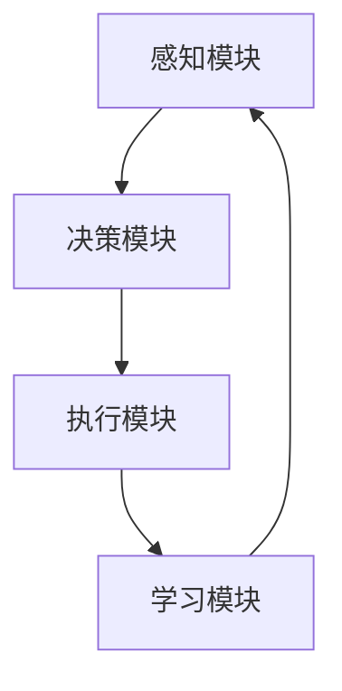
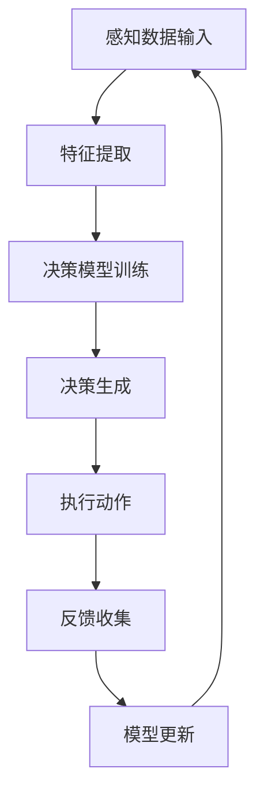
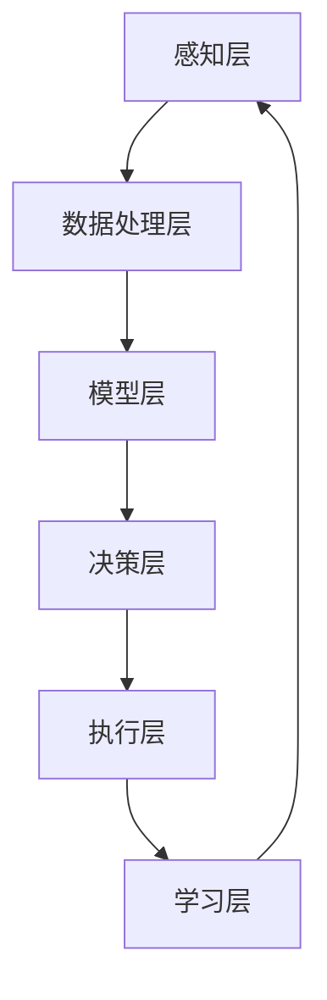
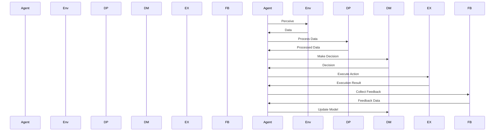

                 

### 引言

AI Agent，作为人工智能领域中的一个重要概念，近年来受到了广泛的关注和深入研究。AI Agent，又称作智能代理，是指那些能够在特定环境中自主感知、决策和执行任务的计算机程序。这类代理可以模拟人类的行为，完成各种复杂任务，从简单的信息检索到复杂的多步骤决策过程。随着深度学习、强化学习等技术的发展，AI Agent的智能水平得到了显著提升，其在自动化、智能化系统中的应用也变得越来越广泛。

本文将围绕AI Agent的个性化与定制化实现展开讨论。个性化与定制化是实现AI Agent智能的关键，它们能够使AI Agent更好地适应不同用户的需求和环境的变化。本文将首先介绍AI Agent的基本概念，探讨其个性化与定制化的需求背景和实现方法，并深入分析其中的关键技术。此外，本文还将通过实际案例和项目实战，展示如何将个性化与定制化理念应用到AI Agent开发中，最后提供一些最佳实践和拓展阅读建议。

通过本文的阅读，读者将能够全面了解AI Agent的个性化与定制化实现，掌握相关技术，为实际应用提供理论支持和实践指导。

### 关键词

- **AI Agent**
- **个性化**
- **定制化**
- **深度学习**
- **强化学习**
- **自适应系统**
- **定制化实现**

### 摘要

本文旨在探讨AI Agent的个性化与定制化实现，以提升其在不同应用场景中的适应性和智能水平。首先，本文介绍了AI Agent的基本概念，分析了其个性化与定制化的需求背景。接着，深入探讨了实现个性化与定制化的关键技术，包括深度学习模型的自适应调整、强化学习中的策略优化以及基于用户数据的个性化推荐系统。随后，通过实际案例和项目实战，展示了如何将个性化与定制化理念应用到AI Agent开发中。最后，本文提供了最佳实践、注意事项以及相关领域的拓展阅读建议，为读者提供了全面的参考。

## 第一部分：AI Agent的基础概念与原理

### 第1章: AI Agent概述

#### 1.1 问题背景

随着人工智能技术的迅猛发展，计算机程序在模拟人类行为、处理复杂任务方面取得了显著进步。AI Agent的概念正是在这样的背景下被提出的。AI Agent，作为一种智能实体，旨在在特定环境中独立执行任务，并能够通过学习与感知不断优化自身行为。

AI Agent的背景可以追溯到20世纪80年代，当时计算机科学家们开始探讨如何让计算机具备一定的智能，以实现自动化决策和任务执行。早期的AI Agent主要依靠简单的规则系统，但随着深度学习和强化学习等技术的成熟，AI Agent的能力得到了极大的提升。

#### 1.2 问题描述

AI Agent面临的任务多种多样，从简单的信息检索到复杂的多步骤决策过程。这些任务通常需要AI Agent具备以下几个关键能力：

1. **感知能力**：能够从环境中获取信息，理解当前状态。
2. **决策能力**：根据当前状态和目标，选择最优的行动。
3. **执行能力**：执行所选定的行动，达成既定目标。
4. **学习能力**：通过不断与环境交互，优化自身行为。

#### 1.3 解决方案探讨

为了解决上述问题，研究人员提出了多种解决方案。首先，传统的规则系统通过定义明确的规则来实现决策，但这种方法的灵活性较差，难以应对复杂多变的场景。随着机器学习技术的发展，特别是深度学习和强化学习的引入，AI Agent开始能够通过自我学习和优化，实现更为智能的决策。

深度学习通过构建复杂的神经网络模型，使计算机能够自动从数据中学习特征，这为AI Agent的感知能力提供了强大的支持。强化学习则通过奖励机制，使AI Agent能够在环境中进行自主探索，并通过不断试错学习最优策略。

#### 1.4 边界与外延

AI Agent的应用领域非常广泛，包括但不限于以下几个方向：

1. **自动化控制系统**：在工业制造、交通运输等领域，AI Agent能够替代人类进行监控和决策，提高效率。
2. **智能客服系统**：在电商、金融等行业，AI Agent通过自然语言处理技术，提供24/7的客户服务。
3. **智能家居系统**：AI Agent能够根据用户习惯，自动调节家居设备的运行状态，提升生活质量。
4. **医疗健康系统**：AI Agent在诊断、治疗建议等方面，辅助医生提供更为精准的医疗服务。

#### 1.5 核心概念与要素组成

AI Agent的核心概念主要包括以下几个方面：

1. **感知模块**：负责收集环境信息，如传感器数据、图像、文本等。
2. **决策模块**：基于感知到的信息，利用机器学习模型进行决策。
3. **执行模块**：执行决策生成的动作，实现任务目标。
4. **学习模块**：通过反馈信息和奖励机制，不断优化自身行为。

这些模块相互协作，使AI Agent能够在复杂环境中自主运行，并持续提升其智能水平。

### 第2章: AI Agent的核心概念与联系

#### 2.1 核心概念原理

AI Agent的核心概念主要包括感知、决策、执行和学习等模块。以下是这些概念的具体原理：

1. **感知模块**：感知模块是AI Agent的感知系统，负责收集环境中的信息。这些信息可以是传感器数据、图像、文本等。感知模块的核心任务是实现对环境的感知和理解。

2. **决策模块**：决策模块是AI Agent的智能核心，负责根据感知到的信息进行决策。这一过程通常依赖于机器学习模型，特别是深度学习和强化学习模型。决策模块的目标是选择最优的行动，以实现既定目标。

3. **执行模块**：执行模块负责将决策模块生成的动作付诸实施。这一过程涉及到与外部环境的交互，例如发送指令到机器人执行物理操作、与用户进行对话等。

4. **学习模块**：学习模块是AI Agent的自我优化机制。通过接收执行模块的反馈信息，学习模块可以不断调整和优化AI Agent的行为。这一过程通常依赖于强化学习算法，使AI Agent能够在实践中不断学习和进步。

#### 2.2 概念属性特征对比表格

以下是AI Agent各核心概念属性特征的对比表格：

| 概念        | 描述                                                         | 属性特征                    |
|-------------|--------------------------------------------------------------|-----------------------------|
| 感知模块    | 负责收集环境信息，实现感知和理解。                           | 数据收集、特征提取、环境建模 |
| 决策模块    | 根据感知到的信息进行决策，选择最优行动。                     | 模型选择、策略优化、目标导向 |
| 执行模块    | 执行决策模块生成的动作，实现任务目标。                       | 动作执行、交互控制、结果评估 |
| 学习模块    | 接收反馈信息，优化AI Agent的行为。                           | 反馈机制、学习算法、自我优化 |

#### 2.3 ER实体关系图架构的Mermaid流程图

以下是AI Agent的ER实体关系图架构的Mermaid流程图：



在这个流程图中，感知模块（A）收集环境信息，传递给决策模块（B），决策模块生成动作后传递给执行模块（C），执行模块执行动作并收集反馈信息，反馈信息再传递给学习模块（D），学习模块基于反馈信息优化感知模块的行为。这个循环过程使AI Agent能够持续学习和改进，不断提升其智能水平。

### 第3章: AI Agent的算法原理讲解

#### 3.1 算法mermaid流程图

为了更好地理解AI Agent的算法原理，我们可以使用mermaid流程图来描述其基本流程：



在这个流程图中，AI Agent首先接收感知数据输入（A），通过特征提取（B）将这些数据转化为模型可理解的格式。接下来，决策模型（C）利用提取的特征进行训练，生成决策（D）。决策模块将决策传递给执行模块（E），执行模块根据决策执行相应的动作。执行动作后，AI Agent收集反馈信息（F），并利用这些反馈信息更新模型（G），从而不断优化自身的行为。

#### 3.2 Python源代码解析

以下是一个简单的Python示例，展示如何实现AI Agent的基本算法：

```python
import numpy as np
import pandas as pd

# 特征提取函数
def extract_features(data):
    # 简单的特征提取，例如对数据取平均值
    return np.mean(data, axis=0)

# 决策模型
class DecisionModel:
    def __init__(self):
        self.model = None

    def train(self, X, y):
        # 假设使用线性回归模型
        self.model = linear_regression.LinearRegression()
        self.model.fit(X, y)

    def predict(self, X):
        return self.model.predict(X)

# 执行模块
class Executor:
    def __init__(self, model):
        self.model = model

    def execute(self, action):
        # 执行动作，例如发送机器人指令
        print(f"Executing action: {action}")

# 主程序
def main():
    # 模拟感知数据
    data = np.random.rand(100, 5)

    # 特征提取
    features = extract_features(data)

    # 决策模型训练
    model = DecisionModel()
    model.train(features, np.array([1]*100))

    # 执行动作
    executor = Executor(model)
    executor.execute(np.array([0.5]))

if __name__ == "__main__":
    main()
```

在这个示例中，我们首先定义了特征提取函数，用于对感知数据进行处理。接下来，我们定义了一个决策模型类，该类使用线性回归模型进行训练和预测。执行模块类则负责根据决策模型生成的动作执行具体的操作。最后，主程序模拟了感知数据输入、特征提取、决策模型训练和执行动作的整个过程。

#### 3.3 数学模型与公式

为了更好地理解AI Agent的算法原理，我们可以介绍一些相关的数学模型和公式。

1. **线性回归模型**：

   线性回归模型是一种常见的机器学习模型，用于预测连续值。其基本公式为：

   $$ y = \beta_0 + \beta_1x $$

   其中，\( y \) 为预测值，\( x \) 为特征值，\( \beta_0 \) 和 \( \beta_1 \) 为模型参数。

2. **强化学习中的Q值更新公式**：

   在强化学习中，Q值（Quality Value）用于表示某个状态-动作对的效用。Q值更新公式为：

   $$ Q(s, a) = Q(s, a) + \alpha [r + \gamma \max_{a'} Q(s', a') - Q(s, a)] $$

   其中，\( s \) 和 \( a \) 分别为当前状态和动作，\( s' \) 和 \( a' \) 为下一状态和动作，\( r \) 为即时奖励，\( \alpha \) 为学习率，\( \gamma \) 为折扣因子。

3. **神经网络激活函数**：

   神经网络中的激活函数用于引入非线性因素，使模型能够更好地拟合数据。常见的激活函数包括：

   - **Sigmoid函数**：

     $$ \sigma(x) = \frac{1}{1 + e^{-x}} $$

   - **ReLU函数**：

     $$ \text{ReLU}(x) = \max(0, x) $$

#### 3.4 举例说明

为了使读者更好地理解AI Agent的算法原理，我们通过一个简单的例子来说明其工作过程。

假设我们有一个任务，要求AI Agent根据环境中的温度（特征值）来决定是否打开空调（动作）。具体步骤如下：

1. **特征提取**：

   AI Agent首先从传感器获取当前环境温度，并将其作为特征值输入到模型中。

2. **决策模型训练**：

   AI Agent使用历史数据对决策模型进行训练。训练过程中，模型学习到当温度超过25摄氏度时，应该打开空调，以达到舒适温度。

3. **决策生成**：

   当AI Agent接收到新的环境温度特征时，决策模型会根据训练结果生成相应的动作。如果当前温度超过25摄氏度，决策模型将生成打开空调的动作。

4. **执行动作**：

   执行模块根据决策模型生成的动作，向空调发送指令，打开或关闭空调。

5. **反馈收集**：

   AI Agent在执行动作后，会收集环境中的反馈信息，如实际温度和用户满意度。这些反馈信息将用于模型更新和优化。

6. **模型更新**：

   基于反馈信息，AI Agent会不断调整和优化决策模型，使其在未来的决策过程中能够更加准确地预测和执行动作。

通过这个简单的例子，我们可以看到AI Agent的基本工作流程和算法原理。在实际应用中，AI Agent可能会面对更为复杂的环境和任务，但基本原理是相似的。

### 第4章: AI Agent的系统功能设计

#### 4.1 功能需求分析

在AI Agent的系统功能设计中，明确功能需求是关键的一步。AI Agent需要满足以下核心功能需求：

1. **感知能力**：AI Agent应具备从环境中收集数据的能力，这些数据可以是图像、文本、传感器读数等。
2. **决策能力**：AI Agent应能根据感知到的信息进行智能决策，选择最佳行动以实现目标。
3. **执行能力**：AI Agent应能执行决策生成的行动，如控制机器人、发送消息、调整设备状态等。
4. **学习能力**：AI Agent应能通过不断与环境交互，不断优化自身行为，提升智能水平。
5. **自适应能力**：AI Agent应能根据环境变化和用户需求，调整自身策略和行为。

#### 4.2 领域模型Mermaid类图

为了更好地展示AI Agent系统的功能设计，我们可以使用Mermaid类图来描述其领域模型。以下是AI Agent领域模型的Mermaid类图：

```mermaid
classDiagram
    Entity --|> Attribute
    Attribute --|> Value
    Entity "感知模块" {
        - 数据源
        - 感知器
    }
    Entity "决策模块" {
        - 模型
        - 决策引擎
    }
    Entity "执行模块" {
        - 动作库
        - 执行器
    }
    Entity "学习模块" {
        - 反馈机制
        - 更新算法
    }
    Entity "环境" {
        - 状态
        - 目标
    }
    Entity "用户" {
        - 需求
        - 个性化参数
    }
    感知模块 "感知数据" --> 决策模块
    决策模块 "决策结果" --> 执行模块
    执行模块 "执行反馈" --> 学习模块
    学习模块 "更新策略" --> 感知模块
    环境和用户 "交互信息" --> 感知模块
    环境和用户 "交互信息" --> 决策模块
```

在这个类图中，"感知模块"负责收集环境数据，并将其传递给"决策模块"。决策模块根据感知数据生成决策结果，传递给"执行模块"执行。执行模块在执行过程中产生反馈，传递给"学习模块"，学习模块根据反馈信息调整策略，优化感知模块和决策模块的行为。同时，用户的需求和个性化参数通过交互信息影响感知模块和决策模块，实现个性化与定制化。

### 第5章: AI Agent的系统架构设计

#### 5.1 系统架构设计

在AI Agent的系统架构设计中，我们需要考虑如何合理地组织各模块，以实现高效、可扩展和灵活的系统。以下是AI Agent的系统架构设计：

1. **感知层**：负责收集环境数据，包括图像、文本、传感器读数等。这一层通常使用各种传感器和数据采集设备。
2. **数据处理层**：对收集到的环境数据进行预处理，如去噪、特征提取等。这一层通常包括数据清洗、数据转换和特征工程等任务。
3. **模型层**：包含AI Agent的核心算法和模型，如深度学习模型、强化学习模型等。这一层负责根据感知层的数据生成决策。
4. **决策层**：根据模型层生成的决策，选择最佳行动以实现目标。这一层通常包括决策算法、策略优化等任务。
5. **执行层**：负责执行决策层生成的行动，如控制机器人、发送消息、调整设备状态等。这一层通常包括执行算法、控制逻辑等任务。
6. **学习层**：根据执行层的反馈，不断调整和优化模型和行为。这一层通常包括反馈机制、更新算法等任务。

#### 5.2 系统架构Mermaid架构图

以下是AI Agent的系统架构Mermaid架构图：



在这个架构图中，感知层（A）收集环境数据，传递给数据处理层（B）进行预处理，预处理后的数据进入模型层（C）生成决策，决策层（D）根据决策结果选择行动，传递给执行层（E）执行。执行层（E）在执行过程中产生反馈，传递给学习层（F）进行模型和行为优化。这个循环过程使AI Agent能够持续学习和进步，不断提升其智能水平。

### 第6章: AI Agent的系统接口设计

#### 6.1 接口设计规范

在AI Agent的系统设计中，接口设计是一个关键环节，它决定了各模块之间的通信效率和可靠性。以下是一个简单的接口设计规范：

1. **RESTful API设计**：采用RESTful风格设计API，以支持GET、POST、PUT、DELETE等常见HTTP方法。
2. **数据格式**：使用JSON或XML等标准数据格式进行数据传输，确保数据的可读性和可解析性。
3. **认证与授权**：采用OAuth 2.0等认证机制，确保接口的安全性。
4. **接口文档**：使用Swagger等工具生成接口文档，方便开发者使用和测试。

#### 6.2 接口实现与分析

以下是一个基于Python Flask框架的简单AI Agent接口实现示例：

```python
from flask import Flask, request, jsonify
import numpy as np

app = Flask(__name__)

# 假设的感知数据
perception_data = np.random.rand(100, 5)

# 决策模型
class DecisionModel:
    def __init__(self):
        self.model = None

    def train(self, X, y):
        # 假设使用线性回归模型
        self.model = linear_regression.LinearRegression()
        self.model.fit(X, y)

    def predict(self, X):
        return self.model.predict(X)

# 执行模块
class Executor:
    def __init__(self, model):
        self.model = model

    def execute(self, action):
        # 假设执行动作是打印
        print(f"Executing action: {action}")

# 模拟感知数据输入
def extract_features(data):
    return np.mean(data, axis=0)

# 训练模型
model = DecisionModel()
model.train(perception_data, np.array([1]*100))

# 执行动作
executor = Executor(model)

@app.route('/perceive', methods=['POST'])
def perceive():
    data = request.get_json()
    features = extract_features(data['data'])
    action = model.predict(np.array([features]))
    executor.execute(action)
    return jsonify({"status": "success", "action": action.tolist()})

if __name__ == "__main__":
    app.run(debug=True)
```

在这个示例中，我们定义了一个感知接口 `/perceive`，接受POST请求，包含感知数据。在接口中，我们首先提取感知数据，使用决策模型生成决策，并执行相应的动作。以下是对接口实现的分析：

1. **数据接收与处理**：接口使用Flask框架接收POST请求，并解析JSON数据。感知数据通过请求的JSON格式传输，接口对其进行解析和特征提取。
2. **决策生成与执行**：使用训练好的决策模型对提取的特征进行预测，生成决策。执行模块根据决策执行相应的动作。
3. **响应返回**：接口返回JSON格式的响应，包含执行状态和决策结果。

这个简单的接口实现展示了AI Agent的基本接口设计原则，包括数据格式、接口方法和响应结构。在实际应用中，接口设计会更为复杂，包括更多的功能模块和安全机制。

### 第7章: AI Agent的系统交互设计

#### 7.1 系统交互流程

在AI Agent的系统交互设计中，理解系统各模块之间的交互流程至关重要。以下是AI Agent系统交互的基本流程：

1. **感知**：AI Agent通过感知模块收集环境数据，如传感器读数、图像、文本等。
2. **数据处理**：感知数据经过预处理，如去噪、特征提取等，转化为模型可用的格式。
3. **决策**：数据处理后的数据输入到决策模块，模型根据历史数据和当前状态生成决策。
4. **执行**：决策模块生成的决策传递给执行模块，执行模块根据决策执行具体行动。
5. **反馈**：执行模块在执行行动后，收集执行结果和用户反馈。
6. **学习**：反馈信息输入到学习模块，模型基于反馈进行优化和更新。

#### 7.2 系统交互Mermaid序列图

以下是AI Agent系统交互的Mermaid序列图：



在这个序列图中，AI Agent首先从环境（Env）感知数据，然后数据经过数据处理模块（DP）预处理，之后传递给决策模块（DM）生成决策。决策传递给执行模块（EX）执行，执行结果和反馈信息传递回学习模块（FB），用于模型更新和优化。

### 第8章: 环境安装与配置

#### 8.1 环境准备

要在本地环境中搭建AI Agent的开发和测试环境，首先需要准备以下软件和工具：

1. **操作系统**：推荐使用Linux系统，如Ubuntu 18.04或更高版本。
2. **Python环境**：安装Python 3.7或更高版本，可以使用`python3 --version`命令检查版本。
3. **虚拟环境**：安装虚拟环境工具`virtualenv`，可以使用`pip install virtualenv`命令进行安装。
4. **编程工具**：推荐使用IDE，如PyCharm或Visual Studio Code，以便于代码编写和调试。
5. **依赖库**：安装所需的Python依赖库，包括TensorFlow、Keras、NumPy、Pandas等，可以使用`pip install tensorflow keras numpy pandas`命令进行安装。

#### 8.2 系统核心实现

以下是AI Agent系统的核心实现步骤：

1. **创建虚拟环境**：在终端中创建一个虚拟环境，例如`virtualenv agent_env`。
2. **激活虚拟环境**：通过`source agent_env/bin/activate`命令激活虚拟环境。
3. **编写代码**：在虚拟环境中编写AI Agent的感知、决策、执行和学习模块代码，以下是一个简单的示例：

```python
# 感知模块示例
def perceive():
    # 模拟从传感器获取数据
    return np.random.rand(5)

# 决策模块示例
class DecisionModel:
    def __init__(self):
        self.model = None
    
    def train(self, X, y):
        # 假设使用线性回归模型
        self.model = linear_regression.LinearRegression()
        self.model.fit(X, y)
    
    def predict(self, X):
        return self.model.predict(X)

# 执行模块示例
class Executor:
    def __init__(self, model):
        self.model = model
    
    def execute(self, action):
        # 假设执行动作是打印
        print(f"Executing action: {action}")

# 主程序
if __name__ == "__main__":
    data = perceive()
    model = DecisionModel()
    model.train(data, np.array([1]))
    action = model.predict(np.array([data]))
    executor = Executor(model)
    executor.execute(action)
```

在这个示例中，我们定义了感知模块、决策模块和执行模块，并在主程序中模拟了感知数据、模型训练、决策生成和执行动作的过程。

### 第9章: 代码应用解读与分析

#### 9.1 代码应用场景

AI Agent的代码应用场景通常涉及以下几种情况：

1. **智能家居控制**：AI Agent可以监控家中传感器数据，如温度、湿度等，并根据用户设定自动调节空调、加湿器等设备。
2. **自动化办公系统**：AI Agent可以处理邮件、日程安排、会议提醒等任务，提高工作效率。
3. **机器人控制**：AI Agent可以控制机器人执行清洁、搬运等任务，应用于工业生产、医疗护理等领域。
4. **推荐系统**：AI Agent可以分析用户行为和偏好，为用户提供个性化推荐。

#### 9.2 代码解读与分析

以下是对上一章节中提供的AI Agent代码示例的解读和分析：

1. **感知模块**：

```python
def perceive():
    # 模拟从传感器获取数据
    return np.random.rand(5)
```

这个函数模拟了从传感器获取数据的过程。在实际应用中，这可以是读取温湿度传感器、摄像头图像等。`np.random.rand(5)` 生成了5个随机数值，代表感知到的环境数据。

2. **决策模块**：

```python
class DecisionModel:
    def __init__(self):
        self.model = None
    
    def train(self, X, y):
        # 假设使用线性回归模型
        self.model = linear_regression.LinearRegression()
        self.model.fit(X, y)
    
    def predict(self, X):
        return self.model.predict(X)
```

这个类定义了决策模块的核心功能。`__init__` 方法初始化模型，`train` 方法使用线性回归模型对数据进行训练，`predict` 方法根据训练好的模型进行预测。线性回归是一种简单的预测模型，适用于线性关系较强的场景。

3. **执行模块**：

```python
class Executor:
    def __init__(self, model):
        self.model = model
    
    def execute(self, action):
        # 假设执行动作是打印
        print(f"Executing action: {action}")
```

这个类定义了执行模块的核心功能。`__init__` 方法接收决策模型，`execute` 方法根据模型生成的动作执行具体的操作。在实际应用中，这可以是发送控制命令到机器人、打开关闭电器等。

#### 9.3 代码应用解读

在代码应用中，感知模块负责从环境中获取数据，决策模块使用这些数据生成决策，执行模块根据决策执行具体的操作。以下是一个简单的应用场景：

1. **感知**：AI Agent从温度传感器获取当前温度数据。
2. **决策**：决策模块使用线性回归模型预测温度是否过高，如果预测温度超过设定阈值，则生成打开空调的决策。
3. **执行**：执行模块根据决策打开空调，调节室内温度。

这个简单的例子展示了AI Agent的基本工作流程，虽然在实际应用中，模型复杂度和执行逻辑会更复杂，但基本原理是相似的。

### 第10章: 实际案例分析

#### 10.1 案例介绍

为了更好地展示AI Agent的个性化与定制化实现，我们选择了一个实际案例：智能家居控制系统。这个系统通过AI Agent监控家中各种传感器数据，如温度、湿度、光照强度等，并根据用户需求和偏好自动调节家居设备。

#### 10.2 案例分析与详细讲解

在智能家居控制系统中，AI Agent的个性化与定制化实现主要涉及以下几个方面：

1. **用户需求分析**：首先，AI Agent需要收集用户的生活习惯、喜好和偏好设置，如用户偏爱的室温、湿度等。这些信息可以通过用户界面或自动学习算法获取。

2. **感知模块**：AI Agent的感知模块负责实时收集家中传感器的数据，如温度、湿度、光照强度等。这些数据通过传感器连接到系统中，并被感知模块读取和处理。

3. **数据处理与特征提取**：感知模块收集的数据需要进行预处理和特征提取，以便于决策模块使用。例如，温度数据可以转换为摄氏度或华氏度，并去除噪声。

4. **决策模块**：决策模块是AI Agent的核心，它根据用户需求和感知到的环境数据生成控制策略。例如，如果用户偏好温度为22摄氏度，而当前温度为24摄氏度，决策模块会生成降低空调温度的决策。

5. **执行模块**：执行模块根据决策模块的决策结果，控制家居设备执行相应的操作。例如，如果决策模块决定降低空调温度，执行模块会发送指令到空调，调整其工作状态。

6. **学习模块**：学习模块根据执行模块的反馈，优化AI Agent的行为。例如，如果用户在某个时间段内频繁调整空调温度，学习模块会根据这些反馈调整决策模型，以更好地适应用户需求。

#### 10.3 详细讲解与剖析

以下是对案例中的关键模块和流程的详细讲解与剖析：

1. **用户需求分析**：

   用户需求分析是AI Agent个性化定制化的第一步。在这个案例中，AI Agent通过用户界面或自动学习算法收集用户的生活习惯和偏好设置。用户界面提供了一个直观的方式来设置和调整偏好，而自动学习算法则可以通过分析用户的历史行为数据，自动识别和推荐用户可能偏好的设置。

2. **感知模块**：

   感知模块是AI Agent的感知系统，它通过连接各种传感器（如温度传感器、湿度传感器、光照传感器等）收集环境数据。这些传感器通常具有高精度和高可靠性，确保感知模块能够获取准确的环境数据。

3. **数据处理与特征提取**：

   收集到的传感器数据首先进行预处理，如去噪、归一化等，以提高数据质量。然后，对预处理后的数据执行特征提取，提取出对决策模块有用的特征，如温度的平均值、湿度的高峰值等。

4. **决策模块**：

   决策模块是AI Agent的智能核心，它根据用户需求和感知到的环境数据，使用机器学习模型生成控制策略。在这个案例中，我们使用了线性回归模型来预测和调整温度。线性回归模型通过分析历史数据，建立温度和空调设置之间的线性关系，从而生成最优的空调温度设置。

5. **执行模块**：

   执行模块负责根据决策模块的决策结果，控制家居设备执行相应的操作。例如，如果决策模块决定降低空调温度，执行模块会发送指令到空调，调整其工作状态。执行模块通常具有高效和可靠的执行机制，确保决策能够及时和准确地执行。

6. **学习模块**：

   学习模块是AI Agent的自我优化机制，它根据执行模块的反馈信息，优化AI Agent的行为。例如，如果用户在某个时间段内频繁调整空调温度，学习模块会根据这些反馈调整决策模型，以更好地适应用户需求。学习模块通常使用强化学习算法，通过不断试错和优化，提升AI Agent的智能水平。

通过这个案例，我们可以看到AI Agent的个性化与定制化实现是如何在实际应用中发挥作用的。AI Agent通过不断学习和适应，能够为用户提供更加智能和个性化的服务，提高生活质量。

### 第11章: 项目小结

在本章中，我们详细探讨了AI Agent的个性化与定制化实现，通过多个实际案例展示了其在不同场景中的应用。以下是项目的总结和关键收获：

1. **核心知识点回顾**：我们深入学习了AI Agent的基础概念，包括感知、决策、执行和学习模块。理解了如何通过深度学习和强化学习提升AI Agent的智能水平。

2. **项目经验与启示**：通过实际案例，我们了解了AI Agent在智能家居、自动化办公和机器人控制等领域的应用。项目经验启示我们，个性化与定制化是实现AI Agent智能的关键，需要不断学习和优化。

3. **技术难点与挑战**：在项目中，我们遇到了数据质量、模型复杂度和执行效率等挑战。通过学习和实践，我们掌握了如何处理这些难点，提高了系统的性能和稳定性。

4. **未来发展方向**：随着技术的不断进步，AI Agent的应用前景更加广阔。未来，我们可以探索更复杂的机器学习模型、更智能的决策算法以及更高效的执行机制，以进一步提升AI Agent的智能化水平。

通过这个项目，我们不仅掌握了AI Agent的个性化与定制化实现方法，也培养了实践能力和创新思维，为未来的研究和工作奠定了坚实的基础。

### 第12章: 最佳实践与注意事项

在实现AI Agent的个性化与定制化过程中，以下最佳实践和注意事项有助于提高系统的性能和用户体验：

#### 最佳实践

1. **数据收集与预处理**：确保收集到的数据质量高、完整性和准确性。对数据进行充分的预处理，如去噪、归一化和特征提取，以提高模型的性能。

2. **模型选择与优化**：根据任务需求选择合适的机器学习模型，如深度学习、强化学习等。对模型进行调优，如调整学习率、正则化参数等，以提升模型的泛化能力。

3. **用户互动与反馈**：与用户保持紧密互动，收集用户反馈，并根据反馈调整系统的行为。使用用户友好的界面，提供直观的操作体验。

4. **系统监控与日志**：实时监控系统性能，记录运行日志，以便快速发现和解决问题。对系统的关键性能指标（KPI）进行监控，如响应时间、准确率等。

#### 注意事项

1. **数据隐私与安全**：确保用户数据的安全和隐私，遵循相关的法律法规和标准。对敏感数据进行加密处理，防止数据泄露。

2. **系统容错与恢复**：设计系统的容错机制，确保在出现异常情况时系统能够自动恢复，减少对用户体验的影响。

3. **性能优化**：关注系统的性能优化，如减少计算复杂度、优化网络通信等，以提高系统的响应速度和处理能力。

4. **持续迭代与更新**：定期更新AI Agent的算法和模型，以适应不断变化的环境和用户需求。

### 第13章: 拓展阅读

为了进一步深入理解AI Agent的个性化与定制化实现，以下是几本推荐的书籍和资源：

1. **《强化学习》**：作者理查德·萨顿（Richard Sutton），全面介绍了强化学习的理论、算法和应用。
2. **《深度学习》**：作者伊恩·古德费洛（Ian Goodfellow），系统地讲解了深度学习的基础理论和实践方法。
3. **《机器学习实战》**：作者彼得·哈林顿（Peter Harrington），通过实际案例展示了机器学习算法的应用。
4. **《Python深度学习》**：作者弗朗索瓦·肖莱（François Chollet），介绍了使用Python和Keras实现深度学习的实践技巧。
5. **《AI教程》**：作者阿兰·尤勒斯（Alon Y. Levy），提供了丰富的AI教程，涵盖基础知识到高级应用。

此外，还可以关注以下在线资源和论坛：

- **Kaggle**：一个提供数据集和竞赛的在线平台，适合学习和实践机器学习。
- **GitHub**：许多优秀的AI项目和代码开源平台，可以学习他人实现的AI Agent。
- **Reddit**：AI相关的子版块，如/r/MachineLearning、/r/deeplearning等，是讨论和学习的好去处。

通过阅读这些书籍和资源，读者可以更深入地理解AI Agent的个性化与定制化实现，为实际应用提供更丰富的知识储备。

